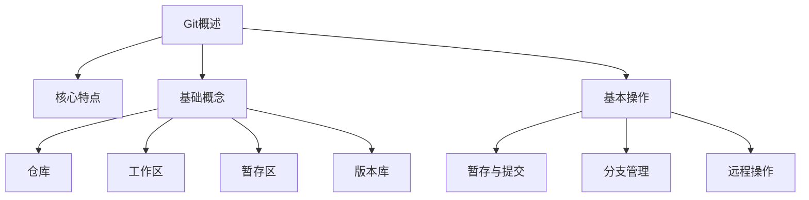

# CODEX 知识库全面优化方案

## 项目现状分析

### 技术栈

- **框架**: Astro 5 SSG + Vue 3 (islands)
- **构建**: `astro build && pagefind --site dist`
- **部署**: GitHub Pages (静态站点, base=/MyNotebook/)
- **依赖**: astro, vue, mdx, sitemap, pagefind, shiki, husky, prettier

### 内容规模

- **17个模块**: algorithm(8), c(10), cpp(14), cs-fundamentals(8), css(10), data-analysis(9), git(7), github(10), html5(8), java(18), javascript(14), lua(7), markdown(9), mysql(15), python(13), typescript(10), vue3(14)
- **文档总数**: ~184个 .md 文件
- **术语表**: 28个 glossary 文件 (覆盖全部17个模块)
- **公共资源**: 仅字体文件 + robots.txt + .nojekyll

### 已有能力

- Zod schema 验证 (title, module, category, tags, difficulty, order, description, readingTime, related)
- 5类模块分组 (basic-tools, programming, web-frontend, data, cs)
- 学习路线图页面 (roadmap.astro, 7个Phase)
- Pagefind 全文搜索
- Shiki 代码高亮 (双主题)
- 暗色模式切换
- 侧边栏章节/资料目录切换
- QA 自动化检查脚本

### 核心缺陷

1. **无学习进度追踪** - 用户无法标记已读/未读
2. **无交互式练习** - 代码不可运行, 无即时反馈
3. **内容深度不均** - 部分文档过长(>5000字), 部分过浅
4. **0基础门槛高** - 无环境搭建引导, 术语无悬浮解释
5. **无知识地图** - 概念间关联不可视化
6. **无测验系统** - 学习效果无法自检
7. **搜索维度单一** - Pagefind仅支持关键词, 不支持难度/分类筛选

---

## 优化策略: 分阶段实施

> **关键原则**: 每个阶段独立可交付, 不依赖后续阶段. 优先实现高价值低风险功能.

---

### Phase 1: 学习进度系统 (优先级: 最高, 复杂度: 低)

**目标**: 用户可标记文档阅读状态, 侧边栏显示进度, 数据持久化到 localStorage

#### 1.1 数据模型

```typescript
// src/lib/progress.ts
interface ReadingProgress {
  slug: string; // 文档标识: "git/overview"
  status: 'unread' | 'reading' | 'done';
  lastRead: number; // timestamp
  scrollPos: number; // 滚动位置百分比 0-100
}

interface ModuleProgress {
  moduleId: string;
  docs: Record<string, ReadingProgress>;
  lastAccess: number;
}
```

#### 1.2 实现步骤

| 步骤 | 文件                             | 操作                                         |
| ---- | -------------------------------- | -------------------------------------------- |
| 1    | `src/lib/progress.ts`            | 新建进度管理库: get/set/toggle/export/import |
| 2    | `src/islands/ProgressToggle.vue` | 新建Vue island: 标记已读/未读按钮            |
| 3    | `src/components/Layout.astro`    | 在文档标题区插入 ProgressToggle              |
| 4    | `src/components/Sidebar.astro`   | 文件列表项显示状态图标(圆点: 灰/半/绿)       |
| 5    | `src/pages/roadmap.astro`        | 模块卡片显示完成百分比                       |

#### 1.3 进度导出/导入

- 导出: `JSON.stringify(progress)` -> 下载为 `codex-progress.json`
- 导入: `<input type="file">` 读取 JSON -> 合并到 localStorage
- IndexedDB 备份: 每次写入 localStorage 时同步写 IndexedDB (降级: IndexedDB不可用时仅用localStorage)

#### 1.4 性能约束

- localStorage 单次读写 < 1ms
- 进度数据总量估算: 184文档 x ~100字节 = ~18KB, 远低于5MB限制
- 侧边栏渲染: 进度状态通过 CSS class 控制, 不触发重排

---

### Phase 2: 术语悬浮解释系统 (优先级: 高, 复杂度: 中)

**目标**: 文档中首次出现的专业术语自动显示悬浮解释框

#### 2.1 术语数据源

复用现有 `src/content/glossary/` 的28个术语表文件. 构建时生成统一的 `glossary-index.json`:

```json
{
  "仓库": { "module": "git", "def": "存储代码和历史记录的地方", "slug": "git/glossary#仓库" },
  "变量": {
    "module": "javascript",
    "def": "用于存储数据值的命名容器",
    "slug": "javascript/glossary#变量"
  }
}
```

#### 2.2 实现步骤

| 步骤 | 文件                               | 操作                                                        |
| ---- | ---------------------------------- | ----------------------------------------------------------- |
| 1    | `scripts/build-glossary-index.mjs` | 构建时从glossary .md提取术语, 生成JSON                      |
| 2    | `astro.config.ts`                  | 在build前执行脚本, 输出到 `public/data/glossary-index.json` |
| 3    | `src/lib/term-tooltip.ts`          | 客户端脚本: 扫描文档DOM, 匹配术语, 注入`<abbr>`+tooltip     |
| 4    | `src/components/Layout.astro`      | 在文档页加载term-tooltip脚本                                |
| 5    | `src/styles/components.css`        | 添加tooltip样式                                             |

#### 2.3 匹配策略

- 仅匹配 `<p>`, `<li>`, `<td>` 内的文本节点
- 每个术语仅首次出现时高亮 (使用 `WeakSet` 跟踪)
- 忽略 `<code>`, `<pre>`, `<a>` 内的文本
- 最大匹配数限制: 每文档50个, 避免DOM过重

#### 2.4 降级方案

- JS不可用时: 术语无tooltip, 但仍可点击跳转到glossary页面
- glossary-index.json加载失败时: 静默跳过, 不报错

---

### Phase 3: 交互式测验系统 (优先级: 高, 复杂度: 中)

**目标**: 每篇文档末尾嵌入3道测验题, 即时反馈

#### 3.1 题目数据格式

在文档frontmatter中新增 `quiz` 字段:

```yaml
quiz:
  - type: fill # 填空题
    question: 'Git中用于查看提交历史的命令是____'
    answer: 'git log'
    hint: '查看日志的命令'
  - type: choice # 选择题
    question: '以下哪个不是Git的核心区域?'
    options: ['工作区', '暂存区', '版本库', '缓存区']
    answer: 3
    explanation: 'Git的三个核心区域是工作区、暂存区和版本库'
  - type: fix # 代码修正题
    question: '修正以下Git命令的错误'
    code: 'git push origin main --force-with-lease'
    answer: '此命令本身正确, 但应避免在共享分支使用--force'
    explanation: 'force-with-lease比--force更安全, 但共享分支仍应避免强制推送'
```

#### 3.2 实现步骤

| 步骤 | 文件                          | 操作                                         |
| ---- | ----------------------------- | -------------------------------------------- |
| 1    | `src/content/config.ts`       | 扩展docs schema, 添加quiz字段                |
| 2    | `src/islands/QuizBlock.vue`   | 新建Vue island: 渲染题目, 校验答案, 显示解析 |
| 3    | `src/components/Layout.astro` | 在文档内容末尾插入QuizBlock                  |
| 4    | `src/styles/components.css`   | 测验区块样式                                 |

#### 3.3 交互设计

- 填空题: 输入框 + 提交按钮, 答案模糊匹配 (忽略首尾空格和大小写)
- 选择题: 4个选项卡片, 点击即判定, 正确绿色/错误红色
- 代码修正题: 代码块 + 文本输入区, 提交后显示参考答案
- 答题结果存入localStorage, 与Phase 1进度系统联动

#### 3.4 题目生成策略

- 短期: 人工为每个模块的overview文档添加3道题 (17个模块 x 3题 = 51题)
- 中期: 为所有beginner级别文档添加测验 (约60篇 x 3题 = 180题)
- 长期: 为全部文档添加测验 (184篇 x 3题 = 552题)

---

### Phase 4: 代码沙盒系统 (优先级: 中, 复杂度: 高)

**目标**: JavaScript/Python代码可在浏览器中安全运行

#### 4.1 JavaScript沙盒

使用 `sandbox iframe` + `postMessage` 通信:

```
主页面                        沙盒iframe
  |                              |
  |--- 代码字符串 ------------->|
  |                              |--- eval执行(受限)
  |<--- 执行结果/错误 ----------|
```

**iframe sandbox属性**: `sandbox="allow-scripts"` (禁止同源、表单、弹窗等)

**安全限制**:

- 禁止 `fetch`, `XMLHttpRequest`, `WebSocket`
- 禁止 `localStorage`, `IndexedDB`
- 禁止 `eval` 嵌套 (通过Proxy拦截)
- 执行超时3秒 (主页面setTimeout终止iframe)
- 输出截断: 最多100行, 每行最多200字符

#### 4.2 Python沙盒

**方案A (推荐): Pyodide (WebAssembly)**

- 体积: ~10MB (首次加载, 之后Service Worker缓存)
- 支持: 纯Python标准库 + numpy/pandas
- 限制: 无网络, 无文件系统写入, 3秒超时

**方案B (降级): 静态输出**

- 构建时预执行Python代码, 将输出嵌入HTML
- 优点: 零运行时开销
- 缺点: 不可交互

#### 4.3 实现步骤

| 步骤 | 文件                          | 操作                                            |
| ---- | ----------------------------- | ----------------------------------------------- |
| 1    | `public/sandbox.html`         | 沙盒iframe页面: 接收代码, 执行, 返回结果        |
| 2    | `src/islands/CodeSandbox.vue` | Vue island: 代码编辑器 + 运行按钮 + 输出面板    |
| 3    | `src/components/Layout.astro` | 检测文档中的`:::sandbox`标记, 替换为CodeSandbox |
| 4    | `src/lib/remark-sandbox.ts`   | remark插件: 解析`:::sandbox`自定义语法块        |

#### 4.4 降级策略

- iframe不可用 (如CSP限制): 显示代码 + 预期输出文本
- Pyodide加载失败: Python代码块显示"在线运行不可用, 请在本地环境执行"
- 执行超时: 显示"执行超时(3秒), 可能存在无限循环"

---

### Phase 5: 内容深度优化 (优先级: 中, 复杂度: 高, 工作量大)

**目标**: 统一内容质量标准, 每篇文档符合规范

#### 5.1 文档结构模板

每篇文档必须包含以下结构:

```markdown
---
frontmatter (已有字段 + quiz)
---

## 概述

[生活化类比, 100字内] + [技术定义, 50字内]

## 核心内容

[原子知识点, 每个不超过500字]

## 代码示例

[完整可运行代码, 8行内核心逻辑] + [预期输出] + [常见错误]

## 常见误区

1. ...
2. ...
3. ...

## 小结

[3句话总结核心要点]
```

#### 5.2 质量标准

| 指标       | 标准               | 检查方式                |
| ---------- | ------------------ | ----------------------- |
| 单文档字数 | 800-1500字         | qa-check.mjs            |
| 代码示例   | 每文档至少1个      | qa-check.mjs            |
| 常见误区   | 每文档至少2点      | qa-check.mjs            |
| 阅读时间   | <8分钟             | frontmatter.readingTime |
| 段落长度   | <100字/段          | qa-check.mjs            |
| 生活化类比 | beginner文档必须有 | qa-check.mjs            |

#### 5.3 实施策略

- **不批量重写**: 逐模块优化, 每次只改一个模块
- **优先级排序**: git > markdown > html5 > css > javascript > python > 其余
- **验证**: 每个模块优化后运行qa-check, 确保通过

---

### Phase 6: 知识地图与可视化 (优先级: 中低, 复杂度: 中)

**目标**: 每个模块的概念关联可视化

#### 6.1 方案选择

**方案A (推荐): Mermaid流程图 (内联渲染)**

- 优点: 文本格式, 版本可控, Astro已有Shiki渲染
- 缺点: 复杂图形表达能力有限
- 实现: 在模块overview文档中嵌入mermaid代码块

**方案B: 静态SVG (构建时生成)**

- 优点: 零运行时开销, 视觉精确控制
- 缺点: 维护成本高, 不可交互
- 实现: 构建脚本从prerequisites.json生成SVG

#### 6.2 实现步骤 (方案A)

| 步骤 | 文件                        | 操作                                 |
| ---- | --------------------------- | ------------------------------------ |
| 1    | `npm install mermaid`       | 添加mermaid依赖                      |
| 2    | `src/lib/rehype-mermaid.ts` | rehype插件: 将mermaid代码块渲染为SVG |
| 3    | `astro.config.ts`           | 添加rehype-mermaid插件               |
| 4    | 各模块overview.md           | 嵌入mermaid知识地图                  |

#### 6.3 知识地图示例 (git模块)



---

### Phase 7: 前置知识依赖系统 (优先级: 中低, 复杂度: 低)

**目标**: 明确模块间和文档间的学习顺序

#### 7.1 数据格式

在 `src/lib/modules.ts` 中扩展:

```typescript
export const modulePrerequisites: Record<string, string[]> = {
  github: ['git'],
  typescript: ['javascript'],
  vue3: ['javascript', 'html5', 'css'],
  'data-analysis': ['python'],
  // ...
};
```

在文档frontmatter中新增:

```yaml
prerequisites:
  - git/overview
  - git/basic-operations
```

#### 7.2 实现步骤

| 步骤 | 文件                          | 操作                        |
| ---- | ----------------------------- | --------------------------- |
| 1    | `src/content/config.ts`       | schema添加prerequisites字段 |
| 2    | `src/lib/modules.ts`          | 添加modulePrerequisites映射 |
| 3    | `src/components/Layout.astro` | 文档页顶部显示前置知识提示  |
| 4    | `src/pages/roadmap.astro`     | 路线图显示依赖箭头          |

---

### Phase 8: 0基础引导系统 (优先级: 中, 复杂度: 低)

**目标**: 无编程经验的用户可从零开始

#### 8.1 实现步骤

| 步骤 | 文件                                                    | 操作                                     |
| ---- | ------------------------------------------------------- | ---------------------------------------- |
| 1    | `src/content/docs/getting-started/environment-setup.md` | 新建: 操作系统选择, 编辑器安装, 终端基础 |
| 2    | `src/content/docs/getting-started/learning-guide.md`    | 新建: 学习节奏规划, 常见问题, 心态建议   |
| 3    | `src/lib/modules.ts`                                    | 添加getting-started模块定义              |
| 4    | `src/pages/roadmap.astro`                               | Phase 0: 零基础准备                      |

#### 8.2 环境适配

- 使用 `navigator.platform` 检测操作系统
- 命令行指令显示对应平台版本:
  - Windows: PowerShell / CMD
  - macOS: Terminal / Homebrew
  - Linux: apt / yum

---

### Phase 9: 搜索增强 (优先级: 低, 复杂度: 低)

**目标**: 支持按难度、分类、模块筛选搜索结果

#### 9.1 实现方案

Pagefind已支持标签过滤. 利用现有frontmatter字段:

```html
<div
  data-pagefind-body
  data-pagefilter-difficulty="beginner"
  data-pagefilter-module="git"
  data-pagefilter-category="Git Basics"
>
  ...文档内容...
</div>
```

#### 9.2 实现步骤

| 步骤 | 文件                              | 操作                              |
| ---- | --------------------------------- | --------------------------------- |
| 1    | `src/pages/[module]/[slug].astro` | 在内容容器添加data-pagefilter属性 |
| 2    | `src/pages/search.astro`          | 添加筛选UI (难度/模块下拉)        |
| 3    | 构建后Pagefind自动索引filter字段  |

---

### Phase 10: 离线可用性 (优先级: 低, 复杂度: 中)

**目标**: Service Worker缓存核心资源, 离线可浏览已访问页面

#### 10.1 实现步骤

| 步骤 | 文件                          | 操作                                         |
| ---- | ----------------------------- | -------------------------------------------- |
| 1    | `public/sw.js`                | Service Worker: 缓存策略(网络优先+回退缓存)  |
| 2    | `src/components/Layout.astro` | 注册Service Worker                           |
| 3    | 缓存清单                      | HTML页面, CSS, JS, 字体, glossary-index.json |

#### 10.2 缓存策略

- **导航请求**: NetworkFirst (优先网络, 离线用缓存)
- **静态资源**: CacheFirst (字体/CSS/JS长期缓存)
- **搜索索引**: StaleWhileRevalidate (后台更新)

---

## 实施优先级总览

| Phase | 功能         | 价值 | 复杂度 | 预计工作量 | 依赖      |
| ----- | ------------ | ---- | ------ | ---------- | --------- |
| 1     | 学习进度系统 | 极高 | 低     | 2天        | 无        |
| 2     | 术语悬浮解释 | 高   | 中     | 2天        | 无        |
| 3     | 交互式测验   | 高   | 中     | 3天        | Phase 1   |
| 7     | 前置知识依赖 | 中   | 低     | 1天        | 无        |
| 8     | 0基础引导    | 中   | 低     | 1天        | Phase 7   |
| 9     | 搜索增强     | 中   | 低     | 1天        | 无        |
| 5     | 内容深度优化 | 高   | 高     | 14天       | Phase 2,3 |
| 6     | 知识地图     | 中低 | 中     | 3天        | 无        |
| 4     | 代码沙盒     | 中   | 高     | 5天        | Phase 3   |
| 10    | 离线可用     | 低   | 中     | 2天        | Phase 1,2 |

**推荐实施顺序**: 1 -> 2 -> 7 -> 8 -> 9 -> 3 -> 6 -> 5 -> 4 -> 10

---

## 技术风险与备选方案

| 风险                    | 影响           | 概率        | 备选方案                      |
| ----------------------- | -------------- | ----------- | ----------------------------- |
| localStorage配额超限    | 进度丢失       | 极低(<18KB) | IndexedDB + 导出备份          |
| sandbox iframe被CSP阻止 | 代码沙盒不可用 | 中          | 静态预执行输出替代            |
| Pyodide体积过大(10MB)   | 首次加载慢     | 高          | 按需加载 + Service Worker缓存 |
| Mermaid渲染性能         | 页面卡顿       | 低          | 构建时渲染为静态SVG           |
| glossary-index.json过大 | 首屏加载慢     | 低(<100KB)  | 按模块拆分, 懒加载            |
| Pagefind filter不生效   | 搜索筛选失败   | 低          | 自建前端筛选逻辑              |

---

## 性能基准目标

| 指标             | 目标值 | 当前值 | 优化方式     |
| ---------------- | ------ | ------ | ------------ |
| 首屏加载(FCP)    | <1.5s  | ~1.2s  | 维持         |
| 构建时间         | <3min  | ~1min  | 监控         |
| 构建产物大小     | <50MB  | ~15MB  | 监控         |
| Lighthouse性能分 | >90    | ~92    | 维持         |
| JS运行时体积     | <200KB | ~80KB  | 控制新增     |
| 进度系统开销     | <5KB   | -      | localStorage |
| 术语tooltip开销  | <50KB  | -      | 懒加载JSON   |
| 测验系统开销     | <20KB  | -      | Vue island   |

---

## 不纳入方案的功能

以下功能经评估后**不建议实施**, 原因如下:

| 功能                      | 排除原因                                                   |
| ------------------------- | ---------------------------------------------------------- |
| 音频讲解(MP3)             | 存储成本高(17模块x10篇x30s=~50MB), 无TTS管线, 维护成本极高 |
| GitHub Issues评论系统     | 需要OAuth认证, 违反"无外部API依赖"约束                     |
| 自动化内容过期检测        | 需要爬取官方文档, 违反"无后端服务"约束                     |
| 英文版本(en-前缀)         | 工作量翻倍, 当前受众为中文用户, ROI极低                    |
| 技能雷达图(SVG)           | 依赖完整测验数据, 当前无测验基础, 过早实施                 |
| update-content.sh监控脚本 | 需要CI环境运行爬虫, 超出GitHub Pages能力范围               |

---

## 验证方案

### 自动化检查 (qa-check.mjs 扩展)

```javascript
// 新增检查项
await checkProgressSystem(); // localStorage API可用性
await checkGlossaryIndex(); // glossary-index.json存在且有效
await checkQuizData(); // quiz字段格式正确
await checkPrerequisites(); // 依赖引用无循环
await checkDocumentLength(); // 文档字数在800-1500范围
await checkCodeExamples(); // 每文档至少1个代码块
await checkSandboxIframe(); // sandbox.html可访问
await checkServiceWorker(); // sw.js注册正常
```

### 手动测试清单

- [ ] 进度标记: 点击已读按钮, 刷新页面状态保持
- [ ] 进度导出: 下载JSON文件, 清空localStorage, 导入恢复
- [ ] 术语悬浮: 鼠标悬停术语, 显示解释框, 点击跳转glossary
- [ ] 测验答题: 填空/选择/代码修正三种题型均可交互
- [ ] 代码沙盒: JavaScript代码运行, 输出正确, 超时提示
- [ ] 前置知识: 访问高级文档, 顶部显示前置知识提示
- [ ] 搜索筛选: 按难度/模块筛选搜索结果
- [ ] 离线访问: 断网后浏览已访问页面正常

---

## 文件变更清单

### 新建文件

| 文件路径                                                | 用途                    |
| ------------------------------------------------------- | ----------------------- |
| `src/lib/progress.ts`                                   | 进度管理库              |
| `src/islands/ProgressToggle.vue`                        | 已读/未读切换按钮       |
| `src/islands/QuizBlock.vue`                             | 测验交互组件            |
| `src/islands/CodeSandbox.vue`                           | 代码沙盒组件            |
| `src/lib/term-tooltip.ts`                               | 术语悬浮解释脚本        |
| `src/lib/remark-sandbox.ts`                             | sandbox语法块remark插件 |
| `src/lib/rehype-mermaid.ts`                             | Mermaid渲染rehype插件   |
| `public/sandbox.html`                                   | 沙盒iframe页面          |
| `public/sw.js`                                          | Service Worker          |
| `public/data/glossary-index.json`                       | 术语索引(构建时生成)    |
| `scripts/build-glossary-index.mjs`                      | 术语索引构建脚本        |
| `src/content/docs/getting-started/environment-setup.md` | 环境搭建引导            |
| `src/content/docs/getting-started/learning-guide.md`    | 学习指南                |

### 修改文件

| 文件路径                          | 变更内容                                     |
| --------------------------------- | -------------------------------------------- |
| `src/content/config.ts`           | 添加quiz, prerequisites字段                  |
| `src/lib/modules.ts`              | 添加modulePrerequisites, getting-started模块 |
| `src/components/Layout.astro`     | 插入ProgressToggle, QuizBlock, term-tooltip  |
| `src/components/Sidebar.astro`    | 文件项显示进度状态                           |
| `src/pages/roadmap.astro`         | Phase 0, 进度百分比, 依赖箭头                |
| `src/pages/search.astro`          | 筛选UI                                       |
| `src/pages/[module]/[slug].astro` | data-pagefilter属性                          |
| `astro.config.ts`                 | 添加rehype-mermaid插件                       |
| `scripts/qa-check.mjs`            | 新增检查项                                   |
| `package.json`                    | 添加mermaid依赖                              |

### 不修改

- `src/styles/global.css` - 不动, 新样式放组件内
- `src/styles/components.css` - 仅追加, 不改现有规则
- `public/fonts/` - 字体不变
- 所有现有 `.md` 内容文件 - Phase 5逐步优化, 不批量改动
