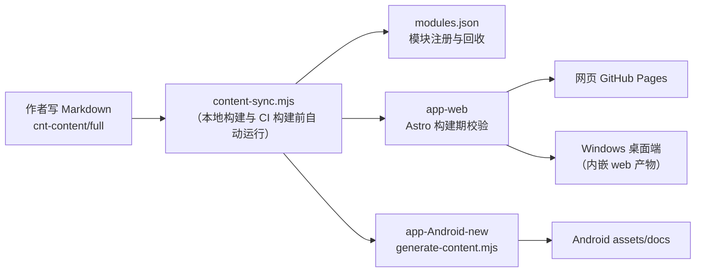

# 内容协作开发指南

本指南面向**教学内容的作者与协作者**，是可跟着做的实操手册：如何新增、修改、
删除教学文档与模块，本地如何预览与校验，哪些是红线、哪些是易错点。

与其他文档的分工：

- [README.md](README.md)：仓库是什么、三端应用与构建入口；
- [CONTRIBUTING.md](CONTRIBUTING.md)：协作流程与治理（分支模型、PR、发版）；
- [AGENTS.md](AGENTS.md)：工程规范事实源（字段约束、脚本清单，本文的规则依据）；
- 本文（CONTENT-GUIDE.md）：**内容开发怎么动手做**。

## 内容管线总览

你只写 Markdown，其余一切派生数据由管线在构建前自动补全：



三端消费方式对照：

| 端 | 内容来源 | 生成方式 |
| --- | --- | --- |
| app-web | `cnt-content/full` | Astro Content Collections 构建期加载与校验 |
| app-desktop | 内嵌 web 构建产物 | `build-desktop.mjs` 先跑 `pnpm build:web`，再由 Tauri 打包 |
| app-Android-new | `cnt-content/full` | `generate-content.mjs` 生成 `assets/docs` 与元数据 |
| app-Android-old（已冻结） | `cnt-content/full` | `generate-legacy-content.mjs` 生成 `assets/dist-mobile` |

**任何情况下都不要直接修改三端应用内的生成产物（`assets/`、`dist/` 目录）**，
它们是管线的输出，下次构建会被覆盖。

## 环境准备

纯内容贡献可以跳过本节，直接在 GitHub 网页端编辑并提 PR（CI 会完成校验）。
本地开发需要：

- Node.js >= 22 与 pnpm >= 10（版本以根 `package.json` 的 `packageManager`
  字段为准；本机没有 pnpm 时先 `npm install -g pnpm`）；
- Android / Windows 桌面端的构建工具链仅在需要构建对应端时安装
  （见 [CONTRIBUTING.md](CONTRIBUTING.md)「环境准备」）。

```bash
git clone https://github.com/fanquanpp/FANDEX.git
cd FANDEX
pnpm install --frozen-lockfile    # 在仓库根执行
```

## 操作教程

### 教程一：新增一篇文档（最常用）

1. **选定模块**：找到文档所属的模块文件夹，如
   `cnt-content/full/015-go/`。不确定归属时，看相邻文档的主题与
   `module.json` 的 `description`。
2. **按规范命名**：`NNN-EnglishName.md`，编号 `NNN-` 决定它在模块内的
   学习顺序。编号不需要连续（历史裁剪会留下空洞，属正常现象），选一个
   插入后顺序合理的数字即可，如 `017-GoroutineAndChannel.md`。
3. **写 frontmatter（可少不可错）**：推荐只手写 `title` 与 `description`：

   ```markdown
   ---
   title: Goroutine 与 Channel
   description: goroutine 的调度模型与 channel 的通信模式
   ---

   ## 前置知识
   ...
   ```

   其余字段（`order` / `module` / `category` / `author` / `updated`）由
   sync 自动生成，**手写无效**；`difficulty` 可省（缺省 `beginner`，
   合法值 beginner / intermediate / advanced）。
4. **写正文**：中文教学风格，代码块全部标注语言；图示用 Mermaid 或 SVG；
   不使用 emoji。长文档（正文超过约 10000 字符）建议包含
   `## 前置知识` 或 `## 学习目标` 章节。
5. **补全元数据**：

   ```bash
   pnpm sync     # 幂等；新文档的 frontmatter 会被补全，新模块会被注册
   ```

6. **本地预览**：

   ```bash
   pnpm dev:web  # 开发服务器，边改边看
   ```

### 教程二：新增一个模块

1. 在 `cnt-content/full/` 下建模块文件夹：`<NNN-模块id>/`，模块 id 用
   小写字母开头的 kebab-case（如 `030-docker`）；编号可省略，sync 会自动
   分配并把文件夹重命名。
2. 写模块信息文件 `cnt-content/full/<模块id>/module.json`（`title` 必填，
   其余可省，schema 见 [AGENTS.md](AGENTS.md)）：

   ```json
   {
     "title": "Docker",
     "icon": "Dk",
     "description": "容器化与镜像构建",
     "categories": ["cloud"],
     "prerequisites": ["devops"]
   }
   ```

3. 按「教程一」往里添加文档，然后 `pnpm sync`。模块会自动注册进
   `modules.json` 与学习路径索引，分类色由主分类（`categories[0]`）决定。

### 教程三：调整学习顺序或重命名

- **调整文档顺序**：重命名文件编号即可，不要手改 `order` 字段；
- **移动文档到别的模块**：直接移动文件（编号可保留），`module` 字段会被
  sync 自动改写；
- **重命名模块（谨慎）**：sync 只对内置历史别名做引用归一
  （network -> networking、math / getting-started -> cs-fundamentals）。
  改名其他模块时，指向旧 id 的 `related` / `prerequisites` 会被当作死链
  **直接删除**——请同步更新全部引用方，或先在
  `app-web/scripts/content-sync.mjs` 的 `MODULE_ALIASES` 中登记新旧 id
  映射再改名。

批量操作后先跑 `pnpm sync`（或 `node app-web/scripts/content-sync.mjs
--check` 预览）确认改动符合预期，再提交。

### 教程四：删除文档或模块

直接删除文件或文件夹。`modules.json`、学习路径索引等派生数据会在下一次
sync 时自动回收，无需手工清理。删除后如果有其他文档通过 `related` /
`prerequisites` 引用它，死链同样会被 sync 自动删除。

### 教程五：提交前自检

```bash
pnpm sync                                          # 补全元数据（幂等）
node app-web/scripts/content-audit.mjs             # 内容审计，确认无 HIGH 级问题
```

推送前至少跑 `pnpm sync`；完整构建验证由 CI 在「指向 main 的 PR 与发版」时
执行（本地预览可随时运行 `pnpm build:web`）。提交与 PR 流程（分支命名、
Conventional Commits、PR 目标分支）见 [CONTRIBUTING.md](CONTRIBUTING.md)。

## 注意事项

**红线（违反会被自动修正、报错或阻断 CI）：**

1. 不要手写托管字段：`order` / `module` / `category` / `author` /
   `updated` 由 sync 生成，手写会被校正或覆盖；
2. 调整顺序请重命名文件编号，不要直接改 `order`；
3. 不要修改三端应用内的生成产物（`assets/`、`dist/`）；
4. frontmatter 只允许 10 个标准字段，自造字段会被 audit 报告，历史禁用
   字段（tags/created/quiz 等）会被 sync 直接删除；
5. 不要使用 `[[Wiki链接]]` 语法（audit 判 medium），站内引用写
   `related` / `prerequisites`，格式为 `模块id/文件名`（不带扩展名）；
6. 不使用 emoji；图示用 Mermaid / SVG，不引入位图素材；代码块必须标注
   语言；
7. frontmatter 的 YAML 语法错误、缺失 `title` 会被 audit 判 HIGH，
   **阻断 CI 构建与部署**。

**易错点（不阻断，但会造成返工）：**

8. 正文不要过薄（少于 30 字符会被判 THIN_BODY）；一个文档讲透一个主题；
9. 长文档记得写 `## 前置知识` 或 `## 学习目标` 章节（缺失会有 low 提示）；
10. `pnpm sync` 后如果 diff 里出现**与本次改动无关的大量 `updated` 变更**，
    那是历史滞后（`updated` 取「手写值与 git 最后提交日期的较大者」），
    属正常现象，不要把它们混进本次提交，CI 构建期会自行处理；
11. 文件名编号不需要连续，但模块内不得重复；插入新文档时选一个让顺序
    合理的编号即可。

## 常见问题排查

| 现象 | 原因与处理 |
| --- | --- |
| `pnpm sync --check` 提示上千篇 `updated` 待更新 | 历史滞后，构建期自愈，无需处理（见注意事项第 10 条） |
| CI 的 Content audit 步骤失败 | 打开 deploy.yml 日志定位到具体文件，通常是 frontmatter YAML 语法错误、frontmatter 缺失或 `title` 为空 |
| 新文档在本地 dev 看不到 | 先跑 `pnpm sync`；dev 服务器重启后会重新扫描 |
| Android 端看不到新内容 | Android 产物是构建期生成的，先在仓库根跑 `node app-Android-new/scripts/generate-content.mjs` 再构建 APK |
| `pnpm build:web` 报 pagefind 相关错误 | Windows 下可选依赖偶发未装齐，删除 `node_modules` 后重新 `pnpm install --frozen-lockfile`（`@pagefind/windows-x64` 已在 devDependencies） |
| 新模块没出现在网页 | 检查 `module.json` 是否有 `title`、文件夹 id 是否为 kebab-case、是否跑过 `pnpm sync` |
| 构建（astro check）报 schema 错误 | 通常是手写了托管字段或字段值非法，跑一次 `pnpm sync` 让管线自动修正 |

## 进阶：学习路径地图与语法速查素材

这两类内容同样只提交源文件，派生数据由管线生成：

**学习路径地图**（`shd-shared/metadata/learning-path/`）：每个模块一个
`<模块id>.json`，描述阶段化的学习路线；`index.json` 的 `order` 数组决定
路径展示顺序。地图文件结构：

```json
{
  "version": "1.0.0",
  "module": "algorithm",
  "summary": "一句话概述这条路径。",
  "stages": [
    {
      "id": "data-structure",
      "title": "数据结构基础",
      "subtitle": "复杂度分析与线性/树形结构",
      "nodes": [
        { "id": "algorithm-001", "title": "算法分析基础", "doc": "001-AlgorithmAnalysisBasics" }
      ]
    }
  ]
}
```

`nodes[].doc` 指向模块内文档的文件名（不带扩展名）；新模块的骨架地图由
sync 自动生成，已有地图不会被覆盖，适合渐进完善。结构合法性由
`node app-web/scripts/audit-learning-path.mjs` 校验。

**语法速查素材**（`cnt-content/syntax/`）：独立于教学文档的速查专用源，
按模块分文件夹，文档结构要求统一——H1 标题、H2 小节、小节内用
「粗体标签 + 围栏代码块」表达语法点。构建时每个 H2 小节取第一个语法点
生成速查卡片（由 `app-web/scripts/build-syntax.mjs` 消费），因此结构
越规整，卡片质量越高。

---

发现本指南与实际行为不符时，以仓库脚本与 [AGENTS.md](AGENTS.md) 为准，
并欢迎提 PR 修正本文。
