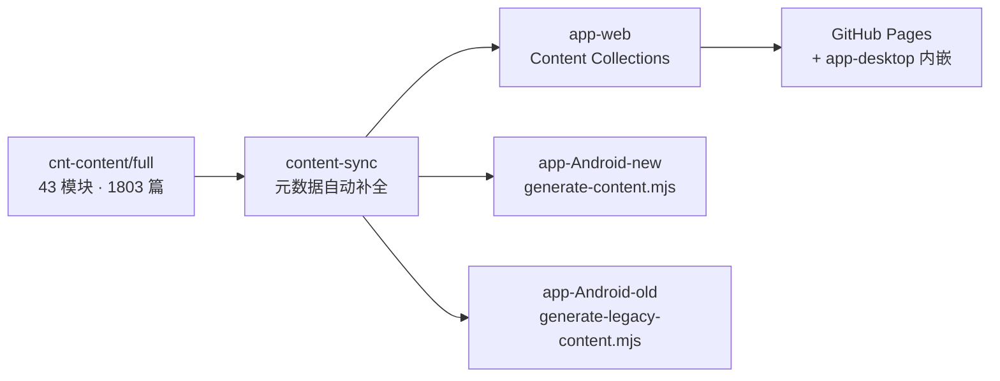

# FANDEX

[](https://github.com/fanquanpp/FANDEX/releases/latest)
[](https://github.com/fanquanpp/FANDEX/actions/workflows/deploy.yml)
[](LICENSE)

**FANDEX 是一套面向零基础学习者的全栈自学体系，也是学成之后的随身语法速查伴侣。**

43 个技术模块、1803 篇中文教学文档、4300+ 条语法速查、1069 个学习路径知识点，
从"计算机是如何工作的"讲到数据库、后端、云原生与软件架构。网页、Windows 桌面端、
Android 双端共享同一内容体系，全部内容离线可用。

整个体系托管在**单一 Git 仓库（monorepo）**中（根目录唯一 `.git`，无子仓库与
submodule）：内容单一来源 `cnt-content/full`，模块元数据唯一来源
`shd-shared/metadata/modules.json`，设计令牌唯一来源 `shd-shared/tokens/`。

## 功能亮点

- **在线前端（前端实验室）**：浏览器内编辑并运行 HTML/CSS/JS，默认示例为 FANDEX
  渐变字标页，灵感画廊 25 个素材全部品牌化重制；控制台高度可拖拽调节、成品图鉴实时
  预览、首次到访上手指南（三步上手 / 起点选择 / 学习连接）、
  预览新窗口打开与作品导出 HTML、作品库副本与深链直达（`?showcase=<id>`）；
  桌面端构建自动剔除该功能；
- **学习路线**：思维导图式技术知识链（43 门技术 · 1069 个知识点），节点三态进度
  标记（未学习/学习中/已完成）与工具栏总进度环；
- **算法教学**：algorithm 模块 30 篇教程按学习曲线重组为 8 大单元课程表，
  页内直切算法题图鉴（95 道经典题，分类 / 难度筛选与本机进度标记），并按
  刷题竞赛 / 可视化 / 计划追踪 / 公开课视频四组推荐外部学习资源；
- **语法速览**：14 门语言/技术 4300+ 张速查卡片，按语言分包按需加载；
- **命令面板搜索**：`Ctrl/⌘ + K` 全文检索，最近浏览、功能入口分组直达；
- **PWA 离线**：网页端可安装到桌面/主屏，Service Worker 缓存支持离线回访；
- **中英双语界面**：全站 UI 文案中英对照（440+ 条字典文案），顶栏一键切换
  zh / en；中文为基准语言（SSR 直出、SEO 友好），英文为纯客户端渐进增强，
  语言选择本地持久化并跨标签页同步，文档正文保持原文；
- **亮暗双主题**：亮色冷雾灰、暗色纯黑画布；全站视觉由设计令牌驱动
  （DTCG JSON 单一来源，CI 令牌漂移门禁保障 web 与共享层逐令牌一致）；
- **虚拟歌姬主题视觉**：品牌主色为初音未来代表色 `#39C5BB`，八个内容分类的
  模块主题色按同色系映射到出名歌姬代表色（乐正绫红、言和薄荷绿、洛天依天依蓝、
  星尘蓝紫等），文本场景自动混色保障对比度；
- **律动背景装饰**：以「声音的可视化 + 歌姬舞台」为唯一母题的背景装饰系统——
  底纹网格、滚动音波、均衡条、三重三色轨道星系（异速异向绕行）、三色音符
  （洛天依蓝 / 乐正绫红 / 言和薄荷绿）、星尘微粒与舞台光晕，并给每页配
  「轨道号」铭牌（主页 00，子功能页依次 01、02……，404 页显示 404），
  按页面类型做强弱变奏，全部仅动 transform / opacity 并尊重系统减弱动态偏好。

## 仓库结构

```
FANDEX/                        # 仓库根（唯一 .git 所在）
├── README.md  AGENTS.md  CHANGELOG.md  LICENSE  DISCLAIMER.md
├── app-web/            # 官网（Astro 7 + React 19 + Tailwind CSS 4），GitHub Pages 部署
├── app-desktop/        # Windows 桌面端（Tauri 2，内嵌 web 产物，完全离线）
├── app-desktop-portable/ # Windows 桌面端便携版（免安装解压即用，与 app-desktop 共用构建）
├── app-Android-new/    # Android 应用 · 新技术栈主线（Kotlin + Jetpack Compose）
├── app-Android-old/    # Android 应用 · 旧技术栈归档线（已冻结，仅修阻断缺陷）
├── cnt-content/        # 内容层：full/ 全量文档、syntax/ 语法速览素材
├── shd-shared/         # 共享层：设计令牌（tokens/）、模块元数据、图标资产
└── scripts/            # 仓库级自动化脚本（release.mjs 一键发版）
```

## 客户端

三套客户端共享同一内容管线，安装名与包名均不同，可并存使用：

| | app-web | app-desktop | app-Android-new | app-Android-old |
| --- | --- | --- | --- | --- |
| 平台 | 网页 | Windows | Android | Android |
| 定位 | 在线站点 | 桌面端主线 | 移动端主线 | 移动端归档线（已冻结） |
| 技术栈 | Astro 7 + React 19 | Tauri 2（内嵌 web 产物） | Compose + Material 3 | Compose + Material 3 |
| 包名/标识 | - | `com.fandexpp.desktop` | `com.fandexpp.fandex` | `com.fandex.app` |
| 安装名 | FANDEX | FANDEX | FANDEX | FANDEXO |
| 内容生成 | 构建期 Content Collections | 内嵌 app-web 构建产物 | `generate-content.mjs` | `generate-legacy-content.mjs` |

桌面端不包含网页端的在线前端（前端实验室）功能；文档内容全部内置于安装包，装好后
完全离线可用，任何一端不维护独立内容副本。桌面端提供 `Ctrl+Alt+F` 全局呼出/隐藏、
`F11` 全屏、`Alt+方向键` 前进后退等快捷键，详见
[app-desktop/README.md](app-desktop/README.md)。另有免安装的
[便携版](app-desktop-portable/README.md)（FANDEX-Portable-<版本>.zip，解压即用、
不写注册表），随 GitHub Release 一并分发。

Android 新主线（app-Android-new）内置完整的应用更新体系：应用内检查 GitHub
Releases 新版本、下载 APK（进度通知）并调起安装，支持每日后台自动检查（可关闭）
与忽略指定版本；另有全局字号缩放（0.8–1.4，抽屉滑杆与文档页快捷按钮）与品牌
启动页。旧主线（app-Android-old）自 4.3.0 起冻结维护，存量用户建议迁移到新主线，
详见 [app-Android-old/README.md](app-Android-old/README.md)。

## 快速开始

### 环境

- Node.js >= 22 与 pnpm >= 10（版本见根 `package.json` 的 `packageManager` 字段）
- JDK 21 与 Android SDK（compileSdk 37，双端 Android 构建需要）
- 学习内容本身不需要任何环境——直接访问网页或安装应用即可

### 网站（app-web）

```bash
pnpm install --frozen-lockfile    # 在仓库根执行
pnpm build:web                    # 完整构建（内容统计、语法索引、静态构建、搜索索引）
pnpm dev:web                      # 本地开发服务器
```

### Android 双端

```bash
# 新技术栈主线：先从仓库根同步内容，再进子目录构建
node app-Android-new/scripts/generate-content.mjs
cd app-Android-new && ./gradlew :app:assembleDebug

# 旧技术栈归档线
node app-Android-old/scripts/generate-legacy-content.mjs
cd app-Android-old && ./gradlew :app:assembleDebug
```

两个工程均内置 Gradle wrapper，首次构建自动下载 Gradle 与依赖。

### Windows 桌面端（app-desktop）

```bash
pnpm --filter @fandex/desktop build   # web 构建 + playground 剔除 + 前端产物就绪
cd app-desktop && npx tauri build     # 打包 NSIS 安装包（需 Rust 工具链）
```

需要 Rust stable 与 MSVC 工具链；安装包由维护者本地构建后随
Release 分发（CI 构建工作流已退役），日常使用建议直接下载 Release 安装包。

## 内容管线

内容单一来源为 `cnt-content/full/<编号-模块>/<编号-标题>.md`。内容维护遵循
「作者只写内容，元数据自动补全」：`pnpm sync`（零依赖幂等脚本
`app-web/scripts/content-sync.mjs`，已接入全部本地构建与 CI）会在构建前自动
补全 frontmatter 托管字段、以各模块 `module.json` 为事实源注册与回收模块、
清理死链引用；`app-web/scripts/content-audit.mjs` 做内容质量审计，HIGH 级
问题阻断流水线。



三端消费方式：

- **网站**：Astro Content Collections 构建期校验（`app-web/src/content.config.ts`）；
- **Android new**：`app-Android-new/scripts/generate-content.mjs` 生成
  `assets/docs`、`assets/metadata`、语法数据与学习路径数据；
- **Android old**：`app-Android-old/scripts/generate-legacy-content.mjs` 生成
  `assets/dist-mobile`（frontmatter 剥离 + `index.json` 索引）。

新增或修改文档前，请先阅读 [AGENTS.md](AGENTS.md) 中的内容规范与自动化说明，
完整协作教程见 [CONTRIBUTING.md](CONTRIBUTING.md)。

## 构建与发布（CI）

全部构建工作流只在 push `main` 与指向 `main` 的 PR 上触发（push `dev` 不触发
CI），带路径过滤；Android 与桌面端采用「触发器 + reusable workflow」结构复用
同一构建逻辑。

| 工作流 | 触发 | 职责 |
| --- | --- | --- |
| `deploy.yml` | push `main` / PR | typecheck、内容审计、网站构建 + QA 门禁、发布 GitHub Pages |
| `lighthouse.yml` | push `main` / PR / 手动 | Lighthouse 性能基线巡检 |

Android 与桌面端的打包构建工作流（android-build / desktop-build /
android-release）已退役：安装包目前由维护者本地构建并上传
Release；`pnpm release [版本号]` 仍会同步全部版本文件（含 Android
versionCode 与 Tauri/Cargo），但不再有 CI 自动构建安装包。
两个存留工作流固定运行在 `ubuntu-24.04`（2026-10 GitHub runner
镜像迁移 Ubuntu 26 前的主动锁定）。

日常发版使用 `pnpm release [版本号]`：自动 patch +1（或指定版本）、同步
七处版本文件（根 / app-web / app-desktop / app-desktop-portable 的
package.json、tauri.conf.json、Cargo.toml 与 Cargo.lock）与 Android
versionCode + versionName、迁移 CHANGELOG「未发布」段并 commit + tag + push
（`--no-push` 只改文件与提交）。安装包（`FANDEX-<tag>.apk`、
`FANDEX-Legacy-<tag>.apk`、`FANDEX-Setup-<tag>.exe` 与便携版 zip）由维护者
本地构建后随 GitHub Release 上传，Release 说明按 CHANGELOG 对应版本段落整理。

版本变更历史见 [CHANGELOG.md](CHANGELOG.md)。

## 关于 AI 功能的说明

FANDEX 本身不提供 AI 服务。网页端提供可选的 AI 服务商（Provider）接入通道，当前支持
[OrcaRouter](https://www.orcarouter.ai/)（OpenAI 兼容的多上游模型网关），设置入口见页脚
"AI 设置"（`/ai/`）。你可以在设置中选择接入 OrcaRouter 作为 AI 提供商，使用你自有的
API Key 来启用相关功能。

- **功能性质**：FANDEX 仅提供接入选项，不提供 AI 服务本身，也不对 AI 输出内容的
  准确性、合法性负责。通道默认关闭——不配置密钥即不会产生任何 AI 网络请求。
- **密钥来源**：两种方式均由你自行配置，FANDEX 均不经手——(1) 在
  [OrcaRouter 控制台](https://www.orcarouter.ai/console/keys)创建平台密钥后填入
  FANDEX 设置；(2) 在 [BYOK 页面](https://www.orcarouter.ai/console/byok)挂载你自己的
  上游密钥（由 OrcaRouter 加密存储，保存后永不返回原文）。
- **密钥保存**：API Key 仅保存在你自己的浏览器中（默认仅当前会话内存；勾选"在本设备
  记住"后写入本机 localStorage）。FANDEX 无账号、无自建服务器、无统计埋点，不会收集、
  缓存、记录或传输你的密钥。
- **费用归属**：使用 AI 功能产生的所有费用由你自行承担，与 FANDEX 项目无关。BYOK 模式
  下 OrcaRouter 可能收取平台费（默认 5%），该费用由 OrcaRouter 从你的账单中扣除。
- **数据流向**：配置后，请求由你的浏览器直连 `api.orcarouter.ai`，并经由 OrcaRouter
  转发给上游 AI 服务商；请自行阅读并同意
  [OrcaRouter 数据处理说明](https://docs.orcarouter.ai/operations/data-handling)及对应
  服务商的服务条款与隐私政策。OrcaRouter 声明不持久化提示词与输出内容。
- **如你不希望使用任何 AI 功能**：请不要配置 API Key，该功能将保持关闭；也可以随时在
  设置页一键清除本机 AI 数据。桌面端构建不包含该通道，完全离线。

## 贡献

欢迎修正文档错误、补充知识点与报告问题。仓库采用 `main`（受保护发布主线）+
`dev`（协作集成分支）的双分支模型。内容开发的实操手册（新增文档/模块、本地
校验与常见问题排查）见 [CONTENT-GUIDE.md](CONTENT-GUIDE.md)；从环境准备到
合并的完整协作教程见 [CONTRIBUTING.md](CONTRIBUTING.md)；文档 frontmatter
字段约束、目录职责与工程规范见 [AGENTS.md](AGENTS.md)。

## 许可与免责

- 本仓库内容以 [MIT License](LICENSE) 许可发布；引用或改编的第三方内容均在
  对应文档中注明原始出处与许可。
- 学习内容仅供教育参考，不构成职业、投资或任何专业建议；在线前端实验场的代码仅在
  用户浏览器本地运行、数据仅存本地；本项目无账号、无自建服务器、无统计埋点。
- 完整条款见 [DISCLAIMER.md](DISCLAIMER.md)（含教育用途、代码示例、实验场、隐私、
  AI 接入通道、商标归属与责任限制十节）；网站访客可在页脚「免责声明」直达
  [网页版](https://fanquanpp.github.io/FANDEX/disclaimer/)。
- 贡献内容的许可与引用规范见 [CONTRIBUTING.md](CONTRIBUTING.md)「许可与免责」。
