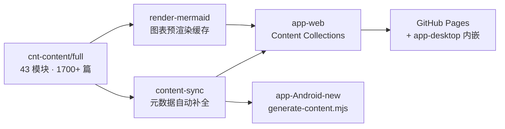

# FANDEX

[](https://github.com/fanquanpp/FANDEX/releases/latest)
[](https://github.com/fanquanpp/FANDEX/actions/workflows/deploy.yml)
[](LICENSE)

**FANDEX 是一套面向零基础学习者的编程自学笔记库，也是学成之后的随身语法速查伴侣。**

43 个技术模块、1700+ 篇中文教学笔记，从"计算机是如何工作的"一路讲到数据库、后端、
云原生与游戏开发。网页、Windows 桌面端、Android 双端共享同一内容体系，全部内容
离线可用。写作风格是"带实战、讲解、知识点、理论的学习笔记"：先动手做出来，再讲
为什么，最后给坑点与自检——不是教材，也没有概念堆砌。

整个体系是单一 Git 仓库（monorepo）：内容唯一来源 `cnt-content/full`，模块元数据
唯一来源 `shd-shared/metadata/modules.json`，设计令牌唯一来源 `shd-shared/tokens/`。

在线阅读：<https://fanquanpp.github.io/FANDEX/>

## 仓库结构

```
FANDEX/
├── app-web/              # 网页端（Astro 7 + React 19 + Tailwind 4），GitHub Pages 部署
├── app-desktop/          # Windows 桌面端（Tauri 2，内嵌 web 产物，完全离线）
├── app-desktop-portable/ # 桌面便携版（免安装解压即用，与 app-desktop 共用构建）
├── app-Android-new/      # Android 主线（Kotlin + Jetpack Compose）
├── app-Android-old/      # Android 旧线（已冻结，仅修阻断缺陷）
├── cnt-content/          # 内容层：full/ 教学笔记、syntax/ 语法速查素材
├── shd-shared/           # 共享层：设计令牌、模块元数据、图标资产
├── docs/                 # 课程地图与历史审计记录
└── scripts/              # 仓库级脚本（release.mjs 一键发版）
```

## 三端一览

| | app-web | app-desktop | app-Android-new | app-Android-old |
| --- | --- | --- | --- | --- |
| 平台 | 网页 | Windows | Android | Android |
| 技术栈 | Astro 7 + React 19 | Tauri 2 | Compose + Material 3 | Compose + Material 3 |
| 状态 | 主线 | 主线 | 主线 | 已冻结 |

三端共享同一内容管线，任何一端都不维护独立内容副本。桌面端与移动端装好即完全
离线；网页端是 PWA，可安装到桌面/主屏离线回访。

## 快速开始

学习内容本身不需要任何环境——直接访问网页或安装应用即可。本地开发：

```bash
# 环境：Node.js >= 22，pnpm >= 10（版本见根 package.json 的 packageManager）
git clone https://github.com/fanquanpp/FANDEX.git
cd FANDEX && pnpm install --frozen-lockfile

pnpm dev:web        # 网页端开发服务器
pnpm build:web      # 完整构建（mermaid 预渲染 + 内容同步 + 静态构建 + 搜索索引）
pnpm typecheck      # 全仓类型检查
```

Android 与 Windows 桌面端的构建命令见 `CONTRIBUTING.md`「环境准备」与各端 README。

## 内容管线

你只写 Markdown，其余一切由管线在构建前自动补全：


```mermaid
flowchart LR
    A["cnt-content/full<br/>43 模块 · 1700+ 篇"] --> B["content-sync<br/>元数据自动补全"]
    B --> C["app-web<br/>Content Collections"]
    B --> D["app-Android-new<br/>generate-content.mjs"]
    C --> E["GitHub Pages<br/>+ app-desktop 内嵌"]
    A --> F["render-mermaid<br/>图表预渲染缓存"] --> C
```

- **写作**：文档放入 `cnt-content/full/<编号-模块id>/`，文件名编号即学习顺序；
  frontmatter 手写 `title` 与 `description` 即可，托管字段由 `pnpm sync` 自动补全；
  站内引用写 `related` / `prerequisites`（格式 `模块id/文件名`），死链自动清理。
- **图表**：mermaid 在构建前由 `app-web/scripts/render-mermaid.mjs` 用 headless
  Chromium 预渲染成亮 / 暗两套内联 SVG（带磁盘缓存），页面加载即所见，支持
  拖拽平移、缩放、全屏与查看源码；公式由 KaTeX 构建期渲染，跨端字号一致。
- **校验**：`content-audit.mjs` 只检查 frontmatter 可解析（站点构建的硬依赖）；
  写作风格、篇幅与组织方式由作者自行决定。唯一的全项目内容约束：不使用 emoji。

实操手册（新增文档 / 模块、常见问题排查）见 [CONTENT-GUIDE.md](CONTENT-GUIDE.md)；
完整协作流程见 [CONTRIBUTING.md](CONTRIBUTING.md)；全项目强约束见 [AGENTS.md](AGENTS.md)。

## 维护要点（给人类维护者）

- **内容是第一公民**：改内容 = 改 `cnt-content/full` 下的 md，跑一次 `pnpm sync`
  即完成全部派生数据更新；改坏引用会被 sync 自动修复或明确报错。
- **脚本各司其职**：`content-sync.mjs`（元数据）、`render-mermaid.mjs`（图表缓存）、
  `build-syntax.mjs`（速查卡片）、`audit-learning-path.mjs`（路径数据完整性）。
  它们之间只通过文件与 JSON 交接，没有隐藏耦合。
- **样式单一来源**：设计令牌在 `shd-shared/tokens/`（DTCG JSON），web 端副本由
  `check-tokens-drift.mjs` 保障逐令牌一致；Android 的 Compose 色板目前是手工镜像，
  与令牌真源的差异会在 drift 检查中作为提示输出，统一时以令牌 JSON 为准。
- **发版**：`pnpm release [版本号]` 自动同步全部版本文件、CHANGELOG 并打 tag，
  安装包由维护者本地构建后随 GitHub Release 上传。

## AI 接入说明

FANDEX 本身不提供 AI 服务。网页端提供可选的 AI 服务商接入通道（当前支持
[OrcaRouter](https://www.orcarouter.ai/)），默认关闭：不配置你自己的 API Key
就不会产生任何 AI 请求，密钥仅保存在你本机浏览器中。详情见站内页脚「AI 设置」
与 [DISCLAIMER.md](DISCLAIMER.md)。

## 贡献

欢迎修正文档错误、补充知识点与报告问题。仓库采用 `main`（受保护发布主线）+
`dev`（协作集成分支）双分支模型；外部贡献者从 fork 向 `dev` 提 PR。提交信息遵循
Conventional Commits。

## 许可与免责

- 内容以 [MIT License](LICENSE) 发布；引用或改编的第三方内容均在对应文档中注明
  原始出处与许可。
- 学习内容仅供教育参考，不构成职业、投资或任何专业建议；完整条款见
  [DISCLAIMER.md](DISCLAIMER.md)。
