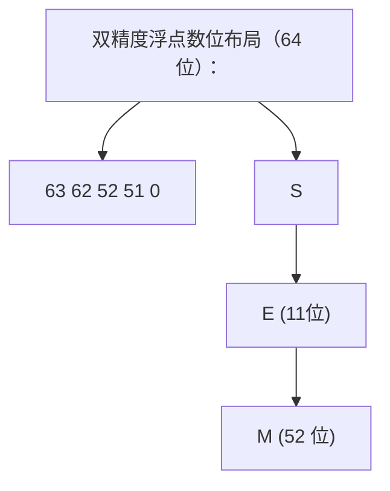

## 前置知识

- [程序结构与基本语法](/c/003-ProgramStructureBasicSyntax)：建议先完成前一篇的学习

## 学习目标

- 掌握「1. 历史动机与演化」的核心机制、典型用法与常见陷阱
- 掌握「2. 形式化定义」的核心机制、典型用法与常见陷阱
- 掌握「3. 理论推导与证明」的核心机制、典型用法与常见陷阱
- 掌握「4. 代码示例」的核心机制、典型用法与常见陷阱
- 掌握「5. 对比分析」的核心机制、典型用法与常见陷阱


## 1. 历史动机与演化

### 1.1 K&R C 时代：类型系统的雏形（1972-1989）

C 语言由 Dennis Ritchie 于 1972 年在 PDP-11 上为重写 Unix 内核而设计。早期 C 的类型系统非常简陋：

- 仅有 `char`、`int`、`float`、`double`、`long` 五个基本类型
- 无 `unsigned`、无 `short`、无 `void`、无 `enum`、无 `const`
- 无函数原型（function prototype），调用函数时不检查参数类型
- 整型大小由实现定义，跨平台移植困难

K&R C 的《The C Programming Language》（1978）第一版仅用 6 页描述全部类型系统，反映了当时的极简主义设计哲学。

### 1.2 C89：标准化的开端（1989）

ISO/IEC 9899:1990（C89/C90）首次将 C 语言标准化，引入：

- `signed`、`unsigned` 修饰符扩展到所有整型
- `long double` 类型
- `void` 类型（无返回值函数、通用指针）
- `enum` 枚举类型
- `const`、`volatile` 类型限定符
- 函数原型（function prototype）：`int f(int, char*)` 替代 `int f()`
- `<stddef.h>` 提供 `size_t`、`ptrdiff_t`、`wchar_t`、`NULL`、`offsetof`

C89 同时明确了"实现定义行为"（implementation-defined behavior）的概念：标准规定每种实现必须文档化其选择（如 `int` 的大小、字节序、对齐要求）。

### 1.3 C99：固定宽度整型与 `_Bool`（1999）

C99 引入了重大改进：

- `<stdint.h>` 提供固定宽度整型：`int8_t`、`int16_t`、`int32_t`、`int64_t` 及其无符号变体
- `<stdbool.h>` 提供 `bool`、`true`、`false` 宏（底层类型为 `_Bool`）
- `long long` 与 `unsigned long long`（至少 64 位）
- `<inttypes.h>` 提供格式化说明符：`PRId8`、`PRIu64`、`PRIxPTR` 等
- 复数类型 `_Complex`、虚数类型 `_Imaginary`（C99 旁路支持）
- 指定初始化器（designated initializer）：`struct Point p = {.x = 1, .y = 2}`

`<stdint.h>` 的引入解决了长期困扰 C 程序员的"int 到底多大"问题，使得编写跨平台代码不再需要 `typedef` 黑魔法。

### 1.4 C11：泛型选择与对齐控制（2011）

C11 引入：

- `_Generic` 泛型选择宏：编译期根据参数类型选择不同的表达式
- `_Alignas`、`_Alignof` 对齐指定符（`<stdalign.h>` 提供 `alignas`、`alignof` 宏）
- `_Static_assert` 编译期断言（`<assert.h>` 提供 `static_assert` 宏）
- `_Noreturn` 函数从不返回的属性（`<stdnoreturn.h>` 提供 `noreturn` 宏）
- `_Thread_local` 线程局部存储（`<threads.h>` 提供 `thread_local` 宏）
- 匿名结构体/联合体成员
- 边界检查库 Annex K（`printf_s`、`scanf_s` 等，可选实现）

### 1.5 C17：缺陷修复（2018）

C17（ISO/IEC 9899:2018）主要是 C11 的缺陷修复版本，未引入新类型，但明确了若干未定义行为与实现定义行为的细节。

### 1.6 C23：现代 C 的飞跃（2023）

C23（ISO/IEC 9899:2024）是 C 语言历史上最大的标准更新之一：

- `_BitInt(N)` 任意宽度整数（如 `_BitInt(7)` 表示 7 位有符号整数）
- `bool`、`true`、`false` 成为关键字（不再需要 `<stdbool.h>`）
- `nullptr`、`nullptr_t` 空指针常量与类型
- `typeof`、`typeof_unqual` 类型推导（GCC 扩展转正）
- `constexpr` 编译期常量
- `#embed` 二进制资源嵌入
- `[[deprecated]]`、`[[nodiscard]]`、`[[maybe_unused]]` 标准属性
- `auto` 类型推导（限于块作用域变量）
- 二进制字面量 `0b1010` 与数字分隔符 `1'000'000`
- `<stdbit.h>` 位操作宏（`stdc_leading_zeros`、`stdc_trailing_ones` 等）
- `_Decimal32`、`_Decimal64`、`_Decimal128` 十进制浮点（IEC 60559）

### 1.7 数据模型演化

C 语言的整型大小由"数据模型"（data model）决定：

| 数据模型 | `short` | `int` | `long` | `long long` | 指针 | 典型平台                          |
| -------- | ------- | ----- | ------ | ----------- | ---- | --------------------------------- |
| LP32     | 2       | 2     | 4      | 8           | 4    | Win16、早期 Macintosh             |
| ILP32    | 2       | 4     | 4      | 8           | 4    | Win32、Linux 32 位、macOS 32 位   |
| LLP64    | 2       | 4     | 4      | 8           | 8    | Win64                             |
| LP64     | 2       | 4     | 8      | 8           | 8    | Linux 64 位、macOS 64 位、BSD 64 位 |
| ILP64    | 2       | 8     | 8      | 8           | 8    | 早期 Alpha、Cray                  |
| SILP64   | 8       | 8     | 8      | 8           | 8    | 早期 UNICOS                       |

现代 64 位平台分化为 LLP64（Windows）与 LP64（Unix 系），导致 `long` 在跨平台代码中是不可靠的，应优先使用 `int32_t`、`int64_t`。

## 2. 形式化定义

### 2.1 类型系统层级

C 语言的类型系统可形式化为以下层级：

$$
\text{Type} = \text{BasicType} \mid \text{DerivedType} \mid \text{VoidType} \mid \text{FunctionType}
$$

$$
\text{BasicType} = \text{IntegerType} \mid \text{FloatingType} \mid \text{\_BitInt}(N) \mid \text{\_Bool} \mid \text{\_Complex} \mid \text{\_Decimal}
$$

$$
\text{DerivedType} = \text{ArrayType} \mid \text{PointerType} \mid \text{StructureType} \mid \text{UnionType} \mid \text{EnumType} \mid \text{AtomicType}
$$

### 2.2 整数提升的形式化规则

设 $T$ 为整型，$\text{rank}(T)$ 为转换等级（conversion rank），定义为：

$$
\text{rank}(\text{bool}) < \text{rank}(\text{char}) < \text{rank}(\text{short}) < \text{rank}(\text{int}) < \text{rank}(\text{long}) < \text{rank}(\text{long long})
$$

整数提升规则：

$$
\text{Promote}(T) = \begin{cases}
\text{int} & \text{if } \text{rank}(T) < \text{rank}(\text{int}) \land T \text{ 可由 int 表示} \\
\text{unsigned int} & \text{if } \text{rank}(T) < \text{rank}(\text{int}) \land T \text{ 不可由 int 表示} \\
T & \text{otherwise}
\end{cases}
$$

例如，`char c = 'A';` 在表达式 `c + 1` 中，`c` 首先被提升为 `int`，再做加法。

### 2.3 寻常算术转换

当两个整型参与二元运算时，执行"寻常算术转换"（usual arithmetic conversions）：

1. 若任一操作数为 `unsigned long long`，另一操作数转换为 `unsigned long long`。
2. 否则，若任一操作数为 `long long`，另一操作数转换为 `long long`。
3. 否则，若任一操作数为 `unsigned long`，另一操作数转换为 `unsigned long`。
4. 否则，若任一操作数为 `long`，另一操作数转换为 `long`。
5. 否则，若任一操作数为 `unsigned int`，另一操作数转换为 `unsigned int`。
6. 否则，两操作数均为 `int`。

**陷阱**：`-1 < 1U` 的结果是 `false`！因为 `1U` 是 `unsigned int`，`-1` 被转换为 `unsigned int`（变成 `UINT_MAX`），而 `UINT_MAX < 1U` 为假。

### 2.4 IEEE 754 浮点数表示

IEEE 754 双精度（`double`）的位布局：

$$
v = (-1)^S \times 1.M \times 2^{E-1023}
$$

其中：
- $S$：1 位符号位
- $E$：11 位指数（偏置 1023）
- $M$：52 位尾数（隐含前导 1）

特殊值：
- $E = 0, M = 0$：$\pm 0$
- $E = 0, M \neq 0$：次正规数（subnormal）
- $E = 2047, M = 0$：$\pm \infty$
- $E = 2047, M \neq 0$：NaN（Not a Number）



### 2.5 内存对齐的形式化定义

设类型 $T$ 的对齐要求为 $\text{align}(T)$，则：

- $\text{align}(\text{char}) = 1$
- $\text{align}(\text{short}) = 2$（典型）
- $\text{align}(\text{int}) = 4$（典型）
- $\text{align}(\text{double}) = 8$（典型）
- $\text{align}(\text{long double}) = 16$（x86-64 System V）
- $\text{align}(\text{struct S}) = \max_{m \in S} \text{align}(\text{type}(m))$
- $\text{sizeof}(\text{struct S})$ 是 $\text{align}(\text{struct S})$ 的整数倍

成员 $m$ 在结构体中的偏移 $\text{offset}(m)$ 满足：

$$
\text{offset}(m) \equiv 0 \pmod{\text{align}(\text{type}(m))}
$$

## 3. 理论推导与证明

### 3.1 定理：`char` 类型的符号性

**定理**：C 标准不规定 `char` 是 `signed char` 还是 `unsigned char`，由实现定义。

**证明**：C 标准 §6.2.5p15 规定："The three types `char`, `signed char`, and `unsigned char` are collectively called the character types. The implementation shall define `char` to have the same range, representation, and behavior as either `signed char` or `unsigned char`."

**实证**：

| 平台                    | `char` 的符号性 | `CHAR_MIN` |
| ----------------------- | --------------- | ---------- |
| x86 Linux (gcc)         | signed          | -128       |
| x86 Windows (gcc)       | signed          | -128       |
| x86 Windows (MSVC)      | signed          | -128       |
| ARM Linux (gcc)         | unsigned        | 0          |
| ARM macOS (clang)       | unsigned        | 0          |
| PowerPC AIX (xlC)       | unsigned        | 0          |

**推论**：跨平台代码不应假定 `char` 的符号性。若需明确符号，使用 `signed char` 或 `unsigned char`。

### 3.2 定理：`sizeof` 运算符的返回类型

**定理**：`sizeof` 运算符返回 `size_t` 类型，而非 `int` 或 `unsigned long`。

**证明**：C 标准 §6.5.3.4p4 规定："The value of the result is implementation-defined, and its type (an unsigned integer type) is `size_t`, defined in `<stddef.h>` (and other headers)."

`size_t` 的大小由实现定义，但必须能容纳任何对象的大小。在 32 位平台上通常是 32 位无符号整型，64 位平台上通常是 64 位无符号整型。

**推论**：循环计数器若涉及 `sizeof`，应使用 `size_t`：

```c
for (size_t i = 0; i < sizeof(arr)/sizeof(arr[0]); i++) { ... }
```

### 3.3 定理：整数溢出的行为

**定理**：无符号整数溢出是良定义的（modulo $2^N$），有符号整数溢出是未定义行为。

**证明**：

- 无符号：C 标准 §6.2.5p9："A computation involving unsigned operands can never overflow, because a result that cannot be represented by the resulting unsigned integer type is reduced modulo the number that is one greater than the largest value that can be represented by the resulting type."
- 有符号：C 标准 §6.5p5："If an exceptional condition occurs during the conversion of a floating-point number to an integer or a signed integer operation [...] the behavior is undefined."

**推论**：编译器可以假设有符号整数不会溢出，从而进行激进优化。例如：

```c
int foo(int x) {
    return x + 1 > x;  /* 编译器可假设永远为 true */
}
```

GCC 在 `-O2` 下会将 `foo` 优化为 `return 1;`。若需检测溢出，应使用 `__builtin_add_overflow`（GCC/Clang 扩展）。

### 3.4 定理：严格别名规则

**定理**：通过不兼容类型的指针访问对象是未定义行为，少数例外除外。

**证明**：C 标准 §6.5p7 规定，对象的存储值只能被以下类型之一的左值表达式访问：

1. 与对象有效类型相容的类型
2. 与对象有效类型相容类型的限定版本
3. 与对象有效类型对应的无符号版本
4. 与对象有效类型对应的有符号版本
5. 聚合或联合类型，其成员中包含上述类型之一
6. `char*`、`signed char*`、`unsigned char*`

**推论**：

```c
int x = 0x41424344;
float *fp = (float *)&x;
*fp = 3.14f;  /* UB：float* 不能别名 int */
```

类型双关的正确做法是 `memcpy` 或 `union`（C99 允许联合体读取非活跃成员，但 C++ 仍为 UB）。

### 3.5 定理：指针衰减

**定理**：在大多数表达式中，数组类型的左值会衰减为指向首元素的指针。

**证明**：C 标准 §6.3.2.1p3："Except when it is the operand of the `sizeof` operator, the `_Alignof` operator, or the unary `&` operator, or is a string literal used to initialize an array, an expression that has type 'array of type' is converted to an expression with type 'pointer to type' that points to the initial element of the array object and is not an lvalue."

**推论**：

```c
int arr[10];
sizeof(arr);     /* 40，未衰减 */
sizeof(arr + 0); /* 8（64 位），arr 衰减为 int* */
&arr;            /* int(*)[10]，未衰减 */
&arr[0];         /* int*，等同于 arr 衰减后的指针 */
```

## 4. 代码示例

### 4.1 固定宽度整型的可移植代码

```c
#include <stdint.h>
#include <inttypes.h>
#include <stdio.h>

/* 跨平台：明确指定宽度，避免 long/int 歧义 */
int32_t parse_i32(const char *s) {
    int64_t v = 0;
    /* 假设 s 是十进制数字 */
    while (*s >= '0' && *s <= '9') {
        v = v * 10 + (*s - '0');
        if (v > INT32_MAX) return INT32_MAX;  /* 饱和 */
        s++;
    }
    return (int32_t)v;
}

int main(void) {
    int32_t x = parse_i32("1234567890");
    printf("x = %" PRId32 "\n", x);  /* 跨平台格式说明符 */

    uint64_t big = 0xFFFFFFFFFFFFFFFFULL;
    printf("big = %" PRIu64 " (0x%" PRIX64 ")\n", big, big);

    /* 指针宽度整型 */
    intptr_t ip = (intptr_t)&x;
    printf("address = 0x%" PRIxPTR "\n", ip);

    return 0;
}
```

### 4.2 结构体内存布局分析

```c
#include <stdio.h>
#include <stddef.h>
#include <stdalign.h>

struct A {
    char c;     /* 1 字节，偏移 0 */
                /* 3 字节填充 */
    int i;      /* 4 字节，偏移 4 */
    char d;     /* 1 字节，偏移 8 */
                /* 3 字节填充 */
};              /* 总大小 12 字节 */

struct B {
    int i;      /* 4 字节，偏移 0 */
    char c;     /* 1 字节，偏移 4 */
    char d;     /* 1 字节，偏移 5 */
                /* 2 字节填充 */
};              /* 总大小 8 字节 */

#pragma pack(push, 1)
struct Packed {
    char c;     /* 1 字节，偏移 0 */
    int i;      /* 4 字节，偏移 1 */
    char d;     /* 1 字节，偏移 5 */
};              /* 总大小 6 字节 */
#pragma pack(pop)

int main(void) {
    printf("struct A: size=%zu, align=%zu\n", sizeof(struct A), alignof(struct A));
    printf("  c: offset=%zu\n", offsetof(struct A, c));
    printf("  i: offset=%zu\n", offsetof(struct A, i));
    printf("  d: offset=%zu\n", offsetof(struct A, d));

    printf("struct B: size=%zu, align=%zu\n", sizeof(struct B), alignof(struct B));
    printf("  i: offset=%zu\n", offsetof(struct B, i));
    printf("  c: offset=%zu\n", offsetof(struct B, c));
    printf("  d: offset=%zu\n", offsetof(struct B, d));

    printf("struct Packed: size=%zu, align=%zu\n", sizeof(struct Packed), alignof(struct Packed));

    return 0;
}
```

输出（x86-64 Linux）：

```
struct A: size=12, align=4
  c: offset=0
  i: offset=4
  d: offset=8
struct B: size=8, align=4
  i: offset=0
  c: offset=4
  d: offset=5
struct Packed: size=6, align=1
```

### 4.3 类型双关的正确做法

```c
#include <stdio.h>
#include <string.h>
#include <stdint.h>

/* 方法1：memcpy（最安全，编译器会优化） */
float int_to_float_memcpy(int32_t x) {
    float f;
    memcpy(&f, &x, sizeof(f));
    return f;
}

/* 方法2：union（C99 允许，C++ 仍为 UB） */
float int_to_float_union(int32_t x) {
    union { int32_t i; float f; } u;
    u.i = x;
    return u.f;
}

/* 方法3：char* 别名（合法但笨拙） */
float int_to_float_charptr(int32_t x) {
    float f;
    char *src = (char *)&x;
    char *dst = (char *)&f;
    for (size_t i = 0; i < sizeof(f); i++) dst[i] = src[i];
    return f;
}

/* 错误做法：违反严格别名 */
float int_to_float_ub(int32_t x) {
    float *fp = (float *)&x;
    return *fp;  /* UB */
}

int main(void) {
    int32_t x = 0x40490FDB;  /* 3.14159274f 的位表示 */
    printf("memcpy: %f\n", int_to_float_memcpy(x));
    printf("union:   %f\n", int_to_float_union(x));
    printf("char*:   %f\n", int_to_float_charptr(x));
    return 0;
}
```

### 4.4 `_Generic` 泛型选择（C11）

```c
#include <stdio.h>
#include <math.h>
#include <complex.h>

/* 编译期根据参数类型分发到不同的实现 */
#define abs_val(x) _Generic((x), \
    int:         abs, \
    long:        labs, \
    long long:   llabs, \
    float:       fabsf, \
    double:      fabs, \
    long double: fabsl, \
    default:     abs \
)(x)

#define type_name(x) _Generic((x), \
    _Bool:          "_Bool", \
    char:           "char", \
    signed char:    "signed char", \
    unsigned char:  "unsigned char", \
    short:          "short", \
    unsigned short: "unsigned short", \
    int:            "int", \
    unsigned int:   "unsigned int", \
    long:           "long", \
    unsigned long:  "unsigned long", \
    long long:      "long long", \
    unsigned long long: "unsigned long long", \
    float:          "float", \
    double:         "double", \
    long double:    "long double", \
    default:        "unknown")

int main(void) {
    int i = -42;
    long l = -1234567890L;
    double d = -3.14;
    float f = -2.71f;

    printf("abs(%s) = %d\n",    type_name(i), abs_val(i));
    printf("abs(%s) = %ld\n",   type_name(l), abs_val(l));
    printf("abs(%s) = %f\n",    type_name(d), abs_val(d));
    printf("abs(%s) = %f\n",    type_name(f), abs_val(f));

    return 0;
}
```

### 4.5 C23 `_BitInt` 任意宽度整数

```c
#include <stdio.h>
#include <limits.h>

/* C23: 任意宽度整数 */
_BitInt(7)  b7  = 0;   /* 7 位有符号，范围 -64..63 */
_BitInt(32) b32 = 0;   /* 32 位有符号 */
unsigned _BitInt(4) u4 = 0;  /* 4 位无符号，范围 0..15 */

void test_bitint(void) {
    b7 = 63;
    printf("b7 = %d (max)\n", (int)b7);
    b7++;  /* 溢出：环绕到 -64 */
    printf("b7 = %d (after overflow)\n", (int)b7);

    u4 = 15;
    printf("u4 = %u (max)\n", (unsigned)u4);
    u4++;  /* 溢出：环绕到 0 */
    printf("u4 = %u (after overflow)\n", (unsigned)u4);

    /* 编译期常量 */
    constexpr _BitInt(8) c = 100;
    printf("c = %d\n", (int)c);
}

int main(void) {
    test_bitint();
    return 0;
}
```

### 4.6 C23 `#embed` 二进制嵌入

```c
#include <stdio.h>

/* C23: 直接嵌入二进制文件，无需 xxd 等工具 */
static const unsigned char icon[] = {
#embed "icon.png"
};

int main(void) {
    printf("icon size: %zu bytes\n", sizeof(icon));
    /* 输出前 8 字节（PNG magic） */
    for (size_t i = 0; i < 8 && i < sizeof(icon); i++) {
        printf("%02x ", icon[i]);
    }
    printf("\n");
    return 0;
}
```

### 4.7 C23 `constexpr` 与 `auto`

```c
#include <stdio.h>

/* C23: 编译期常量，可作为数组大小、case 标签 */
constexpr int BUFFER_SIZE = 256;
constexpr double PI = 3.14159265358979;

int main(void) {
    char buf[BUFFER_SIZE];  /* 合法：constexpr 是编译期常量 */

    /* C23: auto 类型推导（限于块作用域） */
    auto x = 42;        /* int */
    auto y = 3.14;      /* double */
    auto z = &x;        /* int* */
    auto w = BUFFER_SIZE; /* int（constexpr 隐式转换为 int） */

    printf("x = %d, y = %f, z = %p, w = %d\n", x, y, (void*)z, w);
    printf("PI = %.15f\n", PI);

    return 0;
}
```

### 4.8 对齐控制与缓存行对齐

```c
#include <stdio.h>
#include <stdalign.h>
#include <stdint.h>

/* 64 字节对齐，独占一个缓存行 */
struct alignas(64) PaddedCounter {
    uint64_t count;
};

/* 避免伪共享：每个计数器独占缓存行 */
struct PaddedCounter counters[4];

/* 16 字节对齐，便于 SIMD 加载 */
struct alignas(16) Vec4 {
    float v[4];
};

int main(void) {
    printf("PaddedCounter: size=%zu, align=%zu\n",
           sizeof(struct PaddedCounter), alignof(struct PaddedCounter));
    printf("Vec4: size=%zu, align=%zu\n",
           sizeof(struct Vec4), alignof(struct Vec4));

    /* 对齐的内存分配 */
    alignas(32) float matrix[4][4];  /* 32 字节对齐的 4x4 矩阵 */
    printf("matrix: %p (should be 32-byte aligned)\n", (void*)matrix);

    return 0;
}
```

### 4.9 位域与 ABI

```c
#include <stdio.h>
#include <stdint.h>

/* TCP 头部（位域表示） */
struct TcpHeader {
    uint16_t src_port    : 16;
    uint16_t dst_port    : 16;
    uint32_t seq         : 32;
    uint32_t ack         : 32;
    uint16_t data_offset : 4;
    uint16_t reserved    : 3;
    uint16_t ns          : 1;
    uint16_t cwr         : 1;
    uint16_t ece         : 1;
    uint16_t urg         : 1;
    uint16_t ack_flag    : 1;
    uint16_t psh         : 1;
    uint16_t rst         : 1;
    uint16_t syn         : 1;
    uint16_t fin         : 1;
    uint16_t window      : 16;
    uint16_t checksum    : 16;
    uint16_t urgent_ptr  : 16;
};

int main(void) {
    printf("TcpHeader size: %zu\n", sizeof(struct TcpHeader));

    struct TcpHeader hdr = {0};
    hdr.src_port = 8080;
    hdr.dst_port = 80;
    hdr.seq = 1000;
    hdr.ack = 2000;
    hdr.data_offset = 5;  /* 5 * 4 = 20 字节头 */
    hdr.ack_flag = 1;
    hdr.window = 65535;

    printf("src_port: %u\n", hdr.src_port);
    printf("dst_port: %u\n", hdr.dst_port);
    printf("seq: %u\n", hdr.seq);
    printf("ack: %u\n", hdr.ack);
    printf("data_offset: %u\n", hdr.data_offset);
    printf("ack_flag: %u\n", hdr.ack_flag);
    printf("window: %u\n", hdr.window);

    return 0;
}
```

**警告**：位域的内存布局是实现定义的，不可用于跨平台序列化。网络协议解析应使用手动位移：

```c
uint32_t parse_be32(const uint8_t *p) {
    return ((uint32_t)p[0] << 24) | ((uint32_t)p[1] << 16) |
           ((uint32_t)p[2] << 8)  | (uint32_t)p[3];
}
```

### 4.10 `_Static_assert` 编译期断言

```c
#include <assert.h>
#include <stdint.h>

/* 编译期检查类型大小，跨平台编译时立即报错 */
_Static_assert(sizeof(int) >= 4, "int must be at least 32 bits");
_Static_assert(sizeof(void*) >= 4, "pointers must be at least 32 bits");
_Static_assert(sizeof(intptr_t) == sizeof(void*), "intptr_t mismatch");

/* 检查结构体布局 */
struct Header {
    uint32_t magic;
    uint32_t version;
    uint64_t offset;
};
_Static_assert(sizeof(struct Header) == 16, "Header must be 16 bytes");
_Static_assert(_Alignof(struct Header) == 8, "Header must be 8-byte aligned");

int main(void) {
    return 0;
}
```

## 5. 对比分析

### 5.1 整型选择方案对比

| 方案                   | 优点                       | 缺点                              | 适用场景                         |
| ---------------------- | -------------------------- | --------------------------------- | -------------------------------- |
| 基本类型 (`int`/`long`) | 历史代码兼容、性能最优     | 跨平台大小不定、易溢出           | 平台相关代码、性能敏感的内层循环 |
| `<stdint.h>` 固定宽度  | 跨平台一致、明确大小       | 需包含头文件、格式说明符需用宏   | 跨平台库、网络协议、文件格式     |
| `size_t`/`ptrdiff_t`   | 与对象大小匹配、避免溢出   | 不能用于负数（`size_t`）         | 数组索引、内存大小、循环计数     |
| 位域                   | 紧凑、可读性好             | 布局实现定义、不可移植           | 平台内部的标志位（非序列化）     |
| `_BitInt(N)` (C23)     | 任意宽度、明确语义         | 编译器支持有限、性能可能较差     | 硬件寄存器、位精确算法           |
| `enum`                 | 可读性好、类型安全         | 实际是 `int`、可能溢出           | 状态机、配置选项                 |

### 5.2 浮点型方案对比

| 方案                 | 精度（位） | 范围                              | 性能     | 适用场景                 |
| -------------------- | ---------- | --------------------------------- | -------- | ------------------------ |
| `float`              | 24         | $\pm 1.2 \times 10^{-38}$ 至 $\pm 3.4 \times 10^{38}$ | 最快     | 图形、信号处理           |
| `double`             | 53         | $\pm 2.2 \times 10^{-308}$ 至 $\pm 1.8 \times 10^{308}$ | 快       | 科学计算、默认选择       |
| `long double` (x86)  | 64         | $\pm 3.4 \times 10^{-4932}$ 至 $\pm 1.2 \times 10^{4932}$ | 较慢     | 高精度科学计算           |
| `_Decimal32` (C23)   | 7          | $\pm 1 \times 10^{-95}$ 至 $\pm 9.9 \times 10^{96}$ | 慢       | 财务计算（避免二进制误差） |
| `_Decimal64` (C23)   | 16         | $\pm 1 \times 10^{-383}$ 至 $\pm 9.9 \times 10^{384}$ | 慢       | 财务计算                 |
| `_Fract` (嵌入式)    | 定点       | 依赖实现                          | 极快     | DSP、嵌入式音频          |

### 5.3 C 与其他语言的类型系统对比

| 特性             | C            | C++             | Rust             | Go              | Java          |
| ---------------- | ------------ | --------------- | ---------------- | --------------- | ------------- |
| 类型推断         | 无（C23 `auto`） | `auto`/`decltype` | 强（`let`）      | `:=`            | `var`（Java 10+） |
| 泛型             | 无（`_Generic` 模拟） | 模板            | 泛型             | 泛型            | 泛型（类型擦除） |
| 类型安全         | 弱           | 较强            | 极强             | 强              | 强            |
| 空指针           | NULL         | nullptr         | Option<T>        | nil             | null          |
| 整数溢出         | signed UB    | signed UB       | 默认 panic       | 良定义（环绕）  | 良定义（环绕） |
| 内存安全         | 手动         | 手动（RAII）    | 编译期保证       | GC              | GC            |
| 联合体           | 有           | 有（`std::variant` 更安全） | 有（`enum`）     | 无              | 无            |
| 位域             | 有           | 有              | 无               | 无              | 无            |
| 函数指针         | 有           | 有（更复杂）    | 有（闭包）       | 有（函数值）    | 有（函数式接口） |

### 5.4 选型决策

**默认选择**：

1. **整型**：优先 `int`（循环计数）、`size_t`（大小/索引）、`int32_t`/`int64_t`（跨平台明确宽度）。
2. **浮点型**：默认 `double`，仅图形/信号处理用 `float`，高精度用 `long double`。
3. **布尔型**：C99 起用 `bool`（`<stdbool.h>`），C23 起用 `bool` 关键字。
4. **字符型**：文本用 `char`，字节用 `unsigned char`（避免符号扩展陷阱）。
5. **结构体**：按成员大小从大到小排列以减少填充。
6. **位精确**：硬件寄存器用 `_BitInt(N)`（C23），位标志用位运算而非位域（可移植性更好）。

## 6. 常见陷阱

### 6.1 整数提升导致的符号错误

```c
char c = 0x80;          /* signed char: -128，unsigned char: 128 */
int i = c;              /* signed: -128（符号扩展），unsigned: 128 */
unsigned char uc = 0x80;
int j = uc;             /* 128（零扩展） */

/* 陷阱：比较时整数提升 */
char a = -1;
unsigned char b = 255;
if (a == b) { /* 在 signed char 平台上为 true！ */
    /* a 提升为 int = -1，b 提升为 int = 255，不等？
       不！如果 char 是 unsigned，a 提升为 int = 255，相等。*/
}
```

### 6.2 `sizeof` 与指针衰减

```c
void print_size(int arr[]) {
    /* 陷阱：arr 在这里是指针，不是数组 */
    printf("%zu\n", sizeof(arr));  /* 8（64 位），不是数组大小 */
}

int main(void) {
    int arr[10];
    printf("%zu\n", sizeof(arr));   /* 40，正确 */
    print_size(arr);                /* 8，错误！ */
    return 0;
}
```

### 6.3 严格别名违规

```c
int x = 0x41424344;
float *fp = (float *)&x;
*fp = 3.14f;  /* UB：float* 不能别名 int */

/* 正确做法 */
float f;
memcpy(&f, &x, sizeof(f));
```

### 6.4 未初始化变量

```c
int x;  /* 自动变量，未初始化 */
printf("%d\n", x);  /* UB：读取未初始化变量 */

/* 静态变量会零初始化 */
static int y;  /* y == 0 */
```

### 6.5 对齐错误

```c
/* 在要求 4 字节对齐的平台上，以下代码是 UB */
char buf[10];
int *ip = (int *)(buf + 1);  /* 未对齐 */
*ip = 42;  /* 可能崩溃（ARM、SPARC），可能慢（x86） */

/* 正确做法 */
alignas(int) char buf[10];
int *ip = (int *)buf;
*ip = 42;  /* 合法 */
```

### 6.6 `char` 符号性陷阱

```c
/* 在 ARM 平台上 char 是 unsigned，以下代码行为不同 */
char c = 200;  /* unsigned: 200，signed: -56 */
if (c > 128) { /* unsigned: true，signed: false */
    /* ... */
}

/* 跨平台写法 */
unsigned char uc = 200;
if (uc > 128) { /* 总是 true */
    /* ... */
}
```

### 6.7 浮点数精度陷阱

```c
/* 0.1 在二进制浮点中无法精确表示 */
double x = 0.1 + 0.2;
if (x == 0.3) { /* false！x = 0.30000000000000004 */
    /* 永远不会执行 */
}

/* 正确做法：使用 epsilon */
if (fabs(x - 0.3) < 1e-9) {
    /* ... */
}

/* NaN 比较 */
double nan = 0.0 / 0.0;
if (nan == nan) { /* false！NaN 不等于自身 */
    /* 永远不会执行 */
}
if (nan != nan) { /* true */
    /* NaN 检测的标准方法 */
}
```

### 6.8 数组越界与 `VLA` 陷阱

```c
int n = 1000000;
int arr[n];  /* VLA，可能栈溢出 */

/* C11 起 VLA 变为可选特性 */
/* 跨平台应使用 malloc */
int *arr2 = malloc(n * sizeof(int));
if (!arr2) { /* 处理失败 */ }
```

## 7. 工程实践

### 7.1 类型抽象层

```c
/* types.h：跨平台类型抽象层 */
#ifndef TYPES_H
#define TYPES_H

#include <stdint.h>
#include <stddef.h>

/* 明确宽度的整数 */
typedef int8_t   i8;
typedef int16_t  i16;
typedef int32_t  i32;
typedef int64_t  i64;
typedef uint8_t  u8;
typedef uint16_t u16;
typedef uint32_t u32;
typedef uint64_t u64;

/* 平台相关 */
typedef size_t       usize;
typedef ptrdiff_t    isize;
typedef intptr_t     uptr;
typedef uintptr_t    uptrv;

/* 布尔 */
#include <stdbool.h>

/* 错误码 */
typedef i32 err_t;
#define ERR_OK    0
#define ERR_FAIL  (-1)
#define ERR_NOMEM (-2)

/* 编译期断言 */
#define STATIC_ASSERT(cond, msg) _Static_assert(cond, msg)

/* 数组长度 */
#define ARRAY_LEN(a) (sizeof(a) / sizeof((a)[0]))

/* 容器_of 模式（Linux 内核风格） */
#define CONTAINER_OF(ptr, type, member) \
    ((type *)((char *)(ptr) - offsetof(type, member)))

#endif /* TYPES_H */
```

### 7.2 编译器属性辅助类型检查

```c
/* format 属性：让编译器检查 printf/scanf 类函数的参数 */
__attribute__((format(printf, 2, 3)))
void log_msg(int level, const char *fmt, ...) {
    va_list ap;
    va_start(ap, fmt);
    vfprintf(stderr, fmt, ap);
    va_end(ap);
}

/* 调用时编译器会检查格式串与参数类型 */
int main(void) {
    log_msg(0, "value = %d\n", 42);    /* OK */
    log_msg(0, "value = %d\n", "hi");  /* 警告：类型不匹配 */
    log_msg(0, "value = %d %s\n", 42); /* 警告：参数不足 */
    return 0;
}
```

### 7.3 字节序处理

```c
#include <stdint.h>
#include <string.h>

/* 检测字节序（编译期） */
static const uint32_t ENDIAN_TEST = 0x01020304;
#define IS_LITTLE_ENDIAN (*(const uint8_t *)&ENDIAN_TEST == 0x04)

/* 大端读写（网络字节序） */
uint16_t read_be16(const uint8_t *p) {
    return (uint16_t)((p[0] << 8) | p[1]);
}

uint32_t read_be32(const uint8_t *p) {
    return ((uint32_t)p[0] << 24) | ((uint32_t)p[1] << 16) |
           ((uint32_t)p[2] << 8)  | (uint32_t)p[3];
}

void write_be32(uint8_t *p, uint32_t v) {
    p[0] = (uint8_t)(v >> 24);
    p[1] = (uint8_t)(v >> 16);
    p[2] = (uint8_t)(v >> 8);
    p[3] = (uint8_t)v;
}

/* 小端读写（x86/ARM 默认） */
uint32_t read_le32(const uint8_t *p) {
    return ((uint32_t)p[3] << 24) | ((uint32_t)p[2] << 16) |
           ((uint32_t)p[1] << 8)  | (uint32_t)p[0];
}

/* 利用 union 检测字节序（运行时） */
int is_little_endian(void) {
    union { uint32_t i; uint8_t c[4]; } u = { 0x01020304 };
    return u.c[0] == 0x04;
}
```

### 7.4 结构体序列化（跨平台）

```c
#include <stdint.h>
#include <string.h>

/* 网络协议头部：禁止编译器添加填充 */
#pragma pack(push, 1)
struct PacketHeader {
    uint32_t magic;     /* 4 字节 */
    uint16_t version;   /* 2 字节 */
    uint16_t flags;     /* 2 字节 */
    uint64_t timestamp; /* 8 字节 */
    uint32_t length;    /* 4 字节 */
};  /* 总大小 20 字节，无填充 */
#pragma pack(pop)

_Static_assert(sizeof(struct PacketHeader) == 20, "PacketHeader size mismatch");

/* 序列化到字节流（大端） */
void serialize_header(const struct PacketHeader *h, uint8_t *buf) {
    write_be32(buf, h->magic);
    write_be16(buf + 4, h->version);
    write_be16(buf + 6, h->flags);
    write_be64(buf + 8, h->timestamp);
    write_be32(buf + 16, h->length);
}

/* 反序列化 */
void deserialize_header(struct PacketHeader *h, const uint8_t *buf) {
    h->magic = read_be32(buf);
    h->version = read_be16(buf + 4);
    h->flags = read_be16(buf + 6);
    h->timestamp = read_be64(buf + 8);
    h->length = read_be32(buf + 16);
}
```

### 7.5 类型安全的 API 设计

```c
#include <stdint.h>
#include <stdbool.h>

/* 不透明类型：隐藏实现细节 */
typedef struct Stack Stack;

Stack *stack_create(size_t capacity, size_t elem_size);
void   stack_destroy(Stack *s);
bool   stack_push(Stack *s, const void *elem);
bool   stack_pop(Stack *s, void *elem);
size_t stack_size(const Stack *s);

/* 类型安全的宏包装 */
#define STACK_DEFINE(T, NAME) \
    typedef struct NAME##_T { T *data; size_t size, cap; } NAME; \
    static inline bool NAME##_push(NAME *s, T v) { \
        if (s->size >= s->cap) return false; \
        s->data[s->size++] = v; \
        return true; \
    } \
    static inline bool NAME##_pop(NAME *s, T *v) { \
        if (s->size == 0) return false; \
        *v = s->data[--s->size]; \
        return true; \
    }

/* 使用 */
STACK_DEFINE(int, IntStack);

int main(void) {
    int data[16];
    IntStack s = { data, 0, 16 };
    IntStack_push(&s, 42);
    int x;
    IntStack_pop(&s, &x);
    return 0;
}
```

### 7.6 编译期类型检查

```c
#include <stdint.h>
#include <stdbool.h>

/* 检查两个类型是否相同 */
#define TYPE_SAME(a, b) _Generic((a), b: 1, default: 0)

/* 类型安全的 swap */
#define SWAP(a, b) do { \
    _Static_assert(TYPE_SAME(a, b), "SWAP requires same types"); \
    typeof(a) _tmp = (a); \
    (a) = (b); \
    (b) = _tmp; \
} while (0)

/* 检查类型是整数 */
#define IS_INTEGER(x) _Generic((x), \
    bool: 1, char: 1, signed char: 1, unsigned char: 1, \
    short: 1, unsigned short: 1, \
    int: 1, unsigned int: 1, \
    long: 1, unsigned long: 1, \
    long long: 1, unsigned long long: 1, \
    default: 0)

int main(void) {
    int x = 1, y = 2;
    SWAP(x, y);  /* OK */

    double d = 3.14;
    /* SWAP(x, d); */ /* 编译错误：类型不匹配 */

    return 0;
}
```

### 7.7 内存对齐的 SIMD 优化

```c
#include <immintrin.h>
#include <stdalign.h>
#include <stdio.h>

/* 32 字节对齐，便于 AVX 加载 */
alignas(32) float vec_a[8] = {1, 2, 3, 4, 5, 6, 7, 8};
alignas(32) float vec_b[8] = {8, 7, 6, 5, 4, 3, 2, 1};
alignas(32) float vec_c[8];

int main(void) {
    /* AVX 一次处理 8 个 float */
    __m256 a = _mm256_load_ps(vec_a);
    __m256 b = _mm256_load_ps(vec_b);
    __m256 c = _mm256_add_ps(a, b);
    _mm256_store_ps(vec_c, c);

    for (int i = 0; i < 8; i++) {
        printf("%f ", vec_c[i]);
    }
    printf("\n");

    return 0;
}
```

## 8. 案例研究

### 8.1 Linux 内核 `container_of` 宏

Linux 内核大量使用 `CONTAINER_OF` 模式实现基于链表等通用数据结构的面向对象风格：

```c
/* linux/include/linux/kernel.h */
#define container_of(ptr, type, member) ({ \
    void *__mptr = (void *)(ptr); \
    ((type *)(__mptr - offsetof(type, member))); })

/* 使用 */
struct list_head {
    struct list_head *next, *prev;
};

struct task_struct {
    int pid;
    char name[16];
    struct list_head tasks;  /* 嵌入的链表节点 */
};

/* 通过链表节点获取 task_struct */
struct task_struct *task = container_of(node, struct task_struct, tasks);
```

### 8.2 SQLite 的可移植整型

SQLite 使用 `u8`、`u16`、`u32`、`u64`、`i64` 等别名，在 `sqlite3.h` 中定义：

```c
typedef sqlite_uint64 u64;
typedef sqlite_int64  i64;
typedef unsigned int  u32;
typedef unsigned char u8;
typedef signed char   i8;
```

并提供 `sqlite3_int64`、`sqlite3_uint64` 作为公开 API 类型，保证跨 32/64 位平台一致。

### 8.3 Redis 的字符串 `SDS`

Redis 的 Simple Dynamic Strings（SDS）根据字符串长度选择不同的头部类型：

```c
/* 5 种头部类型，节省内存 */
struct __attribute__((packed)) sdshdr5  { uint8_t len, flags; char buf[]; };
struct __attribute__((packed)) sdshdr8  { uint8_t len, alloc; uint8_t flags; char buf[]; };
struct __attribute__((packed)) sdshdr16 { uint16_t len, alloc; uint8_t flags; char buf[]; };
struct __attribute__((packed)) sdshdr32 { uint32_t len, alloc; uint8_t flags; char buf[]; };
struct __attribute__((packed)) sdshdr64 { uint64_t len, alloc; uint8_t flags; char buf[]; };

/* 根据字符串长度选择最紧凑的头部 */
static inline char sds_req_type(size_t len) {
    if (len < 1<<5)  return SDS_TYPE_5;
    if (len < 1<<8)  return SDS_TYPE_8;
    if (len < 1<<16) return SDS_TYPE_16;
    if (len < 1ll<<32) return SDS_TYPE_32;
    return SDS_TYPE_64;
}
```

### 8.4 POSIX `ssize_t` 的争议

POSIX 定义 `ssize_t` 为"有符号的 `size_t`"，用于表示可能失败（返回 -1）的大小操作：

```c
ssize_t read(int fd, void *buf, size_t count);
```

争议点：

- `size_t` 通常是 64 位无符号，`ssize_t` 是 64 位有符号，最大只能表示 `PTRDIFF_MAX`（约 9.2 EB）
- 在 32 位平台上，`read` 一次最多只能读取 2GB（`SSIZE_MAX`），即使 `count` 可以更大
- C 标准委员会曾讨论引入 `ssize_t`，但因设计争议未通过

### 8.5 Google Protocol Buffers 的 varint

Protobuf 使用变长整数编码，根据值的大小选择 1-10 字节存储：

```c
/* 编码 uint64 为 varint */
size_t encode_varint(uint64_t value, uint8_t *out) {
    size_t i = 0;
    while (value >= 0x80) {
        out[i++] = (uint8_t)(value | 0x80);
        value >>= 7;
    }
    out[i++] = (uint8_t)value;
    return i;
}

/* 解码 */
size_t decode_varint(const uint8_t *buf, size_t len, uint64_t *value) {
    uint64_t result = 0;
    int shift = 0;
    size_t i = 0;
    while (i < len) {
        uint8_t byte = buf[i++];
        result |= (uint64_t)(byte & 0x7F) << shift;
        if (!(byte & 0x80)) {
            *value = result;
            return i;
        }
        shift += 7;
        if (shift >= 64) return 0;  /* 错误：varint 太长 */
    }
    return 0;  /* 错误：截断 */
}
```

### 8.6 FFmpeg 的 DSP 类型

FFmpeg 定义了精确宽度的音频/视频样本类型：

```c
/* 音频样本 */
typedef int16_t int16_sample_t;  /* 16 位 PCM */
typedef int32_t int32_sample_t;  /* 32 位 PCM */
typedef float   float_sample_t;  /* 32 位浮点 */

/* 像素 */
typedef uint8_t  uint8_pixel_t;  /* 8 位灰度/索引色 */
typedef uint16_t uint16_pixel_t; /* 16 位 RGB565/RGBA5551 */
typedef uint32_t uint32_pixel_t; /* 32 位 RGBA */

/* SIMD 友好的对齐 */
typedef int32_t aligned_int32_t __attribute__((aligned(16)));
```

### 8.7 `jemalloc` 的对齐分配

`jemalloc` 提供对齐分配，支持 16/32/64/128/256 字节对齐：

```c
void *je_aligned_alloc(size_t alignment, size_t size);

/* 使用 */
void *p = je_aligned_alloc(64, 1024);  /* 64 字节对齐的 1KB */
```

C11 标准也引入了 `aligned_alloc`：

```c
void *aligned_alloc(size_t alignment, size_t size);
```

但 C11 的 `aligned_alloc` 要求 `size` 是 `alignment` 的整数倍（C17 放宽）。

## 整型

**基本写法：char 类型声明**
`char <var_name> = <value>;`
```c
// 1 字节字符型
char c = 'A';
```

---

**基本写法：short 类型声明**
`short <var_name> = <value>;`
```c
// 2 字节短整型
short s = 1000;
```

---

**基本写法：int 类型声明**
`int <var_name> = <value>;`
```c
// 4 字节整型
int i = 100000;
```

---

**基本写法：long 类型声明**
`long <var_name> = <value>L;`
```c
// 长整型
long l = 100000L;
```

---

**基本写法：unsigned 整型声明**
`unsigned <type> <var_name> = <value>;`
```c
// 无符号整型
unsigned int u = 100U;
```

---

## 浮点型

**基本写法：float 类型声明**
`float <var_name> = <value>f;`
```c
// 4 字节单精度浮点
float f = 3.14f;
```

---

**基本写法：double 类型声明**
`double <var_name> = <value>;`
```c
// 8 字节双精度浮点
double d = 3.14159;
```

---

**基本写法：long double 类型声明**
`long double <var_name> = <value>L;`
```c
// 长双精度浮点
long double ld = 3.14L;
```

---

## 布尔型

**基本写法：布尔型声明（C99+）**
`bool <var_name> = <true|false>;`
```c
#include <stdbool.h>
// 布尔类型变量
bool is_valid = true;
```

---

## 类型修饰符

**基本写法：signed 修饰符**
`signed <type> <var_name>;`
```c
// 有符号整型（默认）
signed int x = -10;
```

---

**基本写法：unsigned 修饰符**
`unsigned <type> <var_name>;`
```c
// 无符号整型
unsigned int y = 10;
```

---

**基本写法：const 修饰符**
`const <type> <var_name> = <value>;`
```c
// 只读常量
const int MAX_VALUE = 100;
```

---

**基本写法：volatile 修饰符**
`volatile <type> <var_name>;`
```c
// 防止编译器优化
volatile int sensor_value;
```

---

## sizeof 运算符

**基本写法：获取类型大小**
`sizeof(<type>)`
```c
// 获取 int 类型字节数
printf("int: %zu\n", sizeof(int));
```

---

**基本写法：获取变量大小**
`sizeof(<var>)`
```c
// 获取数组元素个数
int arr[10];
size_t count = sizeof(arr) / sizeof(arr[0]);
```

---

## 数组

**基本写法：一维数组声明**
`<type> <array_name>[<size>];`
```c
// 声明大小为 5 的整型数组
int numbers[5];
```

---

**初始化写法：一维数组完全初始化**
`<type> <array_name>[<size>] = {<values>};`
```c
// 完全初始化数组
int arr[5] = {1, 2, 3, 4, 5};
```

---

**自动推断写法：一维数组**
`<type> <array_name>[] = {<values>};`
```c
// 自动推断数组大小为 3
int arr[] = {10, 20, 30};
```

---

**基本写法：二维数组声明**
`<type> <array_name>[<rows>][<cols>];`
```c
// 声明 3x3 矩阵
int matrix[3][3];
```

---

## 指针

**基本写法：指针声明与初始化**
`<type> *<ptr_name> = &<var>;`
```c
// ptr 指向 x 的地址
int x = 10;
int *ptr = &x;
```

---

**解引用写法：通过指针访问值**
`*<ptr>`
```c
// 解引用获取指针指向的值
int x = 10;
int *ptr = &x;
printf("值: %d\n", *ptr);
```

---

## 结构体

**基本写法：结构体定义**
`typedef struct { <members> } <Name>;`
```c
// 定义 Employee 结构体类型
typedef struct {
    int id;
    char name[50];
    float salary;
} Employee;
```

---

**初始化写法：结构体变量初始化**
`<Name> <var> = {<values>};`
```c
// 初始化结构体变量
Employee emp = {101, "John Doe", 5000.0};
```

---

## 联合体

**基本写法：联合体定义**
`union <Name> { <members> };`
```c
// 定义联合体
union Data {
    int i;
    float f;
    char str[20];
};
```

---

## 枚举

**基本写法：枚举定义**
`enum <Name> { <MEM1>, <MEM2>, ... };`
```c
// 定义星期枚举
enum Weekday { MONDAY, TUESDAY, WEDNESDAY };
```

---

**自定义写法：指定枚举值**
`enum <Name> { <MEM1> = <val>, <MEM2> = <val>, ... };`
```c
// 显式指定枚举值
enum Color { RED = 1, GREEN = 2, BLUE = 4 };
```

---

## 空类型

**基本写法：void 函数返回类型**
`void <func_name>(<params>) { ... }`
```c
// 无返回值的函数
void print_hello() {
    printf("Hello!\n");
}
```

---

**基本写法：void 函数参数**
`<type> <func_name>(void) { ... }`
```c
// 明确表示无参数
int main(void) {
    return 0;
}
```

---

**基本写法：void 通用指针**
`void *<ptr_name>;`
```c
// 可以指向任何类型的通用指针
void *generic_ptr;
```

---

## 类型转换

**隐式写法：自动类型转换**
`<type> <var> = <other_type_var>;`
```c
// int 隐式转换为 double
int x = 10;
double y = x;
```

---

**显式写法：强制类型转换**
`(<target_type>)<expression>`
```c
// double 显式转换为 int
double pi = 3.14159;
int rounded_pi = (int)pi;
```

---

**指针转换写法：指针类型转换**
`(<target_type> *)<ptr>`
```c
// void 指针转换为 int 指针
void *ptr = &x;
int *int_ptr = (int *)ptr;
```

---

## typedef 类型别名

**基本写法：为基本类型创建别名**
`typedef <existing_type> <new_name>;`
```c
// 为 unsigned int 创建别名
typedef unsigned int uint;
```

---

**基本写法：为结构体创建别名**
`typedef struct { <members> } <Name>;`
```c
// 定义 Point 结构体别名
typedef struct {
    int x;
    int y;
} Point;
```

---

## 标准固定宽度整数

**基本写法：stdint.h 固定宽度类型**
`#include <stdint.h>`
```c
// 包含固定宽度整数类型定义
#include <stdint.h>
```

---

**基本写法：8 位整数声明**
`int8_t <var>;` 或 `uint8_t <var>;`
```c
// 有符号和无符号 8 位整数
int8_t s8 = -1;
uint8_t u8 = 255;
```

---

**基本写法：32 位整数声明**
`int32_t <var>;` 或 `uint32_t <var>;`
```c
// 有符号和无符号 32 位整数
int32_t s32 = -1000;
uint32_t u32 = 1000;
```
