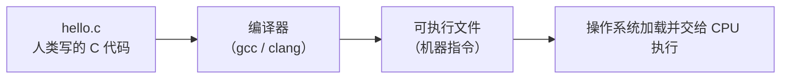
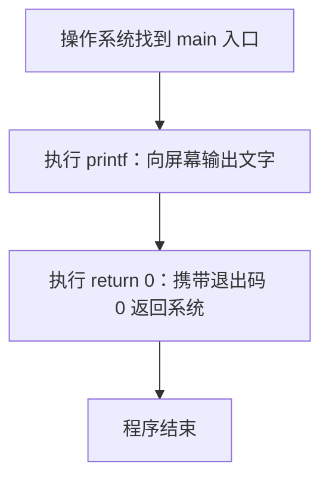
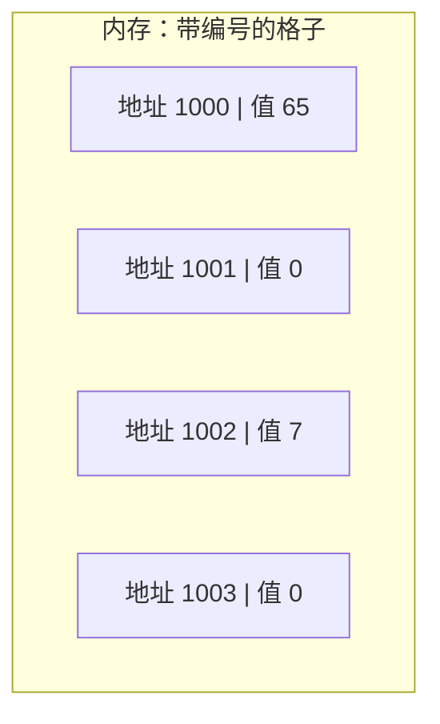

## 0.1 C 语言最小知识闭环

### 从源代码到可执行文件

| 阶段 | 命令或产物 | 作用 | 常见错误 |
| --- | --- | --- | --- |
| 预处理 | `gcc -E hello.c` | 展开 `#include` 与宏 | 头文件路径找不到 |
| 编译 | `gcc -S hello.c` | 生成汇编代码 | 语法错误、类型不匹配 |
| 汇编 | `gcc -c hello.c` | 生成目标文件 `.o` | 平台架构不匹配 |
| 链接 | `gcc hello.o -o hello` | 生成可执行文件 | 找不到库函数实现 |
| 运行 | `./hello` | 执行程序 | 当前目录不在 PATH 中 |

### 必会语法元素

| 元素 | 示例 | 含义 | 排错重点 |
| --- | --- | --- | --- |
| 头文件 | `#include <stdio.h>` | 引入函数声明 | 少写后可能出现隐式声明或编译错误 |
| 函数 | `int main(void)` | 程序入口 | 返回类型和参数列表要明确 |
| 变量 | `int age = 18;` | 有类型的内存单元 | 未初始化变量值不可预测 |
| 指针 | `int *p = &age;` | 保存地址的变量 | 解引用前确认不是空指针 |
| 数组 | `int nums[3] = {1, 2, 3};` | 连续同类型元素 | 下标越界不会自动报错 |
| 结构体 | `struct Student { int id; };` | 组合多字段数据 | 注意内存对齐和拷贝语义 |

### 第一个可解释程序

```c
#include <stdio.h>

int main(void) {
    int score = 96;
    printf("score = %d\n", score);
    return 0;
}
```

这段程序覆盖了头文件、入口函数、局部变量、格式化输出和返回码，足够作为后续学习的最小参照物。


# C 语言零基础起步

> 一句话定位：本文是 C 模块的第 0 课，写给"从来没有写过一行代码"的读者。读完本文，你会拥有自己的编译环境、跑通第一个 C 程序，并且能看懂第一次报错。

## 0. 本文的位置与使用方法

C 模块的第一篇正式文档（001 概述）默认读者已经知道"什么是程序、什么是编译、怎么运行代码"。如果你恰好不知道这些，直接读 001 会觉得很吃力。本文负责补齐这些前置知识，因此编号为 000，排在模块最前面。

本文的使用方法只有一条：**每一段代码都亲手敲进文件、亲手编译、亲手运行，不要只读**。报错是学习的一部分，第 5 章专门教你怎么看报错。

## 学习目标

完成本文后，你应该能够：

- 说出程序、编程语言、编译器三者之间的关系；
- 在自己的电脑上安装并验证 C 编译器（Windows / macOS / Linux 任选其一）；
- 从零创建 `hello.c`，逐行解释每一句代码的作用；
- 用 `gcc` 把源代码编译成可执行文件并运行它；
- 区分编译错误、链接错误、运行时错误，并读懂第一条报错；
- 用"带编号的格子"解释内存、变量与地址，知道二进制和字节是什么。

## 1. 程序、编程语言与编译器

### 1.1 程序：写给计算机的菜谱

做菜需要菜谱：菜谱告诉厨师"先放油、再放菜、最后加盐"。程序就是写给计算机的菜谱，它用计算机能一步步执行的"步骤"来描述一件事。比如"把 1 和 2 加起来，再把结果打印到屏幕上"，就是一个可以被程序描述的任务。

菜谱写得好不好，决定厨师会不会烧糊菜；程序写得好不好，决定计算机会不会崩溃或算错。

### 1.2 编程语言：人类与计算机之间的翻译层

计算机的"母语"是机器指令——一串只有 0 和 1 的二进制数字（第 6 章会细讲）。让人类直接写 0 和 1 既痛苦又容易出错。编程语言（如 C、Python、Java）是介于两者之间的"通用语言"：它接近人类的思维方式，但规则足够严格，能被计算机工具准确理解。

C 语言是其中最接近"硬件真实情况"的语言之一：它允许你直接操作内存、地址、字节，这正是底层系统编程（操作系统、嵌入式设备、数据库内核）需要的能力。这也是本模块把 C 放在计算机科学分类下的原因。

### 1.3 编译器：翻译官

编译器（compiler）是一个程序，负责把"人类写的 C 代码"翻译成"计算机能执行的机器指令"。C 是编译型语言：代码先整体翻译成可执行文件，然后才能运行。常见 C 编译器有 GCC（GNU 编译器套装）和 Clang。



记住这条链路：**写代码 -> 编译 -> 运行**。后面所有章节都是围绕这三步展开的。

## 2. 搭建开发环境

### 2.1 需要装什么

运行 C 程序只需要两样东西：

1. **编译器**：负责把 C 代码翻译成可执行文件（GCC 或 Clang）；
2. **文本编辑器**：负责写代码（Windows 记事本也可以，但推荐 VS Code）。

注意：C 没有"官方安装包"。你需要按自己的操作系统选择编译器，下面的 2.2 到 2.4 分别给出 Windows、macOS、Linux 的方案。三选一即可，不必都装。

### 2.2 Windows：安装 MinGW-w64

MinGW-w64 是 Windows 上最常用的 GCC 发行版，装完后可以在命令行里直接敲 `gcc` 命令。

**方案 A（推荐）：MSYS2 + MinGW-w64**

1. 到 MSYS2 官网下载安装包并安装；
2. 打开"MSYS2 UCRT64"终端，执行：

```bash
pacman -S mingw-w64-ucrt-x86_64-gcc
```

3. 把 MinGW 的 bin 目录加入系统环境变量 PATH（见 2.7 节），例如默认路径为：

```text
C:\msys64\ucrt64\bin
```

**方案 B：Visual Studio Community**

安装 Visual Studio Community（免费），在"工作负载"中勾选"使用 C++ 的桌面开发"。它会自带 MSVC 编译器，并提供一个图形化的 IDE。本教程的命令行示例以 GCC 为主，方案 B 的同学在 VS 里新建"空项目"、添加 `.c` 文件后直接按 F5 运行即可。

### 2.3 macOS：安装 Xcode Command Line Tools

打开"终端"（Terminal），执行：

```bash
xcode-select --install
```

按提示完成安装后，系统会自动提供 `clang` 编译器（与 GCC 命令用法基本一致，本教程所有 `gcc` 命令都可换成 `clang`）。

### 2.4 Linux：使用包管理器

Debian / Ubuntu 系：

```bash
sudo apt update
sudo apt install gcc
```

Fedora / RHEL 系：

```bash
sudo dnf install gcc
```

Arch Linux 系：

```bash
sudo pacman -S gcc
```

### 2.5 验证安装

安装完成后，打开终端，执行：

```bash
gcc --version
```

如果看到类似 `gcc (GCC) 14.x.x` 的输出，说明安装成功。如果提示"不是内部或外部命令"或 `command not found`，说明编译器没有加入 PATH，回到 2.7 节检查环境变量。

### 2.6 终端与目录概念

终端（Windows 叫 PowerShell / 命令提示符，macOS 和 Linux 叫终端）是一个"用文字下命令"的窗口。你需要先掌握三个基础概念：

- **当前目录**：终端此刻"站在"的文件夹。你编译的文件放在哪个文件夹，通常就需要先进入哪个文件夹。
- `cd`：切换目录。Windows 下 `cd D:\learn-c` 进入 `D:\learn-c`；macOS/Linux 下 `cd ~/learn-c` 进入用户目录下的 `learn-c`。
- `ls`（Windows 下也可用 `dir`）：列出当前目录里的文件。

推荐的动手路径：

```text
在用户目录下新建 learn-c 文件夹
终端进入 learn-c
在里面创建 hello.c（下一章）
```

### 2.7 环境变量 PATH 是什么

PATH 是操作系统维护的一张"查找表"：当你输入 `gcc` 时，系统按 PATH 里列出的目录逐个查找名为 `gcc.exe`（或 `gcc`）的程序。装好编译器却提示找不到命令，几乎都是因为编译器所在目录不在 PATH 里。

Windows 设置方法：系统设置 -> 高级系统设置 -> 环境变量 -> 在"用户变量"的 Path 中新建一行，填入 MinGW 的 bin 目录，保存后**重新打开终端**。

macOS / Linux 的 PATH 修改方式以及更完整的终端与变量配置，参见 `shell/100-EnvVarPath` 与 `shell/010-DevEnvSetup`。

## 3. 第一个程序：Hello World 逐行拆解

### 3.1 创建源文件

在 `learn-c` 文件夹里新建一个文件，命名为 `hello.c`。文件内容如下：

```c
// hello.c：第一个 C 程序
// 作用：在屏幕上打印一行文字

#include <stdio.h>   // 第 1 行：引入"标准输入输出"工具盒

int main(void)       // 第 3 行：程序的起点（主函数）
{
    printf("Hello, world!\n");  // 第 5 行：让屏幕显示一行字
    return 0;                   // 第 6 行：告诉系统"一切正常，干完了"
}
```

注意：`#include` 和 `printf` 等行尾的**分号与括号都是英文符号**，不能用中文输入法打出来的全角符号。

### 3.2 逐行大白话拆解

**`#include <stdio.h>`：拿来一盒工具**

`stdio.h` 是一个"头文件"，里面声明了 `printf` 等输入输出函数的用法。`#include` 的意思是"把这份工具盒的说明书先拿进来"。没有这一行，编译器看到 `printf` 时会说"我不认识这个函数"。

**`int main(void)`：程序的起点**

程序运行时会从 `main` 函数的第一条语句开始执行。`int` 表示这个函数结束时要交回一个整数结果；`void` 表示它不需要接收参数。可以这样记：`main` 是"大门"，程序从大门进入，也从大门离开。

**`printf("Hello, world!\n");`：喊话给屏幕**

`printf` 是"打印函数"，把双引号里的内容输出到屏幕。`\n` 是"换行符"，表示打完这句话后光标换到下一行（它不会被打印成反斜杠 n 两个字，而是真正换行）。

**`return 0;`：告诉系统我干完了**

程序结束时返回数字 0，这是"一切正常"的约定信号。返回非 0（如 1）通常表示出了某种问题。系统（或调用这个程序的脚本）会根据这个数字判断程序是否成功。

### 3.3 程序的执行顺序



C 程序**不是**从上到下把文件每一行都执行一遍的：`#include` 那行在编译期就处理完了，运行期真正执行的只有 `main` 函数内部的语句，按书写顺序从上往下执行。

## 4. 编译、链接与运行

### 4.1 编译并运行 hello.c

在终端进入 `hello.c` 所在目录，执行：

```bash
gcc hello.c
```

这条命令会做两件事：

1. 把 `hello.c` 翻译成机器指令；
2. 链接成可执行文件。

运行刚才生成的可执行文件：

- Windows：执行 `a.exe`
- macOS / Linux：执行 `./a.out`

```bash
# Linux / macOS 示例
$ ./a.out
Hello, world!
```

`a.out` 是 GCC 的默认输出文件名（Windows 上是 `a.exe`）。`./` 表示"当前目录下的"，因为多数系统的终端默认不会在当前目录查找可执行文件。

### 4.2 给可执行文件起名字

默认的 `a.out` 不够直观，用 `-o` 选项指定输出文件名：

```bash
gcc hello.c -o hello
./hello
```

以后写多文件项目时，"编译 -> 运行"的完整命令模式都是：`gcc 源文件 -o 名字` 然后 `./名字`。

### 4.3 编译四步流水线

`gcc hello.c` 看起来是一步，内部实际是四个阶段：


用做饭打比方：预处理像"和面"（把面粉、水等原料按配方混合），编译像"揉面、擀面"（把面团加工成面条），汇编像"切面"（切成固定长度的一根根），链接像"装盘上桌"（把面条和调料摆到一起，可以端给顾客吃了）。

现阶段你不需要记住每个阶段的命令，只要知道：**写完代码后，`gcc` 负责从原料一路加工到成品**。想深入看每一阶段的产物，参考 002 的"编译过程演示"一节。

### 4.4 常用编译选项入门

| 选项 | 作用 | 示例 |
| --- | --- | --- |
| `-o 名字` | 指定输出文件名 | `gcc hello.c -o hello` |
| `-Wall` | 打开常用警告，帮你提前发现问题 | `gcc hello.c -Wall -o hello` |
| `-std=c11` / `-std=c23` | 指定使用哪个 C 标准 | `gcc hello.c -std=c11 -o hello` |

这些选项的完整说明在 055 编译器命令速查中，现在只要会 `-o` 和 `-Wall` 就够用。

## 5. 第一个错误：看懂报错信息

报错不是失败，而是编译器在帮你检查作业。C 的报错大致分三类：

| 类型 | 什么时候发生 | 典型提示 |
| --- | --- | --- |
| 编译错误 | 编译阶段，代码不符合语法规则 | `error: expected ';'` |
| 链接错误 | 链接阶段，函数或符号找不到 | `undefined reference to` |
| 运行时错误 | 程序已经运行，执行中出问题 | 崩溃、段错误、除零 |

### 5.1 编译错误：忘记分号

把 `printf` 那行的分号删掉再编译：

```c
#include <stdio.h>

int main(void)
{
    printf("Hello, world!\n")   // 忘记写分号
    return 0;
}
```

终端会输出类似这样的信息：

```text
hello.c:6:5: error: expected ';' after expression
    return 0;
    ^
```

解读方法：

- `hello.c:6:5`：出错位置是 `hello.c` 的第 6 行第 5 个字符；
- `error:`：这是错误（不是警告），不修就无法生成可执行文件；
- `expected ';' after expression`：编译器期待这里有一个分号；
- 下面带 `^` 的一行：指出编译器"卡住"的具体位置。

注意：编译器在第 5 行漏了分号，却常常在第 6 行才"卡住"——因为它读完整条语句后才发现结尾不完整。所以报错行号是**线索**，出错原因往往在报错行的上一两行。

### 5.2 编译错误：函数名拼错

把 `printf` 拼成 `print`：

```text
hello.c:5:5: warning: implicit declaration of function 'print'
```

这是"隐式声明"警告/错误：编译器不认识 `print`，很可能因为你拼错了名字，或者忘记 `#include <stdio.h>`。遇到"不认识的名字"，先检查拼写，再检查头文件。

### 5.3 链接错误：找不到 main

如果文件里没有 `main` 函数，编译可能通过，但链接会失败：

```text
/usr/bin/ld: hello.o: in function `_start':
undefined reference to `main'
collect2: error: ld returned 1 exit status
```

`undefined reference`（未定义的引用）是链接错误最典型的提示：编译器已经把代码翻译完了，但链接器发现某个"应该存在的符号"（这里是 `main`）找不到。常见原因：漏写了 `main`，或函数声明了却没定义。

### 5.4 运行时错误：程序崩溃

编译、链接都通过，但运行时崩溃，例如除零、访问非法内存。典型的提示是 `Segmentation fault`（段错误）或 `Floating point exception`（浮点异常）。这类错误**编译器帮不了你**，需要靠调试工具定位，后面 032 静态分析与调试、056 gdb 速查会专门讲解。

### 5.5 读报错的四步法

1. **看文件名和行号**：`hello.c:6:5` 是定位起点；
2. **看错误类型**：`error`（必须修）还是 `warning`（建议修）；
3. **看关键词**：`expected`（缺什么符号）、`undefined`（缺什么定义）、`unknown`（不认识的名字）；
4. **往上看一两行**：错误往往发生在"卡住位置"的前面。

## 6. 计算机基本概念：内存、二进制、变量与地址

### 6.1 二进制：只有 0 和 1 的世界

计算机内部所有数据最终都是二进制：一串 0 和 1。一个 0 或 1 称为一个**位**（bit）；8 个位组成一个**字节**（byte）。比如十进制数 65，在计算机里写作二进制 `01000001`，正好占 1 个字节。

现阶段你只需要记住：**程序、文件、数字、文字，在内存里都是二进制字节**。C 语言之所以强大，就是因为它允许你直接看到和操作这些字节。

### 6.2 内存：带编号的格子

把内存想象成一排**带编号的格子**，每个格子可以放 1 个字节的数据：



格子的编号就是**地址**（address），格子里的内容就是**值**（value）。程序运行时的所有变量，都存放在这样一排格子里。

### 6.3 变量：贴了标签的格子

变量是"贴了标签的格子"：标签是变量名，格子是内存位置，格子里的内容是变量的值。写下面的代码：

```c
int age = 18;   // 声明一个变量 age，并放入值 18
```

编译器会为 `age` 找一个空着的格子（通常是 4 个字节，因为 `int` 占 4 字节），把 18 放进去，并记住"变量 age 对应地址 1000"。之后你写 `age = 19;`，编译器就找到地址 1000，把里面的值改成 19。

### 6.4 地址：格子的编号

C 语言用 `&` 运算符取出变量的地址：

```c
#include <stdio.h>

int main(void)
{
    int age = 18;                    // 给变量 age 分配一块内存
    printf("age 的值: %d\n", age);   // 打印格子里存的值
    printf("age 的地址: %p\n", (void *)&age);  // 打印格子的编号
    return 0;
}
```

运行结果大致是：

```text
age 的值: 18
age 的地址: 0x7ffd9a2b4c14
```

`0x...` 是十六进制写法，本质就是一个数字编号。地址具体是多少不重要，重要的是理解：**变量有名字（标签）、有值（内容）、有地址（格子编号）**。这三个概念是理解指针（本模块最核心的难点）的基石，现在先建立直觉，002 和 039 会深入展开。

## 7. 新手高频报错速查表

| 报错片段 | 含义 | 常见原因 | 怎么改 |
| --- | --- | --- | --- |
| `expected ';'` | 缺少分号 | 语句结尾漏写 `;` | 在报错行上一行的末尾加分号 |
| `unknown type name` | 类型名不认识 | 拼写错误或漏 `#include` | 检查类型名拼写与头文件 |
| `implicit declaration of function` | 函数未声明 | 拼错函数名或漏头文件 | 检查拼写，补 `#include` |
| `undefined reference to 'main'` | 链接时找不到 main | 漏写 main 函数 | 补上 `int main(void)` |
| `undefined reference to 'xxx'` | 符号未定义 | 函数只有声明没有定义 | 补实现，或链接对应库 |
| `Segmentation fault` | 运行时访问非法内存 | 指针/数组越界等 | 用调试器定位（见 032、056） |
| `Floating point exception` | 运行时除零等 | 除数为 0 | 检查除数，先判断再除 |

## 8. 动手练习与验收标准

**练习 1（环境验收）**：在终端执行 `gcc --version`，确认编译器可用。

**练习 2（第一个程序）**：手敲 `hello.c`（不要复制），编译并运行，看到 `Hello, world!`。

**练习 3（改输出）**：把输出的文字改成你自己的名字，重新编译运行。

**练习 4（故意报错）**：删掉一行分号，编译，按第 5 章的四步法找出错误，再改回来。

**练习 5（认识变量）**：写一个程序，声明两个整数变量并相加，用 `printf` 打印结果。

**练习 6（认识地址）**：用 `&` 打印一个变量的地址，并把它和"带编号的格子"对上号。

**验收标准**：以上 6 项全部独立完成；遇到报错能说出"是编译错误、链接错误还是运行时错误，大概在哪个文件的哪一行"。

## 9. 下一步怎么学

完成本文后，你已经具备阅读正式文档的基础。建议顺序：

1. 先读 001 的"0. 学习路径与阅读指南"和"4. 代码示例"两节；
2. **暂时跳过** 001 的"2. 形式化定义"和"3. 理论推导"（里面的 volatile、抽象机器、未定义行为等概念，学完指针与内存后再回来看效果最好）；
3. 再读 002 的"4.1 完整 C 程序结构"和"4.6 编译过程演示"，把第 4 章的流水线对应到真实命令；
4. 之后按 001 第 0 节给出的学习路径继续：002 程序结构 -> 003 数据类型 -> 004 变量常量 -> 017 控制流。

如果某篇文档出现看不懂的数学记号或理论推导，记住一条规则：**第一遍跳过公式，先读完代码示例和表格**，进阶原理等有实践基础后再回来。

## 10. 总结

用一句话记住这一课：**写代码（人类语言） -> gcc 编译（翻译官） -> 运行（CPU 执行）；内存是一排带编号的格子，变量是贴了标签的格子，地址是格子的编号。**

现在你已经跑通了第一个 C 程序。接下来，请打开 001，正式开始 C 语言之旅。
