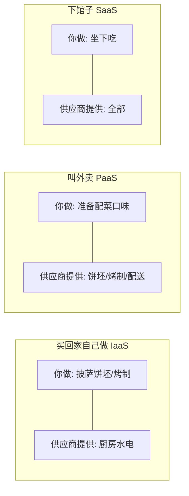
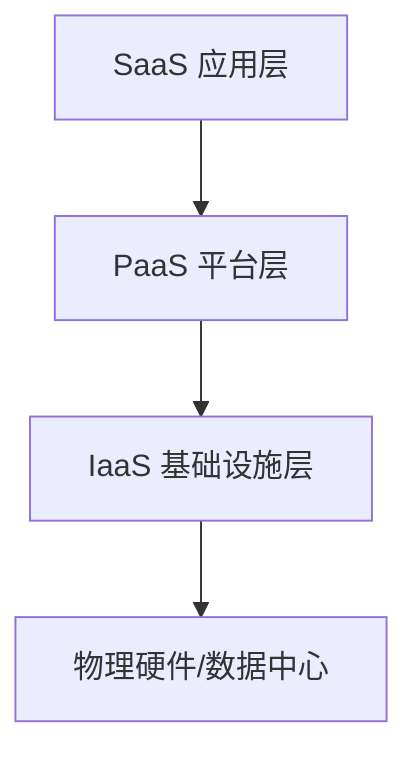

## 前置知识与学习目标

「云计算服务模式」回答的问题是：**供应商管到哪一层，你自己管哪一层**。
同样的应用，部署在云主机上和部署在函数计算上，你的运维工作量天差地别。
理解服务模式是阅读一切云产品文档的前提。

完成本文后，你应当能够：

1. 用「披萨」类比向别人讲清 IaaS/PaaS/SaaS 的边界；
2. 看懂任何一家云商产品页时，快速归类它是哪种模式；
3. 理解责任共担模型，知道安全事件中「谁的责任」怎么划分；
4. 为一个具体业务做出初步的模式选型。

## 1. 一个类比：在家吃披萨的三种方式

业界常用「披萨即服务」（Pizza as a Service）类比三种模式：



| 模式 | 你负责 | 供应商负责 | 类比 |
| :--- | :--- | :--- | :--- |
| IaaS | 操作系统及以上的一切 | 机房、硬件、虚拟化 | 租毛坯房 |
| PaaS | 应用代码与数据 | 操作系统、运行时、扩缩容 | 租精装房 |
| SaaS | 使用与配置 | 一切 | 住酒店 |

这个类比在「数据」维度会失真：无论哪种模式，**数据永远是你的责任**，
酒店不管你财物安全。类比到此为止，严谨的责任划分见下节。

## 2. 服务模式层级与责任共担

### 2.1 层级结构



上层的模式总是包含下层的全部能力，再加一层托管。所以 PaaS 是「IaaS +
平台托管」，SaaS 是「PaaS + 应用托管」。边界越往下，你的自由度越大、
运维负担越重。

### 2.2 责任共担矩阵

| 层级     | IaaS   | PaaS   | SaaS   |
| -------- | ------ | ------ | ------ |
| 应用     | 客户   | 客户   | 供应商 |
| 数据     | 客户   | 客户   | 供应商 |
| 运行时   | 客户   | 供应商 | 供应商 |
| 中间件   | 客户   | 供应商 | 供应商 |
| 操作系统 | 客户   | 供应商 | 供应商 |
| 虚拟化   | 供应商 | 供应商 | 供应商 |
| 服务器   | 供应商 | 供应商 | 供应商 |
| 存储     | 供应商 | 供应商 | 供应商 |
| 网络     | 供应商 | 供应商 | 供应商 |

> 关键认知：**安全是共担的**。IaaS 下云商保证「云本身安全」（物理隔离、
> 宿主机加固），你保证「云上安全」（系统补丁、安全组、账号权限）。历史上
> 大量云上泄露事件（桶配公开、密钥入库）都发生在客户责任区——云商的
> 合规认证不等于你的应用安全。

### 2.3 两个衍生概念

- **FaaS（函数即服务）**：PaaS 的进一步细分，连「常驻进程」都不用管，
  按调用次数与执行时长计费（AWS Lambda、Cloud Functions）。详见
  `260-ServerlessArchitecture`。
- **托管服务（Managed Service）**：数据库、消息队列等中间件的托管形态
  （RDS、Cloud SQL），介于 PaaS 与 IaaS 之间——供应商管到数据库引擎层，
  你管数据与连接。它的出现模糊了三层边界，现代云架构往往按「单个组件」
  选模式，而非整个应用一刀切。

## 3. IaaS（基础设施即服务）

提供虚拟化的计算资源（虚拟机、存储、网络），用户自行管理操作系统及
以上层级。典型心智模型：**你拥有一台没有运维接管的云上服务器**。

| 服务   | 描述             | 示例                 |
| ------ | ---------------- | ---------------- |
| 计算   | 虚拟机/裸金属    | EC2, ECS, VM      |
| 存储   | 块/对象/文件存储 | S3, EBS, OSS      |
| 网络   | VPC/负载均衡     | VPC, ELB, SLB    |

适用场景：需要完全控制操作系统、自定义运行时环境、迁移传统应用
（lift-and-shift）、高性能计算。

代表产品：AWS EC2/S3/VPC；Azure Virtual Machines/Blob；GCP Compute
Engine/Cloud Storage；阿里云 ECS/OSS/VPC。

主要代价：你要管补丁、镜像、备份、扩容与安全加固——这些在 SaaS 世界
是别人替你做的事。

## 4. PaaS（平台即服务）

提供应用运行平台，用户只交付代码与配置，平台负责运行时、扩缩容与
大部分运维。典型心智模型：**git push 之后就不用管了**。

| 服务     | 描述         | 示例                  |
| -------- | ------------ | --------------------- |
| 运行时   | 语言运行环境 | Node.js, Python, Java |
| 中间件   | 应用服务器   | Tomcat, Nginx         |
| 数据库   | 托管数据库   | RDS, Cloud SQL        |
| 消息队列 | 托管消息     | SQS, MQ               |

适用场景：快速应用开发、微服务架构、API 后端、无专职运维的团队。

代表产品：AWS Elastic Beanstalk、Azure App Service、GCP App Engine/Cloud
Run、阿里云 SAE、Heroku。注意各家的「托管数据库/消息队列」也按 PaaS
心智使用。

代价与陷阱：平台能力边界即你的天花板——特定版本要求、无法 SSH 进去
装底层依赖、按平台方式计费（不透明时账单易超预期）；平台绑定带来的
迁移成本也要提前评估。

## 5. SaaS（软件即服务）

直接提供可用的软件应用，用户通过浏览器或 API 使用，无需安装和维护。

核心特征：多租户架构（一套系统服务众多客户，数据逻辑隔离）、按订阅
付费、自动更新、随时随地访问。

代表产品：协作（Slack/Teams/飞书）、CRM（Salesforce）、办公（Google
Workspace/Microsoft 365）、设计（Figma）、开发（GitHub/GitLab）。

对开发者而言 SaaS 有两层意义：一是**消费者**（用 GitHub 写代码）；
二是**生产者**（你的产品可能就该做成 SaaS——订阅制、多租户、自助开通）。

## 6. 选型指南

### 6.1 决策矩阵

| 需求     | IaaS | PaaS | SaaS |
| -------- | ---- | ---- | ---- |
| 完全控制 | 强   | 弱   | 无   |
| 快速上线 | 慢   | 快   | 最快 |
| 定制化   | 强   | 中   | 弱   |
| 运维成本 | 高   | 中   | 低   |
| 技术门槛 | 高   | 中   | 低   |
| 长期成本 | 中   | 中   | 高（随人数线性增长） |

三个追问帮助决策：

1. **有没有必须自管的合规/特殊软件？** 有 -> IaaS 起步。
2. **团队有没有专职运维？** 没有 -> PaaS/SaaS 优先。
3. **这个东西是差异化竞争力吗？** 不是 -> 别自建，买 SaaS。

### 6.2 混合策略（现实中的常态）

```text
核心业务（有特殊性能/合规要求） -> IaaS 或自管 K8s
应用服务（业务逻辑迭代为主）   -> PaaS / 托管 K8s
通用能力（邮件、文档、CRM）    -> SaaS
事件驱动的小片段逻辑           -> FaaS
```

一个典型电商可能同时用五种模式：商品服务跑托管 Kubernetes（PaaS 思维），
历史订单归档到对象存储（IaaS），风控调用云商 AI API（SaaS），大促峰值
用函数计算削峰（FaaS），团队协作用飞书（SaaS）。**按组件选模式，而不是
给公司贴一个标签**。

## 小结

- 初学者要点：三种模式回答「供应商管到哪层」；越往下（IaaS）越自由也
  越累，越往上（SaaS）越省事也越受制于人；数据与账号安全永远是你的
  责任；选型按组件拆分，核心业务可 IaaS、通用能力用 SaaS。
- 进阶注意：责任共担模型是云安全审计与事故定责的基础框架；FaaS 与托管
  服务让三层边界日益模糊，判断「哪种模式」时问「哪一层之后是我的代码/
  数据」比记定义更可靠；PaaS 的平台边界与锁定成本、SaaS 的按席位长期
  成本，都是 TCO 计算里容易被低估的部分。
