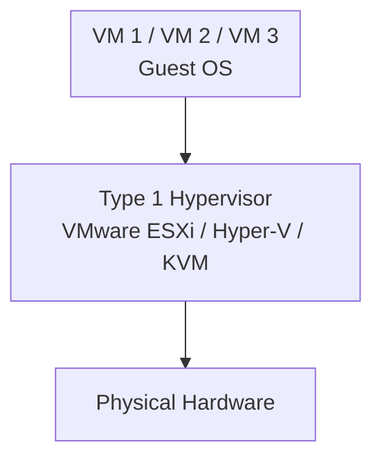
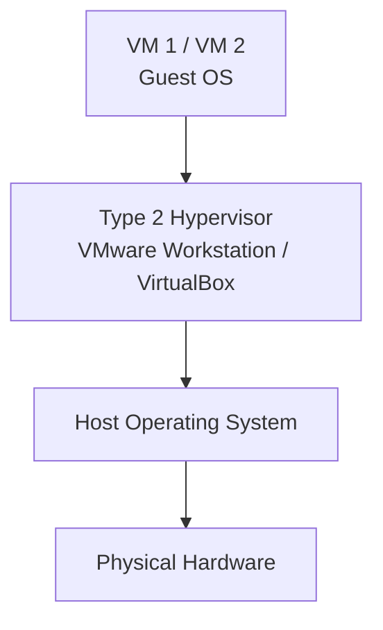
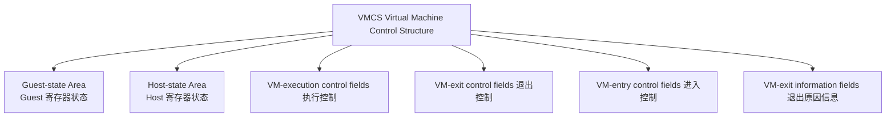
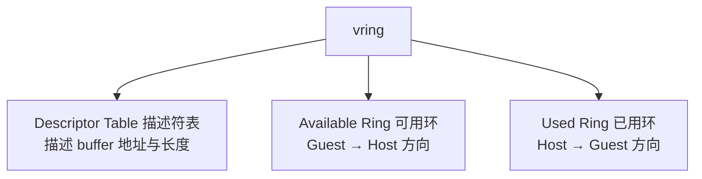
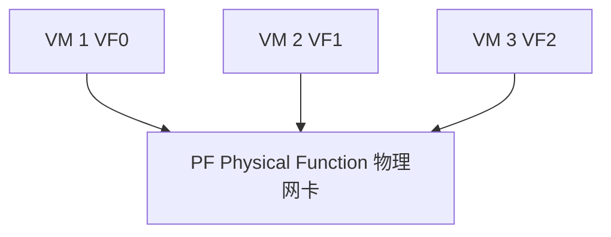
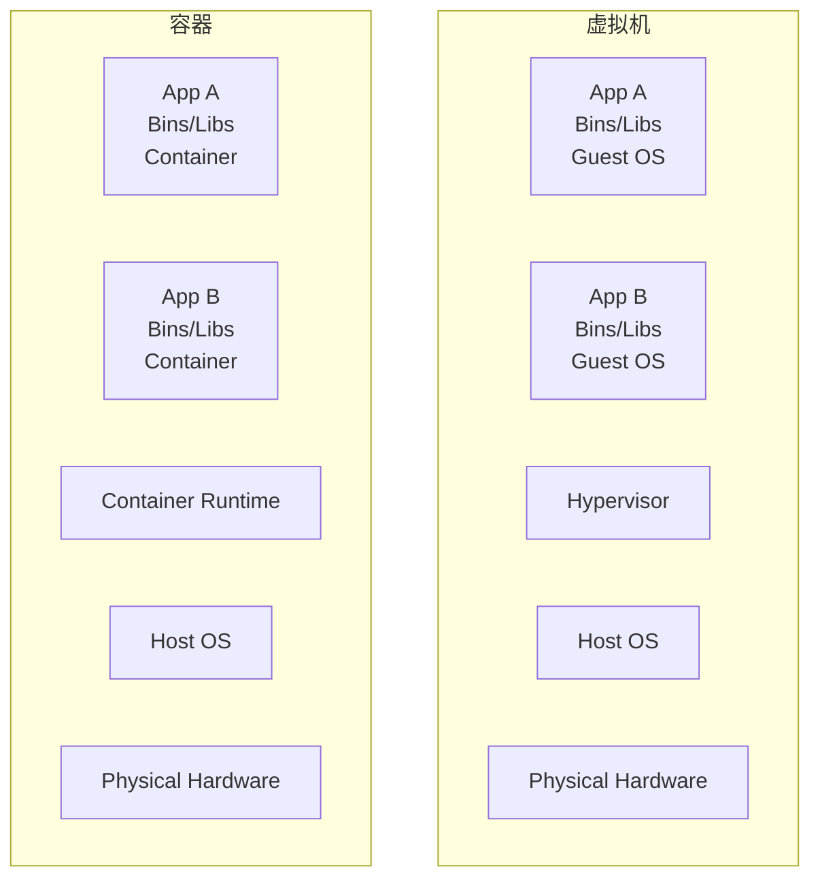
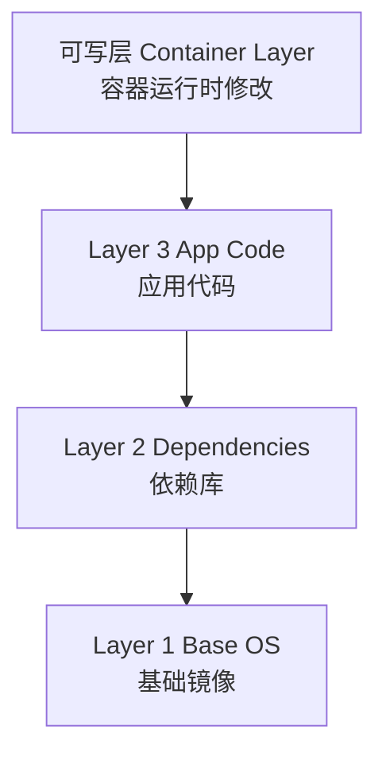
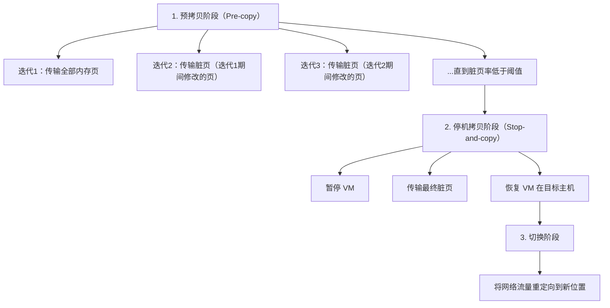

## 1. 虚拟化概述

### 1.1 虚拟化的定义与意义

虚拟化（Virtualization）是一种资源管理技术，通过在物理硬件与操作系统之间引入**虚拟化层（VMM/Hypervisor）**，将一台物理机的计算资源抽象为多个独立的虚拟执行环境。其核心目标是**资源隔离**与**资源复用**。

虚拟化带来的关键价值：

- **资源利用率提升**：从平均 15%-20% 提升至 60%-80%
- **隔离性**：故障域隔离，安全域隔离
- **封装性**：虚拟机以文件形式存在，便于备份、迁移、克隆
- **硬件无关性**：虚拟机可在不同物理主机间迁移

### 1.2 虚拟化分类

| 类型             | 描述                               | 典型场景        |
| ---------------- | ---------------------------------- | --------------- |
| 全虚拟化         | Guest OS 无需修改即可运行          | 通用服务器整合  |
| 半虚拟化         | Guest OS 需要修改以配合 Hypervisor | 高性能 I/O 场景 |
| 硬件辅助虚拟化   | 利用 CPU 硬件特性实现高效虚拟化    | 现代云平台主流  |
| 操作系统级虚拟化 | 共享内核，隔离进程与资源           | 容器技术        |
| 桌面虚拟化       | 远程交付虚拟桌面                   | VDI 场景        |
| 网络虚拟化       | 虚拟交换机、SDN、Overlay           | 云网络          |

## 2. Hypervisor 架构

### 2.1 Type 1 Hypervisor（裸金属）

直接运行在物理硬件之上，不依赖宿主操作系统：



**代表产品**：

- **VMware ESXi**：企业级，功能完善，vSphere 生态
- **Microsoft Hyper-V**：Windows Server 内置，Azure 底层
- **KVM（Kernel-based Virtual Machine）**：Linux 内核模块，开源，OpenStack 默认
- **Xen**：早期开源 Hypervisor，AWS 早期使用

### 2.2 Type 2 Hypervisor（托管型）

运行在宿主操作系统之上：



**代表产品**：VMware Workstation、Oracle VirtualBox、Parallels Desktop

### 2.3 KVM 架构详解

KVM 是当前云基础设施的事实标准：

```mermaid
flowchart TD
    subgraph User[User Space]
        Q1[QEMU vCPU0]
        Q2[QEMU vCPU1]
        KIO[/dev/kvm ioctl]
    end
    subgraph Kernel[Kernel Space]
        KM[KVM Kernel Module<br/>vCPU Thread / MMU EPT]
    end
    HW[Physical Hardware<br/>Intel VT-x / AMD-V + EPT/RVI]
    Q1 --> KIO
    Q2 --> KIO
    KIO --> KM
    KM --> HW
```

KVM 关键组件：

- **kvm.ko**：内核模块，负责 CPU 虚拟化和内存虚拟化
- **QEMU**：用户态进程，负责 I/O 设备模拟
- **virtio**：半虚拟化 I/O 框架，大幅提升 I/O 性能

## 3. CPU 虚拟化

### 3.1 特权级与陷阱

x86 架构定义了 4 个特权级（Ring 0-3），传统 OS 内核运行在 Ring 0，用户态运行在 Ring 3。虚拟化面临的根本问题是：Guest OS 期望运行在 Ring 0，但实际由 Hypervisor 掌控最高特权。

### 3.2 硬件辅助虚拟化

**Intel VT-x** 引入了两种操作模式：

- **VMX Root Mode**：Hypervisor 运行的模式，拥有完全硬件控制权
- **VMX Non-Root Mode**：Guest 运行的模式，受限操作触发 VM-Exit

关键数据结构：



**VM-Exit 触发场景**：

| 触发类型 | 示例                      |
| -------- | ------------------------- |
| 指令触发 | `CPUID`、`INVD`、`VMXON`  |
| 异常触发 | 缺页异常（EPT violation） |
| 中断触发 | 外部中断、NMI             |
| I/O 触发 | 访问映射为 I/O 的 GPA     |

### 3.3 vCPU 调度

Hypervisor 将 vCPU 作为宿主系统的线程进行调度：

```
物理 CPU 0:  [vCPU0(VM1)][vCPU2(VM2)][vCPU0(VM1)][vCPU3(VM3)]
物理 CPU 1:  [vCPU1(VM1)][vCPU1(VM1)][vCPU2(VM2)][vCPU0(VM1)]
```

调度策略需考虑：

- **公平性**：各 vCPU 获得合理的 CPU 时间
- **缓存亲和性**：vCPU 尽量调度到同一 pCPU 以利用缓存
- **NUMA 感知**：vCPU 与内存分配在同一 NUMA 节点
- **实时性**：满足 SLA 对延迟的要求

## 4. 内存虚拟化

### 4.1 影子页表（Shadow Page Table）

早期软件方案，Hypervisor 维护 Guest 虚拟地址到宿主物理地址的映射：

```
GVA ──(Guest Page Table)──> GPA ──(Shadow Page Table)──> HPA
```

缺点：页表维护开销大，每次 Guest 修改页表都需 VM-Exit。

### 4.2 扩展页表（EPT / NPT）

硬件辅助方案，两级页表由硬件自动遍历：

```
GVA ──(Guest Page Table)──> GPA ──(EPT)──> HPA
```

EPT 带来的优势：

- Guest 修改自身页表**无需 VM-Exit**
- 硬件自动完成地址翻译，性能接近原生
- 支持**大页（Huge Pages）**映射，减少 TLB Miss

EPT 地址翻译开销：

$$
\text{EPT Walk 次数} = \lceil \log_2(\text{GPA 空间} / \text{页大小}) \rceil \times \text{EPT 层级}
$$

对于 4 级 EPT 和 4KB 页面，一次完整翻译需要 24 次内存访问（4 级 Guest PT + 4 级 EPT），TLB 命中至关重要。

### 4.3 内存超额分配

Hypervisor 通常分配超过物理内存的总量给 VM：

- **气球驱动（Balloon Driver）**：Guest 内核模块，Hypervisor 通过 inflate 回收 Guest 内存
- **透明大页（THP）**：自动合并 4KB 页为 2MB/1GB 大页
- **KSM（Kernel Samepage Merging）**：合并相同内容的内存页
- **交换（Swap）**：将 Guest 内存换出到宿主交换分区

## 5. I/O 虚拟化

### 5.1 设备模拟

QEMU 纯软件模拟硬件设备，Guest 使用标准驱动即可工作：

```
Guest App → Guest Driver → MMIO/PIO → VM-Exit → QEMU Device Model → Host I/O
```

优点：兼容性好；缺点：每次 I/O 都需 VM-Exit，性能差。

### 5.2 半虚拟化（Virtio）

Guest 使用专用 virtio 驱动，通过共享内存环形缓冲区通信：


Virtio 核心数据结构——**vring**：



Virtio 性能优化演进：

| 版本          | 特性              | 性能提升 |
| ------------- | ----------------- | -------- |
| Virtio Legacy | 基于端口 I/O 通知 | 基线     |
| Virtio 1.0    | 基于 MMIO + PCI   | 约 10%   |
| Vhost-net     | 内核态处理网络包  | 约 50%   |
| Vhost-user    | 用户态 DPDK 后端  | 约 100%  |
| VDPA          | 硬件卸载          | 接近原生 |

### 5.3 SR-IOV 直通

**Single Root I/O Virtualization** 允许一个物理网卡创建多个虚拟功能（VF），每个 VF 可直接分配给 VM：



SR-IOV 绕过 Hypervisor，I/O 路径为：

$$
\text{VM} \xrightarrow{\text{DMA}} \text{VF} \xrightarrow{\text{硬件交换}} \text{PF} \xrightarrow{\text{物理链路}} \text{网络}
$$

延迟接近物理机，但牺牲了 VM 迁移灵活性。

## 6. 容器虚拟化

### 6.1 容器 vs 虚拟机



### 6.2 Linux 容器技术基础

容器依赖 Linux 内核三大隔离机制：

**Namespace（命名空间）**：

| Namespace | 隔离内容       | 系统调用          |
| --------- | -------------- | ----------------- |
| PID       | 进程 ID        | `CLONE_NEWPID`    |
| Network   | 网络栈         | `CLONE_NEWNET`    |
| Mount     | 文件系统挂载点 | `CLONE_NEWNS`     |
| UTS       | 主机名与域名   | `CLONE_NEWUTS`    |
| IPC       | System V IPC   | `CLONE_NEWIPC`    |
| User      | 用户与组 ID    | `CLONE_NEWUSER`   |
| Cgroup    | Cgroup 根目录  | `CLONE_NEWCGROUP` |

**Cgroup（控制组）**：资源限制与统计

```
cpu.max        → CPU 时间配额
memory.max     → 内存使用上限
io.max         → I/O 带宽限制
pids.max       → 进程数上限
```

**UnionFS（联合文件系统）**：镜像分层



### 6.3 安全容器

传统容器共享内核，存在逃逸风险。安全容器方案：

- **Kata Containers**：轻量级 VM，每个容器运行在独立 VM 中
- **gVisor**：用户态内核（Sentry），拦截系统调用
- **Firecracker**：AWS 开源，极简 VMM，启动时间 < 125ms

## 7. 虚拟机迁移

### 7.1 冷迁移（Cold Migration）

VM 关机后迁移磁盘镜像和配置到目标主机，再启动。简单可靠但需要停机。

### 7.2 热迁移（Live Migration）

VM 运行中迁移到目标主机，对用户透明。核心流程：



热迁移关键指标：

$$
\text{总停机时间} = \frac{\text{最终脏页数据量}}{\text{网络带宽}} + \text{VM 状态切换时间}
$$

$$
\text{总迁移时间} = \sum_{i=1}^{n} \frac{\text{第 } i \text{ 轮脏页量}}{\text{网络带宽}} + \text{停机时间}
$$

### 7.3 后拷贝迁移（Post-copy）

先切换 VM 到目标主机，再按需拉取内存页：

```
1. 暂停源 VM
2. 在目标主机启动 VM
3. 按需拉取（On-demand）：VM 访问缺失页时触发缺页中断，从源拉取
4. 主动推送（Active Push）：源后台推送剩余页
```

优点：总迁移时间短；缺点：停机后性能下降，源主机故障会导致 VM 不可用。

## 8. 虚拟化性能调优

### 8.1 CPU 调优

- **vCPU 绑定（CPU Pinning）**：将 vCPU 固定到 pCPU，减少缓存失效
- **NUMA 对齐**：vCPU 与内存分配在同一 NUMA 节点
- **大页配置**：使用 2MB/1GB 大页减少 TLB Miss

### 8.2 内存调优

- **KSM**：适用于同质 VM 集群，异质负载关闭
- **气球驱动**：动态调整 Guest 内存
- **透明大页**：默认开启，数据库等应用建议显式配置

### 8.3 I/O 调优

- **Virtio + Vhost**：网络和块设备使用半虚拟化驱动
- **SR-IOV**：高吞吐低延迟场景使用直通
- **IOThread**：QEMU 将 I/O 处理移至独立线程
- **AIO/IO_uring**：Linux 异步 I/O 后端，io_uring 性能更优

## 小结

- **初学者要点**：Type 1 Hypervisor 直接跑在硬件上（ESXi/KVM），Type 2 寄生在
  宿主 OS 上（VirtualBox）；现代虚拟化靠 CPU 硬件辅助（VT-x/AMD-V）+ 内存两级
  地址翻译（EPT/NPT）；容器是操作系统级虚拟化，共享内核所以轻，但隔离弱于 VM。
- **进阶注意**：内存超售（气球/KSM/大页）是性能问题的常见源头，数据库类负载建议
  独占内存并关闭 KSM；SR-IOV 直通性能最好但牺牲迁移能力；理解 vCPU 与 pCPU 的
  调度关系，才能解释"宿主机不忙但 VM 卡顿"这类问题。
