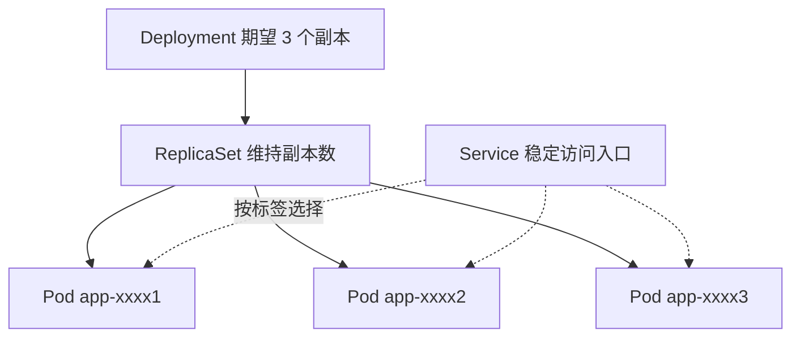

前置知识：容器与镜像的基本概念（见《容器与编排》《Docker 进阶》）、Kubernetes 集群
架构（见《Kubernetes 架构》）。

完成本文后，你应当能够：说清 Pod 与 Deployment/ReplicaSet 的层级关系；为无状态和
有状态应用分别选对工作负载资源；用探针、ConfigMap/Secret 组装出生产可用的应用清单；
对 CrashLoopBackOff、ImagePullBackOff 等典型故障快速定位。

一个贯穿全文的类比：**Pod 是一台"逻辑小主机"**——同一 Pod 内的容器像合租室友，
共享同一个 IP（网络命名空间）和挂载的存储，但各过各的（进程隔离）。Kubernetes
不直接管理"小主机"，而是通过上面几层"管家"逐层管理：



你日常改的是 Deployment 的 YAML，真正被调度的永远是 Pod——中间的 ReplicaSet 负责
「副本数量不变」这条承诺，滚动更新则是新旧两代 ReplicaSet 的交接过程。

## 1. Pod

### 1.1 Pod 概念

Pod 是 Kubernetes 最小调度单元，包含一个或多个容器，共享网络和存储。

### 1.2 Pod 生命周期

| 阶段      | 描述               |
| --------- | ------------------ |
| Pending   | 已创建，等待调度   |
| Running   | 已调度，容器运行中 |
| Succeeded | 容器正常退出       |
| Failed    | 容器异常退出       |
| Unknown   | 状态未知           |

### 1.3 Pod 配置

```yaml
apiVersion: v1
kind: Pod
metadata:
  name: web-app
spec:
  containers:
    - name: app
      image: nginx:1.25
      ports:
        - containerPort: 80
      resources:
        requests:
          cpu: 100m
          memory: 128Mi
        limits:
          cpu: 500m
          memory: 512Mi
      livenessProbe:
        httpGet:
          path: /healthz
          port: 80
        initialDelaySeconds: 15
        periodSeconds: 10
      readinessProbe:
        httpGet:
          path: /ready
          port: 80
        initialDelaySeconds: 5
        periodSeconds: 5
      env:
        - name: DB_HOST
          valueFrom:
            configMapKeyRef:
              name: app-config
              key: database_host
      volumeMounts:
        - name: data
          mountPath: /data
  volumes:
    - name: data
      persistentVolumeClaim:
        claimName: app-data
```

### 1.4 探针类型

| 探针           | 用途     | 失败动作     |
| -------------- | -------- | ------------ |
| livenessProbe  | 存活检查 | 重启容器     |
| readinessProbe | 就绪检查 | 移出 Service |
| startupProbe   | 启动检查 | 杀死容器     |

> startupProbe 的语义更准确说是「在它成功之前，liveness/readiness 探针都不会启动」，
> 专为启动慢的应用（大型 JVM、需预热缓存）设计，避免启动期间被 liveness 误杀。
> 自 K8s 1.33 起，原生 Sidecar 容器（`restartPolicy: Always` 的 init 容器）GA，
> 日志采集等辅助容器可以随业务容器同生命周期运行（详见《Kubernetes 网络》）。

## 2. Deployment

### 2.1 概念

管理无状态应用，维护 Pod 副本数和滚动更新。

### 2.2 配置示例

```yaml
apiVersion: apps/v1
kind: Deployment
metadata:
  name: web-deployment
spec:
  replicas: 3
  strategy:
    type: RollingUpdate
    rollingUpdate:
      maxSurge: 1
      maxUnavailable: 0
  selector:
    matchLabels:
      app: web
  template:
    metadata:
      labels:
        app: web
    spec:
      containers:
        - name: web
          image: nginx:1.25
          ports:
            - containerPort: 80
```

### 2.3 更新策略

| 策略          | 描述             |
| ------------- | ---------------- |
| RollingUpdate | 滚动更新（默认） |
| Recreate      | 先删后建         |

### 2.4 常用操作

```bash
# 查看滚动更新状态
kubectl rollout status deployment/web

# 查看历史版本
kubectl rollout history deployment/web

# 回滚
kubectl rollout undo deployment/web

# 回滚到指定版本
kubectl rollout undo deployment/web --to-revision=2

# 暂停/恢复更新
kubectl rollout pause deployment/web
kubectl rollout resume deployment/web
```

## 3. Service

### 3.1 概念

Service 为一组 Pod 提供稳定的访问入口和负载均衡。

### 3.2 Service 类型

| 类型         | 描述                | 访问范围 |
| ------------ | ------------------- | -------- |
| ClusterIP    | 集群内部 IP（默认） | 集群内   |
| NodePort     | 节点端口映射        | 集群外   |
| LoadBalancer | 云负载均衡器        | 互联网   |
| ExternalName | CNAME 映射          | DNS      |

### 3.3 配置示例

```yaml
apiVersion: v1
kind: Service
metadata:
  name: web-service
spec:
  type: ClusterIP
  selector:
    app: web
  ports:
    - port: 80
      targetPort: 8080
```

### 3.4 服务发现

```
# 集群内访问
web-service.default.svc.cluster.local

# 简写（同命名空间）
web-service
```

## 4. StatefulSet

### 4.1 概念

管理有状态应用，提供稳定的网络标识和持久化存储。

### 4.2 与 Deployment 区别

| 特性     | Deployment | StatefulSet |
| -------- | ---------- | ----------- |
| Pod 名称 | 随机后缀   | 有序编号    |
| 网络标识 | 不稳定     | 稳定 DNS    |
| 存储     | 共享       | 独立 PVC    |
| 扩缩容   | 随机顺序   | 有序        |
| 更新     | 随机顺序   | 逆序        |

### 4.3 配置示例

```yaml
apiVersion: apps/v1
kind: StatefulSet
metadata:
  name: mysql
spec:
  serviceName: mysql
  replicas: 3
  selector:
    matchLabels:
      app: mysql
  template:
    metadata:
      labels:
        app: mysql
    spec:
      containers:
        - name: mysql
          image: mysql:8.0
          volumeMounts:
            - name: data
              mountPath: /var/lib/mysql
  volumeClaimTemplates:
    - metadata:
        name: data
      spec:
        accessModes: ['ReadWriteOnce']
        resources:
          requests:
            storage: 10Gi
```

## 5. ConfigMap 与 Secret

### 5.1 ConfigMap

```yaml
apiVersion: v1
kind: ConfigMap
metadata:
  name: app-config
data:
  database_host: 'mysql.default.svc.cluster.local'
  database_port: '3306'
  app.properties: |
    key1=value1
    key2=value2
```

### 5.2 Secret

```yaml
apiVersion: v1
kind: Secret
metadata:
  name: db-secret
type: Opaque
data:
  username: YWRtaW4= # base64(admin)
  password: cGFzc3dvcmQ= # base64(password)
```

> 注意：Secret 默认仅 Base64 编码，建议启用加密存储或使用外部密钥管理（Vault）。

## 6. DaemonSet 与 Job

### 6.1 DaemonSet

每个节点运行一个 Pod 副本，适用于日志采集、监控代理等。

```yaml
apiVersion: apps/v1
kind: DaemonSet
metadata:
  name: fluentd
spec:
  selector:
    matchLabels:
      app: fluentd
  template:
    metadata:
      labels:
        app: fluentd
    spec:
      containers:
        - name: fluentd
          image: fluent/fluentd:v1.16-debian # 固定版本，勿用 latest（见第 7 节）
```

### 6.2 Job 与 CronJob

```yaml
# 一次性任务
apiVersion: batch/v1
kind: Job
metadata:
  name: data-migration
spec:
  completions: 1
  backoffLimit: 3
  template:
    spec:
      containers:
        - name: migrate
          image: myapp:migrate
      restartPolicy: Never
```

```yaml
# 定时任务
apiVersion: batch/v1
kind: CronJob
metadata:
  name: daily-backup
spec:
  schedule: '0 2 * * *'
  jobTemplate:
    spec:
      template:
        spec:
          containers:
            - name: backup
              image: myapp:backup
          restartPolicy: OnFailure
```

## 7. 常见陷阱与排错

排错的万能三板斧，90% 的问题止步于第二步：

```bash
kubectl describe pod <pod>      # 1. 看 Events：调度失败？镜像拉取失败？探针失败？
kubectl logs <pod> --previous   # 2. 看上一次崩溃前的日志
kubectl get pod <pod> -o yaml   # 3. 看最终生效的完整配置（diff 掉默认值干扰）
```

| 现象              | 常见原因                                              | 处理                                            |
| ----------------- | ----------------------------------------------------- | ----------------------------------------------- |
| ImagePullBackOff  | 镜像名/标签拼错、私有仓库未配 `imagePullSecrets`      | `describe` 看 Err 段；先在节点上手动 `pull` 验证 |
| CrashLoopBackOff  | 应用启动即崩、配置缺失、探针过早开始杀进程            | 看 `--previous` 日志；加 startupProbe 缓冲       |
| OOMKilled         | `limits.memory` 低于真实峰值                          | 用 `kubectl top` 实测后上调 limit                 |
| Pending 不调度    | 资源不足、亲和性/污点不匹配、PVC 未绑定               | `describe` 的 Events 会直接写明原因              |
| Service 不通      | selector 与 Pod 标签不匹配、targetPort 写错           | `kubectl get endpoints <svc>` 为空即 selector 问题 |
| ConfigMap 改了没生效 | 环境变量方式注入不会热更新（卷挂载方式才有更新）   | 环境变量需重启 Pod；配置文件用卷挂载 + `rollout restart` |

三条高频纪律：

1. **标签是命脉**：Deployment/Service/HPA 全靠 selector 匹配标签，改标签前先全局搜索引用；
2. **Secret 不是加密**：只是 Base64 编码（见第 5.2 节），磁盘加密、RBAC 收权、外部
   密钥管理（Vault/External Secrets）至少配一样；
3. **镜像一律固定标签**：`latest` 在拉取策略 `IfNotPresent` 下会长期复用旧镜像，
   出了问题「两台节点行为不一致」极难排查。

## 小结

- **初学者要点**：Deployment 管 3 件事——副本数、滚动更新、回滚；Pod 是最小调度单元；
  无状态用 Deployment，有状态用 StatefulSet，每节点一个用 DaemonSet，跑完即走用 Job/CronJob。
  Service 提供稳定虚拟 IP，按 selector 转发到 Pod。
- **进阶注意**：探针配错比不配更危险（liveness 误杀引发雪崩，读侧务必先上 readiness）；
  滚动更新 `maxUnavailable: 0` + readinessProbe 才是真正的零中断；StatefulSet 的有序性
  是「收缩逆序、扩张顺序」，删除 `serviceName` 之外的头信息需谨慎；资源 requests 决定
  调度、limits 决定生死（QoS 详解见《云原生应用》）。
