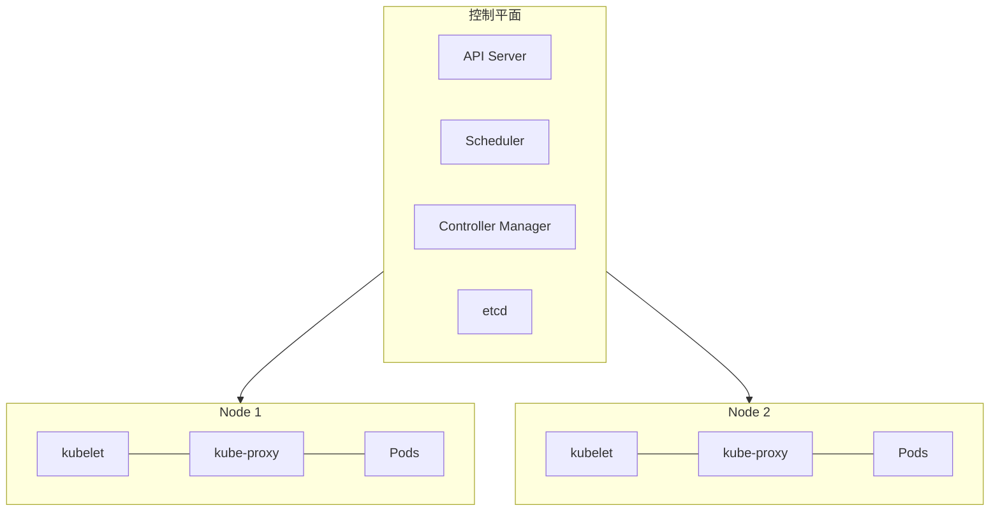
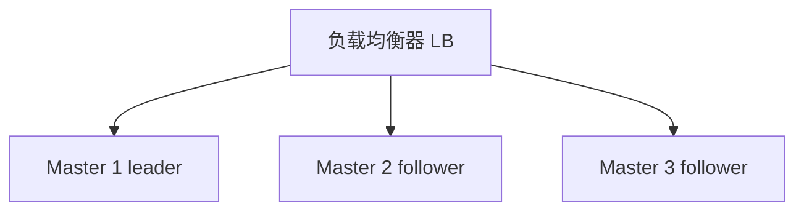

## 1. Kubernetes 整体架构

### 1.1 架构图



### 1.2 设计理念

| 理念       | 描述                       |
| ---------- | -------------------------- |
| 声明式 API | 描述期望状态，系统自动趋近 |
| 控制循环   | 持续观测并调和状态         |
| 松耦合     | 组件间通过 API 通信        |
| 可扩展     | CRD、Operator、插件        |

## 2. 控制平面组件

### 2.1 API Server

集群的统一入口，所有操作都通过 API Server 进行。

**核心功能**：

- RESTful API 网关
- 认证、授权、准入控制
- 数据验证与持久化
- Watch 机制（变更通知）

**请求流程**：

```
请求 → 认证 → 授权 → 准入控制 → 验证 → etcd 持久化 → 响应
```

### 2.2 etcd

分布式键值存储，Kubernetes 的唯一状态存储。

| 特性   | 描述            |
| ------ | --------------- |
| 一致性 | Raft 共识协议   |
| Watch  | 监听键值变化    |
| 事务   | Compare-and-Set |
| TTL    | 键值过期        |

**运维要点**：

- 奇数节点（3/5/7）
- SSD 存储
- 独立部署
- 定期备份

### 2.3 Scheduler

负责将 Pod 调度到合适的节点。

**调度流程**：

```
1. 过滤（Filter）：排除不满足条件的节点
2. 评分（Score）：对可行节点打分
3. 绑定（Bind）：将 Pod 绑定到最高分节点
```

**调度策略**：

| 策略            | 描述                          |
| --------------- | ----------------------------- |
| 节点选择器      | `nodeSelector`                |
| 节点亲和性      | `nodeAffinity`                |
| Pod 亲和/反亲和 | `podAffinity/podAntiAffinity` |
| 污点与容忍      | `taints/tolerations`          |
| 资源限制        | CPU/内存请求与限制            |

### 2.4 Controller Manager

运行各种控制器，每个控制器是一个控制循环。

| 控制器                     | 功能            |
| -------------------------- | --------------- |
| Deployment Controller      | 管理 ReplicaSet |
| ReplicaSet Controller      | 维护 Pod 副本数 |
| Node Controller            | 节点健康监测    |
| Job Controller             | 一次性任务      |
| Endpoints Controller       | Service 端点    |
| Service Account Controller | 服务账户        |

## 3. 节点组件

### 3.1 kubelet

节点上的代理，负责 Pod 的生命周期管理。

**核心职责**：

- Pod 创建与销毁
- 容器健康检查
- 资源使用上报
- Volume 挂载

### 3.2 kube-proxy

维护网络规则，实现 Service 的负载均衡。

**代理模式**：

| 模式      | 描述          | 性能         |
| --------- | ------------- | ------------ |
| iptables  | iptables 规则 | 中（默认）   |
| IPVS      | IPVS 负载均衡 | 高（大规模） |
| nftables  | nftables 规则 | 新兴（逐步成熟） |

> 历史：userspace 模式已在 1.26 移除；Windows 节点使用 kernelspace 模式。

### 3.3 容器运行时

K8s 通过 CRI 接口对接运行时。dockershim 已在 1.24 移除，**containerd
是当前事实标准**，CRI-O 是常见替代；仍在用 Docker 构建镜像完全没问题
（镜像遵循 OCI 标准，运行时与构建工具解耦）。

| 运行时     | 特点            |
| ---------- | --------------- |
| containerd | 当前主流        |
| CRI-O      | 轻量级          |
| Docker（dockershim） | 1.24 起移除，仅存于旧集群 |

## 4. API 对象与资源

### 4.1 核心资源

| 资源        | API 组     | 描述               |
| ----------- | ---------- | ------------------ |
| Pod         | core       | 最小调度单元       |
| Service     | core       | 服务发现与负载均衡 |
| ConfigMap   | core       | 配置管理           |
| Secret      | core       | 敏感数据           |
| Namespace   | core       | 资源隔离           |
| Deployment  | apps       | 无状态应用         |
| StatefulSet | apps       | 有状态应用         |
| DaemonSet   | apps       | 每节点一个 Pod     |
| Job         | batch      | 一次性任务         |
| CronJob     | batch      | 定时任务           |
| Ingress     | networking | HTTP 路由          |
| PV/PVC      | storage    | 持久化存储         |

### 4.2 声明式管理

```yaml
# 期望状态
apiVersion: apps/v1
kind: Deployment
metadata:
  name: nginx
spec:
  replicas: 3
  selector:
    matchLabels:
      app: nginx
  template:
    metadata:
      labels:
        app: nginx
    spec:
      containers:
        - name: nginx
          image: nginx:1.25
```

## 5. 高可用架构

### 5.1 控制平面 HA



### 5.2 etcd HA

- 3 节点容忍 1 节点故障
- 5 节点容忍 2 节点故障
- 使用 Raft 协议选举 Leader
## 上下文与配置

**基本写法：查看 kubeconfig**
`kubectl config view`
```bash
# 查看当前 kubeconfig 配置
kubectl config view
```

---

**基本写法：合并多个 kubeconfig**
`KUBECONFIG=<文件1>:<文件2> kubectl config view --flatten > merged.conf`
```bash
# 合并多个集群配置
KUBECONFIG=~/.kube/config:cluster2.conf kubectl config view --flatten > merged.conf
```

---

**基本写法：切换上下文**
`kubectl config use-context <上下文名>`
```bash
# 切换到指定上下文
kubectl config use-context my-cluster
```

---

**基本写法：设置默认命名空间**
`kubectl config set-context --current --namespace=<命名空间>`
```bash
# 为当前上下文设置默认命名空间
kubectl config set-context --current --namespace=production
```

---

**基本写法：创建用户凭证**
`kubectl config set-credentials <用户名> --token=<token>`
```bash
# 为 kubeconfig 添加 token 认证
kubectl config set-credentials my-user --token=eyJhbGciOiJSUzI1...
```

---

## 资源管理进阶

**基本写法：使用标签过滤**
`kubectl get pods -l <标签选择器>`
```bash
# 通过标签筛选 Pod
kubectl get pods -l app=web,tier=frontend
```

---

**基本写法：使用字段选择器**
`kubectl get pods --field-selector status.phase=Running`
```bash
# 仅查询运行中的 Pod
kubectl get pods --field-selector status.phase=Running
```

---

**基本写法：跨命名空间查询**
`kubectl get pods --all-namespaces`
```bash
# 查询所有命名空间的 Pod
kubectl get pods --all-namespaces
```

---

**基本写法：自定义列输出**
`kubectl get pods -o custom-columns=<列定义>`
```bash
# 自定义输出列展示资源使用
kubectl get pods -o custom-columns=NAME:.metadata.name,STATUS:.status.phase,NODE:.spec.nodeName
```

---

**基本写法：JSONPath 输出**
`kubectl get pods -o jsonpath='<表达式>'`
```bash
# 提取所有 Pod 名和 IP
kubectl get pods -o jsonpath='{range .items[*]}{.metadata.name}{"\t"}{.status.podIP}{"\n"}{end}'
```

---

## Pod 调试

**基本写法：进入容器执行命令**
`kubectl exec -it <pod> [-c <容器>] -- <命令>`
```bash
# 进入 nginx 容器交互式 shell
kubectl exec -it my-pod -c nginx -- /bin/sh
```

---

**基本写法：临时调试容器**
`kubectl debug -it <pod> --image=<镜像> --target=<容器>`
```bash
# 注入临时调试容器排查问题
kubectl debug -it my-pod --image=busybox:1.36 --target=my-app
```

---

**基本写法：节点调试**
`kubectl debug node/<节点> -it --image=<镜像>`
```bash
# 在节点上创建调试 Pod
kubectl debug node/my-node -it --image=ubuntu:22.04
```

---

**基本写法：复制文件到容器**
`kubectl cp <本地文件> <命名空间>/<pod>:<路径>`
```bash
# 将本地文件复制到 Pod
kubectl cp ./app.conf my-pod:/etc/app/app.conf
```

---

**基本写法：端口转发**
`kubectl port-forward <pod> <本地端口>:<容器端口>`
```bash
# 转发 Pod 端口到本地
kubectl port-forward my-pod 8080:80
```

---

## 日志与事件

**基本写法：查看多容器 Pod 日志**
`kubectl logs <pod> [-c <容器>] [--tail <行数>]`
```bash
# 查看指定容器最近 100 行日志
kubectl logs my-pod -c sidecar --tail=100
```

---

**基本写法：实时流式日志**
`kubectl logs -f <pod>`
```bash
# 实时跟踪 Pod 日志输出
kubectl logs -f my-pod
```

---

**基本写法：基于标签聚合日志**
`kubectl logs -l <标签选择器>`
```bash
# 查看某应用所有 Pod 日志
kubectl logs -l app=web --tail=50
```

---

**基本写法：查看之前容器日志**
`kubectl logs <pod> --previous`
```bash
# 查看容器崩溃前的日志
kubectl logs my-pod --previous
```

---

**基本写法：查看事件**
`kubectl get events [--sort-by='.lastTimestamp']`
```bash
# 按时间排序查看事件
kubectl get events --sort-by='.lastTimestamp' -n default
```

---

## 资源伸缩

**基本写法：扩缩 Deployment**
`kubectl scale deployment <名称> --replicas=<数量>`
```bash
# 将副本数扩到 5
kubectl scale deployment web --replicas=5
```

---

**基本写法：基于文件扩缩**
`kubectl scale -f <文件> --replicas=<数量>`
```bash
# 通过资源清单文件扩缩
kubectl scale -f deployment.yaml --replicas=3
```

---

**基本写法：自动伸缩**
`kubectl autoscale deployment <名称> --min=<最小> --max=<最大> --cpu-percent=<百分比>`
```bash
# 创建 HPA 基于 CPU 自动伸缩
kubectl autoscale deployment web --min=2 --max=10 --cpu-percent=70
```

---

**基本写法：查看 HPA 状态**
`kubectl get hpa`
```bash
# 查看水平自动伸缩器
kubectl get hpa -w
```

---

**基本写法：滚动更新**
`kubectl set image deployment/<名称> <容器>=<新镜像>`
```bash
# 更新镜像触发滚动更新
kubectl set image deployment/web nginx=nginx:1.25
```

---

## 滚动更新管理

**基本写法：查看更新状态**
`kubectl rollout status deployment/<名称>`
```bash
# 实时查看滚动更新进度
kubectl rollout status deployment/web
```

---

**基本写法：查看历史版本**
`kubectl rollout history deployment/<名称>`
```bash
# 查看 Deployment 修订历史
kubectl rollout history deployment/web
```

---

**基本写法：回滚到指定版本**
`kubectl rollout undo deployment/<名称> --to-revision=<版本>`
```bash
# 回滚到修订版本 3
kubectl rollout undo deployment/web --to-revision=3
```

---

**基本写法：暂停滚动更新**
`kubectl rollout pause deployment/<名称>`
```bash
# 暂停更新便于多次修改
kubectl rollout pause deployment/web
```

---

**基本写法：恢复滚动更新**
`kubectl rollout resume deployment/<名称>`
```bash
# 恢复暂停的滚动更新
kubectl rollout resume deployment/web
```

---

## 网络与策略

**基本写法：创建网络策略**
```yaml
# network-policy.yaml 限制 Pod 间通信
apiVersion: networking.k8s.io/v1
kind: NetworkPolicy
metadata:
  name: web-policy
  namespace: default
spec:
  podSelector:
    matchLabels:
      app: web
  policyTypes:
    - Ingress
  ingress:
    - from:
        - podSelector:
            matchLabels:
              app: api
      ports:
        - protocol: TCP
          port: 80
```

---

**基本写法：应用网络策略**
`kubectl apply -f <策略文件>`
```bash
# 创建网络策略限制访问
kubectl apply -f network-policy.yaml
```

---

**基本写法：DNS 测试**
`kubectl run dns-test --image=busybox:1.36 --rm -it -- nslookup <服务名>`
```bash
# 测试集群内 DNS 解析
kubectl run dns-test --image=busybox:1.36 --rm -it -- nslookup kubernetes.default
```

---

**基本写法：连通性测试**
`kubectl run curl-test --image=curlimages/curl:8.5.0 --rm -it -- curl <URL>`
```bash
# 在集群内测试服务连通性
kubectl run curl-test --image=curlimages/curl:8.5.0 --rm -it -- curl http://web.default.svc.cluster.local
```

---

**基本写法：查看 Endpoints**
`kubectl get endpoints <服务名>`
```bash
# 查看服务对应的后端 Pod
kubectl get endpoints web
```

---

## 存储管理

**基本写法：列出存储类**
`kubectl get storageclass`
```bash
# 查看集群所有存储类
kubectl get sc
```

---

**基本写法：创建持久卷声明**
```yaml
# pvc.yaml 持久卷声明
apiVersion: v1
kind: PersistentVolumeClaim
metadata:
  name: my-pvc
spec:
  accessModes:
    - ReadWriteOnce
  storageClassName: standard
  resources:
    requests:
      storage: 10Gi
```

---

**基本写法：动态供给卷**
`kubectl apply -f pvc.yaml`
```bash
# 创建 PVC 触发动态供给
kubectl apply -f pvc.yaml
```

---

**基本写法：查看 PV 状态**
`kubectl get pv`
```bash
# 查看所有持久卷
kubectl get pv -o wide
```

---

**基本写法：扩容 PVC**
`kubectl patch pvc <名称> -p '{"spec":{"resources":{"requests":{"storage":"20Gi"}}}}'`
```bash
# 在线扩容 PVC
kubectl patch pvc my-pvc -p '{"spec":{"resources":{"requests":{"storage":"20Gi"}}}}'
```

---

## 安全与 RBAC

**基本写法：创建 Service Account**
`kubectl create serviceaccount <名称> [-n <命名空间>]`
```bash
# 创建服务账户
kubectl create serviceaccount my-sa -n default
```

---

**基本写法：创建角色**
```yaml
# role.yaml 命名空间内角色
apiVersion: rbac.authorization.k8s.io/v1
kind: Role
metadata:
  namespace: default
  name: pod-reader
rules:
  - apiGroups: [""]
    resources: ["pods", "pods/log"]
    verbs: ["get", "list", "watch"]
```

---

**基本写法：绑定角色**
`kubectl create rolebinding <绑定名> --role=<角色> --serviceaccount=<命名空间>:<SA>`
```bash
# 为 SA 绑定 Role
kubectl create rolebinding my-binding \
  --role=pod-reader \
  --serviceaccount=default:my-sa \
  -n default
```

---

**基本写法：集群角色绑定**
`kubectl create clusterrolebinding <绑定名> --clusterrole=<角色> --user=<用户>`
```bash
# 为用户绑定集群角色
kubectl create clusterrolebinding admin-binding \
  --clusterrole=cluster-admin \
  --user=alice@example.com
```

---

**基本写法：查看权限**
`kubectl auth can-i <动作> <资源> [--as=<用户>]`
```bash
# 检查用户是否有权限创建 Pod
kubectl auth can-i create pods --as=alice@example.com
```

---

## 集群节点管理

**基本写法：查看节点详情**
`kubectl describe node <节点名>`
```bash
# 查看节点详细信息
kubectl describe node my-node
```

---

**基本写法：节点打标签**
`kubectl label nodes <节点> <键>=<值>`
```bash
# 为节点添加标签
kubectl label nodes my-node disktype=ssd
```

---

**基本写法：节点污点**
`kubectl taint nodes <节点> <键>=<值>:<效果>`
```bash
# 为节点添加 NoSchedule 污点
kubectl taint nodes my-node dedicated=gpu:NoSchedule
```

---

**基本写法：移除污点**
`kubectl taint nodes <节点> <键>:<效果>-`
```bash
# 移除节点污点(末尾减号)
kubectl taint nodes my-node dedicated=gpu:NoSchedule-
```

---

**基本写法：节点驱逐**
`kubectl drain <节点> --ignore-daemonsets --delete-emptydir-data`
```bash
# 安全驱逐节点上所有 Pod
kubectl drain my-node --ignore-daemonsets --delete-emptydir-data
```

---

## 自定义资源与 Operator

**基本写法：查看 CRD**
`kubectl get crd`
```bash
# 列出所有自定义资源定义
kubectl get crd
```

---

**基本写法：查看 CR 实例**
`kubectl get <资源类型>`
```bash
# 查看某 CRD 的所有实例
kubectl get certificates
```

---

**基本写法：查看 Operator Pod**
`kubectl get pods -n <命名空间> | grep <operator>`
```bash
# 查看 Cert-Manager Operator
kubectl get pods -n cert-manager
```

---

**基本写法：查看 CR 详情**
`kubectl describe <资源类型> <名称>`
```bash
# 查看 Certificate 自定义资源详情
kubectl describe certificate my-cert -n default
```

---

**基本写法：编辑 CR**
`kubectl edit <资源类型> <名称>`
```bash
# 在线编辑自定义资源
kubectl edit certificate my-cert -n default
```

---

## 性能与资源

**基本写法：查看资源使用**
`kubectl top pods`
```bash
# 查看 Pod CPU/内存使用
kubectl top pods -n default
```

---

**基本写法：查看节点资源**
`kubectl top nodes`
```bash
# 查看节点资源使用情况
kubectl top nodes
```

---

**基本写法：查看资源配额**
`kubectl describe resourcequota`
```bash
# 查看命名空间资源配额
kubectl describe resourcequota -n default
```

---

**基本写法：创建 LimitRange**
```yaml
# limit-range.yaml 默认资源限制
apiVersion: v1
kind: LimitRange
metadata:
  name: default-limits
spec:
  limits:
    - type: Container
      default:
        cpu: 500m
        memory: 512Mi
      defaultRequest:
        cpu: 100m
        memory: 128Mi
```

---

**基本写法：创建 ResourceQuota**
```yaml
# resource-quota.yaml 命名空间配额
apiVersion: v1
kind: ResourceQuota
metadata:
  name: compute-quota
spec:
  hard:
    requests.cpu: "4"
    requests.memory: 8Gi
    limits.cpu: "8"
    limits.memory: 16Gi
    persistentvolumeclaims: "10"
```

---

## 高级调度

**基本写法：节点亲和性**
```yaml
# 通过节点亲和性调度 Pod
apiVersion: v1
kind: Pod
metadata:
  name: my-pod
spec:
  affinity:
    nodeAffinity:
      requiredDuringSchedulingIgnoredDuringExecution:
        nodeSelectorTerms:
          - matchExpressions:
              - key: disktype
                operator: In
                values:
                  - ssd
  containers:
    - name: app
      image: nginx:1.25
```

---

**基本写法：Pod 反亲和性**
```yaml
# Pod 反亲和性使副本分散到不同节点
spec:
  affinity:
    podAntiAffinity:
      requiredDuringSchedulingIgnoredDuringExecution:
        - labelSelector:
            matchExpressions:
              - key: app
                operator: In
                values:
                  - web
          topologyKey: kubernetes.io/hostname
```

---

**基本写法：拓扑分布约束**
```yaml
# 跨可用区均匀分布
spec:
  topologySpreadConstraints:
    - maxSkew: 1
      topologyKey: topology.kubernetes.io/zone
      whenUnsatisfiable: DoNotSchedule
      labelSelector:
        matchLabels:
          app: web
```

---

**基本写法：优先级与抢占**
```yaml
# 高优先级 Pod 抢占低优先级
apiVersion: scheduling.k8s.io/v1
kind: PriorityClass
metadata:
  name: high-priority
value: 1000
globalDefault: false
description: "高优先级 Pod"
```

## 小结

- **初学者要点**：控制平面四件套——API Server（唯一入口）、etcd（唯一状态存储）、
  Scheduler（决定 Pod 去哪）、Controller Manager（让现实趋近期望）；节点上的
  kubelet 执行、kube-proxy 转发；一切操作皆"声明式 + 控制循环"。
- **进阶注意**：etcd 是整个集群的命门——3/5 奇数节点、SSD、独立部署、定期备份
  四件事缺一不可；调度器的两阶段（Filter→Score）决定了所有调度字段的语义；
  排查问题时先分清"控制平面没收到请求"还是"节点没执行"，两者修法完全不同。
