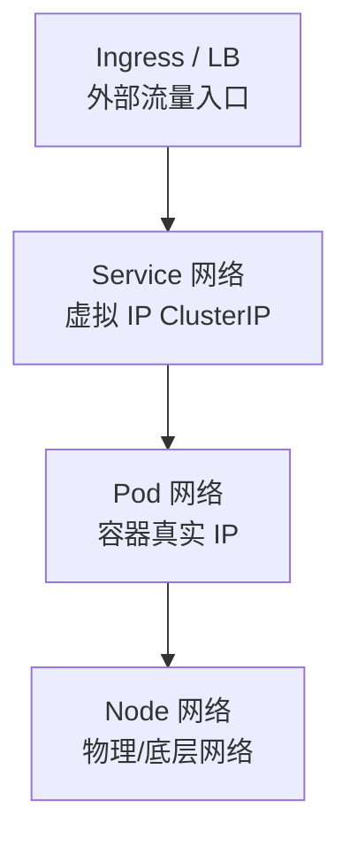

## 前置知识与学习目标

Kubernetes 网络解决四个递进的问题：**容器之间怎么通**（Pod 网络）、
**服务怎么被发现与负载均衡**（Service）、**外部流量怎么进来**
（Ingress）、**谁能访问谁**（NetworkPolicy）。这四层各由一个组件家族
实现，理解分层是排错的前提——「Pod 连不上 Service」和「外部连不上
Ingress」是两种完全不同的问题。

完成本文后，你应当能够：说出 K8s 网络模型的三条基本要求；理解 CNI
插件与 kube-proxy 的分工；看懂 iptables 规则大致含义；写出带 TLS 的
Ingress 与默认拒绝的 NetworkPolicy。

## 1. Kubernetes 网络模型

### 1.1 三条基本要求

K8s 对「 underneath」的网络实现不做规定，但所有 CNI 都必须满足：

| 要求             | 含义                                     |
| ---------------- | ---------------------------------------- |
| Pod 间直接通信   | Pod 到 Pod 不经过 NAT 直接可达           |
| Node 与 Pod 互通 | 节点与 Pod 通信也无需 NAT                |
| Pod 拥有独立 IP  | 每个 Pod 一个集群内唯一的 IP             |

「每个 Pod 一个 IP」意味着 Pod 内部视图就是一台普通主机：容器间用
`localhost` 互访，外部看到的 IP 与容器内 `ip addr` 看到的一致。这让
传统网络工具（ping、tcpdump）都能直接用于 Pod，也消除了端口映射的
心智负担——对比 Docker 默认桥接模式下「容器端口映射到宿主机」的模型。

### 1.2 四层流量视角



注意 Service IP 是**虚拟的**：没有接口持有这个地址，它只存在于
kube-proxy 写入的转发规则里。所以 `ping ClusterIP` 不通（ICMP 不被
代理）但 TCP 端口可达——这是新手排错第一坑。

## 2. CNI 插件：Pod 网络的实现者

### 2.1 常见 CNI 对比

| 插件    | 数据面          | 特点                       |
| ------- | --------------- | -------------------------- |
| Calico  | BGP/VXLAN/IPIP  | 网络策略成熟、纯三层可选   |
| Flannel | VXLAN/host-gw   | 简单易用（不支持 NetworkPolicy） |
| Cilium  | eBPF            | 高性能、L3-L7 策略、可观测 |
| Antrea  | OVS             | VMware 生态                |

### 2.2 两种基本组网思路

| 模式 | 描述 | 适用 |
| :--- | :--- | :--- |
| Overlay（VXLAN/IPIP 封装） | Pod 流量封装在底层网络之上 | 二层不通的底层网络、公有云 VPC |
| 路由（BGP/host-gw） | 底层网络直接学习 Pod 路由 | 自建机房可控网络、性能敏感 |

封装有开销（额外包头、MTU 减小），路由接近原生性能但要求底层配合。
Calico 与 Cilium 都同时支持两种模式，可按环境切换。

### 2.3 Cilium 与 eBPF

eBPF 允许在内核中安全地运行沙箱程序，Cilium 用它替换了整套
iptables 数据路径：Service 负载均衡、NetworkPolicy（可精确到 HTTP
方法/路径的 L7 策略）、加密（WireGuard/IPsec）都在内核态完成，绕过
iptables 规则链的线性匹配开销，并配套 Hubble 提供流量级可观测。

## 3. Pod 网络：veth 与 Pause 容器

### 3.1 同节点 Pod 通信

```text
Pod A（eth0）<== veth pair ==> 节点网桥/路由（cni0 等）<== veth pair ==> Pod B
```

每个 Pod 的 eth0 是一根「网线」的一端（veth pair），另一端插在节点上
（网桥或直接进路由表，名称随 CNI 而异）。同节点流量走二层/路由转发。

### 3.2 跨节点 Pod 通信

```text
Pod A → veth → 节点1 封装/路由 → 底层网络 → 节点2 解封装/路由 → veth → Pod B
```

Overlay 模式下「封装/解封装」是 VXLAN 头的加卸；路由模式下只是查
一次 BGP 学来的路由表。**MTU 是这类网络的经典故障点**：Overlay 会
占用约 50 字节包头，若节点网卡 MTU 为 1500 而 Pod 网络未相应调小，
会出现「小包通、大包挂」的诡异现象。

### 3.3 Pause 容器（infra 容器）

每个 Pod 里有一个不可见的 Pause 容器，它是 Pod 网络命名空间的**持有
者**：业务容器加入 Pause 创建的网络栈（共享 IP 与端口空间）。业务容器
崩溃重启时，Pause 保持网络命名空间存活，IP 不变——这就是「容器重启
但 Pod IP 稳定」的原因。自 K8s 1.29 起，原生 Sidecar 容器（`restartPolicy:
Always` 的 init 容器，1.33 GA）与业务容器同属一个网络栈，进一步丰富了
Pod 内的容器协作方式。

## 4. Service 网络：kube-proxy 的两种实现

### 4.1 工作原理

```text
Client → ClusterIP:Port → （节点上的转发规则）→ 某个后端 Pod IP:Port
```

kube-proxy 监听 Service/Endpoints 变化，在每个节点上把「ClusterIP ->
后端 Pod」的映射写成内核转发规则。它不是代理进程——流量在内核态就
被转走了。

### 4.2 iptables 模式

```bash
# 每个 Service 一条跳转规则，后端选择用概率链实现随机负载均衡
-A KUBE-SERVICES -d 10.96.0.1/32 -j KUBE-SVC-XXX
-A KUBE-SVC-XXX -m statistic --probability 0.33 -j KUBE-SEP-POD1   # 1/3 去Pod1
-A KUBE-SVC-XXX -m statistic --probability 0.5  -j KUBE-SEP-POD2   # 剩余的1/2去Pod2
-A KUBE-SVC-XXX -j KUBE-SEP-POD3                                    # 其余去Pod3
```

缺点：规则线性匹配，Service 数量上千后规则更新慢、转发开销增长。
较新的 Kubernetes 版本引入了基于 nftables 的模式作为 iptables 的继任
（逐步成熟），大规模集群可关注。

### 4.3 IPVS 模式

IPVS 用内核哈希表存储规则，Service 多时性能优势明显，且支持真正的
调度算法：

| 调度算法 | 描述       |
| -------- | ---------- |
| rr       | 轮询       |
| lc       | 最少连接   |
| wrr      | 加权轮询   |
| sh       | 源地址哈希（会话保持） |

选型经验：中小规模 iptables/nftables 足够；大几百个以上 Service 或需要
最少连接算法时用 IPVS。

## 5. Ingress：七层入口

### 5.1 架构

```text
Internet → Ingress Controller（真正的反向代理）→ Service → Pod
```

**Ingress 资源本身什么也不做**，它只是路由规则；必须有 Ingress
Controller（常驻的 Nginx/Traefik/Envoy 等）去消费这些规则并实际转发。
新装集群「Ingress 建了却不通」，九成是没装 Controller。

> 进阶：Ingress 的继任者 Gateway API 已于 2023 年发布 v1.0（GA），
> 角色分离（GatewayClass/Gateway/HTTPRoute）且支持更丰富的路由语义，
> 新项目值得优先评估（需控制器支持）。

### 5.2 配置示例

```yaml
apiVersion: networking.k8s.io/v1
kind: Ingress
metadata:
  name: web-ingress
  annotations:
    nginx.ingress.kubernetes.io/ssl-redirect: 'true'  # HTTP 强跳 HTTPS
spec:
  ingressClassName: nginx          # 指定由哪个 Controller 实现
  tls:
    - hosts: [example.com]
      secretName: tls-secret       # TLS 证书存于 Secret
  rules:
    - host: example.com
      http:
        paths:
          - path: /api
            pathType: Prefix       # 前缀匹配 /api 及其子路径
            backend:
              service:
                name: api-service
                port:
                  number: 8080
          - path: /
            pathType: Prefix
            backend:
              service:
                name: web-service
                port:
                  number: 80
```

### 5.3 Ingress Controller 对比

| Controller    | 特点                       |
| ------------- | -------------------------- |
| NGINX Ingress | 社区最广泛、注解生态丰富   |
| Traefik       | 自动发现、配置简单         |
| Envoy（Gateway API） | 服务网格与新一代网关 |
| Kong          | API 网关功能（鉴权/限流插件） |

## 6. NetworkPolicy：三层的「防火墙即代码」

### 6.1 概念

NetworkPolicy 用标签选择器控制 Pod 间流量（L3/L4）。核心心智模型是
**白名单**：一旦有策略选中某个 Pod，该 Pod 就进入「未明确允许即拒绝」
状态；没有任何策略时流量全部放行。

### 6.2 配置示例

```yaml
apiVersion: networking.k8s.io/v1
kind: NetworkPolicy
metadata:
  name: api-policy
  namespace: production
spec:
  podSelector:                 # 策略作用对象：app=api 的 Pod
    matchLabels:
      app: api
  policyTypes: [Ingress, Egress]
  ingress:
    - from:
        - namespaceSelector:   # 允许来自 production 命名空间……
            matchLabels: { env: production }
        - podSelector:         # ……且带 app=web 标签的 Pod（取交集需写在同一项内）
            matchLabels: { app: web }
      ports:
        - port: 8080
          protocol: TCP
  egress:
    - to:
        - podSelector:
            matchLabels: { app: database }   # 只允许访问数据库
      ports:
        - port: 5432
          protocol: TCP
```

注意 `from` 数组内多个元素是「或」，同一元素内 namespaceSelector 与
podSelector 才是「与」——这是策略写得「比预期宽」的常见原因。

### 6.3 默认拒绝

```yaml
# 空选择器 = 命名空间内所有 Pod；只有 policyTypes 无 rules = 全部拒绝
apiVersion: networking.k8s.io/v1
kind: NetworkPolicy
metadata:
  name: default-deny-ingress
spec:
  podSelector: {}
  policyTypes:
    - Ingress
```

零信任实践：每个命名空间先铺「默认拒绝（入+出）」，再按调用关系逐条
放行。DNS 出站（UDP 53 到 kube-system）是最常被漏掉的一条放行规则，
漏了表现为「服务名解析失败」。

> 前提：NetworkPolicy 需要 CNI 支持（Calico/Cilium/Antrea 均支持，
> **Flannel 不支持**）。装了策略但不生效，先确认 CNI。

## 小结

- 初学者要点：网络模型三要求（Pod IP 直通无 NAT）；Service IP 是虚拟
  的、ping 不通 TCP 通；Ingress 资源必须配 Controller 才生效；
  NetworkPolicy 是白名单模型，默认拒绝 + 逐条放行；Flannel 不支持
  NetworkPolicy。
- 进阶注意：Overlay 网络的 MTU 问题表现为「小包通大包挂」；iptables
  模式在大规模下有规则膨胀问题，可选 IPVS/nftables；Cilium 的 eBPF
  数据面带来 L7 策略与流量可观测；namespaceSelector 与 podSelector
  的与/或关系是策略放得过宽的常见原因；新项目可评估 Gateway API
  取代 Ingress。
