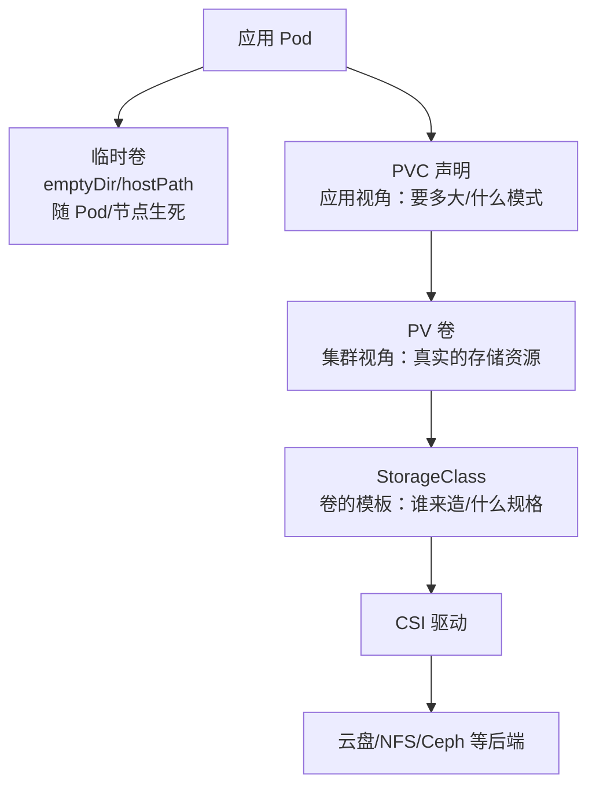

## 前置知识与学习目标

容器默认是「易失」的：Pod 重建，文件系统即清零。K8s 存储体系要解决的
问题正是**把数据生命周期与 Pod 生命周期解耦**——从最轻量的临时目录，
到跨节点漂移仍能跟随的云盘，再到由存储管理员预置的共享卷。

完成本文后，你应当能够：为临时数据与持久数据选择正确的卷类型；说清
PV/PVC/StorageClass 三者的分工与绑定流程；理解动态供给与
WaitForFirstConsumer 的意义；避开扩容、跨区绑定等高频陷阱。

## 1. 存储概述

### 1.1 三类心智模型



### 1.2 卷类型速览

| 类型      | 描述       | 生命周期 | 典型用途               |
| --------- | ---------- | -------- | ---------------------- |
| emptyDir  | Pod 内临时空目录 | 随 Pod 删除 | 缓存、容器间共享文件 |
| hostPath  | 节点上的路径 | 随节点   | 节点日志采集（慎用）   |
| PVC/PV    | 持久卷     | 独立存在 | 数据库、状态ful 应用   |
| ConfigMap/Secret | 配置/敏感数据 | 独立对象 | 配置挂载           |

## 2. PV 与 PVC：申请与供给的解耦

类比：PVC 是开发提的「存储需求单」（我要 10Gi、可单节点读写），PV 是
满足需求单的「实际库房」。两者由 K8s 控制器按容量、访问模式、
StorageClass 匹配绑定，开发不需要知道后端是什么存储。

### 2.1 PV 示例（管理员手工供给）

```yaml
apiVersion: v1
kind: PersistentVolume
metadata:
  name: pv-nfs
spec:
  capacity:
    storage: 50Gi
  accessModes: [ReadWriteMany]
  persistentVolumeReclaimPolicy: Retain   # 释放后保留数据
  storageClassName: nfs
  nfs:
    server: 10.0.0.100
    path: /data/share
```

### 2.2 PVC 示例（应用侧申请）

```yaml
apiVersion: v1
kind: PersistentVolumeClaim
metadata:
  name: app-data
spec:
  accessModes: [ReadWriteOnce]
  resources:
    requests:
      storage: 10Gi
  storageClassName: fast-ssd    # 指定类：不指定则匹配无类 PV
```

Pod 里通过 `volumes: [{name: data, persistentVolumeClaim: {claimName: app-data}}]`
挂载使用。

### 2.3 访问模式

| 模式             | 缩写 | 描述                       |
| ---------------- | ---- | -------------------------- |
| ReadWriteOnce    | RWO  | 单节点读写（云盘的默认形态） |
| ReadOnlyMany     | ROX  | 多节点只读                 |
| ReadWriteMany    | RWX  | 多节点读写（需 NFS/CephFS 类共享存储） |
| ReadWriteOncePod | RWOP | 单 Pod 读写（1.27 起以 beta 引入） |

关键认知：RWO 限制的是**节点**不是 Pod——同一节点上多个 Pod 可以共用
一块 RWO 云盘。云盘（EBS/Azure Disk/PD）只支持 RWO，需要 RWX（多 Pod
并发写）就得用文件存储（EFS/Azure Files/NFS）或对象存储方案。

### 2.4 回收策略

| 策略    | 描述                         |
| ------- | ---------------------------- |
| Retain  | 释放后保留数据，需手动清理   |
| Delete  | 删除 PV 并联动删除后端存储   |
| Recycle | 已废弃（ scrub 后复用），勿用 |

生产建议：重要数据一律 `Retain`，防止删 PVC 联动删云盘；动态供给的
StorageClass 可全局设 `reclaimPolicy`。

## 3. StorageClass：动态供给

### 3.1 概念与示例

StorageClass 是「卷的模具」：定义由哪个 provisioner 造卷、什么规格、
什么回收策略。PVC 指定 StorageClass 后，卷**按需自动创建**，无需
管理员预建 PV——这是云环境的默认工作方式。

```yaml
apiVersion: storage.k8s.io/v1
kind: StorageClass
metadata:
  name: fast-ssd
provisioner: ebs.csi.aws.com       # 由谁供给
parameters:                        # 传给 CSI 驱动的规格参数
  type: gp3
reclaimPolicy: Delete
volumeBindingMode: WaitForFirstConsumer
allowVolumeExpansion: true         # 允许 PVC 在线扩容
```

### 3.2 卷绑定模式

| 模式                 | 行为                 | 风险/收益 |
| -------------------- | -------------------- | --------- |
| Immediate            | PVC 建成立即造卷绑定 | 卷可能落在与 Pod 不同的可用区 |
| WaitForFirstConsumer | 等 Pod 调度确定节点后再造卷 | 卷与 Pod 同区，多 AZ 集群必配 |

> 陷阱（多可用区集群经典故障）：Immediate 模式下 PVC 在 AZ-a 造了卷，
> Pod 却被调度到 AZ-b，挂载失败且换区无解（云盘不能跨区挂）。多 AZ
> 集群的 StorageClass 应一律 `WaitForFirstConsumer`。

### 3.3 在线扩容

`allowVolumeExpansion: true` 后，直接改 PVC 的 storage 请求即可扩容
（文件系统随驱动在线扩展，多数场景无需重启）：

```bash
# 把 PVC 从 10Gi 扩到 20Gi（只能扩大，不能缩小）
kubectl patch pvc app-data -p '{"spec":{"resources":{"requests":{"storage":"20Gi"}}}}'
```

K8s 卷不支持缩容——规格规划宁可先小后扩，配合监控告警。

## 4. CSI：存储插件的统一接口

### 4.1 概念

CSI（Container Storage Interface）把「K8s 怎么指挥存储」标准化为一组
gRPC 接口：存储厂商只需实现 CSI 驱动，无需改 K8s 内核代码。这是
in-tree 卷插件（如老的 kubernetes.io/aws-ebs）被逐步移除后的唯一路径。

### 4.2 架构

```text
K8s 控制器 → CSI Sidecar（转发 K8s 事件）→ CSI Driver（厂商实现）→ 存储后端
```

### 4.3 常见 CSI 驱动

| 驱动                      | 后端存储            |
| ------------------------- | ------------------- |
| ebs.csi.aws.com           | AWS EBS             |
| disk.csi.azure.com        | Azure Disk          |
| pd.csi.storage.gke.io     | GCP Persistent Disk |
| diskplugin.csi.alibabacloud.com | 阿里云云盘    |
| ceph-csi                  | Ceph RBD/CephFS     |
| nfs.csi.k8s.io            | NFS                 |

## 5. 临时存储：emptyDir 与 hostPath

### 5.1 emptyDir：Pod 内共享的临时目录

```yaml
apiVersion: v1
kind: Pod
metadata:
  name: cache-pod
spec:
  containers:
    - name: app
      image: nginx
      volumeMounts:
        - name: cache
          mountPath: /cache
  volumes:
    - name: cache
      emptyDir:
        medium: Memory      # 用内存当盘（tmpfs），快但计入容器内存
        sizeLimit: 256Mi    # 必须设上限，防止吃光节点内存
```

典型用途：sidecar 处理日志/产物时的中转目录、 checkpoint 缓存。
Pod 删除即清空；容器崩溃重启**不**清空（卷随 Pod 而非容器）。

### 5.2 hostPath：直通节点目录（慎用）

```yaml
volumes:
  - name: data
    hostPath:
      path: /var/log/app
      type: DirectoryOrCreate
```

hostPath 让 Pod 读写节点文件系统，有两大问题：调度不感知（Pod 漂移到
别的节点数据就「丢了」）、安全风险（挂 `/` 等于把节点交出去）。合理的
用武之地基本只剩 DaemonSet 形态的节点级组件（日志/监控采集器）。普通
应用要持久化，请走 PVC。

## 6. 存储最佳实践

| 实践                 | 理由                           |
| -------------------- | ------------------------------ |
| 应用只声明 PVC       | 解耦应用与存储实现             |
| 动态供给 + StorageClass | 免去手工造 PV               |
| 多 AZ 用 WaitForFirstConsumer | 避免跨区绑定失败     |
| 重要数据 Retain + 定期快照 | 防 PVC 误删连坐后端卷  |
| allowVolumeExpansion | 预留在线扩容能力（不能缩容）   |
| 加密（云盘 KMS）     | 静态加密默认开启最省心         |
| 监控容量与 inode     | 满盘引发的应用故障往往很隐蔽   |

K8s 1.27+ 还提供了通用的 **VolumeSnapshot**（基于 CSI）：像 PV 一样用
`VolumeSnapshot` 对象对 PVC 打快照，配合定时策略形成数据库类负载的
基础备份方案。

## 小结

- 初学者要点：临时数据用 emptyDir，持久数据用 PVC；PVC 是需求单、PV
  是库房、StorageClass 是模具；云盘是 RWO，多 Pod 并发写需要 RWX 文件
  存储；回收策略决定删 PVC 时数据是否连带删除。
- 进阶注意：多 AZ 集群必须 WaitForFirstConsumer；卷只能扩不能缩；
  Recycle 已废弃、hostPath 仅限节点级组件；应用侧始终引用 PVC 而非
  直接造 PV；快照（VolumeSnapshot）+ Retain 是数据安全的双保险。
