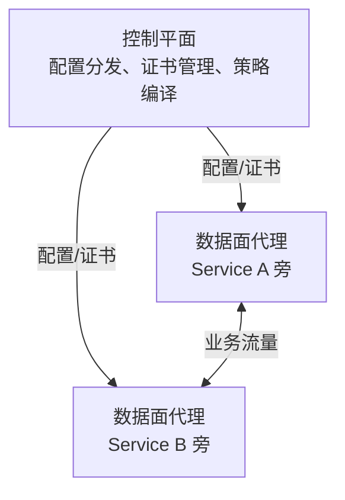

## 前置知识与学习目标

微服务数量一多，三类问题会在**每个服务**里重复出现：重试/超时/熔断怎么
写、服务间调用怎么加密、调用链怎么追踪。传统做法是把这些逻辑塞进各语言
的 SDK（如 Spring Cloud）——多语言团队要维护 N 份实现，库升级要推动 N 个
应用重发版。

服务网格（Service Mesh）把这三类逻辑从应用代码里抽出来，下沉为**基础
设施层**：应用只管业务，流量治理由网络旁的代理完成。类比：SDK 方案是
「每家自己雇保安」，网格是「小区统一安保」。

完成本文后，你应当能够：说清 Sidecar 与 ambient 两种数据面的取舍；
读懂 Istio 的 VirtualService/DestinationRule/安全策略；判断自己的系统
是否真的需要网格。

## 1. 服务网格概述

### 1.1 架构模式



关键原则：**流量永远经过代理，代理由控制平面统一编程**。应用无感知
（代码零改动），治理策略集中在 YAML 里声明。

### 1.2 核心功能

| 功能     | 描述                   |
| -------- | ---------------------- |
| 流量管理 | 路由、按权重分流、重试、超时 |
| 安全     | mTLS 自动加密、服务级认证授权 |
| 可观测性 | 每个 hop 的指标、日志、追踪 |
| 弹性     | 熔断、限流、故障注入   |

## 2. Istio

Istio 是事实上的主流方案（撰写时最新为 1.3x 系列，约每季度一个次版本）。

### 2.1 两种数据面：Sidecar 与 ambient

**Sidecar 模式（经典）**：每个 Pod 注入一个 Envoy 代理容器，接管全部
进出流量。优点是隔离好、策略细；代价是资源翻倍（每 Pod 多 0.1-0.5 核
量级内存开销）、升级网格要重启全部业务 Pod、注入顺序引发启动竞态。

**ambient 模式（Istio 1.24 起 GA，现行主推）**：代理下沉到**节点级**：

- `ztunnel`：每节点一个的 Rust 隧道，负责 L4 的 mTLS 加密与 TCP 路由；
- `waypoint`：按需部署的 L7 代理，只有需要七层策略（HTTP 路由、鉴权）
  的命名空间才部署。

| 维度       | Sidecar            | ambient               |
| ---------- | ------------------ | --------------------- |
| 资源开销   | 每 Pod 一份        | 节点级共享，显著更低  |
| 应用侵入性 | 需注入/重启        | 命名空间打标签即接入  |
| L7 能力    | 默认全量           | 按需（waypoint）      |
| 成熟度     | 长期生产验证       | GA 后快速增长期       |

新集群建议默认评估 ambient；已有大规模 Sidecar 部署不必为迁移而迁移。

### 2.2 控制平面与流量管理

控制平面 `istiod`（合并了早期的 Pilot/Citadel/Galley）：配置分发 +
证书签发（每个工作负载一个短生命周期 SPIFFE 身份）。

流量管理的核心是两个 CRD 的分工：**VirtualService 管「怎么路由」，
DestinationRule 管「目标长什么样」**（子集、负载均衡、熔断）；南北向
入口流量再叠加 Gateway CRD：

```yaml
# VirtualService：按头匹配走 v2，其余按 90/10 分流
apiVersion: networking.istio.io/v1
kind: VirtualService
metadata:
  name: reviews
spec:
  hosts: [reviews]
  http:
    - match:
        - headers:
            x-user-type:
              exact: premium
      route:
        - destination: {host: reviews, subset: v2}
    - route:
        - destination: {host: reviews, subset: v1}
          weight: 90
        - destination: {host: reviews, subset: v2}
          weight: 10
```

```yaml
# DestinationRule：定义 v1/v2 子集（对应 Pod 标签）与熔断
apiVersion: networking.istio.io/v1
kind: DestinationRule
metadata:
  name: reviews
spec:
  host: reviews
  trafficPolicy:
    connectionPool:
      tcp: {maxConnections: 100}
    outlierDetection:            # 连续 5xx 熔断摘除
      consecutive5xxErrors: 5
      interval: 30s
      baseEjectionTime: 30s
  subsets:
    - name: v1
      labels: {version: v1}
    - name: v2
      labels: {version: v2}
```

### 2.3 安全策略

```yaml
# PeerAuthentication：命名空间级强制 mTLS（明文流量被拒）
apiVersion: security.istio.io/v1
kind: PeerAuthentication
metadata:
  name: default
  namespace: istio-system
spec:
  mtls: {mode: STRICT}
```

```yaml
# AuthorizationPolicy：L7 级授权——只有 web 服务账号能 GET/POST /api/*
apiVersion: security.istio.io/v1
kind: AuthorizationPolicy
metadata:
  name: api-access
spec:
  selector:
    matchLabels: {app: api}
  rules:
    - from:
        - source:
            principals: ['cluster.local/ns/default/sa/web']
      to:
        - operation:
            methods: ['GET', 'POST']
            paths: ['/api/*']
```

mTLS 的真正价值：证书签发与轮换全自动（应用零配置），身份绑定到服务
账号而非网络位置——这是零信任网络在 K8s 里的落地形态。

### 2.4 可观测性

网格代理在每个 hop 自动产出 RED 指标（速率/错误/延迟）与追踪 span：

| 组件       | 功能       |
| ---------- | ---------- |
| Prometheus | 指标收集   |
| Grafana    | 指标可视化 |
| Jaeger     | 分布式追踪 |
| Kiali      | 服务拓扑图 |

无需应用改代码即可获得全链路指标——这是网格最「回本」的能力。

## 3. Linkerd

| 特点      | 描述                     |
| --------- | ----------------------- |
| 轻量级    | Rust 实现的 linkerd2-proxy |
| 简单      | 最小化配置、默认可用     |
| 自动 mTLS | 默认启用                 |

| 对比项   | Istio               | Linkerd            |
| -------- | ------------------- | ------------------ |
| 代理     | Envoy (C++)         | linkerd2-proxy (Rust) |
| 复杂度   | 高（功能面广）      | 低（克制）         |
| L7 扩展  | 故障注入/复杂匹配等 | 核心路由功能       |
| 资源消耗 | ambient 后差距缩小  | Sidecar 模式下更低 |
| 适用     | 大规模、复杂策略    | 快速落地、运维有限 |

选型本质：Linkerd 是「把 80% 的网格价值（mTLS/重试/指标）用 20% 的复杂度
给你」；Istio 是「全功能但要先养一个平台团队」。

## 4. 流量管理三场景

### 4.1 金丝雀发布

```yaml
# 90% v1 / 10% v2，观测错误率后逐步调整 weight
apiVersion: networking.istio.io/v1
kind: VirtualService
spec:
  http:
    - route:
        - destination: {host: myapp, subset: v1}
          weight: 90
        - destination: {host: myapp, subset: v2}
          weight: 10
```

配合自动化（Argo Rollouts/Flagger）可将「调权重」变成指标驱动的
自动推进/自动回滚。

### 4.2 故障注入（混沌工程）

```yaml
# 10% 的请求注入 500ms 延迟，验证上游的超时与降级
apiVersion: networking.istio.io/v1
kind: VirtualService
spec:
  http:
    - fault:
        delay:
          percentage: {value: 10}
          fixedDelay: 500ms
      route:
        - destination: {host: myapp}
```

### 4.3 重试与超时

```yaml
apiVersion: networking.istio.io/v1
kind: VirtualService
spec:
  http:
    - route:
        - destination: {host: myapp}
      retries:
        attempts: 3
        perTryTimeout: 2s
        retryOn: 5xx,reset,connect-failure
      timeout: 10s        # 整体预算，避免重试放大
```

> 陷阱：重试会放大流量（3 次重试 = 最坏 4 倍请求）。必须同时设置
> `perTryTimeout` 与整体 `timeout`，且只对幂等操作或幂等化后的接口
> 启用重试，否则会产生重复写入。

## 5. 何时不要上服务网格

网格的收益必须大于其成本（复杂度 + 排错成本 + 资源开销）。以下情况
建议缓行：

| 信号                       | 更轻的替代                       |
| -------------------------- | -------------------------------- |
| 服务数 < 10、单体为主      | K8s 原生 Service + Ingress       |
| 只想要 mTLS                | Cilium eBPF 透明加密 / ambient ztunnel |
| 只想要金丝雀               | Ingress 权重 / Argo Rollouts    |
| 团队无专职平台人员         | Linkerd 而非 Istio 全家桶       |

务实的演进路径：先用 K8s 原生能力，等服务间治理需求（统一 mTLS、
精细化灰度、全链路策略）真实出现时，再以 ambient 或 Linkerd 低成本接入。

## 小结

- 初学者要点：网格 = 把流量治理从 SDK 下沉到代理基础设施；三大能力是
  流量管理、mTLS、可观测；Istio 由 istiod（控制面）+ Envoy/ztunnel
  （数据面）组成；VirtualService 管路由、DestinationRule 管目标策略。
- 进阶注意：Sidecar 模式有真实的每 Pod 资源税与升级重启成本；ambient
  自 1.24 GA，以节点级 ztunnel + 按需 waypoint 重构了成本模型；重试
  必须配超时预算并保证幂等；要不要上网格先问「现有需求能否用
  Ingress + Argo Rollouts 解决」；微服务规模超过约 20-50 个时，网格的投资回报
  才开始清晰。
