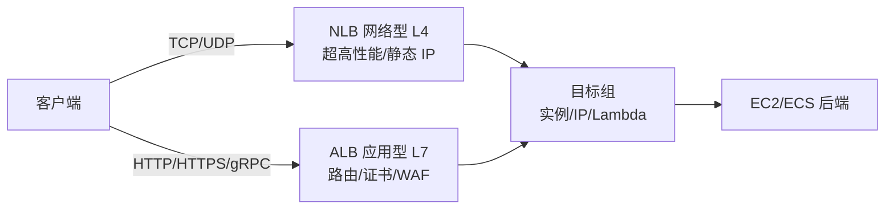

## 前置知识与学习目标

负载均衡（LB）把流量分摊到多台实例，自动伸缩（Auto Scaling）按负载
调整实例数量——两者组合成云上「弹性」的完整闭环：LB 让多实例有意义，
AS 让实例数量可变。本文以 AWS 三个负载均衡器与 EC2 Auto Scaling 为主
线展开，选型思路对 Azure/GCP 同样适用（Azure Load Balancer/Application
Gateway、GCP 网络负载均衡/HTTPS 负载均衡是同构概念）。

完成本文后，你应当能够：为业务选对负载均衡器；配置目标追踪等伸缩
策略；理解两套健康检查的差异；避免伸缩滞后与抖动两类经典问题。

## 1. 负载均衡器三兄弟

### 1.1 全景对比



| 维度 | ALB（应用型 L7） | NLB（网络型 L4） | CLB（经典型，旧） |
| :--- | :--- | :--- | :--- |
| 工作层次 | HTTP/HTTPS/gRPC | TCP/UDP/TLS | L4 兼旧（也含部分 L7） |
| 路由能力 | 路径/主机名/Header/查询串 | 端口/监听器级 | 极有限 |
| 性能模型 | 弹性节点 | 固定源 IP、超低延迟、亿级连接 | 旧架构 |
| IP 类型 | 弹性分配 | 每可用区静态 IP（可挂 EIP） | 随机 |
| 典型场景 | Web/API 入口 | 游戏服/物联网/MQTT、数据库前端 | 存量迁移 |

选型口诀：**看协议不看感觉**——HTTP 族选 ALB；非 HTTP（TCP/UDP 长连接）
或需要静态 IP/极高吞吐选 NLB；CLB 仅在存量架构中遇到，新设计不考虑。

### 1.2 ALB 的关键能力

```yaml
# ALB 监听器规则示意（Terraform/控制台同构）：按路径分流到不同目标组
listener_rules:
  - priority: 1
    action: forward
    condition: {path_pattern: "/api/*"}
    target_group: api-tg        # API 服务
  - priority: 2
    action: forward
    condition: {path_pattern: "/admin/*", source_ip: "10.0.0.0/8"}
    target_group: admin-tg      # 仅内网可访问的管理面
  - priority: 100
    action: forward
    condition: default
    target_group: web-tg        # 兜底
```

ALB 原生集成 AWS WAF（应用防火墙）、ACM 证书自动续期、OIDC/Cognito
认证（在 LB 层就挡住未登录请求）。目标组除了 EC2 实例，还能直接挂
ECS 任务、IP 目标（混合部署）、甚至 Lambda——Serverless 后端的常用入口。

### 1.3 NLB 的关键能力

- 每可用区一个**静态 IP**（可绑弹性 IP），下游防火墙/白名单友好；
- 连接级别性能高且延迟低，支持每秒数百万连接，无需预热；
- 支持 Proxy Protocol v2 传递真实源 IP（L4 不改包，后端看不到 X-Forwarded-For）；
- 可与 ALB 叠加：NLB 在前（静态 IP）+ ALB 在后（L7 路由）的组合架构。

## 2. Auto Scaling：让实例数量变成策略

### 2.1 组成三件套

```text
启动模板（Launch Template）
   = 新实例的「出生证明」：AMI、规格、安全组、User Data
Auto Scaling 组（ASG）
   = 容量管理单元：min/max/desired、分布在哪些子网
伸缩策略（Scaling Policy）
   = 什么时候调 desired：目标追踪/步进/定时
```

| 项 | 说明 | 经验值 |
| :--- | :--- | :--- |
| min | 保底容量 | >= 2（跨 AZ 抗单点） |
| desired | 期望容量 | 稳态水位 |
| max | 上限 | 结合预算设硬顶，防失控扩容 |
| AZ 再平衡 | 自动均衡跨 AZ 实例 | 保持默认开启 |

### 2.2 伸缩策略四型

| 策略 | 原理 | 适用 |
| :--- | :--- | :--- |
| 目标追踪 | 「保持 CPU 40%」，自动加减 | 绝大多数场景（首选） |
| 步进 | 按指标区间阶梯式加减 | 需要不对称扩缩 |
| 定时 | 日历时间点调整 | 可预测的潮汐流量 |
| 预测式 | 机器学习预测 + 提前扩 | 每日强周期 + 长启动时间 |

```bash
# 目标追踪：平均 CPU 保持 40%，伸缩速度由 ASG 自动优化
aws autoscaling put-scaling-policy \
  --auto-scaling-group-name web-asg \
  --policy-name cpu40-target \
  --policy-type TargetTrackingScaling \
  --target-tracking-configuration '{
    "PredefinedMetricSpecification": {"PredefinedMetricType": "ASGAverageCPUUtilization"},
    "TargetValue": 40.0
  }'

# 负载均衡请求数目标追踪：每个实例每分钟最多 1000 次请求
aws autoscaling put-scaling-policy \
  --auto-scaling-group-name web-asg \
  --policy-name req-target \
  --policy-type TargetTrackingScaling \
  --target-tracking-configuration '{
    "PredefinedMetricSpecification": {
      "PredefinedMetricType": "ALBRequestCountPerTarget",
      "ResourceLabel": "app/my-alb/12345/targetgroup/web-tg/67890"
    },
    "TargetValue": 1000.0
  }'
```

> 陷阱一：目标追踪指标必须与容量**成比例**（CPU、请求数/实例可以，
> 队列长度、P99 延迟不成比例，不适合目标追踪）。
>
> 陷阱二：缩容比扩容危险。给指标加合适的目标值缓冲（如 CPU 40% 而非
> 70%），并依赖 ASG 内置的缩容冷却，避免「抖动」（扩了又缩、缩了又扩）。

## 3. 健康检查：两套体系，职责不同

| 层 | 检查什么 | 动作 |
| :--- | :--- | :--- |
| EC2 状态检查（系统级） | 硬件/电源/网络/内核挂死 | ASG 自动替换故障实例 |
| ELB 目标组健康检查（应用级） | 端口可连 + HTTP 状态码/路径 | 不健康目标停止接收流量 |

```bash
# 目标组健康检查配置：打真实业务路径，而非 /
aws elbv2 modify-target-group \
  --target-group-arn arn:aws:elasticloadbalancing:...:targetgroup/web-tg/... \
  --health-check-path /healthz \
  --health-check-interval-seconds 15 \
  --healthy-threshold-count 2 \
  --unhealthy-threshold-count 3 \
  --matcher HttpCode=200-399
```

两套检查的分工决定了「谁踢谁」：实例宕机由 EC2 检查触发替换；应用假死
（进程在、服务不可用）只能靠 ELB 应用级检查发现。**应用要实现
`/healthz` 语义**——200 代表「能处理请求」，依赖的数据库不可用时可以
返回 503（读路径不可用即不接流量）。

> 陷阱：健康检查过严（阈值 1 次、间隔 5 秒）会让短暂 GC 停顿或部署
> 抖动变成「实例被踢 -> 全组重启风暴」；过松则故障实例继续接流量。
> 生产典型值：间隔 10-30 秒、连续 2-3 次失败判定不健康。

## 4. 最佳实践

### 4.1 伸缩滞后与预热

扩容不是瞬时的：指标反应延迟（1-3 分钟）+ 启动模板拉起实例（1-5 分钟）
+ 应用预热（连接池/JIT/缓存）+ 健康检查通过，全链路可达 5-10 分钟。
对策：

- 指标留提前量：目标值设得保守（40% 而不是 90%）；
- 定时策略覆盖已知高峰（大促、整点任务）；
- 预测式伸缩应对强日周期负载；
- LB/ASG 现已自动弹性扩容，无 historic 预热义务，但**应用自身**的
  预热（慢启动：新实例权重渐进）仍需设计。

### 4.2 容量预留与成本

| 手段 | 作用 |
| :--- | :--- |
| ON-Demand 容量预留 | 确保关键时刻一定能拿到实例（容量保障） |
| Savings Plans/预留 | 折扣价覆盖稳态基线 |
| Spot + 混合 ASG | 基线按需 + 弹性层 Spot（可省 60-90%） |

ASG 的容量再平衡（Capacity Rebalancing）可在 Spot 回收前主动替换，
配合多实例类型的「属性式」扩容（多种规格+多种购买选项）是弹性层的
标准省钱姿势。

### 4.3 与部署的协同

- 滚动发布依赖 ASG：新启动模板 -> 滚动替换（Instance Refresh）；
- 缩容默认按「最旧的启动配置」淘汰实例，与发布节奏冲突时需自定义
  缩容策略（如优先淘汰最旧实例或按可用区均衡）；
- 实例保护（`--protect-from-scale-in`）可防止关键实例被缩容误杀。

## 小结

- 初学者要点：HTTP 业务选 ALB、TCP/UDP 或要静态 IP 选 NLB、CLB 不用于
  新设计；ASG 三件套（启动模板/组/策略）；伸缩策略首选目标追踪，指标
  必须与容量成比例；健康检查分 EC2 系统级与 ELB 应用级两层，各管各的。
- 进阶注意：扩容全链路 5-10 分钟，峰值前要有定时/预测式伸缩兜底；
  缩容参数保守化防抖动；应用必须实现语义化 `/healthz`；Spot 混合
  ASG + 容量再平衡是弹性层省钱的成熟方案；缩容淘汰顺序要与发布节奏
  一起设计，防止刚发布的实例被先杀。
