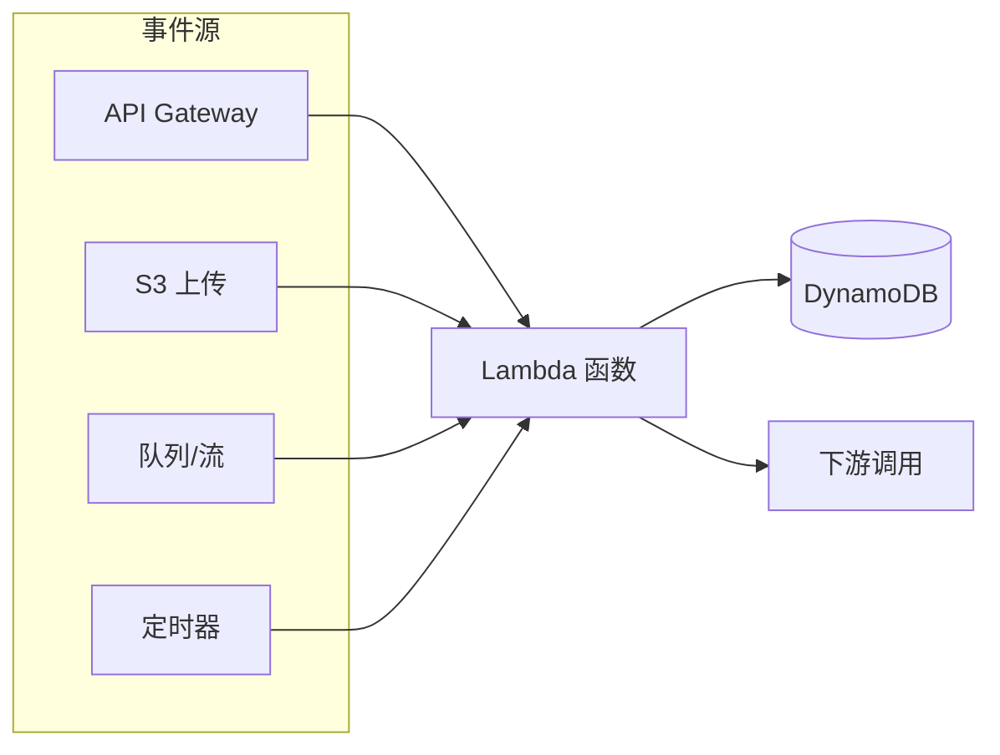
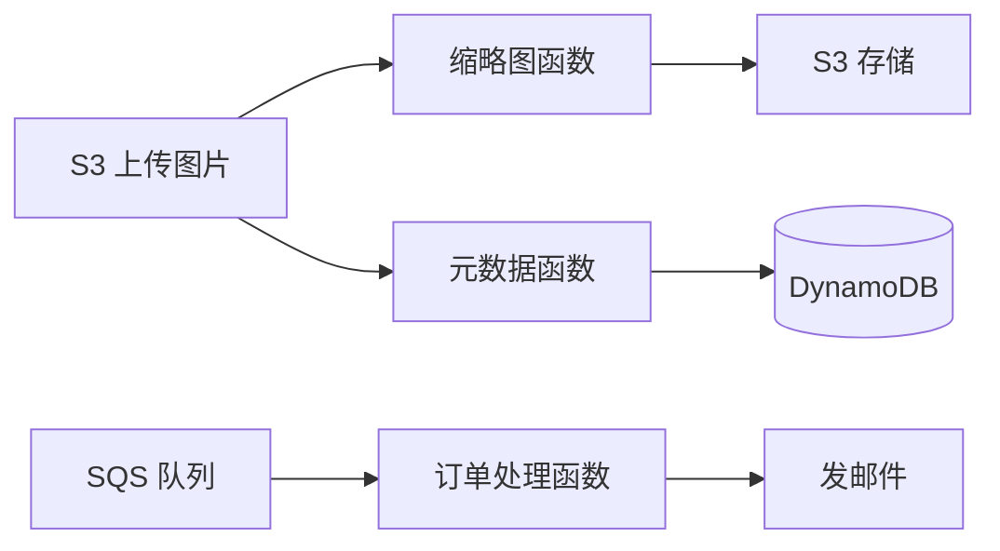

## 前置知识与学习目标

Serverless（无服务器）不是「没有服务器」，而是**你不管理服务器**：
机器的供给、扩缩容、打补丁全部由云商负责，你只上传代码与声明触发器。
它同时是一种计费模式——不为闲置时间付费，只在代码运行时计费（毫秒级）。

完成本文后，你应当能够：区分 FaaS 与 BaaS；解释冷启动的成因并用预留
并发/预置并发缓解；说出 FaaS 的硬性限制与绕行方案；用 Serverless
Framework 部署一个事件驱动的服务。

## 1. Serverless 原理

### 1.1 FaaS 与 BaaS：两块拼图

| 组件 | 全称 | 是什么 | 例子 |
| :--- | :--- | :--- | :--- |
| FaaS | Function as a Service | 托管的函数运行时，事件触发、按次计费 | Lambda、Cloud Functions、阿里云 FC |
| BaaS | Backend as a Service | 托管的后端能力，API 即用 | DynamoDB、Cognito、S3、AppSync |

完整的 Serverless 应用 = FaaS（计算）+ BaaS（状态与能力）。只用 Lambda
但自建一台 MySQL「配菜」，等于只走了一半——那台 MySQL 仍然要你管。

### 1.2 事件驱动模型

FaaS 的心脏是**事件源 -> 触发器 -> 函数**：



两种调用语义决定了容错设计：

- **同步调用**（API Gateway -> Lambda）：调用方等结果，错误直接返回；
- **异步调用**（S3/SQS 事件触发）：事件入队后立即返回，失败自动重试
  （通常 2 次），重试耗尽后进入**死信队列（DLQ）或失败目标**——生产
  系统必须配置并监控 DLQ，否则错误事件会静默消失。

## 2. Lambda：冷启动与并发控制

### 2.1 冷启动的成因

一个请求到达时若没有现成的执行环境，Lambda 要经历「init 阶段」：

```text
下载代码 -> 启动运行时（如 Python 解释器/JVM）-> 执行函数初始化代码 -> 处理请求
└────────────────── 这段就是冷启动延迟，用户在等待 ──────────────────┘
```

量级经验：Python/Node 通常几十到几百毫秒；JVM/.NET 大型应用可达秒级。
后续请求复用同一执行环境（ warm），不再付费 init。

缓解手段（按性价比排序）：

1. **选对运行时**：解释型语言冷启动天然低；Java 用 SnapStart（恢复
   执行环境快照）可把冷启动压到百毫秒级，Python/.NET 也已有 SnapStart
   能力（以官方文档支持矩阵为准）；
2. **减小包体**：依赖裁剪、分层（Lambda Layers 按需挂载）；
3. **内存即 CPU**：Lambda 的 CPU 配额与内存成正比，加大内存反而常常
   降总成本（跑得快 = 计费毫秒少），用 AWS Lambda Power Tuning 工具
   找最优点；
4. **初始化移出处理路径**：SDK 客户端、数据库连接放在 handler 外的
   全局段，init 阶段完成一次。

### 2.2 预留并发 vs 预置并发（最容易混淆的两个开关）

| 机制 | 做什么 | 解决什么 |
| :--- | :--- | :--- |
| 预留并发（Reserved Concurrency） | 从账户并发池里**划走**一块，保证该函数最多可用 N 个并发 | 防止某个函数吃光全账户并发（限流保护） |
| 预置并发（Provisioned Concurrency） | **预先加热** N 个执行环境常驻 | 消灭冷启动，延迟稳定 |

一句话：Reserved 是「限量」，Provisioned 是「预热」。关键路径 API 用
Provisioned + 自动扩缩（按计划或按利用率），批处理函数用 Reserved
做账户级隔离。

## 3. 架构模式

### 3.1 API Gateway + Lambda：标准 Web API

```yaml
# serverless.yml 片段：一个函数 + HTTP 触发
service: my-service
provider:
  name: aws
  runtime: python3.12
  region: us-east-1
  environment:
    TABLE_NAME: users
functions:
  api:
    handler: handler.api
    events:
      - httpApi:
          path: /users
          method: get
```

优点：零闲置成本、自动扩缩；要注意 API Gateway 按请求计费且 P99 比
常驻服务高（含冷启动尾部），对延迟极敏感的同步链路需评估。

### 3.2 事件管道：Serverless 的主场



「上传触发处理」、日志/事件清洗、定时对账这类碎片化异步任务，是
Serverless 相对常驻服务有绝对优势的场景：事件源天然解耦、按次计费、
无需为 99% 的空闲时间付钱。

### 3.3 限制与对策

| 限制（Lambda，以官方为准） | 影响 | 对策 |
| :--- | :--- | :--- |
| 单次执行 <= 15 分钟 | 长任务跑不完 | 分片、Step Functions 编排、改容器/批次 |
| 部署包体积上限（解压 10GB 级） | 大依赖装不下 | Layers、镜像格式部署 |
| /tmp 临时空间有限 | 大文件中转难 | 直传 S3，不落地本地 |
| 无持久连接上下文 | WebSocket 要配合 API Gateway | 托管 WebSocket API |
| 并发账户级默认上限 | 突发被限流 | 提额 + Reserved 隔离 |
| 每毫秒计费但粒度 1ms | 高频长跑不划算 | 稳态常驻负载改容器/EC2 |

> 陷阱：Serverless 不是「总更便宜」。7x24 稳态、高利用率的负载，
> 容器/实例的包月成本远低于按毫秒累计的函数账单；**波动大、稀疏、
> 可并行**的负载才是 Serverless 的成本甜区。

## 4. Serverless Framework 实操

Serverless Framework 是最流行的 FaaS 部署工具（另有 AWS SAM、CDK、
Pulumi，见 `530-PulumiCommands`）。注意其 v4 起改为专有许可（个人与
小团队注册后可免费使用，商业使用需留意授权条款）；纯开源诉求可选
AWS SAM。

```bash
# 安装 CLI
npm install -g serverless
serverless --version

# 配置 AWS 部署凭证（复用 AWS CLI 的 profile 更规范）
serverless config credentials --provider aws --key <AK> --secret <SK>
serverless deploy --aws-profile production   # 或用指定 profile 部署

# 从模板创建项目
serverless create --template aws-python3 --path my-service

# 部署 / 单函数快速部署 / 删除整个服务
serverless deploy --stage dev --region us-east-1
serverless deploy function --function myHandler
serverless remove --stage dev

# 调试：云端调用、本地调用、实时日志
serverless invoke --function myHandler --path event.json
serverless invoke local --function myHandler
serverless logs --function myHandler --tail
```

```yaml
# 定时触发与环境变量注入（完整示例片段）
functions:
  cron:
    handler: handler.cron
    events:
      - schedule:
          rate: cron(0 12 * * ? *)   # 每天 12:00 UTC
          enabled: true
    environment:
      TABLE_NAME: my-table
      STAGE: ${sls:stage}            # 内置变量：当前部署阶段
plugins:
  - serverless-python-requirements   # 自动打包 Python 依赖
  - serverless-offline               # 本地模拟 API 调试
```

版本控制与回滚：每次 deploy 生成函数版本，`serverless rollback
--function myHandler --version 5` 可按版本回滚；正式环境建议配合
别名（alias）与渐进式流量切换。

## 小结

- 初学者要点：Serverless = FaaS + BaaS，本质是事件驱动 + 按量计费 +
  免运维；冷启动来自「环境初始化」，用预热与运行时选择缓解；
  Reserved 管限额、Provisioned 管预热，别混；异步事件必须配死信队列。
- 进阶注意：15 分钟上限与无持久连接是架构级约束，长流程用 Step
  Functions 编排；加大内存常常降总成本（CPU 随内存增长），用工具
  寻优；稳态高频负载不是 Serverless 的菜；部署工具链留意 Serverless
  Framework v4 的许可变化，开源诉求用 SAM/CDK。
