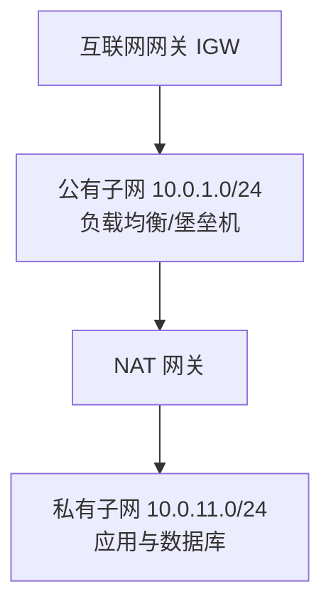
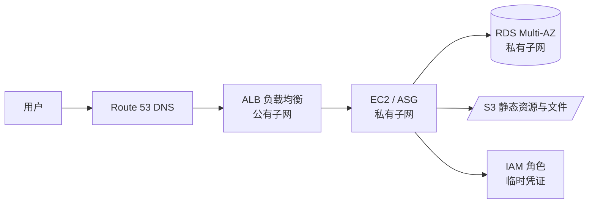

## 前置知识与学习目标

AWS 有两百余项服务，但日常工作的 80% 由六件事撑起：EC2（计算）、S3 与
EBS（存储）、VPC（网络）、RDS（数据库）、Lambda（无服务器）、IAM（身份
权限）。本文是它们的「地图」——每项讲清定位、关键参数与最容易踩的坑，
细节操作见模块内对应的命令篇。

## 1. 计算

### 1.1 EC2：读懂实例命名就够了

EC2 实例类型名本身就是选型说明书，以 `m7g.2xlarge` 为例：

```text
 m    7    g   .  2xlarge
 家族 世代 加速器  规格（vCPU/内存倍数）
```

| 家族 | 定位 | 典型场景 |
| :--- | :--- | :--- |
| m7/m8 | 通用（内存：CPU 约 4:1） | Web 服务、中小数据库 |
| c7 | 计算优化（约 2:1） | CPU 密集、批处理 |
| r7 | 内存优化（约 8:1） | 缓存、内存数据库 |
| x2/i4 | 超大内存/存储优化 | SAP、分析型负载 |
| g/p | GPU | AI 训练与推理 |
| t3/t4g | 突发型（CPU 积分制） | 低负载开发测试 |

`g` 后缀表示 Graviton（AWS 自研 ARM 处理器），同价位性能通常优于 x86，
新项目值得优先评估；代价是镜像与二进制需支持 ARM。

计费方式四选一（成本差距巨大）：

| 方式 | 折扣 | 适用 |
| :--- | :--- | :--- |
| On-Demand | 0（原价） | 短期、不可预测 |
| Savings Plans / 预留 | 30-72% | 稳态长期负载 |
| Spot | 最多约 90% | 可中断任务（注意可能被回收） |

> 陷阱：t 家族是 CPU 积分制，持续高负载会把积分耗尽、性能骤降，「测试
> 很快、上线就卡」的经典原因。稳态负载请换 m 家族。

### 1.2 Lambda：事件驱动的无服务器函数

Lambda 把「运行一个函数」作为服务：不上传代码到服务器，而是**绑定事件
源**（API Gateway、S3、SQS、定时器），事件到达时 AWS 拉起执行环境。

关键约束（变化较快，以官方文档为准）：单次执行上限 15 分钟；内存
128MB-10GB 且 CPU 随内存线性分配；并发数有账户级默认上限（可提额）。

```python
# 最小 Lambda：handler(event, context) 是固定签名
def handler(event, context):
    name = event.get("queryStringParameters", {}).get("name", "world")
    return {
        "statusCode": 200,
        "body": f'{{"message": "hello {name}"}}'
    }
```

冷启动：函数首次调用（或扩容新执行环境）时需下载代码、初始化运行时，
Java/.NET 可达秒级，Python/Node 通常几十至几百毫秒。缓解手段：选解释型
运行时、减小包体积、**预置并发（Provisioned Concurrency）**保持预热实例。

什么时候不用 Lambda：长时间任务（>15 分钟）、常驻连接（改用容器或
WebSocket 配合托管服务）、对启动延迟极敏感的同步链路。

## 2. 存储

### 2.1 S3：按访问频率选类别

S3 是对象存储：桶内放「键值 + 数据」，容量无限，按 GB·月 与请求次数
计费。11 个 9 的持久性（99.999999999%）靠跨设施冗余实现。

| 存储类别 | 访问模式 | 相对成本特征 |
| :--- | :--- | :--- |
| Standard | 频繁访问 | 存储贵、取回免费 |
| Standard-IA | 每月访问一次上下 | 存储便宜、取回收费 |
| Intelligent-Tiering | 模式未知/变化 | 自动分层，少量监控费 |
| Glacier Instant Retrieval | 季度级访问，毫秒取回 | 更便宜、取回收费 |
| Glacier Flexible Retrieval | 归档、分钟-小时取回 | 最便宜档之一 |
| Glacier Deep Archive | 合规归档（年取一次） | 最便宜，取回最长 48 小时 |

选型口诀：**访问越少越便宜，但取回要等要钱**。不确定就用
Intelligent-Tiering 兜底；配合生命周期规则自动沉降（30 天转 IA、90 天转
Glacier、365 天删）是标准姿势。

> 陷阱：S3 没有真正的「目录」，删除「目录」= 逐个删对象；跨区域复制
> 与出海流量费是账单里最常见的意外项。

### 2.2 EBS：块存储卷类型

EBS 是挂给 EC2 的「云硬盘」，与实例生命周期解耦（可单独快照、换机器）。

| 卷类型 | 说明 | 关键参数 |
| :--- | :--- | :--- |
| gp3 | 当前默认与推荐 | 性能与容量解耦，基线 3000 IOPS / 125 MB/s，可独立加购 |
| gp2 | 上一代 | 性能随容量走，小卷易成瓶颈 |
| io2 Block Express | 最高性能 | 亚毫秒延迟，数据库可用 |
| st1 / sc1 | 吞吐优化/冷 HDD | 大数据顺序读写 / 极少访问的归档卷 |

选型建议：一律 gp3 起步——同样的钱通常能买到比 gp2 更高的 IOPS，且
容量与性能独立伸缩；确有数据库级 IOPS 需求再上 io2。

## 3. 网络

### 3.1 VPC 与子网

VPC（虚拟私有云）是你账号内的私有网段，选一个 CIDR（如 `10.0.0.0/16`）
后在其中划子网：



规则很简单：**有去公网路由（IGW）的子网叫公有子网，没有的叫私有子网**。
私有子网里的机器想出网（下载补丁、调第三方 API），用 NAT 网关做单向
出口——外部进不来，里面出得去。VPC 细节与实操见 `460-AWSVPCCommands`。

> 陷阱：VPC CIDR 一旦有资源就难以扩改，起步宁可给大一点（/16）；每个
> 子网 AWS 保留 5 个地址（前 4 个 + 最后 1 个），容量规划别按理论值算。

### 3.2 安全组与 NACL：状态性是根本区别

| 维度 | 安全组（Security Group） | NACL（网络 ACL） |
| :--- | :--- | :--- |
| 作用层级 | 实例（ENI）级 | 子网级 |
| 状态性 | 有状态：入站允许则回包自动放行 | 无状态：出入站要分别配规则 |
| 规则取向 | 只能「允许」 | 可允许也可拒绝 |
| 评估方式 | 全部规则合并评估 | 按编号顺序，先命中先生效 |
| 典型用途 | 应用级白名单 | 子网级兜底封禁（如拉黑 IP） |

最佳实践：主要用安全组做分层（DB 安全组只允许来自应用安全组的入站，
引用组 ID 而非 IP），NACL 只做子网粗粒度兜底。安全组默认拒绝所有入站
——「新开的实例连不通」先查安全组，再查路由表。

## 4. 数据库与安全

### 4.1 RDS 多可用区：高可用的标准答案

RDS 是托管关系数据库（MySQL/PostgreSQL 等）。**Multi-AZ（多可用区）**
在另一个可用区维护同步 standby，主机故障时自动切换，通常 1 分钟左右
完成，应用只需重连同一个端点：

```text
写请求 -> RDS 主（AZ-a）--同步复制--> standby（AZ-b）
                |
          故障时自动 failover 到 AZ-b，端点不变
```

区分两个常被混淆的概念：Multi-AZ 解决**可用性**（同一份数据的高可用，
standby 不对外服务）；**Read Replica** 解决**读扩展**（异步复制，最多
15 个只读副本，可跨区域）。生产库通常两者都要：Multi-AZ 保命，读副本
分担查询。

### 4.2 IAM：策略与角色

IAM 的四个对象：用户（人/系统身份）、组（用户集合）、角色（可被「扮演」
的身份）、策略（JSON 权限文档）。核心原则是最小权限：

```json
{
  "Version": "2012-10-17",
  "Statement": [{
    "Effect": "Allow",
    "Action": ["s3:GetObject"],
    "Resource": "arn:aws:s3:::my-app-assets/*"
  }]
}
```

这条策略只允许读取一个桶内的对象——注意 Resource 精确到 `桶/*`，写成
`*` 就是最小权限失效的开始。

**角色优先于长期密钥**：EC2/ECS/Lambda 挂角色后，代码自动获得临时凭证
并自动轮换；跨账号访问也用角色扮演而非共享密钥。IAM 细节与命令见
`340-AWSIAMCommand`。

> 陷阱：IAM 策略没有显式 Allow 时默认拒绝；同一账户内显式 Deny 永远
> 优先于 Allow；排查权限问题时用策略模拟器（`aws iam simulate-principal-policy`）
> 而不是猜。

## 5. 实战：六件套如何拼一个标准 Web 应用



这是无数生产系统的原型：DNS 进来、ALB 在公有子网收流量、应用实例在
私有子网、数据库再内一层、文件放 S3、实例用 IAM 角色而非密钥访问 AWS。
把这张图在 VPC 里手工搭一遍（或用 `410-IaC` 的 Terraform 脚本），AWS
入门就算完成了。

## 小结

- 初学者要点：实例命名 `家族世代+规格` 直接决定性能档位；Lambda 的
  15 分钟与冷启动约束；S3 按访问频率选类别、配生命周期；块存储一律
  gp3 起步；公有/私有子网的判定标准是路由表；安全组有状态、NACL 无
  状态；RDS Multi-AZ 管高可用、读副本管读扩展；权限用角色不用长期密钥。
- 进阶注意：Spot 与突发实例的「中断/限速」特性决定了它们只适合特定
  负载；Intelligent-Tiering 是存储类别犹豫时的兜底；跨可用区与跨区域
  流量费、NAT 网关处理费是成本模型的隐形项；IAM 显式 Deny 优先于
  Allow，排权限先模拟后上线。
