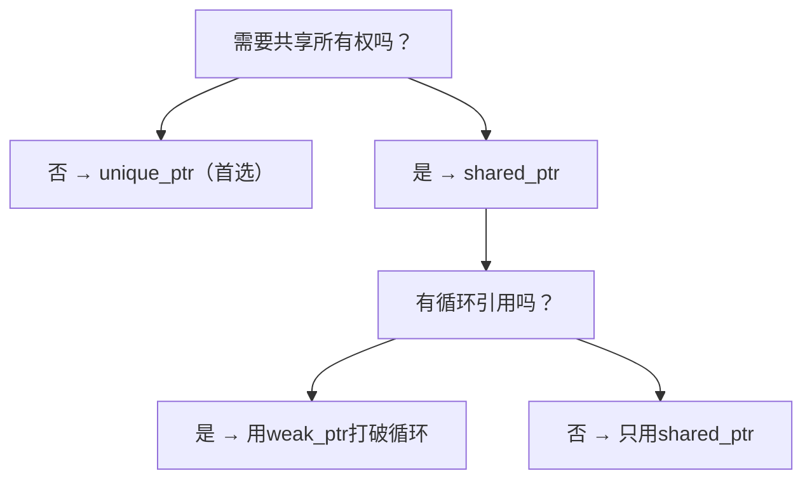

## 前置知识

- [C++数学库](/cpp/044-CppMathLibrary)：建议先完成前一篇的学习

## 学习目标

- 掌握「1. 智能指针概述」的核心机制、典型用法与常见陷阱
- 掌握「2. unique_ptr」的核心机制、典型用法与常见陷阱
- 掌握「3. shared_ptr」的核心机制、典型用法与常见陷阱
- 掌握「4. weak_ptr」的核心机制、典型用法与常见陷阱
- 掌握「5. 智能指针选择指南」的核心机制、典型用法与常见陷阱


## 1. 智能指针概述

### 1.1 为什么需要智能指针

C++中手动管理动态内存（new/delete）容易出错，常见问题包括：

- **内存泄漏**：忘记释放内存
- **悬空指针**：释放后继续使用
- **重复释放**：同一块内存释放两次
- **异常安全**：异常发生时资源未释放

智能指针通过 **RAII（Resource Acquisition Is Initialization）** 原则自动管理资源生命周期。

### 1.2 RAII 原则

RAII的核心思想：将资源的获取与对象的生命周期绑定，利用对象析构函数自动释放资源。

```cpp
#include <iostream>
#include <memory>

// RAII示例：文件操作封装
class FileGuard {
public:
    explicit FileGuard(FILE* fp) : fp_(fp) {}
    ~FileGuard() {
        if (fp_) {
            fclose(fp_);
            std::cout << "File closed automatically" << std::endl;
        }
    }
    // 禁止拷贝
    FileGuard(const FileGuard&) = delete;
    FileGuard& operator=(const FileGuard&) = delete;
    FILE* get() const { return fp_; }
private:
    FILE* fp_;
};

void use_file() {
    FileGuard fg(fopen("test.txt", "w"));
    if (fg.get()) {
        fprintf(fg.get(), "Hello, RAII!");
    }
    // 函数结束，fg析构自动关闭文件
}
```

### 1.3 C++ 标准库智能指针

| 智能指针          | 头文件     | 所有权 | 开销               |
| :---------------- | :--------- | :----- | :----------------- |
| `std::unique_ptr` | `<memory>` | 独占   | 几乎零开销         |
| `std::shared_ptr` | `<memory>` | 共享   | 引用计数开销       |
| `std::weak_ptr`   | `<memory>` | 不拥有 | 配合shared_ptr使用 |

## 2. unique_ptr

### 2.1 基本用法

`unique_ptr` 独占所指向的对象，不可拷贝，只能移动。

```cpp
#include <iostream>
#include <memory>
#include <vector>

class Widget {
public:
    explicit Widget(int id) : id_(id) {
        std::cout << "Widget(" << id_ << ") constructed\n";
    }
    ~Widget() {
        std::cout << "Widget(" << id_ << ") destroyed\n";
    }
    void do_work() {
        std::cout << "Widget(" << id_ << ") working\n";
    }
    int id() const { return id_; }
private:
    int id_;
};

void unique_ptr_basic() {
    // 创建方式1：make_unique（C++14推荐）
    auto p1 = std::make_unique<Widget>(1);

    // 创建方式2：直接构造（C++11）
    std::unique_ptr<Widget> p2(new Widget(2));

    // 访问对象
    p1->do_work();
    std::cout << "p1 id: " << p1->id() << std::endl;

    // 检查是否为空
    if (p1) {
        std::cout << "p1 is not null\n";
    }

    // 释放所有权（返回裸指针，unique_ptr变为空）
    Widget* raw = p1.release();
    delete raw;  // 需要手动释放

    // 重置（释放当前对象，可接管新对象）
    p2.reset(new Widget(3));  // 释放Widget(2)，接管Widget(3)
    p2.reset();               // 释放Widget(3)，p2变为空
}
```

### 2.2 所有权转移

```cpp
void unique_ptr_ownership() {
    auto p1 = std::make_unique<Widget>(1);

    // 移动语义转移所有权
    auto p2 = std::move(p1);
    // p1 现在为空，p2 拥有对象

    // 在函数间传递
    auto process = [](std::unique_ptr<Widget> w) {
        w->do_work();
        return w;  // 返回所有权
    };

    auto p3 = process(std::move(p2));
    // p2 为空，p3 拥有对象

    // 工厂函数返回unique_ptr
    auto create_widget = [](int id) -> std::unique_ptr<Widget> {
        return std::make_unique<Widget>(id);
    };

    auto p4 = create_widget(4);
}
```

### 2.3 unique_ptr 与数组

```cpp
void unique_ptr_array() {
    // C++14: make_unique支持数组
    auto arr = std::make_unique<int[]>(10);
    for (int i = 0; i < 10; i++) {
        arr[i] = i * i;
    }

    // 注意：unique_ptr<T[]> 与 unique_ptr<T> 的区别
    // unique_ptr<T[]> 使用 operator[] 而非 operator*
    // unique_ptr<T[]> 的删除器是 delete[] 而非 delete

    // 推荐替代方案：使用 std::vector 或 std::array
    std::vector<int> vec(10);
    for (int i = 0; i < 10; i++) {
        vec[i] = i * i;
    }
}
```

### 2.4 自定义删除器

```cpp
void custom_deleter() {
    // 自定义删除器用于特殊资源管理
    auto file_closer = [](FILE* fp) {
        if (fp) {
            fclose(fp);
            std::cout << "File closed by custom deleter\n";
        }
    };

    {
        std::unique_ptr<FILE, decltype(file_closer)> fp(
            fopen("test.txt", "w"), file_closer
        );
        if (fp) {
            fprintf(fp.get(), "Hello, custom deleter!");
        }
    }  // 离开作用域，自动调用file_closer

    // 管理C API资源
    auto malloc_deleter = [](void* p) {
        free(p);
        std::cout << "Memory freed by custom deleter\n";
    };

    std::unique_ptr<void, decltype(malloc_deleter)> buffer(
        malloc(1024), malloc_deleter
    );
}
```

## 3. shared_ptr

### 3.1 基本用法

`shared_ptr` 通过引用计数实现共享所有权，最后一个 `shared_ptr` 销毁时释放对象。

```cpp
#include <iostream>
#include <memory>

class Node {
public:
    explicit Node(int val) : val_(val) {
        std::cout << "Node(" << val_ << ") created\n";
    }
    ~Node() {
        std::cout << "Node(" << val_ << ") destroyed\n";
    }
    void set_next(std::shared_ptr<Node> next) { next_ = next; }
    void set_prev(std::shared_ptr<Node> prev) { prev_ = prev; }
    int val() const { return val_; }
private:
    int val_;
    std::shared_ptr<Node> next_;
    std::shared_ptr<Node> prev_;  // 注意：这会导致循环引用！
};

void shared_ptr_basic() {
    // 创建方式1：make_shared（推荐，更高效）
    auto p1 = std::make_shared<Node>(1);

    // 创建方式2：直接构造
    std::shared_ptr<Node> p2(new Node(2));

    // 共享所有权
    auto p3 = p1;  // 引用计数+1
    std::cout << "p1 use_count: " << p1.use_count() << std::endl;  // 2
    std::cout << "p3 use_count: " << p3.use_count() << std::endl;  // 2

    // p1, p3 离开作用域，引用计数归零，Node(1)自动销毁
    // p2 离开作用域，Node(2)自动销毁
}
```

### 3.2 引用计数机制

```cpp
void reference_counting() {
    auto sp = std::make_shared<int>(42);

    std::cout << "use_count: " << sp.use_count() << std::endl;  // 1

    {
        auto sp2 = sp;
        std::cout << "use_count: " << sp.use_count() << std::endl;  // 2

        auto sp3 = sp;
        std::cout << "use_count: " << sp.use_count() << std::endl;  // 3

        sp3.reset();  // 释放sp3的所有权
        std::cout << "use_count: " << sp.use_count() << std::endl;  // 2
    }
    // sp2 离开作用域
    std::cout << "use_count: " << sp.use_count() << std::endl;  // 1

    // 检查是否唯一拥有者
    if (sp.unique()) {
        std::cout << "sp is the sole owner\n";
    }
}
```

### 3.3 make_shared 的优势

```cpp
void make_shared_advantage() {
    // make_shared：一次分配，对象和控制块在一起
    auto sp1 = std::make_shared<int>(42);

    // 直接构造：两次分配，对象和控制块分开
    std::shared_ptr<int> sp2(new int(42));

    // make_shared 优势：
    // 1. 只需一次内存分配，更高效
    // 2. 异常安全（避免new和构造函数之间的异常泄漏）
    // 3. 代码更简洁

    // make_shared 劣势：
    // 1. 对象和控制块一起分配，对象销毁后内存可能不会立即释放
    //    （需等所有weak_ptr也销毁）
    // 2. 不支持自定义删除器
    // 3. 不支持花括号初始化（C++20前）
}
```

### 3.4 shared_ptr 与 this 指针

```cpp
class Handler : public std::enable_shared_from_this<Handler> {
public:
    explicit Handler(int id) : id_(id) {
        std::cout << "Handler(" << id_ << ") created\n";
    }

    // 错误方式：返回shared_ptr(this)会导致多个控制块
    // std::shared_ptr<Handler> get_self() {
    //     return std::shared_ptr<Handler>(this);  // 危险！
    // }

    // 正确方式：使用enable_shared_from_this
    std::shared_ptr<Handler> get_self() {
        return shared_from_this();
    }

    void register_callback() {
        // 需要传递自身给异步回调时
        auto self = shared_from_this();
        // callback_registry.register([self]() { self->process(); });
    }

    void process() {
        std::cout << "Handler(" << id_ << ") processing\n";
    }

private:
    int id_;
};

void enable_shared_from_this_demo() {
    auto h = std::make_shared<Handler>(1);
    auto h2 = h->get_self();  // 共享同一控制块
    std::cout << "use_count: " << h.use_count() << std::endl;  // 2
}
```

## 4. weak_ptr

### 4.1 解决循环引用

```cpp
#include <iostream>
#include <memory>

class ListNode {
public:
    explicit ListNode(int val) : val_(val) {
        std::cout << "Node(" << val_ << ") created\n";
    }
    ~ListNode() {
        std::cout << "Node(" << val_ << ") destroyed\n";
    }

    // 使用weak_ptr打破循环引用
    std::shared_ptr<ListNode> next;
    std::weak_ptr<ListNode> prev;  // weak_ptr不增加引用计数

    int val() const { return val_; }
private:
    int val_;
};

void weak_ptr_demo() {
    auto n1 = std::make_shared<ListNode>(1);
    auto n2 = std::make_shared<ListNode>(2);

    n1->next = n2;
    n2->prev = n1;  // weak_ptr，不增加n1的引用计数

    std::cout << "n1 use_count: " << n1.use_count() << std::endl;  // 1
    std::cout << "n2 use_count: " << n2.use_count() << std::endl;  // 2

    // 从weak_ptr获取shared_ptr
    if (auto prev = n2->prev.lock()) {
        std::cout << "n2's prev value: " << prev->val() << std::endl;
    }

    // 检查weak_ptr是否过期
    std::cout << "n2's prev expired: " << n2->prev.expired() << std::endl;  // false
}
```

### 4.2 weak_ptr 的观察者模式

```cpp
#include <iostream>
#include <memory>
#include <vector>
#include <algorithm>

class Subject;

class Observer {
public:
    virtual ~Observer() = default;
    virtual void update() = 0;
};

class Subject {
public:
    void attach(std::weak_ptr<Observer> observer) {
        observers_.push_back(observer);
    }

    void notify() {
        // 清理已过期的观察者
        observers_.erase(
            std::remove_if(observers_.begin(), observers_.end(),
                [](const std::weak_ptr<Observer>& wp) { return wp.expired(); }),
            observers_.end()
        );

        // 通知存活的观察者
        for (auto& wp : observers_) {
            if (auto sp = wp.lock()) {
                sp->update();
            }
        }
    }

private:
    std::vector<std::weak_ptr<Observer>> observers_;
};
```

## 5. 智能指针选择指南

### 5.1 决策流程



### 5.2 性能对比

| 操作     | unique_ptr   | shared_ptr           | 裸指针 |
| :------- | :----------- | :------------------- | :----- |
| 创建     | O(1)         | O(1)\*               | O(1)   |
| 拷贝     | 禁止         | O(1)（原子计数+1）   | O(1)   |
| 移动     | O(1)         | O(1)（原子计数不变） | O(1)   |
| 析构     | O(1)         | O(1)（原子计数-1）   | 无     |
| 内存开销 | 与裸指针相同 | 2倍指针大小+控制块   | 无     |

> \*make_shared的创建涉及一次内存分配

## 6. 常见问题与解决方案

### 6.1 循环引用导致内存泄漏

```cpp
// 错误：双向链表使用shared_ptr导致循环引用
class BadNode {
public:
    std::shared_ptr<BadNode> next;
    std::shared_ptr<BadNode> prev;  // 导致循环引用！
};

// 正确：prev使用weak_ptr
class GoodNode {
public:
    std::shared_ptr<GoodNode> next;
    std::weak_ptr<GoodNode> prev;   // 打破循环引用
};
```

### 6.2 误用 shared_ptr(this)

```cpp
// 错误：创建多个控制块
class BadExample {
public:
    std::shared_ptr<BadExample> get_self() {
        return std::shared_ptr<BadExample>(this);  // 新控制块！
    }
};

// 正确：继承enable_shared_from_this
class GoodExample : public std::enable_shared_from_this<GoodExample> {
public:
    std::shared_ptr<GoodExample> get_self() {
        return shared_from_this();  // 共享同一控制块
    }
};
```

### 6.3 智能指针与裸指针混用

```cpp
// 危险：从裸指针创建多个shared_ptr
int* raw = new int(42);
std::shared_ptr<int> sp1(raw);
std::shared_ptr<int> sp2(raw);  // 两个控制块！double free！

// 正确：直接使用make_shared
auto sp1 = std::make_shared<int>(42);
auto sp2 = sp1;  // 共享同一控制块
```

## 7. 总结与最佳实践

### 7.1 核心原则

1. **优先使用 unique_ptr**：零开销，表达独占所有权
2. **需要共享时用 shared_ptr**：但注意循环引用
3. **观察者用 weak_ptr**：不延长对象生命周期
4. **使用 make_shared/make_unique**：更高效、更安全
5. **避免裸指针拥有资源**：裸指针只用于观察

### 7.2 最佳实践清单

- 默认选择 `unique_ptr`，仅在需要共享所有权时使用 `shared_ptr`
- 始终使用 `std::make_unique` 和 `std::make_shared` 创建智能指针
- 需要从 this 创建 `shared_ptr` 时，继承 `enable_shared_from_this`
- 循环引用场景使用 `weak_ptr` 打破循环
- 自定义删除器处理非标准资源（文件句柄、socket等）
- 不要从同一个裸指针创建多个 `shared_ptr`
## unique_ptr

**基本写法：创建 unique_ptr**
`std::unique_ptr<<type>> <ptr> = std::make_unique<<type>>(<args>);`
```cpp
#include <memory>
// 创建独占所有权的智能指针
std::unique_ptr<int> p = std::make_unique<int>(10);
```

---

**数组写法：创建 unique_ptr 数组**
`std::unique_ptr<<type>[]> <ptr> = std::make_unique<<type>[]>(<size>);`
```cpp
#include <memory>
// 创建独占所有权的数组
std::unique_ptr<int[]> arr = std::make_unique<int[]>(10);
```

---

**访问写法：访问 unique_ptr**
`*<ptr>` 或 `<ptr>-><member>`
```cpp
// 解引用访问值
std::unique_ptr<int> p = std::make_unique<int>(10);
std::cout << *p << std::endl;
```

---

**移动写法：转移所有权**
`std::unique_ptr<<type>> <new_ptr> = std::move(<old_ptr>);`
```cpp
#include <memory>
// 转移 unique_ptr 所有权
std::unique_ptr<int> p1 = std::make_unique<int>(10);
std::unique_ptr<int> p2 = std::move(p1);
```

---

**释放写法：释放所有权**
`<type>* <raw_ptr> = <ptr>.release();`
```cpp
// 释放所有权，返回原始指针
std::unique_ptr<int> p = std::make_unique<int>(10);
int* raw = p.release();
delete raw;
```

---

**重置写法：重置 unique_ptr**
`<ptr>.reset(<new_ptr>);`
```cpp
// 重置为新的指针
std::unique_ptr<int> p = std::make_unique<int>(10);
p.reset(new int(20));
```

---

## shared_ptr

**基本写法：创建 shared_ptr**
`std::shared_ptr<<type>> <ptr> = std::make_shared<<type>>(<args>);`
```cpp
#include <memory>
// 创建共享所有权的智能指针
std::shared_ptr<int> p = std::make_shared<int>(10);
```

---

**拷贝写法：拷贝 shared_ptr**
`std::shared_ptr<<type>> <ptr2> = <ptr1>;`
```cpp
// 拷贝 shared_ptr，引用计数增加
std::shared_ptr<int> p1 = std::make_shared<int>(10);
std::shared_ptr<int> p2 = p1;
```

---

**引用计数写法：获取引用计数**
`<ptr>.use_count()`
```cpp
// 获取当前引用计数
std::shared_ptr<int> p1 = std::make_shared<int>(10);
std::shared_ptr<int> p2 = p1;
std::cout << p1.use_count() << std::endl;
```

---

**重置写法：重置 shared_ptr**
`<ptr>.reset();`
```cpp
// 重置 shared_ptr，引用计数减少
std::shared_ptr<int> p = std::make_shared<int>(10);
p.reset();
```

---

**自定义删除器写法**
`std::shared_ptr<<type>> <ptr>(<raw_ptr>, <deleter>);`
```cpp
#include <memory>
// 使用自定义删除器
std::shared_ptr<FILE> file(fopen("test.txt", "r"), [](FILE* f) {
    if (f) fclose(f);
});
```

---

## weak_ptr

**基本写法：创建 weak_ptr**
`std::weak_ptr<<type>> <weak> = <shared_ptr>;`
```cpp
#include <memory>
// 创建弱引用，不增加引用计数
std::shared_ptr<int> shared = std::make_shared<int>(10);
std::weak_ptr<int> weak = shared;
```

---

**lock 写法：获取 shared_ptr**
`std::shared_ptr<<type>> <ptr> = <weak>.lock();`
```cpp
// 尝试获取 shared_ptr
std::weak_ptr<int> weak = shared;
if (auto p = weak.lock()) {
    std::cout << *p << std::endl;
}
```

---

**expired 写法：检查是否过期**
`<weak>.expired()`
```cpp
// 检查 weak_ptr 是否过期
std::weak_ptr<int> weak = shared;
if (weak.expired()) {
    std::cout << "Pointer expired" << std::endl;
}
```

---

**use_count 写法：获取引用计数**
`<weak>.use_count()`
```cpp
// 获取 weak_ptr 对应的引用计数
std::weak_ptr<int> weak = shared;
std::cout << weak.use_count() << std::endl;
```

---

## 智能指针与数组

**unique_ptr 数组写法**
`std::unique_ptr<<type>[]> <ptr> = std::make_unique<<type>[]>(<size>);`
```cpp
#include <memory>
// unique_ptr 管理数组
std::unique_ptr<int[]> arr = std::make_unique<int[]>(10);
arr[0] = 100;
```

---

**shared_ptr 数组写法（C++17）**
`std::shared_ptr<<type>[]> <ptr> = std::make_shared<<type>[]>(<size>);`
```cpp
#include <memory>
// C++17 shared_ptr 管理数组
std::shared_ptr<int[]> arr = std::make_shared<int[]>(10);
arr[0] = 100;
```

---

## 智能指针与自定义类型

**基本写法：管理自定义类型**
`std::unique_ptr<<Type>> <ptr> = std::make_unique<<Type>>(<args>);`
```cpp
#include <memory>
// 管理自定义类型
struct Point { int x; int y; Point(int x, int y) : x(x), y(y) {} };
std::unique_ptr<Point> p = std::make_unique<Point>(10, 20);
```

---

**成员访问写法：访问智能指针成员**
`<ptr>-><member>`
```cpp
// 通过智能指针访问成员
std::unique_ptr<Point> p = std::make_unique<Point>(10, 20);
std::cout << p->x << std::endl;
```

---

## 智能指针转换

**dynamic_pointer_cast 写法**
`std::dynamic_pointer_cast<<Derived>>(<base_ptr>);`
```cpp
#include <memory>
// 动态转换 shared_ptr
std::shared_ptr<Base> base = std::make_shared<Derived>();
std::shared_ptr<Derived> derived = std::dynamic_pointer_cast<Derived>(base);
```

---

**static_pointer_cast 写法**
`std::static_pointer_cast<<Target>>(<src_ptr>);`
```cpp
#include <memory>
// 静态转换 shared_ptr
std::shared_ptr<Derived> derived = std::make_shared<Derived>();
std::shared_ptr<Base> base = std::static_pointer_cast<Base>(derived);
```

---

## 智能指针与容器

**容器写法：存储智能指针**
`std::vector<std::unique_ptr<<type>>> <vec>;`
```cpp
#include <memory>
#include <vector>
// 容器存储智能指针
std::vector<std::unique_ptr<int>> vec;
vec.push_back(std::make_unique<int>(10));
```

---

**shared_ptr 容器写法**
`std::vector<std::shared_ptr<<type>>> <vec>;`
```cpp
#include <memory>
#include <vector>
// 容器存储 shared_ptr
std::vector<std::shared_ptr<int>> vec;
vec.push_back(std::make_shared<int>(10));
```

---

## enable_shared_from_this

**基本写法：继承 enable_shared_from_this**
`class <Type> : public std::enable_shared_from_this<<Type>> { ... };`
```cpp
#include <memory>
// 继承 enable_shared_from_this
class MyClass : public std::enable_shared_from_this<MyClass> {
public:
    std::shared_ptr<MyClass> get_ptr() {
        return shared_from_this();
    }
};
```

---

**使用写法：获取自身的 shared_ptr**
`<obj>.shared_from_this()`
```cpp
// 获取自身的 shared_ptr
std::shared_ptr<MyClass> obj = std::make_shared<MyClass>();
std::shared_ptr<MyClass> ptr = obj->get_ptr();
```

---

## 智能指针最佳实践

**优先写法：优先使用 make_unique 和 make_shared**
`auto <ptr> = std::make_unique<<type>>(<args>);`
```cpp
#include <memory>
// 优先使用 make_unique/make_shared
auto p = std::make_unique<int>(10);
```

---

**unique_ptr 优先写法：默认使用 unique_ptr**
`std::unique_ptr<<type>> <ptr> = std::make_unique<<type>>(<args>);`
```cpp
#include <memory>
// 默认使用 unique_ptr，需要共享时再使用 shared_ptr
std::unique_ptr<int> p = std::make_unique<int>(10);
```
