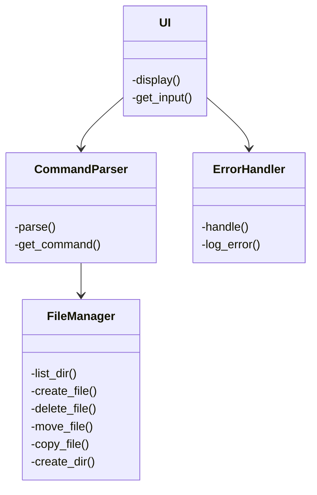
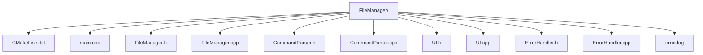
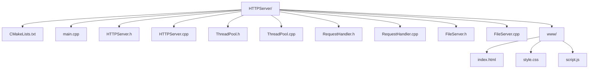
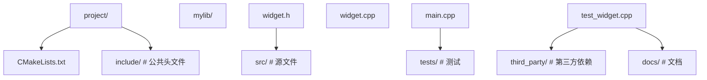

## 前置知识

- [C++ 调试与性能分析](/cpp/066-CppDebugPerformanceAnalysis)：建议先完成前一篇的学习

## 学习目标

- 掌握「1. 项目一：简易文件管理器」的核心机制、典型用法与常见陷阱
- 掌握「2. 项目二：简单的 HTTP 服务器」的核心机制、典型用法与常见陷阱
- 掌握「3. 项目三：简单的数据库系统」的核心机制、典型用法与常见陷阱
- 掌握「4. 最佳实践」的核心机制、典型用法与常见陷阱
- 掌握「6. 更新日志」的核心机制、典型用法与常见陷阱

> 阅读建议：综合项目，建议完成 RAII、STL 与并发基础后再动手。
## 1. 项目一：简易文件管理器

### 1.1 项目需求

- **功能**: 列出目录、创建文件、删除文件、移动文件、复制文件、创建目录
- **技术栈**: C++17 `<filesystem>`, STL, 异常处理
- **目标**: 构建一个命令行文件管理器，支持基本的文件操作

### 1.2 架构设计

#### 1.2.1 模块划分

- **FileManager**: 提供底层文件系统操作接口
- **CommandParser**: 解析用户输入的命令
- **UI**: 提供交互界面
- **ErrorHandler**: 处理错误和异常

#### 1.2.2 类图



### 1.3 核心实现

#### 1.3.1 FileManager 类

```cpp
 #include <iostream>
 #include <filesystem>
 #include <fstream>
 #include <string>
 #include <stdexcept>
 namespace fs = std::filesystem;
 class FileManager {
 public:
  // 列出目录内容
  void list_dir(const std::string& path) {
  try {
  if (!fs::exists(path)) {
  throw std::runtime_error("Path does not exist");
  }
  if (!fs::is_directory(path)) {
  throw std::runtime_error("Path is not a directory");
  }
  std::cout << "Contents of " << path << ":" << std::endl;
  for (const auto& entry : fs::directory_iterator(path)) {
  std::string type = fs::is_directory(entry.path()) ? "[DIR]" : "[FILE]";
  std::cout << type << " " << entry.path().filename().string() << std::endl;
  }
  } catch (const std::exception& e) {
  throw;
  }
  }
  // 创建文件
  void create_file(const std::string& path) {
  try {
  if (fs::exists(path)) {
  throw std::runtime_error("File already exists");
  }
  std::ofstream out(path);
  if (!out) {
  throw std::runtime_error("Failed to create file");
  }
  out << "Hello, File!" << std::endl;
  out.close();
  std::cout << "File created successfully: " << path << std::endl;
  } catch (const std::exception& e) {
  throw;
  }
  }
  // 删除文件
  void delete_file(const std::string& path) {
  try {
  if (!fs::exists(path)) {
  throw std::runtime_error("File does not exist");
  }
  if (fs::is_directory(path)) {
  throw std::runtime_error("Path is a directory, use delete_dir instead");
  }
  if (fs::remove(path)) {
  std::cout << "File deleted successfully: " << path << std::endl;
  } else {
  throw std::runtime_error("Failed to delete file");
  }
  } catch (const std::exception& e) {
  throw;
  }
  }
  // 移动文件
  void move_file(const std::string& source, const std::string& destination) {
  try {
  if (!fs::exists(source)) {
  throw std::runtime_error("Source file does not exist");
  }
  if (fs::exists(destination)) {
  throw std::runtime_error("Destination already exists");
  }
  fs::rename(source, destination);
  std::cout << "File moved successfully: " << source << " -> " << destination << std::endl;
  } catch (const std::exception& e) {
  throw;
  }
  }
  // 复制文件
  void copy_file(const std::string& source, const std::string& destination) {
  try {
  if (!fs::exists(source)) {
  throw std::runtime_error("Source file does not exist");
  }
  if (fs::exists(destination)) {
  throw std::runtime_error("Destination already exists");
  }
  fs::copy_file(source, destination);
  std::cout << "File copied successfully: " << source << " -> " << destination << std::endl;
  } catch (const std::exception& e) {
  throw;
  }
  }
  // 创建目录
  void create_dir(const std::string& path) {
  try {
  if (fs::exists(path)) {
  throw std::runtime_error("Directory already exists");
  }
  if (fs::create_directories(path)) {
  std::cout << "Directory created successfully: " << path << std::endl;
  } else {
  throw std::runtime_error("Failed to create directory");
  }
  } catch (const std::exception& e) {
  throw;
  }
  }
 }
```

#### 1.3.2 CommandParser 类

```cpp
 #include <iostream>
 #include <string>
 #include <vector>
 #include <sstream>
 class CommandParser {
 public:
  enum class CommandType {
  LIST, CREATE, DELETE, MOVE, COPY, CREATE_DIR, HELP, EXIT, UNKNOWN
  };
  struct Command {
  CommandType type;
  std::vector<std::string> arguments;
  };
  Command parse(const std::string& input) {
  std::vector<std::string> tokens = tokenize(input);
  if (tokens.empty()) {
  return {CommandType::UNKNOWN, {}};
  }
  std::string command = tokens[0];
  std::vector<std::string> args(tokens.begin() + 1, tokens.end());
  if (command == "ls" || command == "list") {
  return {CommandType::LIST, args};
  } else if (command == "touch" || command == "create") {
  return {CommandType::CREATE, args};
  } else if (command == "rm" || command == "delete") {
  return {CommandType::DELETE, args};
  } else if (command == "mv" || command == "move") {
  return {CommandType::MOVE, args};
  } else if (command == "cp" || command == "copy") {
  return {CommandType::COPY, args};
  } else if (command == "mkdir" || command == "create_dir") {
  return {CommandType::CREATE_DIR, args};
  } else if (command == "help") {
  return {CommandType::HELP, args};
  } else if (command == "exit" || command == "quit") {
  return {CommandType::EXIT, args};
  } else {
  return {CommandType::UNKNOWN, args};
  }
  }
 private:
  std::vector<std::string> tokenize(const std::string& input) {
  std::vector<std::string> tokens;
  std::istringstream iss(input);
  std::string token;
  while (iss >> token) {
  tokens.push_back(token);
  }
  return tokens;
  }
 }
```

#### 1.3.3 UI 类

```cpp
 #include <iostream>
 #include <string>
 class UI {
 public:
  void display_welcome() {
  std::cout << "====================================" << std::endl;
  std::cout << " File Manager v1.0 " << std::endl;
  std::cout << "====================================" << std::endl;
  std::cout << "Commands: ls, touch, rm, mv, cp, mkdir, help, exit" << std::endl;
  std::cout << "====================================" << std::endl;
  }
  std::string get_input() {
  std::string input;
  std::cout << "> ";
  std::getline(std::cin, input);
  return input;
  }
  void display_help() {
  std::cout << "Help:" << std::endl;
  std::cout << " ls [path] - List directory contents" << std::endl;
  std::cout << " touch <file> - Create a new file" << std::endl;
  std::cout << " rm <file> - Delete a file" << std::endl;
  std::cout << " mv <source> <dest> - Move a file" << std::endl;
  std::cout << " cp <source> <dest> - Copy a file" << std::endl;
  std::cout << " mkdir <directory> - Create a directory" << std::endl;
  std::cout << " help - Show this help" << std::endl;
  std::cout << " exit - Exit the program" << std::endl;
  }
  void display_error(const std::string& message) {
  std::cerr << "Error: " << message << std::endl;
  }
  void display_success(const std::string& message) {
  std::cout << "Success: " << message << std::endl;
  }
 }
```

#### 1.3.4 ErrorHandler 类

```cpp
 #include <iostream>
 #include <string>
 #include <fstream>
 #include <chrono>
 class ErrorHandler {
 public:
  ErrorHandler(const std::string& log_file = "error.log") : log_file_(log_file) {}
  void handle(const std::string& error_message) {
  std::cerr << "Error: " << error_message << std::endl;
  log_error(error_message);
  }
 private:
  std::string log_file_;
  void log_error(const std::string& error_message) {
  try {
  std::ofstream log(log_file_, std::ios::app);
  auto now = std::chrono::system_clock::now();
  auto now_c = std::chrono::system_clock::to_time_t(now);
  std::string timestamp = std::ctime(&now_c);
  timestamp.pop_back(); // Remove newline
  log << "[" << timestamp << "] ERROR: " << error_message << std::endl;
  } catch (...) {
  // Ignore logging errors
  }
  }
 }
```

#### 1.3.5 主函数

```cpp
 #include <iostream>
 #include "FileManager.h"
 #include "CommandParser.h"
 #include "UI.h"
 #include "ErrorHandler.h"
 int main() {
  FileManager file_manager;
  CommandParser parser;
  UI ui;
  ErrorHandler error_handler;
  ui.display_welcome();
  bool running = true;
  while (running) {
  std::string input = ui.get_input();
  auto command = parser.parse(input);
  try {
  switch (command.type) {
  case CommandParser::CommandType::LIST: {
  std::string path = command.arguments.empty() ? "." : command.arguments[0];
  file_manager.list_dir(path);
  break;
  }
  case CommandParser::CommandType::CREATE: {
  if (command.arguments.empty()) {
  throw std::runtime_error("Missing file path");
  }
  file_manager.create_file(command.arguments[0]);
  break;
  }
  case CommandParser::CommandType::DELETE: {
  if (command.arguments.empty()) {
  throw std::runtime_error("Missing file path");
  }
  file_manager.delete_file(command.arguments[0]);
  break;
  }
  case CommandParser::CommandType::MOVE: {
  if (command.arguments.size() < 2) {
  throw std::runtime_error("Missing source or destination");
  }
  file_manager.move_file(command.arguments[0], command.arguments[1]);
  break;
  }
  case CommandParser::CommandType::COPY: {
  if (command.arguments.size() < 2) {
  throw std::runtime_error("Missing source or destination");
  }
  file_manager.copy_file(command.arguments[0], command.arguments[1]);
  break;
  }
  case CommandParser::CommandType::CREATE_DIR: {
  if (command.arguments.empty()) {
  throw std::runtime_error("Missing directory path");
  }
  file_manager.create_dir(command.arguments[0]);
  break;
  }
  case CommandParser::CommandType::HELP: {
  ui.display_help();
  break;
  }
  case CommandParser::CommandType::EXIT: {
  running = false;
  std::cout << "Exiting..." << std::endl;
  break;
  }
  case CommandParser::CommandType::UNKNOWN: {
  ui.display_error("Unknown command. Type 'help' for assistance.");
  break;
  }
  }
  } catch (const std::exception& e) {
  error_handler.handle(e.what());
  }
  }
  return 0;
 }
```

### 1.4 构建与部署

#### 1.4.1 CMake 配置

```cmake
 cmake_minimum_required(VERSION 3.10)
 project(FileManager)
 set(CMAKE_CXX_STANDARD 17)
 set(CMAKE_CXX_STANDARD_REQUIRED ON)
 # 添加可执行文件
 add_executable(FileManager
  main.cpp
  FileManager.cpp
  CommandParser.cpp
  UI.cpp
  ErrorHandler.cpp
 )
 # 包含头文件目录
 target_include_directories(FileManager PRIVATE ${CMAKE_CURRENT_SOURCE_DIR})
 # 链接必要的库
 if(WIN32)
  # Windows 特定配置
  target_link_libraries(FileManager PRIVATE shlwapi)
 endif()
```

#### 1.4.2 目录结构



### 1.5 测试

#### 1.5.1 功能测试

```bash
 # 编译
 mkdir build && cd build
 cmake ..
 cmake --build .
 # 运行
 ./FileManager
 # 测试命令
 >
 >
 >
 >
 >
 >
 >
 >
 >
 >
 >
 >
 >
 >
 >
 >
 >
```

#### 1.5.2 异常测试

- 测试不存在的路径
- 测试已存在的文件
- 测试权限错误
- 测试参数不足

## 2. 项目二：简单的 HTTP 服务器

### 2.1 项目需求

- **功能**: 提供静态文件服务，支持基本的 HTTP 请求处理
- **技术栈**: C++11, 套接字编程, 线程池
- **目标**: 构建一个简单的 HTTP 服务器，能够处理多个并发连接

### 2.2 架构设计

#### 2.2.1 模块划分

- **HTTPServer**: 服务器核心，处理连接和请求
- **RequestHandler**: 处理 HTTP 请求
- **ThreadPool**: 管理线程池，处理并发连接
- **FileServer**: 提供静态文件服务

### 2.3 核心实现

#### 2.3.1 HTTPServer 类

```cpp
 #include <iostream>
 #include <string>
 #include <thread>
 #include <vector>
 #include <cstdlib>
 #include <cstring>
 #include <sys/socket.h>
 #include <netinet/in.h>
 #include <unistd.h>
 #include "ThreadPool.h"
 #include "RequestHandler.h"
 class HTTPServer {
 public:
  HTTPServer(int port, int thread_pool_size = 4) :
  port_(port),
  thread_pool_(thread_pool_size),
  server_socket_(-1) {}
  ~HTTPServer() {
  stop();
  }
  void start() {
  // 创建套接字
  server_socket_ = socket(AF_INET, SOCK_STREAM, 0);
  if (server_socket_ < 0) {
  std::cerr << "Error creating socket" << std::endl;
  return;
  }
  // 设置套接字选项
  int opt = 1;
  setsockopt(server_socket_, SOL_SOCKET, SO_REUSEADDR, &opt, sizeof(opt));
  // 绑定地址
  struct sockaddr_in address;
  address.sin_family = AF_INET;
  address.sin_addr.s_addr = INADDR_ANY;
  address.sin_port = htons(port_);
  if (bind(server_socket_, (struct sockaddr*)&address, sizeof(address)) < 0) {
  std::cerr << "Error binding socket" << std::endl;
  close(server_socket_);
  server_socket_ = -1;
  return;
  }
  // 开始监听
  if (listen(server_socket_, 10) < 0) {
  std::cerr << "Error listening" << std::endl;
  close(server_socket_);
  server_socket_ = -1;
  return;
  }
  std::cout << "Server started on port " << port_ << std::endl;
  // 接受连接
  while (server_socket_ >= 0) {
  struct sockaddr_in client_address;
  socklen_t client_address_len = sizeof(client_address);
  int client_socket = accept(server_socket_, (struct sockaddr*)&client_address, &client_address_len);
  if (client_socket < 0) {
  std::cerr << "Error accepting connection" << std::endl;
  continue;
  }
  // 提交任务到线程池
  thread_pool_.submit([this, client_socket]() {
  handle_client(client_socket);
  });
  }
  }
  void stop() {
  if (server_socket_ >= 0) {
  close(server_socket_);
  server_socket_ = -1;
  }
  thread_pool_.shutdown();
  }
 private:
  int port_;
  int server_socket_;
  ThreadPool thread_pool_;
  RequestHandler request_handler_;
  void handle_client(int client_socket) {
  request_handler_.handle(client_socket);
  close(client_socket);
  }
 }
```

#### 2.3.2 ThreadPool 类

```cpp
 #include <vector>
 #include <thread>
 #include <queue>
 #include <mutex>
 #include <condition_variable>
 #include <functional>
 #include <atomic>
 class ThreadPool {
 public:
  ThreadPool(int size) : stop_(false) {
  for (int i = 0; i < size; ++i) {
  threads_.emplace_back([this]() {
  while (true) {
  std::function<void()> task;
  {
  std::unique_lock<std::mutex> lock(mutex_);
  condition_.wait(lock, [this]() {
  return stop_ || !tasks_.empty();
  });
  if (stop_ && tasks_.empty()) {
  return;
  }
  task = std::move(tasks_.front());
  tasks_.pop();
  }
  task();
  }
  });
  }
  }
  ~ThreadPool() {
  shutdown();
  }
  template<typename F>
  void submit(F&& task) {
  {
  std::unique_lock<std::mutex> lock(mutex_);
  tasks_.emplace(std::forward<F>(task));
  }
  condition_.notify_one();
  }
  void shutdown() {
  {
  std::unique_lock<std::mutex> lock(mutex_);
  stop_ = true;
  }
  condition_.notify_all();
  for (auto& thread : threads_) {
  if (thread.joinable()) {
  thread.join();
  }
  }
  }
 private:
  std::vector<std::thread> threads_;
  std::queue<std::function<void()>> tasks_;
  std::mutex mutex_;
  std::condition_variable condition_;
  std::atomic<bool> stop_;
 }
```

#### 2.3.3 RequestHandler 类

```cpp
 #include <iostream>
 #include <string>
 #include <cstring>
 #include <fstream>
 #include <sstream>
 #include <sys/socket.h>
 #include <unistd.h>
 #include "FileServer.h"
 class RequestHandler {
 public:
  void handle(int client_socket) {
  char buffer[4096] = {0};
  int bytes_read = read(client_socket, buffer, sizeof(buffer) - 1);
  if (bytes_read < 0) {
  std::cerr << "Error reading from socket" << std::endl;
  return;
  }
  std::string request(buffer, bytes_read);
  std::string response = process_request(request);
  send(client_socket, response.c_str(), response.size(), 0);
  }
 private:
  FileServer file_server_;
  std::string process_request(const std::string& request) {
  std::istringstream iss(request);
  std::string method, path, version;
  iss >> method >> path >> version;
  if (method != "GET") {
  return create_response(405, "Method Not Allowed", "<html><body><h1>405 Method Not Allowed</h1></body></html>");
  }
  // 处理根路径
  if (path == "/") {
  path = "/index.html";
  }
  // 提供静态文件
  std::string file_content;
  int status_code = file_server_.serve_file(path, file_content);
  if (status_code == 200) {
  std::string content_type = get_content_type(path);
  return create_response(200, "OK", file_content, content_type);
  } else if (status_code == 404) {
  return create_response(404, "Not Found", "<html><body><h1>404 Not Found</h1></body></html>");
  } else {
  return create_response(500, "Internal Server Error", "<html><body><h1>500 Internal Server Error</h1></body></html>");
  }
  }
  std::string create_response(int status_code, const std::string& status_message,
  const std::string& content, const std::string& content_type = "text/html") {
  std::ostringstream response;
  response << "HTTP/1.1 " << status_code << " " << status_message << "\r\n";
  response << "Content-Type: " << content_type << "\r\n";
  response << "Content-Length: " << content.size() << "\r\n";
  response << "Connection: close\r\n";
  response << "\r\n";
  response << content;
  return response.str();
  }
  std::string get_content_type(const std::string& path) {
  if (path.ends_with(".html")) return "text/html";
  if (path.ends_with(".css")) return "text/css";
  if (path.ends_with(".js")) return "application/javascript";
  if (path.ends_with(".png")) return "image/png";
  if (path.ends_with(".jpg")) return "image/jpeg";
  if (path.ends_with(".gif")) return "image/gif";
  return "text/plain";
  }
 }
```

#### 2.3.4 FileServer 类

```cpp
 #include <iostream>
 #include <string>
 #include <fstream>
 #include <filesystem>
 namespace fs = std::filesystem;
 class FileServer {
 public:
  FileServer(const std::string& root_dir = "./www") : root_dir_(root_dir) {
  // 确保根目录存在
  if (!fs::exists(root_dir_)) {
  fs::create_directories(root_dir_);
  }
  }
  int serve_file(const std::string& path, std::string& content) {
  // 构建完整路径
  std::string full_path = root_dir_ + path;
  // 检查文件是否存在
  if (!fs::exists(full_path) || !fs::is_regular_file(full_path)) {
  return 404;
  }
  // 读取文件内容
  std::ifstream file(full_path, std::ios::binary);
  if (!file) {
  return 500;
  }
  std::ostringstream oss;
  oss << file.rdbuf();
  content = oss.str();
  return 200;
  }
 private:
  std::string root_dir_;
 }
```

#### 2.3.5 主函数

```cpp
 #include "HTTPServer.h"
 int main(int argc, char* argv[]) {
  int port = 8080;
  if (argc > 1) {
  port = std::stoi(argv[1]);
  }
  HTTPServer server(port, 4);
  server.start();
  return 0;
 }
```

### 2.4 构建与部署

#### 2.4.1 CMake 配置

```cmake
 cmake_minimum_required(VERSION 3.10)
 project(HTTPServer)
 set(CMAKE_CXX_STANDARD 11)
 set(CMAKE_CXX_STANDARD_REQUIRED ON)
 # 添加可执行文件
 add_executable(HTTPServer
  main.cpp
  HTTPServer.cpp
  ThreadPool.cpp
  RequestHandler.cpp
  FileServer.cpp
 )
 # 包含头文件目录
 target_include_directories(HTTPServer PRIVATE ${CMAKE_CURRENT_SOURCE_DIR})
 # 链接必要的库
 if(UNIX)
  target_link_libraries(HTTPServer PRIVATE pthread)
 endif()
```

#### 2.4.2 目录结构



### 2.5 测试

#### 2.5.1 功能测试

```bash
 # 编译
 mkdir build && cd build
 cmake ..
 cmake --build .
 # 创建 www 目录和测试文件
 mkdir -p www
 echo "<html><body><h1>Hello, HTTP Server!</h1></body></html>" > www/index.html
 # 运行服务器
 ./HTTPServer 8080
 # 在浏览器中访问
 # http://localhost:8080
 # 或使用 curl 测试
 curl http://localhost:8080
 curl http://localhost:8080/nonexistent.html
```

## 3. 项目三：简单的数据库系统

### 3.1 项目需求

- **功能**: 支持基本的 CRUD 操作，存储和检索数据
- **技术栈**: C++17, STL, 文件 I/O
- **目标**: 构建一个简单的键值存储数据库

### 3.2 架构设计

#### 3.2.1 模块划分

- **Database**: 数据库核心，管理数据操作
- **Storage**: 处理数据持久化
- **Index**: 提供数据索引，加速查询
- **API**: 提供用户接口

### 3.3 核心实现

#### 3.3.1 Database 类

```cpp
 #include <iostream>
 #include <string>
 #include <unordered_map>
 #include <fstream>
 #include <sstream>
 #include <mutex>
 class Database {
 public:
  Database(const std::string& db_file = "database.db") : db_file_(db_file) {
  load();
  }
  ~Database() {
  save();
  }
  bool set(const std::string& key, const std::string& value) {
  std::lock_guard<std::mutex> lock(mutex_);
  data_[key] = value;
  return true;
  }
  std::string get(const std::string& key) {
  std::lock_guard<std::mutex> lock(mutex_);
  auto it = data_.find(key);
  if (it != data_.end()) {
  return it->second;
  }
  return "";
  }
  bool del(const std::string& key) {
  std::lock_guard<std::mutex> lock(mutex_);
  auto it = data_.find(key);
  if (it != data_.end()) {
  data_.erase(it);
  return true;
  }
  return false;
  }
  void save() {
  std::lock_guard<std::mutex> lock(mutex_);
  std::ofstream file(db_file_);
  if (file) {
  for (const auto& [key, value] : data_) {
  file << key << " " << value << std::endl;
  }
  }
  }
  void load() {
  std::lock_guard<std::mutex> lock(mutex_);
  std::ifstream file(db_file_);
  if (file) {
  std::string line;
  while (std::getline(file, line)) {
  std::istringstream iss(line);
  std::string key, value;
  if (iss >> key) {
  // 读取剩余部分作为值
  std::getline(iss >> std::ws, value);
  data_[key] = value;
  }
  }
  }
  }
  size_t size() {
  std::lock_guard<std::mutex> lock(mutex_);
  return data_.size();
  }
 private:
  std::string db_file_;
  std::unordered_map<std::string, std::string> data_;
  std::mutex mutex_;
 }
```

#### 3.3.2 主函数

```cpp
 #include <iostream>
 #include <string>
 #include "Database.h"
 int main() {
  Database db;
  std::cout << "Simple Key-Value Database" << std::endl;
  std::cout << "Commands: set <key> <value>, get <key>, del <key>, exit" << std::endl;
  std::string line;
  while (std::getline(std::cin, line)) {
  std::istringstream iss(line);
  std::string command, key, value;
  iss >> command;
  if (command == "set") {
  iss >> key;
  std::getline(iss >> std::ws, value);
  if (db.set(key, value)) {
  std::cout << "OK" << std::endl;
  }
  } else if (command == "get") {
  iss >> key;
  std::string result = db.get(key);
  if (!result.empty()) {
  std::cout << "Value: " << result << std::endl;
  } else {
  std::cout << "Key not found" << std::endl;
  }
  } else if (command == "del") {
  iss >> key;
  if (db.del(key)) {
  std::cout << "OK" << std::endl;
  } else {
  std::cout << "Key not found" << std::endl;
  }
  } else if (command == "exit") {
  break;
  } else {
  std::cout << "Unknown command" << std::endl;
  }
  }
  return 0;
 }
```

### 3.4 构建与部署

#### 3.4.1 CMake 配置

```cmake
 cmake_minimum_required(VERSION 3.10)
 project(SimpleDatabase)
 set(CMAKE_CXX_STANDARD 17)
 set(CMAKE_CXX_STANDARD_REQUIRED ON)
 # 添加可执行文件
 add_executable(SimpleDatabase
  main.cpp
  Database.cpp
 )
 # 包含头文件目录
 target_include_directories(SimpleDatabase PRIVATE ${CMAKE_CURRENT_SOURCE_DIR})
```

### 3.5 测试

#### 3.5.1 功能测试

```bash
 # 编译
 mkdir build && cd build
 cmake ..
 cmake --build .
 # 运行
 ./SimpleDatabase
 # 测试命令
 >
 >
 >
 >
 >
 >
 >
 # 再次运行，测试持久化
 ./SimpleDatabase
 >
 >
```

## 4. 最佳实践

### 4.1 代码组织

- **模块化设计**: 将功能分解为独立的模块
- **清晰的接口**: 定义明确的类和函数接口
- **命名规范**: 使用一致的命名约定
- **代码注释**: 为复杂代码添加注释

### 4.2 错误处理

- **异常处理**: 使用异常处理错误情况
- **错误日志**: 记录错误信息
- **边界检查**: 检查输入参数和边界条件
- **资源管理**: 使用 RAII 管理资源

### 4.3 性能优化

- **内存管理**: 合理使用内存，避免内存泄漏
- **并发处理**: 使用线程池处理并发任务
- **I/O 优化**: 减少 I/O 操作，使用缓冲
- **算法选择**: 选择合适的算法和数据结构

### 4.4 测试与调试

- **单元测试**: 为关键功能编写单元测试
- **集成测试**: 测试模块间的交互
- **性能测试**: 测试系统性能
- **调试工具**: 使用调试工具定位问题

### 4.5 部署与维护

- **构建系统**: 使用 CMake 管理构建
- **版本控制**: 使用 Git 管理代码
- **文档**: 编写项目文档
- **监控**: 监控系统运行状态

## 6. 更新日志

- **2026-04-05**: 初始化项目实战，涵盖简易文件管理器的设计与核心实现
- **2026-04-05**: 扩展内容，增加 HTTP 服务器和简单数据库系统项目
## 项目结构

**基本写法：典型项目布局**
`<目录>/ <文件>`


---

**基本写法：CMakeLists.txt 模板**
`cmake_minimum_required(...) project(...)`
```cmake
cmake_minimum_required(VERSION 3.15)
project(MyApp VERSION 1.0.0 LANGUAGES CXX)

set(CMAKE_CXX_STANDARD 20)
set(CMAKE_CXX_STANDARD_REQUIRED ON)
set(CMAKE_CXX_EXTENSIONS OFF)

option(BUILD_TESTING "Build tests" ON)

add_executable(app src/main.cpp src/widget.cpp)
target_include_directories(app PRIVATE include)

if(BUILD_TESTING)
    enable_testing()
    add_subdirectory(tests)
endif()
```

---

## 头文件设计

**基本写法：头文件模板**
`#pragma once` + 前置声明
```cpp
#pragma once
#include <memory>
#include <string>

// 前置声明减少依赖
namespace mylib {
class Impl;
class Widget {
public:
    Widget();
    ~Widget();  // 因 pimpl 需自定义
    void doWork(const std::string& input);
private:
    std::unique_ptr<Impl> pimpl_;
};
} // namespace mylib
```

---

**基本写法：源文件实现**
`#include "<对应头文件>"`
```cpp
#include "mylib/widget.h"
#include <iostream>

namespace mylib {

struct Widget::Impl {
    std::string data;
};

Widget::Widget() : pimpl_(std::make_unique<Impl>()) {}
Widget::~Widget() = default;

void Widget::doWork(const std::string& input) {
    pimpl_->data = input;
    std::cout << pimpl_->data;
}

} // namespace mylib
```

---

## 依赖管理

**基本写法：vcpkg 集成**
`vcpkg.json`
```json
{
  "name": "myapp",
  "version": "1.0.0",
  "dependencies": [
    "fmt",
    "spdlog",
    "gtest"
  ]
}
```

---

**基本写法：FetchContent 下载**
`FetchContent_Declare(...)`
```cmake
include(FetchContent)
FetchContent_Declare(
    fmt
    GIT_REPOSITORY https://github.com/fmtlib/fmt.git
    GIT_TAG 10.1.1
)
FetchContent_MakeAvailable(fmt)
target_link_libraries(app PRIVATE fmt::fmt)
```

---

## 测试集成

**基本写法：GoogleTest 集成**
`enable_testing() add_subdirectory(tests)`
```cmake
# tests/CMakeLists.txt
find_package(GTest REQUIRED)
add_executable(unit_tests test_widget.cpp)
target_link_libraries(unit_tests PRIVATE GTest::gtest_main app)
include(GoogleTest)
gtest_discover_tests(unit_tests)
```

---

**基本写法：测试用例**
`TEST(<套件>, <用例>)`
```cpp
#include <gtest/gtest.h>
#include "mylib/widget.h"
TEST(WidgetTest, DoWork) {
    mylib::Widget w;
    w.doWork("test");
    SUCCEED();
}
```

---

## CI/CD

**基本写法：GitHub Actions**
`.github/workflows/ci.yml`
```yaml
name: CI
on: [push, pull_request]
jobs:
  build:
    runs-on: ubuntu-latest
    steps:
      - uses: actions/checkout@v3
      - name: Install
        run: sudo apt-get install -y cmake g++
      - name: Build
        run: |
          cmake -S . -B build -DCMAKE_BUILD_TYPE=Release
          cmake --build build -j 4
      - name: Test
        run: ctest --test-dir build --output-on-failure
```

---

## 文档

**基本写法：Doxygen 配置**
`Doxyfile`
```text
PROJECT_NAME = "MyApp"
INPUT = include src
EXTRACT_ALL = YES
GENERATE_HTML = YES
OUTPUT_DIRECTORY = docs
```

---

## 发布管理

**基本写法：版本号**
`project(<名> VERSION <主>.<次>.<修订>)`
```cmake
project(MyApp VERSION 1.2.3)
# 使用版本
configure_file(
    config.h.in
    ${CMAKE_BINARY_DIR}/config.h
)
# config.h.in:
# #define APP_VERSION "@PROJECT_VERSION@"
```

---

**基本写法：安装规则**
`install(TARGETS ...)`
```cmake
install(TARGETS app DESTINATION bin)
install(DIRECTORY include/ DESTINATION include)
install(FILES config.h DESTINATION include)
# CMake 配置导出
install(EXPORT MyAppTargets DESTINATION lib/cmake/MyApp)
```

---

## 代码质量

**基本写法：clang-format 配置**
`.clang-format`
```yaml
BasedOnStyle: Google
IndentWidth: 4
ColumnLimit: 100
AllowShortFunctionsOnASingleLine: Empty
```

---

**基本写法：.clang-tidy 配置**
`.clang-tidy`
```yaml
Checks: >
  bugprone-*,
  modernize-*,
  performance-*,
  readability-*
WarningsAsErrors: ''
HeaderFilterRegex: '.*'
```
