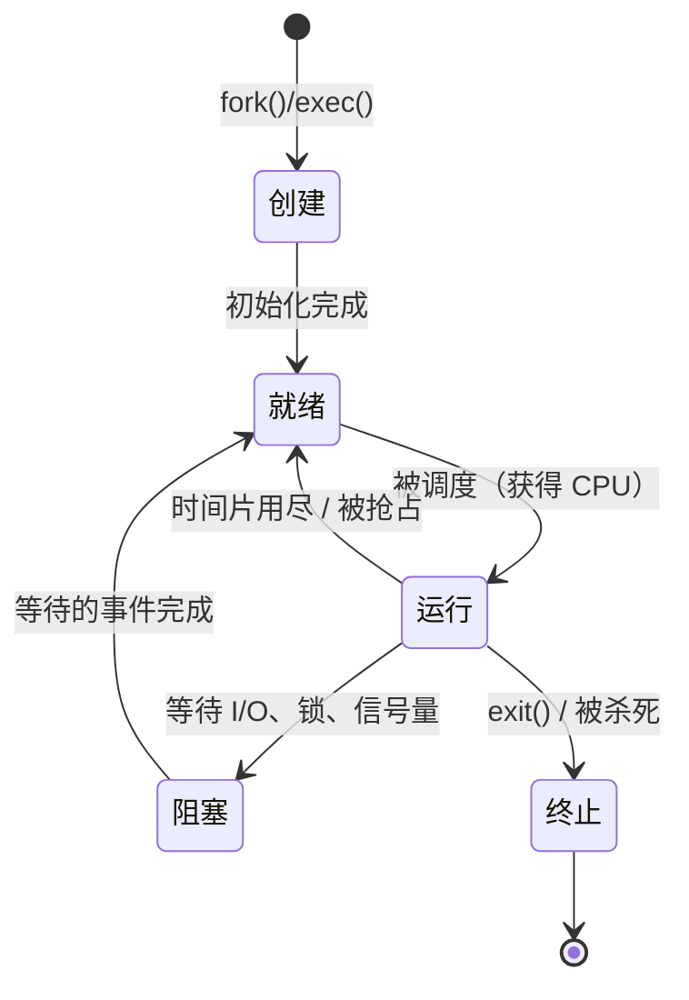
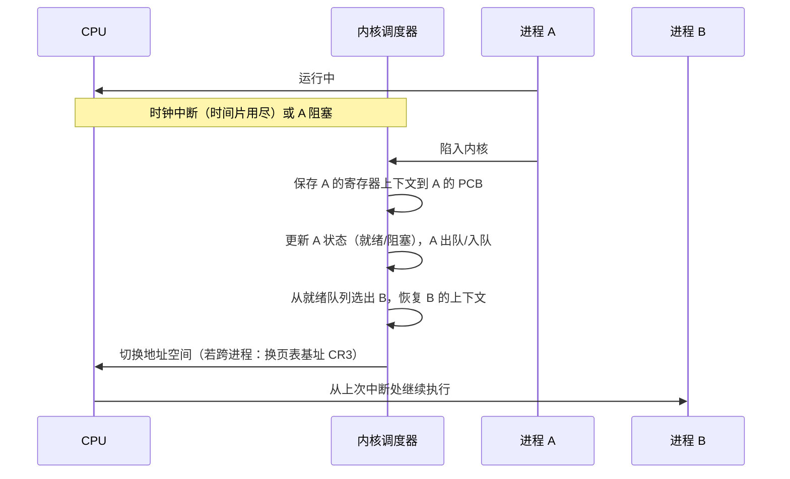

## 前置知识

阅读本文前，你应当了解：

- 进程是"正在运行的程序"这一基本概念（见 [操作系统](cs-fundamentals/150-OperatingSystem)）；
- CPU 寄存器与程序计数器（PC）的作用；
- 程序与进程的区别：程序是静态的文件，进程是动态的执行实体。

## 学习目标

- 说出 PCB、TCB 的全称与职责，理解"内核用数据结构管理一切"的设计思想；
- 列举 PCB 的核心字段，理解每个字段为什么必须被内核记录；
- 区分进程与线程：谁拥有资源，谁参与调度；
- 理解上下文切换的完整流程与开销来源。

## 1. 概念引入：内核为什么需要"档案袋"

一个类比：学校有几千名学生，教务处不可能靠"记住每张脸"来管理，而是给每人一个**档案袋**——学号、年级、选课、奖惩记录一目了然。转班时把档案袋移交，新班主任立刻能接手管理。

操作系统同理。内存里同时存在成百上千个进程，CPU 只有一个（或少数几个核），内核必须随时回答：

- 某个进程执行到哪条指令了？（程序计数器）
- 它的寄存器、打开的文件、内存分布是什么？
- 它现在能运行吗？优先级多高？该不该换它上 CPU？

这些信息不能散落在各处，必须集中存放——这个集中记录进程全部管理信息的内核数据结构，就是**进程控制块（PCB, Process Control Block）**。同理，线程的控制块称为**线程控制块（TCB, Thread Control Block）**。

> 类比失真提示：学校档案袋转班后原班主任就"放手"了；而进程被换下 CPU 后，内核随时可能再调度它，PCB 必须一直保持最新状态。

## 2. 进程控制块（PCB）

### 2.1 PCB 的核心字段

不同教科书与操作系统的划分略有差异，但一个经典 PCB 至少包含四类信息：

| 类别 | 典型字段 | 作用 |
| ---- | -------- | ---- |
| 标识信息 | PID（进程号）、PPID（父进程号）、用户 UID | 唯一标识进程、维护进程树与权限 |
| 状态信息 | 进程状态（就绪/运行/阻塞等）、退出码 | 调度器决定"能不能运行、要不要回收" |
| 控制信息 | 优先级、调度策略、CPU 时间片用量、信号处理表 | 调度决策与事件投递 |
| 资源信息 | 内存描述符（页表指针）、打开文件表、当前目录 | 记录进程拥有和使用的资源 |

其中最关键的是**处理器上下文（CPU context）**：通用寄存器、程序计数器 PC、栈指针 SP、状态寄存器 PSW 等。进程被换下 CPU 前，这些值必须保存到 PCB；重新调度时再恢复——这就是进程"暂停后又能无缝续跑"的原理。

### 2.2 进程状态机

PCB 中的状态字段驱动着调度器的工作。经典五状态模型如下：



注意：**阻塞态不能直接转运行态**。事件完成后进程只能先回到就绪队列排队，由调度器决定何时上 CPU。

### 2.3 PCB 的组织方式

内核需要按不同维度快速找到进程，常用组织结构：

- **就绪队列与阻塞队列**：按状态把 PCB 挂到不同队列上，调度器从就绪队列取队首；
- **PID 哈希表**：给定 PID 以 O(1) 查找进程（如 `kill` 命令需要按 PID 定位）；
- **父子进程树**：父进程可以 wait 子进程、查询子进程状态。

## 3. 线程控制块（TCB）与进程/线程关系

### 3.1 为什么需要线程

早期只有进程时，一个 Web 服务器想同时"计算 + 监听端口"，只能靠多进程：每个进程有独立地址空间，创建、切换、通信（需要 IPC）的代价都很高。线程的概念由此提出：**把"资源分配"与"调度执行"解耦**——

- 进程：**资源分配的基本单位**（地址空间、文件、信号等归它所有）；
- 线程：**CPU 调度的基本单位**（只保留运行所需的最小状态）。

同一进程内的多个线程共享地址空间和资源，各自拥有一份私有运行状态。

### 3.2 线程共享什么、私有什么

| 资源 | 同进程线程间 |
| ---- | ------------ |
| 代码段、全局变量、堆 | 共享 |
| 打开的文件描述符、信号处理表 | 共享 |
| 栈、寄存器组、程序计数器 | 私有 |
| 线程 ID、errno、信号掩码 | 私有 |

TCB 的内容因此比 PCB 简单得多：核心是寄存器上下文、线程栈指针、线程 ID、调度信息与状态。切线程不需要切换页表和地址空间，这正是线程切换比进程切换快的主要原因。

### 3.3 线程的实现层级

- **用户级线程**：由线程库管理，内核不知道其存在。切换快（纯用户态），但一个线程阻塞系统调用会拖住整个进程；无法利用多核。
- **内核级线程**：由内核直接管理调度，可并行跑在多核上，但管理需要进出内核。
- **混合模型 / 现代主流**：Linux 采用"一对一"内核线程模型；Go 等语言运行时在内核线程之上再叠加用户态 goroutine（M:N 模型，见 [协程与并发模型](cs-fundamentals/180-CoroutinesAndConcurrencyModels)）。

## 4. Linux 的实现：task_struct

Linux 没有为"进程"和"线程"设计两套结构，而是用统一的**进程描述符 `task_struct`** 表示所有调度实体；线程只是**共享了部分资源的特殊进程**（创建线程的 `clone()` 系统调用通过标志位 `CLONE_VM | CLONE_FILES | CLONE_SIGHAND | CLONE_THREAD` 指明共享哪些资源，而 `fork()` 一律不共享）。

`task_struct` 的关键字段（节选，语义示意）：

```c
struct task_struct {
    volatile long state;      /* -1 不可运行, 0 可运行, >0 停止 */
    pid_t pid;                /* 全局进程号 */
    pid_t tgid;               /* 线程组 ID：多线程进程中等于主线程的 pid */
    void *stack;              /* 内核栈 */
    struct mm_struct *mm;     /* 地址空间描述符（页表就在这里），
                                 同进程线程指向同一个 mm */
    struct files_struct *files;  /* 打开文件表，线程间可共享 */
    struct sched_entity se;   /* 调度实体：优先级、时间片、运行统计 */
    struct list_head tasks;   /* 链入全局进程链表 */
    /* ……数百个字段，涵盖信号、凭证、cgroup、性能统计等 */
};
```

两个值得注意的细节：

1. **线程组与 TGID**：`getpid()` 返回 TGID（进程 ID），`gettid()` 返回线程自己的 pid——内核层面每个线程都是独立的调度实体，只是共享资源。
2. **内核栈与 thread_struct**：每个任务有独立的内核栈，进入内核态时使用；寄存器上下文保存在 `task_struct.thread`（thread_struct）中，上下文切换本质是切换这两个指针。

## 5. 调度与上下文切换

### 5.1 上下文切换的完整流程



### 5.2 切换开销：直接与间接

| 开销类型 | 内容 | 量级（典型） |
| -------- | ---- | ------------ |
| 直接开销 | 保存/恢复寄存器、切换内核栈、换页表基址 | 微秒级 |
| 间接开销 | TLB 与 CPU 缓存被新进程"污染"，旧进程的热数据失效 | 可达数十微秒等效损失 |

同进程内的线程切换不换地址空间，TLB/缓存大多仍然有效，因此明显快于进程切换。这也是高并发服务普遍采用"少量进程 + 多线程 / 多协程"架构的根本原因。

## 6. 完整示例：亲手观察进程与线程

```c
/* fork_demo.c：演示 fork 创建进程与 pthread 创建线程的差异 */
#include <stdio.h>
#include <unistd.h>
#include <pthread.h>

static int counter = 0;   /* 全局变量：观察两个模型下是否共享 */

static void *thread_work(void *arg) {
    counter++;            /* 同进程线程共享全局变量 */
    printf("线程: pid=%d counter=%d\n", getpid(), counter);
    return NULL;
}

int main(void) {
    pid_t child = fork();
    if (child == 0) {             /* 子进程：独立地址空间副本 */
        counter++;                /* 只改了自己的副本，不影响父进程 */
        printf("子进程: pid=%d ppid=%d counter=%d\n",
               getpid(), getppid(), counter);
        return 0;
    }
    pthread_t t;
    pthread_create(&t, NULL, thread_work, NULL);
    pthread_join(t, NULL);        /* 等线程结束 */
    printf("父进程: pid=%d counter=%d\n", getpid(), counter);
    return 0;
}
```

编译运行（Linux）：`gcc fork_demo.c -o fork_demo -pthread && ./fork_demo`，典型输出：

```text
子进程: pid=10241 ppid=10240 counter=1
线程: pid=10240 counter=1
父进程: pid=10240 counter=1
```

可以看到：子进程的 pid 不同（counter 改动互不可见），线程与主线程 pid 相同（counter 同享一份）。配合 `ps -eLf` 或 `htop`（开启显示线程）可以直接观察线程与进程的从属关系。

## 7. 常见陷阱与调试

- **fork 的返回值**：父进程中返回子进程 PID（>0），子进程中返回 0，失败返回 -1。靠返回值区分父子分支是 fork 编程的基础，误判会导致两个进程执行同一段逻辑。
- **僵尸进程**：子进程退出后，内核保留其 PCB（退出状态）等父进程 `wait()` 读取；父进程不 wait，僵尸就一直占着 PID。调试时用 `ps aux | grep 'Z'` 定位，修复方向是父进程正确 wait 或忽略 `SIGCHLD`。
- **线程竞态**：`counter++` 并非原子操作（读-改-写三条指令），多线程无锁自增结果会小于预期。需要互斥锁或原子操作（见 [操作系统](cs-fundamentals/150-OperatingSystem) 的同步章节）。
- **观察工具**：`strace -f` 跟踪 fork/clone 调用；`/proc/<pid>/status` 查看 PCB 中暴露的运行统计。

## 8. 实战场景

- **容器化**：容器本质是共享内核的一组进程，`task_struct` 上的 cgroup 与 namespace 指针决定了它的资源限额与隔离视图。
- **服务器模型选择**：每连接一个进程（成本高）→ 每连接一个线程（成本中）→ 事件循环 + 协程（成本最低），演进主线就是降低"每连接对应的管理成本"，对应从 PCB 到 TCB 再到协程上下文的逐级瘦身。
- **性能排查**：上下文切换频率（`vmstat` 的 cs 列）异常偏高，通常意味着线程数远超核数或锁竞争激烈。

## 小结

初学者要点：

- PCB 是内核为每个进程维护的"档案袋"，记录标识、状态、上下文与资源；没有 PCB，进程无法被暂停与恢复。
- 进程是资源分配单位，线程是调度单位；线程共享地址空间，只私有栈和寄存器。
- 上下文切换 = 保存旧上下文 + 恢复新上下文，间接开销（缓存/TLB）往往比直接开销更大。

进阶注意：

- Linux 用统一 `task_struct` 表示进程与线程，线程是共享资源的"轻量进程"（clone 标志位决定共享程度）。
- 线程分为用户级、内核级与混合实现；现代语言运行时（goroutine、虚拟线程）普遍在内核线程之上叠加用户态调度。
- 切换开销的间接部分意味着"线程越多越快"是错觉，设计并发度应参考核数与任务类型（CPU 密集 ≈ 核数，I/O 密集可远超核数）。
