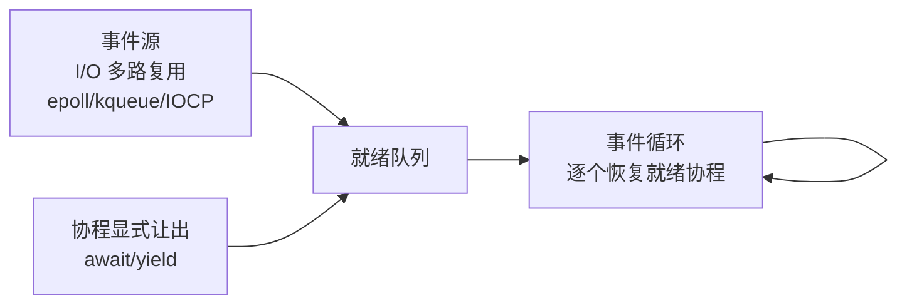

## 前置知识

- 进程与线程的职责划分、上下文切换开销（见 [进程 PCB 与线程 TCB](cs-fundamentals/170-PCBThreadTCB)）；
- 阻塞式 I/O 的语义（`read` 等待数据期间线程挂起）；
- 并行计算的基本概念（见 [并行计算](cs-fundamentals/140-ParallelComputing)）。

## 学习目标

- 分清并发与并行、同步与异步两组概念；
- 建立进程、线程、协程的三级成本模型，理解协程为什么"便宜"；
- 区分有栈协程与无栈协程两种实现路线；
- 理解事件循环、async/await、goroutine、虚拟线程等主流模型的共性与取舍。

## 1. 概念引入：员工与任务清单

管理一间客服中心，最直白的做法是"一个坐席接待一个客户"：客户挂断前坐席全程陪着等待——这就是**一个连接一个线程**的阻塞模型，人力成本与客户数成正比。

改进方案有两种思路：

- **多雇几个精明坐席，一人同时盯多个客户**：与谁说话、说到哪一句，每人心里有一份任务清单，随时切换——这就是**协程**：单个线程上交错执行多个逻辑任务，切换点由程序自己标记。
- **接线台广播式协作**：所有事件（新来电、客户回复）进入一个队列，坐席们从队列取事件处理，处理完立刻取下一个——这就是**事件循环（event loop）**。

两组必须分清的概念：

| 概念对 | 含义 | 常见误解 |
| ------ | ---- | -------- |
| 并发 vs 并行 | 并发是"交替处理多个任务"的结构能力；并行是"同一时刻物理上同时执行" | 单核也能并发；4 核跑 100 个线程也只有 4 路真并行 |
| 同步 vs 异步 | 同步是"发起后原地等结果"；异步是"发起后先返回，结果稍后通知" | 异步不等于并行；异步回调可能只在一个线程上跑 |

## 2. 三级成本模型：进程、线程、协程

| 维度 | 进程 | 内核线程 | 用户态协程 |
| ---- | ---- | -------- | ---------- |
| 调度者 | 内核 | 内核 | 语言运行时/库（用户态） |
| 切换方式 | 保存全部上下文 + 换页表 | 保存寄存器，共享地址空间 | 保存少量寄存器或改写状态机 |
| 切换开销量级 | 微秒级 | 数百纳秒至微秒级 | 数纳秒至数十纳秒 |
| 内存占用 | 数 MB（独立地址空间） | 约百 KB 起（栈 + 内核结构） | 数 KB 甚至数百字节 |
| 阻塞行为 | 阻塞整个进程 | 阻塞该内核线程 | 让出执行权，载体线程继续跑别的 |
| 单机可创建量 | 数百 | 数千至数万 | 数百万级 |

协程便宜的根源在于两点：**切换发生在用户态**（不进内核，没有模式切换与调度器开销，见 [用户态与内核态切换](cs-fundamentals/200-UserModeKernelModeSwitch)）；**上下文极小**（只需要恢复执行点与栈顶几个寄存器，甚至只是一次状态机跳转）。

## 3. 有栈协程与无栈协程

### 3.1 有栈协程（stackful）

每个协程拥有独立内存块充当栈，挂起时把寄存器（含栈指针）存起来，恢复时换回栈指针——就像轻量版的线程上下文切换。可以在**任意函数调用深度**处挂起，对代码侵入小。代表：Go goroutine（可增长栈）、Boost.Context、Lua 协程、Kotlin 协程的底层机制。

### 3.2 无栈协程（stackless）

不保存独立栈。编译器把协程函数变换成一个**状态机**：局部变量搬到堆上的协程帧里，每个 `await`/`yield` 点是一个状态编号；恢复时跳回对应状态继续。代表：C++20 coroutines、Rust async/await、JavaScript/Python 的 async/await、C# async。

| 维度 | 有栈 | 无栈 |
| ---- | ---- | ---- |
| 挂起位置 | 任意调用链深处 | 只能在标了 async/await 的函数内 |
| 实现方式 | 库 + 少量汇编 | 编译器变换为状态机 |
| 内存开销 | 独立栈（KB 级起） | 协程帧（更小、随需分配） |
| 代码侵入 | 小，同步风格即可 | 函数着色：async 会"传染"整个调用链 |

> 类比失真提示：说无栈协程"没有栈"并不准确——它把"曾经走过的调用链"折叠成了状态编号与堆上帧，省下的是栈内存而非执行能力。

### 3.3 一个最小有栈协程骨架

```c
/* coro_demo.c：用 ucontext 演示两个协程交替执行（Linux/macOS） */
#include <stdio.h>
#include <ucontext.h>

static ucontext_t main_ctx, ctx_a, ctx_b;
static char stack_a[64 * 1024], stack_b[64 * 1024];  /* 每协程独立栈 */

/* 挂起当前协程并切到对端：保存 self，恢复 peer */
static void yield_to(ucontext_t *self, ucontext_t *peer) {
    swapcontext(self, peer);
}

static void worker_a(void) {
    for (int i = 1; i <= 3; i++) {
        printf("协程A: 第 %d 步\n", i);
        yield_to(&ctx_a, &ctx_b);      /* 显式让出，切给协程 B */
    }
    /* 函数返回后经 uc_link 自动回到 main */
}

static void worker_b(void) {
    for (int i = 1; i <= 3; i++) {
        printf("协程B: 第 %d 步\n", i);
        yield_to(&ctx_b, &ctx_a);      /* 显式让出，切回协程 A */
    }
}

int main(void) {
    getcontext(&ctx_a);                /* 初始化协程 A 的上下文 */
    ctx_a.uc_stack.ss_sp = stack_a;
    ctx_a.uc_stack.ss_size = sizeof stack_a;
    ctx_a.uc_link = &main_ctx;         /* 协程函数返回后回到 main */
    makecontext(&ctx_a, worker_a, 0);

    getcontext(&ctx_b);                /* 初始化协程 B 的上下文 */
    ctx_b.uc_stack.ss_sp = stack_b;
    ctx_b.uc_stack.ss_size = sizeof stack_b;
    ctx_b.uc_link = &main_ctx;
    makecontext(&ctx_b, worker_b, 0);

    swapcontext(&main_ctx, &ctx_a);    /* 从 main 切入协程 A */
    printf("两个协程执行完毕，回到 main\n");
    return 0;
}
```

运行输出（两个协程在同一普通线程上交错推进）：

```text
协程A: 第 1 步
协程B: 第 1 步
协程A: 第 2 步
协程B: 第 2 步
协程A: 第 3 步
协程B: 第 3 步
两个协程执行完毕，回到 main
```

`swapcontext` 一次切换只有十几条指令——对比内核线程切换动辄数百纳秒，这就是协程性能优势的具象。

## 4. 事件循环：协程的调度引擎

协程让出后，谁决定"接下来跑谁"？答案是运行时里的**事件循环 + 就绪队列**：



- I/O 就绪检测交给操作系统多路复用（epoll 等）；
- 协程在"要等 I/O"处让出，把"醒来后做什么"（续体）注册到事件上；
- 事件循环单线程或少数线程地恢复协程——百万协程共享几十个内核线程（M:N 模型）。

Python asyncio、JavaScript 运行时、Rust tokio 的核心都是这个循环；差异只在语法糖与调度细节。

## 5. 主流语言的并发模型速览

| 语言/平台 | 模型 | 关键特征 |
| --------- | ---- | -------- |
| Go | goroutine（有栈，M:N） | 运行时调度器抢占式；channel 通信；栈 2KB 起、按需增长 |
| JavaScript | 单线程事件循环 + async/await | 无栈；永不并行执行用户代码，天然免锁 |
| Python | asyncio（单线程事件循环）+ 多进程绕开 GIL | async/await 无栈；CPU 密集靠多进程 |
| Java | 平台线程 + 虚拟线程 | 虚拟线程自 JDK 21 正式（JEP 444）：有栈、M:N，阻塞 API 自动让出载体线程 |
| C++20 | coroutines（无栈） | 语言只提供变换机制，库（如 cppcoro）补齐调度 |
| Rust | async/await（无栈）+ tokio 等 | 零成本状态机；执行器与 future 分离 |
| Kotlin | 协程（有栈机制 + 结构化并发） | suspend 函数 + 作用域管理生命周期 |

两个值得记住的里程碑：C10K 问题（1999 年提出：单机如何服务一万个并发连接）推动了从"每连接一线程"到事件驱动/协程的范式迁移；Java 虚拟线程（2023 年随 JDK 21 转正）则标志着"百万级并发任务 + 同步风格代码"在生态最重的语言中成为默认选项。

## 6. 完整示例：asyncio 对比阻塞调用

```python
# asyncio_demo.py：事件循环并发 vs 顺序阻塞，直观感受协程的交错执行
import asyncio
import time

async def fetch(name: str, delay: float) -> str:
    print(f"{time.strftime('%X')} {name} 开始")
    await asyncio.sleep(delay)          # 让出执行权：事件循环转去跑别的协程
    print(f"{time.strftime('%X')} {name} 完成")
    return name

async def main() -> None:
    # 三个任务并发执行：总耗时约等于最长的 delay（2 秒），而非 1+2+3 秒
    results = await asyncio.gather(
        fetch("任务A", 1),
        fetch("任务B", 2),
        fetch("任务C", 3),
    )
    print("全部完成:", results)

asyncio.run(main())
```

输出（时间戳交错，证明三者并发推进）：

```text
10:00:00 任务A 开始
10:00:00 任务B 开始
10:00:00 任务C 开始
10:00:01 任务A 完成
10:00:02 任务B 完成
10:00:03 任务C 完成
全部完成: ['任务A', '任务B', '任务C']
```

把 `await asyncio.sleep(delay)` 换成 `time.sleep(delay)` 再运行：总耗时变成 6 秒且完全串行——阻塞调用不给事件循环让出机会，这正是协程编程的头号大坑。

## 7. 常见陷阱与调试

- **在协程里调用阻塞函数**：同步的 `time.sleep`、数据库驱动、加密计算都会卡住整个载体线程，拖死同线程上所有协程。对策：换异步驱动，或把阻塞任务扔进线程池（`run_in_executor` / `spawn_blocking`）。
- **函数着色问题**：无栈协程的 async 会沿调用链向上传染（"紫色函数"困境）；混合同步/异步代码库时的典型重构成本。
- **以为协程利用多核**：asyncio 事件循环默认单线程，CPU 密集任务不会因此加速。协程解决的是**I/O 并发密度**，不是并行算力——后者靠多线程/多进程（见 [并行计算](cs-fundamentals/140-ParallelComputing)）。
- **共享状态竞态依然存在**：协程在 await 点交错执行，没有锁保护的"检查后写入"照样出错；单线程事件循环免的是"任意指令间被抢占"，免不了"await 之间被插入"。
- **调度饥饿**：事件循环里放一个长循环计算，其他协程全部饿死；把大计算切片（每片之间 await 一次）是通用解法。

## 8. 实战场景

- **高并发网关与微服务**：百万长连接（推送、IM、IoT）只能靠协程/事件驱动模型维系，内存与切换成本比线程模型低两个数量级。
- **数据库与缓存客户端**：连接池配合协程语义（连接借出期间 await，归还后复用）是异步服务性能的关键路径。
- **批量外部调用聚合**：一次页面渲染聚合十几个下游 API，`gather`/`join` 并发扇出，尾延迟从"各下游之和"降到"最慢下游"。
- **CPU + I/O 混合负载**：常见组合是"协程处理 I/O 编排 + 线程池/进程池消化 CPU 密集步骤"，两种模型互补而非互斥。

## 小结

初学者要点：

- 并发是结构（交替推进多任务），并行是物理（同时执行）；异步是接口风格（先返回后通知）。
- 进程、线程、协程是三级成本模型：切换与内存开销逐级骤减，单机可承载的任务数逐级上升。
- 协程分有栈（任意深度挂起，Go/Kotlin）与无栈（编译器状态机，async/await 家族）两派。
- 事件循环 + I/O 多路复用是协程的调度引擎；在协程里调用阻塞函数是最常见、最致命的错误。

进阶注意：

- M:N 模型（百万协程跑在几十个内核线程上）是现代运行时的主流形态：goroutine、Java 虚拟线程（JDK 21 起）、tokio 都如此。
- 协程不提供并行算力，也不免除竞态：CPU 密集用多线程/多进程，共享状态仍需锁或消息传递。
- 选择模型的判断式：I/O 并发密度高选协程/事件驱动；计算吞吐优先选线程/进程并行；两者兼有时分层组合。
