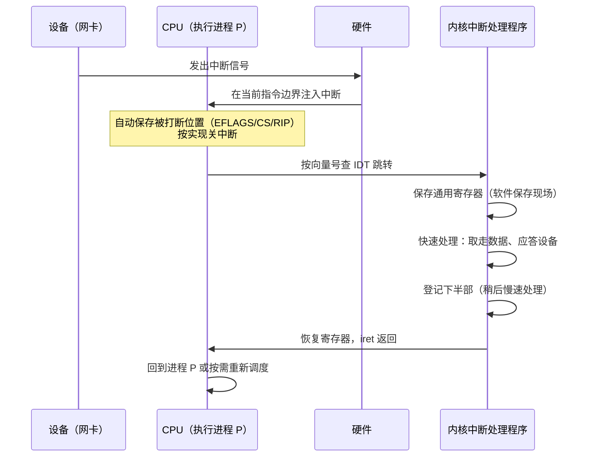
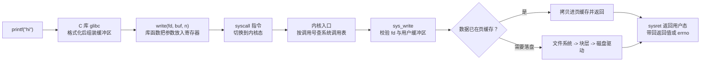

## 前置知识

- 进程与 CPU 的关系，程序计数器 PC 的作用（见 [进程 PCB 与线程 TCB](cs-fundamentals/170-PCBThreadTCB)）；
- 用户态与内核态的特权级概念（详见 [用户态与内核态切换](cs-fundamentals/200-UserModeKernelModeSwitch)）；
- 基础的 C 语言函数调用约定。

## 学习目标

- 区分中断、异常与系统调用三类"打断 CPU 正常执行流"的事件；
- 描述一次中断处理的完整硬件加软件流程；
- 理解 IDT（中断描述符表）的作用与中断向量号的含义；
- 追踪一次 `write()` 从用户代码到内核的完整路径。

## 1. 概念引入：CPU 为什么需要"被打断"

一个类比：你在专心写报告（CPU 执行当前进程），突然门铃响了（外部设备有事）、烟雾报警器叫了（硬件故障）、或者你需要一份只有管理员能取的文件，于是走到服务窗口提交申请单（系统调用）。无论哪种情况，你都得**记住写到哪一行**，处理完事情再回来继续。

CPU 正是这样工作的。它的执行流是"取指-译码-执行"循环，但现实世界要求它随时能响应三类事件：

1. **中断（interrupt）**：来自 CPU 外部的异步事件（网卡收到包、时钟滴答、按键）。"异步"指发生时刻与当前执行的指令无关。
2. **异常（exception）**：当前指令执行引发的同步事件（除零、缺页、非法指令）。
3. **系统调用（system call）**：程序**主动**通过特殊指令请求内核服务，本质是一种有意的"陷入"（trap）。

三者共用同一套硬件机制：保存现场、按事件号查表跳转到处理例程、处理、恢复现场。

## 2. 中断的分类与硬件基础

### 2.1 分类速查

| 类别 | 同步性 | 来源 | 典型例子 | 后续行为 |
| ---- | ------ | ---- | -------- | -------- |
| 可屏蔽中断 | 异步 | 外设 | 网卡、磁盘、定时器 | 可被 CPU 标志位（IF）暂时关闭 |
| 不可屏蔽中断 NMI | 异步 | 硬件致命事件 | 内存校验错 | 必须立即处理 |
| 陷阱 trap | 同步 | 指令主动触发 | 系统调用、断点 int3 | 返回下一条指令继续 |
| 故障 fault | 同步 | 指令执行出错但可修复 | 缺页异常 | 修复后**重新执行**该指令 |
| 终止 abort | 同步 | 严重错误 | 双重故障 | 通常终止进程 |

fault 与 trap 的区别最容易被忽略：缺页处理程序把物理页装好后，CPU 会**重新执行触发缺页的那条指令**（这次会成功）；而系统调用返回后直接执行下一条指令。

### 2.2 中断控制器与向量号

每个中断源有一个编号，称为**中断向量号**。x86 体系中 0-31 号保留给 CPU 异常（如 14 号是缺页），外设中断由**中断控制器**（早期 PIC，现代 APIC）统一汇集、仲裁并转发给 CPU，并支持多核环境下的中断路由。

### 2.3 IDT：中断描述符表

CPU 收到中断后需要知道"谁来处理它"。x86-64 用**中断描述符表（IDT, Interrupt Descriptor Table）**回答这个问题：IDT 的第 N 项记录着 N 号中断处理例程的入口地址与特权级要求。内核在启动时通过 `lidt` 指令登记 IDT 的位置。中断响应的本质就是一次硬件级的函数指针表查询。

## 3. 中断处理的完整流程



关键设计——**顶半部与底半部**：中断处理期间该中断线（或整个中断上下文）不能睡眠、要尽量短。因此 Linux 把处理拆成两半：

- **顶半部（hardirq）**：在关中断（或局部关中断）环境下速战速决，只做"应答设备 + 取数据"；
- **底半部（softirq/tasklet/workqueue）**：稍后在开中断环境下完成协议栈解析等耗时工作，其中 workqueue 运行在进程上下文、可以睡眠。

## 4. 系统调用：用户程序进入内核的正门

### 4.1 从 printf 到内核的完整路径



### 4.2 关键机制详解

- **调用号**：每个系统调用有固定编号（x86-64 Linux：`read`=0、`write`=1、`openat`=257 等）。用户态把编号放入 `rax`，参数依次放入 `rdi/rsi/rdx/r10/r8/r9`。
- **专用指令**：现代 x86-64 使用 `syscall`/`sysret` 指令对（旧的 `int 0x80` 因上下文保存开销大、寄存器约定陈旧已被淘汰）；ARM64 使用 `svc` 指令。这些指令完成特权级切换并跳到内核统一入口。
- **系统调用表**：内核入口用调用号索引一张函数指针表，转到具体实现（如 `sys_write`）。
- **参数校验**：内核绝不信任用户指针——`write` 传入的 buf 必须位于该进程的合法用户空间，否则返回 `EFAULT`。这是系统安全性的基石。

### 4.3 用一段代码直接发起系统调用

```c
/* raw_write.c：绕过 C 库封装，直接用内联汇编发起 write 系统调用 */
#include <stdio.h>

int main(void) {
    const char msg[] = "hello via syscall\n";
    long ret;
    /* x86-64 约定：调用号在 rax，参数依次在 rdi/rsi/rdx */
    __asm__ volatile (
        "syscall"
        : "=a"(ret)                     /* 返回值在 rax */
        : "a"(1L),                      /* rax = 调用号 1（write） */
          "D"(1L),                      /* rdi = fd 1（stdout） */
          "S"(msg),                     /* rsi = 缓冲区地址 */
          "d"(sizeof(msg) - 1)          /* rdx = 长度（不含结尾 0） */
        : "rcx", "r11", "memory"        /* syscall 会破坏 rcx/r11 */
    );
    printf("write 返回 %ld（写入字节数）\n", ret);
    return 0;
}
```

用 `strace ./a.out` 观察任意程序的系统调用轨迹，是排查"I/O 慢在哪里"的第一手段。

## 5. 中断与系统调用的对比

| 维度 | 中断 | 异常 | 系统调用 |
| ---- | ---- | ---- | -------- |
| 发起者 | 外设（异步） | 当前指令（同步，意外） | 当前指令（同步，有意） |
| 频率 | 非常高（时钟/网络） | 视负载（缺页常见） | 非常高 |
| 用户可感知 | 否 | 缺页对用户透明 | 是（属于 API 的一部分） |
| 能否睡眠 | 中断上下文不可睡眠 | 处理程序视情况而定 | 处理函数可以睡眠 |
| 返回行为 | 回到被打断处 | fault 会重执行指令 | 回到下一条指令 |

一个容易混淆的点：**信号不是中断**。信号是内核向进程投递的异步通知，处理函数本身运行在用户态；而中断处理运行在内核态。两者机制独立，但设计思想同源——都是"异步事件通知"。

## 6. 常见陷阱与调试

- **把 fault 当 trap**：缺页处理后 CPU 重执行触发指令；若处理程序不修复根因（如地址越界），会无限重触发，最终内核发送 SIGSEGV 终止进程。
- **在中断上下文里睡眠**：在 hardirq/softirq 中调用可能睡眠的函数（如 `kmalloc(GFP_KERNEL)`）是内核编程经典 bug，会触发 "scheduling while atomic" 报警。
- **误以为系统调用 = 函数调用**：glibc 的 `getpid()` 可能缓存结果、`printf` 内部混合多次系统调用，`strace` 看到的与源码行并非一一对应。
- **性能观察**：`vmstat 1` 的 `in`（中断次数）与 `cs`（上下文切换）两列能快速判断中断压力；`mpstat -P ALL 1` 可发现 `softirq` 占比过高的核。

## 7. 实战场景

- **高性能网络**：DPDK、io_uring 等技术的核心思路都是"减少中断与系统调用次数"——轮询代替中断、批量提交 I/O 代替逐个 syscall。
- **实时性调优**：把关键线程绑定到与网卡中断不同的核（IRQ 亲和性），避免中断打断关键计算。
- **安全加固**：系统调用是内核暴露的最小攻击面，seccomp 白名单正是基于调用号过滤。

## 小结

初学者要点：

- 中断是外部的异步通知，异常是指令引发的同步事件，系统调用是程序主动请求内核服务的入口；三者共用"查表跳转 + 保存恢复现场"的硬件机制。
- IDT 是内核登记的"中断处理函数表"，CPU 按向量号索引它。
- 系统调用路径：库函数封装、专用指令（syscall/svc）、内核入口、系统调用表、具体实现。

进阶注意：

- fault（如缺页）处理完成后会重执行触发指令，trap 则直接继续——理解这一点才能读懂缺页密集型程序的 strace 输出。
- 中断处理分顶半部/底半部，中断上下文不可睡眠；`/proc/interrupts` 与 `/proc/softirqs` 是排查中断负载的入口。
- 系统调用开销（约几百纳秒）在高频小 I/O 场景不可忽略，vDSO、io_uring 等优化都围绕"少进出内核"展开（见 [用户态与内核态切换](cs-fundamentals/200-UserModeKernelModeSwitch)）。
