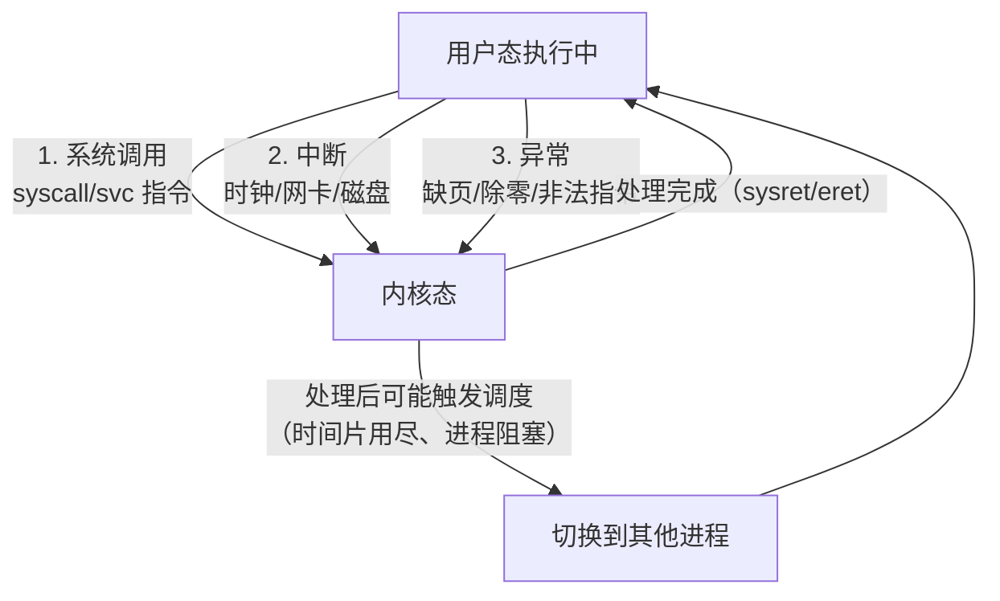

## 前置知识

- 系统调用的发起方式（见 [中断与系统调用](cs-fundamentals/190-InterruptAndSystemCall)）；
- 进程地址空间与页表的基本概念（见 [内存分段与分页](cs-fundamentals/210-MemorySegmentationAndPaging)）；
- 寄存器与程序状态字的基本认识。

## 学习目标

- 理解为什么 CPU 必须区分特权级，以及 Ring 0/3 与 ARM EL0-EL3 的对应关系；
- 说出触发用户态到内核态切换的三类事件，并区分"模式切换"与"进程切换"；
- 量化一次切换的开销构成，理解 vDSO、io_uring 等优化技术的动机。

## 1. 概念引入：为什么要有两副面孔

一个类比：公司里普通员工可以自由使用工位、打印机（日常权限），但保险库只有持证管理员能进出。员工需要取文件时，**不能自己走进保险库**，而是填写单据交给管理员代办。这样即使某个员工"程序写错了"，也最多浪费自己的时间，不会破坏全公司的资产。

CPU 与操作系统正是这个模型：

- **用户态（user mode）**：应用程序运行的状态，只能执行普通指令，只能访问自己地址空间内的内存；
- **内核态（kernel mode）**：操作系统核心运行的状态，可以执行特权指令（操作页表、关中断、访问硬件）。

如果没有这道墙，任何一个程序的野指针都可能改写调度器数据、关掉中断、格式化磁盘——现代计算机的稳定性完全建立在这道墙上。

## 2. 特权级模型

### 2.1 x86 的 Ring 与 ARM 的 Exception Level

| 体系 | 层级 | 典型用途 |
| ---- | ---- | -------- |
| x86 | Ring 0 | 内核 |
| x86 | Ring 1/2 | 设计给驱动/中间层，现代系统几乎不用 |
| x86 | Ring 3 | 用户程序 |
| ARM | EL0 | 用户程序 |
| ARM | EL1 | 操作系统内核 |
| ARM | EL2 | 虚拟机监控器（Hypervisor） |
| ARM | EL3 | 安全监控（TrustZone 切换） |

特权级信息记录在 CPU 的状态寄存器里（x86 的 CS 段选择子低两位、ARM64 的 `CurrentEL`）。**一条指令是否合法由当前特权级决定**：在 Ring 3 执行 `wrmsr`（写模型特定寄存器）这类特权指令会直接触发非法指令异常。

### 2.2 双重保护：特权级 + 页表

特权级限制"能执行哪些指令"，页表限制"能访问哪些内存"。x86 页表项中的 U/S 位标记每一页是用户页还是内核页：用户态访问内核页会触发页错误。两个机制叠加，才构成完整的隔离。

## 3. 三种切换场景



1. **系统调用**：程序主动请求服务。频率最高的切换来源（读文件、收发包、甚至 `malloc` 大块内存都可能触发）。
2. **中断**：外部设备异步打断，与当前程序无关。时钟中断是抢占式调度的心跳。
3. **异常**：当前指令出错或缺页，属于"被动"切换，处理后可能返回原指令重试（fault），也可能直接杀死进程。

## 4. 模式切换与进程切换：两个必须分清的概念

这是初学者最容易混淆的地方：

| 概念 | 特权级变了吗 | 进程变了吗 | 典型触发 | 开销量级 |
| ---- | ------------ | ---------- | -------- | -------- |
| 模式切换（mode switch） | 是（用户态↔内核态） | 否，还是同一进程 | 系统调用、中断 | 约百纳秒级 |
| 进程切换（context switch） | 是（先陷入内核） | 是，换成了另一个进程 | 调度器决策 | 微秒级，含缓存损失 |

一次系统调用的完整轨迹是：`syscall` 指令（模式切换，进入内核）→ 内核执行服务例程 → `sysret`（模式切换回用户态）。全程**不发生进程切换**——CPU 始终在为同一个进程服务，只是"换了一副面孔"。

只有当内核在处理过程中决定调度（如时间片耗尽、进程睡眠等 I/O），才会额外发生进程切换：保存旧进程上下文、可能更换页表基址（CR3）、恢复新进程上下文（详见 [进程 PCB 与线程 TCB](cs-fundamentals/170-PCBThreadTCB)）。**"系统调用一定很慢因为要换进程"是常见误解**——慢的根源是模式切换本身与安全检查，而不是进程切换。

## 5. 切换的具体动作与开销

### 5.1 进入内核时发生了什么

以 x86-64 的 `syscall` 为例：

1. CPU 把返回地址存入 `rcx`、标志位存入 `r11`（硬件完成，比中断快）；
2. 切换到内核栈（从 MSR 寄存器读取内核栈指针）；
3. 跳转到内核统一入口点；
4. 内核保存用户态寄存器（部分场景按需保存）、执行安全检查、分发到具体系统调用。

返回时 `sysret` 逆序还原。整个过程**不保存全部通用寄存器**——这是 `syscall` 比 `int 0x80` 快得多的原因之一。

### 5.2 开销构成

- **直接开销**：指令切换、保存/恢复现场、内核中的分发与参数校验，单次约 50-300 纳秒（现代 x86 服务器实测常见量级，随微架构与安全缓解措施浮动）；
- **间接开销**：内核代码与数据挤占 CPU 缓存与 TLB，令随后的用户代码变慢——这部分难以直接测量，却在高频切换场景中占大头；
- **安全缓解的代价**：Spectre/Meltdown 漏洞后引入的 KPTI（内核页表隔离）使每次进出内核都要换页表基址，系统调用密集型负载损失可达两位数百分比，也是 KernelSU 一类"减少跨界"技术讨论的背景。

## 6. 完整示例：实测系统调用与 vDSO

```c
/* mode_switch_cost.c：对比"必须进内核的调用"与"vDSO 用户态完成"的调用 */
#define _GNU_SOURCE
#include <stdio.h>
#include <time.h>
#include <unistd.h>
#include <sys/syscall.h>

static long now_ns(void) {
    struct timespec ts;
    clock_gettime(CLOCK_MONOTONIC, &ts);
    return ts.tv_sec * 1000000000L + ts.tv_nsec;
}

int main(void) {
    enum { N = 1000000 };
    long t0 = now_ns();
    for (int i = 0; i < N; i++) {
        getpid();                       /* glibc 缓存了结果，几乎不切换 */
    }
    long t1 = now_ns();
    for (int i = 0; i < N; i++) {
        syscall(SYS_getpid);            /* 强制每次走真实系统调用 */
    }
    long t2 = now_ns();
    printf("glibc getpid (缓存):   %ld ns/次\n", (t1 - t0) / N);
    printf("syscall getpid (进内核): %ld ns/次\n", (t2 - t1) / N);
    return 0;
}
```

典型输出（数值随机器浮动，比例关系稳定）：

```text
glibc getpid (缓存):   1 ns/次
syscall getpid (进内核): 120 ns/次
```

再用 `strace -c ./a.out` 统计系统调用次数与耗时占比，能直观看到"少进内核"的收益。`clock_gettime` 本身也是好例子：glibc 通过 **vDSO**（内核映射到每个进程地址空间的一段共享代码）在用户态直接读时钟，完全绕过模式切换——这就是"把安全且只读的工作搬到用户态"的经典优化。

### 减少切换的常用技术

| 技术 | 思路 | 适用场景 |
| ---- | ---- | -------- |
| vDSO | 只读数据由内核预映射，用户态直接读 | 取时间、获取 CPU ID |
| io_uring | 用户态与内核共享环形队列，批量提交/收割 I/O | 高频小 I/O、存储与网络 |
| 批量化 | 一次 syscall 处理多条数据（如 `sendmmsg`） | 高频网络收发 |
| 用户态轮询 | 少量线程忙轮询设备，回避中断与切换 | 极致低延迟（DPDK 类） |

## 7. 常见陷阱与调试

- **把慢归因于"进程切换"**：`strace` 显示系统调用很多但 `vmstat` 的 `cs` 不高，说明瓶颈在模式切换而非调度；两者优化手段不同。
- **用 time 命令误解内核时间**：`time` 输出中 `sys` 高说明进程花大量时间在内核态——不一定是坏事（I/O 本来就要进内核），要结合 `iostat`/`strace` 判断是否系统调用过碎。
- **微基准忘记预热与编译优化**：`syscall()` 循环若被编译器优化或受频率调节影响，结果会失真；基准代码应保持 `-O2` 并运行多次取中位数。
- **安全开关影响可复现性**：同一台机器开关 KPTI（内核参数 `pti=on/off`）测出的系统调用耗时差异明显，对比数据时要注意内核配置一致。

## 8. 实战场景

- **Web 服务器调优**：每请求若产生上百次小系统调用（逐个 `read`/`write`、频繁 `futex`），合并缓冲与批量 I/O 往往立竿见影；io_uring 与 `TCP_NODELAY`/`TCP_CORK`（见 [TCP 粘包与拆包](cs-fundamentals/310-TCPMessageFraming)）是常用组合。
- **数据库与存储引擎**：LSM 树用 WAL 批量刷盘、group commit 把多次 `fsync` 合并，本质都是摊薄模式切换与设备 I/O 的固定成本。
- **容器与安全沙箱**：gVisor 类方案在用户态实现一个"迷你内核"拦截系统调用，用兼容性换取隔离强度，代价正是成倍增加的跨界次数——理解切换成本才能评估其性能取舍。

## 小结

初学者要点：

- 用户态只能执行普通指令，内核态才能执行特权指令；特权级（Ring 0/3、EL0-EL3）加页表 U/S 位共同构成保护。
- 触发切换的三类事件：系统调用（主动）、中断（异步）、异常（被动）。
- 模式切换不等于进程切换：系统调用通常只换"面孔"不换"进程"。

进阶注意：

- `syscall`/`sysret` 精简了现场保存，是现代系统调用快于 `int 0x80` 的根本原因；切换的间接开销（缓存/TLB 污染）常大于直接开销。
- vDSO、io_uring、批量 I/O 的共同哲学：能不进内核就不进，必须进就攒一批。
- 性能归因时先区分 `sys` 时间、上下文切换次数与中断次数三个指标，再决定优化方向。
