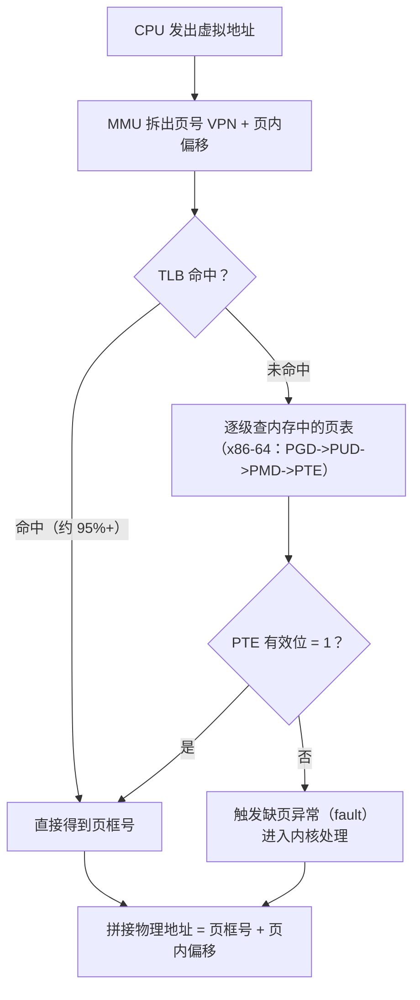
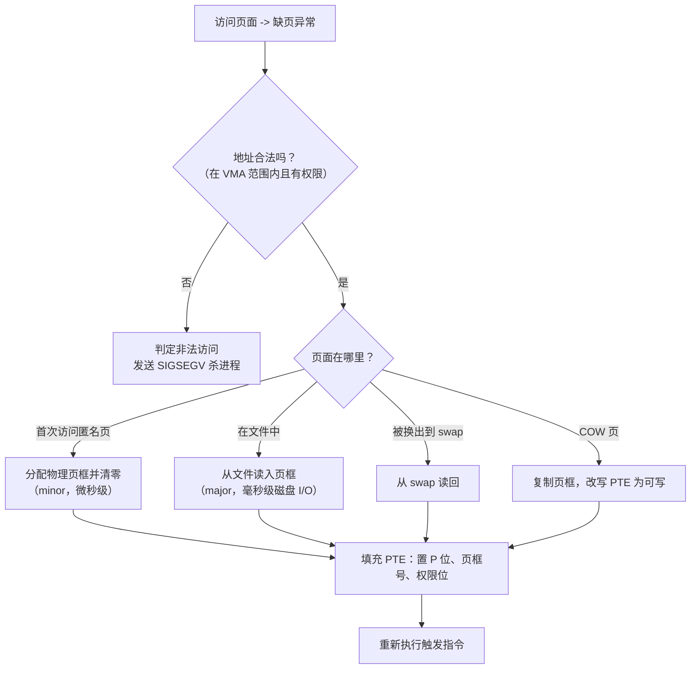

## 前置知识

- 二进制与十六进制地址表示（见 [数的表示与编码](cs-fundamentals/060-NumberRepresentationEncoding)）；
- 程序的内存布局（代码段、数据段、堆、栈）；
- 中断与异常的基本概念（缺页是一种 fault，见 [中断与系统调用](cs-fundamentals/190-InterruptAndSystemCall)）。

## 学习目标

- 说清虚拟内存要解决的四个问题：隔离、重定位、超额分配、共享；
- 分别描述分段与分页的地址翻译过程，理解两种方案各自的碎片问题；
- 掌握现代 x86-64 四级页表的翻译流程与 TLB 的作用；
- 完整走一遍缺页中断的处理路径。

## 1. 概念引入：程序眼里的地址是"假"的

早期计算机里程序直接使用物理地址，随之产生一系列灾难：

- 两个程序同时运行，如何保证互不踩踏对方的内存？
- 程序编译时不知道会被加载到哪个地址，怎么链接？
- 8GB 物理内存怎么同时运行"申请了 16GB"的程序？

现代解法是**虚拟内存**：给每个进程一个独立的、从 0 开始的巨大地址空间（x86-64 上为 2^48 字节量级），程序使用的都是虚拟地址，由硬件（MMU）+ 操作系统（页表）在运行时翻译成物理地址。

一个类比：虚拟地址像**图书馆的索书号**，物理地址像**仓库里的实际货架位置**。索书号体系稳定（书挪了索书号不变）、每人一本互不冲突，仓库怎么腾挪是管理员（OS）的事。你甚至可以登记一个"尚未到货"的索书号（已分配但未分配物理页），等真去取书时管理员才临时调货——这正是按需调页。

## 2. 分段：按逻辑单元划分

### 2.1 机制

分段把地址空间按程序逻辑划分成若干**段**（代码段、数据段、栈段……），每段有独立的基址和长度。逻辑地址由两部分组成：

```text
逻辑地址 = (段选择子, 段内偏移)
翻译规则：物理地址 = 段基址 + 段内偏移，且 0 <= 偏移 < 段界限
```

段表（x86 上体现为 GDT/LDT 中的段描述符）记录每段的基址、界限与权限（可读/可写/可执行、特权级）。

### 2.2 优点与致命缺陷

分段天然贴合程序结构：代码段可设为只读可执行，越界访问立即被硬件拦截；段可独立增长。但它有一个致命问题——**外部碎片**：段的长度不一，反复分配回收后，物理内存被切成许多大小不等的小空洞，虽然总空闲量足够，却放不下任何一个新段。

```text
物理内存：|[段A 2MB]|[洞 0.5MB]|[段B 4MB]|[洞 0.3MB]|...
新段需要 1MB -> 空洞总量 0.8MB 不够 -> 分配失败（外部碎片）
```

## 3. 分页：统一规格的解决方案

### 3.1 机制

分页把虚拟地址空间和物理内存都切成**固定大小**的块：虚拟侧叫**页（page）**，物理侧叫**页框（frame）**，典型大小 4KB。任何虚拟页可以放进任何空闲页框，外部碎片彻底消失——只剩"最后一页可能用不满"的**内部碎片**（平均每段浪费半页，最多 4KB）。

地址翻译是纯位运算：

```text
虚拟地址（4KB 页）= | 页号 VPN（高位） | 页内偏移（低 12 位） |
物理地址          = | 页框号 PFN       | 页内偏移（原样拷贝） |
翻译规则：PFN = 页表[VPN]，物理地址 = (PFN << 12) | 偏移
```

页表（Page Table）就是"虚拟页号到物理页框号"的数组，由操作系统维护、MMU 硬件查表。

### 3.2 完整翻译流程



### 3.3 多级页表：为什么不是一张大表

x86-64 虚拟地址 48 位、4KB 页，意味着单页表需要 2^36 个表项。即使每项 8 字节，一张表就要 512GB——每个进程都来一张显然荒谬。

解法是**多级页表（radix tree 思想）**：把 48 位虚拟地址切成 `16 位保留 + 9 + 9 + 9 + 9 + 12 位页内偏移`，四张逐级缩小的表：

| 级别 | 简称 | 索引来源 |
| ---- | ---- | -------- |
| 一级 | PGD（页全局目录） | 地址位 [47:39] |
| 二级 | PUD | 地址位 [38:30] |
| 三级 | PMD | 地址位 [29:21] |
| 四级 | PTE（页表项） | 地址位 [20:12] |

上层表项存放"下一级表的位置"，**没有使用的地址区域根本不建下级表**——一个只有几 MB 代码和数据的程序，只需 4 张顶层表加少量下级表。代价是命中时要访问 4 次内存，因此必须有 TLB 缓解（见下）。2020 年后部分服务器 CPU 扩展到五级页表（LA57），支持更大地址空间。

### 3.4 页表项里的权限与状态位

以 x86-64 的 PTE 为例，关键位包括：

| 位 | 名称 | 含义 |
| -- | ---- | ---- |
| P | Present | 该页当前是否在物理内存中 |
| R/W | Read/Write | 0 = 只读，写触发异常 |
| U/S | User/Supervisor | 0 = 仅内核态可访问 |
| A | Accessed | 被访问过（置换算法的输入） |
| D | Dirty | 被写过（换出前需回写） |
| NX | No eXecute | 禁止执行（数据页防代码注入） |

### 3.5 TLB：翻译结果缓存

多级页表让一次访存可能变成 5 次访存（4 次查表 + 1 次真实访问），若无缓解，性能会灾难性下降。**TLB（Translation Lookaside Buffer）**是 MMU 内的高速缓存，记录"VPN 到 PFN"的最近翻译结果，命中率通常在 95% 以上——这正是程序局部性（时间与空间）的硬件红利。

两个工程含义：

- 换页表基址（进程切换时写 CR3）会让 TLB 大面积失效；现代 CPU 用 ASID/PCID 标记表项所属进程，减少全量失效；
- 访问模式跳来跳去（如大步长遍历数组）会打爆 TLB，这是某些算法"缓存友好却 TLB 不友好"的原因。

### 3.6 大页

页越小页表越碎、TLB 覆盖越小。**大页**（2MB/1GB）用一项覆盖更大范围：2MB 页让一个 TLB 表项覆盖 512 倍于 4KB 页的内存。Linux 通过 `mmap(MAP_HUGETLB)` 或透明大页（THP）启用，数据库与 JVM 调优中常见；代价是内部碎片上限变大、分配与整理成本更高。

## 4. 缺页中断：按需调页的核心

页表项 P 位为 0 时访问该页，CPU 触发缺页异常（x86 的 14 号 fault），内核接管：



注意最后一步：因为缺页是 **fault**，处理完成后 CPU 会**重新执行触发异常的那条指令**，这次翻译成功、程序无感知。区分 minor fault（无需磁盘 I/O）与 major fault（需要磁盘 I/O）对性能分析很重要：`perf stat -e major-faults` 或 `ps -o min_flt,maj_flt` 可直接观察。

## 5. 分段与分页的协作：x86 的历史与现实

x86 的原始设计是两段翻译：`逻辑地址 --分段--> 线性地址 --分页--> 物理地址`。段机制负责保护与重定位，页机制负责细粒度管理。但现代操作系统（Linux、Windows）都采用**平坦模型**：所有段基址 0、界限拉满，分段形同虚设，实际工作全部由分页完成。原因很直白：页粒度统一、便于按需调页与置换，而段的可变长在工程上是负担。如今段机制仅存的两个实用角色是：

- `fs`/`gs` 段基址寄存器：用于线程局部存储（TLS）与 per-CPU 变量；
- 段权限位参与"代码不可写、数据不可执行"的最基础检查。

## 6. 完整示例：观察一个程序的虚拟内存

```c
/* vm_demo.c：观察按需调页与地址布局 */
#define _GNU_SOURCE
#include <stdio.h>
#include <stdlib.h>
#include <time.h>

static long touch_cost(char *p) {
    struct timespec ts;
    long t0, t1;
    clock_gettime(CLOCK_MONOTONIC, &ts); t0 = ts.tv_nsec;
    *p = 1;                             /* 首次写：触发缺页，分配物理页 */
    clock_gettime(CLOCK_MONOTONIC, &ts); t1 = ts.tv_nsec;
    return t1 - t0;
}

int main(void) {
    /* 申请 64MB：mmap 只登记地址范围，不分配物理内存 */
    char *buf = malloc(64UL << 20);
    printf("虚拟地址: %p\n", (void *)buf);
    printf("首次写入耗时 %ld ns（缺页分配）\n", touch_cost(buf));
    *buf = 2;                           /* 第二次写：直接命中，纳秒级 */
    /* 观察进程映射：cat /proc/self/maps 或另开终端查看 */
    getchar();                          /* 挂起，留时间查看 /proc/<pid>/smaps */
    return 0;
}
```

配合系统工具：

```bash
cat /proc/$$/maps        # 查看当前 shell 的虚拟地址区域（VMA）分布
ps -o min_flt,maj_flt -p <pid>   # minor/major 缺页计数
pmap -x <pid>            # 查看每段映射的常驻物理内存 RSS
```

运行后会看到：`malloc(64MB)` 瞬间完成且 RSS 几乎不涨；首次写入某页时该页才计入 RSS（按需调页）；`/proc/pid/smaps_rollup` 中 Vss 远大于 Rss 是常态。

## 7. 常见陷阱与调试

- **混淆虚拟内存与交换分区**：交换只是虚拟内存的"后备仓库"之一；即使没有 swap，虚拟内存（地址翻译、隔离、按需调页）依然全面工作。
- **以为 malloc 立即占用物理内存**：glibc 大块分配走 `mmap`，物理页在首次触碰时才分配；监控容器内存时应看 RSS/cgroup usage，而不是进程虚拟地址空间大小。
- **段错误排查路径**：SIGSEGV 的地址先对照 `/proc/pid/maps` 判断是未映射、越权（写只读段、执行 NX 页）还是栈溢出；三种根因的修复方向完全不同。
- **大步长遍历性能陷阱**：按页大小步长遍历大数组会令 TLB 反复失效，即使数据都在缓存中也会慢；必要时用大页或改进访问模式。

## 8. 实战场景

- **内存超售与 OOM**：容器的 `--memory` 限制作用于 RSS；理解按需调页才能解释"申请 10GB 只用 100MB 的进程为何能共存"，以及为何会突然大量 minor fault。
- **写时复制（COW）**：`fork()` 不复制整个地址空间，只复制页表并把父子双方的私有页标记为只读；任何一方写入时缺页，内核才复制那一页——进程创建因此是毫秒级操作。
- **共享内存与共享库**：多个进程的页表项可以指向同一物理页框（libc 的代码段全系统共享一份）；`shm_open` + `mmap` 是进程间共享大数据的最快通道。
- **置换算法衔接**：内存吃紧时内核按 [页面置换算法](cs-fundamentals/220-PageReplacementAlgorithm)（基于 PTE 的 A/D 位与访问历史）挑选牺牲页换出。

## 小结

初学者要点：

- 虚拟内存给每个进程独立地址空间，MMU 查页表完成虚拟地址到物理地址的翻译；隔离、重定位、按需调页、共享四大能力皆源于此。
- 分段按逻辑划分但产生外部碎片；分页定长切分消除了外部碎片，是现代系统的唯一主角。
- x86-64 使用四级页表（PGD/PUD/PMD/PTE），TLB 缓存翻译结果，命中率依赖程序局部性。
- 缺页异常触发按需调页；fault 处理完后重新执行触发指令。

进阶注意：

- 多级页表以"未用区域不建表"换空间，代价是命中延迟增加——TLB 与大页是两个互补的缓解手段。
- 区分 minor/major 缺页、VSS/RSS、虚拟内存与 swap，是内存性能分析的四个基本功。
- COW、共享库、共享内存都建立在"多个 PTE 指向同一页框"之上；理解 PTE 的 P/RW/U/A/D/NX 位即可读懂绝大多数内核内存行为。
