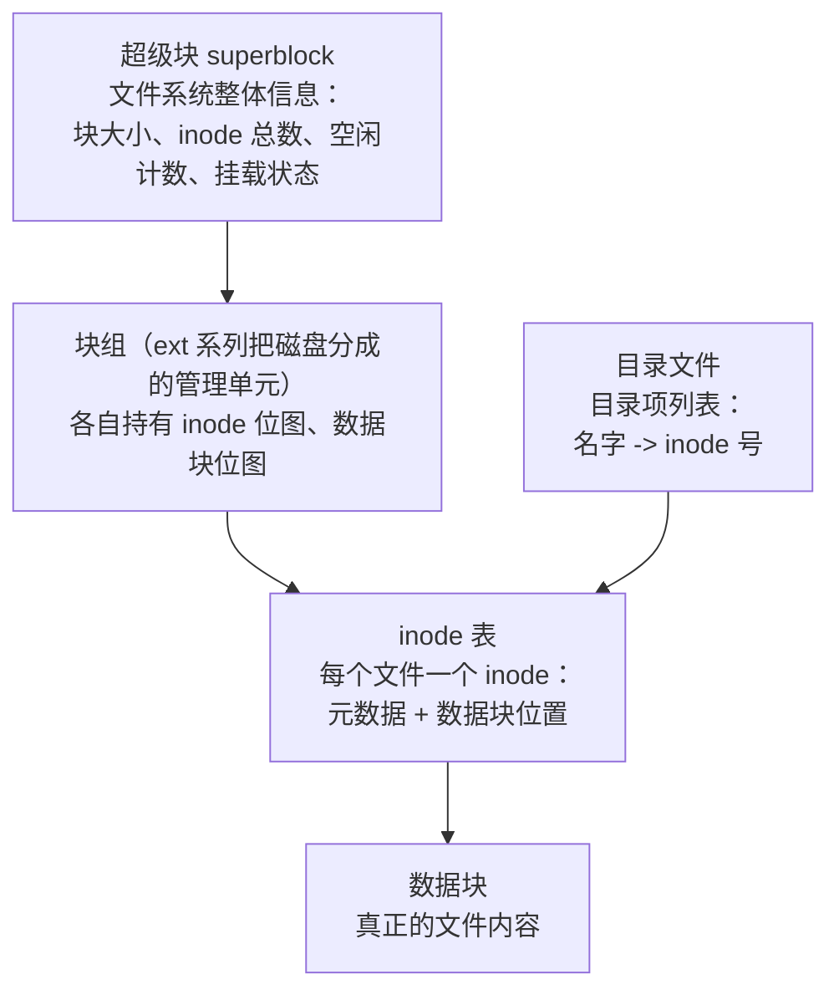

## 前置知识

- 磁盘以块（典型 4KB）为单位读写的常识（见 [磁盘调度](cs-fundamentals/240-DiskScheduling)）；
- 文件与目录的日常使用经验：`ls`、`mv`、`rm`、路径概念；
- 页缓存的基本认识：读文件先查内存缓存（见 [内存分段与分页](cs-fundamentals/210-MemorySegmentationAndPaging)）。

## 学习目标

- 理解"文件名只是别名，inode 才是文件本体"这一 Unix 核心设计；
- 说清 inode 记录哪些元数据、数据块指针如何支持从小文件到超大文件的伸缩；
- 区分超级块、inode、目录项（dentry）三类元数据的职责；
- 用硬链接与软链接的行为差异解释"删除文件"的真正含义。

## 1. 概念引入：户口本与门牌号

一个类比：把磁盘想象成一座城市，每个文件是一个"居民"。管理城市靠的不是记住每户门上挂的牌子（文件名），而是**户口本（inode）**——户籍号唯一、记录了住所位置（数据块）、家庭情况（大小、权限、时间戳）。门牌可以换、可以多家共用一个户口（硬链接），但户口号不变；户口注销，住所才真正腾空。

由此得出 Unix 文件系统的两条铁律：

1. **inode = 文件的全部身份**：除文件名外的一切信息（元数据）与数据块位置都在 inode 里，inode 编号（inode number）在同一文件系统内唯一标识文件。
2. **目录只是"文件名到 inode 编号"的映射表**：目录本身也是一种文件，内容是一串目录项，每项记录"名字 + inode 号"。`mv` 同一文件系统内改名，只是改了目录项里的名字，inode 与数据一动不动——这就是跨盘移动慢、同盘移动瞬间完成的原因。

## 2. inode 的结构与字段

### 2.1 元数据字段

以 ext 类文件系统与 POSIX `stat` 接口为准，inode 记录：

| 字段 | 含义 |
| ---- | ---- |
| inode 编号 | 文件系统内唯一标识 |
| 文件类型 | 普通文件/目录/符号链接/设备文件/套接字等 |
| 权限位与所有者 | rwx 三组权限、UID/GID |
| 大小 | 字节数；目录则为其目录项表大小 |
| 时间戳 | atime（访问）/ mtime（内容修改）/ ctime（inode 变更） |
| 链接计数 link count | 指向此 inode 的目录项个数（硬链接数） |
| 数据块指针 | 指向数据块（或 extent）的定位信息 |

注意 inode **不存文件名**。删除文件（`rm`）的真实语义是：删掉目录项、链接计数减 1；当计数归零且没有进程打开该文件时，内核才回收 inode 与数据块。`lsof | grep deleted` 能看到"已删除但仍被进程持有"的文件——磁盘空间不释放的经典原因。

### 2.2 数据块定位：从直接指针到间接块

经典 ext2/ext3 的 inode 固定大小（如 128/256 字节），用 15 个指针覆盖所有文件尺寸：

```text
指针 0-11   : 直接块指针 —— 12 个块，4KB 块时覆盖 48KB
指针 12     : 一级间接 —— 指向一个"装满指针的块"（4KB / 8B = 512 个指针，再覆盖 2MB）
指针 13     : 二级间接 —— 512 × 512 个指针，覆盖 1GB
指针 14     : 三级间接 —— 512 × 512 × 512 个指针，覆盖 512GB
```

这是一个"小文件便宜、大文件可伸缩"的分级设计：常见的小配置文件一次间接都不需要，读数据只需 1 次额外寻址；超大文件靠多级间接撑起来。代价是文件越大，随机访问头部需要逐级解引用的间接块越多——内核靠缓存间接块来缓解。

### 2.3 亲自动手看 inode

```bash
ls -i hello.txt        # 第一列即 inode 编号
stat hello.txt         # 完整元数据：大小、时间戳、链接数
df -i /                # 每个文件系统的 inode 总量与已用数
```

`stat` 的典型输出（节选）：

```text
  File: hello.txt
  Size: 25          Blocks: 8          IO Block: 4096   regular file
Device: 10301h/66305d   Inode: 1183450     Links: 1
Access: (0644/-rw-r--r--)  Uid: ( 1000/  user)   Gid: ( 1000/  user)
Modify: 2026-08-30 10:00:00.000000000 +0800
```

一个必须知道的运维常识：**inode 是创建文件系统时按容量比例预先分配的**，会被耗尽。磁盘显示有剩余空间但 `touch` 报 `No space left on device`，往往就是海量小文件（缓存碎片、邮件队列）吃光了 inode，用 `df -i` 即可确诊。

## 3. 三类元数据：超级块、inode、目录项



- **超级块（superblock）**：文件系统的"总目录页"，挂载时内核首先读它获取全局参数。ext 系列在多个块组备份超级块，损坏时可从备份恢复。
- **inode**：如上节所述，文件的本体档案。
- **目录项**：磁盘上目录文件的内容，即"名字到 inode 号"的映射。内核在内存中维护 **dentry 缓存（dcache）**，把最近解析过的路径缓存起来——第二次 `cd /usr/local/bin` 几乎不碰磁盘。dentry 还记录父子关系，支撑 `..` 与路径遍历。

一次 `open("/home/user/a.txt")` 的完整寻址过程：逐级查目录项（/ -> home -> user -> a.txt）拿到 inode 号，再从 inode 读出数据块位置——每一步都可能命中 dcache/icache 而免于磁盘 I/O。

## 4. Ext4 的现代化改造

ext2/ext3 的间接指针方案有两个痛点：超大文件需要多级寻址、删除大文件要释放海量块指针。ext4 用 **extent（区段）树**取代了它：

- extent 描述"连续的 N 个数据块"，一个 extent（约 128 字节）可表达最大 128MB 的连续空间（4KB 块时）；
- inode 内嵌 4 个 extent 槽，更大的文件走 extent 树（B 树变体）；
- 对 1GB 的视频文件，旧方案需要成千上万个块指针，ext4 只需个位数 extent——写入、查找、删除都大幅加速，且连续分配天然适合大块顺序 I/O。

ext4 另一项关键设计是**日志（journal）**。一次 `rename` 实际要改多处元数据（目录项、inode），断电时若只写了一半，文件系统会处于不一致状态，老系统开机就得跑漫长的 fsck 全盘扫描。日志的思路来自数据库 WAL（预写日志）：先把"这一步要改什么"记到日志区并落盘，再真正执行；崩溃后重放日志即可恢复一致性。三种模式：

| 模式 | 记录内容 | 性能 | 安全性 |
| ---- | -------- | ---- | ------ |
| journal | 元数据 + 数据 | 最慢 | 最高 |
| ordered（默认） | 仅元数据，数据先于元数据落盘 | 中 | 数据不会出现旧内容 |
| writeback | 仅元数据，数据时序不保证 | 最快 | 崩溃后文件可能含旧垃圾数据 |

## 5. 硬链接与软链接

### 5.1 硬链接：多个名字共享一个 inode

```bash
echo "content" > original.txt
ln original.txt hard.txt        # 创建硬链接
ls -li original.txt hard.txt    # -i 显示 inode
```

输出（两行 inode 编号相同，链接计数为 2）：

```text
1183451 -rw-r--r-- 2 user user 8 ... original.txt
1183451 -rw-r--r-- 2 user user 8 ... hard.txt
```

`ln` 没有复制任何数据，只是新建了一个指向同一 inode 的目录项，并把链接计数加 1。`rm original.txt` 只删一个名字，计数降到 1，`hard.txt` 照常读出全部内容——**只要还有一个名字存在，数据就活着**。这也解释了硬链接的限制：不能跨文件系统（inode 号只在单文件系统内有意义），不能对目录创建（会造出环，破坏树的遍历）。

### 5.2 软链接（符号链接）：存路径的独立文件

```bash
ln -s original.txt soft.txt
ls -li original.txt soft.txt
```

输出（soft.txt 是独立 inode，类型为 l）：

```text
1183451 -rw-r--r-- 1 user user 8 ... original.txt
1183512 lrwxrwxrwx 1 user user 12 ... soft.txt -> original.txt
```

软链接是类型为"符号链接"的独立文件，内容就是目标路径字符串（12 字节即 `original.txt`）。访问它时内核按路径重新解析，因此：可以跨文件系统、可以指向目录；但目标被删后成为**悬空链接**（dangling link），访问报 `No such file or directory`。对比表：

| 维度 | 硬链接 | 软链接 |
| ---- | ------ | ------ |
| 本质 | 同一 inode 的另一个名字 | 存储目标路径的独立文件 |
| 跨文件系统 | 不可以 | 可以 |
| 指向目录 | 不可以 | 可以 |
| 原文件删除后 | 数据仍然可访问 | 变成悬空链接 |

工程上：版本控制与构建工具大量依赖符号链接（如 `node_modules/.bin`）；备份数据则要小心 `cp` 默认复制软链接的目标，需要 `cp -P` 或 `tar -h` 的语义辨析。

## 6. 常见陷阱与调试

- **"cp 之后 mv 覆盖， inode 就变了"**：`mv` 跨文件系统时实际是复制 + 删除，会产生新 inode；而打开中的旧文件句柄继续指向旧 inode——日志轮转（logrotate）必须通知进程重开文件或使用 `truncate`，否则磁盘被"隐形"旧文件占满。
- **把链接计数当成目录深度**：目录的链接计数 = 2 + 子目录数（`.` 与父目录中的条目），`ls -l` 中目录显示 2 之外还有 1 是正常现象，不代表有隐藏文件。
- **混淆 mtime 与 ctime**：ctime 是 inode 变更时间（改名、改权限也会更新），不是"创建时间"；statx 才暴露真正的创建时间（birth time），且依赖文件系统支持。
- **符号链接相对路径的坑**：软链接内容里的相对路径是相对**链接所在目录**解析的，不是相对当前工作目录；移动软链接而不改目标路径是常见翻车点。
- **inode 耗尽的监控**：`df -i` 应纳入监控；容器镜像层的海量小文件是典型耗尽场景。

## 7. 实战场景

- **安全审计**：`find / -nouser` 找无主文件、用 inode 判断文件是否被替换（对比备份的 inode 号与 ctime）；入侵者常用"改时间戳"伪装，但 inode 号通常无法保持。
- **性能排查**：`df -i` 与 `df -h` 双查；`filefrag` 查看文件碎片化程度（extent 是否连续），碎片严重的虚拟机镜像应整理或重建。
- **恢复误删**：链接计数归零后数据块并未立即擦除，`debugfs`/`extundelete` 类工具趁块未被复用前抢救——所以误删后第一件事是尽快让该分区只读。
- **与页缓存的衔接**：读文件时内核按页缓存文件内容（基于 inode 与偏移），[页面置换算法](cs-fundamentals/220-PageReplacementAlgorithm) 决定哪些文件页被淘汰；这也是"读两次第二次快"的原因。

## 小结

初学者要点：

- inode 是文件的本体档案：元数据加数据块位置；文件名只是目录项里的别名，`mv` 改名不动数据。
- 三类元数据各司其职：超级块管全局、inode 管单个文件、目录项管"名字到 inode"的映射。
- 硬链接是同一 inode 的多个名字（删一个名字文件还在）；软链接是存路径的独立文件（目标删了就悬空）。

进阶注意：

- inode 数量在格式化时预定，海量小文件会"有空间却建不了文件"，用 `df -i` 诊断。
- 删除的真实语义是"目录项移除 + 链接计数减 1"；进程持有句柄时空间不释放，是磁盘莫名占满的头号原因。
- ext4 的 extent 树与日志（默认 ordered 模式）分别解决间接指针的性能问题与崩溃一致性问题；理解这两点即可迁移到 XFS/Btrfs 等现代文件系统的设计。
