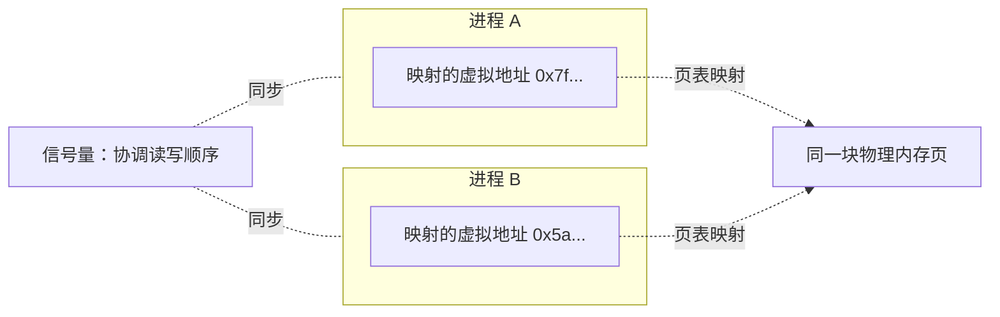

## 前置知识

- 进程拥有独立虚拟地址空间的事实（见 [内存分段与分页](cs-fundamentals/210-MemorySegmentationAndPaging)）——A 进程的指针在 B 进程里毫无意义，这正是 IPC 存在的根源；
- 文件描述符（fd）的概念：Linux 中一切 I/O 资源都用整数 fd 表示；
- fork 创建子进程后子进程继承父进程打开的 fd。

## 学习目标

- 理解"地址空间隔离"为什么导致进程必须借内核之手通信；
- 掌握管道（匿名/命名）、信号、System V IPC（消息队列、共享内存、信号量）、Socket 五类机制的数据通路与同步语义；
- 能根据数据量、实时性、复杂度选出合适的 IPC 方式；
- 亲手用管道与共享内存写出可运行的 C 程序。

## 1. 概念引入：分居两栋楼的室友

一个类比：两个室友被分进两栋互不相通的楼（进程地址空间隔离），想传递消息只能：

- 塞纸条进走廊的**传送管**，顺着管子按顺序到达——这是**管道**；
- 往公共传达室的黑板（**共享内存**）上写字，两人都能直接看到，最快，但得约好"我写完之前你别读"（信号量同步）；
- 扯着嗓子喊一声"该你值日了！"，打断对方正在做的事——这是**信号**；
- 去传达室登记一个**有编号的信箱**，按信件（消息）为单位收发——这是**消息队列**；
- 或者干脆打电话，连别的城市（其他机器）都能打——这是**套接字（Socket）**。

> 类比失真提示：管道是字节流而非"纸条"，没有消息边界；信箱里的消息队列则保边界。这个差异后文会反复出现。

所有 IPC 的共同点：**数据通路必须经过内核**（共享内存特殊，内核只负责"架桥"，数据本身不复制进内核）。

## 2. 管道：最古老的 IPC

### 2.1 匿名管道

`pipe()` 创建一个单向字节流通道，返回一对 fd：`fd[0]` 读端、`fd[1]` 写端。匿名管道的两个关键性质：

1. **只用于有血缘关系的进程**：管道本身没有名字，靠 fork 让子进程继承这对 fd 才能共享；
2. **半双工**：一个管道只能单向流动，双向通信要建两个管道。


行为细节：缓冲区满则写端阻塞；缓冲区空则读端阻塞；**写端全部关闭后**，读端读到 0（EOF）；读端全部关闭后，写端写入会触发 `SIGPIPE` 信号（默认终止进程）——`ls | head` 就依赖这一机制优雅终止 `ls`。

你在 shell 里每天用的竖线就是匿名管道：`cat access.log | grep 404 | wc -l` 创建了两个管道、三个进程。

### 2.2 命名管道 FIFO

`mkfifo` 给管道一个文件系统路径名，**无血缘关系的进程**可以按路径打开它，读写语义与匿名管道一致。

```bash
# 终端 1：创建并监听命名管道（读端会阻塞直到有写者）
mkfifo /tmp/log_pipe
cat /tmp/log_pipe

# 终端 2：向管道写入
echo "hello fifo" > /tmp/log_pipe
```

终端 1 输出 `hello fifo`。命名管道常用于 shell 脚本中串接无亲缘的命令，或作为简单的事件通知通道。

## 3.信号：异步的"打断"

信号（signal）是**发往进程的异步通知**，本质是一个编号（1-31 与实时信号），不携带数据（除实时信号可带一个整数）。它的模型是"中断的软件版"（见 [中断与系统调用](cs-fundamentals/190-InterruptAndSystemCall)）。

常用信号：

| 信号 | 编号 | 含义 | 能否被捕获/忽略 |
| ---- | ---- | ---- | ---- |
| SIGHUP | 1 | 终端挂断（常用于 daemon 重载配置） | 可以 |
| SIGINT | 2 | Ctrl+C 中断 | 可以 |
| SIGKILL | 9 | 强制终止 | **不可以** |
| SIGSEGV | 11 | 访问非法内存（段错误） | 可以（用于打印崩溃现场） |
| SIGTERM | 15 | 请求优雅退出（`kill` 默认） | 可以 |
| SIGSTOP / SIGCONT | 19 / 18 | 暂停 / 继续进程 | **不可以**（STOP/CONT） |

处理方式三种：默认动作（多为终止）、忽略、自定义处理函数。内核在目标进程"即将从内核态返回用户态"的时机投递信号，所以信号是**异步且低频**的，处理函数里只能调用异步信号安全函数。

## 4. System V IPC：消息队列、共享内存、信号量

### 4.1 消息队列

内核中一个按消息为单位收发的**链表**：`msgget` 创建（拥有一个系统级 key），`msgsnd`/`msgrcv` 收发。与管道相比：消息有类型和边界，可按类型选择性接收，且生命周期不随进程——进程退出后队列仍在，直到显式删除或系统重启。

### 4.2 共享内存：最快的 IPC

管道和消息队列每传一次数据都要"用户态 -> 内核 -> 用户态"两次拷贝；共享内存则由内核把**同一块物理内存映射进两个进程的地址空间**，之后读写就是普通内存访问，零次数据拷贝、零次系统调用。

代价是内核完全不提供同步：两个进程像多线程一样面临竞态，必须自己配合信号量或互斥锁使用。这也是"最快"与"最麻烦"的辩证关系。



注意两个进程看到的虚拟地址可以不同——共享的是物理页，不是虚拟地址。

### 4.3 信号量

System V 信号量（`semget`/`semop`）是内核维护的计数器，配合 P（减 1，可能阻塞）/V（加 1，可能唤醒）操作，用 protect 共享内存这类"可写公共区"的访问，也可实现生产者-消费者计数。严格说它不传数据，只是同步原语，但惯例上与共享内存成对出现，故归入 IPC 家族。

## 5. Socket：唯一的跨机 IPC

套接字在 IPC 家族中独树一帜：

- **Unix 域套接字**（`AF_UNIX`）：基于文件系统路径（如 `/var/run/docker.sock`），仅限本机，但走内核完整协议栈路径之外的高效通路，性能远高于回环网络，还支持传递 fd（`SCM_RIGHTS`）。Docker CLI 与守护进程、数据库本地连接都靠它。
- **网络套接字**（`AF_INET`/`AF_INET6`）：同一套 API 通信范围扩展到全网，是唯一的跨机 IPC（细节见 [TCP](cs-fundamentals/310-TCPMessageFraming) 与 [TCP 控制](cs-fundamentals/300-TCPControl)）。

"同一套 API 既管本机又管网络"是 Socket 设计最成功的地方。

## 6. 完整示例：管道与共享内存

```c
/* pipe_demo.c：父子进程通过匿名管道通信 */
#include <stdio.h>
#include <string.h>
#include <unistd.h>

int main(void) {
    int fd[2];
    if (pipe(fd) == -1) {          /* fd[0] 读端, fd[1] 写端 */
        perror("pipe");
        return 1;
    }
    pid_t pid = fork();
    if (pid == 0) {                /* 子进程：继承管道 fd，当读者 */
        close(fd[1]);              /* 用不到写端，尽早关闭避免 EOF 判断失真 */
        char buf[64];
        ssize_t n = read(fd[0], buf, sizeof(buf) - 1);  /* 阻塞直到有数据 */
        buf[n] = '\0';
        printf("子进程收到: %s\n", buf);
        close(fd[0]);
        return 0;
    }
    close(fd[0]);                  /* 父进程只写 */
    const char *msg = "hello from parent";
    write(fd[1], msg, strlen(msg));
    close(fd[1]);                  /* 关闭写端，读端之后会读到 EOF */
    return 0;
}
```

编译运行：`gcc pipe_demo.c -o pipe_demo && ./pipe_demo`，输出：

```text
子进程收到: hello from parent
```

再演示共享内存 + 信号量的"零拷贝"通道（Linux，System V 接口）：

```c
/* shm_demo.c：写进程把字符串放进共享内存，读进程直接读取 */
#include <stdio.h>
#include <string.h>
#include <sys/ipc.h>
#include <sys/shm.h>
#include <sys/sem.h>
#include <unistd.h>

int main(int argc, char **argv) {
    key_t key = 0x1234;
    int shmid = shmget(key, 4096, IPC_CREAT | 0666);   /* 创建/获取 4KB 共享段 */
    char *addr = (char *)shmat(shmid, NULL, 0);        /* 映射进本进程地址空间 */
    int semid = semget(key, 1, IPC_CREAT | 0666);      /* 一个信号量做握手 */
    if (argc > 1 && argv[1][0] == 'w') {               /* 写者：写入并通知 */
        semctl(semid, 0, SETVAL, 0);                   /* 初值 0：数据未就绪 */
        strcpy(addr, "shared memory says hi");
        struct sembuf v = {0, +1, 0};                  /* V 操作：就绪信号 */
        semop(semid, &v, 1);
        printf("写者：数据已放入共享内存\n");
    } else {                                           /* 读者：等待并读取 */
        struct sembuf p = {0, -1, 0};                  /* P 操作：等就绪 */
        semop(semid, &p, 1);
        printf("读者读到: %s\n", addr);
        shmctl(shmid, IPC_RMID, NULL);                 /* 删除共享段 */
        semctl(semid, 0, IPC_RMID);
    }
    return 0;
}
```

先运行 `./shm_demo w` 再运行 `./shm_demo r`，第二个终端输出：

```text
读者读到: shared memory says hi
```

`ipcs -m` 可以查看系统中所有共享内存段及其附属进程数。

## 7. 机制对比与选型

| 机制 | 速度 | 数据边界 | 同步开销 | 跨机 | 典型场景 |
| ---- | ---- | -------- | -------- | ---- | -------- |
| 匿名管道 | 中 | 字节流（无边界） | 自带阻塞语义 | 否 | shell 命令串联、父子进程 |
| 命名管道 | 中 | 字节流 | 同上 | 否 | 无亲缘进程的简单通道 |
| 消息队列 | 中 | 消息（有边界） | 内核保证 | 否 | 小消息、离线堆积 |
| 共享内存 + 信号量 | **最快**（零拷贝） | 无（纯内存） | 需自建 | 否 | 大数据量高频交互（音视频帧、行情） |
| 信号 | 高（仅一个编号） | 无 | 异步打断 | 否 | 生命周期管理、事件通知 |
| Unix 域套接字 | 中高 | 字节流/数据报 | 协议语义 | 否（可传 fd） | 本机服务间调用（docker、X11） |
| 网络套接字 | 低（相对） | 流/报文 | 协议语义 | **是** | 跨机通信 |

## 8. 常见陷阱与调试

- **SIGPIPE 击杀进程**：往已无读者的管道/套接字写数据，进程默认被 SIGPIPE 终止。长期运行的服务几乎都会 `signal(SIGPIPE, SIG_IGN)` 忽略它，改用 `write` 的返回值 `EPIPE` 判断。
- **管道忘记关读端导致写端挂死**：所有读端 fd（含 fork 继承的副本）都关闭后 EOF 才会出现。多进程共享管道时，某一路径忘 `close` 会让另一端永远阻塞。
- **共享内存裸奔**：只写 `shmat` 不加同步，读者可能读到写了一半的数据。共享内存必须配对互斥手段，信号量、文件锁或 POSIX `pthread_mutex`（设 `PTHREAD_PROCESS_SHARED`）皆可。
- **System V IPC 资源泄漏**：进程异常退出不会回收消息队列/共享内存，需 `ipcrm` 手工清理；排查入口是 `ipcs`。
- **信号处理函数里调用了不可重入函数**：在 handler 里调用 `printf`、`malloc` 可能死锁。原则：handler 只设置 `volatile sig_atomic_t` 标志，实际处理留给主循环。

## 9. 实战场景

- **微服务本机通信**：Nginx 与 FastCGI 进程、gVisor 等沙箱组件普遍用 Unix 域套接字，省去 TCP 回环的协议栈开销。
- **大数据管道**：日志采集（如 `nginx -> pipe -> 分析脚本`）用管道串联；高频行情/音视频帧用共享内存环形缓冲区。
- **优雅退出**：`kill -TERM` 触发服务清理逻辑，K8s 停止容器前发送的正是 SIGTERM；直接 SIGKILL 会让数据丢失。

## 小结

初学者要点：

- 进程地址空间隔离是 IPC 存在的原因：进程之间传数据必须借内核架桥，或由内核映射共享页。
- 管道是单向字节流，匿名管道靠 fork 共享，命名管道靠路径名共享；Socket 唯一支持跨机。
- 信号是"通知"不是"传数据"，只表达"发生了某事"。

进阶注意：

- 共享内存是最快也是唯一零数据拷贝的 IPC，但同步责任完全转移到应用；没有同步的共享内存等于数据竞争。
- 字节流型 IPC（管道、流套接字）天然无消息边界，应用层必须自行定义消息格式，这一约束与 TCP 粘包问题同源。
- 选型经验法则：高频大块数据选共享内存，通用服务间通信选 Unix 域套接字，简单命令串联选管道，跨机直接上网络套接字。
