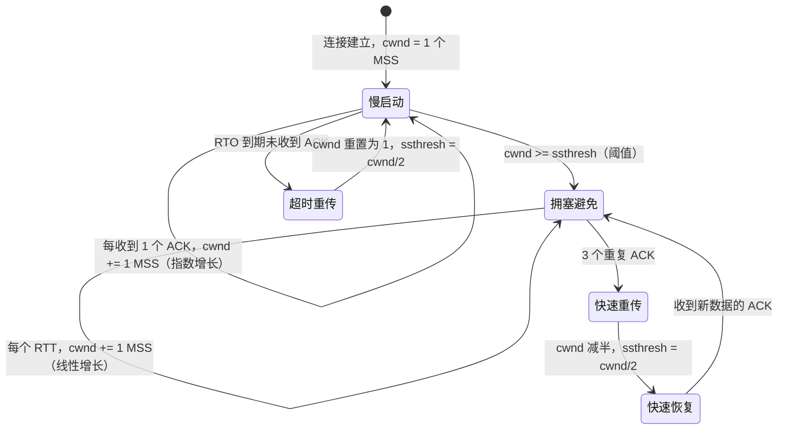

## 前置知识

- TCP 三次握手、确认号与序列号机制（见 [计算机网络](cs-fundamentals/270-ComputerNetwork)）；
- 滑动窗口与流量控制的基本概念；
- RTT（往返时延）、MSS（最大报文段长度）等术语。

## 学习目标

- 说清流量控制与拥塞控制的区别：一个保护接收方，一个保护网络；
- 描述 Reno 算法四阶段（慢启动、拥塞避免、快速重传、快速恢复）的完整状态机；
- 理解经典算法"把丢包当拥塞信号"的局限与 BBR 的建模思路；
- 会用 `ss -i` 观察真实连接的 cwnd 与重传行为。

## 1. 概念引入：高速公路堵车的两种原因

想象一条高速公路（网络），你的车队（数据包）要从 A 城开到 B 城：

- **收件人车库太小**（接收方缓冲区有限）——车到了也停不下。解决它的是**流量控制**：B 城随时广播"我还有几个空车位"（接收窗口 rwnd），A 域据此控制发车节奏。
- **高速公路本身堵死**（路由器队列溢出）——车在中途被丢弃（丢包）。解决它的是**拥塞控制**：发送方自己探测网络能承受多少车，主动克制。

两个窗口同时起作用，发送方真正能发出的数据量由二者取小：

```text
可发送量 = min(接收窗口 rwnd, 拥塞窗口 cwnd)
```

拥塞窗口 cwnd（congestion window）是发送方维护的**内部状态**，不随报文传输，纯靠算法在本地推算——这是 TCP 设计中最优雅的部分之一。

## 2. 为什么不能"一开始就全速发送"

假设一条 10Gbps 链路上有 100 条新连接同时启动，若每条都按最大速率发包，所有路由器队列瞬间溢出，大量数据包同时被丢弃，各发送方同时重传、再次溢出——**拥塞崩溃（congestion collapse）**。1986 年 LBL 到 UC Berkeley 的链路曾因此从 32Kbps 跌到 40bps，直接催生了 Jacobson 的慢启动算法（1988）。

核心思想：**用丢包作为网络拥塞的信号，从保守速率出发探测网络的承受能力，并在拥塞时快速退让**。

## 3. Reno：经典四阶段状态机



### 3.1 慢启动（Slow Start）

初始 cwnd 很小（Linux 默认 `initcwnd` = 10 个 MSS，由 RFC 6928 建议），每收到一个 ACK 就把 cwnd 加 1，效果是**每个 RTT 翻一倍**的指数增长。名字里的"慢"是相对"不控制"而言——实际增长非常快，几轮 RTT 就能冲到几百 MSS。

### 3.2 拥塞避免（Congestion Avoidance）

cwnd 达到慢启动阈值 ssthresh 后转为线性增长：每个 RTT 只加 1 个 MSS。设计意图是"已经接近网络极限，小心翼翼地继续探顶"。

### 3.3 丢包的两种形态与两种反应

| 信号 | 含义 | Reno 的反应 |
| ---- | ---- | ----------- |
| 3 个重复 ACK（快速重传） | 个别包丢失，后续包仍能到达 => 网络还活着 | ssthresh = cwnd/2，cwnd 减半后进入快速恢复 |
| RTO 超时 | 连 ACK 都收不到 => 网络严重拥塞 | 最严厉：cwnd 直接打回 1，重新慢启动 |

快速重传的原理：接收方收到失序报文时会重复确认最后一个按序到达的字节，发送方收到 3 个重复 ACK 即可断定中间那个包丢了，无需干等超时。

### 3.4 快速恢复（Fast Recovery）

减半后不从头再来：发送方继续用重复 ACK 流动推测"丢的包之后的数据已被接收方缓存"，当收到确认最新数据的新 ACK 时，把 cwnd 恢复到减半后的水平，直接进入拥塞避免。整个突发只损失半个窗口的发送能力。

### 3.5 一条曲线看全程

```text
cwnd
 ^
 |                 /|        /|        /|
 |                / |      / |      / |        <- 线性探顶（拥塞避免）
 |               /  |    /  |    /  |
 |          ___/    |  /    |  /    |
 |         /        |/     |/     |          <- 减半（快速恢复）
 |    |  /                     
 |    | /   <- 指数增长（慢启动）    时间 (RTT) ->
 |    |/                                             
 +------------------------------------------------->
      ^ ssthresh 到达，转入线性
```

## 4. Reno 之后：CUBIC 与 BBR

### 4.1 经典算法的"带宽时延积"困境

Reno 把丢包当拥塞信号，隐含假设"缓冲区没满就不会丢、满了才丢"。当链路带宽时延积（BDP = 带宽 × RTT）很大（跨洋链路动辄几十 MB），Reno 的线性增长要爬非常久才能填满管道；而在浅缓冲路由器上，队列稍有积压就丢包，cwnd 永远爬不上去。这就是长肥网络（LFN）与缓冲区膨胀（bufferbloat）两类问题的根源。

### 4.2 CUBIC：以时间函数替代线性爬坡

Linux 自 2.6.19 起的默认算法。cwnd 作为**距上次丢包的时间**的三次函数增长：丢包后先快速回落，随后增长速度先快、中段放缓、再逐渐加快（三次曲线）。相比 Reno 的线性，CUBIC 在高 BDP 网络中恢复管道的速度快得多，同时对 RTT 不公平性的处理也更友好。

### 4.3 BBR：不猜丢包，直接测带宽与 RTT

Google 2016 年提出（BBRv2/v3 持续演进），核心转变：**拥塞不是丢包，而是排队**。BBR 持续估计两个量：

- BtlBw：瓶颈链路的瓶颈带宽（用"一段时间内的最大投递速率"估计）；
- RTprop：瓶颈传播时延（用"一段时间内的最小 RTT"估计）。

BDP = BtlBw × RTprop，cwnd 就被控制在略高于 BDP 的水平，让队列几乎不积压。效果：在不丢包就大量排队的浅缓冲网络上吞吐更高、延迟更低；代价是与基于丢包的算法共存时可能"抢不过"（BBRv2 加入了对这一公平性的修正）。

| 算法 | 拥塞信号 | 典型强项 |
| ---- | -------- | -------- |
| Reno | 丢包（超时/重复 ACK） | 教科书基准、低 BDP 网络 |
| CUBIC | 丢包 | Linux 默认，高 BDP 下恢复快 |
| BBR | 测量的带宽与时延 | 高延迟链路、浅缓冲、直播与长连接 |

查看与切换（Linux）：

```bash
sysctl net.ipv4.tcp_congestion_control   # 查看当前算法（常见值 cubic / bbr）
sysctl -w net.ipv4.tcp_congestion_control=bbr   # 临时切换为 BBR
```

## 5. 完整示例：观察一条真实连接的 cwnd

用 `ss -tin` 直接读取内核为每条 TCP 连接维护的状态：

```bash
# 与远端建立一条大流量连接后（如 iperf3 -c <server>），观察发送端：
ss -tin dst <server_ip>
```

典型输出（节选）：

```text
cubic wscale:7,7 rto:204 rtt:1.5/0.7 ato:40 mss:1448 ...
cwnd:230 bytes_acked:14201234 bytes_acked_after_last_rto:...
retrans:0/12 retrans_rate:0.001 ...
```

字段解读：

- `rtt:1.5/0.7`：平均 RTT 1.5ms，偏差 0.7ms（RTO 由它推算）；
- `cwnd:230`：当前拥塞窗口为 230 个 MSS；
- `retrans:0/12`：累计重传 12 段，当前在途重传 0。

配合 `tcpdump -i any host <server_ip> -w trace.pcap` 抓包，再用 Wireshark 的 "Statistics > TCP Stream Graphs > Time Sequence" 能直接画出上面第 3 节那条锯齿形 cwnd 曲线——教科书图示在真实网络中的样子。

## 6. 常见陷阱与调试

- **把重传都归咎于网络差**：先分清 RTO 重传（严重）与快速重传（轻微）；大量 RTO 往往是接收方处理不过来或中间设备丢包，而偶发快速重传在公网上属正常。
- **短连接永远吃不满带宽**：慢启动决定了连接前几个 RTT 只能低速爬坡，跨国 RTT 100ms 的链路爬满 BDP 可能需要十几轮 RTT。这就是 CDN（就近接入降低 RTT）与长连接复用（摊薄慢启动成本）的经济学基础。
- **误调接收缓冲区来解决拥塞**：`tcp_rmem/tcp_wmem` 影响的是流量控制上限；带宽上不去时先看 cwnd 与 RTT，盲目放大缓冲只会加剧 bufferbloat。
- **混淆 cwnd 与 rwnd**：`ss` 输出里的 `notsent` 与对端通告窗口反映 rwnd；cwnd 不直接可见，只能通过 `ss -i` 的估算字段或抓包推断。

## 7. 实战场景

- **QUIC 的拥塞控制**：QUIC 把拥塞控制从内核搬到用户空间实现，默认算法同样是 CUBIC/BBR 一族，但可以随应用升级快速迭代（见 [QUIC 协议](cs-fundamentals/370-QUIC)）。
- **视频会议与直播**：对延迟极敏感，常选 BBR 或应用层自带的 GCC/BBR 变体，避免队列积压带来的延迟抖动。
- **大文件跨洋传输**：优先考虑开启 BBR 或增大初始 cwnd（`ip route change ... initcwnd`），配合多连接并行摊薄慢启动时间。

## 小结

初学者要点：

- 流量控制保护接收方（rwnd），拥塞控制保护网络（cwnd），发送速率取二者最小值。
- Reno 四阶段：慢启动（指数）、拥塞避免（线性）、快速重传（3 个重复 ACK）、快速恢复（减半续跑）；超时是最严厉信号（cwnd 打回 1）。
- 丢包是经典算法的拥塞信号；CUBIC 用三次曲线加速恢复，BBR 改为直接测量带宽与最小时延。

进阶注意：

- 慢启动决定了短连接与高 RTT 链路的性能天花板，CDN、连接复用、initcwnd 调优都由此展开。
- bufferbloat 与长肥网络是理解"为什么 Reno 不够用"的两个关键现象。
- Linux 下 `ss -i` + Wireshark 时序图是观测 cwnd 行为的标准工具组合；切换算法用 `tcp_congestion_control`，但共享链路公平性需谨慎评估。
