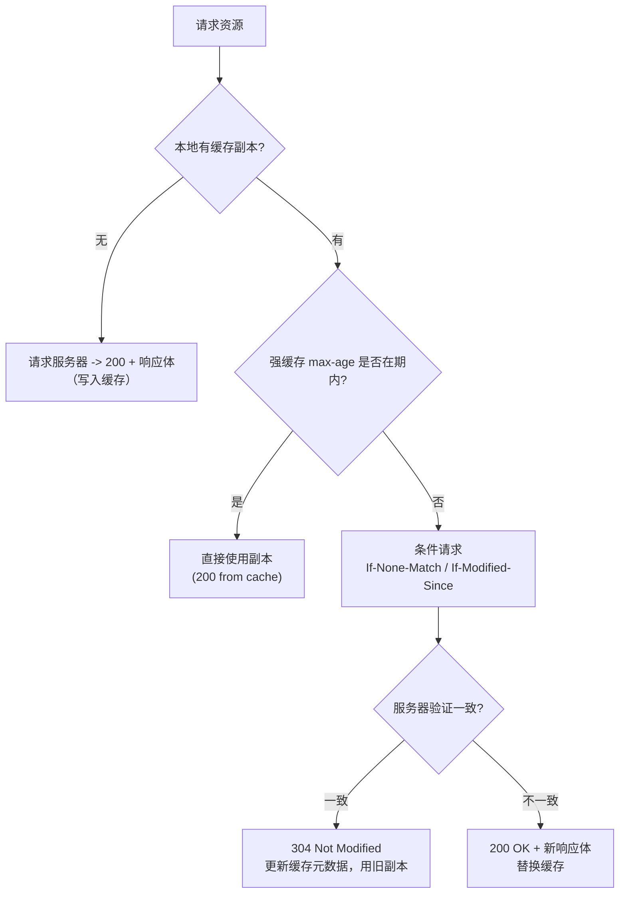

## 前置知识

- HTTP 请求/响应的基本结构：方法、状态码、响应头；
- 浏览器与服务器之间的往返成本：一次 RTT 通常数十毫秒，静态资源体积动辄数百 KB；
- CDN 也是 HTTP 缓存的一种（见 [CDN 原理](cs-fundamentals/350-CDNPrinciple)），本文聚焦浏览器侧语义。

## 学习目标

- 区分强缓存与协商缓存：谁判定、要不要发请求、返回什么状态码；
- 掌握 `Cache-Control` 全部高频指令与 `Expires` 的时钟偏差缺陷；
- 理解 `ETag` / `Last-Modified` 两套验证器的生成方式、优先级与坑；
- 会设计"HTML 不缓存 + 带哈希的静态资源长缓存"这一工业标准方案。

## 1. 概念引入：公司楼下便利店

一个类比：你要喝一瓶水（资源），三种获取方式的成本天差地别——

1. 工位抽屉里有一瓶没过保质期的（**强缓存命中**）：零成本，根本不用出门；
2. 抽屉里的过期了，拿去便利店问"有没有新货"（**协商缓存**）：跑一趟，但店员看了一眼说"还是这个批次"（`304 Not Modified`），你空手回来用旧的——付了一次往返，没付运费（不下载响应体）；
3. 什么都没有（**未命中**）：去工厂（源站）进货，完整下载（`200 OK`）。

HTTP 缓存的全部设计就是让尽量多的请求落在第 1、2 类。理解了"本地判定"与"往返验证"的分野，所有头字段都是围绕这两个阶段的参数。

## 2. 强缓存：不发请求的判定

强缓存由**浏览器（缓存方）本地判定**，命中时连网络请求都不发出。DevTools 的 Network 面板里表现为 `(from disk cache)` 或 `(from memory cache)`，状态码仍显示 200。

### 2.1 Cache-Control：现代标准

HTTP/1.1 引入，相对时间语义，优先级高于 `Expires`。常用指令：

```text
Cache-Control: max-age=31536000, public, immutable
```

| 指令 | 作用 |
| ---- | ---- |
| `max-age=N` | 响应可被直接复用的秒数，从响应到达时刻起算 |
| `no-cache` | **可以缓存**，但每次使用前必须协商验证（名字极有误导性） |
| `no-store` | 彻底不缓存，任何副本都不许留（隐私数据、验证码） |
| `private` | 只允许浏览器缓存，中间代理/CDN 不得存储（含用户数据的响应必带） |
| `public` | 允许任何中间层缓存 |
| `immutable` | 告诉浏览器：资源永不变，即便强缓存过期也不用发起协商（配合内容哈希文件名） |
| `must-revalidate` | 过期后必须验证，禁止使用陈旧副本 |
| `s-maxage=N` | 仅对共享缓存（CDN/代理）生效，优先于 `max-age` |

### 2.2 Expires：历史遗留

`Expires: Wed, 09 Sep 2026 08:00:00 GMT` 是 HTTP/1.0 的绝对时间。缺陷明显：它依赖客户端时钟，本机时间偏差几分钟，缓存判定就完全失真。现代开发中只作为 `Cache-Control` 的兼容回退书写，判定时若两者同时存在，`max-age` 胜出。

## 3. 协商缓存：带着问题去验证

强缓存过期后，浏览器**发一个条件请求**问服务器"我这份还能用吗"。服务器对比后要么回 `304 Not Modified`（空响应体，浏览器更新缓存元数据继续用），要么回 `200 OK`（资源确实变了，返回新内容）。两套验证器并存：

### 3.1 Last-Modified / If-Modified-Since

首次响应带 `Last-Modified: Wed, 01 Sep 2026 10:00:00 GMT`（文件最后修改时间）；后续请求带 `If-Modified-Since` 回传该值。服务器比较文件 mtime：

- 未变 -> `304`；
- 变了 -> `200` + 新响应。

局限：只能精确到秒，1 秒内多次修改无法感知；mtime 变了但内容没变（如 `touch`）会白白失效缓存；集群多机文件 mtime 不一致时会造成判断摇摆。

### 3.2 ETag / If-None-Match

`ETag` 是服务器为资源生成的**内容指纹**（如 nginx 的 `mtime-大小`、Inode 变体，或应用层的内容哈希）。请求时以 `If-None-Match: "abc123"` 回传。ETag 优先级高于 Last-Modified：两者都在时，服务器以 If-None-Match 为准。



这张图是 HTTP 缓存的主干流程，值得背下来：**先强缓存，过期再协商**。

### 3.3 Vary：协商的前置开关

`Vary: Accept-Encoding, User-Agent` 告诉缓存：即使 URL 相同，只要这些请求头的值不同，就是**不同的缓存条目**。最常见的 `Vary: Accept-Encoding` 区分 gzip/br 压缩版本。缺了它，代理可能把压缩版发给不支持压缩的客户端；滥用 `Vary: User-Agent` 则会把缓存切得粉碎，命中率崩塌。

## 4. 完整示例：动手观察缓存

用 curl 观察一个真实响应的缓存头：

```bash
curl -sI https://example.com/app.9f8e7d.js
```

典型输出：

```text
HTTP/1.1 200 OK
Cache-Control: public, max-age=31536000, immutable
ETag: "9f8e7d-3a2b"
Last-Modified: Mon, 07 Sep 2026 02:10:33 GMT
Vary: Accept-Encoding
```

再模拟协商缓存——把 ETag 回传给服务器：

```bash
curl -sI -H 'If-None-Match: "9f8e7d-3a2b"' https://example.com/app.9f8e7d.js
```

输出：

```text
HTTP/1.1 304 Not Modified
```

服务器确认指纹一致，返回空体的 304。浏览器 DevTools 里强制刷新（Ctrl+F5）时带的是 `Cache-Control: no-cache`，因此每次都拿到 200；普通刷新（F5）会给请求附加条件头，强缓存被绕过但协商缓存生效；而地址栏回车或页面内跳转，强缓存照常命中。测试时若"改了代码却看不到效果"，先想清楚自己触发的是哪种刷新。

一个最小验证脚本（Node.js）演示 304 的判定：

```js
// etag-server.js：最小 ETag 协商缓存服务器
const http = require('http');
const crypto = require('crypto');

const body = 'Hello, cache!';
const etag = `"${crypto.createHash('md5').update(body).digest('hex')}"`; // 内容指纹

http.createServer((req, res) => {
  // 客户端回传的 If-None-Match 与当前指纹一致 -> 304
  if (req.headers['if-none-match'] === etag) {
    res.writeHead(304, { ETag: etag });
    return res.end();
  }
  res.writeHead(200, { 'Content-Type': 'text/plain', ETag: etag });
  res.end(body);
}).listen(3000);
```

连续请求两次：

```bash
curl -si http://localhost:3000/ | head -1   # 输出 HTTP/1.1 200 OK
curl -si http://localhost:3000/ | head -1   # 输出 HTTP/1.1 304 Not Modified
```

## 5. 工业级缓存策略：HTML 与静态资源分工

现代前端构建的标准组合拳：

| 资源 | 策略 | 理由 |
| ---- | ---- | ---- |
| `index.html` | `no-cache`（每次协商） | 是引用入口，必须最先拿到最新版本 |
| `app.9f8e7d.js` 等带哈希资源 | `max-age=31536000, immutable` | 文件名即内容哈希，内容变则名字变，旧缓存天然作废 |
| API 响应 | 视业务：`no-store`（用户数据）或短 `max-age` | 服务端语义多样，默认不缓存最安全 |

要点：**缓存的粒度锚定在 URL 上**。"改内容"转化为"改 URL（换哈希文件名）"，从而把"长强缓存"与"及时更新"这对矛盾同时满足。反向操作（对同一个 `app.js` 只改内容不改名）无论怎么调 max-age 都会在"更新及时"与"命中率"之间顾此失彼。

## 6. 常见陷阱与调试

- **把 `no-cache` 当 `no-store` 用**：`no-cache` 仍走缓存路径只是强制协商；真正禁缓存必须 `no-store`。在登录态接口上误配 `no-cache`，代理可能仍存下含个人信息的副本。
- **集群 ETag 不一致**：nginx 默认 ETag 由 mtime + Content-Length 生成，多机部署若文件上传时间不同，同一资源的 ETag 各机不同，协商缓存命中率随机波动。要么保证发布时 mtime 一致，要么让 ETag 只含内容哈希，或关掉 ETag 只用 Last-Modified。
- **缓存了不该缓存的接口**：CDN 会尊重 `public` 与缺失 `Cache-Control` 的启发式缓存。含 `Set-Cookie` 或鉴权头的响应务必显式 `private` / `no-store`。
- **"我明明发布了，用户还是旧页面"**：排查顺序：HTML 是否被中间层缓存（`s-maxage` 忘了设 0）-> 静态资源是否改名 -> 用户侧是否只做了普通刷新而强缓存未过期（配了 immutable 时普通刷新也不发条件请求）。
- **POST 响应被缓存**：规范上 POST 一般不缓存，但个别代理在响应带 `Cache-Control` 头时可能缓存 GET 化的重复请求；对外接口统一显式声明缓存语义，不留给中间件猜。

## 7. 实战场景

- **静态资源长缓存 + 指纹文件名**：webpack/Vite 输出的 `[contenthash]` 文件名就是为 `immutable` 服务的，配合 CDN 几乎零回源。
- **API 局部缓存**：变更频率低且对实时性容忍的列表接口可设 `max-age=60, s-maxage=300`，把流量挡在源站之外（CDN 侧语义见 [CDN 原理](cs-fundamentals/350-CDNPrinciple)）。
- **大版本发布**：发布瞬间同一页面可能引用新旧两套哈希文件，因此旧版本资源文件要保留一段时间再清理，避免正在浏览旧页面的用户请求 404。

## 小结

初学者要点：

- 强缓存（`Cache-Control: max-age`）本地判定、零请求；协商缓存（`ETag`/`Last-Modified`）发条件请求、靠 `304` 省流量。
- `no-cache` 是"每次验证"，`no-store` 才是"禁止缓存"；`Expires` 已被 `max-age` 取代。
- 刷新方式决定走哪条路：普通刷新绕过强缓存走协商，强制刷新全部重新拉取。

进阶注意：

- 缓存以 URL 为键，"更新"问题的正解是把内容变化转成 URL 变化（内容哈希文件名），而不是压缩缓存时长。
- ETag 在多机部署下需要统一生成规则，否则协商验证退化；`Vary` 头直接决定共享缓存的条目切分方式，谨慎扩大。
- 中间层（代理、CDN、企业网关）与浏览器共享同一套头语义但行为可能附加启发式规则，涉用户隐私的响应必须显式 `private` 或 `no-store`，不给任何中间层猜测空间。
