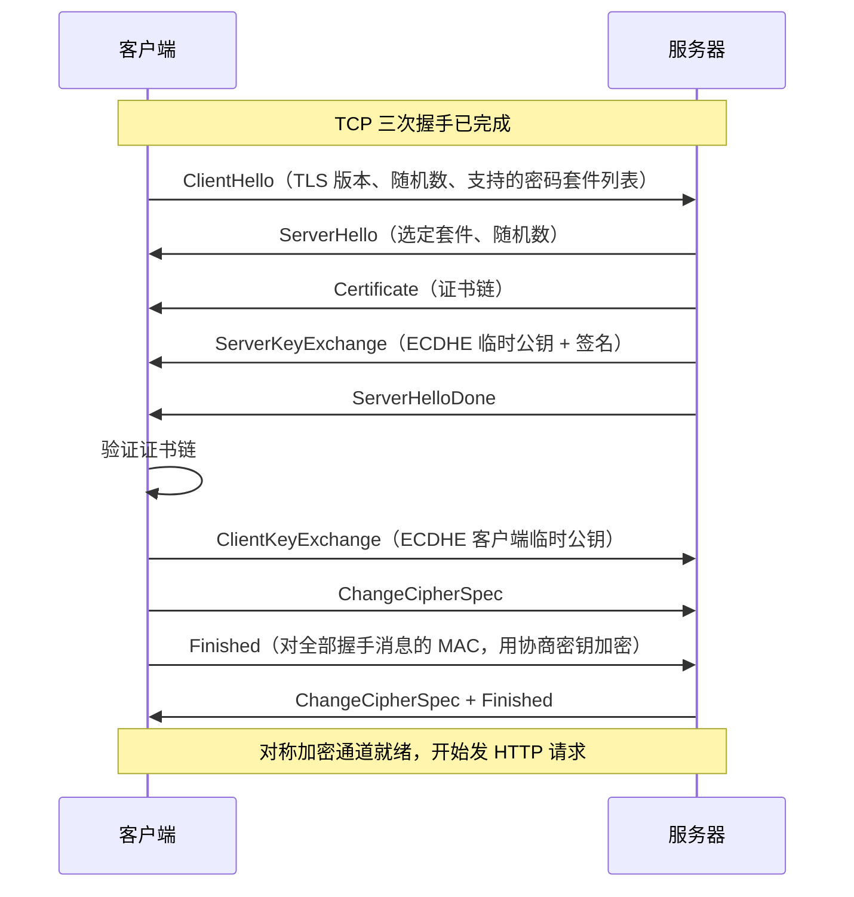

## 前置知识

- TCP 三次握手建立连接的过程（见 [TCP 连接管理](cs-fundamentals/300-TCPControl)）——TLS 握手发生在 TCP 连接建立之后；
- 对称加密（加解密同一把钥匙，快）与非对称加密（公钥加密私钥解，慢）的基本概念；
- 哈希与消息认证码（MAC）：验证内容未被篡改。

## 学习目标

- 说清 HTTPS = HTTP over TLS 的分层关系，握手要同时解决"防窃听"与"防冒充"两件事；
- 完整走一遍 TLS 1.2 握手（2-RTT），理解 RSA 与 ECDHE 两种密钥交换的差异与"前向安全"的含义；
- 掌握 TLS 1.3 如何压缩到 1-RTT 与 0-RTT，以及 0-RTT 的重放风险；
- 理解证书链验证步骤与吊销机制（CRL / OCSP / OCSP Stapling）。

## 1. 概念引入：怎么把钥匙安全地寄过去

一个类比：你想把一个上锁的密码箱寄给素未谋面的对方，约定以后所有信件都放进这个箱子（对称加密，快）。问题是：**箱子钥匙本身怎么寄过去**？半路会被邮差（中间人）复制。

解决方案分两步：

1. **密钥交换**：用一种"当面掰开也偷不走"的数学技巧（Diffie-Hellman：双方各亮出半个秘密，各自算出同一个完整秘密，而偷看的中间人凑不出），在不安全信道上协商出对称密钥；
2. **身份验证**：怎么确认对面真是"银行"而不是隔壁老王假冒？请一个双方都信任的公证处（CA 证书机构）出具盖了章的身份证明（证书），章本身用公证处的私钥盖的，谁都能用公开的验章器（CA 公钥）验真。

TLS 握手 = 在 TCP 连接上，用一到两个往返完成"协商算法 -> 交换密钥 -> 验证证书 -> 确认握手未被篡改"四件事。

## 2. TLS 1.2 握手：完整的 2-RTT



两侧各自用"自己的临时私钥 + 对方的临时公钥"算出相同的预备主密钥，再结合两个随机数派生出会话密钥——中间人看得见全部明文消息却算不出结果，这正是 DH 类算法的妙处。

### 2.1 RSA 密钥交换：已被淘汰的旧路线

TLS 1.2 允许用 RSA 做密钥交换：客户端生成预备主密钥，用**服务器证书的公钥**加密后直接发过去。流程简单（少了 ServerKeyExchange），但有致命缺陷——**无前向安全**：只要攻击者存下了全部握手流量，日后拿到服务器 RSA 私钥（如证书泄露），就能解开历史所有会话。因此现代部署已全面转向 ECDHE，TLS 1.3 更是直接删除了 RSA 密钥交换。

### 2.2 ECDHE 与前向安全

ECDHE（椭圆曲线 Diffie-Hellman 临时）的关键在最后一个 E：**Ephemeral，临时**。每次握手双方都生成新的临时密钥对，会话密钥由本次临时密钥派生，与服务器长期私钥无关。服务器对临时公钥的签名（用证书私钥）只用于证明"这个临时公钥确实来自证书主人"，而非参与密钥本身。私钥日后泄露，历史流量依然安全——这就是前向安全（PFS）。

## 3. TLS 1.3 握手：1-RTT 与 0-RTT

TLS 1.3（RFC 8446，2018）对握手做了大手术：

1. **砍掉一个往返**：客户端在 ClientHello 里就带上 `key_share`（临时公钥，赌服务器会选某条曲线），服务器直接回自己的临时公钥并给出加密后的 Finished——双方在第二个飞行包结束后已可发应用数据。2-RTT 变 1-RTT。
2. **精简算法**：只保留 AEAD 套件（如 `TLS_AES_256_GCM_SHA384`），删除 RSA 密钥交换、CBC 模式、RC4、压缩、 renegotiation 等历史包袱。
3. **握手消息大多已加密**：ServerHello 之后的所有握手消息都在加密下进行，减少元数据泄露。
4. **0-RTT（Early Data）**：对**曾连接过**的客户端，可复用上次的密钥材料，在第一个飞行包里就带上加密的 HTTP 请求。代价是 0-RTT 数据不具备防重放性——攻击者可以原样重发这段密文让服务器重复执行，因此只应用于幂等请求（GET、无副作用的查询），服务端必须实现去重。

| 维度 | TLS 1.2（ECDHE） | TLS 1.3 |
| ---- | ---- | ---- |
| 完整握手往返 | 2-RTT | 1-RTT |
| 会话恢复 | Session ID/Ticket（另需 1-RTT 验证） | PSK，1-RTT 或 0-RTT |
| 密钥交换 | ECDHE / RSA（遗留） | 仅（EC）DHE 或 PSK，强制前向安全 |
| 记录层算法 | AEAD 与 CBC 并存 | 仅 AEAD |

## 4. 证书验证：防冒充的关键

收到证书链后，客户端逐级验证：

1. **签名链**：叶子证书（你的域名）由中间 CA 签发，中间 CA 由根 CA 签发；用上级证书的公钥验证下级签名，根证书来自操作系统/浏览器内置的信任库（信任锚）；
2. **域名匹配**：证书的 SAN（Subject Alternative Name）覆盖当前访问的域名；
3. **有效期**：当前时间在 notBefore 与 notAfter 之间（现行 CA/Browser 论坛规定叶子证书最长 398 天）；
4. **吊销状态**：证书可能在到期前被吊销。CRL（吊销列表，全量下载，滞后）与 OCSP（实时单条查询，增加延迟与隐私泄露）之外，现代主流是 **OCSP Stapling**——服务器定期代取 OCSP 响应并"钉"在握手里，客户端免查询，还可选 OCSP Must-Staple 强制要求。Chrome 等浏览器已转向短期内证书 + 软失败策略。

任何一步失败，浏览器给出明确的证书警告（如 `NET::ERR_CERT_AUTHORITY_INVALID`）。

## 5. 完整示例：亲手观察握手

用 openssl 观察 TLS 1.3 握手与证书链：

```bash
openssl s_client -connect example.com:443 -brief < /dev/null
```

典型输出：

```text
CONNECTION ESTABLISHED
Protocol version: TLSv1.3
Ciphersuite: TLS_AES_256_GCM_SHA384
Peer certificate: 256-bit ECDSA, 主体域名 example.com
Verification: OK
```

再查看完整证书链的签发关系：

```bash
openssl s_client -connect example.com:443 -showcerts < /dev/null 2>/dev/null | \
  openssl x509 -noout -subject -issuer -dates
```

输出：

```text
subject=CN=example.com
issuer=C1=US, O=Let's Encrypt, CN=E5
notBefore=Aug 30 00:00:00 2026 GMT
notAfter=Nov 28 23:59:59 2026 GMT
```

`issuer` 指向中间 CA（Let's Encrypt E5），中间 CA 再由根 CA 签发——这正是第 4 节的链式验证在真实世界的样子。测试自签名或证书链不完整时，`Verification` 会给出失败原因。浏览器侧则可用 DevTools 的 Security 面板直观看到协议版本、套件与证书链树。

## 6. 常见陷阱与调试

- **证书链不完整（服务器漏发中间证书）**：桌面浏览器因缓存了中间证书能打开，但移动端或 curl/java 客户端报"无法验证"。用 `openssl s_client` 检查，服务器配置里应提供 fullchain 而非仅叶子证书。
- **0-RTT 用于非幂等请求**：把下单接口放在 early data 里，重放攻击会让用户下两单。要么禁用 0-RTT，要么服务端拒绝处理 0-RTT 中的非幂等方法。
- **混淆"HTTPS 保护什么"**：握手保护的是**传输中**的数据；服务器被入侵拿到长期私钥影响的是"能否伪装服务器"，而前向安全保证历史流量不受影响。HTTPS 不校验内容合法性——网页内容本身是否安全是另一回事。
- **SNI 明文泄露**：握手早期 ClientHello 中的服务器名指示（SNI）未加密，中间人可得知你访问的域名。ECH（Encrypted Client Hello）正在逐步部署中，写作与选型时可关注但不臆造支持范围。
- **证书到期忘续**：Let's Encrypt 90 天短周期 + 自动续期（certbot/acme.sh 定时任务）是现状标准；到期会导致全网中断且监控若只测 HTTP 状态码容易漏报。

## 7. 实战场景

- **性能优化**：TLS 1.3 + 会话复用把建连成本压到 1-RTT；OCSP Stapling 去掉客户端吊销检查的额外往返；证书链按"中间在前、根不发"排布，减少握手字节数。
- **内部服务间 TLS**：微服务 mTLS（双向证书验证）里两端互验证书，是零信任网络的基石。
- **排查线上握手失败**：先 `openssl s_client` 复现（绕开应用层），看 `Verification` 与告警行；区分是证书问题、算法不匹配（老旧客户端只支持被禁用套件）还是中间设备拦截。

## 小结

初学者要点：

- HTTPS 握手解决两件事：用 ECDHE 类算法协商出对称密钥（防窃听），用证书链验证服务器身份（防冒充）。
- TLS 1.2 完整握手 2-RTT；TLS 1.3 压缩到 1-RTT，复用连接可 0-RTT，但 0-RTT 数据可被重放。
- 证书验证四步：签名链、域名匹配、有效期、吊销状态；根证书信任来自系统内置信任库。

进阶注意：

- RSA 密钥交换无前向安全，TLS 1.3 已删除；生产环境应确认全站走 ECDHE/DHE 且启用 TLS 1.3。
- OCSP Stapling 是吊销检查的主流优化，浏览器正转向"短有效期证书 + 软失败"策略，企业内网需注意 OCSP/OCSP Stapling 都失效时的策略。
- 握手性能优化空间集中在：往返数（1.3 + 会话复用）、字节数（精简证书链）、CPU（会话票据复用与 ECDSA 证书）三处，与 CDN 的 TLS 终止配合收益最大。
