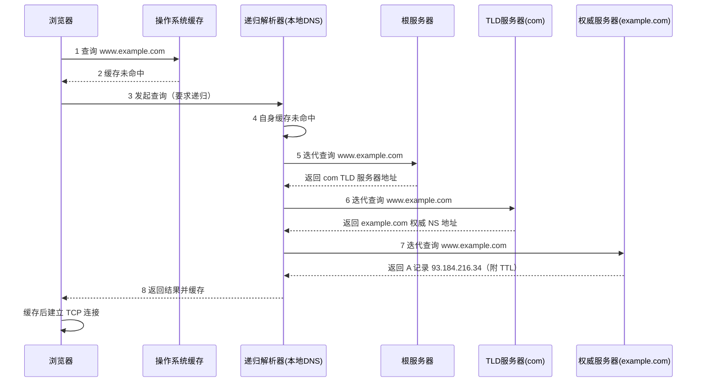

## 前置知识

- 浏览器访问网站前必须先把域名变成 IP 地址（TCP 连接需要 IP）；
- UDP 是 DNS 默认传输层（53 端口），TCP 用于响应截断重传与区域传送；
- 域名字符串的书写顺序：`www.example.com` 中 `com` 是最顶层。

## 学习目标

- 说清域名层级与三类 DNS 服务器（根、TLD、权威）的分工；
- 区分递归查询与迭代查询，完整描述一次解析的八步流程；
- 理解多级 DNS 缓存与 TTL 的联动，以及它对故障切换速度的影响；
- 认识 A/AAAA/CNAME/MX/TXT/NS 等常见记录类型与用途。

## 1. 概念引入：问路的三级导航

一个类比：你要找"幸福小区 3 号楼 502 的张三"（`www.example.com`），但只认识路。你会：

1. 问**市邮政总局**（根服务器）："幸福小区归哪个区管？"总局说："去问城东分区（.com 管理局）"；
2. 问**分区**（TLD 服务器）："幸福小区归哪个派出所？"分区说："幸福路派出所（example.com 的权威服务器）"；
3. 问**派出所**（权威服务器）：户籍民警（权威 DNS）翻出登记表："张三住在幸福小区 3 号楼 502"（IP 地址）。

DNS 的分层设计正是如此：**没有人知道全部答案，但每一级都知道"下一级去问谁"**。这个设计让任何一台服务器只需维护一个局部的小表，全球就能协同工作。

## 2. DNS 体系结构

### 2.1 域名层级

`www.example.com.` 末尾有一个被省略的根点，完整层级自右向左：

```text
.（根域） -> com（顶级域 TLD） -> example.com（二级域/权威区） -> www（子域主机名）
```

- **根服务器**：全球 13 套根域名系统（A-M，通过任播部署了上千个实例），职责只有一件事：告诉你每个 TLD 的服务器在哪；
- **TLD 服务器**：管理 `.com`、`.cn`、`.org` 等顶级域，回答"example.com 的权威 NS 是谁"；
- **权威服务器**：真正存储某个域名的资源记录（你在域名服务商处配置的解析就存在这里）。

### 2.2 第四个角色：本地解析器

浏览器/操作系统不会直接去问根，而是问**递归解析器**（也称本地 DNS、stub resolver 的上游）：企业内网指定的、运营商分配的，或公共 DNS（114.114.114.114、8.8.8.8、1.1.1.1）。它替客户端跑腿，把"问三级"的全部过程走完，再把最终 IP 交给客户端。

## 3. 一次完整的解析：递归与迭代



两个术语在这张图里分野清晰：

- **递归查询**（步骤 3）：客户端只提一个问题，解析器负责拿到最终答案——"你替我跑腿到底"；
- **迭代查询**（步骤 5-7）：解析器问根，根不给答案只给"下一步问谁"，解析器再逐级往下问——"你指个路，我自己去"。

分工的原因很现实：全球客户端都递归到底会把流量全压到根服务器上；让解析器缓存与迭代，根只回答"com 在哪"这一种问题，负载最小化。

## 4. 缓存与 TTL：速度与变更的权衡

每条 DNS 应答都带 TTL（生存秒数），缓存在途中的每一层：

| 缓存层 | 典型实现 | 说明 |
| ---- | ---- | ---- |
| 浏览器缓存 | Chrome 内置 DNS 缓存（约 1 分钟量级） | `chrome://net-internals/#dns` 可查看 |
| 操作系统缓存 | 系统解析器缓存 + `hosts` 文件 | `hosts` 条目优先于一切查询 |
| 递归解析器缓存 | 公共 DNS / 运营商 | 命中率最高的一层，TTL 到期才回源 |

TTL 是一把双刃剑：调大（如 86400）则解析快、压力小，但**切换 IP 后全网生效要等一天**；调小（如 60）则变更及时，解析器压力与失败风险上升。运维实践：**计划迁移前先把 TTL 调短（如 300 秒），观察一个周期后再改记录**，切换完成后恢复较长的 TTL。

另注意操作系统缓存里的**负缓存**：查询失败（NXDOMAIN）也会按 SOA 记录里的参数缓存一段时间，刚添加的域名立刻访问报"域名不存在"，往往就是负缓存作祟。

## 5. DNS 记录类型

| 类型 | 内容与用途 |
| ---- | ---- |
| A | 域名 -> IPv4 地址 |
| AAAA | 域名 -> IPv6 地址（读作"quad-A"） |
| CNAME | 域名 -> 另一个域名（别名）。CDN、对象存储桶都靠它接入 |
| NS | 指定该区域由哪些权威服务器负责 |
| MX | 邮件交换记录，值是"优先级 + 邮件服务器域名" |
| TXT | 任意文本，现实中最常用于域名所有权验证（SPF/DKIM/ACME） |
| SOA | 区域的元信息：主权威、管理员邮箱、序列号、负缓存参数 |

一个实用细节：**同一个主机名上，CNAME 与其他任何记录不能共存**（规范要求名称若为 CNAME 则只能有此一条）。这就是为什么域名 apex（`example.com` 本身）通常无法直接 CNAME 到 CDN——apex 处必须放 SOA/NS，许多服务商因此提供 CNAME 扁平化（在权威侧代做别名解析）。

## 6. 完整示例：dig 亲历解析

```bash
# 直接查询（问系统配置的递归解析器）
dig www.example.com

# 精简输出关键行
dig +noall +answer www.example.com
```

输出：

```text
www.example.com.   86400   IN   A   93.184.216.34
```

含义：名字、TTL（秒）、类、类型、值。再走一遍完整路径，看每一级怎么回答：

```bash
dig +trace www.example.com 2>/dev/null | grep -E 'com\.|example|www\.' | head -8
```

典型输出（节选）：

```text
.           518400  IN  NS  a.root-servers.net.
com.        172800  IN  NS  a.gtld-servers.net.        # 根告诉我们 com 在哪
example.com.  3600  IN  NS  a.iana-servers.net.        # TLD 告诉我们权威在哪
www.example.com. 86400 IN A  93.184.216.34            # 权威给出最终答案
```

`dig +trace` 从根开始逐级迭代，正是第 3 节流程图的文字版。调试技巧：`dig @8.8.8.8 example.com` 指定解析器对比不同线路的结果；`dig +short txt example.com` 查看 TXT 验证记录是否生效。

## 7. 常见陷阱与调试

- **"刚改了解析为什么没生效"**：三层缓存叠加。先确认权威已生效（`dig @权威服务器 域名`），再用 `dig +trace` 看解析器拿到的 TTL 还剩多少，等待过期或临时换公共 DNS 验证。
- **以为 DNS 一定返回真实 IP**：CDN 会按调度返回就近节点 IP（见 [CDN 原理](cs-fundamentals/350-CDNPrinciple)），同一域名不同地区解析结果不同属正常现象，排查故障时不要拿"我 ping 出的 IP"与他人对比。
- **hosts 排查被遗忘**：本机改过 hosts 后忘了清理，线上服务在新机器一切正常、在开发机死活不通。`hosts` 优先级高于 DNS，排障第一步先看它。
- **UDP 512 字节截断**：无 EDNS0 的链路上超长应答会置 TC 标志转 TCP 重试；DNSSEC 部署后响应变大，老设备上的"偶发解析失败"常源于此。
- **递归解析器被滥用**：开放递归（allow recursion to any）会被构造成 DDoS 反射放大器，自建 DNS 必须限制递归服务范围。

## 8. 实战场景

- **故障切换**：主库宕机把 DNS 指向备库，生效时间取决于 TTL——关键域名平时保持短 TTL（60-300 秒）是为 disaster recovery 买保险。
- **灰度与调度**：基于解析器来源 IP 的智能解析（电信/联通/海外返回不同地址）是最朴素的流量调度；HTTPDNS（客户端绕过传统解析直连 HTTP 接口问解析）则用来对抗运营商劫持与本地缓存不准。
- **域名接入验证**：给证书签发（ACME TXT）、企业邮箱（MX/SPF）、站点归属（CNAME/TXT）配置时，逐条用 `dig +short` 验证，是上线前的标准动作。

## 小结

初学者要点：

- DNS 是分层问路系统：根 -> TLD -> 权威，每级只答"下一级去哪问"。
- 客户端对解析器是递归查询，解析器对上级是迭代查询；应答带 TTL，沿途各级缓存。
- 常用记录：A/AAAA 指 IP，CNAME 起别名，MX 收邮件，TXT 做验证；CNAME 不能与其他记录共存。

进阶注意：

- TTL 决定变更生效速度与解析器负载的平衡，迁移前调短 TTL 是标准预案；NXDOMAIN 负缓存也会拖慢新记录生效。
- 解析结果是"调度结果"而非"唯一真相"：CDN/智能解析让同一域名按地区、线路返回不同答案，排障要带上下文对比。
- 自建递归解析必须限制服务范围防反射滥用；公网应答需关注 UDP 报文长度与 DNSSEC 带来的兼容性问题。
