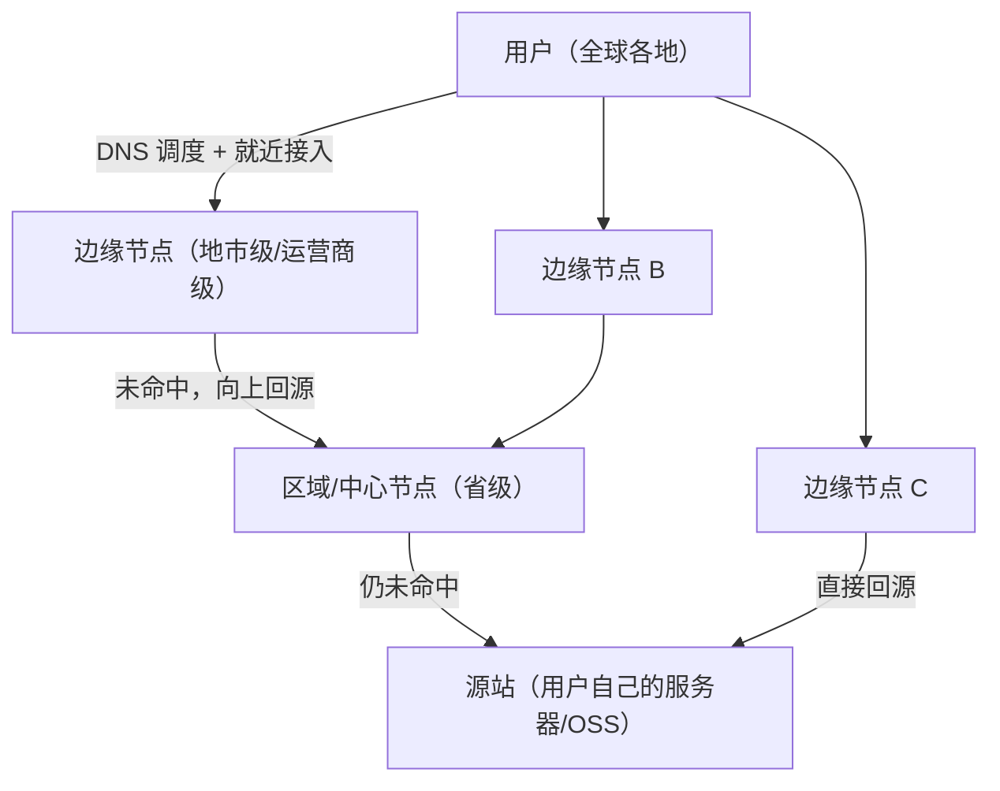
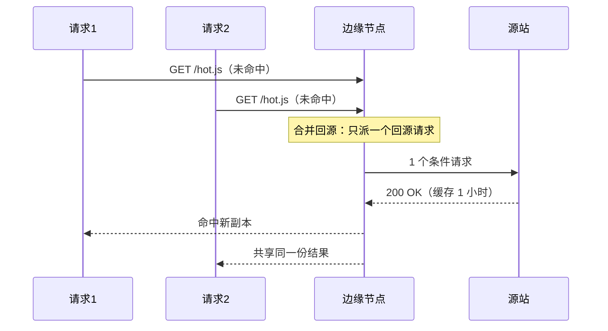

## 前置知识

- HTTP 缓存语义：`Cache-Control`、`ETag`、304 协商（见 [HTTP 缓存策略](cs-fundamentals/320-HTTPCacheStrategy)）；
- DNS 解析与 CNAME 记录（见 [DNS 解析流程](cs-fundamentals/340-DNSFlow)）——CDN 的流量调度就建立在它之上；
- 网络延迟的基本直觉：跨网/跨地域 RTT 是静态资源加载的主要瓶颈。

## 学习目标

- 说清 CDN 的三层结构（边缘节点、区域中心、源站）与"就近服务"的本质收益；
- 区分 PUSH（预热）与 PULL（回源拉取）两种内容分发方式；
- 理解回源条件、回源保护（合并回源）与回源率优化的工程手段；
- 掌握 DNS 调度（GSLB/CNAME 链）的工作过程与 HTTPDNS 的动机。

## 1. 概念引入：前置仓改写零售

一个类比：连锁便利店把货仓放在城市中心，顾客买瓶水要横穿全城；改成"每三个街区一家前置仓"（边缘节点），顾客下楼即得（就近 RTT 几毫秒）。仓库缺货时才向中心仓（源站）补货一次，之后全城顾客都来这家前置仓拿——中心仓的流量从"每个顾客一次"降到"每种商品一次"。

CDN 收益因此是双重的：

1. **用户侧**：距离变短，TCP/TLS 握手与传输都在同城/同省完成，首字节时间显著下降；
2. **源站侧**：海量重复请求被边缘消化，源站带宽与算力压力骤减，还能吸收突发流量（热点事件、大促）。

缓存命中时数据从边缘发出，未命中才走"边缘 -> 上级节点 -> 源站"的回源链路。

## 2. CDN 架构：三层结构



- **边缘节点**：部署在各地、各运营商机房的小型缓存集群，数量最多、离用户最近，承载绝大多数命中请求；
- **区域/中心节点**：边缘之上的二级缓存层，边缘未命中先问中心，避免每次都打到源站（称为"二级回源"）；
- **源站（Origin）**：内容的权威来源。CDN 对源站的要求是：稳定、支持条件请求（304 语义），否则回源风暴会直接打穿它。

## 3. 内容如何进入 CDN：PUSH 与 PULL

### 3.1 PULL（拉取，默认模式）

用户请求未命中时，节点实时向上一级（最终到源站）拉取，按 `Cache-Control` 缓存后继续服务后续请求。优点是零运营成本、内容天然按需；缺点是**每个节点首次访问都要回源一次**，冷启动期源站压力集中。

### 3.2 PUSH（预热，主动推送）

在用户访问前，通过 CDN 提供的接口把指定 URL 主动推送到指定区域的节点。用于大促前预热爆款资源、新版本发布前推送静态包，把"第一用户的慢"消弭于无形。

与之互补的是**刷新（purge）**：内容更新后调用刷新接口清除节点缓存（URL 刷新或目录刷新），强制后续请求回源拿新内容——PUSH 解决"提前就位"，刷新解决"及时下架"。

## 4. 回源机制：CDN 与源站的契约

### 4.1 回源条件

节点决定"要不要回源"的条件与浏览器一致（HTTP 缓存语义）：本地无副本、副本过期（`max-age`/`s-maxage` 到期）。过期后节点带 `If-None-Match`/`If-Modified-Since` 向上级做条件请求，源站返回 304 则续用旧副本——所以**源站正确生成 ETag/Last-Modified 是回源省流量的前提**。

### 4.2 回源保护：合并回源

热点资源在 N 个并发请求同时未命中时，若每个请求都各自回源，源站瞬间承受 N 倍流量（缓存击穿）。CDN 的标准对策是**合并回源（请求合并/single-flight）**：同一 URL 的并发未命中只放行一个回源请求，其余请求挂起等待，拿到结果后共享给全部等待者。



### 4.3 回源率优化

回源率 = 回源请求数 / 总请求数，是 CDN 运营的核心指标。常见手段：

- 延长 `s-maxage`（对 CDN 层生效的缓存时长）配合内容哈希文件名，让资源"永不主动过期"；
- 提升**缓存命中率**：URL 规范化（去掉无意义的查询参数）、忽略不影响内容的请求头；
- 分层架构让边缘未命中先问中心节点，把对源站的请求再降一个量级；
- 对无法缓存的动态请求启用**回源连接复用**与就近回源点，降低回源延迟。

## 5. 调度：怎么把用户指到"对的"节点

### 5.1 DNS 调度（GSLB）与 CNAME 链

接入 CDN 的标准姿势是把域名 CNAME 到 CDN 的调度域名：

```text
cdn.example.com.  CNAME  cdn.example.com.w.examplecdn.com.   # 你的权威指给 CDN
...examplecdn.com.  A    111.63.x.x                          # CDN 权威（GSLB）给出边缘 IP
```

CDN 的全局负载均衡（GSLB）权威服务器在应答时看的是**发起查询的递归解析器 IP**，用它近似用户位置与运营商：电信解析器问来 -> 返回电信边缘节点 IP；海外解析器 -> 返回海外节点。整个过程对用户完全透明（DNS 细节见 [DNS 解析流程](cs-fundamentals/340-DNSFlow)）。

GSLB 的固有误差：递归解析器可能与用户不同城（如用户用公共 DNS），导致"就近"失准；此外 DNS 缓存让调度变更滞后。

### 5.2 HTTPDNS 与 302 调度

- **HTTPDNS**：客户端绕过运营商 DNS，直接通过 HTTPS 接口向 HTTPDNS 服务询问解析结果，拿到更精准的调度并规避域名劫持，移动端 App 广泛使用；
- **302 调度**：对下载类大文件，先请求一个调度 URL，服务端按客户端 IP 返回 302 重定向到具体边缘节点，精度高于 DNS 但多一次往返。

## 6. 完整示例：curl 验证 CDN 行为

```bash
# 观察解析链：CNAME 链与最终边缘节点 IP
dig +short cdn.example.com
# 典型输出：
# cdn.example.com.w.examplecdn.com.
# 111.63.157.17

# 观察命中状态与缓存头（命中标记因厂商而异）
curl -sI https://cdn.example.com/app.v2.js
```

典型输出：

```text
HTTP/1.1 200 OK
Server: Tengine
Content-Type: application/javascript
Cache-Control: max-age=31536000, s-maxage=31536000
X-Cache: HIT TCP_MEM_HIT dirn:10:145689402
Age: 1275
Via: cache12.l2.examplecdn.com cache8.cn.examplecdn.com
```

三个值得读的字段：`X-Cache: HIT` 表示边缘命中（MISS 则表示未命中并回源）；`Age: 1275` 表示该副本已在缓存中存活 1275 秒；`Via` 列出途经的缓存层，能看出是两级结构（l2 为二级节点）。把同一请求连发两次，对比第二次的 `X-Cache`，就能亲手验证 PULL 模式的回源行为。

## 7. 常见陷阱与调试

- **把动态接口也接入 CDN 却没关缓存**：登录态接口被节点缓存后，A 用户看到 B 用户的数据是真实发生过的事故。动态路径必须显式 `Cache-Control: private, no-store` 或在 CDN 控制台配置不缓存规则。
- **回源风暴（缓存击穿）**：某热点资源过期瞬间大量请求同时回源。依赖 CDN 的合并回源 + 自身给热点资源设置"过期前异步刷新"策略；源站侧再加限流兜底。
- **刷新接口当发版流程的唯一依赖**：URL 刷新有配额与生效延迟（分钟级），正确做法仍是内容哈希文件名 + 长缓存，刷新只处理"必须原 URL 更新"的少数资源。
- **拿"自己 ping 的 IP"判断用户故障**：调度按运营商与地区分片，你在海外看到的节点与用户在移动网络看到的完全不同；排查要收集用户的 `nslookup` 结果与响应中的 `X-Cache`/`Via`。
- **忽略缓存键差异**：同一个 URL 带不同查询参数（如 `?t=123` 时间戳）在 CDN 眼里是不同资源，命中率被时间戳参数打没。要么忽略参数缓存，要么前端去掉无意义参数。

## 8. 实战场景

- **网站静态加速**：图片/JS/CSS 配长 `s-maxage` + 哈希文件名，HTML 源站直出或短缓存，是 90% 网站的标准形态。
- **大文件分发**：安装包、视频用 302 调度 + 边缘分片缓存（Range 请求回源），首包延迟与回源带宽双降。
- **全站加速（DCDN）**：动态内容走 CDN 的链路优化（长连接、协议优化、就近回源），静态走缓存，一条 CNAME 同时获得两类收益。

## 小结

初学者要点：

- CDN 用"分布式缓存 + 就近接入"同时降低用户延迟与源站压力，架构是边缘 -> 中心 -> 源站三级。
- 默认 PULL 按需拉取，PUSH 预热抢跑，刷新接口负责及时更新。
- 调度靠 DNS/GSLB（CNAME 接入）按运营商与地域返回最近节点；`X-Cache`/`Age`/`Via` 是判断命中与路径的钥匙。

进阶注意：

- CDN 与源站之间的契约是标准 HTTP 缓存语义：源站的 ETag/Cache-Control 直接决定回源流量；动态内容必须显式声明不缓存。
- 回源合并、分层缓存、参数规范化是把回源率压下来的三大杠杆；热点过期瞬间的击穿要靠合并回源与预热预防。
- DNS 调度天然有解析器定位误差与缓存滞后，精准调度用 HTTPDNS 或 302 补位；排障时永远以"用户侧解析结果"为准。
