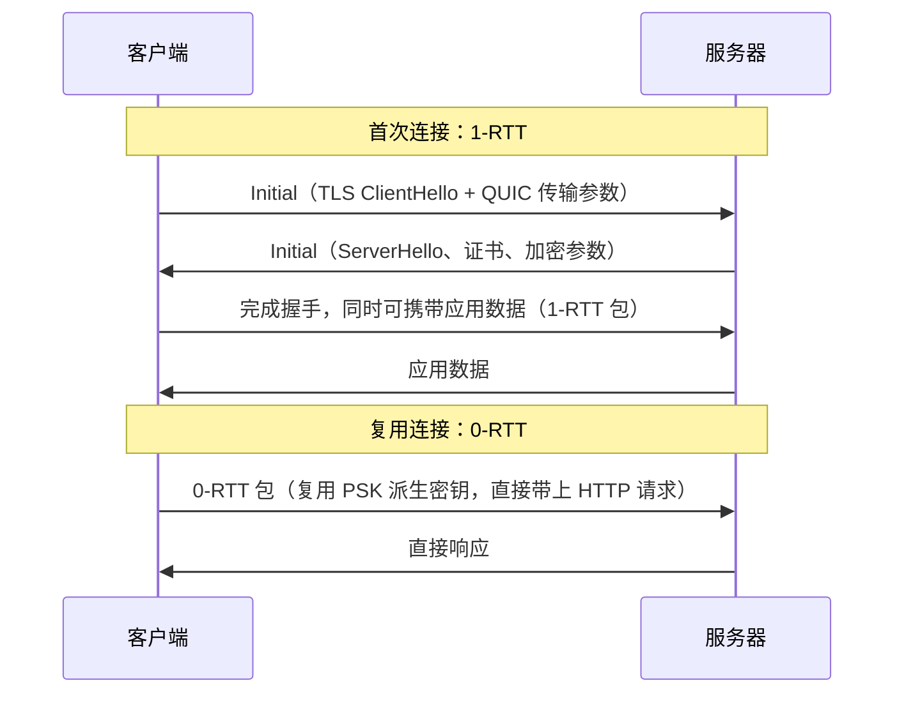
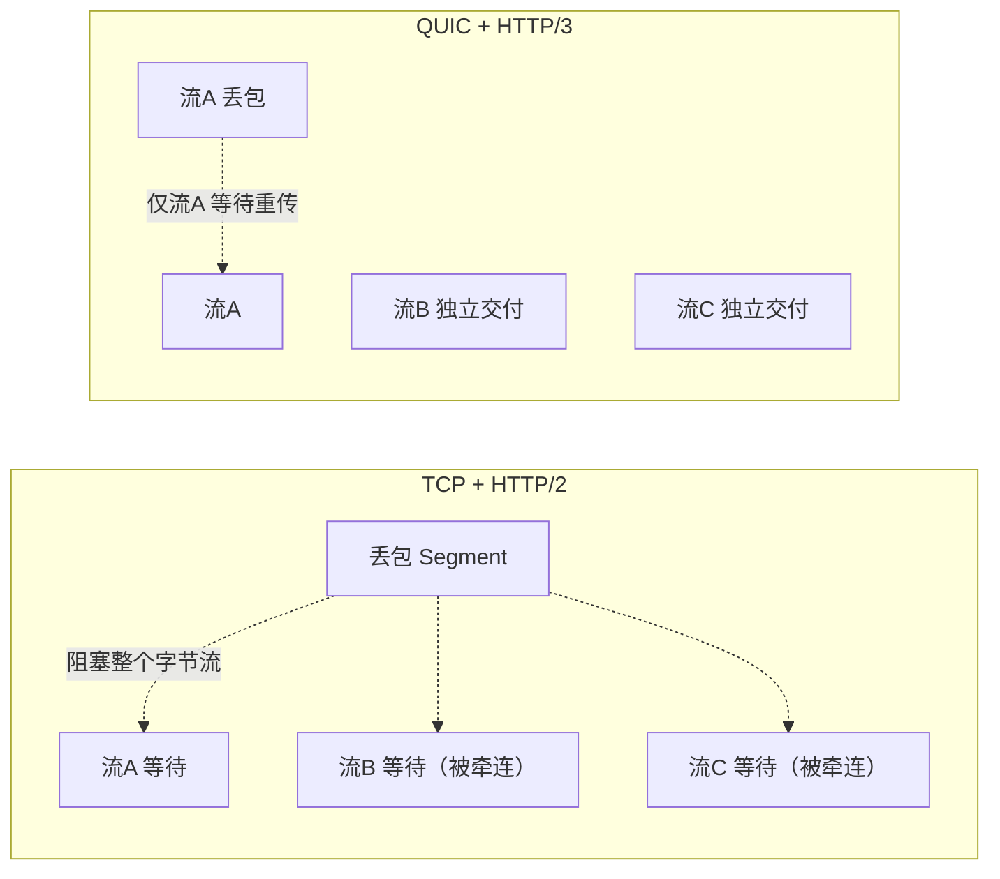

## 前置知识

- TCP 的可靠传输、按序交付与拥塞控制（见 [TCP 连接管理](cs-fundamentals/300-TCPControl)）；
- TLS 1.3 的 1-RTT/0-RTT 概念（见 [HTTPS 握手过程](cs-fundamentals/330-HTTPSHandshake)）；
- HTTP/2 的多路复用与队头阻塞概念。

## 学习目标

- 说清 TCP 的三大结构性局限（建连慢、队头阻塞、迁移难）如何催生 QUIC；
- 解释 QUIC "建在 UDP 上"的真实含义：UDP 只是载体，可靠传输、加密、拥塞控制全部在用户态重新实现；
- 掌握 0-RTT、连接迁移（Connection ID）、流级独立丢包恢复三大核心特性；
- 理解 HTTP/3 = HTTP over QUIC，以及 QPACK 为什么要替代 HPACK。

## 1. 概念引入：货运铁路的百年规章

一个类比：把互联网数据比作货运。TCP 是一条运营了四十年的铁路干线：规章严密（可靠有序），但三条老毛病改不动——

1. **发车前手续慢**：每次托运要先办 TCP 手续再办 TLS 手续（1-2 个 RTT），新客户上门第一单总是最慢的；
2. **一车堵、车车堵**：所有货物按车厢顺序编组（按序交付），前面一节车厢丢失，后面全部完好的货物也要在站台干等（队头阻塞）；
3. **换站台就要从头再来**：连接由"源IP+源端口+目的IP+目的端口"四元组定义，手机从 Wi-Fi 切到 4G，IP 一变，连接作废重来。

QUIC 的做法是：不再等铁路公司修规章（改内核协议栈需要十年），而是**自己组建车队在普通公路（UDP）上跑**——公路只管把车开过去（UDP 只提供不可靠数据报），调度、重传、加密全部由车队自己（用户态协议栈）掌控，规则随版本随时升级。

> 类比失真提示：公路（UDP）上开自己的车队，可能被"路政"刁难——部分运营商/企业防火墙对 UDP 限速或封锁，是 QUIC 部署的主要现实阻力。

## 2. TCP 的局限与 QUIC 的对策

| TCP + TLS 的痛点 | 机理 | QUIC 的解法 |
| ---- | ---- | ---- |
| 建连慢（TCP 1-RTT + TLS1.3 1-RTT） | 两个协议栈串行握手 | 传输与加密合并握手，首次 1-RTT，复用 0-RTT |
| 队头阻塞 | 单一字节流按序交付给应用 | 多流独立，一丢包只阻塞它所在的流 |
| 连接迁移难 | 四元组标识连接 | Connection ID 标识，网络切换不断线 |
| 协议演进慢 | TCP 功能固化在内核与中间设备 | 用户态实现，随应用发版迭代 |
| 中间设备干扰 | 序列号/RTT 等字段可被观测篡改 | 握手之外全加密，含头部大部分字段 |

关键认知：**QUIC 重新发明了"可靠传输"**。丢包重传、确认、流量控制、拥塞控制这些 TCP 的本领，QUIC 全部在用户态自带实现，并因此获得随时改进的自由（BBR 等新拥塞算法不再苦等内核升级）。

## 3. 核心特性

### 3.1 握手与 0-RTT

QUIC 把传输参数协商与 TLS 1.3 握手揉进同一组报文：



首次连接 1 个 RTT 完成全部协商；再次连接时客户端用上次会话的 PSK 派生密钥，在**第一个报文**里就发送加密的应用数据，实现 0-RTT。与 TLS 1.3 相同，0-RTT 数据可被重放，只应承载幂等请求。

### 3.2 连接迁移

QUIC 连接由握手时协商的 **Connection ID** 标识，而非四元组。手机从 Wi-Fi 漫游到蜂窝网络，IP 与端口全变，但只要继续报出同一个 Connection ID，服务器就认定是同一条连接——加密与流状态全部保留，请求不必重发。对移动端体验（视频通话、长下载）是质的改善。代价是连接迁移特性也被攻击者滥用（IP 漂移绕过封锁），因此 QUIC 规范中迁移路径需通过路径验证（PATH_CHALLENGE）。

### 3.3 多路复用与流级队头阻塞

QUIC 在一条连接上承载多条独立的**流（stream）**，每条流有自己的编号与独立的丢包恢复。TCP 上 HTTP/2 的尴尬由此化解：HTTP/2 解决了 HTTP 层队头阻塞，但底层仍是单一 TCP 字节流，**一个包丢失，所有 HTTP/2 流都要等待重传**；QUIC 中某流丢包只影响该流，其他流的数据照常上交给应用。



注意"应用层完全无队头阻塞"并不成立：如果应用本身把有顺序依赖的请求放进不同流（如"先读 HTML 再读它引用的 JS"），丢的流依然是关键路径——QUIC 消除的是**传输层强加的**队头阻塞。

## 4. 传输机制

### 4.1 流模型与帧

QUIC 报文（UDP 数据报内）由**帧（frame）**组成：STREAM 帧携带流数据，ACK 帧确认，FLOW_CONTROL 相关帧管理流量控制。流量控制在两个粒度上同时进行（流级 + 连接级），避免一条流占满整条连接的缓冲。与 WebSocket 帧类似（见 [WebSocket 帧格式](cs-fundamentals/360-WebSocketFrameFormat)），这也是"长度前缀"式的自描述结构，但 QUIC 报文头本身被加密保护，中间设备几乎无法读取。

### 4.2 拥塞控制与丢包恢复

QUIC 默认拥塞控制在服务端/客户端用户态实现，规范推荐 NewRIO 起步（RFC 9002 的损失检测），现实中 BBR、CUBIC 等被广泛使用——算法与应用同生命周期，是"用户态协议栈"红利的直接体现。相比 TCP，QUIC 的确认机制有两个增强：

- **单调递增包号**：包号永不复用，重传包也是新包号，彻底消除 TCP 的重传歧义（收到 ACK 分不清确认的是原包还是重传包），RTT 估计更准；
- **ACK 帧携带收到区间的延迟信息**：支持更精细的带宽探测。

### 4.3 HTTP/3 与 QPACK

HTTP/3 就是"HTTP 语义 over QUIC"：请求/响应映射到 QUIC 流上（每个请求一条流），头部仍用 HPACK 思路压缩，但改造为 **QPACK**——HPACK 的动态表更新要求严格的解码顺序（否则两边压缩状态失配），在多流并行的 QUIC 上会引入队头阻塞；QPACK 允许动态表指令走独立的单向流并支持乱序解码（用阻塞流数等参数权衡压缩率与即时性）。

## 5. 完整示例：观察与验证

```bash
# 1. 确认工具支持：curl 需编译带 HTTP/3（新版本 curl 已普遍支持）
curl -V | grep -i http3

# 2. 请求支持 HTTP/3 的站点，观察协议降级路径
curl -sI --http3 https://www.cloudflare.com/ | head -5
```

典型输出：

```text
HTTP/3 200
alt-svc: h3=":443"; ma=86400
server: cloudflare
content-type: text/html
```

两点解读：`HTTP/3 200` 说明本次协商成功落在 QUIC 上；`alt-svc: h3=":443"` 是协商机制本身——HTTP/1.1 或 HTTP/2 响应先通过 `alt-svc` 头（或 DNS HTTPS 记录）告知客户端"我也支持 h3"，客户端后续请求再切换，首次访问仍走 TCP，不存在"QUIC 握手失败就连不上"的风险（会静默回退）。

浏览器侧验证：DevTools 的 Network 面板添加 Protocol 列，HTTP/3 请求显示 `h3`；Chrome 的 `chrome://net-export` 抓取后可用 qlog 工具分析连接迁移与丢包恢复事件。

## 6. 常见陷阱与调试

- **"QUIC 基于 UDP 所以不可靠"**：UDP 只是封装载体，可靠、有序（按流）、加密、拥塞控制都在 QUIC 层实现——UDP 提供" freedom"，QUIC 提供"秩序"。
- **UDP 被限速/封锁导致体验劣化**：部分企业网络、运营商对非 DNS 的 UDP 流量限速。生产客户端必须实现 TCP/TLS 回退（`alt-svc` 协商天然支持），并把 QUIC 成功率纳入监控。
- **0-RTT 重放**：与 TLS 1.3 相同的坑——幂等校验、服务端去重表缺一不可；把非幂等接口放进 0-RTT 是隐蔽的资损风险。
- **排障工具链不熟**：抓包用 Wireshark（需配置解密密钥日志 SSLKEYLOGFILE），qlog 是 QUIC 专用的事件日志格式；只盯着"包发了没有"在加密世界里走不远。
- **MTU 踩坑**：QUIC 握手报文要求至少 1200 字节可整包送达（不分片），某些隧道/VPN 环境 MTU 过小会导致握手永远失败，表现为"TCP 通、QUIC 死"。

## 7. 实战场景

- **CDN 与边缘**：头部 CDN（Cloudflare、Fastly、国内主要厂商）已全量支持 HTTP/3，高丢包移动网络上收益最明显。
- **移动 App**：连接迁移消除网络切换重连；弱网下 0-RTT 提速首屏；gRPC over HTTP/3 的探索依赖同一套设施。
- **自建服务**：Nginx（1.25+）、Caddy、Envoy 均支持 HTTP/3 反代；上线前用 curl/wireshark 验证回退路径与防火墙策略。

## 小结

初学者要点：

- QUIC 在 UDP 之上用用户态重新实现可靠传输与加密，一举解决 TCP 建连慢、全局队头阻塞、网络切换断连三大痛点。
- 首次连接 1-RTT、复用连接 0-RTT；连接由 Connection ID 标识，换网不断线。
- 多流独立恢复，丢包只阻塞所在流；HTTP/3 = HTTP over QUIC，QPACK 解决头部压缩的乱序问题。

进阶注意：

- "消除队头阻塞"仅指传输层强加的部分，应用层的请求依赖仍构成关键路径。
- 0-RTT 有重放风险，需幂等设计；连接迁移需路径验证，防滥用。
- 部署的现实约束是 UDP 友好度与 MTU；`alt-svc` 机制保证平滑回退，但监控里必须区分 h2/h3 成功率与延迟差异。
