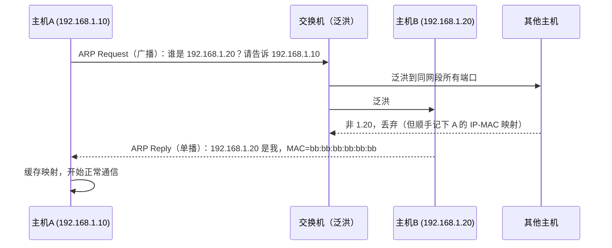

## 前置知识

- IP 地址与 MAC 地址的分工：IP 负责"端到端寻径"，MAC 负责"同一段内下一跳投递"；
- 局域网广播：交换机会把广播帧发给同网段所有主机；
- HTTP 明文传输的含义（HTTPS 见 [HTTPS 握手过程](cs-fundamentals/330-HTTPSHandshake)）。

## 学习目标

- 描述 ARP"广播请求、单播应答"的解析流程与 ARP 缓存表的老化机制；
- 理解 ARP 协议"无验证"的设计缺陷为何导致欺骗可行；
- 说清 ARP 欺骗构造中间人攻击（双向欺骗）的完整链路与危害；
- 掌握静态绑定、DAI、端口安全等防御手段的原理与适用边界。

## 1. 概念引入：没有实名核验的传达室

一个类比：宿舍楼传达室有一本"姓名-房间号"登记表（ARP 缓存），快递员（IP 层）只知道收件人门牌（IP 地址），需要传达室把门牌翻译成"哪个床位"（MAC 地址）才能送达。这本表本该权威，但它有个致命设定——**任何人喊一嗓子"我是 502，床位在这"，传达室就会照单全收、直接更新登记表**。喊错的人若是故意的，这就叫 ARP 欺骗。

理解 ARP 的要点：它是 IPv4 局域网里把"已知 IP -> 未知 MAC"映射出来的协议，**协议报文里没有任何身份验证字段**——这是 1982 年的设计前提（局域网内彼此可信），也是全部问题的根源。

## 2. ARP 协议工作原理

### 2.1 地址解析流程

主机 A（192.168.1.10）要给同网段的主机 B（192.168.1.20）发包，但缓存里没有 B 的 MAC：



两个值得注意的细节：

1. **请求是广播，应答是单播**：请求必须让全网段听见（B 不认识 A），应答只需要发给提问者；
2. **"顺手学习"**：网段内收到广播的其他主机会把"A 的 IP-MAC"写进自己的缓存——**不仅应答能更新缓存，请求也能**，欺骗攻击正是利用了这一点。

### 2.2 ARP 缓存表

缓存条目分两类：

- **动态条目**：解析得来，有老化时间（Linux 约 60 秒可达状态后进入 stale，再次使用时重新确认；Windows 数分钟量级）——老化的意义是感知"对方换了网卡/迁移了 IP"；
- **静态条目**：手工绑定，永不过期，是手动防御的载体。

查看命令：`arp -a`（Windows/macOS）或 `ip neigh`（Linux 现代接口）。REACHABLE/STALE/INCOMPLETE 等状态反映了条目的可信生命周期。

### 2.3 免费 ARP（Gratuitous ARP）

一种"无问自答"的特殊 ARP：主机以**广播形式**发布"我的 IP 是 X，MAC 是 Y"的请求/应答（通常请求里填自己的 IP 做目标）。用途：

- **重复地址检测**：主机上线时发免费 ARP，若有人应答说明 IP 被占；
- **主动通告**：网卡/虚拟 IP 变更时（如 keepalived 主备切换），广播新 MAC 让全网更新缓存。

免费 ARP 本是正当机制，但它进一步坐实了"任何人都可以单方面宣布映射关系"——ARP 欺骗的报文与免费 ARP 在网络上无法区分。

## 3. ARP 欺骗：原理与攻击形态

### 3.1 攻击原理

欺骗只需要一条伪造的 ARP 报文：

```text
攻击者持续广播/单播：
"192.168.1.1（网关）的 MAC 是 cc:cc:cc:cc:cc:cc"   （攻击者自己的 MAC）
```

网关的真实 MAC 不是它，但**ARP 缓存无条件接受后到的报文**（后到者优先是普遍实现行为），于是受害主机的缓存被毒化：发往网关的流量全部先到攻击者网卡。

### 3.2 中间人攻击：双向欺骗

只骗受害者会造成"断网"（流量到攻击者后无处可去，容易被发现）。隐蔽的形态是**双向欺骗**：攻击者同时向受害主机谎报网关 MAC、向网关谎报受害主机 MAC，让自己坐进中间：


此时攻击者可以：窃听明文流量（HTTP、DNS）、篡改响应（注入代码、替换下载文件）、选择性丢包限速。HTTPS 站点的流量虽不可读，攻击者也可能通过伪造证书警告诱骗用户点击继续（配合浏览器告警疲劳）。

### 3.3 危害汇总与排查特征

| 现象 | 与 ARP 欺骗的关联 |
| ---- | ---- |
| 局域网内频繁掉线、时通时断 | 欺骗者转发能力不足或选择性转发 |
| 网络里出现证书告警 | 中间人伪造 HTTPS 证书 |
| 交换机提示 MAC 漂移 | 同一 IP 的 MAC 频繁变化 |
| IP 冲突提示频发 | 伪造免费 ARP 的副作用 |

排查第一步就是对比多方视角的缓存：在受害主机与网关上分别 `arp -a`，同一 IP 的 MAC 若不一致或频繁变化，基本可断定存在欺骗。

## 4. 防御措施

### 4.1 静态 ARP 绑定

`ip neigh replace 192.168.1.1 lladdr aa:aa:aa:aa:aa:aa dev eth0 nud permanent` 把关键映射固化。小网络（家里、实验室）简单有效；服务器规模一大，绑定表的管理成本与出错风险急剧上升，只适合保护"网关"这一个关键映射。

### 4.2 DAI：交换机层的动态检测

动态 ARP 检测（DAI，Dynamic ARP Inspection）是企业网的标准答案，依赖 **DHCP Snooping** 建立的绑定表（交换机监听 DHCP 应答，记录"端口-IP-MAC"的合法关系）：

- 交换机收到每个 ARP 报文，与绑定表核对：IP 与 MAC 的组合若不该出现在这个端口，直接丢弃并告警；
- 静态 IP 环境可手工配置绑定表项。

DAI 把"防欺骗"从主机侧移到网络设备侧，主机无需任何改动，是规模化环境的首选。

### 4.3 端口安全与网络隔离

- **端口安全（Port Security）**：交换机端口限制可学习到的 MAC 数量（如 1 个），攻击工具的 MAC 泛洪与欺骗报文直接被压制；
- **VLAN / 私有 VLAN 隔离**：缩小广播域，让"能骗到的对象"变少；酒店、办公网常用 client 隔离模式使终端之间互相不可见，ARP 欺骗随之失效；
- **加密与认证**：802.1X 准入确保只有合法用户入网；业务流量全站 HTTPS（防窃听/篡改）、DNS over HTTPS（防 DNS 劫持）把"即使被中间"的损失压到最低。

## 5. 完整示例：观察与检测工具

```bash
# 1. 查看本机 ARP 缓存（Linux）
ip neigh show
# 典型输出：
# 192.168.1.1 dev eth0 lladdr aa:aa:aa:aa:aa:aa REACHABLE   <- 网关
# 192.168.1.23 dev eth0 lladdr bb:bb:bb:bb:bb:bb STALE      <- 邻居

# 2. 主动探测某个 IP 的真实 MAC（绕过本机缓存直发 ARP 请求）
arping -I eth0 -c 2 192.168.1.1
# 典型输出：
# ARPING 192.168.1.1 from 192.168.1.10 eth0
# Unicast reply from 192.168.1.1 [AA:AA:AA:AA:AA:AA]  1.204ms

# 3. 持续监控网关 MAC 是否漂移（简易检测脚本）
watch -n 2 "ip neigh show 192.168.1.1 | awk '{print \$5}'"
# 正常输出恒定不变；若在两个 MAC 间跳动，即存在 ARP 欺骗
```

专用工具 arpwatch 长期驻守，把"IP-MAC 映射变化"以邮件/syslog 告警（`changed ethernet address`），适合在网关或监控机上无人值守运行。多机交叉验证是原则：一台机器的缓存可能被毒化，但骗过全网所有视角需要持续的欺骗流量，反而暴露自己。

## 6. 常见陷阱与调试

- **以为 Wi-Fi 密码 = 局域网安全**：连上同一 Wi-Fi 的任何设备都能发 ARP 报文。公共 Wi-Fi 上的历史攻击案例绝大多数以 ARP 欺骗为第一步。
- **把"上不了网"一律归咎 DHCP/DNS**：同网段其他机器正常、自己时通时断且网关 MAC 频繁变化，是 ARP 欺骗的典型画像，先查缓存再重置网络。
- **静态绑定只绑自己不绑网关**：欺骗往往双向进行，网关侧也需要绑定（或干脆上 DAI），单边绑定只能保住一个方向。
- **IPv6 不用 ARP 但不等于安全**：IPv6 用 NDP（邻居发现）替代 ARP，机制类似且同样依赖链路层可信，对应防御是 SEND（RFC 3971）与交换机侧 RA Guard——思路一脉相承。
- **检测到欺骗后只断网不改架构**：清缓存、拔网线只解燃眉之急；不部署 DAI/隔离，攻击者换个工具再来一遍。

## 7. 实战场景

- **企业办公网**：接入交换机全局 DAI + DHCP Snooping + 802.1X，是等保/安评的常见基线要求。
- **家庭与实验室**：路由器上做网关 IP-MAC 静态绑定，终端全站 HTTPS，即可覆盖绝大多数现实风险。
- **云与虚拟化环境**：虚拟机之间同一二层网络内同样存在 ARP 面；主流公有云的 VPC 默认在宿主层做了 ARP 隔离/校验，但自建 OpenStack/KVM 需自行启用反欺骗（如 ebtables/ovs 规则）。

## 小结

初学者要点：

- ARP 把同网段的 IP 翻译成 MAC：广播问、单播答，结果缓存老化。
- 协议报文无身份验证，"后到优先"的缓存更新让伪造报文可以毒化任何主机。
- 双向 ARP 欺骗构造中间人：窃听、篡改、断网三重危害；检测靠多视角对比缓存与监控 MAC 漂移。

进阶注意：

- 防御体系分层：终端侧静态绑定（小规模）、网络侧 DAI + 端口安全（规模化）、业务侧全站加密（兜底）。
- 免费 ARP 是合法机制，无法与欺骗报文在协议层面区分，防御必须依赖"位置信任"（哪个端口该出现什么 IP-MAC）。
- IPv6 的 NDP 面临同类问题（RA Guard/SEND 对应防御），二层可信是任何地址解析协议的共同前提。
