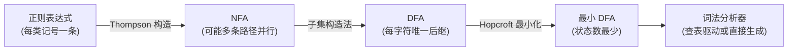

## 前置知识

- 编译器五阶段（词法 -> 语法 -> 语义 -> 中间代码 -> 目标代码）的整体流程（见 [编译原理](cs-fundamentals/420-CompilePrinciple)）；
- 正则表达式的基本语法；
- 自动机的直觉（见 [形式语言与自动机](cs-fundamentals/530-FormalLanguageAndAutomata)，可后置补读）。

## 学习目标

- 区分模式、词素、记号三个术语；
- 理解词法分析为什么能用"正则表达式 -> 自动机"完全自动化；
- 亲手实现一个能识别关键字、标识符、数字与运算符的词法分析器；
- 掌握最长匹配等工程细节与常见陷阱。

## 1. 概念引入：先切词，再理解句子

读英文句子时，你的眼睛其实在做两步工作：先把字符流切成一个个单词（"the cat sat"），再分析语法（主谓宾）。编译器同理。源程序送进编译器时只是一串字符：

```text
int rate = 17;
```

对后续阶段而言，逐字符处理太低效也太混乱（`rate` 与 `rate17` 的差别、空格与注释该忽略……）。**词法分析器（Lexer/Scanner）**的职责就是把这串字符流切分成有意义的单元——**记号（token）**流：

```text
[关键字 int] [标识符 rate] [赋值号 =] [数字 17] [分号 ;]
```

每个记号携带两类信息：**类别**（它是什么：关键字/标识符/数字）与**词素**（原文长什么样）。后续的 [语法分析](cs-fundamentals/440-GrammarAnalysis) 只看记号流，不再关心空格与换行。

### 三个必须分清的术语

| 术语 | 含义 | 例子（`int count = 0;`） |
| ---- | ---- | ------------------------ |
| 模式（pattern） | 一类词素的识别规则 | "字母开头，后接字母或数字" |
| 词素（lexeme） | 源码中匹配模式的具体字符串 | `count`、`int`、`0` |
| 记号（token） | 词素的分类单元 | `<id, "count">`、`<kw_int>` |

## 2. 词法文法为什么用正则表达式

标识符、数字这类"词"的结构非常规律：正则表达式恰好能精确描述它们：

```text
标识符:  letter (letter | digit)*
数字:    digit+ ( '.' digit+ )?          // 整数或小数
空白:    (' ' | '\t' | '\n')+
```

正则表达式、非确定有限自动机（NFA）、确定有限自动机（DFA）三者表达能力相同（正则语言），而 DFA 匹配一个字符只需查一次表、时间与输入长度成正比。这就构成了词法分析的经典自动化管线：



工程上不必手工走完全流程：**flex、RE2 等工具**吃进一组正则就能吐出完整 DFA 分析器；而理解流程能让你诊断"为什么这个语法我写不出来"（答：因为它不是正则的，比如嵌套括号配对）。

## 3. 手写词法分析器：完整实现

多数真实编译器（GCC、Clang 前端）选择手写词法分析——比生成的 DFA 更快、报错更可控。下面是一个可直接编译运行的最小实现：

```c
/* lexer_full.c：识别关键字、标识符、整数、小数、运算符与分号 */
#include <stdio.h>
#include <ctype.h>
#include <string.h>

typedef enum { TK_INT, TK_IF, TK_ID, TK_NUM,
               TK_ASSIGN, TK_PLUS, TK_EQ, TK_SEMI, TK_EOF } Kind;

typedef struct { Kind kind; char text[64]; long num; int line; } Token;

static const char *src;
static int line = 1;

static Kind keyword_kind(const char *s) {
    if (!strcmp(s, "int")) return TK_INT;
    if (!strcmp(s, "if"))  return TK_IF;
    return TK_ID;
}

static Token next(void) {
    Token t; memset(&t, 0, sizeof t);
    while (*src == ' ' || *src == '\t') src++;
    while (*src == '\n') { line++; src++; }
    t.line = line;

    if (*src == '\0') { t.kind = TK_EOF; return t; }

    if (isdigit((unsigned char)*src)) {          /* 数字 */
        long v = 0;
        while (isdigit((unsigned char)*src)) {
            v = v * 10 + (*src - '0');
            strncat(t.text, src++, 1);
        }
        if (*src == '.') {                       /* 小数：继续吃进词素，数值仍存整数部分 */
            strncat(t.text, src++, 1);
            while (isdigit((unsigned char)*src))
                strncat(t.text, src++, 1);
        }
        t.kind = TK_NUM; t.num = v;
        return t;
    }

    if (isalpha((unsigned char)*src) || *src == '_') {  /* 标识符/关键字 */
        while (isalnum((unsigned char)*src) || *src == '_')
            strncat(t.text, src++, 1);
        t.kind = keyword_kind(t.text);           /* 查关键字表 */
        return t;
    }

    switch (*src++) {                            /* 单字符与双字符运算符 */
    case '=':
        if (*src == '=') { src++; t.kind = TK_EQ; strcpy(t.text, "=="); }
        else { t.kind = TK_ASSIGN; strcpy(t.text, "="); }
        return t;
    case '+': t.kind = TK_PLUS;  strcpy(t.text, "+");  return t;
    case ';': t.kind = TK_SEMI;  strcpy(t.text, ";");  return t;
    default:
        fprintf(stderr, "第 %d 行：无法识别的字符 '%c'\n", line, src[-1]);
        t.kind = TK_EOF;
        return t;
    }
}

int main(void) {
    src = "int rate = 17; rate = rate + 1;";
    for (;;) {
        Token t = next();
        const char *names[] = {"INT", "IF", "ID", "NUM",
                               "ASSIGN", "PLUS", "EQ", "SEMI", "EOF"};
        printf("<%s, %s>\n", names[t.kind], t.text);
        if (t.kind == TK_EOF) break;
    }
    return 0;
}
```

运行输出：

```text
<INT, int>
<ID, rate>
<ASSIGN, =>
<NUM, 17>
<SEMI, ;>
<ID, rate>
<ASSIGN, =>
<ID, rate>
<PLUS, +>
<NUM, 1>
<SEMI, ;>
<EOF, >
```

## 4. 识别策略的关键细节

- **最长匹配（maximal munch）**：遇到 `rate17` 应切成一个标识符而不是 `rate` 加 `17`；遇到 `===` 应先匹配 `==` 再剩 `=`。实现上总是"能多吃一个字符就多吃"，失败了再回退。上文数字与 `==` 的处理都体现了这一原则。
- **关键字优先于标识符**：`int` 在词法上完全符合标识符模式，所以通用做法是先按标识符读完整词，再查关键字表定类别。
- **符号表登记**：标识符词素应送入符号表（后续 [语义分析](cs-fundamentals/450-SemanticAnalysis) 的核心数据结构），记号里可只存指向符号表的指针，避免重复存储。
- **错误处理**：词法层常见错误是非法字符与未闭合字符串。成熟编译器会"跳过并继续"扫描，一次报出多个错误，而不是见错就停。

## 5. 常见陷阱与调试

- **以为正则能搞定一切**：嵌套结构（配对括号、注释嵌套）超出正则表达能力，需要交给语法层处理；词法层的注释处理通常用"状态机特判"而非纯正则。
- **回退与缓冲区**：手写扫描器常需要"多看一个字符再决定"（如 `=` 与 `==`）；用哨兵结尾的双缓冲是经典工程方案，小玩具实现里用"记录位置再回退"即可。
- **行号与位置信息**：记号不携带行列号，后续阶段的报错就无从谈起。扫描时顺手记录，是最低成本、最高回报的工程习惯。
- **`++` 与 `+ +`**：词法层只认最长匹配，`a+++b` 会被切成 `a ++ + b`——语法层再报错。语言设计者要为此负责（C++ 的" maximal munch "规则由此产生过无数陷阱题）。

## 6. 实战场景

- **语法高亮与编辑器**：VS Code 的 TextMate 语法本质是一组带优先级的正则——就是简化版词法分析。
- **日志与协议解析**：把日志行、CSV、简单协议文本切成字段，用 DFA/正则驱动比手写字符串查找更可维护。
- **配置与 DSL**：任何配置语言（如 nginx conf、TOML）的第一步都是词法分析；flex/RE2 等生成器让"定义一门小语言"的成本降到几小时。

## 小结

初学者要点：

- 词法分析把字符流切成记号流，屏蔽空白与注释，为语法分析提供干净的输入。
- 模式/词素/记号三概念：模式是规则，词素是原文，记号是分类。
- 词法语法规约可用正则表达式描述，由 NFA->DFA 自动化识别；工具（flex、RE2）与手写（GCC/Clang 风格）两条路线并存。
- 最长匹配、关键字查表、位置信息是三个必须做对的工程细节。

进阶注意：

- 正则语言有表达力边界，嵌套结构必须上移到语法层；这也是乔姆斯基层次的实际分界（见 [形式语言与自动机](cs-fundamentals/530-FormalLanguageAndAutomata)）。
- 符号表在词法阶段建立初稿，供语义阶段做作用域分析；记号携带位置信息是一切诊断能力的前提。
- 性能敏感场景下手写扫描器通常快于生成的 DFA（分支预测与缓存友好），这是工业编译器的普遍选择。
