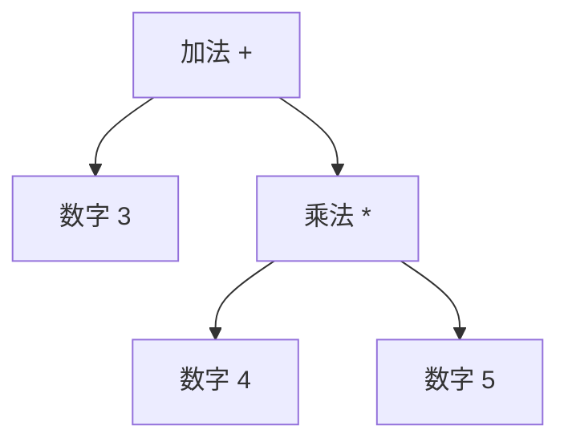

## 前置知识

- 词法分析输出的记号流概念（见 [词法分析](cs-fundamentals/430-LexicalAnalysis)）；
- 树形数据结构与递归的熟练使用；
- 四则运算的结合性与优先级的直觉。

## 学习目标

- 理解上下文无关文法（CFG）如何定义程序结构，能读懂 BNF 产生式；
- 掌握自顶向下（递归下降/LL）与自底向上（LR 家族）两大流派的原理与取舍；
- 亲手写出一个支持优先级与括号的四则运算递归下降解析器，产出 AST；
- 认识二义性、左递归、悬空 else 等经典问题。

## 1. 概念引入：从"单词"到"结构"

词法分析后的记号流仍是一维序列：

```text
NUM(3)  PLUS(+)  NUM(4)  STAR(*)  NUM(5)
```

要执行 `3 + 4 * 5`，还必须知道它构成"3 加上（4 乘 5）"而不是"(3 加 4) 乘 5"。**语法分析器（Parser）**的职责就是把记号流组织成一棵**语法树（AST）**——程序的形状被显式表达出来：



一个类比：语法分析像划分句子成分——"咬死了猎人的狗"有两种划分（咬死了 | 猎人的狗 或 咬死了猎人的 | 狗），自然语言存在歧义；程序设计语言必须消除歧义，让每段代码只有一棵语法树。

## 2. 上下文无关文法（CFG）

### 2.1 产生式与推导

CFG 用四元组描述：终结符（记号）、非终结符（结构名）、开始符号、产生式规则。BNF 风格的经典表达式文法：

```text
expr   -> expr '+' term | term        （表达式：加法层级）
term   -> term '*' factor | factor    （项：乘法层级）
factor -> '(' expr ')' | NUM          （因子：括号或数字）
```

每条规则的 `|` 表示多个候选。从开始符号出发不断把非终结符替换为候选体（推导），直到只剩记号；**一个句子属于该语言，当且仅当能推导出来**。

### 2.2 为什么叫"上下文无关"

替换非终结符时只看它本身，不依赖它周围是什么——这种"局部展开"性质让解析可以用栈式自动机高效实现。与之对照，需要依赖上下文的检查（变量先声明后使用、类型匹配）推迟到 [语义分析](cs-fundamentals/450-SemanticAnalysis)。CFG 恰好处在表达力够用、解析可高效的甜点上（见 [形式语言与自动机](cs-fundamentals/530-FormalLanguageAndAutomata) 的乔姆斯基层次）。

### 2.3 二义性：一文法两棵树

如果把表达式文法简化成一条：

```text
E -> E '+' E | E '*' E | NUM
```

那么 `3 + 4 * 5` 有两棵推导树（先加还是先乘），文法就是**二义性**的。经典文法通过分层（expr/term/factor）把优先级编码进结构，从而消除二义性。另两个著名案例：

- **悬空 else**：`if (a) if (b) x; else y;` 中 else 属于哪个 if？多数语言规定就近匹配，并在文法中显式表达；
- **左递归**：`E -> E '+' term` 让自顶向下解析器无限递归，必须改写（见下）。

## 3. 自顶向下：递归下降与 LL(1)

### 3.1 思想

每个非终结符写一个函数，函数体按照产生式"预言"接下来会遇到什么记号；不匹配就报错。它直观、易手写、错误信息友好——GCC、Clang、V8、Go 全是手写递归下降（或其变体）。

### 3.2 关键技术：用分层消除左递归

文法 `expr -> expr '+' term | term` 是左递归的（expr 展开最右侧还是 expr），直接实现会无限递归。等价改写为右递归形式：

```text
expr  -> term expr'
expr' -> '+' term expr' | ε        （ε 表示空）
```

原表达式的**左结合性**靠"循环累积结果"在代码中恢复——这就是为什么实践中 `a - b - c` 能被正确算成 `(a - b) - c`。

### 3.3 LL(1) 的含义

第一个 L：从左到右扫描；第二个 L：最左推导；1：每步只需向前看 1 个记号就能在多个候选中做唯一选择。判据是 FIRST/FOLLOW 集合：两个候选的 FIRST 集不相交（或含 ε 时与 FOLLOW 不相交）即可 LL(1)。工程上，手工解析器常用"回溯或多看几个记号"放松这个限制，换取更自然的文法书写。

## 4. 自底向上：LR 家族一瞥

与自顶向下相反，LR 分析**从叶子（记号）往根构造**，用栈暂存"已识别的前缀"，依据下一个记号决定：

- **移进（shift）**：把记号压栈；
- **归约（reduce）**：栈顶的若干符号恰好构成某条产生式右部，弹出并压入左部非终结符。

LR(0)、SLR、LALR(1)、LR(1) 是自动化程度与状态表大小的折中谱系：LALR(1) 以接近 SLR 的表大小获得接近 LR(1) 的能力，是 **yacc/bison** 的基础。LR 类分析器能力更强（能处理的文法是 LL 的真超集），但表由工具生成、错误信息与可调试性差于手写递归下降——这正是现代编译器普遍转向手写 LL 的原因。

| 维度 | 递归下降 / LL | yacc/bison / LR |
| ---- | ------------- | ---------------- |
| 实现方式 | 手写函数 | 工具生成状态表 |
| 文法限制 | 需消除左递归，LL(1) 较严 | 几乎任意无二义文法 |
| 错误诊断 | 极好（可带上下文提示） | 一般 |
| 性能 | 快（函数调用即分析） | 快（查表驱动） |
| 典型用户 | GCC、Clang、Go、V8 | 早期编译器、Shell、PostgreSQL |

## 5. 完整示例：四则运算递归下降解析器

```c
/* parser.c：解析 3 + 4 * (5 - 2) 并求值，展示优先级与括号处理 */
#include <stdio.h>
#include <ctype.h>

static const char *s;          /* 输入串（已省略词法层，直接按字符解析） */

static void skip(void) { while (isspace((unsigned char)*s)) s++; }

static int expr(void);                     /* 前向声明：factor 中括号要回到最高层 */

/* factor -> NUM | '(' expr ')' */
static int factor(void) {
    skip();
    if (*s == '(') {           /* 括号：递归回到最高层，天然处理嵌套 */
        s++;
        int v = expr();
        skip();
        if (*s == ')') s++; else printf("错误：缺少右括号\n");
        return v;
    }
    int v = 0;
    while (isdigit((unsigned char)*s)) v = v * 10 + (*s++ - '0');
    return v;
}

/* term -> factor ((' * '|'/') factor)*   优先级高，先算 */
static int term(void) {
    int v = factor();
    for (;;) {
        skip();
        if (*s == '*') { s++; v *= factor(); }
        else if (*s == '/') { s++; v /= factor(); }
        else return v;
    }
}

/* expr -> term (('+'|'-') term)*   优先级低，后算；左结合由循环保证 */
static int expr(void) {
    int v = term();
    for (;;) {
        skip();
        if (*s == '+') { s++; v += term(); }
        else if (*s == '-') { s++; v -= term(); }
        else return v;
    }
}

int main(void) {
    s = "3 + 4 * (5 - 2)";
    printf("结果 = %d\n", expr());   /* 期望 15：先算括号 3，再乘 4 得 12，再加 3 */
    return 0;
}
```

运行输出：`结果 = 15`。三层函数的调用深度就是文法的分层结构——**优先级由函数所在层级决定（越深层处理的运算符优先级越高，factor 层的括号能重新回到顶层），结合性由"循环还是递归"决定（循环=左结合）**。真实解析器在求值处改为构造 AST 节点，原理不变。

## 6. 常见陷阱与调试

- **把优先级写反**：应让高优先级运算符处于**更深**的层级（factor 层），初学者常把乘除放在 expr 层导致 `2+3*4` 先算加法。
- **左结合写成右结合**：用右递归实现减法/除法会把 `8-3-2` 算成 `8-(3-2)=7`；检查方法是拿连续同优先级运算符测试。
- **忘记处理 ε（空产生式）**：`expr' -> ε` 意味着该函数在"看不到后续记号"时要**直接返回**而不是报错。
- **错误恢复**：遇到非法记号就退出是玩具做法；工业解析器会丢弃记号直到同步点（分号、右括号）再继续，以便一次编译报出全部语法错误。
- **歧义症状**：若同一输入每次解析结果不稳定或工具报 shift/reduce 冲突，优先怀疑文法二义性，其次才是工具配置。

## 7. 实战场景

- **配置文件与 DSL**：INI、nginx 配置、SQL 的 WHERE 子句，用 100 行递归下降即可实现，比正则拼接健壮得多。
- **计算器与公式引擎**：Excel 公式、指标查询（PromQL 类）都是"表达式文法 + AST 求值"的直接应用。
- **编辑器支持**：Tree-sitter 用 GLR/LR 变体为 VS Code、Neovim 提供容错语法树——语法分析技术的现代衍生品。
- **协议解析**：路径、查询串等小型上下文无关结构，递归下降同样适用。

## 小结

初学者要点：

- 语法分析把记号流组织成 AST；CFG/BNF 产生式描述程序结构，分层文法编码优先级。
- 自顶向下（递归下降/LL）：一个非终结符一个函数，直观易调试；需消除左递归，左结合用循环实现。
- 自底向上（LR 家族）：移进-归约 + 状态表，能力更强，通常由 yacc/bison 生成。
- 二义性文法会产生多棵语法树，必须通过改写文法或显式规则消除。

进阶注意：

- LL(1) 的判定依赖 FIRST/FOLLOW 集合；工程解析器常放松"只看 1 个记号"的限制以换取文法可读性。
- 现代主流编译器（GCC/Clang/Go/V8）选择手写递归下降，核心理由是错误诊断与可维护性，而非纯理论能力。
- 解析器只负责"形状"，名字与类型的合法性检查属于语义分析（符号表与作用域），两层职责不要混淆。
