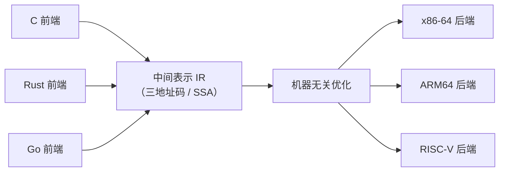

## 前置知识

- 编译器前端产出带类型信息的语法树（见 [语义分析](cs-fundamentals/450-SemanticAnalysis)）；
- 控制流概念：顺序、分支、循环在底层都由"有条件/无条件跳转"实现；
- 图的基础知识（有向图、可达性），SSA 构造需要支配树。

## 学习目标

- 理解中间表示（IR）的动机：把 m 种语言 x n 种机器的翻译问题降为 m + n；
- 掌握三地址码的指令形态与四元组表示，能手工把 AST 翻译为三地址码；
- 理解 SSA 的两条铁律（单赋值、φ 函数）及其对优化的价值；
- 了解 SSA 构造的三步流程：支配树 -> 支配边界 -> 插入 φ 并重命名。

## 1. 概念引入：世界语与翻译办公室

一个类比：某翻译公司要服务 m 种源语言和 n 种目标语言。若每个语言对配一名译员，需要 m x n 名；改用"所有源语言先译成世界语，再从世界语译成任一目标语言"，只需 m + n 名。**中间代码就是编译器的世界语**：前端（语言相关）只负责翻到 IR，后端（机器相关）只负责从 IR 翻到目标指令，中间的优化器在 IR 上运转，全体语言与全体机器共享。



LLVM 是这个思想最成功的现代实现：Clang（C/C++）、Rust、Swift 的前端都产出 LLVM IR，后端覆盖数十种 CPU——前端的 m 与后端的 n 各自独立扩展。

## 2. 三地址码：最经典的教科书 IR

### 2.1 指令形态

三地址码（TAC, Three-Address Code）每条指令**至多三个地址（操作数）**：`x = y op z`。复杂表达式必须拆成一串单步运算，中间结果存进**临时变量**（`t1`、`t2`…）。指令类别：

```text
x = y op z      二元运算        x = op y      一元运算
x = y           拷贝
if x relop y goto L    条件跳转
goto L                 无条件跳转
x = y[i] / x[i] = y    带下标访问（数组）
x = call f(a, b)       函数调用
return y               返回
```

### 2.2 四元组表示

内存中的标准编码是四元组 `(op, arg1, arg2, result)`：

```text
t1 = b + c        ->   ( +,  b,  c,  t1 )
t2 = a * t1       ->   ( *,  a,  t1, t2 )
```

由语义分析产出的语法树自底向上翻译即得（类型检查已保证运算合法，见 [语义分析](cs-fundamentals/450-SemanticAnalysis)）。

### 2.3 完整示例：从源代码到三地址码

```c
/* 源代码 */
while (i < n) {
    s = s + a[i];
    i = i + 1;
}
```

翻译成三地址码（`L1` 是循环头标号）：

```text
      L1:
      if i < n goto L2      /* 条件为真进循环体 */
      goto L3               /* 否则退出 */
      L2:
      t1 = i * 8            /* 数组下标换算：long 占 8 字节 */
      t2 = a[t1]            /* 取 a[i] */
      t3 = s + t2
      s  = t3
      t4 = i + 1
      i  = t4
      goto L1
      L3:
      ...
```

注意两点：复合条件/循环被规约到"比较 + 条件跳转 + goto"的原语；数组访问拆成"下标乘元素大小 + 按地址取值"。**控制流图（CFG）**随后登场：把上述指令按标号切成基本块，块间用跳转连边——它是后文 SSA 与一切数据流分析（见 [代码优化](cs-fundamentals/470-CodeOptimization)）的舞台。

## 3. SSA：为优化而生的表示

### 3.1 两条铁律

**静态单赋值（SSA, Static Single Assignment）**在 TAC 上追加一条规则：**每个变量只允许被赋值一次**。变量每次"变化"都诞生一个新版本：

```text
普通形式             SSA 形式
i = i + 1     ->     i2 = i1 + 1
```

被拆散的版本号让"这个值从哪来"一目了然：`i3 = i2 + i1` 中的两个操作数一定来自不同赋值点，依赖关系显式可见。

### 3.2 φ 函数：汇合点的选择器

控制流汇合处（if 的两个分支合流、循环头），一个变量有了两个"前世"，用 **φ（phi）函数**按来路挑选：

```c
/* 源代码 */            /* SSA */
if (c) x = 1;           if (c) x1 = 1;
else   x = 2;           else   x2 = 2;
y = x;                  y1 = phi(x1, x2);   /* 走真分支取 x1，否则取 x2 */
```

### 3.3 SSA 为什么值钱

- **use-def 链免费**：每个使用的定义唯一，常量传播、死代码消除等优化从"全程序搜索"退化为"沿引用走一步"；
- **活性一目了然**：某变量再无使用，相关计算即可删；
- **寄存器分配友好**：SSA 变量互不冲突，天然接近"每值一寄存器"的理想，干扰图构造更直接（见 [目标代码生成](cs-fundamentals/480-TargetCodeGeneration)）。LLVM IR、V8 的 TurboFan（Sea of Nodes 变体）、Go 编译器（SSA backend）都以 SSA 为核心表示。

## 4. SSA 构造：三步走

把普通 TAC 变成 SSA 的经典算法（Cytron 算法）流程：

### 4.1 支配树

**支配（dominate）**：从入口到节点 n 的所有路径都经过节点 d，则 d 支配 n。**直接支配者（idom）**是离 n 最近的支配者；所有 idom 边连成**支配树**。直觉：支配者是"绕不开的关卡"，变量在关卡之后必然统一版本。

### 4.2 支配边界

**支配边界（dominance frontier, DF）**：节点 n 的 DF 是这样一些节点 p 的集合——n 支配 p 的某个前驱，但 n 不严格支配 p。通俗说：**DF(n) 是"n 的版本信息从这里开始不再唯一"的汇合点**。

### 4.3 插入 φ 并重命名

```text
算法骨架（伪代码）：
1. 计算 CFG 的支配树与每个节点的 DF；
2. 对每个被多次赋值的变量 v：
     把 v 的所有定义点放入工作表；
     逐个取出定义点 d，对 DF(d) 中的每个节点 p：
       在 p 开头插入 v = phi(v, v, ...)（参数个数 = p 的前驱数）；
       若 p 原本不是 v 的定义点，把该 phi 也当作新定义加入工作表（迭代直至不动点）；
3. 沿支配树 DFS 重命名：进入节点时给定义分配新版本号，
   到达 phi 所在节点时把来自不同前驱的实参替换为对应版本。
```

DF 的意义在于精确性：只在真正需要的汇合点插 phi，既保证语义正确（SSA 的 phi 语义要求"所有来路版本已知"），又不浪费。

## 5. 完整示例：手工构造一次 SSA

对第 2.3 节的 while 循环（变量 `i`、`s` 被循环反复赋值），先建 CFG：块 B0（入口）-> B1（循环头判断）-> B2（循环体）-> B1，B1 -> B3（出口）。B1 有两个前驱（B0、B2），是汇合点，即 B2 的 DF 包含 B1。

```text
B0:                     i1 = 0
                        s1 = 0
                        goto B1

B1:  循环头（汇合点）    i2  = phi(i1, i3)      /* 两个前驱各供一个版本 */
                        s2  = phi(s1, s3)
                        if i2 < n goto B2 else goto B3

B2:  循环体              t1 = i2 * 8
                        t2 = a[t1]
                        s3 = s2 + t2
                        i3 = i2 + 1
                        goto B1

B3:  出口                return s2
```

读法演示：`i2 = phi(i1, i3)` 表示"第一次进循环取 B0 的 i1（初值 0），之后每圈取 B2 算出的 i3"。SSA 把"循环累计"这种时序概念显式编码成了数据流图——优化器随后可以在此图上做归纳变量强度削减（`i2*8` 可变为逐圈累加 8）、循环不变量外提等变换（见 [代码优化](cs-fundamentals/470-CodeOptimization)）。

## 6. 常见陷阱与调试

- **把 IR 当目标代码读**：三地址码里的临时变量数量在优化后会剧变（CSE 合并、死代码删除）；`gcc -O0 -S` 与 `clang -emit-llvm` 的输出差异巨大，别拿未优化的中间码评价编译器质量。
- **φ 函数语义误解**：phi 不是"运行时再算"，而是"按控制流来路静态选择版本"；带副作用表达式不能放进 phi（phi 只挑值）。
- **DF 计算错误导致 phi 缺失**：漏算某个汇合点，SSA 前后语义不再等价，典型症状是开优化后结果错误（只在特定分支路径触发）。
- **SSA 与可变变量的互转损耗**：出 SSA（销毁 phi）时寄存器分配可能引入复制指令，衡量优化收益要在"进 SSA 前 vs 出 SSA 后"对比。
- **循环中的下标换算**：`a[i]` 的地址计算在 IR 层面就应显式（乘元素大小 + 基址），优化器对它的化简（归纳变量）依赖这一显式形式，前端翻译偷懒会堵死后端优化。

## 7. 实战场景

- **读 LLVM IR**：`clang -S -emit-llvm -O2 a.c` 产出的 `.ll` 是全 SSA 文本 IR，`opt -passes=...` 可单步观察每个优化 pass 前后的形态，是学习编译器最直接的实验台。
- **字节码也是 IR**：JVM 字节码、CPython 字节码、WASM 都是"以栈/寄存器机器为模型的中间表示"，思想同源——语言只编译到稳定的 IR，解释器/JIT 负责 IR 到 CPU 的最后一步。
- **JIT 与 AOT 共用 IR**：V8/PyPy 在运行时收集类型信息后重编译热点函数，复用的正是同一套 IR 与优化管线——IR 设计的前向兼容直接决定运行时演进空间。

## 小结

初学者要点：

- 中间代码把"m 种语言到 n 种机器"降为 m + n：前端产 IR、后端吃 IR、优化在 IR 上做。
- 三地址码每条指令至多三个地址，复合运算与数组访问拆成单步，控制流归约为跳转。
- SSA 要求每个变量只赋值一次，汇合点用 phi 选择版本；它让 use-def 链显式化，是一切现代优化的地基。

进阶注意：

- CFG 与支配树是 SSA 构造的前提；支配边界精确定位 phi 的插入点，Cytron 算法三步（支配树 -> DF -> 插入与重命名）是标准流程。
- LLVM IR/字节码/WASM 表明"IR"谱系横跨编译器中间层到发布格式，设计权衡（栈式 vs 寄存器式、文本 vs 二进制）服务于不同目标。
- 手工把小段代码翻译成 TAC/SSA 是最有效的练习：while 循环 + 数组 + if 分支足以覆盖全部核心概念。
