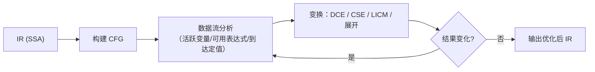

## 前置知识

- 三地址码与 SSA 形式（见 [中间代码](cs-fundamentals/460-IntermediateCode)）——现代优化几乎全部在 SSA 上进行；
- 控制流图（CFG）与基本块的概念；
- 程序语义的朴素共识："优化前后对合法输入的可观测行为一致"。

## 学习目标

- 理解优化的铁律：语义等价（不能改变合法程序的可观测行为），以及"激进优化 + 未定义行为"的边界；
- 掌握三类经典优化的机制：局部（常量传播/折叠、死代码消除、公共子表达式消除）、循环（不变量外提、展开、强度削减）、全局（数据流分析框架）；
- 会用 `gcc -O0` 与 `-O2` 对比观察真实优化效果；
- 理解 `volatile`、副作用、浮点运算如何"锁住"优化器。

## 1. 概念引入：抄近路的守则

一个类比：你替人送一叠文件（程序指令），发现途中三条路：

1. 两份文件内容一模一样，送一份复印一份即可（**公共子表达式消除**）；
2. 收件人已搬家，这趟根本不用跑（**死代码消除**）;
3. 每层楼都要算"上一层走几级台阶"，改成"逐层加 8"更快（**强度削减**）。

守则只有一条：**最终送达的东西必须和原来一字不差**（语义等价）。抄近路出错的代价是整趟任务报废——程序输出变了，再快的代码也是错的。

另一个关键认知：**优化不能弥补算法劣势**。O(n^2) 换 O(n log n) 是程序员的职责；编译器优化通常带来常数倍（工程经验 2-5 倍，`-O0` 到 `-O2` 常见 2-3 倍），量级差距它无能为力。

## 2. 优化分类与安全性

### 2.1 按作用范围分类

| 层级 | 范围 | 代表优化 |
| ---- | ---- | ---- |
| 局部优化 | 单个基本块内 | 常量折叠、公共子表达式消除、死代码消除 |
| 循环优化 | 循环体（热点担当） | 不变量外提、展开、强度削减 |
| 全局优化 | 整个函数（跨基本块） | 数据流分析驱动的各类变换 |
| 过程间优化 | 跨函数/编译单元 | 内联、跨过程常量传播 |

循环优化单独成类的原因：程序 90% 的时间花在循环里（90/10 规则），循环里省一条指令等价于普通代码省千条。

### 2.2 安全性与正确性

编译器只做**保守变换**：除非能证明"所有可能输入下行为不变"，否则不动手。证明依赖对语言语义的精确理解，而**未定义行为（UB）是激进优化的通行证**——C 标准说有符号溢出是 UB，编译器就默认"它不会发生"，据此删除看似合理的检查（著名的"检查 `n + 1 < n` 防溢出被优化删除"）。安全语言（Rust/Java）以定义良好但更严格的语义换取优化空间与安全性。

## 3. 局部优化：基本块内三板斧

### 3.1 常量传播与常量折叠

- **常量折叠**：编译期直接算出常量表达式。`x = 2 * 3 + 4` -> `x = 10`；
- **常量传播**：已知变量是常量，沿数据流替换。`n = 10; ... y = n * 2` -> `y = 20`。

两者通常交替迭代直到不动点：传播出新常量 -> 触发折叠 -> 又产生新常量。

### 3.2 死代码消除（DCE）

删除"算了出来没人用"或"控制流永不可达"的代码：

```text
t1 = a * b       t1 从未被使用 -> 整条删除
if (0) { ... }   恒假分支 -> 整块删除
```

在 SSA 上特别轻松：一个值没有使用者，删；删完别的值可能也失去使用者，迭代到收敛。调试版宏 `#ifdef DEBUG` 的代码、写完后没接线的中间结果都由此清理。

### 3.3 公共子表达式消除（CSE）

```c
/* 优化前 */                  /* 优化后 */
x = (a + b) * c;              t = a + b;      /* 只算一次 */
y = (a + b) * d;              x = t * c;
                              y = t * d;
```

前提是两个 `a + b` 之间 `a`、`b` 都没有被重新赋值（可用表达式分析保证）。它是对"程序员不写临时变量"的补偿，让源代码可以保持自然风格。

## 4. 循环优化：性能主战场

### 4.1 循环不变量外提（LICM）

循环内不随迭代变化的计算挪到循环外：

```c
/* 优化前 */                      /* 优化后 */
for (i = 0; i < n; i++)           limit = scale * base;  /* 提出循环 */
    a[i] = x * scale * base;      for (i = 0; i < n; i++)
                                      a[i] = x * limit;
```

`scale * base` 每圈算一次纯属浪费。编译器靠"定义点在循环外"（SSA 的 use-def 链）判定不变性。注意指针别名（`scale` 与 `a` 可能指向同一内存）会阻止外提——这是 C 优化器反复吃亏的地方，`restrict` 关键字就是为解除这种怀疑而生。

### 4.2 强度削减

用廉价运算替换昂贵运算：

```text
乘法 -> 加法/移位：x * 8  ->  x << 3
循环内乘法 -> 逐圈加法：
  t = i * 8（每圈）      ->  t 初始 0，每圈 t = t + 8
除以常量 -> 乘逆元 + 移位（编译器对 x / 10 的经典重写）
```

它是对机器特性（移位比乘法快、寻址自带增量）的适配，多与归纳变量分析联动完成。

### 4.3 循环展开

把循环体复制 N 份、迭代次数除以 N，减少循环本身的比较与跳转开销，同时给指令级并行和向量化（SIMD）铺路：

```c
/* 展开因子 4（示意） */
for (i = 0; i < n - 3; i += 4) {
    s += a[i]; s += a[i+1]; s += a[i+2]; s += a[i+3];   /* 4 次迭代合并 */
}
for (; i < n; i++) s += a[i];                            /* 余数处理 */
```

代价是代码膨胀（指令缓存压力）；现实编译器由成本模型决定是否展开，常作为自动向量化的前置步骤。

## 5. 全局优化：数据流分析

### 5.1 分析框架

全局优化回答跨基本块的问题（"到达这里时 x 一定等于 5 吗"），通用解法是**数据流分析**：对每个程序点维护一组事实（方程解），沿 CFG 正向/反向迭代求不动点。两个经典例子：

### 5.2 活跃变量分析（反向）

在程序点 p，变量 v **活跃**表示"p 到出口的某条路径还会读 v"。反向传播（从出口往入口推）计算。用途：寄存器分配的干扰图构建（同时活跃的变量不能共用寄存器，见 [目标代码生成](cs-fundamentals/480-TargetCodeGeneration)）、死代码删除的判定（对死变量赋值即死代码）。

### 5.3 可用表达式分析（正向）

表达式 `a+b` **可用**表示"到 p 为止所有路径都已算过且 a、b 未见修改"。它是 CSE 跨基本块推广的理论基础，与活跃变量一样是不动点迭代的教科书案例。



迭代收敛（"结果变化?"回路）是数据流分析的运行形态：变换可能打开新的优化机会（删掉一段代码让另一个表达式变为可用），因此**优化 pass 以固定顺序反复跑**，直到某个 pass 无事可做。

## 6. 完整示例：`-O0` 与 `-O2` 的实测对比

```c
/* opt_demo.c */
#include <stdio.h>

int main(void) {
    int sum = 0;
    const int n = 1000000;
    for (int i = 0; i < n; i++) {
        sum += i * 3;              /* 每圈乘 3：强度削减的对象 */
    }
    printf("%d\n", sum);           /* 观测点：防止整个循环被删 */
    return 0;
}
```

分别编译并对比汇编核心部分：

```bash
gcc -O0 -S opt_demo.c -o o0.s
gcc -O2 -S opt_demo.c -o o2.s
grep -A3 'movl.*-4(%rbp)' o0.s | head -4   # -O0：逐条翻译，老老实实的循环
```

`-O0` 的循环体（节选）：

```asm
movl -8(%rbp), %eax     /* 取 i */
imull $3, %eax, %eax    /* i * 3：真的在乘 */
addl %eax, -4(%rbp)     /* sum += ... */
```

`-O2` 的循环体（节选）：

```asm
addl $3, %eax           /* 每圈只加 3：乘法削减为增量 */
```

更强的优化器（`-O3`/clang）会进一步用闭式解直接算出 `3 * n*(n-1)/2`，整个循环消失。这个实验还演示了一条铁律：**有观测点（printf）的代码才能留下循环**——纯计算且结果未使用的循环会被 DCE 整体删除，这也是微基准测试必须消费结果的原因。

## 7. 常见陷阱与调试

- **以为 volatile = 线程同步**：`volatile` 只禁止编译器缓存/重排对它的访问，不提供原子性与内存序。线程同步请用语言提供的原子类型/锁；`volatile` 的正岗是内存映射寄存器与信号处理标志。
- **副作用挡住优化却不知情**：函数调用可能修改全局状态（除非证明纯函数），`printf` 这类有副作用的调用绝不能删——看起来"无用"的打印让循环活了下来，就是这个原理。
- **浮点优化误判**：`(a + b) + c != a + (b + c)` 在浮点下可能成立（舍入），CSE/重结合默认不做跨浮点的重排；`-ffast-math` 打开后优化变激进，数值程序的结果可能漂移。
- **用未定义行为写"聪明的检查"**：`if (n + 1 < n)` 检测溢出会被优化删除（有符号溢出是 UB）。防溢出用无符号运算或 `__builtin_add_overflow`。
- **微基准被优化器掏空**：计时区间内只算不用的代码整体蒸发，测出"每秒十亿次"的假象。对策：结果累加后打印/写入 volatile 变量，或使用成熟基准框架（Google Benchmark 的 `DoNotOptimize`）。

## 8. 实战场景

- **读懂编译器告警**：`variable set but not used`（DCE 前置分析）、`loop not vectorized: ...`（向量化失败原因）都直接来自优化器分析，读告警就是在读数据流分析的结论。
- **性能关键代码的写法配合**：循环内不调用未知函数（内联与外提的前置）、用 `restrict` 消除别名怀疑、数据布局连续（利于向量化）——"编译器友好"的本质是给优化器可证明的条件。
- **JIT 与 PGO**：运行时（JIT）按实测热点做激进的推测优化；PGO（基于性能剖面的优化）把生产流量特征喂给 AOT 编译器，让展开/内联/分支布局有据可依。

## 小结

初学者要点：

- 优化铁律是语义等价；收益来源是消除冗余计算、减少循环开销、适配机器特性。
- 局部三板斧：常量传播/折叠（编译期算出）、死代码消除（删无人使用的计算）、公共子表达式消除（重复计算只算一次）。
- 循环是主战场：不变量外提、强度削减、展开分别消灭"每圈重复劳动"、"昂贵运算"与"循环开销"。

进阶注意：

- 全局优化由数据流分析驱动：活跃变量（反向）、可用表达式（正向）迭代求不动点；优化 pass 互相开启机会，需反复迭代。
- UB、副作用、浮点语义、指针别名是优化器的"禁区地图"，写性能敏感代码要先懂禁区再谈技巧。
- `-O0` vs `-O2` 汇编对比是最直接的实验方法；微基准必须给优化器留观测点，否则测的是空气。
