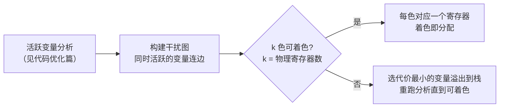

## 前置知识

- CPU 寄存器与内存的层次：寄存器最快但数量有限（x86-64 通用寄存器 16 个）；
- 中间代码（三地址码/SSA）与优化后的形态（见 [中间代码](cs-fundamentals/460-IntermediateCode) 与 [代码优化](cs-fundamentals/470-CodeOptimization)）；
- 指令流水线的基本概念：相邻指令存在数据依赖时需要等待（冒险）。

## 学习目标

- 说清代码生成器的三件事：指令选择、寄存器分配、指令调度，以及它们的顺序与耦合；
- 理解图着色寄存器分配（干扰图、k 着色、溢出）与线性扫描（JIT 首选）的取舍；
- 了解树模式匹配/DAG 覆盖如何把 IR 映射到复杂指令；
- 能读懂一段简单的 x86-64 汇编并指出寄存器分配与调度的痕迹。

## 1. 概念引入：把图纸变成施工方案

一个类比：优化后的 IR 是一份**抽象施工图纸**（"把 A 与 B 相加，结果放 C"），目标代码生成是把它落到**具体工地**：

- 工地只有 16 个工具台（寄存器），材料（变量/临时值）太多就得轮换着上台——**寄存器分配**；
- 同一个"相加"，可以用不同型号的设备完成（`add`、`lea` 顺手加法、向量 `paddd`）——**指令选择**；
- 工序可以重排，让上一个工位的结果还没干时别的工位先干别的——**指令调度**。

三件事互相牵制：换指令会改变对寄存器的需求，分配不满又迫使指令间插入搬运。编译器后端的复杂度正在于这是**约束下的组合优化**。

## 2. 目标机器模型与代码生成任务

代码生成器面对的目标机器抽象：

```text
- 寄存器组：通用寄存器（x86-64: rax/rbx/rcx/... 16 个）+ 专用（rsp/rbp）
- 指令集：算术、访存（mov 带多种寻址模式）、跳转、SIMD 向量
- 调用约定：参数放哪些寄存器、返回值在哪、哪些寄存器由调用方保存（caller-saved）、
  哪些由被调用方保存（callee-saved）——跨函数边界的"合同"
```

生成流程（以 LLVM 为例）：优化后的 SSA IR -> 指令选择（变成目标指令的"伪指令"序列）-> 寄存器分配（虚拟寄存器映射到物理寄存器）-> 指令调度 -> 输出汇编/机器码。顺序上分配在调度之前，因为"哪些值在寄存器里"决定了哪些指令可以提前。

## 3. 寄存器分配：后端的心脏

### 3.1 问题定义

IR 中变量数不设限（虚拟寄存器随便用），物理寄存器只有 k 个。分配的目标：让尽可能多的值驻留寄存器，放不下的值**溢出（spill）**到栈帧，代价是每次读写多一条访存指令。

### 3.2 图着色分配（Chaitin 算法）

经典思路把分配化归为图着色：



- **干扰图**：节点是变量（SSA 下天然"每值一节点"），若两个变量的活跃区间重叠（不能共用寄存器）则连边；
- **k 着色**：给节点染 k 种颜色、相邻不同色——同色即可共用同一寄存器；
- **溢出**：图色数 > k 时，挑"使用次数少/代价低"的变量请出寄存器，插入加载/存储后活跃区间缩短，迭代至可着色。

图着色质量高（全局最优的近似），但迭代构建干扰图的开销大，AOT 编译器（gcc/clang/LLVM 默认路径）普遍采用。

### 3.3 线性扫描分配

把所有变量的活跃区间投影到指令序号轴上，从左到右单趟扫描：区间结束就回收寄存器，放不下就溢出最远的那个。**一趟、快、质量略逊**——JIT（V8、JVM 的 C1、LuaJIT）对编译延迟敏感，线性扫描（或其变体）是标配；AOT 编译器对 -O0 快速编译也用它。

### 3.4 完整示例：手工分配一次

对优化后的循环（见 [代码优化](cs-fundamentals/470-CodeOptimization) 的示例）：

```text
IR：                            x86-64 汇编（分配后）：
L:                              L:
  t = i * 3                       ; i 活跃于整个循环 -> 分配 eax
  sum = sum + t                   ; t 只活两条指令 -> 复用 eax
  i = i + 1                       addl $3, %eax        ; t 与 i 复用同一寄存器
  if i < n goto L                 cmpl %ebx, %eax      ; n -> ebx
                                  jl L
```

读法：`i`（eax）与 `t` 的活跃区间不重叠，编译器把两者放进同一个寄存器；`sum` 被存储/复用，`n` 驻留 ebx 直到循环结束。这正是第 6 节实测汇编能"每圈只加 3"的原因——分配器让乘法结果与循环变量共用 eax，削减后的加法直接在 eax 上累积。

## 4. 指令选择：从 IR 到指令集

同一 IR 操作在 CISC 指令集上往往有多种实现，选择的目标是覆盖成本最小：

```text
a + b * 8  的候选实现：
  movl %ebx, %eax
  imull $8, %eax, %eax     ; 两步：乘法
  addl %ecx, %eax          ; 加法

  leal (%ecx,%ebx,8), %eax ; 一步：x86 的 lea 指令自带 [基址+变址*比例] 寻址
```

`lea` 覆盖"基址 + 变址 x 比例 + 偏移"的复合表达式，是指令选择收益的招牌例子（`a*5` 也常被写成 `lea (%eax,%eax,4)`）。系统化方法：

- **树模式匹配**：把每条指令描述为一棵小树（模式），IR 表达式树与模式库匹配，动态规划选总成本最小的覆盖；
- **DAG 覆盖**：基本块内先合并公共子表达式成 DAG，再对 DAG 做覆盖，顺带完成块内 CSE。

## 5. 指令调度：让流水线吃饱

现代 CPU 流水线深（十到二十级），后一条指令用到前一条的结果时需要等待（数据冒险）。**列表调度**在基本块内重排指令：维护"就绪指令"集合（依赖已满足），按延迟/关键路径优先逐条发射，把长延迟指令（如访存）与其他无依赖指令交错填充等待窗口。

```text
重排前（两条连续依赖链）          重排后（两条链交错）
load  x     (慢, 约 20 周期)      load  x
add   x, 1                       load  y        ; 趁 x 未就绪先发射 y 的加载
load  y     (又要等 20)          add   x, 1     ; x 到位，加
add   y, 1                       add   y, 1
总周期 ≈ 46                       总周期 ≈ 26
```

x86-64 上硬件乱序执行（OoO）大幅掩盖了静态调度的收益，但硬件窗口有限（几百条），**长依赖链与高频访存代码仍受益**；GPU、DSP、VLIW（如 Itanium、部分嵌入式 DSP）没有强力硬件乱序，静态调度是性能的决定性因素。

## 6. 完整示例：读懂后端产物

```c
/* codegen_demo.c：观察调用约定与寄存器分配 */
#include <stdio.h>

static long scale_sum(long a, long b, long c) {
    return a * 2 + b + c;          /* 简单到必然分配在寄存器内完成 */
}

int main(void) {
    printf("%ld\n", scale_sum(1, 2, 3));
    return 0;
}
```

```bash
gcc -O2 -S codegen_demo.c -o codegen_demo.s
grep -A4 'scale_sum:' codegen_demo.s
```

典型输出：

```asm
scale_sum:
        leaq    (%rdi,%rdi), %rax     # a*2：lea 一步完成（指令选择）
        addq    %rsi, %rax            # + b
        addq    %rdx, %rax            # + c
        ret                           # 返回值按约定放 rax
```

System V AMD64 调用约定在产物中清晰可见：前三个整型参数依次经 `rdi`、`rsi`、`rdx` 传入，返回值放 `rax`——这正是第 2 节"调用约定合同"的实体。整个函数没有一条访存指令：参数全程驻留寄存器（分配成功），`a*2` 被 lea 吸收（选择成功）。改成 `gcc -O0` 再看，参数会被逐个压入栈再取回——分配与选择全部"偷懒"，这就是优化等级在后端的直接体现。

## 7. 常见陷阱与调试

- **寄存器溢出误判为算法问题**：热点函数变量太多（大数组下标、长表达式），分配器被迫频繁溢出，汇编里 `mov` 密度异常高。对策：缩小函数作用域、减少同时活跃的临时值，让"局部小函数"给分配器留空间。
- **忽略调用约定破坏 ABI**：内联汇编或手写汇编写坏 caller-saved/callee-saved 约定，错误只在特定调用路径偶发。跨界代码必须逐条对照平台 ABI 文档。
- **指令调度依赖具体微架构**：为某代 CPU 手工调度的序列在新架构（执行单元数量变化）上可能变慢；除非面向固定硬件（游戏主机、DSP），信任编译器调度。
- **把 -O0 汇编当机器真实水平**：`-O0` 不分配（几乎全走栈）、不选择（逐条直译），读后端产物做性能判断请用 `-O2` 以上。
- **溢出代码放置错误**：早期算法把溢出的加载放在定义点，可能拖慢整个循环；现代分配器做溢出代码放置优化（split/spill 重排），读旧教材算法时注意该差异。

## 8. 实战场景

- **性能分析与反汇编阅读**：perf 定位热点后 `objdump -d` 看汇编，判断是访存瓶颈（mov 密集）、分配不佳（栈往返）还是依赖链过长——本文三个环节正是读汇编的"语法"。
- **JIT 后端**：JavaScript/Java/JIT Lua 的快速编译路径用线性扫描 + 简单选择，把"可运行"优先于"最优"；理解取舍能解释"为什么 JIT 代码比 AOT 慢一点但首次执行快得多"。
- **嵌入式与内核**：内联汇编、启动代码、中断处理程序要手工对齐寄存器约定与调度；编译器选项（`-march`）会改变指令选择库，交叉编译时目标架构参数不可省。

## 小结

初学者要点：

- 代码生成三件事：指令选择（IR -> 真实指令）、寄存器分配（虚拟值 -> 16 个物理寄存器）、指令调度（重排指令填满流水线）。
- 寄存器不够就溢出到栈，每次溢出都是额外的访存；分配质量直接决定热点代码速度。
- 调用约定（参数/返回值寄存器、保存责任）是函数间的硬件合同，汇编层面的一切传参规则都来自它。

进阶注意：

- 图着色分配质量高但慢（AOT 主用）；线性扫描一趟完成，是 JIT 与 -O0 的现实选择；SSA 的"每值一节点"让干扰图构造更直接。
- 指令选择的收益常在"复合寻址"（lea）与 SIMD 指令覆盖上；树模式匹配/DAG 覆盖是系统化实现。
- 静态调度在乱序硬件上收益有限但在 VLIW/DSP/GPU 上是决定性的；读真实后端产物请以 -O2 为准，调用约定与溢出密度是两个最快的诊断入口。
