## 1. 设计原则

### 1.1 SOLID原则

```
SOLID原则 -- 面向对象设计的五个基本原则:

S - Single Responsibility (单一职责):
  一个类只有一个引起变化的原因
  高内聚: 每个类只做一件事

  反例: Employee类同时负责数据存储和报表生成
  正例: Employee类 + EmployeeReportGenerator类

O - Open/Closed (开闭原则):
  对扩展开放, 对修改关闭
  通过抽象和多态实现

  反例: 修改switch语句添加新类型
  正例: 定义接口, 新类型实现接口

L - Liskov Substitution (里氏替换):
  子类对象必须能替换父类对象而不破坏正确性
  子类不应强化前置条件, 不应弱化后置条件

  反例: Square继承Rectangle, 但setWidth影响height
  正例: Square和Rectangle都实现Shape接口

I - Interface Segregation (接口隔离):
  客户端不应依赖它不使用的接口
  接口应小而专注

  反例: 一个"胖"接口包含所有方法
  正例: 拆分为多个小接口, 客户端按需依赖

D - Dependency Inversion (依赖倒置):
  高层模块不应依赖低层模块, 两者都应依赖抽象
  抽象不应依赖细节, 细节应依赖抽象

  反例: 业务逻辑直接依赖数据库实现类
  正例: 业务逻辑依赖Repository接口, 数据库类实现接口
```

### 1.2 其他设计原则

```
DRY (Don't Repeat Yourself):
  每个知识片段在系统中有唯一表示
  重复代码 -> 提取公共方法/基类

KISS (Keep It Simple, Stupid):
  保持简单, 避免过度设计
  最简单的能工作的方案就是最好的

YAGNI (You Aren't Gonna Need It):
  不要预先实现当前不需要的功能
  避免基于猜测的过度抽象

组合优于继承:
  优先使用对象组合而非类继承
  继承: 白箱复用 (可见父类实现细节)
  组合: 黑箱复用 (只通过接口交互)

迪米特法则 (Law of Demeter):
  一个对象应该对其他对象有最少的了解
  只与直接朋友通信, 不与陌生人通信
  a.getB().getC().doSomething()  -- 违反
  a.doSomethingWithB()           -- 遵守
```

> 跨模块引用：[操作系统](os)的内核架构（宏内核vs微内核）体现了开闭原则和接口隔离原则。[计算机网络](network)的协议栈分层是单一职责和依赖倒置的体现。[体系结构](architecture)的ISA是依赖倒置的经典案例。

---

## 2. 创建型模式

### 2.1 Singleton (单例)

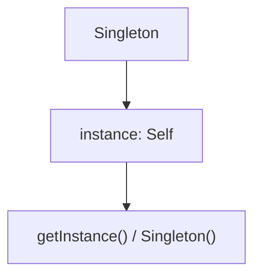

### 2.2 Factory Method (工厂方法)

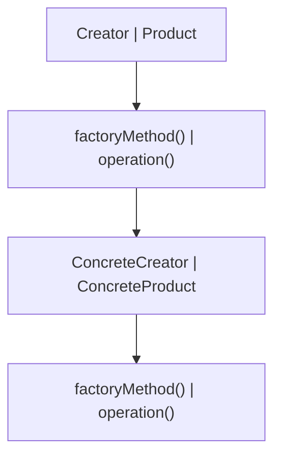

### 2.3 Abstract Factory (抽象工厂)

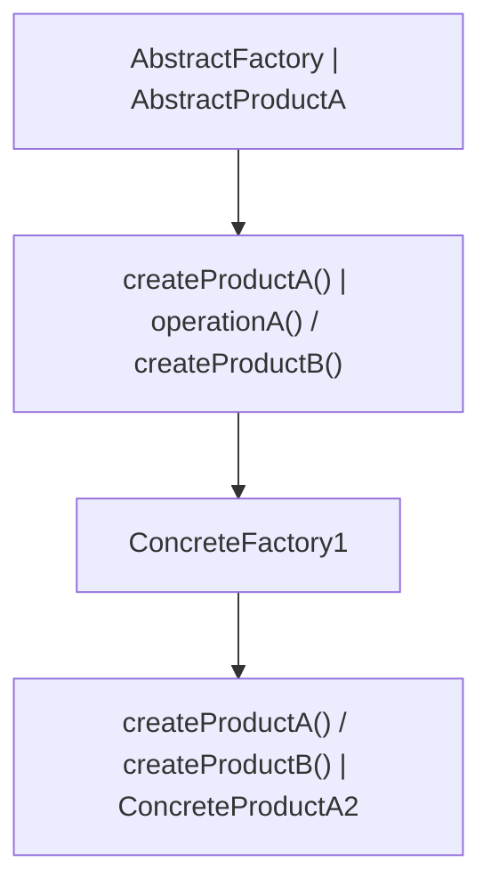

### 2.4 Builder (建造者)

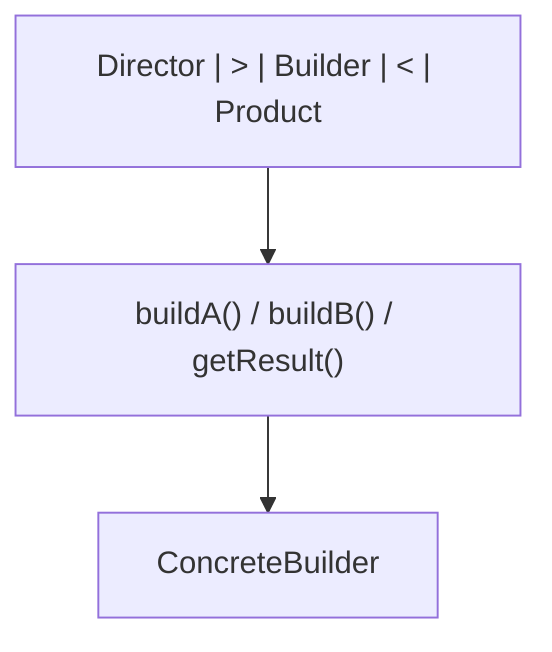

### 2.5 Prototype (原型)

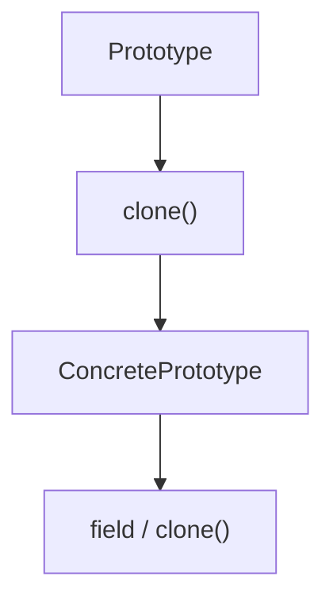

---

## 3. 结构型模式

### 3.1 Adapter (适配器)

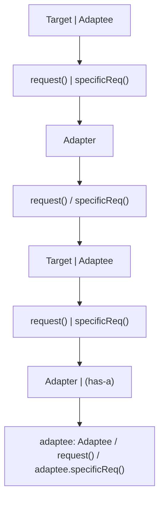

### 3.2 Decorator (装饰器)

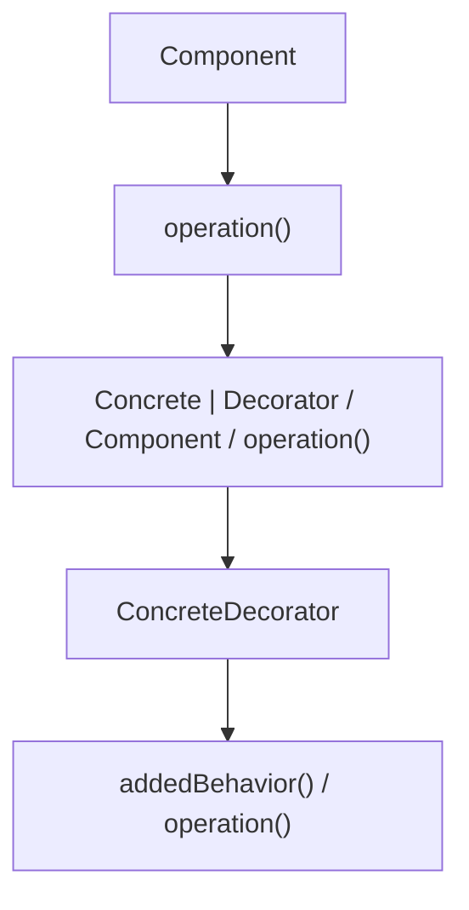

### 3.3 Composite (组合)

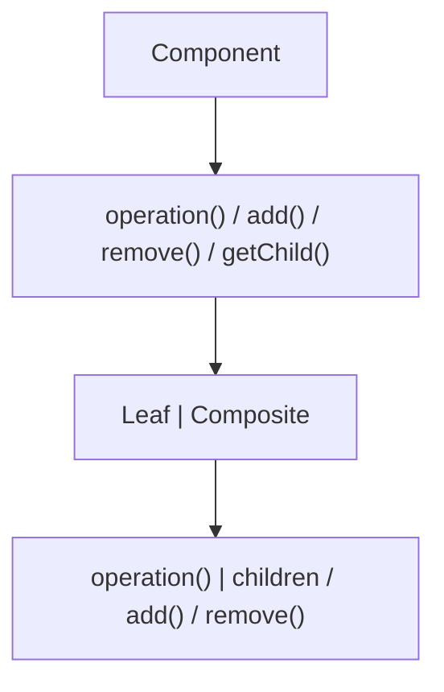

### 3.4 Facade (外观)

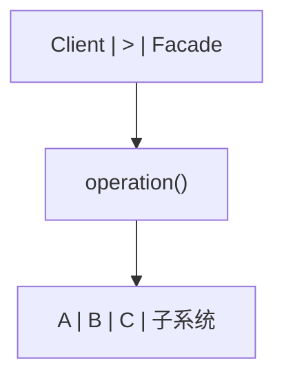

### 3.5 Proxy (代理)

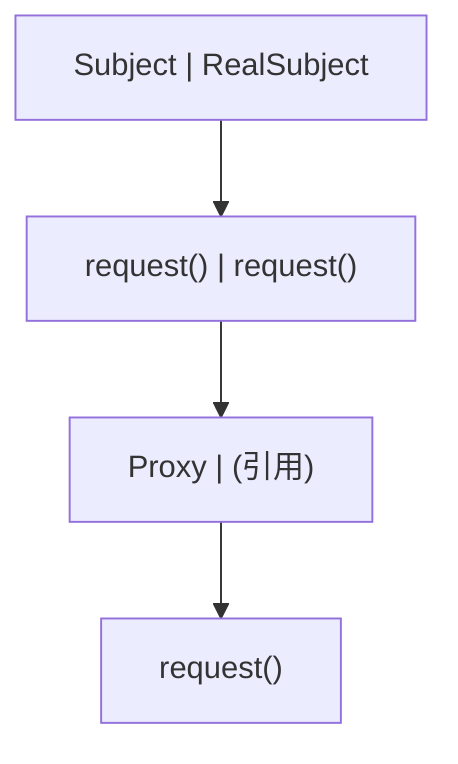

---

## 4. 行为型模式

### 4.1 Strategy (策略)

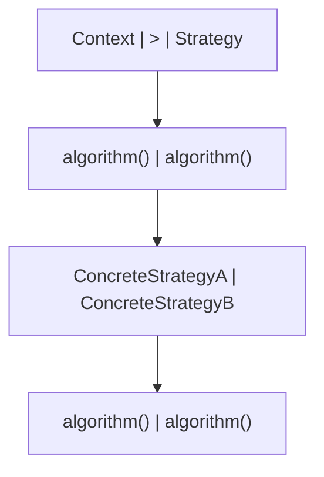

### 4.2 Observer (观察者)

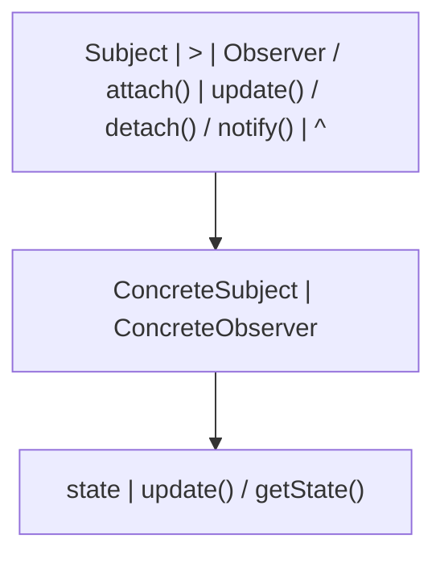

### 4.3 State (状态)

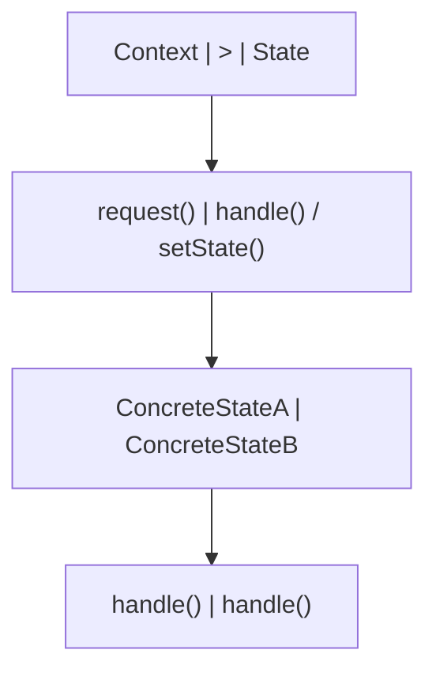

### 4.4 Command (命令)

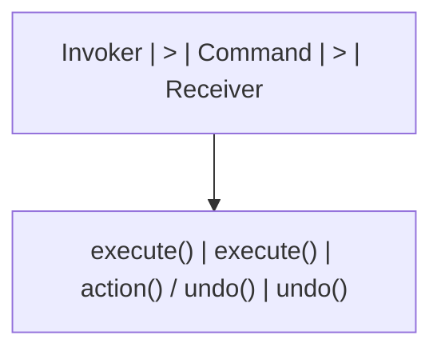

### 4.5 Iterator (迭代器)

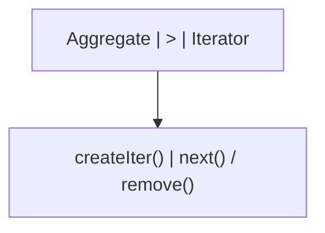

### 4.6 Template Method (模板方法)

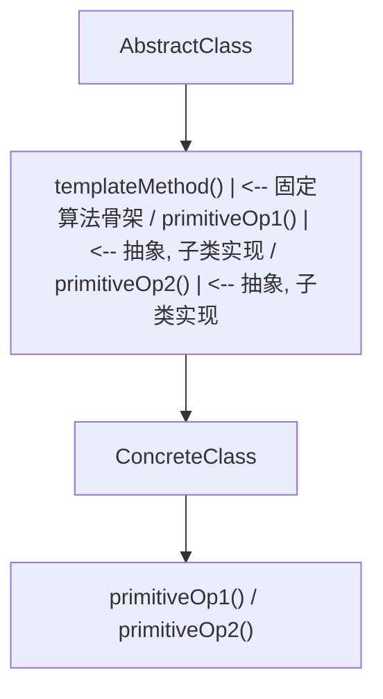

---

## 5. 模式关系与选择

### 5.1 模式间的协作

```
常见模式组合:

1. Factory + Strategy:
   工厂根据配置创建具体策略对象

2. Composite + Iterator:
   组合结构使用迭代器遍历

3. Observer + Mediator:
   中介者协调观察者间的通信

4. Decorator + Factory:
   工厂创建装饰后的对象

5. Command + Composite:
   宏命令是命令的组合

6. State + Strategy:
   状态模式是策略模式的动态版本
   状态切换自动发生, 策略由客户端选择
```

### 5.2 模式选择决策树

```
创建对象?
  |-- 是: 创建型模式
  |   |-- 一个实例? -> Singleton
  |   |-- 由子类决定? -> Factory Method
  |   |-- 一族对象? -> Abstract Factory
  |   |-- 复杂构建? -> Builder
  |   |-- 克隆已有? -> Prototype
  |
接口不匹配?
  |-- 是: 结构型模式
  |   |-- 接口转换? -> Adapter
  |   |-- 添加职责? -> Decorator
  |   |-- 树形结构? -> Composite
  |   |-- 简化接口? -> Facade
  |   |-- 控制访问? -> Proxy
  |   |-- 共享对象? -> Flyweight
  |
行为问题?
  |-- 是: 行为型模式
  |   |-- 算法切换? -> Strategy
  |   |-- 状态变化? -> State
  |   |-- 通知依赖? -> Observer
  |   |-- 封装请求? -> Command
  |   |-- 遍历集合? -> Iterator
  |   |-- 算法骨架? -> Template Method
  |   |-- 对象通信? -> Mediator
  |   |-- 请求链? -> Chain of Responsibility
```

### 5.3 模式的代价

```
设计模式不是银弹, 每个模式都有代价:

1. 增加类的数量:
   每个模式通常引入1-3个新类
   系统复杂度增加

2. 间接层增加:
   更多接口和抽象层
   调试和跟踪更困难

3. 性能开销:
   虚方法调用 (Strategy, State)
   对象创建 (Factory, Prototype)
   额外引用 (Decorator, Proxy)

4. 过度设计:
   不必要的抽象增加理解成本
  "当你有3个以上子类时再考虑模式"

何时不用模式:
  - 问题很简单, 直接方案足够
  - 团队不熟悉模式, 增加沟通成本
  - 性能是首要约束
  - 需求不稳定, 抽象可能白费
```

---

## 6. 并发模式

### 6.1 Producer-Consumer (生产者-消费者)

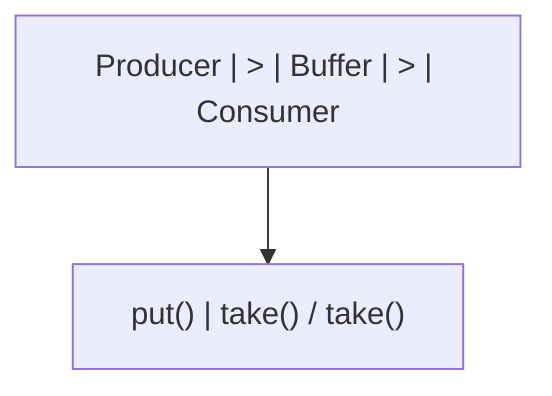

### 6.2 Read-Write Lock (读写锁)

```
意图: 允许多个读者同时访问, 但写者独占访问

状态机:
           读者进入          写者进入
  空闲 -------> 读锁 -------> 写锁
   ^              |              |
   |              | 读者退出     | 写者退出
   +--------------+--------------+

伪代码:

class ReadWriteLock {
    int readers = 0;
    boolean writing = false;

    synchronized void readLock() throws InterruptedException {
        while (writing) wait();
        readers++;
    }

    synchronized void readUnlock() {
        readers--;
        if (readers == 0) notifyAll();
    }

    synchronized void writeLock() throws InterruptedException {
        while (readers > 0 || writing) wait();
        writing = true;
    }

    synchronized void writeUnlock() {
        writing = false;
        notifyAll();
    }
}

跨模块引用: [操作系统](os)的读写锁 (pthread_rwlock)。
  [Java](java/overview)的ReentrantReadWriteLock。
  [体系结构](architecture)的缓存一致性协议 (MESI) 是读写锁的硬件实现。
```

### 6.3 Thread Pool (线程池)

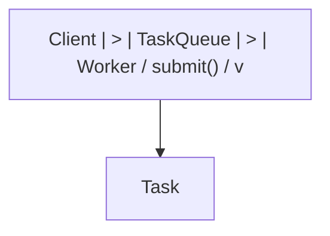

---

## 7. 速查表

### 7.1 创建型模式速查

| 模式             | 意图             | 关键词        |
| ---------------- | ---------------- | ------------- |
| Singleton        | 唯一实例         | 全局访问点    |
| Factory Method   | 子类决定创建     | 延迟到子类    |
| Abstract Factory | 创建一族对象     | 产品族        |
| Builder          | 分步构建复杂对象 | 链式调用      |
| Prototype        | 克隆创建对象     | 深拷贝/浅拷贝 |

### 7.2 结构型模式速查

| 模式      | 意图           | 关键词         |
| --------- | -------------- | -------------- |
| Adapter   | 接口转换       | 兼容性         |
| Decorator | 动态添加职责   | 包装器         |
| Composite | 树形结构       | 部分-整体      |
| Facade    | 简化接口       | 统一入口       |
| Proxy     | 控制访问       | 延迟/保护/远程 |
| Flyweight | 共享细粒度对象 | 对象池         |
| Bridge    | 分离抽象与实现 | 多维度变化     |

### 7.3 行为型模式速查

| 模式            | 意图           | 关键词         |
| --------------- | -------------- | -------------- |
| Strategy        | 算法族互换     | 消除条件语句   |
| Observer        | 一对多通知     | 发布-订阅      |
| State           | 状态驱动行为   | 状态机         |
| Command         | 封装请求       | 撤销/队列/日志 |
| Iterator        | 顺序访问       | 遍历集合       |
| Template Method | 算法骨架       | 好莱坞原则     |
| Mediator        | 对象间通信中介 | 解耦交互       |
| Chain of Resp.  | 请求处理链     | 逐级处理       |
| Visitor         | 分离操作与结构 | 双分派         |
| Memento         | 保存恢复状态   | 撤销快照       |

### 7.4 SOLID速查

| 原则 | 含义     | 对应模式                            |
| ---- | -------- | ----------------------------------- |
| SRP  | 单一职责 | Facade, Mediator                    |
| OCP  | 开闭原则 | Strategy, Observer, Template Method |
| LSP  | 里氏替换 | 所有使用继承的模式                  |
| ISP  | 接口隔离 | Adapter, Facade                     |
| DIP  | 依赖倒置 | Factory, Strategy, Observer         |
