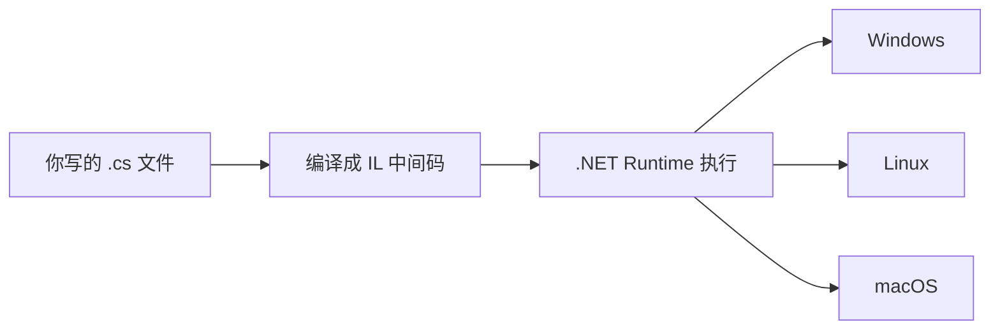

## C# 在技术版图中的位置

C#（读作 C Sharp）是微软 .NET 平台的主力语言。它的应用版图横跨：**企业服务端**（ASP.NET Core，与 Java Spring 定位相当）、**Windows 桌面应用**（WPF）、**游戏开发**（Unity 引擎使用 C# 作为脚本语言，全球过半手游由 Unity 驱动）、**跨平台客户端**（MAUI）。

一句话定位：**语法气质接近 Java 的现代企业语言，外加游戏开发这张王牌。**

## 它如何运行：虚拟机路线

C# 与 Java 走同一条技术路线——编译成中间语言，由运行时执行：



现代 .NET（自 .NET 5 起统一）是真正跨平台的开源运行时，Linux 服务器上运行 C# 服务已是常规操作。自动内存管理与垃圾回收同样内置，初学者无需手动管内存。

## 第一行代码的现代方式

安装 .NET SDK 后，两行命令创建并运行项目：

```bash
dotnet new console -o Hello   # 生成控制台项目模板
cd Hello && dotnet run        # 运行
```

打开生成的 `Program.cs`，核心只有一行：

```csharp
Console.WriteLine("你好，C#");
```

较新版本的模板甚至省略了类的声明骨架——微软在不断降低入门样板代码。你可以把这一行改成循环：

```csharp
for (int i = 1; i <= 100; i++)
{
    Console.WriteLine($"第 {i} 次问候");
}
```

`$"..."` 是字符串插值，花括号里可以直接放变量，与 Kotlin 的 `$name` 异曲同工。

## 动手环节：修改并观察

把输出文字换成自己的名字；再加一个 `if` 判断，让程序在数字大于 50 时输出"过半了"。保存后 `dotnet run`，立即看到效果。**改一点、跑一次**的节奏与任何语言通用。

## 常见困惑

**"C、C++、C# 是一家吗？"**——C# 由微软设计，语法借鉴了 C++ 与 Java，但它是独立的现代语言，与 C/C++ 没有源码层面的兼容关系。名字里的井号取自音乐记号"升半音"，寓意"比 C++ 更进一步"。

**"学 C# 能做什么方向？"**——三大主流：.NET 企业后端、Unity 游戏逻辑、Windows 桌面与跨平台客户端。语法基础完全一致，方向差异在框架层。

## 下一步

进入 [C# 概述与环境搭建](/csharp/002-CSharpOverviewEnvSetup) 开始主线；面向对象部分建议与 java 模块对照学习，两者概念一一对应、语法互证。
