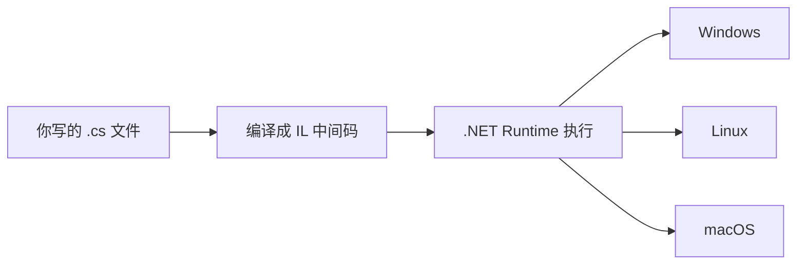
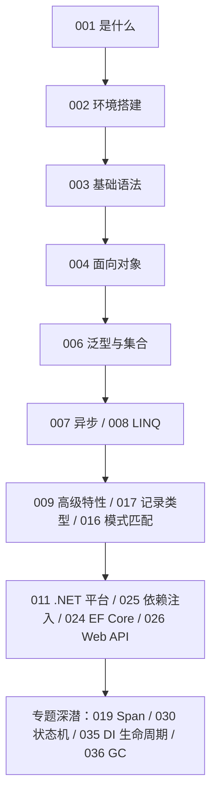

## C# 在技术版图中的位置

C#（读作 C Sharp）是微软 .NET 平台的主力语言。它的应用版图横跨：**企业服务端**（ASP.NET Core，与 Java Spring 定位相当）、**Windows 桌面应用**（WPF）、**游戏开发**（Unity 引擎使用 C# 作为脚本语言，全球过半手游由 Unity 驱动）、**跨平台客户端**（MAUI）。

一句话定位：**语法气质接近 Java 的现代企业语言，外加游戏开发这张王牌。**

## 它如何运行：虚拟机路线

C# 与 Java 走同一条技术路线——编译成中间语言，由运行时执行：



## 它如何运行：编译、IL 与运行时

上面说"编译成中间语言"，实际链条比一句话更长，值得初学者建立正确的心智模型：

1. **编译期**：Roslyn 编译器把 `.cs` 源码翻译成 **IL**（Intermediate Language，中间语言）和元数据，打包成 `.dll` 程序集。此时类型检查已经完成——绝大多数错误在你运行之前就被拦下。
2. **运行期（JIT）**：.NET Runtime 把 IL **按方法**即时编译成本机机器码，并做分层优化（先快速出结果，热点代码再深度优化）。
3. **运行期（AOT，可选）**：发布时直接把全部 IL 预编译成本机码（Native AOT），牺牲一点灵活性换取毫秒级启动与更小内存占用，是服务端小服务与客户端分发的热门选择。

自动内存管理与垃圾回收同样内置，初学者无需手动管内存。这套"IL + 运行时 + GC"的组合与 JVM 是同一思路，所以 C# 与 Java 的性能特征、生态形态也高度相似。

现代 .NET（自 .NET 5 起统一）是真正跨平台的开源运行时，Linux 服务器上运行 C# 服务已是常规操作。

## 版本现状：先记住两条线

C# 的版本号与 .NET 的版本号是两条线，每年 11 月同步发布一个大版本：

| C# 版本 | 随附 .NET | 发布时间 | 代表特性 |
|---------|-----------|---------|---------|
| C# 12 | .NET 8（LTS） | 2023.11 | 主构造函数、集合表达式 |
| C# 13 | .NET 9（STS） | 2024.11 | `params` 集合、`Lock` 类型 |
| C# 14 | .NET 10（LTS） | 2025.11 | 扩展成员、`field` 关键字 |

初学者的选择很简单：**装最新的 LTS（长期支持版）**。企业新项目也推荐 LTS，因为它的安全支持期长达三年；STS（标准期限支持）只维护 18 个月。本模块的示例默认基于 .NET 10 / C# 14，绝大多数语法在 .NET 8 上同样可用。

## 第一行代码的现代方式

安装 .NET SDK 后，两行命令创建并运行项目：

```bash
dotnet new console -o Hello   # 生成控制台项目模板
cd Hello && dotnet run        # 运行
```

打开生成的 `Program.cs`，核心只有一行：

```csharp
Console.WriteLine("你好，C#");
```

较新版本的模板甚至省略了类的声明骨架——微软在不断降低入门样板代码。你可以把这一行改成循环：

```csharp
for (int i = 1; i <= 100; i++)
{
    Console.WriteLine($"第 {i} 次问候");
}
```

`$"..."` 是字符串插值，花括号里可以直接放变量，与 Kotlin 的 `$name` 异曲同工。

## 一个稍微完整的例子

下面的程序把"定义数据、处理数据、输出结果"三个环节都走了一遍。整个文件可直接替换 `Program.cs` 后 `dotnet run`：

```csharp
// 记录类型：一行定义一个不可变的数据结构（C# 9+）
record Student(string Name, int Score);

var students = new List<Student>
{
    new("张三", 82),
    new("李四", 95),
    new("王五", 74),
};

// LINQ：声明式地过滤、排序、投影
var top2 = students
    .Where(s => s.Score >= 80)
    .OrderByDescending(s => s.Score)
    .Take(2)
    .Select(s => $"{s.Name}({s.Score}分)");

foreach (var line in top2)
{
    Console.WriteLine(line);
}
```

运行输出：

```text
李四(95分)
张三(82分)
```

`record`、`Where`、字符串插值这些名字现在不必深究——它们分别对应本模块的[面向对象](/csharp/040-CSharpOOP)与 [LINQ](/csharp/110-CSharpLINQFunctionalProgramming) 章节。这里只需要体会：**C# 写起来可以非常简洁**。

## 动手环节：修改并观察

把输出文字换成自己的名字；再加一个 `if` 判断，让程序在数字大于 50 时输出"过半了"。保存后 `dotnet run`，立即看到效果。**改一点、跑一次**的节奏与任何语言通用。

## 与其他语言速览对照

| 维度 | C# | Java | Python |
|------|----|------|--------|
| 类型系统 | 静态强类型 | 静态强类型 | 动态类型 |
| 运行方式 | IL + JIT/AOT | 字节码 + JIT | 解释 + 字节码 |
| 主战场 | 企业后端、游戏（Unity）、桌面 | 企业后端、安卓 | 数据、脚本、AI |
| 异步模型 | `async/await`（C# 5 首创） | 虚拟线程 / CompletableFuture | `asyncio` |
| 包管理 | NuGet | Maven/Gradle | pip |

如果你有 Java 背景，几乎可以"平移"——类、接口、继承、泛型概念一一对应；如果你有 Python 背景，需要适应静态类型声明，但 `var`（类型推断）和 LINQ 会让你找回部分灵活感。

## 学习路线图

本模块文档按"语言基础 -> 语言进阶 -> 平台与框架 -> 专题深潜"四层组织，建议路径如下：



无需按编号线性通读：先走完主线（1-11），再按兴趣跳专题。每篇文档的 `related` 与文末"下一步"都给出了相邻节点。

## 常见困惑

**"C、C++、C# 是一家吗？"**——C# 由微软设计，语法借鉴了 C++ 与 Java，但它是独立的现代语言，与 C/C++ 没有源码层面的兼容关系。名字里的井号取自音乐记号"升半音"，寓意"比 C++ 更进一步"。

**"学 C# 能做什么方向？"**——三大主流：.NET 企业后端、Unity 游戏逻辑、Windows 桌面与跨平台客户端。语法基础完全一致，方向差异在框架层。

**"C# 只能在 Windows 上用吗？"**——不是。自 .NET Core（2016）起，.NET 就是一个开源跨平台运行时，Windows/Linux/macOS 均为一等公民；Docker 官方镜像、GitHub Actions 都对其有良好支持。

**" Unity 里的 C# 和这里学的一样吗？"**——语言层面一致，但 Unity 当前默认使用 C# 9 语法与 .NET Standard 2.1 API 子集，运行时为 Mono/IL2CPP（CoreCLR 迁移仍在推进中）。语法基础完全通用，详见[Unity 游戏开发两章](/csharp/370-CSharpGameDevUnity)。

## 下一步

进入 [C# 概述与环境搭建](/csharp/020-CSharpOverviewEnvSetup) 开始主线；面向对象部分建议与 java 模块对照学习，两者概念一一对应、语法互证。
