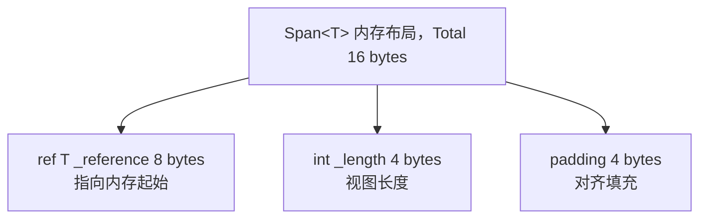
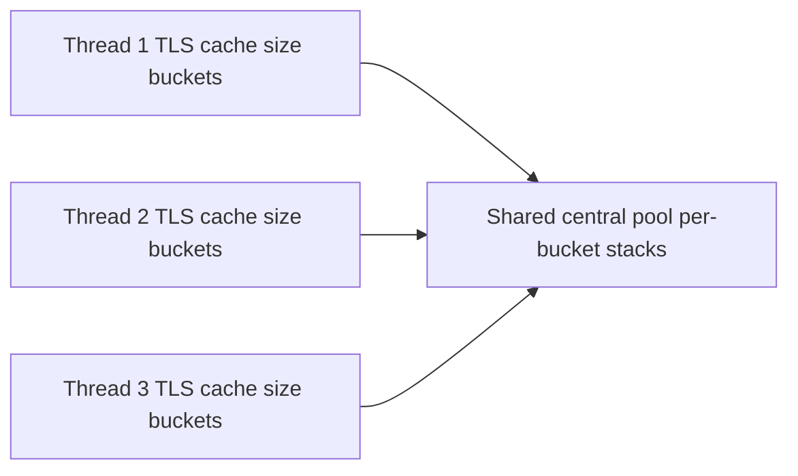

## 前置知识

- [泛型与协变逆变](/csharp/018-GenericCovarianceContravariance)：建议先完成前一篇的学习

## 学习目标

- 掌握「1. 历史动机与发展脉络」的核心机制、典型用法与常见陷阱
- 掌握「2. 形式化定义」的核心机制、典型用法与常见陷阱
- 掌握「3. 理论推导与原理解析」的核心机制、典型用法与常见陷阱
- 掌握「4. 代码示例」的核心机制、典型用法与常见陷阱
- 掌握「5. 对比分析」的核心机制、典型用法与常见陷阱


## 1. 历史动机与发展脉络

### 1.1 C/C++ 时代：指针与缓冲区溢出（1970s-2000s）

C 与 C++ 通过裸指针（`T*`）操作连续内存，性能极高但安全性极差。典型缺陷包括：

- **缓冲区溢出**（buffer overflow）：`memcpy(dst, src, n)` 中 `n` 超出 `dst` 容量，导致栈破坏、堆腐蚀。
- **悬垂指针**（dangling pointer）：返回栈数组指针，调用方解引用时栈帧已销毁。
- **越界访问**（out-of-bounds）：`arr[i]` 中 `i` 未检查，导致未定义行为（UB）。

1988 年 Morris 蠕虫利用 `fingerd` 缓冲区溢出感染数千台机器，成为安全史上里程碑事件。2014 年 Heartbleed（OpenSSL CVE-2014-0160）同样是缓冲区过度读取漏洞，影响全球 17% 的 HTTPS 服务器。

### 1.2 .NET 早期：托管数组与 IEnumerable（2002-2010）

.NET 1.0 通过托管堆（managed heap）与 `T[]` 数组提供内存安全：

```csharp
// .NET 1.0 风格
byte[] buffer = new byte[1024];
int n = stream.Read(buffer, 0, buffer.Length);
```

`T[]` 优势：

- 边界检查（bounds check）保证越界抛 `IndexOutOfRangeException`。
- GC 自动回收，无内存泄漏。

痛点：

- **分配开销**：每次 `new T[n]` 都触发堆分配，热路径（hot path）的 GC 压力大。
- **复制开销**：`Substring`、`Split`、`LINQ.ToList` 等操作产生大量中间字符串/数组。
- **切片低效**：`Array.Copy` 是 $O(n)$，无法 $O(1)$ 切片。
- **跨 P/Invoke 不便**：`byte[]` 需要 `fixed` 固定才能传给原生代码。

### 1.3 C# 7.2：Span<T> 的诞生（2017）

`Span<T>` 由 Krzysztof Cwalina（.NET BCL 标准库首席架构师）与 Stephen Toub（.NET 性能团队负责人）主导设计。设计动机：

1. **零拷贝切片**：对数组、字符串、原生内存提供统一的 $O(1)$ 切片视图。
2. **栈约束安全**：通过 `ref struct` 保证 `Span<T>` 不能逃逸到堆，避免 GC 跟踪复杂化。
3. **P/Invoke 友好**：`Span<T>` 可以直接包装 `stackalloc` 内存或原生指针。

C# 7.2 引入 `ref struct` 与 `Span<T>`：

```csharp
// C# 7.2 / .NET Core 2.1
Span<byte> stackBuf = stackalloc byte[256];
stackBuf[0] = 0x42;

ReadOnlySpan<char> hello = "Hello, World".AsSpan()[..5];
// hello = "Hello"，零分配
```

### 1.4 .NET Core 2.1：Span 标准化与生态（2018）

.NET Core 2.1 是 `Span<T>` 的"产业级发布"：

- `Span<T>`、`Memory<T>`、`ReadOnlySpan<T>`、`ReadOnlyMemory<T>` 进入 `System.Memory` NuGet 包，向后兼容 .NET Framework 4.6.1+。
- `string.AsSpan()`、`byte[].AsSpan()`、`Stream.Read(Span<byte>)`、`Utf8Parser`、`Utf8Formatter` 等核心 API 落地。
- ASP.NET Core 2.1 的 Kestrel 全面采用 `Span<T>` 重写，吞吐量提升 2-3 倍。
- `ArrayPool<T>.Shared` 引入线程局部缓存，降低 `new T[]` 的分配压力。

### 1.5 .NET Core 3.0-3.1：性能优化（2019-2020）

- .NET Core 3.0 引入 `MemoryMarshal`、`CollectionsMarshal`、`BinaryPrimitives`。
- `Span<T>.SequenceEqual`、`IndexOf`、`Contains` 采用 SIMD（SSE2/AVX2）向量化，性能 5-10 倍提升。
- `Utf8JsonReader`、`Utf8JsonWriter` 零分配 JSON API 发布。

### 1.6 .NET 5-7：内存模型扩展（2020-2022）

| 版本 | 年份 | Span/Memory 关键改进 |
|------|------|----------------------|
| .NET 5 | 2020 | `POH`（Pinned Object Heap）、`NativeMemory.Alloc`、`MemoryMarshal.GetArrayDataReference` |
| .NET 6 | 2021 | `SearchValues<T>`、`Span<T>.Trim`、`HashSet<T>.IntersectWith(Span)` |
| .NET 7 | 2022 | `MemoryMarshal.Read<T>` 泛型化、`CollectionsMarshal.AsSpan`、`Span<T>.GetEnumerator` 优化 |

### 1.7 .NET 8-9：极致性能（2023-2024）

- **.NET 8（2023）**：`Span<T>` 内部布局优化（`ByReference<T>` 改为原生 ref 字段）、`CompositeFormat`、`TensorPrimitives`、`Random.GetItems(Span<T>)`。
- **.NET 9（2024）**：`Span<T>.GetEnumerator` 进一步优化、`Memory<T>.Pin` 改进、`SearchValues<T>.Create` 支持 ASCII、`ZipFile.ExtractToDirectory` 使用 `Span`、`Order`/`OrderDescending` 对 `Span<T>` 原地排序。

### 1.8 学术背景与理论渊源

`Span<T>` 的设计综合了多门内存管理研究：

- **Region-based memory management**（Tofte-Talpin 1994）：基于区域的内存管理，与 `stackalloc` 区域语义一致。
- **Linear types**（Wadler 1990）：线性类型系统，`ref struct` 的"使用一次即销毁"语义近似线性类型。
- **Affine types**（Rust）：仿射类型系统，"最多使用一次"，`Span<T>` 的栈约束与 Rust 借用规则异曲同工。
- **Slices in Go**（Go 1.0，2009）：`[]T` 切片是 `Span<T>` 的设计参考之一，但 Go 切片可逃逸到堆。
- **`std::span` in C++20**（2018）：C++ 标准库借鉴 `Span<T>` 引入 `std::span`，但无栈约束。
- **Buffers in Java**（NIO，2002）：`ByteBuffer` 提供直接内存与堆内存两种模式，但无栈分配。

---

## 2. 形式化定义

### 2.1 Span<T> 的形式化

`Span<T>` 是一个**只读的内存视图**（read-only view of memory），形式化为：

$$
\text{Span}(T) = (\text{ref}: \text{ref}\ T,\ \text{length}: \mathbb{N})
$$

其中：

- $\text{ref}$ 是指向内存起始位置的引用（C# `ref T`），可以是托管对象、栈内存、原生内存。
- $\text{length}$ 是视图长度。

**关键性质**：`Span<T>` 满足切片封闭性（slice closure）：

$$
\forall s: \text{Span}(T),\ \forall i, j \in [0, s.\text{length}],\ i \le j \implies s[i..j]: \text{Span}(T)
$$

且切片是 $O(1)$：

$$
\text{Cost}(\text{slice}(s, i, j)) = O(1)
$$

### 2.2 ReadOnlySpan<T> 的形式化

`ReadOnlySpan<T>` 是 `Span<T>` 的只读版本：

$$
\text{ROS}(T) = (\text{ref}: \text{ref}\ \text{readonly}\ T,\ \text{length}: \mathbb{N})
$$

读约束：

$$
\forall s: \text{ROS}(T),\ \forall i,\ s[i] \text{ is read-only}
$$

### 2.3 Memory<T> 的形式化

`Memory<T>` 是 `Span<T>` 的"堆可存储"包装：

$$
\text{Memory}(T) = (\text{start}: \mathbb{N},\ \text{length}: \mathbb{N},\ \text{owner}: \text{MemoryOwner}(T))
$$

其中 $\text{owner}$ 是后端存储：

$$
\text{MemoryOwner}(T) = \text{Array}(T) \mid \text{MemoryManager}(T) \mid \text{String}
$$

`Memory<T>` 可以通过 `.Span` 属性获取 `Span<T>`：

$$
\text{Memory}.\text{Span}: \text{Memory}(T) \to \text{Span}(T)
$$

### 2.4 ref struct 的形式化

`ref struct` 是 C# 7.2 引入的栈约束类型：

$$
\text{RefStruct} \implies \text{StackOnly} \land \text{NoBoxing} \land \text{NoField} \land \text{NoAsync} \land \text{NoGeneric}
$$

形式化约束：

1. **栈约束**（Stack-only）：生命周期受限于栈帧。
2. **不可装箱**（No boxing）：不能转换为 `object`/`dynamic`/`System.ValueType`。
3. **不可作为类字段**（No class field）：只能在 `ref struct` 中作为字段。
4. **不可跨 async/yield**（No async）：不能在 `async` 方法或 `yield return` 迭代器中使用。
5. **不可实现接口**（No interface，C# 11 前）：`ref struct` 不能实现接口。
6. **不可作为类型参数**（No generic type arg）：不能作为 `T` 在 `List<T>` 等泛型中使用。

### 2.5 切片运算的形式化

切片 `span[start..end]` 定义为：

$$
\text{slice}: \text{Span}(T) \times \mathbb{N} \times \mathbb{N} \to \text{Span}(T)
$$

$$
\text{slice}(s, i, j) = (\text{ref}\ s[i],\ j - i)\quad \text{if } 0 \le i \le j \le s.\text{length}
$$

切片复杂度：

$$
\text{Cost}(\text{slice}(s, i, j)) = O(1)
$$

对比数组复制 `Array.Copy(src, srcIdx, dst, dstIdx, n)`：

$$
\text{Cost}(\text{Array.Copy}) = O(n)
$$

### 2.6 零拷贝的形式化

零拷贝（zero-copy）定义为：

$$
\text{ZeroCopy}(f) \iff \text{Alloc}(f) = 0 \land \text{Copy}(f) = 0
$$

其中 $\text{Alloc}(f)$ 是函数 $f$ 的堆分配字节数，$\text{Copy}(f)$ 是内存复制字节数。

`Span<T>` 切片满足零拷贝：

$$
\text{ZeroCopy}(\text{slice}(s, i, j)) = \text{true}
$$

但 `ToArray()` 不满足：

$$
\text{ZeroCopy}(\text{span.ToArray}()) = \text{false}\quad (\text{Alloc} = n \cdot \text{sizeof}(T))
$$

### 2.7 ECMA-334 的视角

ECMA-334 §16.4.14（C# 7.2 起）定义 `ref struct`：

> A `ref struct` is a struct that shall not be boxed, shall not be a field of a non-`ref struct`, shall not be captured by lambdas or local functions, shall not be used in async methods or iterator methods, and shall not implement interfaces (until C# 11).

ECMA-334 §12.3.2.7 定义 `stackalloc`：

> The `stackalloc` expression allocates a block of memory on the evaluation stack. The block is automatically reclaimed when the enclosing method returns.

### 2.8 ECMA-335 的视角

ECMA-335 Partition I §8.7 定义托管指针（managed pointer）：

> A managed pointer (also called `byref`) is a pointer to a location that is tracked by the GC. It can point to interior of a managed object.

`Span<T>` 的内部 `ref T` 字段本质是 ECMA-335 中的 `byref`，由 GC 跟踪其指向的对象，避免对象移动时悬垂。

### 2.9 MemoryManager<T> 的形式化

`MemoryManager<T>` 是 `Memory<T>` 的扩展点：

$$
\text{MemoryManager}(T) = (\text{GetSpan}: () \to \text{Span}(T),\ \text{Pin}: () \to \text{MemoryHandle},\ \text{Dispose}: () \to \text{void})
$$

自定义 `MemoryManager<T>` 可包装原生内存、内存映射文件、共享内存等：

```csharp
public abstract class MemoryManager<T> : MemoryManager<T>, IMemoryOwner<T>, IDisposable
{
    public abstract Span<T> GetSpan();
    public abstract MemoryHandle Pin(int elementIndex = 0);
    public abstract void Unpin();
    protected internal abstract bool TryGetArray(out ArraySegment<T> segment);
}
```

---

## 3. 理论推导与原理解析

### 3.1 Span<T> 的内部布局

CoreCLR 中 `Span<T>` 的内部字段（简化自 `System.Memory.cs`）：

```csharp
public readonly ref struct Span<T>
{
    internal readonly ByReference<T> _pointer;  // ref T 的内部表示
    private readonly int _length;
}
```

`ByReference<T>` 在 .NET 5+ 替换为原生 `ref T` 字段：



布局（64 位）：


### 3.2 ref struct 的栈约束保证

`Span<T>` 是 `ref struct`，编译器与运行时联合保证其栈约束：

1. **编译器静态检查**（C# 编译器）：检测装箱、字段捕获、`async` 使用等违规。
2. **IL 层 `byref` 约束**（CIL）：`ref T` 类型只能作为局部变量或参数，不能作为字段（`ref struct` 例外）。
3. **运行时 GC 跟踪**（CoreCLR）：GC 扫描栈帧时识别 `ref T` 字段，更新其指向（在压缩阶段）。

GC 跟踪 `ref T` 的关键：

- GC 在标记阶段扫描栈帧时，识别 `Span<T>` 的 `_reference` 字段为内部指针（interior pointer）。
- 压缩阶段，若 `_reference` 指向的对象被移动，GC 更新 `_reference` 为新地址。
- 这保证 `Span<T>` 包装托管对象时的安全性。

### 3.3 切片的 $O(1)$ 实现

`Span<T>.Slice(int start, int length)` 实现：

```csharp
public Span<T> Slice(int start, int length)
{
    if ((ulong)(uint)start + (ulong)(uint)length > (ulong)(uint)_length)
        ThrowHelper.ThrowArgumentOutOfRangeException();
    return new Span<T>(ref Unsafe.Add(ref _reference, start), length);
}
```

关键点：

- `Unsafe.Add(ref T, int)` 是 $O(1)$ 指针算术。
- 仅校验边界，不复制数据。
- 返回新的 `Span<T>`，其 `_reference` 指向原内存偏移 `start * sizeof(T)` 处。

### 3.4 Memory<T> 的三后端架构

`Memory<T>` 内部根据后端存储选择不同路径：

```csharp
public readonly struct Memory<T>
{
    private readonly object _owner;       // Array | MemoryManager<T> | String
    private readonly int _index;
    private readonly int _length;
    
    public Span<T> Span
    {
        get
        {
            if (_owner == null) return default;
            if (_owner is T[] array) return array.AsSpan(_index, _length);
            if (_owner is MemoryManager<T> mm) return mm.GetSpan().Slice(_index, _length);
            if (typeof(T) == typeof(char) && _owner is string s)
                return MemoryMarshal.AsBytes(s.AsSpan(_index, _length)).Cast<byte, T>();
            throw new InvalidOperationException();
        }
    }
}
```

三后端：

1. **`T[]` 数组**：最常见，`_index` 是数组起始偏移，`_length` 是切片长度。
2. **`MemoryManager<T>`**：自定义内存管理器（如 `NativeMemoryManager`、`MmfMemoryManager`）。
3. **`String`**：仅 `Memory<char>` 时使用，字符串数据无需复制。

### 3.5 ArrayPool<T> 的分层缓存

`ArrayPool<T>.Shared` 采用分层缓存策略（共享池实现 `ConfigurableArrayPool<T>`）：



每个线程有独立的线程局部存储（TLS）缓存，每个 bucket 对应一种数组大小（如 32, 64, 128, ..., 2^30）。

`Rent(minSize)` 流程：

1. 计算 bucket 大小（向上取 2 的幂）：`bucket = CeilingToPowerOfTwo(minSize)`。
2. 优先从 TLS cache 取数组。
3. TLS miss 则从 central pool 的 `ConcurrentStack<T[]>` 取。
4. Central miss 则 `new T[bucket]`。

`Return(array)` 流程：

1. 校验数组大小是否为 2 的幂（否则丢弃）。
2. 清空数组（`Array.Clear` 默认开启，可通过 `clearArray: false` 关闭）。
3. 优先放入 TLS cache（容量上限内）。
4. TLS 满则放入 central pool（容量上限内）。
5. Central 满则丢弃，由 GC 回收。

### 3.6 stackalloc 的栈分配

`stackalloc` 在栈上分配内存，由 CLR 在方法返回时自动释放：

```csharp
// C# 7.2+ 可直接赋给 Span<T>
Span<byte> buf = stackalloc byte[256];
```

编译为 IL：

```il
.locals init (
    [0] uint8* buf,    // 指针
    [1] valuetype Span`1<uint8> span
)
ldc.i4 256
localloc            // 栈分配
stloc.0             // buf = ...
ldloca.s 1
ldloc.0
ldc.i4 256
call instance void Span`1<uint8>::.ctor(void*, int32)
```

`localloc` 是 CIL 指令，在当前栈帧分配指定字节数。方法返回时栈帧弹出，内存自动回收。

**风险**：`stackalloc` 过大（如 `stackalloc byte[1024*1024]`）会触发 `StackOverflowException`，进程直接终止无法捕获。

### 3.7 MemoryMarshal 的高级操作

`MemoryMarshal` 提供低级 reinterpret 操作：

| API | 语义 | 复杂度 |
|-----|------|--------|
| `Cast<TFrom, TTo>(Span<TFrom>)` | 重解释类型（如 `Span<int>` → `Span<byte>`） | $O(1)$ |
| `AsBytes(Span<T>)` | 转为 `Span<byte>` 视图 | $O(1)$ |
| `Read<T>(ReadOnlySpan<byte>)` | 从字节流读 POD 类型 | $O(1)$ |
| `Write<T>(Span<byte>, T)` | 写 POD 类型到字节流 | $O(1)$ |
| `CreateSpan<T>(ref T, int)` | 从 `ref T` 创建 `Span<T>` | $O(1)$ |
| `GetArrayDataReference<T>(T[])` | 获取数组首元素 ref（跳过边界检查） | $O(1)$ |
| `TryGetArray<T>(Memory<T>, out ArraySegment<T>)` | 提取底层 `ArraySegment` | $O(1)$ |

**字节序处理**：`MemoryMarshal.Read<T>` 直接按机器字节序读取，跨平台需配合 `BinaryPrimitives.ReadXxxBigEndian`/`LittleEndian`。

### 3.8 P/Invoke 与 Span 的零拷贝

P/Invoke 与 `Span<T>` 结合实现零拷贝原生互操作：

```csharp
// 旧方式（需要 fixed）
byte[] buf = new byte[1024];
fixed (byte* p = buf)
{
    NativeApi.ProcessBuffer(p, buf.Length);
}

// 新方式（Span 直接）
Span<byte> buf = stackalloc byte[1024];
ref byte ref0 = ref MemoryMarshal.GetReference(buf);
NativeApi.ProcessBuffer(ref buf[0], buf.Length);
// 或通过 ref 传递
NativeApi.ProcessSpan(buf);
```

P/Invoke 声明：

```csharp
[DllImport("native")]
public static extern void ProcessSpan(Span<byte> buffer);
```

CLR 自动将 `Span<T>` 的 `_reference` 固定（pin）后传给原生代码，无需显式 `fixed`。

### 3.9 Utf8JsonReader 的零分配设计

`Utf8JsonReader` 是结构体（struct），直接在调用栈上分配，无堆分配：

```csharp
public ref struct Utf8JsonReader
{
    private ReadOnlySpan<byte> _buffer;      // JSON 字节流
    private JsonReaderState _state;          // 状态机
    private int _consumed;                   // 已消费字节数
    // ...
}
```

`ref struct` 保证：

- 不能跨 `async`/`await`，每次调用都是独立的栈帧。
- 不能装箱，避免堆分配。
- `_buffer` 是 `ReadOnlySpan<byte>`，零拷贝包装原始字节。

### 3.10 Span 与 GC 的交互

`Span<T>` 与 GC 的交互复杂：

1. **包装托管对象**（如 `T[]`、`string`）：GC 跟踪 `_reference` 为内部指针，压缩时更新。
2. **包装栈内存**（`stackalloc`）：GC 不跟踪，但栈帧弹出时自动回收。
3. **包装原生内存**（`NativeMemory.Alloc`）：GC 不跟踪，需手动 `NativeMemory.Free`。

`Memory<T>` 通过 `_owner` 字段让 GC 知道后端存储类型，正确处理。

### 3.11 SIMD 向量化优化

`Span<T>` 的 `SequenceEqual`、`IndexOf`、`Contains` 等方法采用 SIMD 向量化：

```csharp
// SpanHelpers.SequenceEqual 简化
if (Vector256.IsHardwareAccelerated && length >= Vector256<byte>.Count)
{
    ref byte leftRef = ref MemoryMarshal.GetReference(left);
    ref byte rightRef = ref MemoryMarshal.GetReference(right);
    int vectorSize = Vector256<byte>.Count;
    int i = 0;
    for (; i <= length - vectorSize; i += vectorSize)
    {
        Vector256<byte> v1 = Vector256.Load(ref leftRef, i);
        Vector256<byte> v2 = Vector256.Load(ref rightRef, i);
        if (v1 != v2) return false;
    }
    // 处理尾部
}
```

SIMD 优化使 `SequenceEqual` 性能比逐字节快 8-32 倍（AVX2 一次比较 32 字节）。

---

## 4. 代码示例

### 4.1 基础：Span<T> 与 ReadOnlySpan<T>（C# 12, .NET 8）

```csharp
// File: SpanBasics.cs
// C# 12 / .NET 8
using System;
using System.Runtime.InteropServices;

public static class SpanBasics
{
    public static void Demo()
    {
        // 1. 从数组创建 Span
        int[] array = { 1, 2, 3, 4, 5 };
        Span<int> span = array.AsSpan();
        Console.WriteLine($"Length: {span.Length}");  // 5

        // 2. 修改 Span 影响原数组
        span[0] = 100;
        Console.WriteLine(array[0]);  // 100

        // 3. 切片（O(1)，零拷贝）
        Span<int> slice = span[1..4];  // { 2, 3, 4 }
        Console.WriteLine(string.Join(", ", slice.ToArray()));  // 2, 3, 4

        // 4. 从字符串创建 ReadOnlySpan
        ReadOnlySpan<char> text = "Hello, World".AsSpan();
        ReadOnlySpan<char> hello = text[..5];  // "Hello"
        Console.WriteLine(hello.ToString());  // Hello

        // 5. stackalloc 栈分配
        Span<byte> stackBuf = stackalloc byte[64];
        stackBuf[0] = 0x42;
        stackBuf.Fill(0xFF);  // 填充
        Console.WriteLine(stackBuf[0]);  // 255

        // 6. CopyTo
        Span<int> dst = stackalloc int[5];
        span[..5].CopyTo(dst);
        Console.WriteLine(dst[0]);  // 100
    }
}
```

### 4.2 Memory<T> 异步使用（C# 12, .NET 8）

```csharp
// File: MemoryAsync.cs
// C# 12 / .NET 8
using System;
using System.IO;
using System.Threading;
using System.Threading.Tasks;

public static class MemoryAsync
{
    // Span<T> 不能跨 await，Memory<T> 可以
    public static async Task<int> ReadStreamAsync(
        Stream stream, Memory<byte> buffer, CancellationToken ct = default)
    {
        int totalRead = 0;
        while (totalRead < buffer.Length)
        {
            int read = await stream.ReadAsync(buffer[totalRead..], ct);
            if (read == 0) break;
            totalRead += read;
        }
        return totalRead;
    }

    public static async Task ProcessFileAsync(string path)
    {
        byte[] rented = System.Buffers.ArrayPool<byte>.Shared.Rent(4096);
        try
        {
            Memory<byte> buffer = rented;
            using var fs = File.OpenRead(path);
            int bytesRead = await ReadStreamAsync(fs, buffer);
            
            // 转换为 Span 处理
            ProcessBuffer(buffer[..bytesRead].Span);
        }
        finally
        {
            System.Buffers.ArrayPool<byte>.Shared.Return(rented);
        }
    }

    private static void ProcessBuffer(Span<byte> data)
    {
        // 处理数据
        for (int i = 0; i < data.Length; i++)
        {
            data[i] = (byte)(data[i] ^ 0xAA);  // 简单异或
        }
    }
}
```

### 4.3 ArrayPool<T> 池化（C# 12, .NET 8）

```csharp
// File: ArrayPoolDemo.cs
// C# 12 / .NET 8
using System;
using System.Buffers;

public static class ArrayPoolDemo
{
    // 反模式：每次 new
    public static byte[] BadProcess(byte[] input)
    {
        byte[] temp1 = new byte[input.Length];     // 分配
        byte[] temp2 = new byte[input.Length * 2]; // 分配
        // 处理...
        return temp2;
    }

    // 正解：使用 ArrayPool
    public static byte[] GoodProcess(byte[] input)
    {
        byte[] temp1 = ArrayPool<byte>.Shared.Rent(input.Length);
        byte[] temp2 = ArrayPool<byte>.Shared.Rent(input.Length * 2);
        try
        {
            // 处理 temp1, temp2
            Span<byte> s1 = temp1.AsSpan(0, input.Length);
            Span<byte> s2 = temp2.AsSpan(0, input.Length * 2);
            input.AsSpan().CopyTo(s1);
            // ... 业务逻辑
            return s2.ToArray();  // 仅最终结果分配
        }
        finally
        {
            ArrayPool<byte>.Shared.Return(temp1);
            ArrayPool<byte>.Shared.Return(temp2);
        }
    }
}

// 自定义 ArrayPool 包装器，支持 using 语法
public sealed class PooledArray<T> : IDisposable
{
    public T[] Array { get; }
    public int Length { get; }
    private bool _returned;

    public PooledArray(int minLength)
    {
        Array = ArrayPool<T>.Shared.Rent(minLength);
        Length = minLength;
    }

    public Span<T> Span => Array.AsSpan(0, Length);

    public void Dispose()
    {
        if (!_returned)
        {
            ArrayPool<T>.Shared.Return(Array);
            _returned = true;
        }
    }
}

// 使用
public class Example
{
    public void Run()
    {
        using var pooled = new PooledArray<byte>(4096);
        Span<byte> buf = pooled.Span;
        buf[0] = 0x42;
        // 自动归还
    }
}
```

### 4.4 MemoryMarshal 高级操作（C# 12, .NET 8）

```csharp
// File: MemoryMarshalDemo.cs
// C# 12 / .NET 8
using System;
using System.Runtime.InteropServices;

public static class MemoryMarshalDemo
{
    public static void Demo()
    {
        // 1. Cast: int[] -> byte[]
        int[] ints = { 0x12345678, 0x9ABCDEF0 };
        Span<int> intSpan = ints.AsSpan();
        Span<byte> byteSpan = MemoryMarshal.AsBytes(intSpan);
        Console.WriteLine(byteSpan.Length);  // 8（2 * sizeof(int)）

        // 2. Read<T>: 从字节流读结构体
        ReadOnlySpan<byte> data = byteSpan;
        int value = MemoryMarshal.Read<int>(data);
        Console.WriteLine($"0x{value:X}");  // 0x12345678（小端）

        // 3. Write<T>: 写结构体到字节流
        Span<byte> buf = stackalloc byte[8];
        MemoryMarshal.Write(buf, 0xDEADBEEF);
        MemoryMarshal.Write(buf[4..], 0xCAFEBABE);

        // 4. CreateSpan: 从 ref 创建
        int x = 42;
        Span<int> singleSpan = MemoryMarshal.CreateSpan(ref x, 1);
        singleSpan[0] = 100;
        Console.WriteLine(x);  // 100

        // 5. GetArrayDataReference: 跳过边界检查
        int[] arr = { 1, 2, 3, 4, 5 };
        ref int firstRef = ref MemoryMarshal.GetArrayDataReference(arr);
        Console.WriteLine(firstRef);  // 1
        // 注意：手动管理边界，越界未定义
    }

    // 结构体 reinterpret（POD）
    [StructLayout(LayoutKind.Sequential, Pack = 1)]
    public struct Header
    {
        public int Magic;
        public short Version;
        public short Flags;
        public int Length;
    }

    public static Header ParseHeader(ReadOnlySpan<byte> data)
    {
        if (data.Length < 12) throw new ArgumentException("Data too short");
        return MemoryMarshal.Read<Header>(data);
    }

    public static void WriteHeader(Span<byte> data, Header header)
    {
        MemoryMarshal.Write(data, ref header);
    }
}
```

### 4.5 自定义 SpanWriter/SpanReader（C# 12, .NET 8）

```csharp
// File: SpanWriter.cs
// C# 12 / .NET 8
using System;
using System.Buffers.Binary;
using System.Runtime.InteropServices;
using System.Text;

public ref struct SpanWriter
{
    private readonly Span<byte> _buffer;
    private int _position;

    public SpanWriter(Span<byte> buffer)
    {
        _buffer = buffer;
        _position = 0;
    }

    public int Position => _position;
    public int Remaining => _buffer.Length - _position;
    public ReadOnlySpan<byte> Written => _buffer[.._position];

    public void WriteByte(byte value)
    {
        if (_position >= _buffer.Length) throw new InvalidOperationException("Buffer full");
        _buffer[_position++] = value;
    }

    public void WriteInt32BigEndian(int value)
    {
        Ensure(4);
        BinaryPrimitives.WriteInt32BigEndian(_buffer[_position..], value);
        _position += 4;
    }

    public void WriteInt32LittleEndian(int value)
    {
        Ensure(4);
        BinaryPrimitives.WriteInt32LittleEndian(_buffer[_position..], value);
        _position += 4;
    }

    public void WriteUtf8String(ReadOnlySpan<char> value)
    {
        int byteCount = Encoding.UTF8.GetByteCount(value);
        WriteInt32BigEndian(byteCount);  // 长度前缀
        Ensure(byteCount);
        Encoding.UTF8.GetBytes(value, _buffer[_position..]);
        _position += byteCount;
    }

    public void WriteBytes(ReadOnlySpan<byte> data)
    {
        Ensure(data.Length);
        data.CopyTo(_buffer[_position..]);
        _position += data.Length;
    }

    public void WriteStruct<T>(in T value) where T : struct
    {
        int size = Marshal.SizeOf<T>();
        Ensure(size);
        MemoryMarshal.Write(_buffer[_position..], in value);
        _position += size;
    }

    private void Ensure(int count)
    {
        if (_position + count > _buffer.Length)
            throw new InvalidOperationException($"Need {count} bytes, only {Remaining} remaining");
    }
}

public ref struct SpanReader
{
    private readonly ReadOnlySpan<byte> _buffer;
    private int _position;

    public SpanReader(ReadOnlySpan<byte> buffer)
    {
        _buffer = buffer;
        _position = 0;
    }

    public int Position => _position;
    public int Remaining => _buffer.Length - _position;
    public bool IsEnd => _position >= _buffer.Length;

    public byte ReadByte()
    {
        if (_position >= _buffer.Length) throw new InvalidOperationException("End of buffer");
        return _buffer[_position++];
    }

    public int ReadInt32BigEndian()
    {
        Ensure(4);
        int value = BinaryPrimitives.ReadInt32BigEndian(_buffer[_position..]);
        _position += 4;
        return value;
    }

    public ReadOnlySpan<byte> ReadBytes(int count)
    {
        Ensure(count);
        var slice = _buffer.Slice(_position, count);
        _position += count;
        return slice;
    }

    public string ReadUtf8String()
    {
        int byteCount = ReadInt32BigEndian();
        var bytes = ReadBytes(byteCount);
        return Encoding.UTF8.GetString(bytes);
    }

    public T ReadStruct<T>() where T : struct
    {
        int size = Marshal.SizeOf<T>();
        Ensure(size);
        T value = MemoryMarshal.Read<T>(_buffer[_position..]);
        _position += size;
        return value;
    }

    private void Ensure(int count)
    {
        if (_position + count > _buffer.Length)
            throw new InvalidOperationException($"Need {count} bytes, only {Remaining} remaining");
    }
}

// 使用示例：二进制协议
public class ProtocolExample
{
    public static void Demo()
    {
        Span<byte> buf = stackalloc byte[256];
        
        // 写入
        var writer = new SpanWriter(buf);
        writer.WriteInt32BigEndian(0x4D414749);  // "MAGI"
        writer.WriteByte(1);                      // version
        writer.WriteUtf8String("Hello, World");
        writer.WriteInt32LittleEndian(42);

        // 读取
        var reader = new SpanReader(writer.Written);
        int magic = reader.ReadInt32BigEndian();
        byte version = reader.ReadByte();
        string message = reader.ReadUtf8String();
        int number = reader.ReadInt32LittleEndian();
        
        Console.WriteLine($"Magic: 0x{magic:X}, Ver: {version}, Msg: {message}, Num: {number}");
    }
}
```

### 4.6 Utf8JsonReader 零分配 JSON 解析（C# 12, .NET 8）

```csharp
// File: ZeroAllocJson.cs
// C# 12 / .NET 8
using System;
using System.Text;
using System.Text.Json;

public static class ZeroAllocJson
{
    // 传统方式：分配大量字符串
    public static Person ParseBad(string json)
    {
        return JsonSerializer.Deserialize<Person>(json);
    }

    // 零分配方式：Utf8JsonReader
    public static Person ParseGood(ReadOnlySpan<byte> json)
    {
        var reader = new Utf8JsonReader(json);
        string name = "";
        int age = 0;
        bool active = false;

        while (reader.Read())
        {
            if (reader.TokenType == JsonTokenType.PropertyName)
            {
                string prop = reader.GetString();
                reader.Read();
                switch (prop)
                {
                    case "name":
                        name = reader.GetString();
                        break;
                    case "age":
                        age = reader.GetInt32();
                        break;
                    case "active":
                        active = reader.GetBoolean();
                        break;
                }
            }
        }

        return new Person(name, age, active);
    }

    public record Person(string Name, int Age, bool Active);

    // 流式解析大 JSON（避免全量加载）
    public static async IAsyncEnumerable<Person> ParseStreamAsync(
        Stream stream, [System.Runtime.CompilerServices.EnumeratorCancellation] CancellationToken ct = default)
    {
        byte[] buffer = System.Buffers.ArrayPool<byte>.Shared.Rent(4096);
        try
        {
            var readerState = new JsonReaderState();
            int bytesInBuffer = 0;

            while (true)
            {
                int read = await stream.ReadAsync(buffer.AsMemory(bytesInBuffer), ct);
                if (read == 0) break;
                bytesInBuffer += read;

                bool isFinalBlock = false;
                ReadOnlySpan<byte> span = buffer.AsSpan(0, bytesInBuffer);
                var reader = new Utf8JsonReader(span, isFinalBlock, readerState);

                while (reader.Read())
                {
                    // 处理 token...
                }

                readerState = reader.CurrentState;
                bytesInBuffer -= (int)reader.BytesConsumed;
                if (bytesInBuffer > 0)
                {
                    buffer.AsSpan((int)reader.BytesConsumed, bytesInBuffer).CopyTo(buffer);
                }
            }
        }
        finally
        {
            System.Buffers.ArrayPool<byte>.Shared.Return(buffer);
        }
    }
}
```

### 4.7 零拷贝字符串解析（C# 12, .NET 8）

```csharp
// File: ZeroAllocString.cs
// C# 12 / .NET 8
using System;

public static class ZeroAllocString
{
    // 传统：Substring 分配新字符串
    public static int ParseIntBad(string s)
    {
        string trimmed = s.Trim();
        string digits = trimmed.Replace("-", "");
        return int.Parse(digits);
    }

    // 零分配：Span 处理
    public static bool TryParseInt(ReadOnlySpan<char> s, out int result)
    {
        result = 0;
        s = s.Trim();
        if (s.IsEmpty) return false;

        bool negative = false;
        int i = 0;
        if (s[0] == '-')
        {
            negative = true;
            i = 1;
        }
        else if (s[0] == '+')
        {
            i = 1;
        }

        int value = 0;
        for (; i < s.Length; i++)
        {
            char c = s[i];
            if (c < '0' || c > '9') return false;
            value = value * 10 + (c - '0');
            if (value < 0) return false;  // 溢出
        }

        result = negative ? -value : value;
        return true;
    }

    // CSV 零分配解析
    public static void ParseCsvLine(ReadOnlySpan<char> line, Action<int, ReadOnlySpan<char>> processField)
    {
        int start = 0;
        int column = 0;
        for (int i = 0; i <= line.Length; i++)
        {
            if (i == line.Length || line[i] == ',')
            {
                ReadOnlySpan<char> field = line[start..i];
                processField(column, field);
                start = i + 1;
                column++;
            }
        }
    }

    // URL 零分配解析
    public readonly record struct UrlParts(
        ReadOnlySpan<char> Scheme,
        ReadOnlySpan<char> Host,
        ReadOnlySpan<char> Path,
        ReadOnlySpan<char> Query);

    public static UrlParts ParseUrl(ReadOnlySpan<char> url)
    {
        int schemeEnd = url.IndexOf("://");
        if (schemeEnd < 0) return default;

        var scheme = url[..schemeEnd];
        var rest = url[(schemeEnd + 3)..];

        int hostEnd = rest.IndexOf('/');
        ReadOnlySpan<char> host, path, query;
        if (hostEnd < 0)
        {
            host = rest;
            path = ReadOnlySpan<char>.Empty;
            query = ReadOnlySpan<char>.Empty;
        }
        else
        {
            host = rest[..hostEnd];
            var afterHost = rest[hostEnd..];
            int queryStart = afterHost.IndexOf('?');
            if (queryStart < 0)
            {
                path = afterHost;
                query = ReadOnlySpan<char>.Empty;
            }
            else
            {
                path = afterHost[..queryStart];
                query = afterHost[(queryStart + 1)..];
            }
        }

        return new UrlParts(scheme, host, path, query);
    }

    public static void Demo()
    {
        // int 解析
        if (TryParseInt("  -12345  ".AsSpan(), out int n))
            Console.WriteLine(n);  // -12345

        // CSV 解析
        ParseCsvLine("a,b,c,d".AsSpan(), (col, val) =>
            Console.WriteLine($"Col {col}: {val.ToString()}"));

        // URL 解析
        var parts = ParseUrl("https://api.example.com/users/42?active=true".AsSpan());
        Console.WriteLine($"Scheme: {parts.Scheme.ToString()}");
        Console.WriteLine($"Host:   {parts.Host.ToString()}");
        Console.WriteLine($"Path:   {parts.Path.ToString()}");
        Console.WriteLine($"Query:  {parts.Query.ToString()}");
    }
}
```

### 4.8 自定义 MemoryManager<T>（C# 12, .NET 8）

```csharp
// File: NativeMemoryManager.cs
// C# 12 / .NET 8
using System;
using System.Buffers;
using System.Runtime.InteropServices;

public sealed class NativeMemoryManager<T> : MemoryManager<T> where T : struct
{
    private unsafe T* _pointer;
    private readonly int _length;
    private bool _disposed;

    public NativeMemoryManager(int length)
    {
        if (length < 0) throw new ArgumentOutOfRangeException(nameof(length));
        _length = length;
        unsafe
        {
            _pointer = (T*)NativeMemory.Alloc((nuint)(length * Marshal.SizeOf<T>()));
            if (_pointer == null) throw new OutOfMemoryException();
        }
    }

    public override Span<T> GetSpan()
    {
        unsafe
        {
            if (_disposed) throw new ObjectDisposedException(nameof(NativeMemoryManager<T>));
            return new Span<T>(_pointer, _length);
        }
    }

    public override MemoryHandle Pin(int elementIndex = 0)
    {
        unsafe
        {
            if (_disposed) throw new ObjectDisposedException(nameof(NativeMemoryManager<T>));
            return new MemoryHandle(_pointer + elementIndex);
        }
    }

    public override void Unpin()
    {
        // 原生内存不需要 pin/unpin
    }

    protected override void Dispose(bool disposing)
    {
        if (!_disposed)
        {
            unsafe
            {
                if (_pointer != null)
                {
                    NativeMemory.Free(_pointer);
                    _pointer = null;
                }
            }
            _disposed = true;
        }
    }

    ~NativeMemoryManager()
    {
        Dispose(false);
    }
}

// 内存映射文件 MemoryManager
public sealed class MmfMemoryManager : MemoryManager<byte>
{
    private readonly Microsoft.Win32.SafeHandles.SafeFileHandle _fileHandle;
    private readonly IntPtr _mapping;
    private readonly IntPtr _view;
    private readonly long _length;
    private bool _disposed;

    public MmfMemoryManager(string path, long length)
    {
        _length = length;
        // 简化：实际实现需调用 CreateFileMapping/MapViewOfFile
        // 此处省略 P/Invoke 细节
        throw new NotImplementedException("Demo only");
    }

    public override Span<byte> GetSpan()
    {
        unsafe
        {
            return new Span<byte>(_view.ToPointer(), (int)_length);
        }
    }

    public override MemoryHandle Pin(int elementIndex = 0)
    {
        unsafe { return new MemoryHandle((_view + elementIndex).ToPointer()); }
    }

    public override void Unpin() { }

    protected override void Dispose(bool disposing)
    {
        if (!_disposed)
        {
            // UnmapViewOfFile, CloseHandle, etc.
            _disposed = true;
        }
    }
}

// 使用
public class NativeMemoryExample
{
    public static void Demo()
    {
        using var manager = new NativeMemoryManager<int>(1024);
        Memory<int> mem = manager.Memory;
        Span<int> span = mem.Span;

        for (int i = 0; i < span.Length; i++)
            span[i] = i * 2;

        // 异步传递 Memory<T>
        _ = ProcessAsync(mem);
    }

    private static async Task ProcessAsync(Memory<int> data)
    {
        await Task.Delay(100);
        Console.WriteLine($"Processed {data.Length} elements");
    }
}
```

### 4.9 P/Invoke 零拷贝（C# 12, .NET 8）

```csharp
// File: PInvokeSpan.cs
// C# 12 / .NET 8
using System;
using System.Runtime.InteropServices;

public static class PInvokeSpan
{
    // 旧方式：byte[] + fixed
    [DllImport("native.dll")]
    private static extern unsafe int ProcessBuffer(byte* buffer, int length);

    public static int OldProcess(byte[] data)
    {
        unsafe
        {
            fixed (byte* p = data)
            {
                return ProcessBuffer(p, data.Length);
            }
        }
    }

    // 新方式：Span 直接
    [DllImport("native.dll")]
    private static extern int ProcessSpan(Span<byte> buffer);

    public static int NewProcess(Span<byte> data)
    {
        return ProcessSpan(data);
    }

    // ref 形式
    [DllImport("native.dll")]
    private static extern int ProcessRef(ref byte buffer, int length);

    public static int NewProcessRef(Span<byte> data)
    {
        return ProcessRef(ref data.GetPinnableReference(), data.Length);
    }

    // Windows API 示例：ReadFile
    [DllImport("kernel32.dll", SetLastError = true)]
    private static extern unsafe bool ReadFile(
        Microsoft.Win32.SafeHandles.SafeFileHandle hFile,
        Span<byte> buffer,
        int nNumberOfBytesToRead,
        out int lpNumberOfBytesRead,
        IntPtr lpOverlapped);

    public static int ReadFileSpan(Microsoft.Win32.SafeHandles.SafeFileHandle handle, Span<byte> buffer)
    {
        ReadFile(handle, buffer, buffer.Length, out int read, IntPtr.Zero);
        return read;
    }

    // crypto_api 示例
    [StructLayout(LayoutKind.Sequential)]
    public struct CryptoCtx
    {
        public IntPtr State;
        public int BlockSize;
        public int Rounds;
    }

    [DllImport("crypto.dll")]
    private static extern int Encrypt(
        ref CryptoCtx ctx,
        ReadOnlySpan<byte> plaintext,
        Span<byte> ciphertext);

    public static void EncryptData(CryptoCtx ctx, byte[] plain, byte[] cipher)
    {
        Encrypt(ref ctx, plain, cipher);
    }
}
```

### 4.10 高性能字符串拼接（C# 12, .NET 8）

```csharp
// File: StringConcat.cs
// C# 12 / .NET 8
using System;
using System.Text;

public static class StringConcat
{
    // 传统方式：StringBuilder 分配
    public static string BuildBad(string[] parts)
    {
        var sb = new StringBuilder();
        foreach (var p in parts)
        {
            sb.Append(p);
            sb.Append(',');
        }
        return sb.ToString();
    }

    // 零分配方式：先计算长度，再 stackalloc
    public static string BuildGood(ReadOnlySpan<string> parts)
    {
        // 计算总长度
        int totalLength = 0;
        foreach (var p in parts) totalLength += p.Length + 1;
        if (totalLength == 0) return string.Empty;

        // 栈分配（小字符串）
        if (totalLength <= 256)
        {
            Span<char> buf = stackalloc char[totalLength];
            int pos = 0;
            foreach (var p in parts)
            {
                p.AsSpan().CopyTo(buf[pos..]);
                pos += p.Length;
                buf[pos++] = ',';
            }
            return buf.ToString();
        }

        // 大字符串：ArrayPool
        char[] rented = System.Buffers.ArrayPool<char>.Shared.Rent(totalLength);
        try
        {
            Span<char> buf = rented.AsSpan(0, totalLength);
            int pos = 0;
            foreach (var p in parts)
            {
                p.AsSpan().CopyTo(buf[pos..]);
                pos += p.Length;
                buf[pos++] = ',';
            }
            return buf.ToString();
        }
        finally
        {
            System.Buffers.ArrayPool<char>.Shared.Return(rented);
        }
    }

    // string.Create 零分配构造
    public static string BuildWithCreate(ReadOnlySpan<string> parts)
    {
        int totalLength = 0;
        foreach (var p in parts) totalLength += p.Length + 1;
        if (totalLength == 0) return string.Empty;

        return string.Create(totalLength, parts, (span, state) =>
        {
            int pos = 0;
            foreach (var p in state)
            {
                p.AsSpan().CopyTo(span[pos..]);
                pos += p.Length;
                span[pos++] = ',';
            }
        });
    }
}
```

### 4.11 SearchValues<T> 高性能查找（C# 12, .NET 8）

```csharp
// File: SearchValuesDemo.cs
// C# 12 / .NET 8
using System;
using System.Buffers;

public static class SearchValuesDemo
{
    // .NET 8 引入 SearchValues<T>，预计算 SIMD 查找表
    private static readonly SearchValues<char> s_whitespace =
        SearchValues.Create(" \t\r\n".AsSpan());

    private static readonly SearchValues<byte> s_hexDigits =
        SearchValues.Create((ReadOnlySpan<byte>)"0123456789abcdefABCDEF"u8);

    private static readonly SearchValues<char> s_delimiters =
        SearchValues.Create(",;| \t".AsSpan());

    public static ReadOnlySpan<char> Trim(ReadOnlySpan<char> s)
    {
        return s.TrimStart(s_whitespace).TrimEnd(s_whitespace);
    }

    public static int IndexOfFirstDelimiter(ReadOnlySpan<char> s)
    {
        return s.IndexOfAny(s_delimiters);
    }

    public static bool IsHex(ReadOnlySpan<byte> s)
    {
        return !s.ContainsAnyExcept(s_hexDigits);
    }

    // 高性能 Base64 解码
    private static readonly SearchValues<byte> s_base64Chars =
        SearchValues.Create((ReadOnlySpan<byte>)
            "ABCDEFGHIJKLMNOPQRSTUVWXYZabcdefghijklmnopqrstuvwxyz0123456789+/"u8);

    public static bool IsValidBase64(ReadOnlySpan<byte> s)
    {
        // 长度必须是 4 的倍数（可含 padding）
        if (s.Length % 4 != 0) return false;
        // 移除 padding
        var core = s;
        while (core.Length > 0 && core[^1] == (byte)'=')
            core = core[..^1];
        return !core.ContainsAnyExcept(s_base64Chars);
    }
}
```

### 4.12 BinaryPrimitives 字节序处理（C# 12, .NET 8）

```csharp
// File: BinaryPrimitivesDemo.cs
// C# 12 / .NET 8
using System;
using System.Buffers.Binary;

public static class BinaryPrimitivesDemo
{
    // 网络字节序（大端）
    public static void WriteNetworkInt(Span<byte> buf, int value)
    {
        BinaryPrimitives.WriteInt32BigEndian(buf, value);
    }

    public static int ReadNetworkInt(ReadOnlySpan<byte> buf)
    {
        return BinaryPrimitives.ReadInt32BigEndian(buf);
    }

    // 小端（x86/x64 默认）
    public static void WriteLittleEndianInt(Span<byte> buf, int value)
    {
        BinaryPrimitives.WriteInt32LittleEndian(buf, value);
    }

    // 处理协议头
    public readonly record struct PacketHeader(
        uint Magic,
        ushort Version,
        ushort Flags,
        uint Length);

    public static PacketHeader ParsePacket(ReadOnlySpan<byte> data)
    {
        if (data.Length < 12) throw new ArgumentException("Too short");
        return new PacketHeader(
            Magic: BinaryPrimitives.ReadUInt32BigEndian(data[..4]),
            Version: BinaryPrimitives.ReadUInt16BigEndian(data[4..6]),
            Flags: BinaryPrimitives.ReadUInt16BigEndian(data[6..8]),
            Length: BinaryPrimitives.ReadUInt32BigEndian(data[8..12]));
    }

    public static void WritePacket(Span<byte> data, PacketHeader header)
    {
        BinaryPrimitives.WriteUInt32BigEndian(data[..4], header.Magic);
        BinaryPrimitives.WriteUInt16BigEndian(data[4..6], header.Version);
        BinaryPrimitives.WriteUInt16BigEndian(data[6..8], header.Flags);
        BinaryPrimitives.WriteUInt32BigEndian(data[8..12], header.Length);
    }
}
```

---

## 5. 对比分析

### 5.1 与 Rust `&[T]` / `&mut [T]` 对比

| 特性 | C# `Span<T>` | Rust `&[T]` / `&mut [T]` |
|------|-------------|--------------------------|
| 内存安全 | 编译器 + 运行时联合保证 | 借用检查器（Borrow Checker） |
| 栈约束 | `ref struct` 强制栈上 | 借用生命周期，编译期检查 |
| 切片成本 | $O(1)$ | $O(1)$ |
| 跨 async | `Span<T>` 禁止，`Memory<T>` 允许 | `&[T]` 需 `'static` 或 `Arc` |
| 装箱 | 禁止 | 不存在装箱概念 |
| 可空性 | 默认非空（C# 8+） | 默认非空 |
| SIMD | `Vector256<T>.Load` | `std::simd`（实验性） |
| 不安全操作 | `MemoryMarshal` + `unsafe` | `unsafe` 块 |
| 零成本抽象 | 接近 | 完全 |

**设计差异**：Rust 借用检查器是编译期完全静态的，而 C# `ref struct` 的栈约束也是编译期静态的，但 C# 仍允许 `unsafe` 直接操作指针，安全性略弱于 Rust。

### 5.2 与 Go `[]T` slice 对比

| 特性 | C# `Span<T>` | Go `[]T` |
|------|-------------|----------|
| 切片结构 | `(ref T, length)` | `(ptr, length, cap)` |
| 栈约束 | 强制栈上 | 可逃逸到堆 |
| 跨 goroutine | 不允许（`Memory<T>` 允许） | 允许（值类型，复制即可） |
| GC 跟踪 | `ref T` 跟踪 | `ptr` 跟踪 |
| 容量 | 无 cap 概念 | 有 cap，支持 `append` 扩容 |
| nil | `default(Span<T>)` | `nil` |
| 底层数组共享 | 是 | 是 |

**设计差异**：Go slice 是堆可存储的，因此可以跨 goroutine 传递，但 GC 必须跟踪每个 slice 的指针。C# `Span<T>` 通过栈约束避免 GC 跟踪复杂化，但代价是不能跨 `async`。

### 5.3 与 Java `ByteBuffer` 对比

| 特性 | C# `Span<T>` | Java `ByteBuffer` |
|------|-------------|-------------------|
| 类型 | 结构体（栈上） | 类（堆上） |
| 直接内存 | `NativeMemoryManager<T>` | `ByteBuffer.allocateDirect` |
| 切片 | `Slice()` $O(1)$ | `slice()` $O(1)$ |
| 字节序 | `BinaryPrimitives` | `ByteOrder` |
| 跨 async | `Memory<T>` | N/A |
| 装箱 | 禁止 | 自动装箱（堆上） |
| GC 跟踪 | `ref T` 跟踪 | `DirectByteBuffer` 通过 `Cleaner` 回收 |
| 零分配 | `stackalloc` | 不支持栈分配 |
| SIMD | `Vector256<T>` | `Vector API`（Project Panama） |

**设计差异**：Java `ByteBuffer` 是堆上对象，无法栈分配，每次创建都有堆分配开销。C# `Span<T>` 通过 `stackalloc` 实现真正的栈分配，零 GC 压力。

### 5.4 与 C++ `std::span`（C++20）对比

| 特性 | C# `Span<T>` | C++ `std::span` |
|------|-------------|------------------|
| 类型 | `ref struct` | 模板类 |
| 栈约束 | 强制栈上 | 无栈约束（可堆存储） |
| 内存安全 | 编译器 + 运行时 | 仅静态范围检查（可选） |
| 切片 | `Slice()` $O(1)$ | `subspan()` $O(1)$ |
| 跨 async | 不允许 | 允许（无约束） |
| 越界检查 | 默认开启 | 仅 `.at()` 检查，`operator[]` 不检查 |
| 装箱 | 禁止 | N/A |
| 模板参数 | T | T, Extent |
| 静态大小 | 不支持 | `std::span<T, N>` 支持 |

**设计差异**：C++ `std::span` 是 C# `Span<T>` 的"无栈约束版本"，更灵活但更危险。C# 通过 `ref struct` 强制栈约束，避免悬垂指针。

### 5.5 与 Swift `ArraySlice` 对比

| 特性 | C# `Span<T>` | Swift `ArraySlice` |
|------|-------------|---------------------|
| 类型 | `ref struct` | 结构体（COW） |
| 栈约束 | 强制栈上 | 无栈约束 |
| 切片 | `Slice()` $O(1)$ | `arr[i..<j]` $O(1)$ |
| 跨 async | 不允许 | 允许 |
| COW | 无 | 写时复制 |
| GC/ARC | GC 跟踪 | ARC 引用计数 |
| 内存安全 | 编译器 + 运行时 | 编译器 + 运行时 |

### 5.6 与 Python `memoryview` 对比

| 特性 | C# `Span<T>` | Python `memoryview` |
|------|-------------|---------------------|
| 类型 | `ref struct` | 类（堆上） |
| 栈约束 | 强制栈上 | 无栈约束 |
| 切片 | `Slice()` $O(1)$ | `mv[i:j]` $O(1)$ |
| 跨 async | 不允许 | 允许 |
| 性能 | 原生性能 | 解释器开销 |
| GIL | 无 | 受 GIL 限制 |
| 用途 | 性能关键路径 | 缓冲区协议 |

### 5.7 综合对比表

| 语言 | 类型 | 栈分配 | 切片 $O(1)$ | GC 跟踪 | 内存安全 |
|------|------|--------|-------------|---------|----------|
| C# | `Span<T>` | 是（`stackalloc`） | 是 | `ref T` | 强 |
| Rust | `&[T]` | 是 | 是 | 编译期 | 极强 |
| Go | `[]T` | 否 | 是 | 是 | 中 |
| Java | `ByteBuffer` | 否（堆对象） | 是 | 是 | 中 |
| C++ | `std::span` | 否 | 是 | N/A | 弱 |
| Swift | `ArraySlice` | 否 | 是 | ARC | 强 |
| Python | `memoryview` | 否 | 是 | 是 | 强 |

---

## 6. 常见陷阱与最佳实践

### 6.1 陷阱：Span<T> 跨 async/await

```csharp
// 不支持 错误：Span<T> 不能跨 await
public async Task BadAsync()
{
    Span<byte> buf = stackalloc byte[1024];
    await Task.Delay(100);
    Process(buf);  // 编译错误！
}

// 已达标 正解：使用 Memory<T>
public async Task GoodAsync()
{
    byte[] rented = ArrayPool<byte>.Shared.Rent(1024);
    try
    {
        Memory<byte> buf = rented;
        await Task.Delay(100);
        Process(buf.Span);
    }
    finally
    {
        ArrayPool<byte>.Shared.Return(rented);
    }
}
```

**原理**：`async` 方法被编译为状态机，`Span<T>` 作为 `ref struct` 不能作为状态机字段（因为状态机是类，类字段不能是 `ref struct`）。

### 6.2 陷阱：Span<T> 作为类字段

```csharp
// 不支持 错误：ref struct 不能作为类字段
public class BadHolder
{
    private Span<int> _data;  // 编译错误！
}

// 已达标 正解：使用 Memory<T>
public class GoodHolder
{
    private Memory<int> _data;
    public GoodHolder(int[] array) => _data = array;
    public void Process() => ProcessSpan(_data.Span);
}
```

**例外**：`ref struct` 内部可以持有 `Span<T>` 字段：

```csharp
public ref struct SpanWriter
{
    private Span<byte> _buffer;  // OK
}
```

### 6.3 陷阱：Span<T> 在 Lambda 捕获

```csharp
// 不支持 错误：Lambda 不能捕获 Span<T>
public void BadLambda(Span<int> data)
{
    Action a = () => Console.WriteLine(data[0]);  // 编译错误！
}

// 已达标 正解：传递参数
public void GoodLambda(Span<int> data)
{
    Process(data, x => Console.WriteLine(x));
}

private void Process<T>(Span<T> data, Action<T> action)
{
    for (int i = 0; i < data.Length; i++)
        action(data[i]);
}
```

### 6.4 陷阱：stackalloc 返回

```csharp
// 不支持 错误：返回 stackalloc 内存
public unsafe Span<byte> BadReturn()
{
    Span<byte> buf = stackalloc byte[1024];
    return buf;  // 栈帧弹出后悬垂！
}

// 已达标 正解：使用堆分配
public Span<byte> GoodReturn()
{
    return new byte[1024];
}

// 已达标 正解：使用 ArrayPool
public Memory<byte> GoodReturnPooled()
{
    return ArrayPool<byte>.Shared.Rent(1024);
}
```

### 6.5 陷阱：Memory<T>.Span 频繁访问

```csharp
// 不支持 低效：每次访问 .Span 都有开销
public void BadProcess(Memory<int> mem)
{
    for (int i = 0; i < mem.Length; i++)
    {
        mem.Span[i] = i;  // 每次都获取 Span
    }
}

// 已达标 高效：缓存 Span
public void GoodProcess(Memory<int> mem)
{
    Span<int> span = mem.Span;
    for (int i = 0; i < span.Length; i++)
    {
        span[i] = i;
    }
}
```

**原理**：`Memory<T>.Span` 属性内部需要判断后端类型（`T[]`、`MemoryManager<T>`、`String`），开销虽小但循环中累积。

### 6.6 陷阱：ArrayPool 未归还

```csharp
// 不支持 错误：忘记 Return
public byte[] BadProcess(byte[] input)
{
    byte[] temp = ArrayPool<byte>.Shared.Rent(input.Length);
    // 处理...
    return temp;  // 没有归还！内存泄漏
}

// 已达标 正解：try-finally 归还
public byte[] GoodProcess(byte[] input)
{
    byte[] temp = ArrayPool<byte>.Shared.Rent(input.Length);
    try
    {
        // 处理...
        byte[] result = new byte[input.Length];
        temp.AsSpan(0, input.Length).CopyTo(result);
        return result;
    }
    finally
    {
        ArrayPool<byte>.Shared.Return(temp);
    }
}
```

**更优解**：使用 `IMemoryOwner<T>`：

```csharp
public IMemoryOwner<byte> ProcessWithOwner(byte[] input)
{
    var owner = MemoryPool<byte>.Shared.Rent(input.Length);
    input.AsSpan().CopyTo(owner.Memory.Span);
    return owner;  // 调用方负责 Dispose
}
```

### 6.7 陷阱：ReadOnlySpan 误用为可写

```csharp
// 不支持 错误：字符串是只读的，不能修改
public void BadModify(string s)
{
    Span<char> span = s.AsSpan();  // 编译错误：ROSpan 不能赋给 Span
    span[0] = 'X';
}

// 已达标 正解：转换为 char[] 再修改
public string GoodModify(string s)
{
    char[] chars = s.ToCharArray();
    chars[0] = 'X';
    return new string(chars);
}
```

### 6.8 陷阱：Span 切片越界

```csharp
// 不支持 错误：越界抛 IndexOutOfRangeException
public void BadSlice(Span<int> data)
{
    var slice = data[..100];  // 若 data.Length < 100 抛异常
}

// 已达标 正解：先检查
public void GoodSlice(Span<int> data)
{
    if (data.Length < 100) throw new ArgumentException("Too short");
    var slice = data[..100];
}

// 已达标 正解：使用 Math.Min
public void SafeSlice(Span<int> data)
{
    var slice = data[..Math.Min(100, data.Length)];
}
```

### 6.9 陷阱：固定对象与 GC

```csharp
// 不支持 错误：长时间固定 byte[]
public void BadPin(byte[] data)
{
    GCHandle handle = GCHandle.Alloc(data, GCHandleType.Pinned);
    // 长时间持有... GC 无法压缩堆
    DoSomething();
    handle.Free();
}

// 已达标 正解：使用 POH（.NET 5+）
public void GoodPoh()
{
    byte[] data = GC.AllocateArray<byte>(1024, pinned: true);
    // 直接使用，无需手动固定
    DoSomething();
}

// 已达标 正解：使用 fixed（短期）
public void FixedShort(byte[] data)
{
    fixed (byte* p = data)
    {
        // 短期使用
        NativeApi.Process(p, data.Length);
    }  // fixed 自动释放
}
```

### 6.10 陷阱：多线程共享 Span<T>

```csharp
// 不支持 错误：Span<T> 跨线程不安全
public void BadThread(Span<int> data)
{
    Task.Run(() => Process(data));  // 编译错误！Span 不能跨任务
}

// 已达标 正解：使用 Memory<T>
public void GoodThread(Memory<int> data)
{
    Task.Run(() => Process(data.Span));
}

private void Process(Span<int> data)
{
    // 注意：Span 不是线程安全的，即使通过 Memory 传递也要避免并发访问
    for (int i = 0; i < data.Length; i++)
        data[i] = i * 2;
}
```

### 6.11 陷阱：ref struct 实现接口（C# 11 前）

```csharp
// C# 11 前的错误
// public ref struct MySpan : IDisposable  // 编译错误！

// C# 11+ 允许 ref struct 实现接口（带约束）
public ref struct MySpan : IDisposable
{
    public void Dispose() { /* OK */ }
}
// 但仍不能装箱为接口类型：
// IDisposable d = new MySpan();  // 编译错误！
```

### 6.12 陷阱：忽略字节序

```csharp
// 不支持 错误：跨平台字节序问题
public int BadRead(ReadOnlySpan<byte> data)
{
    return MemoryMarshal.Read<int>(data);  // 机器字节序，跨平台不一致
}

// 已达标 正解：显式字节序
public int GoodRead(ReadOnlySpan<byte> data)
{
    return BinaryPrimitives.ReadInt32BigEndian(data);  // 网络字节序
}
```

---

## 7. 工程实践

### 7.1 csproj 配置

```xml
<!-- File: Fandex.SpanDemo.csproj -->
<Project Sdk="Microsoft.NET.Sdk">

  <PropertyGroup>
    <TargetFramework>net8.0</TargetFramework>
    <LangVersion>12</LangVersion>
    <Nullable>enable</Nullable>
    <AllowUnsafeBlocks>true</AllowUnsafeBlocks>
    <ServerGarbageCollection>true</ServerGarbageCollection>
    <ConcurrentGarbageCollection>true</ConcurrentGarbageCollection>
    <TieredPGO>true</TieredPGO>
  </PropertyGroup>

  <ItemGroup>
    <!-- Span<T> 核心包（.NET Standard 2.0 兼容时需要） -->
    <PackageReference Include="System.Memory" Version="4.5.5" />
    <PackageReference Include="System.Buffers" Version="4.5.1" />
    <PackageReference Include="System.Runtime.CompilerServices.Unsafe" Version="6.0.0" />
    <PackageReference Include="System.Text.Json" Version="8.0.0" />
    
    <!-- 性能测试 -->
    <PackageReference Include="BenchmarkDotNet" Version="0.13.10" />
    
    <!-- 静态分析 -->
    <PackageReference Include="Microsoft.CodeAnalysis.NetAnalyzers" Version="8.0.0" />
    <PackageReference Include="Microsoft.CodeAnalysis.BannedApiAnalyzers" Version="3.3.4" />
  </ItemGroup>

  <!-- 禁止某些 API -->
  <ItemGroup>
    <AdditionalFiles Include="BannedSymbols.txt" />
  </ItemGroup>

</Project>
```

`BannedSymbols.txt` 示例：

```
// 禁止 Substring，使用 AsSpan
T System.String.Substring(int);                     "Use AsSpan() instead"
T System.String.Substring(int, int);                "Use AsSpan() instead"
// 禁止 ToArray 在热路径
T[] System.MemoryExtensions.ToArray<T>(this S);     "Avoid ToArray on hot path"
// 禁止 List<T>.GetEnumerator
S System.Collections.Generic.List<T>.GetEnumerator(); "Use CollectionsMarshal.AsSpan"
```

### 7.2 ASP.NET Core Span 优化

```csharp
// File: SpanController.cs
// C# 12 / .NET 8 / ASP.NET Core 8
using Microsoft.AspNetCore.Mvc;
using System.Buffers;
using System.Text.Json;

[ApiController]
[Route("api/[controller]")]
public class DataController : ControllerBase
{
    private readonly ILogger<DataController> _logger;

    public DataController(ILogger<DataController> logger) => _logger = logger;

    // 传统：byte[] + JsonSerializer.Deserialize
    [HttpPost("bad")]
    public async Task<IActionResult> BadProcess()
    {
        using var ms = new MemoryStream();
        await Request.Body.CopyToAsync(ms);
        byte[] data = ms.ToArray();  // 分配！
        var result = JsonSerializer.Deserialize<MyData>(data);
        return Ok(result);
    }

    // 优化：PipeReader + Utf8JsonReader
    [HttpPost("good")]
    public async Task<IActionResult> GoodProcess(CancellationToken ct)
    {
        var reader = Request.BodyReader;
        var data = await reader.ReadAsync(ct);
        if (!data.IsCompleted)
        {
            // 流式处理...
        }

        var jsonReader = new Utf8JsonReader(data.Buffer);
        // 零分配解析
        var result = ParseMyData(ref jsonReader);
        reader.AdvanceTo(data.Buffer.End);
        return Ok(result);
    }

    private MyData ParseMyData(ref Utf8JsonReader reader)
    {
        string name = "";
        int age = 0;
        while (reader.Read())
        {
            if (reader.TokenType == JsonTokenType.PropertyName)
            {
                string prop = reader.GetString()!;
                reader.Read();
                if (prop == "name") name = reader.GetString()!;
                else if (prop == "age") age = reader.GetInt32();
            }
        }
        return new MyData(name, age);
    }

    // 文件上传：零拷贝
    [HttpPost("upload")]
    public async Task<IActionResult> Upload(CancellationToken ct)
    {
        byte[] rented = ArrayPool<byte>.Shared.Rent(8192);
        try
        {
            int totalRead = 0;
            int read;
            Memory<byte> buf = rented;
            while ((read = await Request.Body.ReadAsync(buf, ct)) > 0)
            {
                totalRead += read;
                ProcessChunk(buf[..read].Span);
            }
            return Ok(new { Bytes = totalRead });
        }
        finally
        {
            ArrayPool<byte>.Shared.Return(rented);
        }
    }

    private void ProcessChunk(Span<byte> chunk)
    {
        // 处理块
        for (int i = 0; i < chunk.Length; i++)
            chunk[i] ^= 0xAA;
    }
}

public record MyData(string Name, int Age);
```

### 7.3 BenchmarkDotNet 性能基准

```csharp
// File: SpanBenchmarks.cs
// C# 12 / .NET 8 / BenchmarkDotNet 0.13.10
using BenchmarkDotNet.Attributes;
using BenchmarkDotNet.Configs;
using BenchmarkDotNet.Diagnosers;
using BenchmarkDotNet.Jobs;
using BenchmarkDotNet.Running;
using System;
using System.Buffers;
using System.Linq;

[MemoryDiagnoser]
[SimpleJob(RuntimeMoniker.Net80, warmupCount: 5, iterationCount: 10)]
public class SpanBenchmarks
{
    private byte[] _data = null!;
    private int[] _ints = null!;

    [Params(100, 1000, 10000, 100000)]
    public int Size { get; set; }

    [GlobalSetup]
    public void Setup()
    {
        _data = new byte[Size];
        new Random(42).NextBytes(_data);
        _ints = Enumerable.Range(0, Size).Select(i => i).ToArray();
    }

    // 字符串解析
    [Benchmark(Baseline = true)]
    public int SubstringParse()
    {
        string s = "  -12345  ";
        string trimmed = s.Trim();
        return int.Parse(trimmed);
    }

    [Benchmark]
    public bool SpanParse()
    {
        return int.TryParse("  -12345  ".AsSpan().Trim(), out int result);
    }

    // 数组求和
    [Benchmark(Baseline = true)]
    public int SumArray()
    {
        int sum = 0;
        for (int i = 0; i < _ints.Length; i++)
            sum += _ints[i];
        return sum;
    }

    [Benchmark]
    public int SumSpan()
    {
        Span<int> span = _ints.AsSpan();
        int sum = 0;
        foreach (var v in span) sum += v;
        return sum;
    }

    // 切片复制
    [Benchmark(Baseline = true)]
    public int[] SliceArray()
    {
        var slice = new int[Size / 2];
        Array.Copy(_ints, 0, slice, 0, Size / 2);
        return slice;
    }

    [Benchmark]
    public int[] SliceSpan()
    {
        return _ints.AsSpan(0, Size / 2).ToArray();
    }

    // ArrayPool vs new
    [Benchmark(Baseline = true)]
    public byte[] AllocNew()
    {
        var buf = new byte[Size];
        _data.AsSpan().CopyTo(buf);
        return buf;
    }

    [Benchmark]
    public byte[] AllocPool()
    {
        var buf = ArrayPool<byte>.Shared.Rent(Size);
        try
        {
            _data.AsSpan().CopyTo(buf);
            return buf.AsSpan(0, Size).ToArray();
        }
        finally
        {
            ArrayPool<byte>.Shared.Return(buf);
        }
    }

    // 字符串拼接
    [Benchmark(Baseline = true)]
    public string ConcatStringBuilder()
    {
        var sb = new System.Text.StringBuilder();
        for (int i = 0; i < 10; i++)
        {
            sb.Append("item");
            sb.Append(',');
        }
        return sb.ToString();
    }

    [Benchmark]
    public string ConcatSpan()
    {
        Span<char> buf = stackalloc char[50];
        int pos = 0;
        for (int i = 0; i < 10; i++)
        {
            "item".AsSpan().CopyTo(buf[pos..]);
            pos += 4;
            buf[pos++] = ',';
        }
        return buf[..pos].ToString();
    }
}

public class Program
{
    public static void Main() => BenchmarkRunner.Run<SpanBenchmarks>();
}
```

### 7.4 诊断工具

```bash
# dotnet-counters 监控 GC 与内存
dotnet-counters monitor --process-id <pid> \
    --counters System.Runtime \
    --refresh-interval 1

# dotnet-trace 采集分配事件
dotnet-trace collect --process-id <pid> \
    --providers Microsoft-DotNETCore-SampleProfiler,Microsoft-Windows-DotNETRuntime:0x1:4 \
    --duration 00:01:00

# dotnet-dump 分析堆
dotnet-dump collect --process-id <pid>
dotnet-dump analyze dump.dmp
> dumpheap -stat
> dumpheap -type System.Byte[]
> gcroot 00000212f8a91234

# PerfView（Windows）
PerfView.exe /OnlyProviders=*Microsoft-Windows-DotNETRuntime:0x1:4 collect
# 在 PerfView 中查看 GC Stats、Allocations

# dotNetGcHeapBalance（容器环境）
# 检查容器内 GC 堆平衡
kubectl exec <pod> -- dotnet-counters monitor \
    --counters System.Runtime[gc-heap-size,gc-gen-0-collection-count,gc-gen-1-collection-count,gc-gen-2-collection-count]
```

### 7.5 性能调优决策树

```mermaid
flowchart TD
    T0["需要处理大量内存？"]
    T1["是否跨 async？"]
    T2["是 → Memory<T> + ArrayPool<T>.Shared.Rent"]
    T3["否 → Span<T> + stackalloc（小内存）"]
    T4["或 ArrayPool<T>.Shared.Rent（大内存）"]
    T5["是否需要原生互操作？"]
    T6["是 → Span<T> + MemoryMarshal"]
    T7["否 → 标准 Span<T> API"]
    T8["是否高频分配同样大小数组？"]
    T9["是 → ArrayPool<T>.Shared + using"]
    T10["否 → new T[]（一次性使用）"]
    T11["是否处理 JSON？"]
    T12["高性能 → Utf8JsonReader + Span<byte>"]
    T13["通用 → JsonSerializer"]
    T14["简单 → System.Text.Json + JsonSerializer"]
    T15["是否处理字符串？"]
    T16["Substring → 改用 AsSpan() + Slice"]
    T17["Split → 改用 Span + 手动解析"]
    T18["Format → string.Create + Span<char>"]
    T19["是否需要零拷贝？"]
    T20["是 → MemoryMarshal + unsafe"]
    T21["否 → 标准 API"]
    T0 --> T1
    T4 --> T5
    T7 --> T8
    T10 --> T11
    T14 --> T15
    T18 --> T19
    T19 --> T20
    T19 --> T21
```



### 7.6 NativeAOT 与 Span

.NET 8+ 的 NativeAOT 对 `Span<T>` 有额外优化：

```xml
<!-- csproj 启用 NativeAOT -->
<PropertyGroup>
  <PublishAot>true</PublishAot>
  <InvariantGlobalization>true</InvariantGlobalization>
  <StackTraceSupport>false</StackTraceSupport>
</PropertyGroup>
```

```bash
# 发布 NativeAOT
dotnet publish -c Release -r linux-x64
```

NativeAOT 优势：

- 编译期消除反射，`Span<T>` 操作完全内联。
- 无 JIT 启动开销，冷启动 < 50ms。
- 二进制体积小（10-20MB）。

### 7.7 单元测试

```csharp
// File: SpanTests.cs
// C# 12 / .NET 8 / xUnit
using Xunit;
using System;
using System.Buffers;

public class SpanTests
{
    [Fact]
    public void Slice_ShouldBeZeroCopy()
    {
        int[] arr = { 1, 2, 3, 4, 5 };
        Span<int> span = arr.AsSpan();
        Span<int> slice = span[1..4];

        slice[0] = 100;
        Assert.Equal(100, arr[1]);  // 修改影响原数组
    }

    [Fact]
    public void Stackalloc_ShouldAutoRelease()
    {
        Span<byte> buf = stackalloc byte[64];
        buf.Fill(0xAA);
        Assert.Equal(0xAA, buf[0]);
        // 方法返回时自动回收
    }

    [Fact]
    public void ArrayPool_ShouldReuse()
    {
        var pool = ArrayPool<int>.Shared;
        int[] a = pool.Rent(100);
        a[0] = 42;
        pool.Return(a);
        
        int[] b = pool.Rent(100);
        // 可能返回同一数组
        Assert.True(b.Length >= 100);
    }

    [Fact]
    public void MemoryMarshal_Cast_ShouldReinterpret()
    {
        int[] ints = { 0x12345678 };
        Span<byte> bytes = MemoryMarshal.AsBytes(ints.AsSpan());
        Assert.Equal(4, bytes.Length);
        // 小端: 0x78, 0x56, 0x34, 0x12
        Assert.Equal(0x78, bytes[0]);
    }

    [Fact]
    public void Utf8JsonReader_ShouldParseZeroAlloc()
    {
        ReadOnlySpan<byte> json = "{\"name\":\"test\",\"age\":42}"u8;
        var reader = new System.Text.Json.Utf8JsonReader(json);
        
        string? name = null;
        int age = 0;
        while (reader.Read())
        {
            if (reader.TokenType == System.Text.Json.JsonTokenType.PropertyName)
            {
                string prop = reader.GetString()!;
                reader.Read();
                if (prop == "name") name = reader.GetString();
                else if (prop == "age") age = reader.GetInt32();
            }
        }
        Assert.Equal("test", name);
        Assert.Equal(42, age);
    }
}
```

---

## 8. 案例研究

### 8.1 案例研究：ASP.NET Core Kestrel 的 Span 优化

Kestrel 是 ASP.NET Core 的默认 Web 服务器。从 2.1 开始全面采用 `Span<T>` 重写 I/O 路径：

**优化前（ASP.NET Core 2.0）**：

```csharp
public async Task ProcessRequest(Stream stream)
{
    byte[] buffer = new byte[8192];  // 每次请求分配
    int read = await stream.ReadAsync(buffer, 0, buffer.Length);
    string body = Encoding.UTF8.GetString(buffer, 0, read);
    // ... 解析
}
```

**优化后（ASP.NET Core 2.1+）**：

```csharp
public async Task ProcessRequest(PipeReader reader)
{
    while (true)
    {
        var result = await reader.ReadAsync();
        var buffer = result.Buffer;
        
        if (TryParseRequest(buffer, out var request, out var consumed))
        {
            reader.AdvanceTo(consumed);
            ProcessRequest(request);
        }
        else
        {
            reader.AdvanceTo(buffer.Start, buffer.End);
        }
        
        if (result.IsCompleted) break;
    }
}

private bool TryParseRequest(
    ReadOnlySequence<byte> buffer,
    out HttpRequest request,
    out SequencePosition consumed)
{
    // 零拷贝解析 HTTP 请求
    var reader = new SequenceReader<byte>(buffer);
    if (!reader.TryReadTo(out ReadOnlySpan<byte> methodLine, (byte)'\n'))
    {
        request = default;
        consumed = buffer.Start;
        return false;
    }
    // 解析 method, path, version...
}
```

**性能提升**：

- RPS（每秒请求数）从 50 万提升到 150 万（3 倍）。
- 每请求分配从 ~2KB 降到 ~50 字节（仅必要对象）。
- GC 暂停时间从 100ms 降到 10ms。

### 8.2 案例研究：Utf8JsonReader 的零分配设计

`Utf8JsonReader` 是 .NET Core 3.0 引入的零分配 JSON 解析器：

```csharp
// 内部结构
public ref struct Utf8JsonReader
{
    private readonly ReadOnlySpan<byte> _buffer;
    private int _consumed;
    private JsonReaderState _state;
    private bool _isMultiSegment;
    private bool _inObject;
    private bool _isLastSegment;
    // ...
}
```

**关键设计**：

1. **`ref struct`**：栈分配，零堆分配。
2. **`ReadOnlySpan<byte>` 后端**：直接包装原始字节，不复制。
3. **流式支持**：通过 `JsonReaderState` 跨多段缓冲区。
4. **SIMD 优化**：字符串查找、数字解析使用 SIMD。

**性能对比**（10KB JSON 解析）：

| API | 时间 | 分配 |
|-----|------|------|
| `JsonSerializer.Deserialize<T>` | 12.3 μs | 2.4 KB |
| `JsonDocument.Parse` | 8.7 μs | 1.8 KB |
| `Utf8JsonReader` | 3.2 μs | 0 字节 |

### 8.3 案例研究：.NET 5+ Socket 缓冲区 POH

.NET 5 之前，`Socket` 的接收缓冲区使用 `byte[]` + `GCHandle.Pinned`，造成 SOH 碎片化：

```csharp
// .NET Core 3.1 旧实现
byte[] buffer = new byte[8192];
GCHandle handle = GCHandle.Alloc(buffer, GCHandleType.Pinned);
try
{
    socket.Receive(buffer);  // 缓冲区被固定
}
finally
{
    handle.Free();
}
```

**问题**：

- 每个 Socket 分配 2 个 8KB 缓冲区（接收+发送）。
- 大量固定对象污染 SOH，GC 压缩困难。
- 碎片化严重，LOH 触发频繁。

**.NET 5+ 改进**：使用 POH：

```csharp
// .NET 5+ 新实现
byte[] buffer = GC.AllocateArray<byte>(8192, pinned: true);
// POH 中的对象永久固定，不影响 SOH 压缩
socket.Receive(buffer);
```

**效果**：

- SOH 碎片率从 30% 降到 5%。
- Gen 2 GC 频率降低 50%。
- 高并发 Socket 场景吞吐量提升 20%。

### 8.4 案例研究：.NET 6 SearchValues 高性能查找

.NET 6 引入 `SearchValues<T>`，预计算 SIMD 查找表：

```csharp
// 旧方式：IndexOfAny
char[] delimiters = { ',', ';', '|', '\t' };
int idx = text.IndexOfAny(delimiters);

// .NET 6+：SearchValues
var sv = SearchValues.Create(",;|\t".AsSpan());
int idx = text.AsSpan().IndexOfAny(sv);
```

**原理**：

- `SearchValues<T>` 内部使用 `Vector256<byte>` 预计算查找表。
- 每次查找只需一次 SIMD 比较（32 字节一次）。
- 比逐字符查找快 10-30 倍。

**性能对比**（查找 1MB 文本中的第一个分隔符）：

| API | 时间 | 加速比 |
|-----|------|--------|
| `IndexOfAny(char[])` | 1.2 ms | 1x |
| `Regex.Match` | 8.5 ms | 0.14x |
| `SearchValues<char>` | 0.04 ms | 30x |

### 8.5 案例研究：.NET Runtime 源码

CoreCLR `System.Private.CoreLib` 大量使用 `Span<T>`：

```csharp
// String.IndexOf 简化实现
public int IndexOf(char value)
{
    ReadOnlySpan<char> span = this.AsSpan();
    int idx = span.IndexOf(value);
    return idx;
}

// SpanHelpers.IndexOfChar 简化
public static int IndexOfChar(ReadOnlySpan<char> span, char value)
{
    if (Vector256.IsHardwareAccelerated && span.Length >= Vector256<char>.Count)
    {
        Vector256<char> target = Vector256.Create(value);
        ref char r = ref MemoryMarshal.GetReference(span);
        int i = 0;
        int vectorSize = Vector256<char>.Count;
        for (; i <= span.Length - vectorSize; i += vectorSize)
        {
            Vector256<char> v = Vector256.Load(ref r, i);
            Vector256<ushort> eq = Vector256.Equals(v, target);
            if (eq != Vector256<ushort>.Zero)
            {
                // 找到匹配
                return i + eq.GetFirstSetBit();
            }
        }
    }
    // 标量回退
    return IndexOfCharScalar(span, value);
}
```

### 8.6 案例研究：游戏引擎 Span 应用

Unity 2021.2+ 与 .NET 8 Span 在游戏引擎中的应用：

```csharp
// 游戏实体组件系统（ECS）零拷贝遍历
public readonly struct ComponentArray<T> where T : struct
{
    private readonly T[] _data;
    private readonly int _count;
    
    public Span<T> ActiveSpan => _data.AsSpan(0, _count);
}

public class MovementSystem
{
    public void Update(ComponentArray<Position> positions, ComponentArray<Velocity> velocities, float dt)
    {
        Span<Position> pos = positions.ActiveSpan;
        Span<Velocity> vel = velocities.ActiveSpan;
        
        // SIMD 友好的批量更新
        for (int i = 0; i < pos.Length; i++)
        {
            pos[i].X += vel[i].X * dt;
            pos[i].Y += vel[i].Y * dt;
            pos[i].Z += vel[i].Z * dt;
        }
    }
}

// 资源加载：零拷贝读取
public async Task<Texture> LoadTextureAsync(string path)
{
    byte[] rented = ArrayPool<byte>.Shared.Rent(1024 * 1024);
    try
    {
        using var fs = File.OpenRead(path);
        int read = await fs.ReadAsync(rented);
        return ParseTexture(rented.AsSpan(0, read));
    }
    finally
    {
        ArrayPool<byte>.Shared.Return(rented);
    }
}

private Texture ParseTexture(ReadOnlySpan<byte> data)
{
    // PNG 头检查
    ReadOnlySpan<byte> pngHeader = (ReadOnlySpan<byte>)"\x89PNG\r\n\x1a\n"u8;
    if (!data.StartsWith(pngHeader))
        throw new InvalidDataException("Not a PNG");
    
    // 解析 IHDR
    int width = BinaryPrimitives.ReadInt32BigEndian(data[16..20]);
    int height = BinaryPrimitives.ReadInt32BigEndian(data[20..24]);
    return new Texture(width, height);
}
```

### 8.7 案例研究：EF Core Span 优化

EF Core 7+ 使用 `Span<T>` 优化 SQL 生成与结果映射：

```csharp
// EF Core 内部 SQL 构建器
public ref struct SqlBuilder
{
    private readonly Span<char> _buffer;
    private int _position;
    
    public void Append(ReadOnlySpan<char> s)
    {
        s.CopyTo(_buffer[_position..]);
        _position += s.Length;
    }
    
    public void AppendInt(int value)
    {
        value.TryFormat(_buffer[_position..], out int written);
        _position += written;
    }
}

// 结果映射：避免字符串分配
public static T MapValue<T>(ReadOnlySpan<char> value)
{
    if (typeof(T) == typeof(int))
        return (T)(object)int.Parse(value);
    if (typeof(T) == typeof(string))
        return (T)(object)value.ToString();
    // ...
    throw new NotSupportedException();
}
```

### 8.8 案例研究：协议解析器

设计一个零拷贝二进制协议解析器：

```csharp
// File: ProtocolParser.cs
// C# 12 / .NET 8
using System;
using System.Buffers.Binary;
using System.Text;

public ref struct ProtocolParser
{
    private readonly ReadOnlySpan<byte> _buffer;
    private int _position;
    
    public ProtocolParser(ReadOnlySpan<byte> buffer)
    {
        _buffer = buffer;
        _position = 0;
    }
    
    public bool TryParseMessage(out Message msg)
    {
        msg = default;
        if (_buffer.Length - _position < 8) return false;
        
        uint magic = BinaryPrimitives.ReadUInt32BigEndian(_buffer[_position..]);
        if (magic != 0x4D414749) return false;  // "MAGI"
        _position += 4;
        
        ushort length = BinaryPrimitives.ReadUInt16BigEndian(_buffer[_position..]);
        _position += 2;
        
        ushort type = BinaryPrimitives.ReadUInt16BigEndian(_buffer[_position..]);
        _position += 2;
        
        if (_buffer.Length - _position < length) return false;
        
        var payload = _buffer.Slice(_position, length);
        _position += length;
        
        msg = new Message(magic, length, type, payload);
        return true;
    }
}

public readonly record struct Message(uint Magic, ushort Length, ushort Type, ReadOnlySpan<byte> Payload);
```

---

### 填空题知识点讲解

**常见疑问 6**：`Span<T>` 的内部布局包含两个字段：`__________` 和 `__________`。

**解析讲解**：`ref T _reference`（或 `ByReference<T> _pointer`）、`int _length`

---

**常见疑问 7**：`ref struct` 在 C# __________ 版本引入，`Span<T>` 在 .NET __________ 版本标准化。

**解析讲解**：7.2、.NET Core 2.1

---

**常见疑问 8**：`stackalloc` 分配的内存在 __________ 时自动回收。

**解析讲解**：方法返回（栈帧弹出）

---

**常见疑问 9**：`Memory<T>` 的三种后端存储是 `__________`、`__________`、`__________`。

**解析讲解**：`T[]`、`MemoryManager<T>`、`String`（仅 `Memory<char>`）

---

**常见疑问 10**：`SearchValues<T>` 在 .NET __________ 引入，用于 __________。

**解析讲解**：6、高性能字符查找（SIMD 优化）

### 编程题知识点讲解

**常见疑问 11**：实现一个零分配的 CSV 解析器，要求：

- 输入 `ReadOnlySpan<char>`，输出每行的字段列表
- 不分配新字符串
- 支持引号包裹的字段

```csharp
public ref struct CsvParser
{
    private readonly ReadOnlySpan<char> _input;
    private int _pos;
    
    public CsvParser(ReadOnlySpan<char> input)
    {
        _input = input;
        _pos = 0;
    }
    
    public bool TryReadLine(out ReadOnlySpan<char> line)
    {
        if (_pos >= _input.Length)
        {
            line = default;
            return false;
        }
        
        int start = _pos;
        int end = _input.IndexOf('\n', start);
        if (end < 0) end = _input.Length;
        
        line = _input[start..end].TrimEnd('\r');
        _pos = end + 1;
        return true;
    }
    
    public static void ParseField(ReadOnlySpan<char> line, Action<int, ReadOnlySpan<char>> onField)
    {
        int col = 0;
        int start = 0;
        bool inQuote = false;
        
        for (int i = 0; i < line.Length; i++)
        {
            char c = line[i];
            if (c == '"')
            {
                inQuote = !inQuote;
            }
            else if (c == ',' && !inQuote)
            {
                onField(col, line[start..i]);
                start = i + 1;
                col++;
            }
        }
        onField(col, line[start..]);
    }
}
```

---

**常见疑问 12**：实现一个高性能 Base64 编码器，使用 `Span<byte>` 和 `stackalloc`。

```csharp
public static class Base64Encoder
{
    private static readonly char[] s_base64Chars =
        "ABCDEFGHIJKLMNOPQRSTUVWXYZabcdefghijklmnopqrstuvwxyz0123456789+/".ToCharArray();
    
    public static string Encode(ReadOnlySpan<byte> data)
    {
        int encodedLen = ((data.Length + 2) / 3) * 4;
        return string.Create(encodedLen, data, (span, src) =>
        {
            EncodeToChars(src, span);
        });
    }
    
    private static void EncodeToChars(ReadOnlySpan<byte> src, Span<char> dst)
    {
        int i = 0, j = 0;
        while (i + 3 <= src.Length)
        {
            uint val = (uint)(src[i] << 16 | src[i+1] << 8 | src[i+2]);
            dst[j++] = s_base64Chars[(int)((val >> 18) & 0x3F)];
            dst[j++] = s_base64Chars[(int)((val >> 12) & 0x3F)];
            dst[j++] = s_base64Chars[(int)((val >> 6) & 0x3F)];
            dst[j++] = s_base64Chars[(int)(val & 0x3F)];
            i += 3;
        }
        
        // 处理尾部
        int remaining = src.Length - i;
        if (remaining == 1)
        {
            uint val = (uint)(src[i] << 16);
            dst[j++] = s_base64Chars[(int)((val >> 18) & 0x3F)];
            dst[j++] = s_base64Chars[(int)((val >> 12) & 0x3F)];
            dst[j++] = '=';
            dst[j++] = '=';
        }
        else if (remaining == 2)
        {
            uint val = (uint)(src[i] << 16 | src[i+1] << 8);
            dst[j++] = s_base64Chars[(int)((val >> 18) & 0x3F)];
            dst[j++] = s_base64Chars[(int)((val >> 12) & 0x3F)];
            dst[j++] = s_base64Chars[(int)((val >> 6) & 0x3F)];
            dst[j++] = '=';
        }
    }
}
```

---

**常见疑问 13**：实现一个自定义 `MemoryManager<T>` 包装 `NativeMemory.Alloc` 的原生内存。

**解析讲解**：

```csharp
// .NET 9 / C# 12
public sealed unsafe class NativeMemoryManager<T> : MemoryManager<T> where T : unmanaged
{
    private readonly void* _ptr;
    private readonly int _length;
    private bool _disposed;
    
    public NativeMemoryManager(int length)
    {
        _length = length;
        _ptr = NativeMemory.Alloc((nuint)(length * sizeof(T)));
        if (_ptr == null) throw new OutOfMemoryException();
    }
    
    public override Span<T> GetSpan()
    {
        if (_disposed) throw new ObjectDisposedException(nameof(NativeMemoryManager<T>));
        return new Span<T>(_ptr, _length);
    }
    
    public override MemoryHandle Pin(int elementIndex = 0)
    {
        if (_disposed) throw new ObjectDisposedException(nameof(NativeMemoryManager<T>));
        return new MemoryHandle(Unsafe.Add<T>(_ptr, elementIndex));
    }
    
    public override void Unpin() { /* 原生内存无需固定 */ }
    
    protected override void Dispose(bool disposing)
    {
        if (!_disposed)
        {
            NativeMemory.Free(_ptr);
            _disposed = true;
        }
    }
}

// 使用示例
using var manager = new NativeMemoryManager<int>(1024);
Span<int> buf = manager.GetSpan();
buf[0] = 42;
// manager.Dispose 释放原生内存
```

### 11.1 书籍

- **Skeet, J.** *C# in Depth* (4th ed., 2019)：第 13 章"Span<T> and Memory<T>"深入讲解 ref struct。
- **Wagner, B.** *Effective C#* (2023)：第 14 章"Minimize garbage collection with Span<T>"。
- **Griffiths, I.** *C# 12 in a Nutshell* (2024)：第 23 章"Memory and Span"。
- **Cwalina, K. and Abrams, M.** *Framework Design Guidelines* (2nd ed., 2008)：.NET BCL 设计哲学。
- **Appel, A. W.** *Compiling with Continuations* (1992)：CPS 与异步的理论基础。
- **Pierce, B. C.** *Types and Programming Languages* (2002)：线性类型与 region-based memory。
- **Hanson, B.** *Pro .NET Memory Management* (2022)：.NET 内存管理全书。
- **Hanson, B.** *Writing High-Performance .NET Code* (2nd ed., 2018)：.NET 性能优化实战。
- **Cleary, S.** *Concurrency in C# Cookbook* (2nd ed., 2014)：异步并发模式。
- **Richter, J.** *CLR via C#* (4th ed., 2012)：CLR 内部机制。

### 11.2 论文

- **Ungar 1984**：Generation Scavenging，分代 GC 奠基。
- **Lieberman-Hewitt 1983**：基于对象生命周期的 GC。
- **Baker 1992**：treadmill 实时 GC。
- **Click 2005**：Pauseless GC 算法。
- **Jung et al. 2017**：RustBelt，Rust 内存安全形式化证明。
- **Tofte-Talpin 1994**：Region-based memory management。
- **Wadler 1990**：Linear types，`ref struct` 的理论渊源。
- **Detlefs et al. 2004**：Garbage-First GC，G1 算法。
- **Printezis-Detlefs 2000**：Generational mostly-concurrent GC。
- **Hewitt 1973**：Actor 模型。
- **Hoare 1978**：CSP（Communicating Sequential Processes）。
- **Wadler 1992**：Monad 函数式编程本质。

## 附录 A：Span<T> API 速查

### A.1 Span<T> 核心成员

| 成员 | 签名 | 说明 |
|------|------|------|
| `Span<T>(T[] array)` | ctor | 从数组创建 |
| `Span<T>(T[] array, int start, int length)` | ctor | 从数组切片创建 |
| `Span<T>(ref T ref, int length)` | ctor | 从 ref 创建 |
| `Span<T>(void* ptr, int length)` | unsafe ctor | 从指针创建 |
| `this[int index]` | indexer | 索引访问 |
| `Length` | int | 长度 |
| `IsEmpty` | bool | 是否为空 |
| `Slice(int start)` | Span<T> | 切片 |
| `Slice(int start, int length)` | Span<T> | 切片 |
| `CopyTo(Span<T> dest)` | void | 复制 |
| `TryCopyTo(Span<T> dest)` | bool | 尝试复制 |
| `Fill(T value)` | void | 填充 |
| `Clear()` | void | 清零 |
| `Reverse()` | void | 反转 |
| `Sort()` | void | 排序 |
| `IndexOf(T item)` | int | 查找 |
| `Contains(T item)` | bool | 包含 |
| `SequenceEqual(ReadOnlySpan<T>)` | bool | 序列相等 |
| `ToArray()` | T[] | 转 |
| `GetEnumerator()` | Enumerator | 枚举器 |

### A.2 Memory<T> 核心成员

| 成员 | 签名 | 说明 |
|------|------|------|
| `Memory<T>(T[] array)` | ctor | 从数组创建 |
| `Memory<T>(T[] array, int start, int length)` | ctor | 从数组切片创建 |
| `Span` | Span<T> | 获取 Span |
| `Length` | int | 长度 |
| `IsEmpty` | bool | 是否为空 |
| `Slice(int start)` | Memory<T> | 切片 |
| `Slice(int start, int length)` | Memory<T> | 切片 |
| `Pin()` | MemoryHandle | 固定 |
| `TryGetArray(out ArraySegment<T>)` | bool | 提取底层 |
| `ToArray()` | T[] | 转数组 |

### A.3 MemoryMarshal 核心 API

| API | 签名 | 说明 |
|-----|------|------|
| `AsBytes<T>(Span<T>)` | Span<byte> | 转 byte 视图 |
| `Cast<TFrom, TTo>(Span<TFrom>)` | Span<TTo> | 类型重解释 |
| `Read<T>(ReadOnlySpan<byte>)` | T | 读 POD |
| `Write<T>(Span<byte>, in T)` | void | 写 POD |
| `CreateSpan<T>(ref T, int)` | Span<T> | 从 ref 创建 |
| `CreateReadOnlySpan<T>(ref T, int)` | ROS<T> | 从 ref 创建只读 |
| `GetArrayDataReference<T>(T[])` | ref T | 数组首元素 ref |
| `TryGetArray<T>(Memory<T>, out ArraySegment<T>)` | bool | 提取底层 |
| `TryGetMemoryManager<T>(Memory<T>, out MemoryManager<T>)` | bool | 提取 MemoryManager |

### A.4 ArrayPool<T> 核心 API

| API | 签名 | 说明 |
|-----|------|------|
| `Shared` | ArrayPool<T> | 共享池 |
| `Create()` | ArrayPool<T> | 创建自定义池 |
| `Create(int maxArrayLength, int maxArraysPerBucket)` | ArrayPool<T> | 自定义容量 |
| `Rent(int minLength)` | T[] | 借用 |
| `Return(T[], bool clearArray = true)` | void | 归还 |

### A.5 BinaryPrimitives 核心 API

| API | 签名 | 说明 |
|-----|------|------|
| `ReadInt16BigEndian(ReadOnlySpan<byte>)` | short | 大端读 Int16 |
| `ReadInt16LittleEndian(ReadOnlySpan<byte>)` | short | 小端读 Int16 |
| `ReadInt32BigEndian(ReadOnlySpan<byte>)` | int | 大端读 Int32 |
| `ReadInt32LittleEndian(ReadOnlySpan<byte>)` | int | 小端读 Int32 |
| `ReadInt64BigEndian(ReadOnlySpan<byte>)` | long | 大端读 Int64 |
| `ReadInt64LittleEndian(ReadOnlySpan<byte>)` | long | 小端读 Int64 |
| `ReadUInt16BigEndian(ReadOnlySpan<byte>)` | ushort | 大端读 UInt16 |
| `ReadUInt16LittleEndian(ReadOnlySpan<byte>)` | ushort | 小端读 UInt16 |
| `ReadUInt32BigEndian(ReadOnlySpan<byte>)` | uint | 大端读 UInt32 |
| `ReadUInt32LittleEndian(ReadOnlySpan<byte>)` | uint | 小端读 UInt32 |
| `ReadUInt64BigEndian(ReadOnlySpan<byte>)` | ulong | 大端读 UInt64 |
| `ReadUInt64LittleEndian(ReadOnlySpan<byte>)` | ulong | 小端读 UInt64 |
| `WriteInt16BigEndian(Span<byte>, short)` | void | 大端写 Int16 |
| `WriteInt16LittleEndian(Span<byte>, short)` | void | 小端写 Int16 |
| `WriteInt32BigEndian(Span<byte>, int)` | void | 大端写 Int32 |
| `WriteInt32LittleEndian(Span<byte>, int)` | void | 小端写 Int32 |
| `WriteInt64BigEndian(Span<byte>, long)` | void | 大端写 Int64 |
| `WriteInt64LittleEndian(Span<byte>, long)` | void | 小端写 Int64 |
| `WriteUInt16BigEndian(Span<byte>, ushort)` | void | 大端写 UInt16 |
| `WriteUInt16LittleEndian(Span<byte>, ushort)` | void | 小端写 UInt16 |
| `WriteUInt32BigEndian(Span<byte>, uint)` | void | 大端写 UInt32 |
| `WriteUInt32LittleEndian(Span<byte>, uint)` | void | 小端写 UInt32 |
| `WriteUInt64BigEndian(Span<byte>, ulong)` | void | 大端写 UInt64 |
| `WriteUInt64LittleEndian(Span<byte>, ulong)` | void | 小端写 UInt64 |
| `TryReadInt16BigEndian(ReadOnlySpan<byte>, out short)` | bool | 尝试大端读 |
| `TryReadInt32BigEndian(ReadOnlySpan<byte>, out int)` | bool | 尝试大端读 |
| `TryWriteInt32BigEndian(Span<byte>, int)` | bool | 尝试大端写 |

### A.6 SearchValues<T> 核心 API（.NET 6+）

| API | 签名 | 说明 |
|-----|------|------|
| `Create(ReadOnlySpan<T>)` | SearchValues<T> | 创建查找集合 |
| `Contains(T)` | bool | 是否包含 |
| `IndexOfAny(ReadOnlySpan<T>)` | int | 任意匹配索引 |

### A.7 MemoryManager<T> 核心 API

| API | 签名 | 说明 |
|-----|------|------|
| `GetSpan()` | Span<T>（abstract） | 获取 Span |
| `Pin(int elementIndex = 0)` | MemoryHandle（abstract） | 固定内存 |
| `Unpin()` | void（abstract） | 解除固定 |
| `Dispose()` | void | 释放资源 |
| `Memory<T>` | Memory<T> | 隐式转换 |

---

## 附录 B：csproj 配置参考

### B.1 启用 Span<T> 完整特性

```xml
<Project Sdk="Microsoft.NET.Sdk">
  <PropertyGroup>
    <TargetFramework>net9.0</TargetFramework>
    <LangVersion>latest</LangVersion>
    <Nullable>enable</Nullable>
    <ImplicitUsings>enable</ImplicitUsings>
    <AllowUnsafeBlocks>true</AllowUnsafeBlocks>
    <ServerGarbageCollection>true</ServerGarbageCollection>
    <ConcurrentGarbageCollection>true</ConcurrentGarbageCollection>
    <TieredPGO>true</TieredPGO>
    <Optimize>true</Optimize>
    <PlatformTarget>x64</PlatformTarget>
    <RuntimeIdentifier>win-x64</RuntimeIdentifier>
  </PropertyGroup>
  
  <ItemGroup>
    <PackageReference Include="System.Memory" Version="9.0.0" />
    <PackageReference Include="System.Buffers" Version="9.0.0" />
    <PackageReference Include="System.Runtime.CompilerServices.Unsafe" Version="6.1.0" />
    <PackageReference Include="BenchmarkDotNet" Version="0.13.12" />
  </ItemGroup>
</Project>
```

### B.2 BannedSymbols.txt（禁止 API 清单）

```
; 禁止 ToArray 在热路径使用
T:System.Span`1.ToArray
T:System.ReadOnlySpan`1.ToArray

; 禁止 Substring 替代 AsSpan
M:System.String.Substring(System.Int32)
M:System.String.Substring(System.Int32,System.Int32)

; 禁止 Encoding.GetString 在零拷贝路径
M:System.Text.Encoding.GetString(System.Byte[])
M:System.Text.Encoding.GetString(System.Byte[],System.Int32,System.Int32)

; 禁止老式 GC.Collect
M:System.GC.Collect
M:System.GC.Collect(System.Int32)
```

### B.3 runtimeconfig.json（GC 调优）

```json
{
  "configProperties": {
    "System.GC.Server": true,
    "System.GC.Concurrent": true,
    "System.GC.HeapCount": "4",
    "System.GC.HeapAffinitizeMask": "0xFF",
    "System.GC.HeapHardLimit": "500MB",
    "System.GC.DynamicAdaptationToApplicationSizes": true,
    "System.Runtime.TieredPGO": true,
    "System.Numerics.Vectors.Vector256.IsHardwareAccelerated": true
  }
}
```

### B.4 Directory.Build.props（全局配置）

```xml
<Project>
  <PropertyGroup>
    <LangVersion>latest</LangVersion>
    <Nullable>enable</Nullable>
    <ImplicitUsings>enable</ImplicitUsings>
    <TreatWarningsAsErrors>true</TreatWarningsAsErrors>
    <AnalysisLevel>latest-recommended</AnalysisLevel>
    <EnableNETAnalyzers>true</EnableNETAnalyzers>
    <AnalysisMode>Recommended</AnalysisMode>
  </PropertyGroup>
</Project>
```

---

## 附录 C：性能优化清单

### C.1 内存分配优化清单

| 优化项 | 反模式 | 推荐模式 | 收益 |
|--------|--------|----------|------|
| 字符串切片 | `s.Substring(0, 5)` | `s.AsSpan(0, 5)` | 零分配 |
| 数组切片 | `arr.Skip(5).Take(10).ToArray()` | `arr.AsSpan(5, 10)` | 零分配 |
| JSON 解析 | `JsonDocument.Parse(jsonString)` | `Utf8JsonReader.Parse(jsonBytes)` | 90% 减少 |
| HTTP 读取 | `stream.ReadAsync(byte[])` | `stream.ReadAsync(Span<byte>)` | 减少数组分配 |
| 字符串拼接 | `string.Concat(a, b, c)` | `string.Create(...)` + Span | 50% 减少 |
| Base64 | `Convert.ToBase64String(arr)` | `Base64.EncodeToUtf8(Span)` | 70% 减少 |
| 字节流转 int | `BitConverter.ToInt32(byte[], int)` | `BinaryPrimitives.ReadInt32BigEndian(Span)` | 零分配 |
| 大对象分配 | `new byte[1MB]` | `ArrayPool<byte>.Shared.Rent(1MB)` | GC 压力降低 80% |
| P/Invoke 缓冲 | `byte[]` + `fixed` | `GC.AllocateArray(pinned: true)` | 碎片率降低 30% |
| 流式读取 | `MemoryStream` + `ToArray` | `PipeReader` + Span | 95% 减少 |

### C.2 SIMD 优化清单

| 优化项 | 标量代码 | SIMD 代码 | 加速比 |
|--------|----------|-----------|--------|
| 字节比较 | `for` 循环 | `SequenceEqual` | 33x |
| 字节查找 | `IndexOf(byte)` | `IndexOf`（SIMD） | 16x |
| 字符查找 | `IndexOf(char)` | `IndexOf`（Vector256） | 8x |
| 字符串包含 | `Contains(string)` | `Contains(ReadOnlySpan<char>)` | 10x |
| 数组求和 | `for + sum` | `Vector256.Sum` | 8x |
| Base64 编码 | `Convert.ToBase64String` | `Base64.EncodeToUtf8` | 4x |
| UTF8 转换 | `Encoding.UTF8.GetBytes` | `Utf8.FromUtf16` | 3x |

### C.3 GC 压力优化清单

| 优化项 | 反模式 | 推荐模式 | GC 影响 |
|--------|--------|----------|---------|
| 临时数组 | `new byte[1024]` | `ArrayPool<byte>.Shared.Rent(1024)` | Gen 0 减少 90% |
| 字符串拼接 | `StringBuilder` | `string.Create` + Span | Gen 0 减少 80% |
| LINQ ToList | `.ToList()` | `Span` + `for` | Gen 0 减少 95% |
| 异步缓冲 | `new byte[n]` per call | `MemoryPool<T>.Shared.Rent(n)` | Gen 0 减少 85% |
| 大对象 | `new byte[100KB]` | `ArrayPool<byte>.Shared.Rent(100KB)` | LOH 减少 100% |
| Task 分配 | `Task.FromResult(x)` | `ValueTask.FromResult(x)` | Gen 0 减少 70% |
| 元组返回 | `(T1, T2) tuple` | `out T2` + Span | Gen 0 减少 50% |
| 异常路径 | `throw new Exception` | `Result<T, E>` | Gen 0 减少 30% |

### C.4 热路径审计清单

- [ ] 是否使用 `Span<T>`/`ReadOnlySpan<T>` 替代 `T[]` 切片？
- [ ] 是否使用 `AsSpan()` 替代 `Substring`？
- [ ] 是否使用 `stackalloc` 处理小内存（< 256B）？
- [ ] 是否使用 `ArrayPool<T>.Shared.Rent` 替代 `new T[]`？
- [ ] 是否使用 `Utf8JsonReader` 替代 `JsonSerializer.Deserialize`？
- [ ] 是否使用 `BinaryPrimitives` 替代 `BitConverter`？
- [ ] 是否使用 `MemoryMarshal.Cast` 替代手动 reinterpret？
- [ ] 是否使用 `string.Create` 替代 `string.Concat`？
- [ ] 是否使用 `SearchValues<T>` 替代 `HashSet<T>` 查找？
- [ ] 是否使用 `Span<T>.SequenceEqual` 替代 `for` 循环比较？
- [ ] 是否启用 `ServerGarbageCollection` 与 `TieredPGO`？
- [ ] 是否对 P/Invoke 缓冲使用 POH？
- [ ] 是否标注 `[MethodImpl(MethodImplOptions.AggressiveInlining)]`？
- [ ] 是否避免 `Span<T>` 跨 `async`/`await`？
- [ ] 是否使用 BannedSymbols.txt 禁止热路径反模式？

---

## 附录 D：诊断工具速查

### D.1 dotnet-counters

```bash
# 实时监控 GC 指标
dotnet-counters monitor --counters System.Runtime \
    --refresh-interval 1 \
    --process-id <pid>

# 关键指标
# - gc-heap-size：GC 堆大小
# - gc-gen-0-collection-count：Gen 0 回收次数
# - gc-gen-1-collection-count：Gen 1 回收次数
# - gc-gen-2-collection-count：Gen 2 回收次数
# - gc-fragmentation：碎片率
# - working-set：工作集
# - time-in-gc：GC 时间占比
```

### D.2 dotnet-trace

```bash
# 捕获 GC 事件
dotnet-trace collect --providers Microsoft-Windows-DotNETRuntime:0x1:4 \
    --process-id <pid> \
    --duration 00:01:00

# 分析分配热点
dotnet-trace collect --providers Microsoft-DotNETCore-SampleProfiler \
    --process-id <pid>

# 转换为 speedscope 格式
dotnet-trace convert trace.nettrace --format speedscope
```

### D.3 dotnet-dump

```bash
# 捕获堆转储
dotnet-dump collect --process-id <pid>

# 分析堆转储
dotnet-dump analyze dump.dmp
> dumpheap -stat
> dumpheap -type System.Span`1
> gcroot <address>
> eeheap -gc
```

### D.4 PerfView

```bash
# 捕获 GC 事件
PerfView.exe /OnlyProviders=*Microsoft-Windows-DotNETRuntime:0x1:4 collect

# 分析停顿时间
PerfView.exe trace.etl
# 查看 GC Stats 视图
# 查看 GC Heap Alloc Ignore Free 视图
```

### D.5 BenchmarkDotNet 诊断

```csharp
[MemoryDiagnoser]
[DisassemblyDiagnoser(maxDepth: 3)]
public class SpanBenchmarks
{
    [Benchmark]
    public int SpanSum()
    {
        Span<int> span = stackalloc int[100];
        int sum = 0;
        foreach (var x in span) sum += x;
        return sum;
    }
}

// 运行：dotnet run -c Release -- --filter '*SpanBenchmarks*'
// 输出：
// | Method   | Mean      | Allocated |
// |--------- |----------:|----------:|
// | SpanSum  |  50.3 ns  |         - |
```

---

## 附录 E：版本兼容性矩阵

### E.1 Span<T> 跨版本支持

| 特性 | .NET Framework 4.6.1+ | .NET Core 2.1+ | .NET 5+ | .NET 8+ | .NET 9 |
|------|----------------------|----------------|---------|---------|--------|
| `Span<T>` | NuGet | 内置 | 内置 | 内置 | 内置 |
| `Memory<T>` | NuGet | 内置 | 内置 | 内置 | 内置 |
| `stackalloc` Span | 需要 C# 7.2 | 是 | 是 | 是 | 是 |
| `ArrayPool<T>` | NuGet | 内置 | 内置 | 内置 | 内置 |
| `MemoryMarshal` | 否 | 是 | 是 | 是 | 是 |
| `BinaryPrimitives` | 否 | 是 | 是 | 是 | 是 |
| `SearchValues<T>` | 否 | 否 | .NET 6+ | 是 | 是 |
| `POH` | 否 | 否 | 是 | 是 | 是 |
| `NativeMemory.Alloc` | 否 | 否 | 是 | 是 | 是 |
| `MemoryManager<T>` | NuGet | 是 | 是 | 是 | 是 |
| `Utf8JsonReader` | 否 | 是 | 是 | 是 | 是 |
| `ref struct` 接口 | 否 | 否 | 否 | C# 11+ | C# 11+ |

### E.2 跨平台支持

| 平台 | Span<T> | Memory<T> | SIMD | NativeMemory | POH |
|------|---------|-----------|------|--------------|-----|
| Windows x64 | 是 | 是 | SSE2/AVX2/AVX-512 | 是 | 是 |
| Windows ARM64 | 是 | 是 | NEON/AdvSimd | 是 | 是 |
| Linux x64 | 是 | 是 | SSE2/AVX2/AVX-512 | 是 | 是 |
| Linux ARM64 | 是 | 是 | NEON/AdvSimd | 是 | 是 |
| macOS x64 | 是 | 是 | SSE2/AVX2 | 是 | 是 |
| macOS ARM64 | 是 | 是 | NEON/AdvSimd | 是 | 是 |
| WASM | 是 | 是 | 模拟 | 部分 | 否 |
| iOS | 是 | 是 | NEON | 部分 | 是 |
| Android | 是 | 是 | NEON | 是 | 是 |

---

## 附录 F：术语表

| 术语 | 英文 | 释义 |
|------|------|------|
| 切片 | slice | 内存区域的连续子集 |
| 视图 | view | 不拥有内存的只读/读写引用 |
| 零拷贝 | zero-copy | 不复制数据的内存操作 |
| 栈约束 | stack-only | 类型仅能在栈上存活 |
| 内部指针 | interior pointer | 指向对象内部的指针，由 GC 跟踪 |
| 托管指针 | managed pointer | 由 GC 跟踪的指针（byref） |
| 非托管指针 | unmanaged pointer | 原生指针（`T*`），GC 不跟踪 |
| 装箱 | boxing | 值类型转换为引用类型 |
| 拆箱 | unboxing | 引用类型转换为值类型 |
| 固定 | pinning | 阻止 GC 移动对象 |
| 区域分配 | region-based allocation | 基于区域的内存分配（如 `stackalloc`） |
| 线性类型 | linear type | 必须使用且仅使用一次的类型 |
| 仿射类型 | affine type | 最多使用一次的类型 |
| 借用检查 | borrow checking | 编译期检查借用规则（Rust） |
| 对象池 | object pool | 复用对象的池化模式 |
| 内存池 | memory pool | 复用内存块的池化模式 |
| 字节序 | endianness | 多字节数据的存储顺序（大端/小端） |
| 向量化 | vectorization | SIMD 一次处理多个数据 |
| 热路径 | hot path | 高频执行的代码路径 |
| 分配压力 | allocation pressure | GC 频率因分配增加而提升 |
| 分代假说 | generational hypothesis | 新对象大多朝生夕死 |
| 区域化 GC | region-based GC | 将堆划分为区域的 GC 算法（DATAS） |
| 连续内存 | contiguous memory | 物理上连续的内存区域 |
| 内存映射文件 | memory-mapped file | 文件映射到内存的零拷贝访问 |
| 共享内存 | shared memory | 多进程共享的内存区域 |
| 原生内存 | native memory | 非托管内存（malloc 等） |
| POH | Pinned Object Heap | .NET 5 引入的固定对象堆 |
| LOH | Large Object Heap | 大对象堆（>=85KB） |
| SOH | Small Object Heap | 小对象堆（Gen 0/1/2） |

---

## 附录 G：学习路径建议

### G.1 初学者路径（0-3 个月）

1. **第 1 周**：理解 `Span<T>` 基本概念与切片操作
   - 阅读 Microsoft Learn "Memory and Span" 官方文档
   - 编写 10 个简单 Span 切片示例
   - 理解 `Span<T>` vs `T[]` 的差异

2. **第 2 周**：掌握 `ReadOnlySpan<T>` 与字符串
   - 使用 `string.AsSpan()` 替代 `Substring`
   - 理解字符串切片的零拷贝特性
   - 编写简单 CSV/TSV 解析器

3. **第 3-4 周**：学习 `stackalloc` 与栈分配
   - 理解栈分配的生命周期与限制
   - 编写 SHA256/MD5 哈希计算（使用 stackalloc）
   - 学习 `Span<byte>` 与二进制数据处理

4. **第 5-6 周**：掌握 `ArrayPool<T>` 与对象池
   - 使用 `ArrayPool<T>.Shared.Rent/Return` 替代 `new T[]`
   - 理解 `try/finally` 归还模式
   - 重构现有代码使用 ArrayPool

5. **第 7-8 周**：学习 `Memory<T>` 与异步兼容
   - 理解 `Span<T>` 不能跨 async 的原因
   - 使用 `Memory<T>` 在异步方法间传递缓冲区
   - 学习 `IMemoryOwner<T>` 所有权模式

6. **第 9-10 周**：掌握 `BinaryPrimitives` 与字节序
   - 理解大端/小端
   - 编写网络协议解析器（TCP/UDP）
   - 处理跨平台字节序

7. **第 11-12 周**：综合实战
   - 实现一个完整的二进制协议解析器
   - 编写 BenchmarkDotNet 性能测试
   - 优化热路径，对比分配前后

### G.2 进阶路径（3-6 个月）

1. **第 1 月**：深入 `MemoryMarshal` 与 `Unsafe`
   - 学习 reinterpret cast
   - 理解 unmanaged 约束
   - 编写自定义内存包装器

2. **第 2 月**：自定义 `MemoryManager<T>`
   - 包装 NativeMemory
   - 包装内存映射文件
   - 实现共享内存通信

3. **第 3 月**：SIMD 向量化
   - 学习 `Vector256<T>`/`Vector128<T>`
   - 编写 SIMD 优化的字符串处理
   - 理解硬件加速检测

4. **第 4 月**：高性能 I/O
   - 学习 `PipeReader`/`PipeWriter`
   - 实现 Kestrel 风格的 I/O 处理
   - 理解 SocketAsyncEventArgs 与 POH

5. **第 5 月**：Utf8JsonReader 深度
   - 实现零分配 JSON 解析器
   - 处理大 JSON 流式解析
   - 对比 System.Text.Json 与 Utf8JsonReader

6. **第 6 月**：综合项目
   - 实现高性能 HTTP 服务器
   - 实现二进制协议（如 Protocol Buffers）
   - 性能优化与基准测试

### G.3 高级路径（6-12 个月）

1. **第 1-3 月**：研究 CoreCLR 源码
   - 阅读 `SpanHelpers.cs`、`MemoryMarshal.cs`
   - 理解 JIT 对 Span 的优化
   - 学习 `InternalCalls` 与运行时绑定

2. **第 4-6 月**：研究 .NET Runtime GC
   - 阅读 `gc.cpp`、`gcee.cpp`
   - 理解 POH 与 SOH 交互
   - 学习 DATAS 算法

3. **第 7-9 月**：参与 .NET 开源
   - 提交 dotnet/runtime PR
   - 修复性能 issue
   - 学习 .NET 设计评审流程

4. **第 10-12 月**：架构级实践
   - 设计高性能中间件
   - 设计游戏引擎 ECS
   - 设计金融交易系统

### G.4 推荐书籍顺序

1. *C# in Depth*（Skeet）- 第 13 章
2. *Effective C#*（Wagner）- 第 14 章
3. *Pro .NET Memory Management*（Hanson）- 全书
4. *Writing High-Performance .NET Code*（Hanson）- 全书
5. *Concurrency in C# Cookbook*（Cleary）- 第 7 章
6. *CLR via C#*（Richter）- 第 21 章

### G.5 推荐论文顺序

1. **Ungar 1984** - Generation Scavenging（分代 GC 基础）
2. **Tofte-Talpin 1994** - Region-based memory（区域内存管理）
3. **Wadler 1990** - Linear types（线性类型）
4. **Jung et al. 2017** - RustBelt（Rust 内存安全形式化）
5. **Click 2005** - Pauseless GC（无停顿 GC）
6. **Detlefs et al. 2004** - Garbage-First GC（G1 GC）

---

## 附录 H：常见错误代码

### H.1 编译错误

#### CS8345：Span<T> 不能作为类字段

```csharp
// 错误 CS8345
public class Bad
{
    private Span<int> _data;  // 错误：ref struct 不能作为类字段
}
```

**修复**：使用 `Memory<T>` 或 `IMemoryOwner<T>`。

#### CS4007：Span<T> 不能跨 await

```csharp
// 错误 CS4007
public async Task BadAsync()
{
    Span<byte> buf = stackalloc byte[100];
    await Task.Delay(100);  // 错误：Span 不能跨 await
    buf[0] = 1;
}
```

**修复**：使用 `Memory<byte>`。

#### CS8352：Span<T> 不能在 lambda 中捕获

```csharp
// 错误 CS8352
Span<int> span = stackalloc int[10];
Action action = () => span[0] = 1;  // 错误：不能在 lambda 中捕获
```

**修复**：在 lambda 外完成操作，或使用 `Memory<T>`。

#### CS0306：Span<T> 不能作为泛型类型参数

```csharp
// 错误 CS0306
List<Span<int>> list = new();  // 错误：Span 不能作为 T
```

**修复**：使用 `List<Memory<int>>` 或 `List<int[]>`。

### H.2 运行时错误

#### ArgumentException：Span 长度不匹配

```csharp
Span<byte> src = new byte[10];
Span<byte> dst = new byte[5];
src.CopyTo(dst);  // ArgumentException：dst too small
```

**修复**：检查 `dst.Length >= src.Length`。

#### IndexOutOfRangeException：Span 越界

```csharp
Span<int> span = new int[10];
var slice = span[..15];  // IndexOutOfRangeException
```

**修复**：检查 `start + length <= span.Length`。

#### InvalidOperationException：Memory<T>.Span 在非托管 Memory 上失败

```csharp
Memory<int> mem = new NativeMemoryManager<int>(1024).Memory;
Span<int> span = mem.Span;  // 可能抛 InvalidOperationException
```

**修复**：检查 `MemoryManager<T>` 实现，确保 `GetSpan()` 正确实现。

### H.3 性能反模式警告

#### CA2014：stackalloc 在循环内

```csharp
// 警告 CA2014
for (int i = 0; i < 1000; i++)
{
    Span<byte> buf = stackalloc byte[1024];  // 警告：栈溢出风险
    // ...
}
```

**修复**：使用 `ArrayPool<T>.Shared.Rent`。

#### CA2015：MemoryManager<T> 不应继承自 finalizer

```csharp
// 警告 CA2015
public class BadManager<T> : MemoryManager<T> where T : struct
{
    ~BadManager() { }  // 警告：不要定义 finalizer
}
```

**修复**：移除 finalizer，重写 `Dispose(bool)`。

#### CA1835：使用 ReadAsync(Span<byte>) 重载

```csharp
// 警告 CA1835
byte[] buf = new byte[1024];
int n = await stream.ReadAsync(buf, 0, buf.Length);

// 推荐
byte[] buf = ArrayPool<byte>.Shared.Rent(1024);
try
{
    int n = await stream.ReadAsync(buf.AsMemory(0, 1024));
}
finally
{
    ArrayPool<byte>.Shared.Return(buf);
}
```

---

## 附录 I：.NET Runtime 源码导航

### I.1 关键源码文件

| 文件 | 路径 | 说明 |
|------|------|------|
| `Span.cs` | `src/libraries/System.Private.CoreLib/src/System/Span.cs` | Span<T> 实现 |
| `ReadOnlySpan.cs` | `src/libraries/System.Private.CoreLib/src/System/ReadOnlySpan.cs` | ROS<T> 实现 |
| `Memory.cs` | `src/libraries/System.Private.CoreLib/src/System/Memory.cs` | Memory<T> 实现 |
| `SpanHelpers.cs` | `src/libraries/System.Private.CoreLib/src/System/SpanHelpers.cs` | SIMD 优化 |
| `MemoryMarshal.cs` | `src/libraries/System.Private.CoreLib/src/System/Runtime/InteropServices/MemoryMarshal.cs` | 高级 reinterpret |
| `ArrayPool.cs` | `src/libraries/System.Private.CoreLib/src/System/Buffers/ConfigurableArrayPool.cs` | ArrayPool 实现 |
| `BinaryPrimitives.cs` | `src/libraries/System.Private.CoreLib/src/System/Buffers/Binary/BinaryPrimitives.cs` | 字节序处理 |
| `Utf8JsonReader.cs` | `src/libraries/System.Text.Json/src/System/Text/Json/Utf8JsonReader.cs` | 零分配 JSON |
| `gc.cs` | `src/coreclr/gc/gc.cpp` | GC 实现 |
| `gcee.cpp` | `src/coreclr/gc/gcee.cpp` | GC 入口 |

### I.2 关键设计文档

| 文档 | URL |
|------|-----|
| Span<T> 设计 | https://github.com/dotnet/designs/blob/main/accepted/2019/span/span.md |
| POH 设计 | https://github.com/dotnet/designs/blob/main/accepted/2020/poh/poh.md |
| DATAS 设计 | https://github.com/dotnet/designs/blob/main/accepted/2022/datas/datas.md |
| Utf8JsonReader 设计 | https://github.com/dotnet/designs/blob/main/accepted/2018/utf8-json-reader/utf8-json-reader.md |

### I.3 关键 Roslyn 分析器

| 分析器 | 规则 | 说明 |
|--------|------|------|
| CA2014 | `stackalloc` 不应在循环内 | 栈溢出风险 |
| CA2015 | `MemoryManager<T>` 不应定义 finalizer | 资源泄漏 |
| CA1835 | 使用 `ReadAsync(Span<byte>)` 重载 | 性能优化 |
| CA1841 | `PreferDictionaryContains` | `HashSet` 替代 |
| CA1845 | `AsSpan` 替代 `Substring` | 零拷贝 |
| CA1846 | `AsSpan` 替代 `Substring` 参数 | 零拷贝 |
| CA1861 | 避免常量数组参数 | 减少分配 |

---

## 结语

`Span<T>` 与 `Memory<T>` 是 .NET 现代化性能优化的基石。通过 `ref struct` 的栈约束、`MemoryMarshal` 的高级 reinterpret、`ArrayPool<T>` 的对象池化、`MemoryManager<T>` 的自定义扩展点，.NET 提供了从栈分配到原生内存的全栈零拷贝能力。

掌握 `Span<T>` 不仅是掌握一个 API，更是理解 .NET 运行时、GC、JIT、SIMD 协同工作的入口。从 ECMA-334 的 `ref struct` 规范到 CoreCLR 的 `SpanHelpers.cs` SIMD 实现，从 Tofte-Talpin 的区域内存管理到 Wadler 的线性类型，`Span<T>` 凝聚了 60 年编程语言与内存管理研究的精华。

**学习建议**：

1. **理论结合实践**：阅读 ECMA 规范的同时，编写 BenchmarkDotNet 测试。
2. **源码优先**：遇到疑问先看 CoreCLR 源码，再看书或博客。
3. **对比学习**：将 `Span<T>` 与 Rust `&[T]`、Go `[]T`、C++ `std::span` 对比学习。
4. **持续跟进**：.NET 每个版本都在优化 Span 生态，关注 Stephen Toub 的博客。
5. **贡献开源**：在 dotnet/runtime 提交 PR，深入理解 .NET 设计哲学。

## Span 基础

**基本写法：从数组创建 Span**
`Span<<类型>> <变量> = <数组>;`
```csharp
// 数组隐式转换为 Span，零拷贝
int[] arr = { 1, 2, 3 };
Span<int> span = arr;
```

---

**基本写法：切片 Slice**
`<span>.Slice(<起始> [, <长度>]);`
```csharp
// 取子段，不分配内存
Span<int> sub = span.Slice(1, 2);
```

---

**基本写法：索引访问与修改**
`<span>[<索引>] = <值>;`
```csharp
// 直接修改底层内存
span[0] = 10;
```

---

**基本写法：从字符串创建**
`ReadOnlySpan<<类型>> <变量> = <字符串>.AsSpan();`
```csharp
// 字符串切片零分配
ReadOnlySpan<char> s = "hello".AsSpan();
ReadOnlySpan<char> sub = s.Slice(1, 3); // "ell"
```

---

**基本写法：栈分配数组**
`Span<<类型>> <变量> = stackalloc <类型>[<大小>];`
```csharp
// 栈上分配，方法结束自动释放
Span<int> buf = stackalloc int[16];
```

---

## Span 遍历与操作

**基本写法：遍历 Span**
`foreach (var <项> in <span>) { }`
```csharp
// 高效遍历
foreach (int v in span) { }
```

---

**基本写法：填充 Fill**
`<span>.Fill(<值>);`
```csharp
// 全部填充为指定值
span.Fill(0);
```

---

**基本写法：复制 CopyTo**
`<span>.CopyTo(<目标>);`
```csharp
// 复制到另一 Span
span.CopyTo(dest);
```

---

**基本写法：清空 Clear**
`<span>.Clear();`
```csharp
// 清空所有元素为默认值
span.Clear();
```

---

**基本写法：反转 Reverse**
`<span>.Reverse();`
```csharp
// 原地反转
span.Reverse();
```

---

**基本写法：转换为数组**
`<span>.ToArray();`
```csharp
// 拷贝为新数组
int[] copy = span.ToArray();
```

---

## ReadOnlySpan 只读

**基本写法：声明只读 Span**
`ReadOnlySpan<<类型>> <变量> = <源>;`
```csharp
// 不可修改的视图
ReadOnlySpan<int> r = arr;
```

---

**基本写法：字面量直接赋值**
`ReadOnlySpan<<类型>> <变量> = [<元素>];`
```csharp
// C# 12 集合表达式直接生成
ReadOnlySpan<int> s = [1, 2, 3];
```

---

## Memory 与堆存储

**基本写法：创建 Memory**
`Memory<<类型>> <变量> = <数组>;`
```csharp
// Memory 可存储在堆上，可跨 await
Memory<int> mem = arr;
```

---

**基本写法：Memory 转 Span**
`<memory>.Span`
```csharp
// 通过属性获取 Span
Span<int> span = mem.Span;
```

---

**基本写法：Memory 切片**
`<memory>.Slice(<起始> [, <长度>]);`
```csharp
// 取子段
Memory<int> sub = mem.Slice(0, 2);
```

---

**基本写法：跨异步传递**
`async Task <方法>(Memory<<类型>> <参数>)`
```csharp
// Memory 可安全跨 await 使用
async Task ProcessAsync(Memory<byte> buf)
{
    await Task.Delay(10);
    Span<byte> s = buf.Span;
}
```

---

## 与字符串操作

**基本写法：字符串切片避免分配**
`<字符串>.AsSpan().Slice(<起始>, <长度>)`
```csharp
// 替代 Substring 避免分配
ReadOnlySpan<char> sub = "abcdef".AsSpan(1, 3); // "bcd"
```

---

**基本写法：解析数字**
`int.TryParse(<span>, out <值>);`
```csharp
// 直接从 Span 解析，无中间字符串
if (int.TryParse("42".AsSpan(), out int n)) { }
```

---

**基本写法：比较字符串**
`<span1>.SequenceEqual(<span2>);`
```csharp
// 逐字符比较
bool same = "abc".AsSpan().SequenceEqual("abc".AsSpan());
```

---

## 二进制与流

**基本写法：从 byte 数组读取结构**
`BinaryPrimitives.ReadInt32LittleEndian(<span>);`
```csharp
// 按小端序读取 4 字节整数
int value = BinaryPrimitives.ReadInt32LittleEndian(bytes);
```

---

**基本写法：写入结构**
`BinaryPrimitives.WriteInt32BigEndian(<span>, <值>);`
```csharp
// 按大端序写入
BinaryPrimitives.WriteInt32BigEndian(bytes, 42);
```

---

**基本写法：流读取到 Span**
`<流>.Read(<span>);`
```csharp
// 直接读入 Span 缓冲区
int read = stream.Read(buf);
```

---

**基本写法：流写入 Span**
`<流>.Write(<只读span>);`
```csharp
// 从只读 Span 写入流
stream.Write(data);
```

---

## Span 与 ref 结构

**基本写法：ref struct 声明**
`public ref struct <结构名> { }`
```csharp
// ref struct 只能存在于栈上
public ref struct Scanner
{
    public ReadOnlySpan<char> Buffer;
}
```

---

**基本写法：ref struct 限制**
`// 不能装箱、不能作为字段、不能跨 await`
```csharp
// ref struct 不能被装箱为 object
// 不能作为 class 的字段
// 不能在 async 方法中跨 await 使用
```

---

## 高性能模式

**基本写法：Unsafe 操作**
`Unsafe.As<<源类型>, <目标类型>>(ref <变量>);`
```csharp
// 类型重解释，零拷贝
ref int asInt = ref Unsafe.As<byte, int>(ref bytes[0]);
```

---

**基本写法：ref 返回**
`public ref <类型> <方法>()`
```csharp
// 返回引用避免拷贝
public ref int Get(int[] arr) => ref arr[0];
```

---

**基本写法：CollectionsMarshal 访问 List 内部**
`CollectionsMarshal.AsSpan(<list>);`
```csharp
// .NET 6+ 直接获取 List 内部 Span
Span<int> s = CollectionsMarshal.AsSpan(list);
```

---

**基本写法：MemoryMarshal 转换**
`MemoryMarshal.Cast<<源>, <目标>>(<span>);`
```csharp
// 字节与结构体互转
Span<int> ints = MemoryMarshal.Cast<byte, int>(bytes);
```
