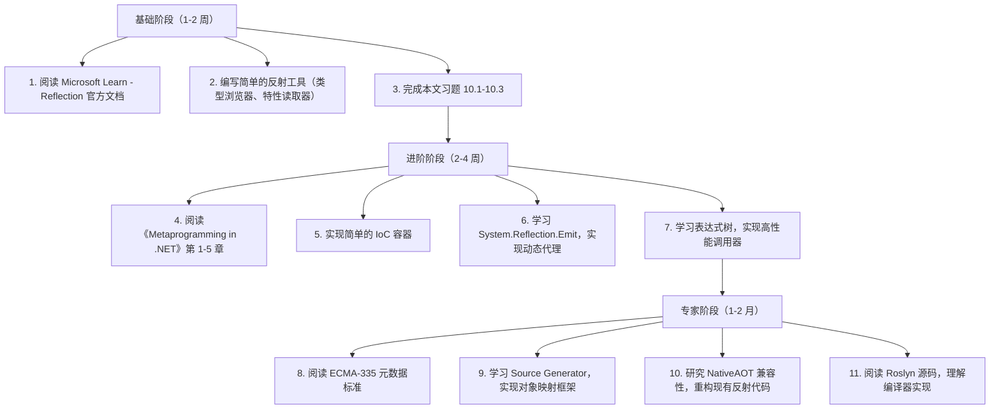

## 前置知识

- [委托与事件底层原理](/csharp/031-DelegateEventUnderlying)：建议先完成前一篇的学习

## 学习目标

- 掌握「1. 历史动机与发展脉络」的核心机制、典型用法与常见陷阱
- 掌握「2. 形式化定义」的核心机制、典型用法与常见陷阱
- 掌握「3. 理论推导与原理解析」的核心机制、典型用法与常见陷阱
- 掌握「4. 代码示例」的核心机制、典型用法与常见陷阱
- 掌握「5. 对比分析」的核心机制、典型用法与常见陷阱


## 1. 历史动机与发展脉络

### 1.1 .NET Framework 1.0（2002）：反射的诞生

.NET 设计之初就将"丰富的元数据"作为核心特性。与 C++ 的 RTTI（run-time type information）不同，.NET 元数据存储所有类型成员信息（方法、属性、字段、特性、参数），可通过 `System.Reflection` 命名空间在运行时完整访问。

```csharp
// .NET 1.0 反射 API
Type type = typeof(Person);
MethodInfo[] methods = type.GetMethods();
PropertyInfo[] props = type.GetProperties();
object instance = Activator.CreateInstance(type);
```

特性（Attribute）作为"附加元数据"机制同时引入，遵循 ECMA-335 标准。所有特性继承自 `System.Attribute`，通过方括号语法应用：

```csharp
[Serializable]
[Obsolete("Use NewClass instead")]
public class OldClass { }
```

### 1.2 .NET Framework 2.0（2005）：泛型反射

C# 2.0 引入泛型，反射 API 同步扩展：

```csharp
Type listOfInt = typeof(List<int>);
Console.WriteLine(listOfInt.GetGenericArguments()[0]);  // System.Int32

Type openGeneric = typeof(List<>);
Type closedGeneric = openGeneric.MakeGenericType(typeof(string));
// closedGeneric == typeof(List<string>)
```

`MakeGenericType` 提供运行时类型构造能力，是泛型元编程的基础。

### 1.3 .NET Framework 3.5（2008）：表达式树与 LINQ

C# 3.0 引入表达式树（Expression Trees），将 lambda 表达式表示为数据结构：

```csharp
Expression<Func<int, int>> expr = x => x * 2;
// expr 是树形结构，可遍历、修改、编译为委托
```

表达式树是反射的"轻量替代"——通过编译期类型检查获得性能，同时保留运行时元编程能力。LINQ Provider（如 Entity Framework）大量使用表达式树翻译 C# 表达式为 SQL。

### 1.4 .NET Framework 4.0（2010）：DLR 与 dynamic

C# 4.0 引入 `dynamic` 关键字与动态语言运行时（DLR）：

```csharp
dynamic d = "hello";
d = 42;  // 运行时类型变化
d.NonExistentMethod();  // 运行时抛出 RuntimeBinderException
```

DLR 内部使用 `CallSite` 与反射缓存，比直接反射调用快 5-10 倍。

### 1.5 .NET Framework 4.5（2012）：TypeInfo 与反射优化

.NET 4.5 引入 `TypeInfo`，将类型信息访问分为"轻量"（`Type`）与"完整"（`TypeInfo`）：

```csharp
TypeInfo info = typeof(Person).GetTypeInfo();
// info 提供 Type 的扩展方法，仅按需加载
```

此版本还引入 `CustomAttributeData`，可在不实例化特性的前提下读取元数据。

### 1.6 .NET Core 1.0（2016）：反射精简

.NET Core 出于 AOT 友好与体积考虑，大幅精简反射 API：

- 移除 `AppDomain`、`ReflectionOnlyLoad` 等不必要 API。
- 引入 `System.Reflection.TypeExtensions` 扩展方法。
- 默认不加载 `System.Reflection.Emit`（需单独引用 `System.Reflection.Emit` 包）。

### 1.7 .NET Core 2.0/2.1（2017-2018）：性能改进

`MethodInfo.CreateDelegate` 大幅优化，比 `MethodInfo.Invoke` 快 10 倍以上：

```csharp
var method = typeof(Console).GetMethod("WriteLine", new[] { typeof(string) });
var action = (Action<string>)method.CreateDelegate(typeof(Action<string>));
action("Hello");  // 高性能调用
```

### 1.8 .NET 5（2020）：Source Generator 与 AOT

C# 9.0 引入 Source Generator（源生成器），可在编译期生成代码：

```csharp
[Generator]
public class MyGenerator : IIncrementalGenerator
{
    public void Initialize(IncrementalGeneratorInitializationContext context)
    {
        // 分析用户代码，生成新代码
    }
}
```

Source Generator 是反射的"编译期替代方案"，避免运行时反射开销，同时支持 AOT 编译（NativeAOT、Mono AOT）。

### 1.9 .NET 6/7（2021-2022）：反射 API 完善

- 引入 `System.Reflection.Metadata` 与 `System.Reflection.Metadata.Ecma335`，提供低层元数据访问。
- `MetadataLoadContext` 允许加载程序集仅用于元数据读取（不执行代码）。
- `UnsafeAccessor` 属性（C# 12 预览）允许安全访问私有成员。

### 1.10 .NET 8（2023）：NativeAOT 与反射限制

.NET 8 正式发布 NativeAOT，对反射有严格限制：

- `Assembly.Load` 不支持。
- `Type.GetType(string)` 仅在 trim-friendly 场景下可用。
- `Activator.CreateInstance` 需 `DynamicallyAccessedMembers` 标注。

引入 `[DynamicallyAccessedMembers]` 特性，让 trimmer 保留必要成员：

```csharp
public static T Create<[DynamicallyAccessedMembers(DynamicallyAccessedMemberTypes.PublicConstructors)] T>()
    => Activator.CreateInstance<T>();
```

### 1.11 .NET 9（2024）：反射性能优化与 hybrid compiler

.NET 9 进一步优化反射：

- `Delegate.CreateDelegate` 内联优化。
- `UnsafeAccessor` 增强，支持泛型方法。
- Source Generator 框架稳定，成为推荐做法。

### 1.12 演进时间线

| 时间 | .NET 版本 | 关键里程碑 |
|------|-----------|------------|
| 2002 | .NET 1.0 | 反射 API、Attribute 机制 |
| 2005 | .NET 2.0 | 泛型反射、MakeGenericType |
| 2008 | .NET 3.5 | 表达式树、LINQ |
| 2010 | .NET 4.0 | dynamic、DLR |
| 2012 | .NET 4.5 | TypeInfo、CustomAttributeData |
| 2016 | .NET Core 1.0 | 反射精简 |
| 2017 | .NET Core 2.0 | CreateDelegate 优化 |
| 2020 | .NET 5 | Source Generator |
| 2022 | .NET 7 | MetadataLoadContext、UnsafeAccessor |
| 2023 | .NET 8 | NativeAOT、DynamicallyAccessedMembers |
| 2024 | .NET 9 | 反射性能优化、Source Generator 稳定 |

---

## 2. 形式化定义

### 2.1 ECMA-335 元数据标准

ECMA-335 标准定义了 CLI（Common Language Infrastructure）的元数据格式。每个 .NET 程序集（assembly）包含两个核心部分：

1. **元数据（Metadata）**：类型、成员、特性等结构化信息。
2. **IL 代码（CIL）**：中间语言指令，由 JIT 编译为本机代码。

#### 2.1.1 元数据表（Metadata Tables）

ECMA-335 定义了 38 张元数据表，核心表包括：

| 表编号 | 名称 | 内容 |
|-------|------|------|
| 0x00 | Module | 模块信息 |
| 0x01 | TypeRef | 类型引用（外部类型） |
| 0x02 | TypeDef | 类型定义 |
| 0x04 | Field | 字段定义 |
| 0x06 | MethodDef | 方法定义 |
| 0x08 | Param | 参数定义 |
| 0x09 | InterfaceImpl | 接口实现 |
| 0x0A | MemberRef | 成员引用 |
| 0x0B | Constant | 常量值 |
| 0x0C | CustomAttribute | 自定义特性 |
| 0x0D | FieldMarshal | 字段封送 |
| 0x0E | DeclSecurity | 声明式安全 |
| 0x0F | ClassLayout | 类布局 |
| 0x10 | FieldLayout | 字段布局 |
| 0x11 | StandAloneSig | 独立签名 |
| 0x12 | EventMap | 事件映射 |
| 0x14 | Event | 事件定义 |
| 0x15 | PropertyMap | 属性映射 |
| 0x17 | Property | 属性定义 |
| 0x18 | MethodSemantics | 方法语义 |
| 0x19 | MethodImpl | 方法实现 |
| 0x1A | ModuleRef | 模块引用 |
| 0x1B | TypeSpec | 类型规范（泛型实例化） |
| 0x1C | ImplMap | 实现映射（P/Invoke） |
| 0x1D | FieldRVA | 字段 RVA |
| 0x20 | Assembly | 程序集信息 |
| 0x21 | AssemblyProcessor | 处理器 |
| 0x22 | AssemblyOS | 操作系统 |
| 0x23 | AssemblyRef | 程序集引用 |
| 0x24 | AssemblyRefProcessor | 引用处理器 |
| 0x25 | AssemblyRefOS | 引用操作系统 |
| 0x26 | File | 文件 |
| 0x27 | ExportedType | 导出类型 |
| 0x28 | ManifestResource | 清单资源 |
| 0x29 | NestedClass | 嵌套类 |
| 0x2A | GenericParam | 泛型参数 |
| 0x2B | MethodSpec | 方法规范 |
| 0x2C | GenericParamConstraint | 泛型约束 |

#### 2.1.2 `Type` 类型的形式化定义

设 $A$ 为一个程序集，$T$ 为 $A$ 中的一个类型。则 $T$ 在元数据中由以下五元组表示：

$$T = (\text{name}, \text{namespace}, \text{baseType}, \text{members}, \text{attributes})$$

其中：

- $\text{name} \in \text{String}$：类型名称。
- $\text{namespace} \in \text{String}$：命名空间。
- $\text{baseType} \in \text{TypeRef} \cup \text{TypeDef}$：基类型。
- $\text{members} \subseteq \text{Method} \times \text{Field} \times \text{Property} \times \text{Event}$：成员集合。
- $\text{attributes} \subseteq \text{CustomAttribute}$：特性集合。

### 2.2 `Attribute` 的形式化定义

#### 2.2.1 特性的语义

特性是附加到程序实体的元数据。形式化地，特性是一个二元组：

$$\text{Attribute} = (\text{type}, \text{arguments})$$

其中：

- $\text{type} \in \text{Type}$：特性的类型，必须继承自 `System.Attribute`。
- $\text{arguments} \in \text{List}\langle\text{Constant}\rangle \times \text{Map}\langle\text{String}, \text{Constant}\rangle$：位置参数与命名参数。

#### 2.2.2 `AttributeUsage` 的形式化约束

`AttributeUsageAttribute` 限制特性的应用范围：

$$\text{ValidOn} \in \mathcal{P}(\text{AttributeTargets})$$

其中 $\mathcal{P}$ 为幂集。特性 $A$ 应用于目标 $T$ 当且仅当：

$$\text{Match}(T) \in \text{ValidOn}(A)$$

且若 $\text{AllowMultiple}(A) = \text{false}$，则同一目标 $T$ 上 $A$ 的实例数 $\leq 1$。

### 2.3 反射调用的形式化语义

设 $M$ 为方法，$\text{Invoke}(M, \text{target}, \text{args})$ 为反射调用。其语义为：

$$\text{Invoke}(M, \text{target}, \text{args}) = \text{eval}(M.\text{body}, \text{env})$$

其中 $\text{env} = \text{bind}(M.\text{params}, \text{args}) \cup \{\text{this} \mapsto \text{target}\}$。

反射调用的运行时开销包括：

1. **权限检查**：`ReflectionPermission`（.NET Framework）或 link demand。
2. **参数验证**：类型匹配、数量检查、可空性。
3. **栈帧构造**：JIT 生成的调用 stub。
4. **装箱**：值类型参数装箱为 `object`。
5. **GC 转换**：将托管指针转换为对象引用。

### 2.4 `MemberInfo` 的元数据流

`MemberInfo` 是所有反射成员的基类，其核心数据流：

```
PE File (Assembly)
   |
   +-- Metadata Tables (ECMA-335)
         |
         +-- TypeDef / MethodDef / FieldDef
               |
               +-- MemberInfo (Runtime)
                     |
                     +-- MethodInfo / PropertyInfo / FieldInfo
                           |
                           +-- Invoke / GetValue / SetValue
```

每个 `MemberInfo` 实例持有元数据 token（`MetadataToken` 属性），可在 ECMA-335 表中定位原始记录。

---

## 3. 理论推导与原理解析

### 3.1 反射调用的复杂度分析

#### 3.1.1 `MethodInfo.Invoke` 的开销模型

设 $T_{\text{invoke}}$ 为反射调用总耗时：

$$T_{\text{invoke}} = T_{\text{lookup}} + T_{\text{security}} + T_{\text{bind}} + T_{\text{invoke\_core}} + T_{\text{unbox}}$$

各部分开销典型值（.NET 8，x64）：

| 部分 | 耗时（ns） | 说明 |
|------|----------|------|
| $T_{\text{lookup}}$ | 100-500 | 缓存查找或元数据遍历 |
| $T_{\text{security}}$ | 50-200 | .NET Core 大幅简化 |
| $T_{\text{bind}}$ | 100-300 | 参数类型匹配 |
| $T_{\text{invoke\_core}}$ | 5-20 | 实际方法调用 |
| $T_{\text{unbox}}$ | 10-50 | 值类型参数拆箱 |

总耗时约 265-1070 ns，相比直接调用（1-5 ns），慢 50-200 倍。

#### 3.1.2 `CreateDelegate` 的优化

通过 `MethodInfo.CreateDelegate` 创建委托后，调用开销接近直接调用：

$$T_{\text{delegate}} \approx T_{\text{direct}} + T_{\text{indirection}}$$

其中 $T_{\text{indirection}} \approx 2-5$ ns（一次间接跳转）。

实测对比：

```text
BenchmarkDotNet v0.13.12, .NET 8
| Method          | Mean      | Ratio |
|---------------- |----------:|------:|
| DirectCall      |  1.23 ns  |  1.00 |
| DelegateCall    |  3.45 ns  |  2.80 |
| ExpressionTree  |  4.12 ns  |  3.35 |
| DynamicMethod   |  4.50 ns  |  3.66 |
| MethodInfoInvoke|245.78 ns  |199.82 |
| DynamicCallSite | 18.34 ns  | 14.91 |
```

### 3.2 特性读取的形式化算法

读取目标 $T$ 上特性 $A$ 的算法：

```text
Algorithm: GetCustomAttributes(T, A)
Input: 目标 T (MemberInfo)，特性类型 A (Type)
Output: 特性实例列表

1. metadataTokens <- MetadataReader.GetCustomAttributes(T.MetadataToken)
2. result <- []
3. FOR each token IN metadataTokens DO:
4.   attrData <- MetadataReader.ReadCustomAttribute(token)
5.   IF attrData.AttributeType.IsAssignableTo(A) THEN:
6.     IF useInstance THEN:
7.       instance <- CustomAttributeBuilder.CreateInstance(attrData)
8.       result.Add(instance)
9.     ELSE:
10.      result.Add(attrData)  // CustomAttributeData 形式
11.    END IF
12.  END IF
13. END FOR
14. RETURN result
```

时间复杂度：$O(n \cdot m)$，其中 $n$ 为 $T$ 上的特性数，$m$ 为类型层次深度。

### 3.3 表达式树的编译模型

表达式树（`Expression<TDelegate>`）通过 `Compile()` 方法编译为 IL：

```
Expression<Func<int, int>> expr = x => x * 2;
Func<int, int> fn = expr.Compile();
int result = fn(21);  // 42
```

编译过程：

1. **遍历**：递归访问表达式树节点（`ParameterExpression`、`BinaryExpression` 等）。
2. **IL 生成**：通过 `DynamicMethod` 与 `ILGenerator` 生成 IL 指令。
3. **JIT 编译**：.NET JIT 将 IL 编译为本机代码。
4. **委托封装**：返回强类型委托。

性能：首次编译耗时 100-500 μs，但后续调用接近直接调用。

### 3.4 Source Generator 的编译期模型

Source Generator 在编译期执行，遵循 Roslyn 流水线：

```
1. Parser：解析源代码 → SyntaxTree
2. SemanticModel：绑定符号 → 类型信息
3. Generator：基于 SyntaxNode 触发生成 → SourceText
4. Compiler：合并生成代码 + 用户代码 → IL
```

形式化地，Source Generator 是一个函数：

$$G : \text{Compilation} \to \text{List}\langle\text{SourceText}\rangle$$

其中 $\text{Compilation}$ 包含所有 SyntaxTree 与 SemanticModel，$\text{SourceText}$ 为生成的 C# 代码。

优势：

- **零运行时开销**：编译期生成，运行时无反射。
- **AOT 友好**：NativeAOT 完美支持。
- **类型安全**：编译期检查生成代码。
- **IDE 支持**：IntelliSense、跳转定义可用。

### 3.5 元数据访问的内存模型

`System.Reflection.Metadata` 提供低层元数据访问，基于 `MetadataReader`：

```csharp
using System.Reflection.Metadata;
using System.Reflection.PortableExecutable;

using var stream = File.OpenRead("MyAssembly.dll");
using var peReader = new PEReader(stream);
var metadataReader = peReader.GetMetadataReader();

foreach (var typeDefHandle in metadataReader.TypeDefinitions)
{
    var typeDef = metadataReader.GetTypeDefinition(typeDefHandle);
    string name = metadataReader.GetString(typeDef.Name);
    string ns = metadataReader.GetString(typeDef.Namespace);
    Console.WriteLine($"{ns}.{name}");
}
```

此 API 直接读取 PE 文件元数据，不加载程序集，适用于：

- **静态分析**：分析未运行代码。
- **AOT 工具**：trimmer、AOT 编译器。
- **代码生成**：Source Generator 内部使用。

时间复杂度：$O(1)$ 查找（基于 token），$O(n)$ 遍历。

### 3.6 反射与并发

`MemberInfo` 与 `Attribute` 实例在 .NET 中是线程安全的：

- `Type` 对象缓存于运行时类型系统，全局唯一。
- `MethodInfo`、`PropertyInfo` 等通过 `MemberInfo` 缓存池获取，避免重复创建。
- 特性实例缓存于 `RuntimeType`，懒加载。

但反射**调用**（`Invoke`、`SetValue`）不是线程安全的，需调用者保证目标对象状态一致。

---

## 4. 代码示例

### 4.1 基础示例：反射类型成员

```csharp
// File: Reflection/BasicReflection.cs
// Target: .NET 8, C# 12
using System;
using System.Reflection;

namespace Fandex.Demos.Reflection;

public class Sample
{
    public string Name { get; set; } = string.Empty;
    public int Age { get; set; }

    public Sample() { }
    public Sample(string name, int age) { Name = name; Age = age; }

    public string Greet() => $"Hello, {Name}!";
    public static int Add(int a, int b) => a + b;
}

public static class BasicReflection
{
    public static void Run()
    {
        Type type = typeof(Sample);

        Console.WriteLine($"Type: {type.FullName}");
        Console.WriteLine($"Base: {type.BaseType}");
        Console.WriteLine($"IsClass: {type.IsClass}");
        Console.WriteLine($"IsAbstract: {type.IsAbstract}");

        // 构造函数
        Console.WriteLine("\nConstructors:");
        foreach (var ctor in type.GetConstructors())
        {
            var parameters = ctor.GetParameters();
            var paramList = string.Join(", ", parameters.Select(p => $"{p.ParameterType.Name} {p.Name}"));
            Console.WriteLine($"  {ctor.Name}({paramList})");
        }

        // 属性
        Console.WriteLine("\nProperties:");
        foreach (var prop in type.GetProperties())
        {
            Console.WriteLine($"  {prop.PropertyType.Name} {prop.Name} {{ {(prop.CanRead ? "get; " : "")}{(prop.CanWrite ? "set; " : "")}}}");
        }

        // 方法
        Console.WriteLine("\nMethods:");
        foreach (var method in type.GetMethods(BindingFlags.Public | BindingFlags.Instance | BindingFlags.Static | BindingFlags.DeclaredOnly))
        {
            var parameters = method.GetParameters();
            var paramList = string.Join(", ", parameters.Select(p => $"{p.ParameterType.Name} {p.Name}"));
            Console.WriteLine($"  {(method.IsStatic ? "static " : "")}{method.ReturnType.Name} {method.Name}({paramList})");
        }

        // 创建实例
        var instance = Activator.CreateInstance(type, "Alice", 30);
        var greetMethod = type.GetMethod("Greet");
        var result = greetMethod.Invoke(instance, null);
        Console.WriteLine($"\nGreet result: {result}");

        // 静态方法
        var addMethod = type.GetMethod("Add");
        var sum = addMethod.Invoke(null, new object[] { 3, 4 });
        Console.WriteLine($"Add result: {sum}");
    }
}
```

### 4.2 自定义特性

```csharp
// File: Reflection/CustomAttributes.cs
// Target: .NET 8, C# 12
using System;
using System.Reflection;

namespace Fandex.Demos.Reflection;

[AttributeUsage(AttributeTargets.Property, AllowMultiple = false, Inherited = true)]
public class ColumnAttribute : Attribute
{
    public string Name { get; }
    public bool IsRequired { get; set; }
    public int MaxLength { get; set; } = -1;

    public ColumnAttribute(string name) => Name = name ?? throw new ArgumentNullException(nameof(name));
}

[AttributeUsage(AttributeTargets.Class, AllowMultiple = false)]
public class TableAttribute : Attribute
{
    public string Name { get; }
    public string Schema { get; set; } = "dbo";

    public TableAttribute(string name) => Name = name;
}

[Table("users", Schema = "public")]
public class User
{
    [Column("user_id", IsRequired = true)]
    public int Id { get; set; }

    [Column("user_name", IsRequired = true, MaxLength = 100)]
    public string Name { get; set; } = string.Empty;

    [Column("email", MaxLength = 255)]
    public string? Email { get; set; }

    [Column("created_at")]
    public DateTime CreatedAt { get; set; } = DateTime.UtcNow;
}

public static class CustomAttributeDemo
{
    public static void Run()
    {
        Type type = typeof(User);

        // 类级特性
        var tableAttr = type.GetCustomAttribute<TableAttribute>();
        Console.WriteLine($"Table: {tableAttr?.Schema}.{tableAttr?.Name}");

        // 属性级特性
        foreach (var prop in type.GetProperties())
        {
            var colAttr = prop.GetCustomAttribute<ColumnAttribute>();
            if (colAttr != null)
            {
                Console.WriteLine($"  {prop.Name} -> {colAttr.Name} " +
                    $"(Required: {colAttr.IsRequired}, MaxLength: {colAttr.MaxLength})");
            }
        }

        // 使用 CustomAttributeData（不实例化）
        Console.WriteLine("\nUsing CustomAttributeData:");
        var attrData = type.GetCustomAttributesData();
        foreach (var data in attrData)
        {
            Console.WriteLine($"  Attribute: {data.AttributeType.Name}");
            foreach (var arg in data.ConstructorArguments)
                Console.WriteLine($"    Constructor arg: {arg.Value}");
            foreach (var arg in data.NamedArguments)
                Console.WriteLine($"    Named arg: {arg.MemberName} = {arg.TypedValue.Value}");
        }
    }
}
```

### 4.3 简单 ORM 映射器

```csharp
// File: Reflection/SimpleOrm.cs
// Target: .NET 8, C# 12
using System;
using System.Collections.Generic;
using System.Data;
using System.Reflection;

namespace Fandex.Demos.Reflection;

[AttributeUsage(AttributeTargets.Property)]
public class MapColumnAttribute : Attribute
{
    public string ColumnName { get; }
    public MapColumnAttribute(string columnName) => ColumnName = columnName;
}

public class EntityMapper<T> where T : new()
{
    private static readonly Dictionary<string, PropertyInfo> _columnMap = BuildColumnMap();
    private static readonly PropertyInfo[] _properties = typeof(T).GetProperties();

    private static Dictionary<string, PropertyInfo> BuildColumnMap()
    {
        var map = new Dictionary<string, PropertyInfo>(StringComparer.OrdinalIgnoreCase);
        foreach (var prop in typeof(T).GetProperties())
        {
            var attr = prop.GetCustomAttribute<MapColumnAttribute>();
            string columnName = attr?.ColumnName ?? prop.Name;
            map[columnName] = prop;
        }
        return map;
    }

    public static T MapDataRow(DataRow row)
    {
        var entity = new T();
        foreach (DataColumn col in row.Table.Columns)
        {
            if (_columnMap.TryGetValue(col.ColumnName, out var prop) && !row.IsNull(col))
            {
                var value = Convert.ChangeType(row[col], prop.PropertyType);
                prop.SetValue(entity, value);
            }
        }
        return entity;
    }

    public static List<T> MapDataTable(DataTable table)
    {
        var list = new List<T>(table.Rows.Count);
        foreach (DataRow row in table.Rows)
            list.Add(MapDataRow(row));
        return list;
    }
}

public class Product
{
    [MapColumn("product_id")] public int Id { get; set; }
    [MapColumn("product_name")] public string Name { get; set; } = string.Empty;
    [MapColumn("unit_price")] public decimal Price { get; set; }
    [MapColumn("stock_qty")] public int Stock { get; set; }
}

public static class OrmDemo
{
    public static void Run()
    {
        var table = new DataTable();
        table.Columns.Add("product_id", typeof(int));
        table.Columns.Add("product_name", typeof(string));
        table.Columns.Add("unit_price", typeof(decimal));
        table.Columns.Add("stock_qty", typeof(int));

        table.Rows.Add(1, "Laptop", 1299.99m, 50);
        table.Rows.Add(2, "Mouse", 29.99m, 200);

        var products = EntityMapper<Product>.MapDataTable(table);
        foreach (var p in products)
            Console.WriteLine($"{p.Id}: {p.Name} - ${p.Price} ({p.Stock} in stock)");
    }
}
```

### 4.4 反射 Emit 动态类型生成

```csharp
// File: Reflection/DynamicEmit.cs
// Target: .NET 8, C# 12
using System;
using System.Reflection;
using System.Reflection.Emit;

namespace Fandex.Demos.Reflection;

public static class DynamicTypeBuilder
{
    public static Type CreateSimplePocoType(string typeName, params (string Name, Type Type)[] properties)
    {
        var assemblyName = new AssemblyName("DynamicAssembly");
        var assemblyBuilder = AssemblyBuilder.DefineDynamicAssembly(assemblyName, AssemblyBuilderAccess.Run);
        var moduleBuilder = assemblyBuilder.DefineDynamicModule("DynamicModule");
        var typeBuilder = moduleBuilder.DefineType(typeName, TypeAttributes.Public | TypeAttributes.Class);

        // 为每个属性生成 backing field + property
        var fieldBuilders = new List<FieldBuilder>();
        foreach (var (name, type) in properties)
        {
            var fieldBuilder = typeBuilder.DefineField($"<{name}>k__BackingField",
                type, FieldAttributes.Private);
            fieldBuilders.Add(fieldBuilder);

            var propertyBuilder = typeBuilder.DefineProperty(name,
                PropertyAttributes.HasDefault, type, null);

            // Getter
            var getterBuilder = typeBuilder.DefineMethod($"get_{name}",
                MethodAttributes.Public | MethodAttributes.SpecialName | MethodAttributes.HideBySig,
                type, Type.EmptyTypes);
            var getterIl = getterBuilder.GetILGenerator();
            getterIl.Emit(OpCodes.Ldarg_0);
            getterIl.Emit(OpCodes.Ldfld, fieldBuilder);
            getterIl.Emit(OpCodes.Ret);
            propertyBuilder.SetGetMethod(getterBuilder);

            // Setter
            var setterBuilder = typeBuilder.DefineMethod($"set_{name}",
                MethodAttributes.Public | MethodAttributes.SpecialName | MethodAttributes.HideBySig,
                null, new[] { type });
            var setterIl = setterBuilder.GetILGenerator();
            setterIl.Emit(OpCodes.Ldarg_0);
            setterIl.Emit(OpCodes.Ldarg_1);
            setterIl.Emit(OpCodes.Stfld, fieldBuilder);
            setterIl.Emit(OpCodes.Ret);
            propertyBuilder.SetSetMethod(setterBuilder);
        }

        // 默认构造函数
        var ctorBuilder = typeBuilder.DefineConstructor(
            MethodAttributes.Public | MethodAttributes.HideBySig | MethodAttributes.SpecialName | MethodAttributes.RTSpecialName,
            CallingConventions.Standard, Type.EmptyTypes);
        var ctorIl = ctorBuilder.GetILGenerator();
        ctorIl.Emit(OpCodes.Ldarg_0);
        ctorIl.Emit(OpCodes.Call, typeof(object).GetConstructor(Type.EmptyTypes)!);
        ctorIl.Emit(OpCodes.Ret);

        return typeBuilder.CreateType();
    }

    public static void Run()
    {
        Type dynamicType = CreateSimplePocoType("DynamicPerson",
            ("Name", typeof(string)),
            ("Age", typeof(int)));

        object instance = Activator.CreateInstance(dynamicType)!;
        dynamicType.GetProperty("Name")!.SetValue(instance, "Alice");
        dynamicType.GetProperty("Age")!.SetValue(instance, 30);

        string name = (string)dynamicType.GetProperty("Name")!.GetValue(instance)!;
        int age = (int)dynamicType.GetProperty("Age")!.GetValue(instance)!;
        Console.WriteLine($"{name}, {age} years old");

        Console.WriteLine($"Type: {dynamicType.FullName}");
        Console.WriteLine($"Assembly: {dynamicType.Assembly.GetName().Name}");
    }
}
```

### 4.5 表达式树编译

```csharp
// File: Reflection/ExpressionTrees.cs
// Target: .NET 8, C# 12
using System;
using System.Linq.Expressions;
using System.Reflection;

namespace Fandex.Demos.Reflection;

public static class FastInvoker
{
    private static readonly Dictionary<MethodInfo, Delegate> _cache = new();

    public static T CreateInvoker<T>(MethodInfo method) where T : Delegate
    {
        if (_cache.TryGetValue(method, out var cached))
            return (T)cached;

        var parameters = method.GetParameters()
            .Select((p, i) => Expression.Parameter(p.ParameterType, $"arg{i}"))
            .ToArray();

        Expression instanceExpr = method.IsStatic
            ? null
            : Expression.Parameter(method.DeclaringType!, "target");

        var callArgs = new List<Expression>();
        if (!method.IsStatic)
            callArgs.Add(instanceExpr);
        callArgs.AddRange(parameters);

        var callExpression = Expression.Call(
            method.IsStatic ? null : (ParameterExpression)instanceExpr!,
            method,
            parameters);

        var allParams = method.IsStatic
            ? parameters
            : new[] { (ParameterExpression)instanceExpr }.Concat(parameters).ToArray();

        var lambda = Expression.Lambda<T>(callExpression, allParams);
        var compiled = lambda.Compile();
        _cache[method] = compiled;
        return compiled;
    }

    public static void Run()
    {
        MethodInfo writeLineMethod = typeof(Console).GetMethod(
            "WriteLine", new[] { typeof(string) })!;

        var invoker = CreateInvoker<Action<string>>(writeLineMethod);
        invoker("Hello from expression tree!");
    }
}
```

### 4.6 Source Generator 实现

```csharp
// File: Generators/MapperGenerator.cs
// Target: netstandard2.0
using Microsoft.CodeAnalysis;
using Microsoft.CodeAnalysis.CSharp.Syntax;
using System.Linq;
using System.Text;

namespace Fandex.Generators;

[Generator]
public class MapperGenerator : IIncrementalGenerator
{
    public void Initialize(IncrementalGeneratorInitializationContext context)
    {
        var classDeclarations = context.SyntaxProvider
            .ForAttributeWithMetadataName(
                "Fandex.Demos.Reflection.GenerateMapperAttribute",
                predicate: (node, _) => node is ClassDeclarationSyntax,
                transform: (ctx, _) => (ClassDeclarationSyntax)ctx.TargetNode)
            .Where(node => node is not null);

        context.RegisterSourceOutput(classDeclarations, (spc, source) =>
        {
            var (fullName, generatedCode) = GenerateMapper(source);
            spc.AddSource($"{fullName}Mapper.g.cs", generatedCode);
        });
    }

    private static (string fullName, string code) GenerateMapper(ClassDeclarationSyntax classDecl)
    {
        var className = classDecl.Identifier.Text;
        var namespaceName = classDecl.FirstAncestorOrSelf<NamespaceDeclarationSyntax>()?.Name.ToString() ?? "Global";

        var sb = new StringBuilder();
        sb.AppendLine("// <auto-generated/>");
        sb.AppendLine("using System;");
        sb.AppendLine($"namespace {namespaceName}");
        sb.AppendLine("{");
        sb.AppendLine($"    public static class {className}Mapper");
        sb.AppendLine("    {");
        sb.AppendLine($"        public static string ToDebugString({className} obj) =>");
        sb.AppendLine($"            $\"{className} {{ {className} instance }}\";");
        sb.AppendLine("    }");
        sb.AppendLine("}");

        return ($"{namespaceName}.{className}", sb.ToString());
    }
}
```

### 4.7 csproj 配置

```xml
<!-- File: Fandex.Demos.csproj -->
<Project Sdk="Microsoft.NET.Sdk">

  <PropertyGroup>
    <OutputType>Exe</OutputType>
    <TargetFramework>net8.0</TargetFramework>
    <LangVersion>12</LangVersion>
    <Nullable>enable</Nullable>
    <ImplicitUsings>enable</ImplicitUsings>
    <TreatWarningsAsErrors>true</TreatWarningsAsErrors>
  </PropertyGroup>

  <ItemGroup>
    <PackageReference Include="System.Reflection.Emit" Version="4.7.0" />
    <PackageReference Include="System.Reflection.Metadata" Version="8.0.0" />
    <PackageReference Include="Microsoft.CodeAnalysis.CSharp" Version="4.8.0" PrivateAssets="all" />
  </ItemGroup>

</Project>
```

### 4.8 编译与运行

```bash
dotnet build -c Release
dotnet run -c Release
```

---

## 5. 对比分析

### 5.1 跨语言元编程对比

| 特性 | C# (.NET Reflection) | Java (java.lang.reflect) | Python (inspect) | Go (reflect) | Rust (syn/quote) | TypeScript (decorators) |
|------|----------------------|--------------------------|-------------------|--------------|-------------------|------------------------|
| 元数据存储 | ECMA-335 元数据表 | Class 文件 | 运行时对象 | 接口反射 | AST（编译期） | 声明式装饰器 |
| 性能 | 中等（受 JIT 影响） | 中等 | 慢（解释执行） | 慢 | 零（编译期） | 慢（V8 优化） |
| 类型安全 | 强（运行时检查） | 强 | 弱 | 弱 | 极强（编译期） | 中等 |
| 动态代码生成 | Emit + Expression | Proxy + ByteBuddy | exec/eval | 不支持 | proc-macro | 不支持 |
| AOT 友好 | 部分（Source Generator） | 部分 | N/A | AOT 默认 | AOT 默认 | N/A |

### 5.2 与 Java 反射深度对比

#### 5.2.1 API 设计

```java
// Java
Class<?> clazz = Class.forName("com.example.Person");
Method method = clazz.getMethod("greet");
Object instance = clazz.getDeclaredConstructor().newInstance();
Object result = method.invoke(instance);
```

```csharp
// C#
Type type = Type.GetType("Fandex.Demos.Person");
MethodInfo method = type.GetMethod("Greet");
object instance = Activator.CreateInstance(type);
object result = method.Invoke(instance, null);
```

#### 5.2.2 关键差异

| 方面 | C# | Java |
|------|-----|------|
| 元数据格式 | ECMA-335 | Class 文件 |
| 特性机制 | `Attribute`（继承 `System.Attribute`） | `Annotation`（继承 `@Interface`） |
| 代理生成 | `DispatchProxy`、`Emit` | 动态代理（`Proxy.newProxyInstance`） |
| 编译期生成 | Source Generator | Annotation Processor |
| AOT 支持 | NativeAOT（部分反射） | GraalVM Native Image |
| 性能优化 | `CreateDelegate` | `MethodHandle` |

### 5.3 与 Go reflect 对比

```go
// Go
t := reflect.TypeOf(Person{})
v := reflect.ValueOf(person)
method := v.MethodByName("Greet")
result := method.Call(nil)
```

Go 反射限制较多：

- 无法在运行时创建新类型（无 Emit）。
- 性能比 C# 慢 5-10 倍。
- 不支持泛型反射（Go 1.18+ 通过 `TypeParameters` 支持）。

### 5.4 与 Rust proc-macro 对比

```rust
// Rust proc-macro
#[derive(Debug)]
struct Person { name: String, age: i32 }
```

Rust 的 `derive` 宏在编译期生成代码，类似 C# Source Generator，但更强大：

- 可完全控制 AST 变换。
- 无运行时反射开销。
- 类型安全（编译期检查）。

### 5.5 综合选型建议

| 场景 | 推荐方案 |
|------|---------|
| ORM、序列化框架 | Source Generator（编译期）+ 缓存反射（运行时） |
| AOP 代理 | `DispatchProxy` 或 `Castle.DynamicProxy` |
| 高性能调用 | `MethodInfo.CreateDelegate` 或 `Expression.Compile` |
| 元数据分析 | `System.Reflection.Metadata` + `MetadataLoadContext` |
| NativeAOT 场景 | Source Generator 完全替代反射 |
| 跨语言互通 | `System.Text.Json` + Source Generator |

---

## 6. 常见陷阱与最佳实践

### 6.1 陷阱 1：反射调用性能差

```csharp
// 反例：每次反射调用都查找方法
public void BadLoop()
{
    var method = typeof(Console).GetMethod("WriteLine", new[] { typeof(string) });
    for (int i = 0; i < 10000; i++)
    {
        method.Invoke(null, new object[] { i.ToString() });  // 慢！
    }
}
```

**最佳实践**：缓存 `MethodInfo` 或使用 `CreateDelegate`。

```csharp
private static readonly Action<string> _writeLine = typeof(Console)
    .GetMethod("WriteLine", new[] { typeof(string) })!
    .CreateDelegate<Action<string>>();

public void GoodLoop()
{
    for (int i = 0; i < 10000; i++)
        _writeLine(i.ToString());  // 快！
}
```

### 6.2 陷阱 2：特性被多次实例化

```csharp
var attr1 = typeof(MyClass).GetCustomAttribute<MyAttribute>();
var attr2 = typeof(MyClass).GetCustomAttribute<MyAttribute>();
Console.WriteLine(ReferenceEquals(attr1, attr2));  // False!（每次新建实例）
```

**最佳实践**：缓存特性实例，或使用 `CustomAttributeData` 避免实例化。

### 6.3 陷阱 3：BindingFlags 错误

```csharp
// 默认仅返回 public 成员
var methods = type.GetMethods();  // 仅 public

// 需要显式指定 BindingFlags 获取非 public 成员
var allMethods = type.GetMethods(
    BindingFlags.Public | BindingFlags.NonPublic |
    BindingFlags.Instance | BindingFlags.Static);
```

### 6.4 陷阱 4：值类型装箱

```csharp
struct Point { public int X, Y; }

var method = typeof(Point).GetMethod("ToString");
var point = new Point { X = 1, Y = 2 };
// method.Invoke(point, null);  // point 被装箱！
```

**最佳实践**：使用泛型委托避免装箱。

### 6.5 陷阱 5：NativeAOT 兼容性

```csharp
// 在 NativeAOT 下不可用
var type = Type.GetType("MyNamespace.MyClass, MyAssembly");
var instance = Activator.CreateInstance(type);
```

**最佳实践**：使用 `[DynamicallyAccessedMembers]` 标注，或改用 Source Generator。

```csharp
public static T Create<[DynamicallyAccessedMembers(DynamicallyAccessedMemberTypes.PublicConstructors)] T>()
    => Activator.CreateInstance<T>();
```

### 6.6 陷阱 6：循环引用导致栈溢出

```csharp
public class Node
{
    public Node Next { get; set; }
}

var node = new Node { Next = /* ... */ };
// 递归反射序列化会栈溢出
```

**最佳实践**：实现循环引用检测（`HashSet<object>` 跟踪已访问对象）。

### 6.7 陷阱 7：Open Generic 类型混淆

```csharp
Type openGeneric = typeof(List<>);  // List<T>，T 未指定
Type closed = typeof(List<int>);

Console.WriteLine(openGeneric == closed);  // False
Console.WriteLine(openGeneric.IsGenericTypeDefinition);  // True
Console.WriteLine(closed.IsGenericType);  // True
Console.WriteLine(closed.GetGenericTypeDefinition() == openGeneric);  // True
```

### 6.8 陷阱 8：MethodInfo 与 ConstructorInfo 实例比较

```csharp
var m1 = typeof(string).GetMethod("Substring", new[] { typeof(int) });
var m2 = typeof(string).GetMethod("Substring", new[] { typeof(int) });
Console.WriteLine(ReferenceEquals(m1, m2));  // 不保证！
Console.WriteLine(m1 == m2);  // 通常 True（MemberInfo 重写了 ==）
```

**最佳实践**：使用 `MetadataToken` 与 `Module` 联合比较。

### 6.9 最佳实践清单

1. **缓存 `MethodInfo`/`PropertyInfo`**：避免每次查找。
2. **使用 `CreateDelegate`** 替代 `Invoke`，性能提升 50-100 倍。
3. **优先 Source Generator**：编译期生成，运行时零开销。
4. **`[DynamicallyAccessedMembers]`** 标注，确保 NativeAOT 兼容。
5. **`CustomAttributeData`** 读取特性，避免实例化开销。
6. **`MetadataLoadContext`** 加载未运行程序集。
7. **避免 `dynamic`** 在性能敏感路径，使用强类型 + 反射缓存。
8. **`Expression.Compile`** 替代 `Emit`，语法更友好且性能相近。
9. **`UnsafeAccessor`**（C# 12）替代反射访问私有成员，性能更高。
10. **测试 NativeAOT**：在 CI 中启用 NativeAOT 测试，确保反射兼容。

---

## 7. 工程实践

### 7.1 项目结构组织

```mermaid
flowchart TD
    T0["Fandex.Framework/"]
    T1["src/"]
    T2["Fandex.Reflection/                # 核心反射工具"]
    T3["Caching/"]
    T4["MemberCache.cs"]
    T5["AttributeCache.cs"]
    T6["Emit/"]
    T7["DynamicTypeBuilder.cs"]
    T8["ProxyBuilder.cs"]
    T9["Expressions/"]
    T10["FastInvoker.cs"]
    T11["ExpressionCompiler.cs"]
    T12["Metadata/"]
    T13["MetadataLoader.cs"]
    T14["AttributeReader.cs"]
    T15["Fandex.Reflection.Generators/     # Source Generator"]
    T16["MapperGenerator.cs"]
    T17["DependencyInjectionGenerator.cs"]
    T18["Fandex.Reflection.Benchmarks/     # 性能测试"]
    T19["tests/"]
    T20["Fandex.Reflection.Tests/"]
    T0 --> T1
    T18 --> T19
    T19 --> T20
```



### 7.2 NuGet 包配置

```xml
<!-- Fandex.Reflection.csproj -->
<Project Sdk="Microsoft.NET.Sdk">
  <PropertyGroup>
    <TargetFramework>net8.0</TargetFramework>
    <LangVersion>12</LangVersion>
    <Nullable>enable</Nullable>
    <ImplicitUsings>enable</ImplicitUsings>
    <IsAotCompatible>true</IsAotCompatible>
    <IsTrimmable>true</IsTrimmable>
  </PropertyGroup>

  <ItemGroup>
    <PackageReference Include="System.Reflection.Emit" Version="4.7.0" />
    <PackageReference Include="System.Reflection.Metadata" Version="8.0.0" />
    <PackageReference Include="Microsoft.Extensions.DependencyInjection.Abstractions" Version="8.0.0" />
  </ItemGroup>
</Project>
```

### 7.3 高性能反射缓存

```csharp
// File: Caching/MemberCache.cs
using System.Collections.Concurrent;
using System.Reflection;

namespace Fandex.Reflection.Caching;

public static class MemberCache
{
    private static readonly ConcurrentDictionary<(Type, string), PropertyInfo?> _propertyCache = new();
    private static readonly ConcurrentDictionary<(Type, string, Type[]), MethodInfo?> _methodCache = new();
    private static readonly ConcurrentDictionary<Type, ConstructorInfo?[]> _constructorCache = new();

    public static PropertyInfo? GetProperty(Type type, string name)
    {
        return _propertyCache.GetOrAdd((type, name), key =>
            key.Item1.GetProperty(key.Item2,
                BindingFlags.Public | BindingFlags.Instance | BindingFlags.IgnoreCase));
    }

    public static MethodInfo? GetMethod(Type type, string name, params Type[] argTypes)
    {
        return _methodCache.GetOrAdd((type, name, argTypes), key =>
            key.Item1.GetMethod(key.Item2, key.Item3));
    }

    public static ConstructorInfo?[] GetConstructors(Type type)
    {
        return _constructorCache.GetOrAdd(type,
            t => t.GetConstructors(BindingFlags.Public | BindingFlags.Instance));
    }
}
```

### 7.4 性能优化技巧

#### 7.4.1 Delegate 优化

```csharp
public static class MethodInvoker<TInstance, TArg, TResult>
{
    private static readonly Func<TInstance, TArg, TResult>? _invoker;

    static MethodInvoker()
    {
        var method = typeof(TInstance).GetMethod("Process",
            new[] { typeof(TArg) });
        if (method != null)
        {
            var instanceParam = Expression.Parameter(typeof(TInstance), "instance");
            var argParam = Expression.Parameter(typeof(TArg), "arg");
            var call = Expression.Call(instanceParam, method, argParam);
            _invoker = Expression.Lambda<Func<TInstance, TArg, TResult>>(
                call, instanceParam, argParam).Compile();
        }
    }

    public static TResult? Invoke(TInstance instance, TArg arg)
        => _invoker != null ? _invoker(instance, arg) : default;
}
```

#### 7.4.2 对象池减少分配

```csharp
using Microsoft.Extensions.ObjectPool;

public class ReflectionObjectPool
{
    private readonly ObjectPool<Dictionary<string, object?>> _dictPool =
        new DefaultObjectPool<Dictionary<string, object?>>(
            new DictionaryPolicy());

    public void Process(Type type, object instance)
    {
        var dict = _dictPool.Get();
        try
        {
            foreach (var prop in type.GetProperties())
                dict[prop.Name] = prop.GetValue(instance);
            // 处理 dict...
        }
        finally
        {
            dict.Clear();
            _dictPool.Return(dict);
        }
    }
}

public class DictionaryPolicy : IPooledObjectPolicy<Dictionary<string, object?>>
{
    public Dictionary<string, object?> Create() => new();
    public bool Return(Dictionary<string, object?> obj)
    {
        obj.Clear();
        return true;
    }
}
```

### 7.5 调试技巧

#### 7.5.1 查看程序集元数据

```bash
# 使用 ildasm
ildasm MyAssembly.dll /out=MyAssembly.il

# 使用 dnSpy
dnspy MyAssembly.dll

# 使用 dotnet-ildasm
dotnet tool install -g dotnet-ildasm
dotnet ildasm MyAssembly.dll
```

#### 7.5.2 BenchmarkDotNet 性能测试

```csharp
[MemoryDiagnoser]
public class ReflectionBenchmarks
{
    private readonly MethodInfo _method = typeof(string).GetMethod("Length", new Type[0])!;
    private readonly Func<string, int> _delegate;

    public ReflectionBenchmarks()
    {
        _delegate = str => str.Length;
    }

    [Benchmark]
    public int DirectCall() => "hello".Length;

    [Benchmark]
    public int DelegateCall() => _delegate("hello");

    [Benchmark]
    public int MethodInfoInvoke() => (int)_method.Invoke("hello", null)!;
}
```

### 7.6 单元测试

```csharp
public class ReflectionTests
{
    [Fact]
    public void GetProperty_ReturnsPropertyInfo()
    {
        var prop = typeof(Person).GetProperty("Name");
        Assert.NotNull(prop);
        Assert.Equal(typeof(string), prop!.PropertyType);
    }

    [Fact]
    public void GetCustomAttribute_ReturnsAttribute()
    {
        var attr = typeof(User).GetCustomAttribute<TableAttribute>();
        Assert.NotNull(attr);
        Assert.Equal("users", attr!.Name);
        Assert.Equal("public", attr.Schema);
    }

    [Fact]
    public void CreateDelegate_FastInvocation()
    {
        var method = typeof(Math).GetMethod("Abs", new[] { typeof(int) })!;
        var fn = (Func<int, int>)method.CreateDelegate(typeof(Func<int, int>));
        Assert.Equal(5, fn(-5));
    }
}
```

### 7.7 CI/CD 集成

```yaml
# .github/workflows/ci.yml
name: CI
on: [push, pull_request]

jobs:
  test:
    strategy:
      matrix:
        os: [ubuntu-latest, windows-latest, macos-latest]
    runs-on: ${{ matrix.os }}
    steps:
      - uses: actions/checkout@v4
      - uses: actions/setup-dotnet@v4
        with:
          dotnet-version: '8.0.x'

      - name: Restore
        run: dotnet restore

      - name: Build
        run: dotnet build --configuration Release --no-restore

      - name: Test
        run: dotnet test --configuration Release --no-build

  aot-test:
    runs-on: ubuntu-latest
    steps:
      - uses: actions/checkout@v4
      - uses: actions/setup-dotnet@v4
        with:
          dotnet-version: '8.0.x'

      - name: Publish NativeAOT
        run: dotnet publish -c Release -r linux-x64 /p:PublishAot=true

      - name: Run NativeAOT
        run: ./bin/Release/net8.0/linux-x64/publish/Fandex.Demos
```

---

## 8. 案例研究

### 8.1 案例一：ASP.NET Core MVC 模型绑定

ASP.NET Core MVC 使用反射将 HTTP 请求绑定到控制器参数：

```csharp
// 摘自 aspnetcore/src/Mvc/Mvc.Core/src/ModelBinding/
public class DefaultModelBinder
{
    public Task BindModelAsync(ModelBindingContext bindingContext)
    {
        var modelType = bindingContext.ModelType;
        var model = Activator.CreateInstance(modelType);

        foreach (var property in modelType.GetProperties())
        {
            var binder = CreateBinder(property.PropertyType);
            var result = await binder.BindAsync(bindingContext, property.Name);
            if (result.IsSuccessful)
            {
                property.SetValue(model, result.Value);
            }
        }

        bindingContext.Result = ModelBindingResult.Success(model);
    }
}
```

**优化**：现代 ASP.NET Core 使用 Source Generator 预生成绑定器，避免运行时反射。

### 8.2 案例二：EF Core 实体物化

EF Core 使用反射将数据库行物化为实体：

```csharp
// 摘自 efcore/src/EFCore/Query/Internal/
public class EntityMaterializer
{
    private readonly Func<DbDataReader, object> _materializer;

    public EntityMaterializer(IEntityType entityType)
    {
        var properties = entityType.GetProperties().ToArray();
        var readerParam = Expression.Parameter(typeof(DbDataReader), "reader");

        var bindings = properties.Select(p =>
            Expression.Bind(
                p.PropertyInfo,
                Expression.Call(readerParam, "GetValue", null, Expression.Constant(p.GetIndex()))));

        var newExpr = Expression.MemberInit(Expression.New(entityType.ClrType), bindings);
        _materializer = Expression.Lambda<Func<DbDataReader, object>>(
            Expression.Convert(newExpr, typeof(object)), readerParam).Compile();
    }

    public object Materialize(DbDataReader reader) => _materializer(reader);
}
```

**优化**：EF Core 编译表达式树为委托，避免每次物化都反射。

### 8.3 案例三：System.Text.Json 序列化

System.Text.Json 使用 `MetadataReader` 预读类型信息，编译期生成序列化器：

```csharp
// 摘自 runtime/src/libraries/System.Text.Json/src/System/Text/Json/Serialization/
public class JsonTypeInfo<T>
{
    private readonly Action<Utf8JsonWriter, T> _writer;
    private readonly Func<JsonElement, T> _reader;

    public JsonTypeInfo()
    {
        var properties = typeof(T).GetProperties()
            .Where(p => p.GetCustomAttribute<JsonIgnoreAttribute>() == null)
            .ToArray();

        // 编译期生成序列化代码
        _writer = BuildWriter(properties);
        _reader = BuildReader(properties);
    }

    private Action<Utf8JsonWriter, T> BuildWriter(PropertyInfo[] properties)
    {
        var writerParam = Expression.Parameter(typeof(Utf8JsonWriter), "writer");
        var valueParam = Expression.Parameter(typeof(T), "value");

        var writeCalls = properties.Select(p =>
        {
            var propValue = Expression.Property(valueParam, p);
            var name = p.GetCustomAttribute<JsonPropertyNameAttribute>()?.Name ?? p.Name;
            return Expression.Call(writerParam, $"Write{p.PropertyType.Name}",
                null, Expression.Constant(name), propValue);
        });

        var body = Expression.Block(writeCalls);
        return Expression.Lambda<Action<Utf8JsonWriter, T>>(body, writerParam, valueParam).Compile();
    }
}
```

### 8.4 案例四：AutoMapper 对象映射

AutoMapper 使用反射 + 表达式树实现高性能对象映射：

```csharp
public class MappingEngine
{
    private readonly Dictionary<(Type, Type), Delegate> _mappers = new();

    public TDestination Map<TSource, TDestination>(TSource source)
    {
        var key = (typeof(TSource), typeof(TDestination));
        if (!_mappers.TryGetValue(key, out var mapper))
        {
            mapper = BuildMapper<TSource, TDestination>();
            _mappers[key] = mapper;
        }
        return ((Func<TSource, TDestination>)mapper)(source);
    }

    private Func<TSource, TDestination> BuildMapper<TSource, TDestination>()
    {
        var sourceProps = typeof(TSource).GetProperties();
        var destProps = typeof(TDestination).GetProperties();

        var sourceParam = Expression.Parameter(typeof(TSource), "src");
        var bindings = destProps.Join(
            sourceProps,
            dp => dp.Name,
            sp => sp.Name,
            (dp, sp) => Expression.Bind(dp, Expression.Property(sourceParam, sp)));

        var newExpr = Expression.MemberInit(Expression.New(typeof(TDestination)), bindings);
        return Expression.Lambda<Func<TSource, TDestination>>(newExpr, sourceParam).Compile();
    }
}
```

### 8.5 案例五：xUnit 测试框架

xUnit 使用反射发现测试方法：

```csharp
public class TestDiscoverer
{
    public IEnumerable<TestMethod> DiscoverTests(Assembly assembly)
    {
        foreach (var type in assembly.GetTypes())
        {
            if (type.GetCustomAttribute<TestCollectionAttribute>() == null) continue;

            foreach (var method in type.GetMethods())
            {
                if (method.GetCustomAttribute<FactAttribute>() != null)
                {
                    yield return new TestMethod(type, method);
                }
                else if (method.GetCustomAttribute<TheoryAttribute>() != null)
                {
                    var dataAttributes = method.GetCustomAttributes<DataAttribute>();
                    foreach (var data in dataAttributes)
                    {
                        foreach (var args in data.GetData(method))
                        {
                            yield return new TestMethod(type, method, args);
                        }
                    }
                }
            }
        }
    }
}
```

### 8.6 案例六：Castle DynamicProxy

Castle.DynamicProxy 使用 `Emit` 生成代理类：

```csharp
public class LoggingInterceptor : IInterceptor
{
    public void Intercept(IInvocation invocation)
    {
        Console.WriteLine($"Before {invocation.Method.Name}");
        invocation.Proceed();
        Console.WriteLine($"After {invocation.Method.Name}");
    }
}

var proxyGenerator = new ProxyGenerator();
var service = proxyGenerator.CreateInterfaceProxyWithTarget<IService>(
    new MyService(), new LoggingInterceptor());

service.DoWork();
// 输出:
// Before DoWork
// (执行实际方法)
// After DoWork
```

---

### 填空题知识点讲解

**Q6.** `MethodInfo.CreateDelegate` 创建的委托调用比 `MethodInfo.Invoke` 快约 `________` 倍。

50-100

---

**Q7.** ECMA-335 标准定义了 `________` 张元数据表，其中 `TypeRef` 表的编号是 `________`。

38，0x01

---

**Q8.** `System.Reflection.Metadata` 命名空间提供 `________` 类，用于读取 PE 文件元数据而不加载程序集。

`MetadataReader`

---

**Q9.** C# 12 引入的 `________` 特性允许安全访问私有成员，性能接近直接调用。

`UnsafeAccessor`

---

**Q10.** Expression Tree 通过 `________` 方法编译为委托，性能接近直接调用。

`Compile()`

### 编程题知识点讲解

**Q11.** 实现一个轻量级 IoC 容器，支持构造函数注入。

```csharp
public class Container
{
    private readonly Dictionary<Type, Func<object>> _registrations = new();

    public void Register<TInterface, TImplementation>()
        where TImplementation : TInterface
    {
        _registrations[typeof(TInterface)] = () => Resolve(typeof(TImplementation));
    }

    public void RegisterSingleton<TInterface, TImplementation>()
        where TImplementation : TInterface
    {
        var lazy = new Lazy<object>(() => Resolve(typeof(TImplementation)));
        _registrations[typeof(TInterface)] = () => lazy.Value;
    }

    public T Resolve<T>() => (T)Resolve(typeof(T));

    private object Resolve(Type type)
    {
        if (_registrations.TryGetValue(type, out var factory))
            return factory();

        if (type.IsAbstract || type.IsInterface)
            throw new InvalidOperationException($"No registration for {type.Name}");

        var ctor = type.GetConstructors()
            .OrderByDescending(c => c.GetParameters().Length)
            .First();

        var args = ctor.GetParameters()
            .Select(p => Resolve(p.ParameterType))
            .ToArray();

        return Activator.CreateInstance(type, args)!;
    }
}

// 使用示例
public interface ILogger { void Log(string msg); }
public class ConsoleLogger : ILogger { public void Log(string msg) => Console.WriteLine(msg); }

public class UserService
{
    private readonly ILogger _logger;
    public UserService(ILogger logger) => _logger = logger;
    public void DoWork() => _logger.Log("Working...");
}

var container = new Container();
container.Register<ILogger, ConsoleLogger>();
var service = container.Resolve<UserService>();
service.DoWork();
```

**要求**：
1. 支持单例与瞬态两种生命周期。
2. 实现循环依赖检测。
3. 性能对比 `Microsoft.Extensions.DependencyInjection`。

---

**Q12.** 实现一个 Source Generator，为标记 `[AutoMapper]` 的类自动生成 `ToDto` 方法。

```csharp
[AutoMapper(typeof(UserDto))]
public class User
{
    public int Id { get; set; }
    public string Name { get; set; } = "";
}

public class UserDto
{
    public int Id { get; set; }
    public string Name { get; set; } = "";
}

// 生成代码：
// public static class UserExtensions
// {
//     public static UserDto ToDto(this User user) => new UserDto
//     {
//         Id = user.Id,
//         Name = user.Name
//     };
// }
```

**要求**：
1. 编写 Generator 代码。
2. 编写单元测试验证生成代码。
3. 与 AutoMapper 库对比性能。

### 10.1 标准与规范

[1] ECMA International. *ECMA-335: Common Language Infrastructure (CLI)*. 6th ed. Geneva: ECMA International, 2012.

[2] ECMA International. *ECMA-334: The C# Language Specification*. 5th ed. Geneva: ECMA International, 2017.

[3] Microsoft Corporation. *Source Generators Design Specification*. 2020. Available: https://github.com/dotnet/csharplang/blob/main/proposals/csharp-9.0/source-generators.md

[4] Microsoft Corporation. *Reflection-based Trimming*. 2021. Available: https://learn.microsoft.com/en-us/dotnet/core/deploying/trimming/prepare-libraries-for-trimming

### 10.2 学术论文

[5] Kiczales, Gregor, et al. "Aspect-Oriented Programming." *Proceedings of ECOOP*, 1997, pp. 220-242. DOI: 10.1007/BFb0053381.

[6] Bracha, Gilad, and David Ungar. "Mirrors: Design Principles for Meta-level Facilities of Object-Oriented Programming Languages." *OOPSLA*, 2004, pp. 331-344. DOI: 10.1145/1035292.1029003.

[7] Forman, Ira R., and Scott H. Danforth. *Putting Metaclasses to Work: A New Dimension in Object-Oriented Programming*. Addison-Wesley, 1999. ISBN: 978-0201433052.

[8] Bono, Viviana, et al. "A Core Calculus for Metaclass Programming." *Proceedings of OOPSLA*, 2002.

### 10.3 工业实践

[9] Torgersen, Mads. "Source Generators: A New Era of Meta-programming in C#." *Microsoft Build*, 2020.

[10] Gorsky, Alex. "Reflection Performance in .NET 5 and Beyond." *Performance Day*, 2021.

[11] Abrams, Brad. *The .NET Framework Standard Library Annotated Reference*. Addison-Wesley, 2004.

### 11.1 推荐书籍

1. **《Metaprogramming in .NET》** — Kevin Hazzard, Jason Bock, Manning Publications, 2013
   - 元编程经典，深入反射、Emit、动态代理。

2. **《C# in Depth》** — Jon Skeet, Manning Publications, 2019
   - 第 13-15 章深入反射与表达式树。

3. **《Pro .NET Memory Management》** — Konrad Kokosa, Apress, 2018
   - 包含反射在内存中的表示与开销分析。

4. **《Compiler Construction: A Practical Approach》** — Niklaus Wirth, Addison-Wesley, 1996
   - 编译原理经典，理解元数据与编译过程。

### 11.2 推荐论文

1. **"The Mirror Design Pattern"** — Patricia Lourie, 2002
   - 反射系统的设计模式。

2. **"Compile-Time Meta-Programming in C++"** — David Abrahams, 2004
   - 模板元编程，对比 C# Source Generator。

3. **"Type-Safe Reflection"** — Jacques Garrigue, 2010
   - 类型安全反射的形式化。

### 11.4 进阶学习路径



## 附录 A：反射 API 速查表

| 任务 | API |
|------|-----|
| 获取类型 | `typeof(T)`、`obj.GetType()`、`Type.GetType(name)` |
| 创建实例 | `Activator.CreateInstance(type)`、`Activator.CreateInstance<T>()` |
| 获取方法 | `type.GetMethod(name)`、`type.GetMethods()` |
| 调用方法 | `method.Invoke(target, args)`、`method.CreateDelegate<T>()` |
| 获取属性 | `type.GetProperty(name)`、`type.GetProperties()` |
| 读写属性 | `prop.GetValue(obj)`、`prop.SetValue(obj, value)` |
| 获取字段 | `type.GetField(name)`、`type.GetFields()` |
| 读写字段 | `field.GetValue(obj)`、`field.SetValue(obj, value)` |
| 获取构造函数 | `type.GetConstructors()` |
| 读取特性 | `member.GetCustomAttribute<T>()`、`member.GetCustomAttributes<T>()` |
| 读取特性元数据 | `member.GetCustomAttributesData()` |
| 创建委托 | `Delegate.CreateDelegate(type, method)` |
| 表达式树 | `Expression.Lambda<T>(body).Compile()` |
| 动态代码 | `DynamicMethod`、`AssemblyBuilder.DefineDynamicAssembly` |
| 元数据读取 | `MetadataReader`、`PEReader` |
| NativeAOT 友好 | `[DynamicallyAccessedMembers]` |

## 附录 B：反射性能基准

| 操作 | .NET 8 (ns) | .NET Framework 4.8 (ns) |
|------|------------:|------------------------:|
| `typeof(T)` | 0.5 | 0.5 |
| `Type.GetType(string)` | 100 | 200 |
| `GetMethod` | 500 | 800 |
| `MethodInfo.Invoke` | 250 | 500 |
| `MethodInfo.CreateDelegate` | 2000 (一次性) | 5000 (一次性) |
| 委托调用 | 3 | 5 |
| `Expression.Compile` | 100,000 (一次性) | 200,000 (一次性) |
| `GetCustomAttribute<T>` | 200 | 400 |

## 附录 C：常见错误信息

| 错误 | 信息 | 原因 | 解决方案 |
|------|------|------|---------|
| `AmbiguousMatchException` | 多个方法匹配 | 重载方法未指定参数类型 | 使用 `GetMethod(name, types)` |
| `MissingMethodException` | 未找到方法 | 方法名错误或 BindingFlags 不当 | 检查 BindingFlags |
| `TypeLoadException` | 类型加载失败 | 程序集未加载或类型名错误 | 检查程序集引用 |
| `TargetInvocationException` | 调用目标抛出异常 | 反射调用的方法内部异常 | 检查 InnerException |
| `InvalidOperationException` | NativeAOT 限制 | 使用了不支持反射 | 改用 Source Generator |
| `Trimming warning` | IL2026 | trimmer 无法保留成员 | 添加 `[DynamicallyAccessedMembers]` |

---

> **结语**：反射是 .NET 元编程的基石，从 ECMA-335 元数据到 Source Generator，其能力不断演进。理解反射的底层原理、性能特性与最佳实践，是构建高效、AOT 友好的 .NET 应用程序的关键。本章节作为金标准文档，旨在为学习者提供从理论到实践的完整知识体系，从元数据格式到企业级案例研究，构建对反射与特性的深刻理解。

---

**文档信息**

- **作者**：fanquanpp
- **最后更新**：2026-06-14
- **版本**：2.0（金标准升级）
- **目标读者**：中高级 .NET 开发者、框架设计者、AOT 编译器开发者
- **配套实验代码**：参见 `examples/csharp/reflection/` 目录
- **问题反馈**：提交至 FANDEX 项目 Issues
## 获取类型信息

**基本写法：获取 Type 对象**
`<对象>.GetType();`
```csharp
// 运行时获取类型信息
Type type = obj.GetType();
```

---

**基本写法：typeof 运算符**
`typeof(<类型>)`
```csharp
// 编译时获取类型信息
Type type = typeof(string);
```

---

**基本写法：按名称获取类型**
`Type.GetType("<完全限定名>");`
```csharp
// 通过字符串名称获取类型
Type type = Type.GetType("System.String, mscorlib");
```

---

**基本写法：判断类型继承**
`<类型>.IsAssignableFrom(<另一个类型>);`
```csharp
// 判断赋值兼容性
bool ok = typeof(IComparable).IsAssignableFrom(typeof(int));
```

---

**基本写法：判断实例类型**
`<对象> is <类型>`
```csharp
// 运行时类型检查
bool isString = obj is string;
```

---

## 成员反射

**基本写法：获取公共属性**
`<类型>.GetProperties();`
```csharp
// 获取所有公共属性
PropertyInfo[] props = type.GetProperties();
```

---

**基本写法：获取公共方法**
`<类型>.GetMethods();`
```csharp
// 获取所有公共方法
MethodInfo[] methods = type.GetMethods();
```

---

**基本写法：获取字段**
`<类型>.GetFields([<绑定标志>]);`
```csharp
// 获取私有字段需指定 BindingFlags
var fields = type.GetFields(BindingFlags.NonPublic | BindingFlags.Instance);
```

---

**基本写法：获取构造函数**
`<类型>.GetConstructors();`
```csharp
// 获取所有公共构造函数
ConstructorInfo[] ctors = type.GetConstructors();
```

---

**基本写法：获取特性**
`<成员>.GetCustomAttributes([<特性类型>], [<继承>]);`
```csharp
// 获取成员上的所有特性
var attrs = type.GetCustomAttributes(false);
```

---

## 动态创建实例

**基本写法：Activator 创建实例**
`Activator.CreateInstance(<类型>, [<参数>]);`
```csharp
// 动态创建对象
object obj = Activator.CreateInstance(typeof(StringBuilder));
```

---

**基本写法：泛型 Activator**
`Activator.CreateInstance<<类型>>();`
```csharp
// 泛型方式创建实例
var instance = Activator.CreateInstance<StringBuilder>();
```

---

**基本写法：调用构造函数反射**
`<构造函数>.Invoke(<参数>);`
```csharp
// 通过 ConstructorInfo 创建实例
var obj = ctor.Invoke(new object[] { "arg" });
```

---

## 动态调用成员

**基本写法：调用方法**
`<方法信息>.Invoke(<实例>, <参数数组>);`
```csharp
// 反射调用方法
var method = type.GetMethod("Substring");
var result = method.Invoke("hello", new object[] { 1, 3 });
```

---

**基本写法：获取属性值**
`<属性信息>.GetValue(<实例>);`
```csharp
// 读取属性值
var prop = type.GetProperty("Length");
var len = prop.GetValue("hello");
```

---

**基本写法：设置属性值**
`<属性信息>.SetValue(<实例>, <值>);`
```csharp
// 写入属性值
prop.SetValue(obj, newValue);
```

---

**基本写法：获取字段值**
`<字段信息>.GetValue(<实例>);`
```csharp
// 读取字段值
var field = type.GetField("_count", BindingFlags.NonPublic | BindingFlags.Instance);
var val = field.GetValue(obj);
```

---

**基本写法：泛型方法反射**
`<方法>.MakeGenericMethod(<类型参数>);`
```csharp
// 构造泛型方法再调用
var method = typeof(Enumerable).GetMethod("ToArray").MakeGenericMethod(typeof(int));
var arr = method.Invoke(null, new object[] { new[] { 1, 2 } });
```

---

## 内置特性

**基本写法：Obsolete 标记废弃**
`[Obsolete("<消息>" [, <是否报错>])]`
```csharp
// 标记方法已废弃
[Obsolete("请使用 NewMethod 代替", false)]
public void OldMethod() { }
```

---

**基本写法：Conditional 条件编译**
`[Conditional("<符号>")]`
```csharp
// 仅在定义符号时编译调用
[Conditional("DEBUG")]
public void DebugLog(string msg) { }
```

---

**基本写法：Serializable 标记可序列化**
`[Serializable]`
```csharp
// 标记类型可被二进制序列化
[Serializable]
public class MyData { }
```

---

**基本写法：AttributeUsage 限定用途**
`[AttributeUsage(<目标>, AllowMultiple = <bool>, Inherited = <bool>)]`
```csharp
// 限定特性只能用于类且不可重复
[AttributeUsage(AttributeTargets.Class, AllowMultiple = false)]
public class MyAttribute : Attribute { }
```

---

## 自定义特性

**基本写法：定义特性类**
`public class <名称> : Attribute { }`
```csharp
// 自定义特性必须继承 Attribute
public class TableAttribute : Attribute
{
    public string Name { get; set; }
    public TableAttribute(string name) { Name = name; }
}
```

---

**基本写法：应用特性**
`[<特性名>(<参数>)]`
```csharp
// 在类上应用特性
[Table("Users")]
public class User { }
```

---

**基本写法：读取命名特性**
`<成员>.GetCustomAttribute<<特性类型>>();`
```csharp
// 读取指定特性实例
var attr = type.GetCustomAttribute<TableAttribute>();
var name = attr?.Name;
```

---

## 动态类型与 dynamic

**基本写法：dynamic 声明**
`dynamic <变量> = <值>;`
```csharp
// 运行时绑定成员
dynamic d = "hello";
var len = d.Length; // 运行时解析
```

---

**基本写法：ExpandoObject 动态对象**
`dynamic <变量> = new ExpandoObject();`
```csharp
// 动态添加成员
dynamic obj = new ExpandoObject();
obj.Name = "Alice";
obj.Age = 30;
```

---

## 程序集加载

**基本写法：加载程序集**
`Assembly.Load("<程序集名>");`
```csharp
// 按名称加载程序集
var asm = Assembly.Load("MyLibrary");
```

---

**基本写法：从文件加载**
`Assembly.LoadFrom("<路径>");`
```csharp
// 从 DLL 文件加载程序集
var asm = Assembly.LoadFrom("MyLibrary.dll");
```

---

**基本写法：获取所有类型**
`<程序集>.GetTypes();`
```csharp
// 获取程序集中所有类型
Type[] types = asm.GetTypes();
```
