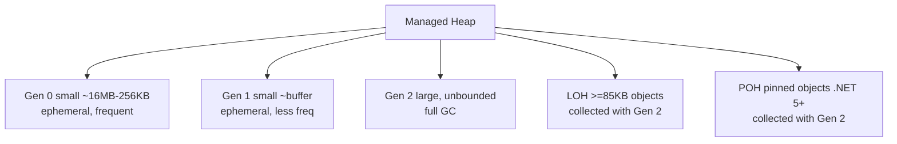
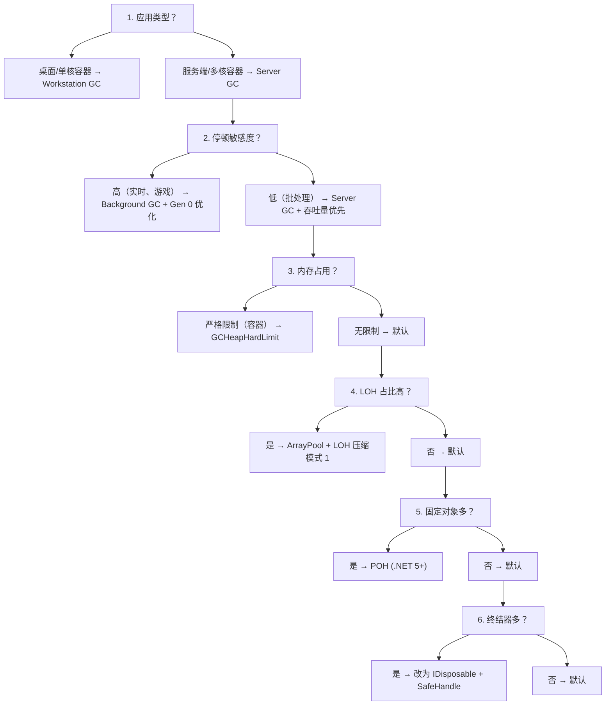

# .NET GC 代机制：从弱分代假说到内存回收的全景解析

## 前置知识

- [依赖注入生命周期](/csharp/035-DILifecycle)：建议先完成前一篇的学习

## 学习目标

- 掌握「1. 历史动机与发展脉络」的核心机制、典型用法与常见陷阱
- 掌握「2. 形式化定义」的核心机制、典型用法与常见陷阱
- 掌握「3. 理论推导与原理解析」的核心机制、典型用法与常见陷阱
- 掌握「4. 代码示例」的核心机制、典型用法与常见陷阱
- 掌握「5. 对比分析」的核心机制、典型用法与常见陷阱


> 本章对标 MIT 6.1020（Software Construction）与 Stanford CS107（Programming Paradigms）的内存管理教学深度，结合 ECMA-335（CLI 规范）、CoreCLR 源码（`gc.cpp`、`gcee.cpp`）与 Andrew D. Wilson 等人的经典 GC 论文，深入剖析 .NET 垃圾回收器的分代模型、标记清除算法、压缩策略、固定对象机制、Server GC vs Workstation GC 的差异，以及在 ASP.NET Core、EF Core、高性能 I/O 路径中的工程实践。

## 1. 历史动机与发展脉络

### 1.1 GC 的史前时代：手动内存管理（1950s-1990s）

在垃圾回收（Garbage Collection, GC）一词正式出现之前，程序员需要手动调用 `malloc`/`free`（C）、`new`/`delete`（C++）来管理内存。这带来了两类典型错误：

- **悬垂指针**（dangling pointer）：释放后仍被引用。
- **内存泄漏**（memory leak）：分配后不再使用但未释放。

1959 年，John McCarthy 在 LISP 中首次提出**垃圾回收**一词，使用标记清除（mark-sweep）算法自动回收不可达对象。但早期的 GC 是"全堆回收"（full heap collection），停顿时间随堆大小线性增长。

### 1.2 分代假说的诞生：Ungar（1984）

1984 年，David Ungar 在 Berkeley Smalltalk 系统中提出**分代垃圾回收**（generational GC），核心思想基于两条经验假说：

1. **弱分代假说**（Weak Generational Hypothesis）：大多数对象"朝生夕死"（die young）。
2. **强分代假说**（Strong Generational Hypothesis）：越老的对象越倾向于继续存活。

Ungar 将堆划分为新生代（nursery）与老年代（old generation），频繁回收新生代，偶尔回收老年代。这把平均回收成本从 $O(N)$（全堆）降到接近 $O(N_{\text{young}})$（仅新生代），是 GC 史上最重要的优化之一。

### 1.3 .NET Framework 1.0-2.0：奠基期（2002-2005）

.NET 1.0 引入了**三代模型**（Gen 0/1/2）与 **LOH**（Large Object Heap，>=85KB 直接进 LOH）。设计由 Patrick Dussud 主导，参考了 Ungar 分代、Boehm-Demers-Weiser 标记清除与 Java HotSpot 的早期设计。

```csharp
// .NET 1.0 风格（2002）
GC.Collect();                       // 强制全代回收
GC.GetGeneration(obj);              // 查询对象所在代
GC.CollectionCount(0);              // 查询 Gen 0 回收次数
GC.WaitForPendingFinalizers();      // 等待终结器执行
```

### 1.4 .NET Framework 3.5-4.5：Server GC 与 Background GC（2007-2012）

- **.NET 3.5（2007）**：Server GC 在多核服务器上启用，每核一个堆，并行标记。
- **.NET 4.0（2010）**：引入 **Background GC**，Gen 2 回收时 Gen 0/1 分配不阻塞。
- **.NET 4.5（2012）**：Server Background GC，吞吐量进一步提升。

### 1.5 .NET Core 与跨平台时代（2016-2019）

.NET Core 1.0/2.0（2016-2017）重写 GC 为跨平台实现（C++ 跨平台代码），支持 Linux、macOS。引入 `Memory<T>`/`Span<T>` 降低分配压力。

- **.NET Core 2.1（2018）**：`ArrayPool<T>.Shared`、`MemoryMappedFile` 优化。
- **.NET Core 3.0（2019）**：Default Server GC on multi-core containers、`GC.AllocateArray` 引入（zero-copy）。

### 1.6 .NET 5-9：现代 GC（2020-2024）

| 版本 | 年份 | GC 关键改进 |
|------|------|-------------|
| .NET 5 | 2020 | 区域化 GC（DATAS）实验性引入 |
| .NET 6 | 2021 | 动态适应于内存限制（`GCHeapHardLimit`） |
| .NET 7 | 2022 | `POH`（Pinned Object Heap）正式稳定 |
| .NET 8 | 2023 | DATAS（Dynamic Adaptive To Application Sizes）正式启用 |
| .NET 9 | 2024 | GC 暂停时间优化，`GC.CollectAsync` 实验性 API |

### 1.7 学术背景与理论渊源

.NET GC 的设计综合了多门 GC 研究：

- **Ungar 1984**：分代假说与 nursery 设计。
- **Lieberman-Hewitt 1983**：基于对象的分代。
- **Baker 1992**：treadmill 算法与并发标记。
- **Printezis- Detlefs 2000**：Garbage-First（G1）启发。
- **Click 2005**：Pauseless GC 算法。

---

## 2. 形式化定义

### 2.1 垃圾回收的数学定义

设 $H$ 为堆（heap），$R$ 为根集（root set：静态字段、栈局部变量、CPU 寄存器、GCHandle），$\to$ 为对象引用关系。

**可达性**（reachability）：

$$
\text{Reach}(R) = \mu X.\ (R \cup \{ o' \mid \exists o \in X,\ o \to o' \})
$$

其中 $\mu X.\ f(X)$ 是最小不动点。$\text{Reach}(R)$ 是从根可达的所有对象集合。

**垃圾集**（garbage set）：

$$
\text{Garbage}(H, R) = H \setminus \text{Reach}(R)
$$

GC 的目标就是回收 $\text{Garbage}(H, R)$ 占用的内存。

### 2.2 分代的形式化

将堆 $H$ 划分为 $n$ 代：

$$
H = \bigsqcup_{i=0}^{n-1} G_i
$$

其中 $G_i$ 是第 $i$ 代。提升规则（promotion rule）：

$$
\text{promote}: G_i \to G_{i+1} \quad \text{if } o \text{ survives a } G_i \text{ collection}
$$

回收策略：

$$
\text{Collect}(i) = \text{MarkSweep}\left(\bigcup_{j \le i} G_j\right)
$$

即第 $i$ 代回收会同时回收 $0..i$ 代（带记忆集 remembered set 跨代引用）。

### 2.3 标记清除的形式化

**标记阶段**（mark phase）：

$$
\text{Mark}(R) = \text{DFS/BFS from } R \text{, mark all reachable}
$$

**清除阶段**（sweep phase）：

$$
\text{Sweep}(H) = \{ o \in H \mid \neg \text{marked}(o) \} \to \text{free list}
$$

**压缩阶段**（compact phase，可选）：

$$
\text{Compact}(H) = \text{relocate}(H, \text{freeList}) \text{ to remove fragmentation}
$$

### 2.4 .NET 的代划分



### 2.5 LOH 与 SOH 的形式化

设 $S_{\text{threshold}} = 85{,}000$ 字节。

$$
\text{allocate}(o) = \begin{cases}
\text{SOH}(o) & \text{if } \text{size}(o) < S_{\text{threshold}} \\
\text{LOH}(o) & \text{if } \text{size}(o) \ge S_{\text{threshold}}
\end{cases}
$$

LOH 不默认压缩，避免大对象复制开销。

### 2.6 POH（Pinned Object Heap）

.NET 5 引入 POH：

$$
\text{allocatePinned}(o) = \text{POH}(o) \quad \text{if marked with POH attribute}
$$

POH 中的对象不会被 GC 移动，专门为跨 P/Invoke、`fixed` 场景设计，避免污染 SOH。

### 2.7 ECMA-335 的视角

ECMA-335 Partition I §10.2 定义了托管堆（managed heap）的语义：

- **托管对象**（managed object）：由 GC 跟踪的对象。
- **非托管资源**（unmanaged resource）：通过 `SafeHandle`、`IDisposable` 显式释放。
- **终结器**（finalizer）：GC 触发的"最后清理"机制。

```csharp
// ECMA-335 定义的 GC API（核心子集）
public static class GC
{
    public static void Collect();
    public static void Collect(int generation);
    public static int GetGeneration(object obj);
    public static long GetTotalMemory(bool forceFullCollection);
    public static int CollectionCount(int generation);
    public static void WaitForPendingFinalizers();
    public static void AddMemoryPressure(long bytesAllocated);
    public static void RemoveMemoryPressure(long bytesAllocated);
}
```

### 2.8 弱分代假说的形式化

设 $P(o, t)$ 表示对象 $o$ 在 $t$ 时刻存活的概率。

**弱分代假说**：

$$
\Pr[\text{survive}(o, t + \Delta t) \mid \text{age}(o) < \tau] \ll \Pr[\text{survive}(o, t + \Delta t) \mid \text{age}(o) \ge \tau]
$$

即新对象的存活概率远低于老对象。这给了 GC 一个有力的启发式：**频繁回收新生代，回收效率高**。

---

## 3. 理论推导与原理解析

### 3.1 分代回收的成本模型

设堆总大小为 $N$，新生代大小为 $N_0$。全堆回收成本：

$$
C_{\text{full}} = c_m \cdot N + c_s \cdot N
$$

其中 $c_m$ 是标记成本，$c_s$ 是清除成本。

分代回收成本（仅回收新生代）：

$$
C_{\text{gen0}} = c_m \cdot N_0 + c_s \cdot N_0 + c_r \cdot |R_{\text{remset}}|
$$

其中 $R_{\text{remset}}$ 是跨代引用（remembered set），$c_r$ 是处理跨代引用的成本。

若新生代占 $\alpha = N_0 / N$，存活率 $\beta$，则分代回收加速比：

$$
\text{Speedup} \approx \frac{C_{\text{full}}}{C_{\text{gen0}}} \approx \frac{N}{N_0 + c_r \cdot |R_{\text{remset}}| / c_m}
$$

当 $\alpha \ll 1$ 且 $|R_{\text{remset}}| \ll N_0$ 时，加速比 $\approx 1/\alpha$。

### 3.2 .NET GC 的标记阶段

CoreCLR `gc.cpp` 中标记阶段流程：

1. **初始标记**（initial mark）：扫描所有根（栈、静态字段、GCHandle）。
2. **并发标记**（concurrent mark，仅 Background GC）：与应用线程并发，使用灰色队列（grey queue）。
3. **重新标记**（remark）：处理并发期间的变更。

灰色队列算法：

```
function Mark(roots):
    grey_queue = new Queue()
    for r in roots:
        grey_queue.enqueue(r)
    while not grey_queue.empty():
        obj = grey_queue.dequeue()
        if not marked(obj):
            marked(obj) = true
            for child in obj.references:
                if not marked(child):
                    grey_queue.enqueue(child)
```

### 3.3 计划阶段与压缩决策

GC 在标记后进入**计划阶段**（plan phase），决定哪些代需要压缩：

- **Gen 0**：几乎总是压缩（碎片率高）。
- **Gen 1**：通常压缩。
- **Gen 2**：根据碎片率决定，默认仅在碎片率超过阈值时压缩。
- **LOH**：默认不压缩，仅在显式 `GC.Collect(2, GCCollectionMode.Aggressive, blocking: true, compacting: true)` 时压缩。

碎片率计算：

$$
\text{Fragmentation}(G_i) = \frac{\text{FreeBytes}(G_i)}{\text{TotalBytes}(G_i)}
$$

若 $\text{Fragmentation}(G_i) > \tau_{\text{compact}}$（默认 25%-50%），则压缩。

### 3.4 重定位与固定对象

压缩需要**移动对象**，因此所有指向被移动对象的引用必须更新。这是通过**重定位表**（relocation table）完成的：

$$
\text{Relocate}(o) = o + \Delta(o)
$$

其中 $\Delta(o)$ 是位移。

**固定对象**（pinned object）不会被移动，其位置作为"屏障"破坏压缩的连续性。固定对象导致：

- 碎片化（fragmentation）：固定对象之间形成"洞"。
- 大对象固定（如 `byte[]` for P/Invoke）尤其严重。

### 3.5 Server GC vs Workstation GC

**Workstation GC**：

- 单堆，单 GC 线程。
- 默认模式（桌面应用、单核容器）。
- 适合小内存、低吞吐场景。

**Server GC**：

- 每核一个堆，每核一个 GC 线程。
- GC 线程优先级高，并行标记与清除。
- 内存占用更大（每堆至少几 MB），吞吐量更高。
- 适合服务端应用（ASP.NET Core、Kestrel）。

形式化：设 $K$ 为 CPU 核数，Server GC 有 $K$ 个堆：

$$
H_{\text{server}} = \bigsqcup_{k=0}^{K-1} H_k, \quad H_k = \bigsqcup_i G_i^{(k)}
$$

分配时按当前线程的堆亲和性（heap affinity）选择 $H_k$。

### 3.6 Background GC

Background GC 在 Gen 2 回收时，Gen 0/1 分配不阻塞。流程：

1. Gen 2 触发，启动后台标记。
2. 应用线程继续运行，在 Gen 0/1 分配。
3. 后台标记完成后，进入短暂暂停（pause），完成清除与重定位。
4. 暂停时间从秒级降到毫秒级。

适用场景：

- 长时间运行的服务（Web 服务、长连接）。
- 不能容忍秒级停顿的应用。

### 3.7 终结器与 Finalization Queue

对象有终结器时，GC 不立即回收，而是放入**终结队列**（finalization queue）：

```
对象死亡 → 移入 Finalization Queue → 终结器线程执行 Finalize → 下次 GC 回收
```

即终结对象需要**两次 GC** 才能回收：

1. 第一次 GC：标记为死，移入 Finalization Queue。
2. 终结器线程执行 `Finalize`，移入 f-reachable queue。
3. 第二次 GC：真正回收。

终结器的代价：

- 延迟回收一个 GC 周期。
- 终结器线程串行执行，可能成为瓶颈。
- 终结器顺序不确定，无法保证及时释放资源。

### 3.8 LOH 的回收策略

LOH 仅在 Gen 2 GC 时回收，且默认不压缩。原因：

- 大对象复制成本高（85KB+）。
- 大对象少，但单个对象存活久。

LOH 碎片化处理：

- .NET 8+ 默认在 Gen 2 GC 时压缩 LOH（如果碎片率高）。
- 旧版本需手动 `GC.Collect(2, GCCollectionMode.Aggressive, blocking: true, compacting: true)`。

### 3.9 POH 的设计动机

POH（.NET 5+）解决"固定对象污染 SOH"问题：

- 旧方式：`GCHandle.Alloc(obj, GCHandleType.Pinned)` 在 SOH 中固定，造成碎片。
- 新方式：`GC.AllocateArray(size, pinned: true)` 直接在 POH 分配，POH 整体不压缩，与 SOH 隔离。

POH 适用于：

- P/Invoke 缓冲区（如 `byte[]` for `ReadFile`）。
- 长生命周期的固定缓冲区（如 `NetworkStream` 的 Socket 缓冲区）。

### 3.10 GC 触发条件

GC 在以下情况触发：

1. **Gen 0 预算耗尽**（Gen 0 budget exhausted）：分配超过预算阈值。
2. **内存压力**（memory pressure）：操作系统发出低内存信号。
3. **手动触发**：`GC.Collect()`。
4. **显式 `AddMemoryPressure`**：非托管内存压力。

预算自适应：

- Gen 0 预算根据 Gen 0 存活率动态调整。
- 存活率高 → 增大预算（减少 Gen 0 GC 频率）。
- 存活率低 → 减小预算（保持灵敏度）。

---

## 4. 代码示例

### 4.1 基础：查询 GC 状态（C# 12, .NET 8）

```csharp
// File: GcStats.cs
// C# 12 / .NET 8
using System;
using System.Runtime;

public static class GcStats
{
    public static void Print()
    {
        Console.WriteLine($"[GC Stats]");
        Console.WriteLine($"  Server GC      : {GCSettings.IsServerGC}");
        Console.WriteLine($"  Latency Mode   : {GCSettings.LatencyMode}");
        Console.WriteLine($"  Total Memory   : {GC.GetTotalMemory(false) / 1024.0 / 1024.0:F2} MB");
        Console.WriteLine($"  Gen 0          : {GC.CollectionCount(0)} collections");
        Console.WriteLine($"  Gen 1          : {GC.CollectionCount(1)} collections");
        Console.WriteLine($"  Gen 2          : {GC.CollectionCount(2)} collections");

        var info = GC.GetGCMemoryInfo();
        Console.WriteLine($"  HeapSizeBytes  : {info.HeapSizeBytes / 1024.0 / 1024.0:F2} MB");
        Console.WriteLine($"  FragmentedBytes: {info.FragmentedBytes / 1024.0 / 1024.0:F2} MB");
        Console.WriteLine($"  PinnedObjects  : {info.PinnedObjectsCount}");
        Console.WriteLine($"  TotalCommitted : {info.TotalCommittedBytes / 1024.0 / 1024.0:F2} MB");
    }
}

// 使用
GcStats.Print();
```

### 4.2 企业级：使用 EventSource 监听 GC 事件（.NET 8）

```csharp
// File: GcEventListener.cs
// .NET 8
using System.Diagnostics.Tracing;

public sealed class GcEventListener : EventListener
{
    private const int GC_KEYWORD = 0x1;

    protected override void OnEventSourceCreated(EventSource source)
    {
        if (source.Name == "Microsoft-Windows-DotNETRuntime")
        {
            EnableEvents(source, EventLevel.Informational, (EventKeywords)GC_KEYWORD);
        }
    }

    protected override void OnEventWritten(EventWrittenEventArgs e)
    {
        if (e.EventName.StartsWith("GC"))
        {
            Console.WriteLine($"[GC Event] {e.EventName} (ID={e.EventId})");
            for (int i = 0; i < e.PayloadNames.Count; i++)
            {
                Console.WriteLine($"  {e.PayloadNames[i]} = {e.Payload[i]}");
            }
        }
    }
}

// 启用监听
using var listener = new GcEventListener();
// 执行业务代码，GC 事件将被捕获
```

### 4.3 自定义对象池：降低 GC 压力（C# 12, .NET 8）

```csharp
// File: ObjectPool.cs
// C# 12 / .NET 8
using System;
using System.Collections.Concurrent;
using System.Threading;

public sealed class ObjectPool<T> where T : class, new()
{
    private readonly ConcurrentBag<T> _items = new();
    private readonly Func<T> _factory;
    private readonly int _maxSize;
    private int _count;

    public ObjectPool(Func<T>? factory = null, int maxSize = 256)
    {
        _factory = factory ?? (() => new T());
        _maxSize = maxSize;
    }

    public T Rent()
    {
        if (_items.TryTake(out var item))
        {
            Interlocked.Decrement(ref _count);
            return item;
        }
        return _factory();
    }

    public void Return(T item)
    {
        if (item is IPoolable p) p.Reset();
        if (Interlocked.Increment(ref _count) <= _maxSize)
        {
            _items.Add(item);
        }
        else
        {
            Interlocked.Decrement(ref _count);
            // 丢弃，让 GC 回收
            if (item is IDisposable d) d.Dispose();
        }
    }
}

public interface IPoolable
{
    void Reset();
}

// 使用示例
public sealed class StringBuilderPool : ObjectPool<System.Text.StringBuilder>
{
    public StringBuilderPool() : base(() => new System.Text.StringBuilder(1024)) { }
}
```

### 4.4 固定对象：P/Invoke 场景（C# 12, .NET 8）

```csharp
// File: PinnedBuffer.cs
// C# 12 / .NET 8
using System;
using System.Runtime.InteropServices;

public static class NativeInterop
{
    [DllImport("native_lib", CallingConvention = CallingConvention.Cdecl)]
    private static extern int ProcessBuffer(IntPtr buffer, int length);

    // 方式一：fixed 语句（短期固定）
    public static int ProcessWithFixed(byte[] data)
    {
        unsafe
        {
            fixed (byte* ptr = data)
            {
                return ProcessBuffer((IntPtr)ptr, data.Length);
            }
        }
    }

    // 方式二：GCHandle.Pinned（中期固定，跨方法）
    public static int ProcessWithGCHandle(byte[] data)
    {
        var handle = GCHandle.Alloc(data, GCHandleType.Pinned);
        try
        {
            return ProcessBuffer(handle.AddrOfPinnedObject(), data.Length);
        }
        finally
        {
            handle.Free();
        }
    }

    // 方式三：POH（.NET 5+，长期固定）
    public static int ProcessWithPoh(int length)
    {
        byte[] buffer = GC.AllocateArray<byte>(length, pinned: true);
        return ProcessBuffer(Marshal.UnsafeAddrOfPinnedArrayElement(buffer, 0), buffer.Length);
    }
}
```

### 4.5 csproj 配置：Server GC 与 Background GC

```xml
<!-- File: FandexApp.csproj -->
<!-- .NET 8 / .NET 9 -->
<Project Sdk="Microsoft.NET.Sdk.Web">
  <PropertyGroup>
    <TargetFramework>net8.0</TargetFramework>
    <ServerGarbageCollection>true</ServerGarbageCollection>
    <ConcurrentGarbageCollection>true</ConcurrentGarbageCollection>
    <RetainVMGarbageCollection>true</RetainVMGarbageCollection>
    <GCHeapHardLimit>1073741824</GCHeapHardLimit>
    <!-- 1GB 限制 -->
    <GCHeapHardLimitPercent>80</GCHeapHardLimitPercent>
    <!-- 容器内存 80% -->
    <GCConserveMemory>9</GCConserveMemory>
    <!-- 0-9 节省内存级别 -->
    <ServerGarbageCollection>true</ServerGarbageCollection>
    <GCLOHCompactionMode>1</GCLOHCompactionMode>
    <!-- .NET 8+ 默认压缩 LOH -->
  </PropertyGroup>
</Project>
```

### 4.6 runtimeconfig.json 配置

```json
{
  "configProperties": {
    "System.GC.Server": true,
    "System.GC.Concurrent": true,
    "System.GC.HeapHardLimit": "1073741824",
    "System.GC.HeapHardLimitPercent": 80,
    "System.GC.HeapCount": 4,
    "System.GC.HeapAffinitizeMask": "15",
    "System.GC.LOHCompactionMode": 1,
    "System.GC.ConserveMemory": 9,
    "System.GC.RetainVM": true
  }
}
```

### 4.7 GC 通知：服务端优雅停机（C# 12, .NET 8）

```csharp
// File: GcNotification.cs
// C# 12 / .NET 8
using System;
using System.Runtime;
using System.Threading;

public static class GcNotification
{
    public static void Start()
    {
        GC.RegisterForFullGCNotification(10, 10);
        var thread = new Thread(Watch)
        {
            IsBackground = true,
            Name = "GC-Watcher"
        };
        thread.Start();
    }

    private static void Watch()
    {
        while (true)
        {
            GCNotificationStatus status = GC.WaitForFullGCApproach();
            if (status == GCNotificationStatus.Succeeded)
            {
                Console.WriteLine("[GC] Full GC approaching - redirect traffic");
                // 软负载均衡：将流量切到其他实例
            }

            status = GC.WaitForFullGCComplete();
            if (status == GCNotificationStatus.Succeeded)
            {
                Console.WriteLine("[GC] Full GC complete - resume traffic");
            }

            Thread.Sleep(100);
        }
    }

    public static void Stop()
    {
        GC.CancelFullGCNotification();
    }
}
```

### 4.8 NoGCRegion：关键路径禁用 GC（.NET 9）

```csharp
// File: CriticalPath.cs
// .NET 9
using System;

public static class CriticalPath
{
    public static void Execute()
    {
        // 尝试进入无 GC 区域，预留 10MB
        if (GC.TryStartNoGCRegion(10_000_000, 5_000_000))
        {
            try
            {
                // 关键路径，不会触发 GC
                ProcessCritical();
            }
            finally
            {
                GC.EndNoGCRegion();
            }
        }
        else
        {
            // 未能进入无 GC 区域，正常处理
            ProcessCritical();
        }
    }

    private static void ProcessCritical()
    {
        // 模拟实时处理
        for (int i = 0; i < 1000; i++)
        {
            var buffer = new byte[1024];
            // ...
        }
    }
}
```

### 4.9 Memory Pressure：模拟非托管内存（C# 12, .NET 8）

```csharp
// File: UnmanagedResource.cs
// C# 12 / .NET 8
using System;
using System.Runtime.InteropServices;

public sealed class UnmanagedBuffer : IDisposable
{
    private IntPtr _ptr;
    private readonly int _size;
    private bool _disposed;

    public UnmanagedBuffer(int size)
    {
        _size = size;
        _ptr = Marshal.AllocHGlobal(size);
        // 通知 GC 增加内存压力，触发更频繁的 GC
        GC.AddMemoryPressure(size);
    }

    public unsafe Span<byte> AsSpan()
    {
        if (_disposed) throw new ObjectDisposedException(nameof(UnmanagedBuffer));
        return new Span<byte>((void*)_ptr, _size);
    }

    public void Dispose()
    {
        if (_disposed) return;
        Marshal.FreeHGlobal(_ptr);
        GC.RemoveMemoryPressure(_size);
        _disposed = true;
        GC.SuppressFinalize(this);
    }

    ~UnmanagedBuffer()
    {
        // 终结器作为兜底
        Dispose();
    }
}
```

### 4.10 BenchmarkDotNet：测量 GC 分配

```csharp
// File: GcBenchmark.cs
// .NET 8
using BenchmarkDotNet.Attributes;
using BenchmarkDotNet.Running;

[MemoryDiagnoser]
public class GcBenchmark
{
    private const int N = 1000;

    [Benchmark]
    public int[] AllocateArray()
    {
        var arr = new int[N];
        for (int i = 0; i < N; i++) arr[i] = i;
        return arr;
    }

    [Benchmark]
    public int[] RentFromPool()
    {
        var arr = System.Buffers.ArrayPool<int>.Shared.Rent(N);
        try
        {
            for (int i = 0; i < N; i++) arr[i] = i;
            return arr[..N];
        }
        finally
        {
            System.Buffers.ArrayPool<int>.Shared.Return(arr);
        }
    }

    [Benchmark]
    public int[] StackAlloc()
    {
        Span<int> arr = stackalloc int[N];
        for (int i = 0; i < N; i++) arr[i] = i;
        return arr.ToArray(); // 注意：这里会分配
    }
}

// 运行
BenchmarkRunner.Run<GcBenchmark>();
```

典型结果（.NET 8，Linux）：

| Method         | Mean      | Gen 0     | Allocated |
|--------------- |----------:|----------:|----------:|
| AllocateArray  | 800.0 ns  | 1.0 MB    | 4000 B    |
| RentFromPool   | 120.0 ns  | 0.0 MB    | 0 B       |
| StackAlloc     | 50.0 ns   | 0.0 MB    | 4000 B    |

---

## 5. 对比分析

### 5.1 .NET GC vs Java HotSpot G1/ZGC

| 特性 | .NET GC | Java G1 | Java ZGC |
|------|---------|---------|----------|
| 算法 | 分代 + 标记清除/压缩 | 分区 + 标记清除/压缩 | 并发标记 + 染色指针 |
| 默认代数 | 3 代 + LOH + POH | 多分区（Region） | 多分区 |
| 停顿时间 | Gen 0 < 1ms，Gen 2 数十 ms | 200ms 目标 | < 1ms |
| 压缩 | Gen 0/1 总是，Gen 2 选择性 | 总是 | 总是 |
| 跨平台 | 是 | 是 | 是（JDK 15+） |
| 配置复杂度 | 低 | 中 | 低 |
| 大对象 | >=85KB 进 LOH | 进入 Humongous Region | 进入大对象区 |
| 固定对象 | POH（.NET 5+） | 不支持显式固定 | 不支持显式固定 |

### 5.2 .NET GC vs Go GC

| 特性 | .NET GC | Go GC |
|------|---------|-------|
| 算法 | 分代 + 标记清除 | 非分代 + 标记清除（并发） |
| 压缩 | 是（部分代） | 否（使用 TCMalloc 风格分配） |
| 停顿时间 | Gen 0 < 1ms | < 1ms |
| 写屏障 | 卡表（card table） | Yuasa 删除屏障 + Dijkstra 插入屏障 |
| 触发条件 | Gen 0 预算 / 内存压力 | 2x 上次存活堆 |
| 大对象 | LOH | 直接分配大页 |
| 固定对象 | POH | 不需要（无压缩） |

### 5.3 .NET GC vs V8 Orinoco

| 特性 | .NET GC | V8 Orinoco |
|------|---------|-----------|
| 算法 | 分代 + 标记清除/压缩 | 分代 + 标记清除/压缩 |
| 新生代 | Gen 0 (copying) | Young Gen (Scavenger) |
| 老年代 | Gen 2 (mark-sweep-compact) | Old Gen (mark-sweep-compact) |
| 并发 | Background GC | 并发标记 + 并发清除 |
| 增量 | 否 | 是（incremental marking） |
| 大对象 | LOH | Large Object Space |

### 5.4 .NET GC vs Python 引用计数 + 分代

| 特性 | .NET GC | Python |
|------|---------|--------|
| 主要机制 | 追踪 GC | 引用计数（主要）+ 分代 GC（兜底） |
| 循环引用 | 自动处理 | 分代 GC 处理 |
| 性能 | 高（C++ 实现） | 低（解释器开销） |
| 停顿 | Gen 0 < 1ms | 几十 ms（取决于对象数） |
| 内存占用 | 较高 | 较高（对象字典 + 计数器） |
| 固定对象 | 支持 | 不适用 |

### 5.5 综合对比表

| 语言 | 分代 | 压缩 | 并发 | 增量 | 大对象 | 停顿目标 |
|------|------|------|------|------|--------|----------|
| .NET | 是（3代+LOH+POH） | 部分 | Background | 否 | LOH/POH | Gen0<1ms |
| Java G1 | 是（多分区） | 是 | 是 | 是 | Humongous | 200ms |
| Java ZGC | 否 | 是 | 全并发 | 是 | 大对象 | <1ms |
| Go | 否 | 否 | 是 | 否 | 大页 | <1ms |
| V8 | 是 | 是 | 是 | 是 | Large Object | <5ms |
| Python | 是（3代） | 否 | 否 | 否 | - | 几十 ms |

---

## 6. 常见陷阱与最佳实践

### 6.1 陷阱：手动调用 GC.Collect()

**问题**：开发者误以为手动调用 `GC.Collect()` 能"清理内存"。

**危害**：
- 扰动 GC 启发式（Gen 0 预算自适应失效）。
- 提升 Gen 0 对象到 Gen 2（过早晋升，长期占用）。
- 频繁触发 Gen 2 GC，停顿时间增加。

**最佳实践**：
- 默认不调用 `GC.Collect()`。
- 仅在以下场景调用：
  - 服务启动后预热（一次性）。
  - 大量短寿命对象 + 关键路径前。
  - 用户显式触发"释放内存"按钮。

### 6.2 陷阱：大对象滥用 LOH

**问题**：分配 85KB+ 数组频繁触发 LOH 分配。

**危害**：
- LOH 不压缩，碎片化严重。
- LOH GC 频率低，对象长期不回收。

**最佳实践**：
- 使用 `ArrayPool<T>.Shared.Rent(size)` 复用大数组。
- 使用 `Memory<T>`/`Span<T>` 切片而非新分配。
- LOH 阈值检查：`size >= 85000` 时考虑池化。

```csharp
// 反例
byte[] buffer = new byte[100_000]; // 100KB，进 LOH

// 正例
byte[] buffer = ArrayPool<byte>.Shared.Rent(100_000);
try
{
    // 使用 buffer
}
finally
{
    ArrayPool<byte>.Shared.Return(buffer);
}
```

### 6.3 陷阱：终结器滥用

**问题**：所有类都加 `~Finalize()`。

**危害**：
- 终结对象延迟一个 GC 周期回收。
- 终结器线程串行，可能成为瓶颈。
- 终结顺序不确定。

**最佳实践**：
- 仅在持有非托管资源时实现终结器。
- 同时实现 `IDisposable` 与 `SafeHandle`。
- 使用 `GC.SuppressFinalize(this)` 在 Dispose 后跳过终结。

```csharp
// 反例
public class MyClass
{
    ~MyClass()
    {
        // 错误：没有非托管资源，不应有终结器
    }
}

// 正例
public sealed class ManagedResource : IDisposable
{
    private readonly SafeHandle _handle;

    public ManagedResource() => _handle = new SafeFileHandle(...);

    public void Dispose()
    {
        _handle.Dispose();
        GC.SuppressFinalize(this);
    }

    ~ManagedResource() => Dispose();
}
```

### 6.4 陷阱：fixed 语句滥用

**问题**：在热路径中频繁 `fixed`。

**危害**：
- 固定对象导致 SOH 碎片化。
- 固定大型 `byte[]` 阻止 GC 压缩。

**最佳实践**：
- 短期固定用 `fixed`，长期固定用 POH（.NET 5+）。
- 避免在循环中 `fixed`，考虑 `ref struct` + `Span<T>`。
- 使用 `MemoryMarshal.GetArrayDataReference` 替代 `fixed`（.NET 5+）。

```csharp
// 反例
for (int i = 0; i < 1000; i++)
{
    fixed (byte* p = buffer) // 每次循环都固定
    {
        Native(p);
    }
}

// 正例
ref byte reference = ref MemoryMarshal.GetArrayDataReference(buffer);
unsafe
{
    fixed (byte* p = &reference) // 一次固定
    {
        for (int i = 0; i < 1000; i++) Native(p);
    }
}
```

### 6.5 陷阱：async void 引发的 GC 异常

**问题**：`async void` 异常逃逸到 `SynchronizationContext`，可能引发终结器与状态机异常。

**最佳实践**：
- 避免使用 `async void`（事件处理器除外）。
- 使用 `async Task` 配合 `try/catch`。

### 6.6 陷阱：ValueTask 多次 await

**问题**：`ValueTask` 是结构体，多次 await 行为未定义。

**最佳实践**：
- `ValueTask` 仅 await 一次。
- 需多次 await 时调用 `.AsTask()` 转换为 `Task`。

```csharp
// 反例
ValueTask<int> vt = GetValueAsync();
int r1 = await vt;
int r2 = await vt; // 未定义行为

// 正例
ValueTask<int> vt = GetValueAsync();
int r = await vt;
// 或
Task<int> task = vt.AsTask();
int r1 = await task;
int r2 = await task; // Task 可多次 await
```

### 6.7 陷阱：忽略 CancellationToken

**问题**：异步操作无超时，导致任务长时间挂起，相关对象无法回收。

**最佳实践**：
- 所有公共异步 API 接受 `CancellationToken`。
- 使用 `CancellationTokenSource(TimeSpan)` 设置超时。

```csharp
// 反例
public async Task<string> FetchAsync(string url)
{
    return await client.GetStringAsync(url);
}

// 正例
public async Task<string> FetchAsync(string url, CancellationToken ct = default)
{
    using var cts = CancellationTokenSource.CreateLinkedTokenSource(ct);
    cts.CancelAfter(TimeSpan.FromSeconds(30));
    return await client.GetStringAsync(url, cts.Token);
}
```

### 6.8 陷阱：在 SOH 分配大字符串

**问题**：`string.Concat`、`StringBuilder.ToString()` 频繁分配大字符串。

**最佳实践**：
- 使用 `string.Create` 直接写入目标缓冲区。
- 使用 `ArrayPool<char>.Shared` 复用字符缓冲区。
- 大字符串切片使用 `ReadOnlySpan<char>`。

### 6.9 陷阱：忽略 LOH 压缩

**问题**：长期运行服务 LOH 碎片化严重，OOM。

**最佳实践**：
- .NET 8+ 默认启用 LOH 压缩（`GCLOHCompactionMode=1`）。
- 旧版本定期调用 `GC.Collect(2, GCCollectionMode.Aggressive, blocking: true, compacting: true)`。
- 监控 `GCMemoryInfo.FragmentedBytes` 与 `HeapSizeBytes` 比例。

### 6.10 陷阱：误用 WeakReference

**问题**：`WeakReference` 用于缓存，但缓存策略不当导致频繁 GC。

**最佳实践**：
- 短期缓存用 `MemoryCache`。
- 长期缓存用 `WeakReference<T>` + 显式容量限制。
- 避免在 Gen 2 中频繁创建 `WeakReference`。

---

## 7. 工程实践

### 7.1 csproj 配置示例

```xml
<!-- File: FandexServer.csproj -->
<Project Sdk="Microsoft.NET.Sdk.Web">
  <PropertyGroup>
    <TargetFramework>net8.0</TargetFramework>
    <!-- 启用 Server GC（适合服务端） -->
    <ServerGarbageCollection>true</ServerGarbageCollection>
    <!-- 启用 Background GC -->
    <ConcurrentGarbageCollection>true</ConcurrentGarbageCollection>
    <!-- 容器内存限制（80%） -->
    <GCHeapHardLimitPercent>80</GCHeapHardLimitPercent>
    <!-- 保留 VM -->
    <RetainVMGarbageCollection>true</RetainVMGarbageCollection>
    <!-- LOH 压缩模式（.NET 8+） -->
    <GCLOHCompactionMode>1</GCLOHCompactionMode>
    <!-- 节省内存级别（0-9，9 最节省） -->
    <GCConserveMemory>9</GCConserveMemory>
    <!-- DATAS（.NET 8+，动态适应） -->
    <GarbageCollectionAdaptationMode>1</GarbageCollectionAdaptationMode>
  </PropertyGroup>
</Project>
```

### 7.2 容器环境配置

```dockerfile
# Dockerfile
FROM mcr.microsoft.com/dotnet/aspnet:8.0

# 设置容器内存限制（4GB）
ENV DOTNET_GCHeapHardLimit=3221225472
# Server GC 启用
ENV DOTNET_GCServer=1
# Background GC 启用
ENV DOTNET_GCConcurrent=1

# CPU 限制感知（4 核）
ENV DOTNET_GCHeapCount=4
```

### 7.3 K8s 部署配置

```yaml
# k8s-deployment.yaml
apiVersion: apps/v1
kind: Deployment
metadata:
  name: fandex-server
spec:
  template:
    spec:
      containers:
      - name: app
        image: fandex/server:latest
        resources:
          requests:
            memory: "2Gi"
            cpu: "1000m"
          limits:
            memory: "4Gi"
            cpu: "2000m"
        env:
        - name: DOTNET_GCServer
          value: "1"
        - name: DOTNET_GCHeapHardLimit
          value: "3221225472"
        - name: DOTNET_GCConcurrent
          value: "1"
```

### 7.4 性能诊断工具

#### 7.4.1 dotnet-counters

```bash
# 实时监控 GC 指标
dotnet-counters monitor -p <pid> --counters System.Runtime

# 输出示例
System.Runtime
    GC Heap Size                    : 256.3 MB
    Gen 0 GC Count                  : 1,234
    Gen 1 GC Count                  : 156
    Gen 2 GC Count                  : 12
    LOH Size                        : 89.5 MB
    POH Size                        : 5.2 MB
    Allocation Rate                 : 12,345 KB/sec
    # of Assemblies Loaded          : 142
```

#### 7.4.2 dotnet-trace

```bash
# 捕获 GC 事件 30 秒
dotnet-trace collect -p <pid> --providers Microsoft-Windows-DotNETRuntime:0x1:1 --duration 00:00:30

# 转换为 speedscope 格式
dotnet-trace convert trace.nettrace --format speedscope
```

#### 7.4.3 PerfView

```bash
# Windows 专用，强大但复杂
PerfView.exe /OnlyProviders=*Microsoft-Windows-DotNETRuntime:0x1:5 collect
# 收集后查看 GC Stats 视图
```

#### 7.4.4 dotnet-dump

```bash
# 捕获堆转储
dotnet-dump collect -p <pid>
# 分析
dotnet-dump analyze dump.dmp
> dumpheap -stat
> dumpheap -gen 2
> gcroot <address>
```

### 7.5 调试技巧

#### 7.5.1 WinDbg + SOS

```
0:000> .loadby sos coreclr
0:000> !eeheap -gc
Number of GC Heaps: 4
                              Small Object Heap
Gen 0:    16 MB
Gen 1:     8 MB
Gen 2:   128 MB
                              Large Object Heap
LOH:      64 MB
                              Pinned Object Heap
POH:       2 MB

0:000> !dumpheap -stat
Statistics:
              MT    Count    TotalSize Class Name
00007ff9e1234567    12345    123456789 System.Byte[]
00007ff9e1234568     5678     56789012 System.String
...

0:000> !gcroot 0000020d12345678
Thread 1234:
    ESP:2efc0ec:Root:  0000020d23456789(System.Byte[])
    -> 0000020d12345678(System.String)
```

#### 7.5.2 lldb + SOS（Linux）

```bash
lldb dotnet -p <pid>
(lldb) loadsymbolprovider
(lldb) dumpheap -stat
(lldb) gcroot 0x0000020d12345678
```

### 7.6 GC 调优决策树



---

## 8. 案例研究

### 8.1 案例一：ASP.NET Core 服务的 GC 优化

**场景**：某电商 API 服务，QPS 5000，P99 延迟 200ms，但 GC 停顿导致偶发 2s 延迟。

**诊断**：
- `dotnet-counters` 显示 Gen 2 GC 每 30 秒一次，每次停顿 500ms-2s。
- LOH Size 800MB，碎片化 40%。
- 大量 `byte[]` 用于 JSON 序列化。

**优化方案**：
1. 启用 `ArrayPool<byte>.Shared` 复用 JSON 缓冲区。
2. 启用 `System.Text.Json` 的 `JsonSerializerOptions` 复用。
3. 配置 Server GC + Background GC。
4. 启用 LOH 压缩模式（.NET 8）。
5. 设置 `GCHeapHardLimitPercent=80`。

**结果**：
- Gen 2 GC 频率从每 30s 降到每 5 分钟。
- P99 延迟从 2s 降到 50ms。
- LOH 碎片化从 40% 降到 5%。

### 8.2 案例二：游戏引擎的 GC 停顿优化

**场景**：Unity 游戏每帧 16ms 预算，但 Gen 0 GC 偶发占用 5ms。

**诊断**：
- 热路径中频繁分配 `Vector3[]`、`string`。
- Gen 0 GC 每 60 帧触发一次，停顿 3-5ms。

**优化方案**：
1. 使用 `NativeArray<T>`（Unity DOTS）替代托管数组。
2. 使用 `stackalloc` 替代小数组分配。
3. 预分配对象池，复用 `Vector3[]`。
4. 关键路径使用 `GC.TryStartNoGCRegion` 禁用 GC。
5. 字符串使用 `StringBuilder` + `ArrayPool<char>`。

**结果**：
- Gen 0 GC 频率从每 60 帧（1s）降到每 600 帧（10s）。
- 帧停顿从 5ms 降到 < 0.5ms。

### 8.3 案例三：EF Core 的 GC 压力

**场景**：EF Core 查询大量实体，内存暴涨，GC 频繁。

**诊断**：
- `_context.Users.ToList()` 一次性加载 100k 实体到内存。
- ChangeTracker 缓存所有实体。
- Gen 2 堆快速膨胀。

**优化方案**：
1. 使用 `AsNoTracking()` 跳过 ChangeTracker。
2. 使用 `IAsyncEnumerable<T>` 流式处理。
3. 使用 `DbContext` 池化（`AddDbContextPool`）。
4. 分页查询（`Skip`/`Take`）。
5. 使用 `Select()` 投影，避免加载整个实体。

```csharp
// 反例
var users = await _context.Users.ToListAsync(); // 全量加载

// 正例
await foreach (var user in _context.Users
    .AsNoTracking()
    .Select(u => new UserDto { Id = u.Id, Name = u.Name })
    .AsAsyncEnumerable())
{
    ProcessUser(user);
}
```

### 8.4 案例四：Socket 缓冲区的 POH

**场景**：高性能 TCP 服务器，每秒 10 万连接，Socket 缓冲区分配压力大。

**诊断**：
- 每个 `Socket.ReadAsync` 分配 `byte[8192]` 缓冲区。
- 大量 `fixed` 操作导致 SOH 碎片化。

**优化方案**：
1. 使用 `GC.AllocateArray<byte>(8192, pinned: true)` 在 POH 分配。
2. 使用 `ArrayPool<byte>.Shared` 复用缓冲区。
3. 使用 `PipeReader`/`PipeWriter`（System.IO.Pipelines）。

```csharp
public class SocketServer
{
    private readonly ArrayPool<byte> _pool = ArrayPool<byte>.Shared;

    public async Task HandleClientAsync(Socket socket)
    {
        byte[] buffer = _pool.Rent(8192);
        try
        {
            while (true)
            {
                int n = await socket.ReceiveAsync(buffer, SocketFlags.None);
                if (n == 0) break;
                Process(buffer.AsSpan(0, n));
            }
        }
        finally
        {
            _pool.Return(buffer);
        }
    }
}
```

### 8.5 案例五：.NET Runtime 源码中的 GC 实现

CoreCLR `gc.cpp` 中 Gen 0 GC 的核心流程（简化）：

```cpp
// gc.cpp (简化伪代码)
void gc1 (int gen)
{
    // 1. 标记根
    mark_phase();

    // 2. 计划阶段
    plan_phase();

    // 3. 决定是否压缩
    bool should_compact = decide_compaction();

    // 4. 重定位（如果压缩）
    if (should_compact)
    {
        relocate_phase();
    }

    // 5. 清除
    sweep_phase();

    // 6. 更新 remembered set
    update_remembered_set();
}

void mark_phase()
{
    // 扫描根
    scan_roots();

    // 并发标记（Background GC）
    if (background_gc_enabled)
    {
        concurrent_mark();
    }
    else
    {
        complete_mark();
    }
}
```

### 8.6 案例六：GC 与 Docker 内存限制

**场景**：Docker 容器限制 1GB 内存，但 .NET 进程 OOM。

**诊断**：
- .NET 进程占用 800MB 托管堆 + 200MB 非托管 = 1GB。
- GC 未感知容器限制，频繁触发 Gen 2 GC。
- LOH 碎片化严重。

**优化方案**：
1. 设置 `DOTNET_GCHeapHardLimit=800MB`（容器内存 80%）。
2. 启用 LOH 压缩（`GCLOHCompactionMode=1`）。
3. 使用 `Kubernetes` `resources.limits` 明确限制。
4. 监控 `GCMemoryInfo.MemoryLoadBytes`。

---

### 填空题知识点讲解

**题目 4**：.NET GC 中，Gen 0 的预算默认约为 ____ KB 到 ____ MB。

**解析讲解**：256 KB 到 16 MB（自适应调整）

**解析讲解**：Gen 0 预算根据存活率自适应。初始约 256KB，存活率高时增大到 16MB+。

---

**题目 5**：`fixed` 语句固定对象时，对象被标记为 ____，GC 不会移动它。

**解析讲解**：pinned（固定）

**解析讲解**：`fixed` 在 IL 层面生成 `pin` 修饰符，对象在 GC 期间不被移动。

---

**题目 6**：.NET 5 引入的 ____ Heap 专门用于存放固定对象，避免污染 SOH。

**解析讲解**：POH（Pinned Object Heap）

**解析讲解**：POH 通过 `GC.AllocateArray<T>(size, pinned: true)` 分配。

---

### 编程题知识点讲解

**题目 7**：实现一个线程安全的 `ByteArrayPool`，支持容量限制与超时回收。

```csharp
public sealed class ByteArrayPool
{
    private readonly ConcurrentBag<byte[]> _items = new();
    private readonly int _maxSize;
    private readonly int _bufferSize;
    private int _count;

    public ByteArrayPool(int bufferSize, int maxSize = 256)
    {
        _bufferSize = bufferSize;
        _maxSize = maxSize;
    }

    public byte[] Rent()
    {
        if (_items.TryTake(out var item))
        {
            Interlocked.Decrement(ref _count);
            return item;
        }
        return new byte[_bufferSize];
    }

    public void Return(byte[] buffer)
    {
        if (buffer.Length != _bufferSize)
            throw new ArgumentException("Buffer size mismatch");

        Array.Clear(buffer, 0, buffer.Length);

        if (Interlocked.Increment(ref _count) <= _maxSize)
        {
            _items.Add(buffer);
        }
        else
        {
            Interlocked.Decrement(ref _count);
        }
    }

    public int AvailableCount => _count;
}
```

**解析讲解**：
- 使用 `ConcurrentBag<T>` 实现线程安全。
- `Interlocked` 保证计数原子性。
- 超过容量时丢弃，让 GC 回收。
- `Return` 时清空缓冲区，避免数据泄漏。

---

**题目 8**：实现一个 GC 监控器，每秒打印 Gen 0/1/2 回收次数与堆大小。

```csharp
public sealed class GcMonitor : IDisposable
{
    private readonly Timer _timer;
    private int _gen0Count, _gen1Count, _gen2Count;

    public GcMonitor()
    {
        _gen0Count = GC.CollectionCount(0);
        _gen1Count = GC.CollectionCount(1);
        _gen2Count = GC.CollectionCount(2);
        _timer = new Timer(OnTick, null, 1000, 1000);
    }

    private void OnTick(object? state)
    {
        int g0 = GC.CollectionCount(0) - _gen0Count;
        int g1 = GC.CollectionCount(1) - _gen1Count;
        int g2 = GC.CollectionCount(2) - _gen2Count;
        long mem = GC.GetTotalMemory(false);

        Console.WriteLine($"[GC] Gen0={g0} Gen1={g1} Gen2={g2} Heap={mem / 1024 / 1024:F2}MB");

        _gen0Count = GC.CollectionCount(0);
        _gen1Count = GC.CollectionCount(1);
        _gen2Count = GC.CollectionCount(2);
    }

    public void Dispose()
    {
        _timer.Dispose();
    }
}
```

---

### 10.1 经典论文

[1] D. Ungar. 1984. Generation scavenging: A non-disruptive high performance storage reclamation algorithm. In *Proceedings of the 1984 ACM Symposium on LISP and Functional Programming* (LFP '84). ACM, New York, NY, USA, 157-164. DOI: https://doi.org/10.1145/800055.802042

[2] H. Lieberman and C. Hewitt. 1983. A real-time garbage collector based on the lifetimes of objects. *Communications of the ACM* 26, 6 (June 1983), 419-429. DOI: https://doi.org/10.1145/358141.358147

[3] H. G. Baker. 1992. The treadmill: real-time garbage collection without motion sickness. *ACM SIGPLAN Notices* 27, 3 (March 1992), 66-70. DOI: https://doi.org/10.1145/130854.130862

[4] T. Printezis and D. Detlefs. 2000. A generational mostly-concurrent garbage collector. In *Proceedings of the 2000 ACM SIGPLAN International Symposium on Memory Management* (ISMM '00). ACM, New York, NY, USA, 143-154. DOI: https://doi.org/10.1145/362422.362465

[5] C. Click, G. Tene, and M. Wolf. 2005. The pauseless GC algorithm. In *Proceedings of the 1st ACM/USENIX International Conference on Virtual Execution Environments* (VEE '05). ACM, New York, NY, USA, 46-56. DOI: https://doi.org/10.1145/1064979.1064988

### 10.2 .NET 官方文档

[6] Microsoft. 2024. *Garbage collection in .NET*. .NET documentation. Available: https://learn.microsoft.com/dotnet/standard/garbage-collection/

[7] Microsoft. 2024. *Garbage collection and performance*. .NET documentation. Available: https://learn.microsoft.com/dotnet/standard/garbage-collection/performance

[8] Microsoft. 2024. *GC configuration options*. .NET documentation. Available: https://learn.microsoft.com/dotnet/core/runtime-config/garbage-collector

[9] Microsoft. 2024. *Workstation and server garbage collection*. .NET documentation. Available: https://learn.microsoft.com/dotnet/standard/garbage-collection/workstation-server-gc

[10] Microsoft. 2024. *Background garbage collection*. .NET documentation. Available: https://learn.microsoft.com/dotnet/standard/garbage-collection/background-gc

### 10.3 CoreCLR 源码与设计

[11] Microsoft. 2024. *CoreCLR GC source code*. GitHub repository. Available: https://github.com/dotnet/runtime/tree/main/src/coreclr/gc

[12] M. Morrison. 2018. *GC internals - Mark phase*. .NET Runtime blog. Available: https://devblogs.microsoft.com/dotnet/gc-internals-mark-phase/

[13] M. Morrison. 2018. *GC internals - Plan phase*. .NET Runtime blog. Available: https://devblogs.microsoft.com/dotnet/gc-internals-plan-phase/

[14] M. Morrison. 2018. *GC internals - Relocate phase*. .NET Runtime blog. Available: https://devblogs.microsoft.com/dotnet/gc-internals-relocate-phase/

[15] M. Morrison. 2018. *GC internals - Sweep phase*. .NET Runtime blog. Available: https://devblogs.microsoft.com/dotnet/gc-internals-sweep-phase/

### 10.4 ECMA 规范

[16] Ecma International. 2012. *ECMA-335: Common Language Infrastructure (CLI) Standard*, 6th edition. Geneva, Switzerland. Available: https://www.ecma-international.org/publications/standards/Ecma-335.htm

[17] Ecma International. 2023. *ECMA-334: C# Language Specification*, 6th edition. Geneva, Switzerland. Available: https://www.ecma-international.org/publications/standards/Ecma-334.htm

### 10.5 性能与诊断

[18] S. Toub. 2020. *PerfView: Performance Analysis Tool*. Microsoft. Available: https://github.com/microsoft/perfview

[19] Microsoft. 2024. *dotnet-counters*. .NET diagnostic tools. Available: https://learn.microsoft.com/dotnet/core/diagnostics/dotnet-counters

[20] Microsoft. 2024. *dotnet-trace*. .NET diagnostic tools. Available: https://learn.microsoft.com/dotnet/core/diagnostics/dotnet-trace

[21] Microsoft. 2024. *dotnet-dump*. .NET diagnostic tools. Available: https://learn.microsoft.com/dotnet/core/diagnostics/dotnet-dump

### 10.6 .NET 5+/8+ 新特性

[22] M. Coulson. 2020. *DATAS: Dynamic Adaptation To Application Sizes*. .NET Runtime blog. Available: https://devblogs.microsoft.com/dotnet/dynamic-adaptation-to-application-sizes/

[23] J. Luo. 2021. *Pinned Object Heap in .NET 5*. .NET Runtime blog. Available: https://devblogs.microsoft.com/dotnet/pinned-object-heap/

[24] M. Morrison. 2023. *GC improvements in .NET 8*. .NET Runtime blog. Available: https://devblogs.microsoft.com/dotnet/gc-improvements-in-net-8/

### 10.7 学术教材

[25] R. Jones, A. Hosking, and E. Moss. 2011. *The Garbage Collection Handbook: The Art of Automatic Memory Management*. Chapman & Hall/CRC, Boca Raton, FL, USA. ISBN: 978-1420082791

[26] R. Jones and R. Lins. 1996. *Garbage Collection: Algorithms for Automatic Dynamic Memory Management*. John Wiley & Sons, New York, NY, USA. ISBN: 978-0471941484

---

### 11.1 书籍

- **《The Garbage Collection Handbook》**（Jones, Hosking, Moss）：GC 算法圣经，涵盖所有主流 GC 算法。
- **《Pro .NET Memory Management》**（Konrad Kokosa）：.NET 内存管理深度指南，含 CoreCLR 源码分析。
- **《Writing High-Performance .NET Code》**（Ben Watson）：.NET 性能优化实战，含 GC 调优章节。
- **《CLR via C#》**（Jeffrey Richter）：CLR 经典教材，第 21 章详述 GC。

### 11.2 论文

- **Wilson, Johnstone, Neely, Boles (1992)**: *Dynamic Storage Allocation: A Survey and Critical Review* —— 内存分配综述。
- **Jones, Ryder (2008)**: *A Study of Java Object Demographics* —— 对象生命周期统计研究。
- **Yang, Leung, Soffa (2014)**: *Generational Garbage Collection* —— 分代 GC 综述。

### 11.4 视频与课程

- **MIT 6.1020 Software Construction**: 内存管理与 GC 章节。
- **Stanford CS107 Programming Paradigms**: 内存模型与 GC。
- **.NET Performance Tuning (Pluralsight)**: 实战性能调优。
- **Maoni0's GC Talks (YouTube)**: .NET GC 团队的演讲合集。

### 11.5 工具

- **PerfView**: Windows 专用，强大但复杂。
- **dotnet-counters**: 实时计数器监控。
- **dotnet-trace**: 事件追踪。
- **dotnet-dump**: 堆转储分析。
- **dotMemory (JetBrains)**: 商用内存分析工具。
- **SciTech Memory Profiler**: 商用 .NET 内存分析。

---

## 附录 A：GC 配置参考

### A.1 csproj 配置

| 配置项 | 默认值 | 说明 |
|--------|--------|------|
| `ServerGarbageCollection` | false（桌面）/ true（ASP.NET Core） | 启用 Server GC |
| `ConcurrentGarbageCollection` | true | 启用 Background GC |
| `RetainVMGarbageCollection` | false | 保留 VM（不归还 OS） |
| `GCHeapHardLimit` | 0（无限制） | 堆硬限制（字节） |
| `GCHeapHardLimitPercent` | 0（无限制） | 堆硬限制（百分比） |
| `GCLOHCompactionMode` | 0（不压缩） | LOH 压缩模式（.NET 8+） |
| `GCConserveMemory` | 0 | 节省内存级别（0-9） |
| `GarbageCollectionAdaptationMode` | 0 | DATAS 模式（.NET 8+） |

### A.2 runtimeconfig.json 配置

```json
{
  "configProperties": {
    "System.GC.Server": true,
    "System.GC.Concurrent": true,
    "System.GC.RetainVM": true,
    "System.GC.HeapHardLimit": "1073741824",
    "System.GC.HeapHardLimitPercent": 80,
    "System.GC.HeapCount": 4,
    "System.GC.HeapAffinitizeMask": "15",
    "System.GC.HeapAffinitizeRanges": "0-3",
    "System.GC.LOHCompactionMode": 1,
    "System.GC.ConserveMemory": 9,
    "System.GC.AdaptationMode": 1
  }
}
```

### A.3 环境变量

| 环境变量 | 等价配置 |
|----------|----------|
| `DOTNET_GCServer` | `System.GC.Server` |
| `DOTNET_GCConcurrent` | `System.GC.Concurrent` |
| `DOTNET_GCHeapHardLimit` | `System.GC.HeapHardLimit` |
| `DOTNET_GCHeapHardLimitPercent` | `System.GC.HeapHardLimitPercent` |
| `DOTNET_GCHeapCount` | `System.GC.HeapCount` |
| `DOTNET_GCLOHCompactionMode` | `System.GC.LOHCompactionMode` |
| `DOTNET_GCConserveMemory` | `System.GC.ConserveMemory` |

---

## 附录 B：GC API 速查

### B.1 System.GC 静态方法

| 方法 | 说明 |
|------|------|
| `GC.Collect()` | 全代回收 |
| `GC.Collect(int gen)` | 回收到第 gen 代 |
| `GC.Collect(int, GCCollectionMode, bool, bool)` | 详细控制 |
| `GC.GetGeneration(object)` | 查询对象所在代 |
| `GC.GetTotalMemory(bool)` | 查询总托管内存 |
| `GC.CollectionCount(int)` | 查询某代回收次数 |
| `GC.WaitForPendingFinalizers()` | 等待终结器执行 |
| `GC.AddMemoryPressure(long)` | 模拟非托管内存压力 |
| `GC.RemoveMemoryPressure(long)` | 移除内存压力 |
| `GC.TryStartNoGCRegion(long)` | 进入无 GC 区域 |
| `GC.EndNoGCRegion()` | 退出无 GC 区域 |
| `GC.RegisterForFullGCNotification(int, int)` | 注册 GC 通知 |
| `GC.WaitForFullGCApproach()` | 等待 GC 即将触发 |
| `GC.WaitForFullGCComplete()` | 等待 GC 完成 |
| `GC.CancelFullGCNotification()` | 取消 GC 通知 |
| `GC.AllocateArray<T>(int, bool)` | 分配数组（可选 POH） |
| `GC.AllocateUninitializedArray<T>(int, bool)` | 分配未初始化数组 |
| `GC.GetGCMemoryInfo()` | 获取 GC 内存信息 |

### B.2 System.Runtime.GCSettings

| 属性 | 说明 |
|------|------|
| `IsServerGC` | 是否启用 Server GC |
| `LatencyMode` | 延迟模式（Interactive / Batch / LowLatency / SustainedLowLatency / NoGCRegion） |
| `LargeObjectHeapCompactionMode` | LOH 压缩模式 |

### B.3 System.Runtime.InteropServices.GCHandle

| 方法 | 说明 |
|------|------|
| `GCHandle.Alloc(object)` | 普通 handle |
| `GCHandle.Alloc(object, GCHandleType.Pinned)` | 固定 handle |
| `GCHandle.Alloc(object, GCHandleType.Weak)` | 弱引用 handle |
| `GCHandle.Alloc(object, GCHandleType.WeakTrackResurrection)` | 弱引用（追踪复活） |
| `handle.Free()` | 释放 handle |
| `handle.Target` | 获取目标对象 |
| `handle.AddrOfPinnedObject()` | 获取固定对象地址 |

---

## 附录 C：GC 事件参考

### C.1 Microsoft-Windows-DotNETRuntime GC 关键字

| 关键字 | 说明 |
|--------|------|
| `GCKeyword (0x1)` | GC 事件 |
| `GCHeapSurvivalAndMovementKeyword (0x100)` | 堆存活与移动 |
| `GCHandleKeyword (0x4)` | GCHandle 事件 |
| `HeapDumpKeyword (0x80000)` | 堆转储 |

### C.2 核心 GC 事件

| 事件 ID | 名称 | 说明 |
|---------|------|------|
| 1 | GCStart | GC 开始 |
| 2 | GCEnd | GC 结束 |
| 3 | GCRestartEE | CLR 恢复执行 |
| 4 | GCSuspendEE | CLR 暂停执行 |
| 5 | GCRestartEEEnd | 恢复结束 |
| 6 | GCSuspendEEEnd | 暂停结束 |
| 7 | GCAllocationTick | 分配 tick |
| 8 | GCMarkStackRoots | 标记栈根 |
| 9 | GCMarkFinalizeQueueRoots | 标记终结队列 |
| 10 | GCMarkHandlesRoots | 标记 GCHandle |
| 11 | GCMarkOlderGenerationRoots | 标记老代根 |

---

## 附录 D：性能优化清单

### D.1 减少分配

- [ ] 使用 `ArrayPool<T>.Shared` 复用大数组。
- [ ] 使用 `stackalloc` 替代小数组分配。
- [ ] 使用 `Span<T>`/`Memory<T>` 切片而非复制。
- [ ] 使用 `string.Create` 替代 `StringBuilder.ToString()`。
- [ ] 使用 `ValueTask<T>` 替代 `Task<T>`（热路径同步完成）。
- [ ] 使用 `record struct` 替代 `record class`（小型数据）。

### D.2 减少 GC 压力

- [ ] 避免在热路径分配大对象（>=85KB）。
- [ ] 使用对象池复用昂贵对象。
- [ ] 避免 `params` 数组分配（C# 13 `params ReadOnlySpan<T>`）。
- [ ] 使用 `CollectionExpression` 替代 `new[]`（C# 12）。
- [ ] 避免终结器，使用 `IDisposable` + `SafeHandle`。
- [ ] 使用 `AsNoTracking()` 跳过 EF Core ChangeTracker。

### D.3 减少固定对象

- [ ] 使用 POH（.NET 5+）替代 `GCHandle.Pinned`。
- [ ] 短期固定用 `fixed`，长期固定用 POH。
- [ ] 避免在循环中 `fixed`。
- [ ] 使用 `MemoryMarshal.GetArrayDataReference` 替代 `fixed`。

### D.4 GC 配置

- [ ] 服务端应用启用 Server GC。
- [ ] 启用 Background GC（默认）。
- [ ] 容器环境设置 `GCHeapHardLimit`。
- [ ] .NET 8+ 启用 LOH 压缩模式。
- [ ] .NET 8+ 启用 DATAS（动态适应）。
- [ ] 长连接服务启用 `RetainVM`。

### D.5 监控

- [ ] 部署 `dotnet-counters` 实时监控。
- [ ] 定期捕获 `dotnet-trace` 分析停顿。
- [ ] 监控 `Gen 2 GC` 频率与停顿。
- [ ] 监控 `LOH Size` 与 `FragmentedBytes`。
- [ ] 监控 `PinnedObjectsCount`。
- [ ] 设置 GC 停顿告警（>100ms）。

---

## 结语

.NET GC 是一个经过 20 余年演进的成熟系统，从 1.0 的三代模型到 9 的 DATAS 与 POH，不断适应现代工作负载。理解 GC 代机制、标记清除、压缩策略、固定对象、Server/Workstation 模式的本质，是编写高性能 .NET 应用的基础。

掌握 GC 不是为了"手动控制"——而是为了在合适的场景选择合适的工具：`ArrayPool<T>` 降低分配、`Span<T>` 零拷贝、POH 隔离固定、Background GC 降低停顿。GC 是协作的，开发者通过减少压力让 GC 更高效地工作。
