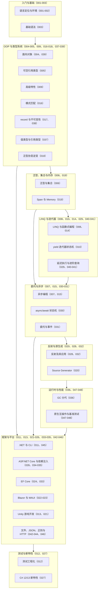

## 前置知识

本文是 C# 模块的全局总结，阅读前建议已经过一遍以下内容：

- [C# 是什么：.NET 世界的通用语言](/csharp/001-WhatIsCSharp)：理解 C# 的定位、IL 与 .NET Runtime 的运行模型。
- [C# 面向对象编程](/csharp/004-CSharpOOP)：类、属性、继承与多态是 C# 语法体系的主干。
- [C# 泛型与集合](/csharp/006-CGenericCollection)：泛型与集合是 LINQ、EF Core 与几乎所有工程代码的地基。

## 学习目标

1. 用一张知识地图串联模块全部文档，形成"基础语法 -> OOP 与类型系统 -> 泛型集合 -> LINQ -> 异步 -> 运行时与框架"的完整学习脉络。
2. 能用自己的话复述每个主题的核心概念，并写出对应主题的惯用 C# 代码。
3. 能准确区分 `class` 与 `record`、`IEnumerable<T>` 与 `IQueryable<T>` 等易混淆概念，并说明各自的适用场景。
4. 能识别 `.Result` 死锁、`async void`、EF Core 提前物化、闭包变量捕获等高频陷阱，并给出修正方案。
5. 能基于自检清单定位薄弱环节，规划下一段进阶学习路径。

## 知识地图

下图把模块全部文档按主题分组，箭头大致表示推荐的学习顺序。每个节点标注了对应的文档主题与编号，可以按图索骥回查原文。



## 核心概念回顾

为了让所有示例互相连贯，本文沿用本仓库示例的一贯领域：一个"虚拟歌手音乐平台"，围绕 P 主（producer）、歌姬（virtual singer）、歌曲（song）、演唱会（concert）、应援色（theme color）与粉丝团（fan club）展开。所有代码均可独立运行（框架示例需引入对应 NuGet 包），注释中的编号对应"定义"与"演示"两个阶段。

### 1. 基础语法与记录类型

C# 编译成 IL 中间码，由 .NET Runtime 执行，与 Java 走同一条虚拟机路线但语法表达力更强。`record` 是 C# 9 引入的数据载体类型：位置参数一行声明全部属性，编译器自动合成值相等性、`ToString` 与解构；`with` 表达式基于原对象生成"只改部分字段"的新实例，实现非破坏性更新。配合集合表达式（`[]`）与目标类型 `new`，现代 C# 的样板代码已经压缩到极低（对应文档 001-003、017、027）。

```csharp
// 1. record 一行定义歌姬：编译器自动生成值相等性与 ToString
public record Vsinger(string Name, string ThemeColor, int DebutYear);

public static class Program
{
    public static void Main()
    {
        // 2. 创建实例：位置参数直接映射到 init-only 属性
        var miku = new Vsinger("初音未来", "#39C5BB", 2007);
        // 3. with 表达式：基于原对象创建"改了一个字段"的新副本
        var mikuAnniv = miku with { DebutYear = 2017 };
        // 4. 值相等性：内容相同即相等，与引用无关
        Console.WriteLine(miku == mikuAnniv);  // False（DebutYear 不同）
        Console.WriteLine(miku == new Vsinger("初音未来", "#39C5BB", 2007)); // True
    }
}
```

### 2. 面向对象与模式匹配

C# 的 OOP 包含类与对象、继承与多态、抽象类与接口（接口可带默认实现）、属性与索引器等完整设施。模式匹配则把"判断数据形状并提取数据"合并成一步：`switch` 表达式支持类型模式、属性模式、关系模式与位置模式，能替代冗长的 if-else 链并保持穷举友好。二者结合非常适合表达"根据输入类别分派不同处理"的领域逻辑（对应文档 004、016、039）。

```csharp
// 1. 座位等级：枚举定义演出票档
public enum SeatTier { S, A, B }

public static class TicketDesk
{
    // 2. switch 表达式：声明式映射票价，替代冗长的 if-else 链
    public static decimal Price(SeatTier tier, bool isFanClub) => tier switch
    {
        SeatTier.S when isFanClub => 1280m, // 关系模式 + when 守卫：粉丝团早鸟价
        SeatTier.S               => 1480m,  // S 区普通价
        SeatTier.A               => 880m,   // A 区统一价
        SeatTier.B               => 480m,   // B 区
        _ => throw new ArgumentOutOfRangeException(nameof(tier)) // 穷举兜底
    };
}
```

### 3. 泛型与集合

与 Java 的类型擦除不同，CLR 泛型是具体化的：`List<int>` 与 `List<string>` 在运行时是不同的类型，值类型泛型还能避免装箱。泛型约束（`where T : IComparable<T>` 等）在编译期声明能力要求；集合家族覆盖 `List<T>`、`Dictionary<TKey,TValue>`、`HashSet<T>`、`Queue<T>`、`Stack<T>` 等场景，只读需求用 `IReadOnlyList<T>` 表达。泛型方法让一份算法实现安全地服务多种类型（对应文档 006、018）。

```csharp
// 1. 泛型方法：为任意类型构建"名次 -> 条目"榜单，编译期保证类型安全
static Dictionary<int, T> BuildChart<T>(IReadOnlyList<T> items)
{
    var chart = new Dictionary<int, T>();
    for (int rank = 1; rank <= items.Count; rank++)
    {
        chart[rank] = items[rank - 1]; // 名次作键，天然规避重复元素
    }
    return chart;
}

// 2. 调用端：集合表达式 + 类型推断，一行构造数据源
List<string> songs = ["千本樱", "Melt", "Tell Your World"];
Dictionary<int, string> chart = BuildChart(songs);
foreach (var (rank, song) in chart) // 3. 解构遍历键值对
{
    Console.WriteLine($"第 {rank} 名：{song}");
}
```

### 4. LINQ 与迭代器

LINQ 把查询能力内嵌进语言：同一套运算符既作用于内存集合（LINQ to Objects），也能被 EF Core 翻译成 SQL。核心心智模型是"查询是描述，不是执行"——`Where`、`Select`、`OrderBy` 只是构建查询计划，真正触发执行的是 `ToList`、`Count` 等终结操作，或 `foreach` 的枚举动作。`yield return` 迭代器方法用状态机实现同样的惰性语义，按需产出元素而不创建中间集合（对应文档 008、010、014、029）。

```csharp
// 1. 记录类型承载歌曲数据
record Song(string Title, string Producer, long PlayCount);

// 2. 迭代器方法：yield return 惰性产出，边筛选边消费，不建中间集合
static IEnumerable<string> HitTitles(IEnumerable<Song> songs)
{
    foreach (var s in songs)
    {
        if (s.PlayCount > 7_000_000L)
            yield return $"{s.Title}（{s.Producer}）";
    }
}

// 3. LINQ 与迭代器语义等价：Where/Select 同样是延迟执行的查询描述
List<Song> songs =
[
    new("千本樱", "黑兔P", 9_800_000L),
    new("Melt", "Rika", 6_100_000L),
    new("Tell Your World", "kz", 7_500_000L),
];
foreach (var title in songs.Where(s => s.PlayCount > 7_000_000L)
                           .Select(s => $"{s.Title}（{s.Producer}）"))
{
    Console.WriteLine(title);
}
```

### 5. 异步编程

C# 5 的 `async/await` 重新定义了异步编程：`async` 方法被编译器改写成状态机，`await` 处挂起并在任务完成后续接，期间线程归还线程池，不占用资源。并发等待用 `Task.WhenAll`；CPU 密集型工作交给 `Task.Run`；高频同步完成的路径可用 `ValueTask` 减少分配。纪律只有一条：异步一路到底，任何位置都不允许用 `.Result` 或 `.Wait()` 同步阻塞（对应文档 007、015、030）。

```csharp
// 1. 两个模拟 I/O 任务：查场馆排期与应援棒库存
static async Task<string> QueryVenueAsync(string venue)
{
    await Task.Delay(100); // 模拟网络 I/O，await 期间线程被归还线程池
    return venue;
}

static async Task<string> QueryStockAsync(string color)
{
    await Task.Delay(150); // 模拟数据库查询
    return $"{color} x 500";
}

// 2. 入口：Task.WhenAll 并发等待多个异步操作
static async Task Main()
{
    string[] results = await Task.WhenAll(
        QueryVenueAsync("横滨体育馆"),
        QueryStockAsync("#39C5BB"));
    // 3. 两个任务在时间上重叠，总耗时约等于最慢者
    Console.WriteLine($"场馆：{results[0]}，应援棒库存：{results[1]}");
}
```

### 6. 委托与事件

委托是类型安全的函数引用，是 Lambda、LINQ 与回调的底层机制；多播委托用 `+`/`-` 组合多个调用目标。事件是委托的封装：发布者声明 `event` 字段，外部只能 `+=` 订阅与 `-=` 退订，不能直接赋值或触发，从而形成清晰的"发布-订阅"边界。触发事件前先拷贝到局部变量并判空（或直接用 `?.Invoke`），这是线程安全的标准写法（对应文档 031）。

```csharp
// 1. 事件参数：承载出票信息
public record TicketSoldArgs(string Singer, string Seat);

// 2. 发布者：售票系统在出票时触发事件
public class TicketOffice
{
    // 可空标注：事件触发前可能没有订阅者
    public event EventHandler<TicketSoldArgs>? TicketSold;

    public void Sell(string singer, string seat)
    {
        // 3. ?.Invoke：无订阅者时静默跳过，避免 NullReferenceException
        TicketSold?.Invoke(this, new TicketSoldArgs(singer, seat));
    }
}

// 4. 订阅者：粉丝团监听出票并刷新应援榜
var office = new TicketOffice();
office.TicketSold += (_, e) => Console.WriteLine($"{e.Singer} 售出 {e.Seat}");
office.Sell("初音未来", "S区-12排-08座");
```

### 7. 值类型、引用类型与可空引用类型

`struct` 与 `class` 的本质差异在复制语义：结构体按值复制、无额外堆分配，适合小型只读数据（`readonly record struct` 是理想形态）；类按引用共享，适合有标识的领域对象。可空引用类型（C# 8 起）把 null 信息放进编译器视野：`string` 保证非空，`string?` 允许为空，编译器对可空成员强制做流分析检查，配合 `?.` 与 `??` 形成完整的空安全写法（对应文档 005、037、038）。

```csharp
#nullable enable
// 1. 结构体：小型只读数据用 readonly record struct，按值复制、零堆分配
public readonly record struct Point3D(double X, double Y, double Z);

// 2. 演唱会模型：init 只能在初始化时赋值，可空属性显式标注
public class Concert
{
    public string Title { get; init; } = "";
    public string? Slogan { get; init; } // 应援语可能缺失
}

var c = new Concert { Title = "Magical Mirai 2026" };
// 3. 编译器强制处理可空成员：?. 与 ?? 是标准姿势
int sloganLength = c.Slogan?.Length ?? 0;
Console.WriteLine($"{c.Title}，应援语长度 {sloganLength}");
```

### 8. 框架生态：EF Core 与 ASP.NET Core

EF Core 用 `DbContext` 作为数据库会话入口，`DbSet<T>` 映射数据表，LINQ 查询被翻译成 SQL，迁移体系管理表结构演进。ASP.NET Core 以中间件管道处理请求，Minimal API 让路由声明压缩到几行代码，内置依赖注入贯穿全框架。两条线共同依赖前文的语言基础：LINQ 表达式树支撑查询翻译，泛型支撑仓储抽象，委托支撑管道组件（对应文档 024、026、033-035）。

```csharp
// 1. 实体：演唱会与歌曲的一对多关系
public class Concert
{
    public int Id { get; set; }
    public string Venue { get; set; } = "";
    public List<Song> Songs { get; set; } = [];
}

// 2. DbContext：EF Core 的会话入口，DbSet 映射数据表
public class MusicDbContext : DbContext
{
    public DbSet<Concert> Concerts => Set<Concert>();
}

// 3. Minimal API：LINQ 查询由 EF Core 翻译为 SQL，过滤发生在数据库端
app.MapGet("/concerts", async (MusicDbContext db) =>
    await db.Concerts
            .Where(c => c.Songs.Count > 5) // 曲目数大于 5 的演唱会
            .OrderBy(c => c.Venue)
            .ToListAsync());
```

## 易混淆概念对比

### `class` 与 `record`

| 对比项 | `class` | `record` |
| --- | --- | --- |
| 相等性 | 引用相等（除非手动重写） | 编译器合成值相等性 |
| 可变性 | 成员可自由声明 set | 推荐 init/位置参数，趋近不可变 |
| 复制方式 | 赋值只复制引用 | `with` 表达式创建新实例 |
| `ToString` | 默认输出类型名 | 自动生成属性清单 |
| 设计定位 | 有行为与标识的领域对象 | DTO、值对象、不可变消息 |
| 与 struct 组合 | 无 | `record struct` 兼得值语义与值相等 |

### `IEnumerable<T>` 与 `IQueryable<T>`

| 对比项 | `IEnumerable<T>` | `IQueryable<T>` |
| --- | --- | --- |
| 执行位置 | 内存中（客户端逐元素枚举） | 数据库端（表达式树翻译成 SQL） |
| 查询表示 | 编译为委托 | 保存为表达式树 |
| 延迟执行 | 是，但数据可能已全部加载 | 查询延迟到枚举或 `ToListAsync` |
| 过滤时机 | `ToList` 之后再过滤等于全表加载 | `Where` 被翻译进 SQL 的 WHERE 子句 |
| 典型场景 | LINQ to Objects、已物化数据 | EF Core、LINQ Provider 场景 |

## 常见误区与排查

1. **用 `.Result` 或 `.Wait()` 同步等待异步任务**。这会阻塞线程并可能造成死锁（尤其在存在同步上下文的 UI 或经典 ASP.NET 环境），吞吐也随阻塞急剧下降。

```csharp
// 错误：同步阻塞等待异步结果，存在死锁与线程浪费风险
string venue = QueryVenueAsync().Result;
// 修正：async 一路到底，用 await 释放线程
string venueFixed = await QueryVenueAsync();
```

2. **`async void` 充当业务方法**。`async void` 的异常无处可接，会直接击穿进程；只有事件处理器这类"框架要求的void 签名"才允许使用。

```csharp
// 错误：异常无人接收，进程直接崩溃
public async void ProcessOrders()
{
    await SellTicketsAsync();
}
// 修正：返回 Task，由调用方 await 并处理异常
public async Task ProcessOrdersAsync()
{
    await SellTicketsAsync();
}
```

3. **EF Core 查询提前物化**。先 `ToList` 再过滤，会把整表数据拉进内存，数据库端的索引与 WHERE 子句全部失效。

```csharp
// 错误：整表加载进内存后才过滤
var hits = db.Songs.ToList().Where(s => s.PlayCount > 7_000_000L);
// 修正：保持 IQueryable，把过滤翻译进 SQL，最后才物化
var hitsFixed = await db.Songs
    .Where(s => s.PlayCount > 7_000_000L)
    .ToListAsync();
```

4. **闭包捕获循环变量**。`for` 循环变量在整个循环中是同一个作用域，Lambda 捕获的是"变量本身"而不是当时的值。

```csharp
var actions = new List<Action>();
// 错误：三个 Lambda 共享同一个 i，循环结束时 i 已变为 4
for (int i = 1; i <= 3; i++)
    actions.Add(() => Console.WriteLine($"第 {i} 首歌")); // 输出 4,4,4
// 修正：循环体内复制到局部变量，每次迭代产生新的捕获
for (int i = 1; i <= 3; i++)
{
    int songNo = i;
    actions.Add(() => Console.WriteLine($"第 {songNo} 首歌"));
}
```

5. **事件订阅后不退订导致内存泄漏**。长生命周期发布者会通过事件持有短生命周期订阅者的引用，阻止其被垃圾回收。

```csharp
// 错误：页面注册后从不退订，排行榜服务一直持有页面引用
leaderboard.VoteChanged += OnVoteChanged;
// 修正：页面关闭或 Dispose 时退订，解除引用
public void Dispose()
{
    leaderboard.VoteChanged -= OnVoteChanged;
}
```

6. **误以为 `with` 是深拷贝**。`with` 只复制属性值，引用类型成员仍指向原对象，克隆后修改内层数据会互相污染。

```csharp
public record Setlist(List<string> Songs);
var a = new Setlist(new() { "千本樱" });
var b = a with { };   // 错误：Songs 仍指向同一个 List 实例
b.Songs.Add("Melt");  // a 的数据也被污染
// 修正：with 时显式重建引用类型成员
var c = a with { Songs = new List<string>(a.Songs) };
```

## 自检清单

- [ ] 能解释 C# 编译为 IL、由 .NET Runtime 执行的运行模型，以及 .NET 的跨平台边界。
- [ ] 能使用 `record` 与 `with` 表达式实现不可变数据模型的非破坏性更新。
- [ ] 能用 `switch` 表达式与属性模式、关系模式重构复杂分支逻辑。
- [ ] 能说明 CLR 具体化泛型与 Java 擦除式泛型的差异及其对值类型的影响。
- [ ] 能写出一条 LINQ 查询，并解释延迟执行与终结操作的触发时机。
- [ ] 能正确使用 `async/await` 与 `Task.WhenAll`，并说明 await 期间线程的去向。
- [ ] 能声明并触发事件，说明事件与多播委托的关系及线程安全触发方式。
- [ ] 能区分值类型与引用类型的赋值、复制语义，并正确选用 `readonly record struct`。
- [ ] 能在 EF Core 中保持 `IQueryable` 直到真正需要数据，避免客户端求值。
- [ ] 能说明 ASP.NET Core 中间件管道的执行顺序与 Minimal API 的注册方式。

## 后续学习路径

如果自检中发现薄弱环节，建议按以下顺序回到模块文档回炉，再向进阶主题推进：

1. **深入异步**：[C# 异步编程详解](/csharp/015-AsyncProgrammingDetailed) 与 [async/await 状态机](/csharp/030-AsyncAwaitStateMachine)，从"会用"进阶到"理解编译器生成的状态机"。
2. **深挖 LINQ**：[LINQ 深度剖析](/csharp/014-LINQDeep) 与 [延迟执行与立即执行](/csharp/029-LINQDeferredImmediate)，掌握表达式树与查询翻译的边界。
3. **打通框架链路**：[C# 与 EF Core](/csharp/024-CSharpEFCore)、[C# 依赖注入](/csharp/025-CSharpDependencyInjection) 与 [ASP.NET Core 中间件管道](/csharp/034-AspNetCoreMiddlewarePipeline)，构建完整的服务端知识体系。
4. **关注运行时性能**：[GC 分代](/csharp/036-GCGeneration)、[Span 与 Memory](/csharp/019-SpanMemory) 与 [.NET 性能与基准测试](/csharp/048-DotnetPerformanceBenchmarking)，学会用数据驱动优化。
5. **拓展平台方向**：游戏方向进入 [C# 与 Unity 游戏开发](/csharp/021-CSharpUnityGameDev)，客户端方向了解 [C# 与 MAUI](/csharp/023-CSharpMAUI) 与 [C# 与 Blazor](/csharp/022-CSharpBlazor)。
