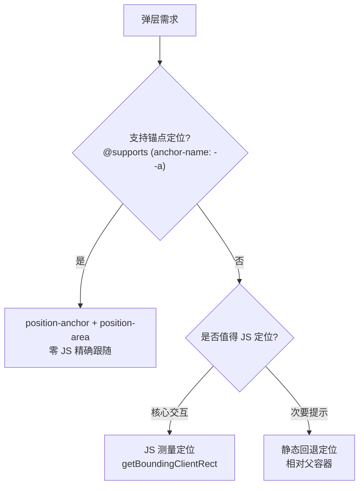

## 1. 学习目标与痛点引入

读完本篇你应该能：

- 写出 `@supports` 的正向、反向与组合检测，并解释每种写法适合的场景；
- 在 JS 里用 `CSS.supports()` 做同一件事；
- 用“基础样式 + 增强样式”的两层结构，把锚点定位、`:has()` 这类新特性安全地引入项目。

先看痛点。假设你想给弹层用上锚点定位（`css/470-CSSAnchorPositioning`），但不可能要求所有用户都用最新浏览器。直接写会怎样？

```css
/* 直接写新特性：支持的浏览器正常，不支持的浏览器弹层位置错乱 */
.tooltip {
  position: absolute;
  position-anchor: --trigger;
  position-area: top;
}
```

关键认知：CSS 对**不认识的属性/值**的默认处理是“丢弃该条声明”，其余声明照常生效——这就是所谓的**容错回退**。单条声明（比如 `accent-color`）可以靠这个机制裸用；但锚点定位这类**多条声明协同**的特性，只丢一条就整体错乱。这时候需要一种“先问浏览器支持不支持，再决定用哪套样式”的机制——特性查询 `@supports`。

类比：`@supports` 之于 CSS，就像 `if ('serviceWorker' in navigator)` 之于 JS——**能力检测**，而不是版本检测。判断依据永远是“这个浏览器认不认这个属性值”，而不是“这个浏览器是第几版”。

## 2. @supports 基本语法

```css
/* 支持时启用：括号里是一条“属性: 值”测试 */
@supports (display: grid) {
  .container {
    display: grid;
    grid-template-columns: 1fr 1fr;
  }
}

/* 反向检测：不支持时给兜底提示或替代方案 */
@supports not (display: grid) {
  .notice {
    display: block; /* 旧浏览器的替代布局 */
  }
}
```

工作机制：浏览器**解析**括号里的声明，判断它在自己当前实现里是否有效，据此决定是否应用块内样式。块内样式不需要重复外层选择器——`@supports` 只是包住一段样式，不是继承作用域。

三个逻辑操作符可以任意组合：

```css
/* and：多个条件都要成立 */
@supports (display: grid) and (gap: 1rem) { }

/* or：任一成立即可，常用于新旧属性名并存的过渡期 */
@supports (backdrop-filter: blur(4px)) or (-webkit-backdrop-filter: blur(4px)) { }

/* not 与 and 组合：not 优先级更高，括号可读性更好 */
@supports (display: grid) and (not (gap: 1rem)) { }
```

## 3. 三类典型检测：属性、选择器、自定义属性

### 3.1 属性值检测

最常见的形态，直接测“属性： 值”：

```css
@supports (backdrop-filter: blur(10px)) {
  .glass {
    backdrop-filter: blur(10px);
    background: rgb(255 255 255 / 60%);
  }
}

@supports (aspect-ratio: 1 / 1) {
  .video {
    aspect-ratio: 16 / 9;
  }
}
```

### 3.2 选择器检测：selector()

`:has()` 这类**选择器**不能用“(属性： 值)”检测，要用 `selector()` 函数包裹：

```css
/* 检测 :has() 是否支持 */
@supports selector(:has(*)) {
  .card:has(.badge) {
    border-color: gold;
  }
}

/* 检测伪元素与后代组合 */
@supports selector(a::after) {
  .link::after {
    content: " ↗";
  }
}
```

记忆点：**属性用括号，选择器用 `selector()`**。混用是新手最高频的错误。

### 3.3 检测的“假阴性”与“假阳性”

两个容易意外的行为：

- **假阴性（明明支持却说不支持）**：写了一个该浏览器不认识的值，比如 `@supports (field-sizing: content)` 在老浏览器里为假——这是正确行为；但如果写成 `@supports (color: red)` 之类几乎恒真的测试就没意义。测试值要选**该特性独有的值**，别用通用值。
- **假阳性（说不支持其实是部分支持）**：浏览器可能支持 `(text-box-trim: trim-both)` 但不支持其配套的 `text-box-edge` 全部取值。重要特性建议测**最小可用组合**，例如 `@supports (anchor-name: --a) and (position-area: top)`。

## 4. JS 侧：CSS.supports()

CSSOM 暴露了同功能的 JS 接口，适合“根据能力切换交互逻辑”的场景（比如不支持时挂上 JS 定位方案）：

```javascript
// 形式一：属性名 + 值，两个参数
if (CSS.supports('display', 'grid')) {
  document.body.classList.add('has-grid');
}

// 形式二：完整条件字符串（与 @supports 语法一致）
if (CSS.supports('(display: grid) and (gap: 1rem)')) { /* ... */ }

// 选择器检测用 supports('selector(...)') 形式
if (CSS.supports('selector(:has(*))')) {
  initEnhancedCards();
} else {
  initLegacyCards(); // 回退到 JS 方案
}
```

注意：`CSS.supports` 在极老环境可能未定义，调用前可加 `window.CSS && CSS.supports` 守卫。

## 5. 渐进增强：标准代码结构

特性查询的正确姿势不是“处处检测”，而是固定的两层结构——**基础层写在前面无条件生效，增强层包在 @supports 里覆盖**：

```css
/* 基础层：所有浏览器可用，保证功能完整 */
.tooltip {
  position: absolute;
  bottom: calc(100% + 8px); /* 相对父容器定位，够用但不精确跟随 */
  left: 50%;
  transform: translateX(-50%);
}

/* 增强层：支持锚点定位时切换为精确方案（css/051） */
@supports (anchor-name: --a) {
  .tooltip {
    bottom: auto;
    left: auto;
    transform: none;
    position-anchor: --trigger;
    position-area: top;
    margin-bottom: 8px;
  }
}
```

三层要点：

1. **增强层必须“完整覆盖”基础层的相关声明**（上面把 `bottom`/`left`/`transform` 全部复位），否则新旧声明混用出诡异布局；
2. 顺序不能反——`@supports` 块要写在基础层之后才能覆盖；
3. 反向写法 `@supports not (...)` 应该克制使用：它让“兜底”出现在主路径上，浏览器一升级就要回访清理；正向写法（增强在前，检测在后）天然面向未来。

## 6. 实战：锚点定位 + 弹层的完整降级链

把本篇与 `css/051` 串起来，一个生产级弹层的样式决策链：



对应 CSS 只需要第 5 节那两段；JS 判断是否挂定位逻辑用第 4 节的 `CSS.supports`。这个结构里每个用户都得到可用的功能，新浏览器得到更好的体验——这正是渐进增强的定义。

## 7. 常见陷阱

| 陷阱 | 症状 | 原因与解法 |
| --- | --- | --- |
| 用 `(属性: 值)` 检测选择器 | 检测恒为假 | 选择器用 `selector(:has(*))` 形式 |
| 增强层漏复位基础层属性 | 新旧声明混用错乱 | `@supports` 内把相关属性全部显式覆盖 |
| 大量 `@supports not` | 技术债随升级堆积 | 正向检测 + 基础层兜底 |
| 检测值太通用 | `@supports (color: red)` 恒真无意义 | 用目标特性独有的值 |
| 把能力检测写成 UA 判断 | 误判、难维护 | 永远检测能力，不检测浏览器 |
| 检测块内重复整页样式 | 维护成本翻倍 | 只写有差异的声明 |

## 动手试试

1. 在控制台执行 `CSS.supports('selector(:has(*))')` 与 `CSS.supports('(text-box-trim: trim-both)')`，对比当前浏览器的能力；
2. 用 `@supports (anchor-name: --a)` 给一个 tooltip 做渐进增强（完整对照 `css/051`）；
3. 写一个 `and` + `not` 的组合检测，验证括号分组；
4. 故意把增强层写在基础层前面，观察覆盖失效；
5. 进阶挑战：结合 `@supports` 与 `prefers-reduced-motion`，做一个“支持且允许动效才启用动画”的样式开关。

## 核心知识点

> 一句话记住特性查询：`@supports (属性: 值)` 测属性、`@supports selector(...)` 测选择器；基础样式写前面，增强样式包检测里，永远面向未来正向检测。

- 语法三件套：`(prop: value)`、`selector(sel)`、`and` / `or` / `not` 组合；
- JS 侧 `CSS.supports('display', 'grid')` 与 CSS 侧语义一致；
- 渐进增强标准结构：基础层无条件 + 增强层 `@supports` 全量覆盖；
- 正向检测优于 `not` 反向检测；
- 能力检测不等于版本检测，别碰 UA 嗅探。

## 注意事项与改进建议

| 问题点 | 说明 | 改进方案 |
| --- | --- | --- |
| 过度嵌套 @supports | 可读性差 | 保持一层，逻辑拆分 |
| 检测粒度太粗 | 部分支持被误判 | 测最小可用组合 |
| 忘记兜底 | 不支持时功能缺失 | 先写基础层再增强 |
| 检测结果硬编码 | 环境变化后失效 | 检测逻辑集中管理 |

## 扩展学习

- 新特性总览与各特性的支持状态：`css/650-CSSNewFeatures`；
- 锚点定位（特性查询的典型应用对象）：`css/470-CSSAnchorPositioning`；
- 层叠层（比 @supports 更优雅的优先级治理）：`css/450-CascadeLayer`；
- 自定义属性与 @property：`css/410-CSSVariableCustomAttribute`；
- CSS 函数与 @supports 回退：`css/120-CSSFunctions`。
