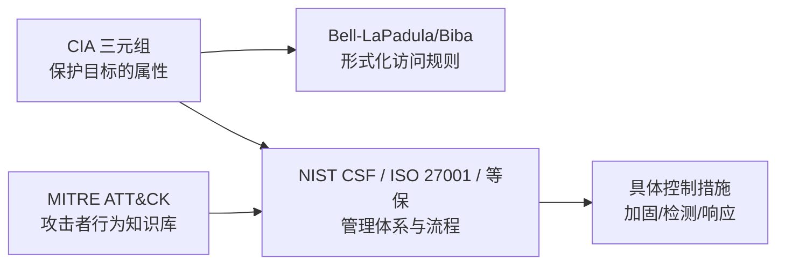

## 1. 为什么安全需要「模型」

安全工程的第一步不是买设备，而是回答三个抽象问题：**保护什么（资产与属性）、
防到什么程度（威胁与风险）、怎么组织工作（流程与职责）**。模型与框架就是这些问题的
现成答案框架。它们各管一段，先把地图画清楚：



## 2. CIA 三元组与扩展属性

### 2.1 三属性与经典反例

| 属性   | 定义                   | 典型威胁         | 经典反例                     |
| :----- | :--------------------- | :--------------- | :--------------------------- |
| 机密性 | 信息不被未授权访问     | 窃听、拖库、社工 | 数据库备份放在公网可下载目录 |
| 完整性 | 信息不被未授权篡改     | 篡改、伪造、重放 | 转账金额在传输中被中间人修改 |
| 可用性 | 授权用户可以正常访问   | DDoS、勒索、误删 | 勒索软件加密文件服务器       |

记忆锚点：用「给朋友寄一份签了名的合同」思考——信封加密（机密性）、签名防改
（完整性）、EMS 确保能送达（可用性）。

### 2.2 扩展属性

- **真实性**：主体身份可被验证（对应认证机制）。
- **不可否认性**：操作后无法抵赖，通常靠数字签名实现（见 016-AsymmetricEncryption）。
- **可追溯性**：行为可还原到主体与时间（对应审计与日志，见 058-AuditdCommands）。
- **可控性**：对信息流动与权限的控制能力（对应 DLP、权限管理）。

工程含义：任何安全方案都应先声明它保护的是哪个属性——「买防火墙」不是目标，
「保护订单数据的机密性与完整性」才是。

## 3. 形式化安全模型

### 3.1 Bell-LaPadula（保密性模型）

军队多级保密场景的模型，两条规则共同保证「机密不下泄」：

```text
简单安全属性（不上读）：低密级主体不能读高密级对象
* 属性（不下写）      ：高密级主体不能向低密级对象写入
```

- 类比：实习生不能拆公司的保险柜（不上读）；高管不能把机密文件放进公开共享盘
  （不下写）。
- 它只管保密性、不管完整性——这正是 Biba 要补的。

### 3.2 Biba（完整性模型）

与 BLP 方向完全相反，两条规则共同保证「不可信来源不能污染高完整性数据」：

```text
简单完整属性（不下读）：高完整性主体不能读低完整性数据（防止被低质数据影响）
* 完整属性（不上写）  ：低完整性主体不能写高完整性对象
```

- 类比：财务系统只信审计过的账目（不下读）；测试环境代码不能直接合并进生产仓库
  （不上写）。
- 记忆技巧：BLP 防「秘密流出」、Biba 防「脏数据流入」，箭头方向恰好相反。
- 现代延伸：完整性模型的思想在流水线（构建制品签名）、完整性度量（IMA、
  057-AIDEFileIntegrity）中随处可见。

## 4. 管理框架三件套

### 4.1 NIST 网络安全框架（CSF）

五大功能构成风险管理的闭环（2018 版为 Identify/Protect/Detect/Respond/Recover；
2024 年发布的 CSF 2.0 新增 Govern，强调治理先行）：

| 功能     | 关键活动                       | 常见落地物           |
| :------- | :----------------------------- | :------------------- |
| 识别 Identify | 资产清点、风险评估         | 资产台账、风险登记册 |
| 保护 Protect | 访问控制、培训、数据安全   | 基线、MFA、加密      |
| 检测 Detect | 监控、异常分析             | SIEM 规则、告警      |
| 响应 Respond | 事件处置、沟通             | 应急预案（见 015-IncidentResponse） |
| 恢复 Recover | 恢复计划、改进             | 备份演练、复盘报告   |

用途：自评成熟度、向上汇报的通用语言、对标找缺口的清单。

### 4.2 ISO/IEC 27001

信息安全管理体系（ISMS）标准，核心是 **PDCA 循环 + 认证审核**：

```text
Plan   ：定范围 → 风险评估 → 选择 Annex A 控制措施 → 风险处置计划
Do     ：实施控制、培训、运行
Check  ：内审、管理评审、指标监控
Act    ：纠正与持续改进
```

27001 是「可认证」的管理标准（证明你有体系），配套的 ISO 27002 提供控制措施
实施指南。审计员问的不是「防火墙买了吗」，而是「风险评估如何驱动你买了它」。

### 4.3 等保 2.0（国内合规主线）

等级保护把系统按受侵害客体分级（一级至五级），要求「定级备案 → 建设整改 →
等级测评 → 监督检查」，技术与管理双维度核查。三级系统每年测评。
逐项展开与测评周期见 033-SecurityBaseline；此处强调定位：等保是国内准入性合规，
ISO 27001 是国际互认的体系认证，两者可共享大部分控制证据。

## 5. MITRE ATT&CK：攻击者视角的知识库

ATT&CK 把真实攻击者的行为整理成「战术（为什么做）→ 技术/子技术（怎么做）」
矩阵，从侦察到影响共 14 个战术（企业矩阵）。它不是合规框架，而是**攻防对表的字典**：

```text
红队：按 ATT&CK 技术设计攻击场景（如 T1059 命令与脚本解释器）
蓝队：把检测规则映射到 ATT&CK，量化覆盖率、找盲区
情报：用 ATT&CK ID 描述 APT 组织的 TTP（战术、技术与过程）
```

示例：一次典型入侵可在 ATT&CK 上完整标注——钓鱼附件（T1566.001）→
命令执行（T1059）→ 计划任务持久化（T1053）→ 凭证转储（T1003）→ 数据外带（T1041）。
SOC 据此在每段路径布置检测点（见 010-SOC）。

## 6. 怎么组合使用

| 需求                         | 用什么                             |
| :--------------------------- | :--------------------------------- |
| 讲清楚「我们在保护什么」     | CIA + 资产分级                     |
| 设计访问控制策略             | BLP/Biba 思想 + 最小权限           |
| 建立年度安全工作框架         | NIST CSF / ISO 27001 PDCA          |
| 应对国内合规检查             | 等保 2.0                           |
| 衡量检测能力与组织红蓝对抗   | MITRE ATT&CK（含 ATT&CK Evaluations） |

## 7. 常见误区

| 误区                             | 事实                                                   |
| :------------------------------- | :----------------------------------------------------- |
| 「框架 = 合规 = 安全」           | 框架提供组织方式；不落地控制措施与持续运营则只是纸面   |
| 「BLP/Biba 已过时」              | 具体模型少见，但其「读/写方向」思维渗透进每个权限设计  |
| 「过了等保就不用看 ISO」         | 两者范围与受众不同，出海业务通常需要 27001            |
| 「ATT&CK 是威胁建模方法」        | 它是行为知识库；威胁建模（STRIDE 等）另有方法体系     |

## 小结

- **初学者要点**：CIA 三元组是所有安全讨论的原点（记住「加密信封、签名、送达」类比）；
  BLP 防泄密、Biba 防污染；管理侧记住三件套——NIST CSF 管闭环、ISO 27001 管体系认证、
  等保管国内合规；ATT&CK 是攻防对表的攻击行为字典。
- **进阶注意**：框架的价值在「风险驱动」——先风险评估再选控制，避免控制清单空转；
  CSF 2.0 的 Govern 强调治理与角色；ATT&CK 覆盖率是检测建设的好指标，但要用
  红队验证（规则写了 ≠ 检测有效）。
