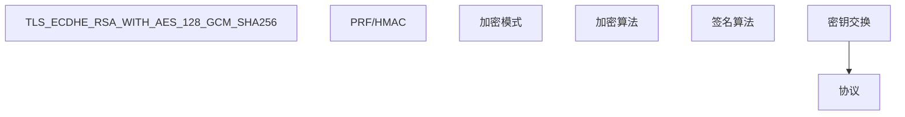

## 1. HTTPS 概述

### 1.1 什么是 HTTPS

HTTPS = HTTP + TLS/SSL，在传输层对 HTTP 通信进行加密，提供：

| 安全属性 | 描述           |
| -------- | -------------- |
| 机密性   | 数据加密传输   |
| 完整性   | 防止数据被篡改 |
| 身份认证 | 验证服务器身份 |

### 1.2 TLS 版本演进

| 版本    | 年份 | 状态     | 安全性      |
| ------- | ---- | -------- | ----------- |
| SSL 3.0 | 1996 | 废弃     | POODLE 攻击 |
| TLS 1.0 | 1999 | 废弃     | BEAST 攻击  |
| TLS 1.1 | 2006 | 废弃     | -           |
| TLS 1.2 | 2008 | 广泛使用 | 安全        |
| TLS 1.3 | 2018 | 推荐     | 最安全      |

## 2. TLS 1.2 握手过程

### 2.1 完整握手流程

```
Client                                          Server
  |                                                |
  |  1. ClientHello                                |
  |  (TLS版本, 密码套件, 随机数Rc, SNI)           |
  |----------------------------------------------->|
  |                                                |
  |  2. ServerHello                                |
  |  (TLS版本, 选定套件, 随机数Rs)                 |
  |  Certificate (服务器证书链)                     |
  |  ServerKeyExchange (DH参数)                    |
  |  ServerHelloDone                               |
  |<-----------------------------------------------|
  |                                                |
  |  3. ClientKeyExchange (DH公钥)                 |
  |  ChangeCipherSpec                              |
  |  Finished                                      |
  |----------------------------------------------->|
  |                                                |
  |  4. ChangeCipherSpec                           |
  |  Finished                                      |
  |<-----------------------------------------------|
  |                                                |
  |  ========== 加密通信开始 ==========            |
```

### 2.2 密钥推导

使用 ECDHE 密钥交换（椭圆曲线临时 Diffie-Hellman）：

1. 双方交换各自的椭圆曲线公钥：$Q_A = d_A \cdot G$、$Q_B = d_B \cdot G$
2. 各自计算共享点（椭圆曲线标量乘法，非模幂运算）：
   $d_A \cdot Q_B = d_B \cdot Q_A = d_A d_B \cdot G$
3. 经 HKDF 从共享密钥推导主密钥与会话密钥（加密密钥、IV 等）

> 注意区分：$g^{ab} \bmod p$ 的模幂形式是**经典 DHE** 的计算方式；
> ECDHE 用的是椭圆曲线点乘，安全性对应「椭圆曲线离散对数问题」。
> 两者都属于「临时（ephemeral）」密钥交换，因此都提供前向保密。

### 2.3 密码套件



## 3. TLS 1.3 握手过程

### 3.1 1-RTT 握手

```
Client                                          Server
  |                                                |
  |  1. ClientHello                                |
  |  (TLS 1.3, 密码套件, DH公钥share, 随机数)     |
  |----------------------------------------------->|
  |                                                |
  |  2. ServerHello                                |
  |  (选定套件, DH公钥share)                       |
  |  EncryptedExtensions                           |
  |  Certificate                                   |
  |  CertificateVerify                             |
  |  Finished                                      |
  |<-----------------------------------------------|
  |                                                |
  |  3. Finished                                   |
  |----------------------------------------------->|
  |                                                |
  |  ========== 加密通信开始 ==========            |
```

### 3.2 TLS 1.3 改进

| 改进           | 描述                          |
| -------------- | ----------------------------- |
| 握手 1-RTT     | 合并密钥交换到 ClientHello    |
| 0-RTT 恢复     | 会话恢复零延迟                |
| 移除不安全算法 | 删除 RSA 静态密钥交换、CBC 模式、RC4、SHA-1 套件等 |
| 强制前向保密   | 仅保留（EC）DHE 类临时密钥交换 |
| 加密更多握手   | ServerHello 之后全部加密      |
| 套件命名简化   | 仅 5 个 AEAD 套件，如 TLS_AES_128_GCM_SHA256、TLS_CHACHA20_POLY1305_SHA256 |

### 3.3 0-RTT 恢复

```
Client                                          Server
  |                                                |
  |  ClientHello + Early Data                      |
  |  (PSK + DH share + 应用数据)                   |
  |----------------------------------------------->|
  |                                                |
  |  ServerHello + New Session Ticket              |
  |  Application Data                              |
  |<-----------------------------------------------|
```

**注意**：0-RTT 数据存在**重放攻击**风险，仅适用于幂等操作。

## 4. 证书验证

### 4.1 验证流程

```
1. 检查证书是否由受信 CA 签发（签名验证）
2. 检查证书域名是否匹配（SAN/CN）
3. 检查证书是否在有效期内
4. 检查证书是否被吊销（OCSP/CRL）
5. 检查证书链完整性
```

### 4.2 主机名验证

```python
import ssl
import socket

context = ssl.create_default_context()
with socket.create_connection(('example.com', 443)) as sock:
    with context.wrap_socket(sock, server_hostname='example.com') as ssock:
        cert = ssock.getpeercert()
        # 自动验证主机名
```

## 5. HTTPS 安全配置

### 5.1 Nginx 配置

```nginx
server {
    listen 443 ssl http2;
    server_name example.com;

    # 证书
    ssl_certificate /etc/ssl/certs/example.com.pem;
    ssl_certificate_key /etc/ssl/private/example.com.key;

    # TLS 版本
    ssl_protocols TLSv1.2 TLSv1.3;

    # 密码套件
    ssl_ciphers ECDHE-ECDSA-AES128-GCM-SHA256:ECDHE-RSA-AES128-GCM-SHA256:ECDHE-ECDSA-AES256-GCM-SHA384:ECDHE-RSA-AES256-GCM-SHA384;

    # 优先服务器密码套件
    ssl_prefer_server_ciphers on;

    # HSTS
    add_header Strict-Transport-Security "max-age=31536000; includeSubDomains; preload" always;

    # OCSP Stapling
    ssl_stapling on;
    ssl_stapling_verify on;
}
```

### 5.2 安全头

| 头                        | 值                                    | 作用           |
| ------------------------- | ------------------------------------- | -------------- |
| Strict-Transport-Security | `max-age=31536000; includeSubDomains` | 强制 HTTPS     |
| X-Content-Type-Options    | `nosniff`                             | 防止 MIME 嗅探 |
| X-Frame-Options           | `DENY`                                | 防止点击劫持   |

## 6. TLS 常见攻击

| 攻击       | 目标            | 防御             |
| ---------- | --------------- | ---------------- |
| BEAST      | TLS 1.0 CBC     | 升级到 TLS 1.2+  |
| POODLE     | SSL 3.0         | 禁用 SSL 3.0     |
| Heartbleed | OpenSSL 实现    | 升级 OpenSSL     |
| Logjam     | DH 512 位       | 使用 2048+ 位 DH |
| ROBOT      | RSA PKCS#1 v1.5 | 使用 RSA-OAEP    |
| Downgrade  | 协议降级        | TLS 1.3 强制     |

## 7. 证书部署最佳实践

| 实践              | 描述                       |
| ----------------- | -------------------------- |
| 自动续期          | 使用 certbot/Let's Encrypt（ACME 协议） |
| 证书监控          | 监控过期时间               |
| CT 日志           | 确保证书被记录             |
| 完美前向保密      | 仅使用 ECDHE 密码套件      |
| HTTP→HTTPS 重定向 | 301 重定向                 |
| HSTS Preload      | 提交到浏览器预加载列表     |

### 7.1 时效补充：证书有效期正在快速缩短

公共 TLS 证书的寿命正走向「以周计」，自动化续期从「最佳实践」变成「生存必需」。
CA/Browser Forum 于 2025 年 4 月通过 SC-081v3 投票，分阶段压缩最长有效期：

| 生效时间     | 公共 TLS 证书最长有效期 |
| :----------- | :---------------------- |
| 2026-03 起   | 200 天                  |
| 2027-03 起   | 100 天                  |
| 2029-03 起   | 47 天                   |

同时域名验证数据的复用期同步缩短（最终仅 10 天）；Let's Encrypt 等已提供/宣布
更短的数天级证书选项。工程含义：任何依赖人工换证书的流程都不可持续，
务必全量 ACME 自动化（含内网专用 CA 的自动化）。

### 7.2 时效补充：后量子混合密钥交换

RSA/ECC 面临「先截获后解密」的量子威胁，主流浏览器与 CDN 已在 TLS 1.3 中默认
启用 **X25519 + ML-KEM（FIPS 203）混合密钥交换**（如 X25519MLKEM768 组合）：
两类算法其一未被攻破即可保证前向机密。新部署的服务端网关应确认其 TLS 栈
（OpenSSL 3.5+ 等）支持混合组，作为平滑过渡的现成方案（背景见 016 第 6 节）。
