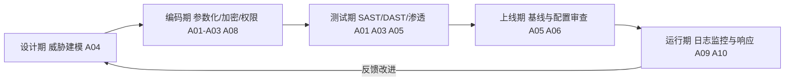

## 1. OWASP Top 10 是什么

OWASP（Open Worldwide Application Security Project，开放全球应用安全项目）每隔数年发布一次
「Web 应用十大安全风险」榜单。它不是漏洞数据库，而是一份**按发生频率与危害程度排序的风险类别
清单**，是安全评审、渗透测试报告与安全培训最常引用的公共基线。

一个类比：OWASP Top 10 之于安全工程师，就像常见病排行榜之于体检中心——它告诉你「最该先查什么」，
但具体某人得没得病，仍要逐项检查（代码审计、扫描、渗透测试）才能确认。

- 当前正式版是 **OWASP Top 10:2021**（2021-09 发布）。
- 2025 更新版截至本文撰写时仍处于候选发布（RC）阶段，正式版请以 owasp.org 为准；
  本文按 2021 正式版逐项展开。

### 1.1 三条贯穿全榜的主线

读榜单前先记住三条主线，十项风险大多是它们的变体：

1. **访问控制与身份的失败**（A01、A07）——「谁在请求」没有被正确验证或授权。
2. **注入与解析失败**（A03、A08、A10）——数据被当成了代码或指令执行。
3. **配置与供应链失败**（A02、A04、A05、A06、A09）——系统本身没被攻破，而是「装错了、漏配了、
   用了带毒的依赖」。

### 1.2 十项风险总览

| 编号 | 英文名                                       | 中文译名           | 一句话本质                     |
| :--- | :------------------------------------------- | :----------------- | :----------------------------- |
| A01  | Broken Access Control                        | 权限控制失效       | 能看/能改不属于自己的数据      |
| A02  | Cryptographic Failures                       | 加密失败           | 敏感数据该加密的没加密、用错   |
| A03  | Injection                                    | 注入               | 数据被当代码执行               |
| A04  | Insecure Design                              | 不安全设计         | 设计阶段就缺少安全控制         |
| A05  | Security Misconfiguration                    | 安全配置错误       | 默认配置、调试接口暴露         |
| A06  | Vulnerable and Outdated Components           | 易受攻击的过时组件 | 依赖库带已知漏洞               |
| A07  | Identification and Authentication Failures   | 身份识别与认证失败 | 登录、会话、凭证管理出问题     |
| A08  | Software and Data Integrity Failures         | 软件与数据完整性失败 | 更新/反序列化/CI-CD 信任链断裂 |
| A09  | Security Logging and Monitoring Failures     | 日志与监控失败     | 出了事没人知道                 |
| A10  | Server-Side Request Forgery (SSRF)           | 服务器端请求伪造   | 服务器替攻击者去访问内网       |

> 与 2017 版相比的最大变化：访问控制从第 5 升到第 1（扫描器难自动发现，但真实世界最常见）；
> 2017 的 A03 敏感信息泄露并入 A02 加密失败；SSRF 首次入榜（云环境元数据服务让它危害倍增）。

## 2. A01 权限控制失效

### 2.1 原理

服务器收到了一个请求，但**没有验证「当前登录用户是否有权操作这个资源」**。注意它与认证的区别：
认证回答「你是谁」，授权回答「你能不能动它」。A01 指的是后者失败。

### 2.2 典型形态与示例

- **水平越权**（改 ID）：普通用户把 URL 里的订单号换别人的。

  ```http
  GET /api/orders/1001 HTTP/1.1     # 自己的订单
  GET /api/orders/1002 HTTP/1.1     # 手工改成别人的订单号，服务器照样返回
  ```

- **垂直越权**（提权）：普通用户直接请求管理员接口，如 `POST /admin/users/delete`。
- **强制浏览**：直接访问未挂菜单的页面 `/admin/backup.zip`。
- **API 返回过量字段**：接口把 `password_hash`、`id_card` 一并返回给前端再由前端隐藏。

### 2.3 检测与修复

检测靠「换身份重放」：用两个测试账号 A、B，把 A 会话里发出的资源请求换成 B 的资源标识重放，
看服务端是否拒绝（Burp Suite 的 Authz 插件即基于此思路）。

修复清单：

- 默认拒绝（deny by default）：除公开路由外，所有接口必须显式经过权限中间件。
- 资源归属校验放在**服务端**，例如 SQL 一并带上租户条件
  `WHERE id = ? AND owner_id = ?`，而不是查出后再判断。
- 不要依赖前端隐藏入口；`_id`、`uuid` 能用不可猜测的标识，但**不可猜测不等于授权**。
- 限制 CORS 与管理接口的来源，关闭目录列表。

## 3. A02 加密失败

### 3.1 原理

不是「密码学被破解」，而是**该用没用、用错强度、用错模式、管不好密钥**。2017 版的
「敏感数据泄露」在 2021 被归并到这里：泄露的根因通常就是加密失败。

### 3.2 常见形态

| 形态             | 例子                                                |
| :--------------- | :-------------------------------------------------- |
| 明文传输         | 站点仍支持 HTTP，或登录接口走 HTTP                  |
| 明文/弱存储      | 密码用 MD5、SHA-1 或无盐哈希存储                    |
| 算法已淘汰       | 使用 DES、3DES、RC4；SHA-1 用于签名                 |
| 用错工作模式     | AES 使用 ECB 模式（相同明文块得到相同密文块）       |
| 密钥管理失败     | 密钥硬编码在源码、使用弱随机数（`Math.random()`）   |
| 传输校验缺失     | 未启用 HSTS，存在 SSL Strip 中间人风险              |

### 3.3 修复基线

```text
传输层   ：全站 HTTPS（TLS 1.2+，推荐 TLS 1.3），启用 HSTS
密码存储 ：Argon2id（首选）/ bcrypt / PBKDF2，绝不裸哈希
数据加密 ：AES-256-GCM 或 ChaCha20-Poly1305（认证加密 AEAD）
随机数   ：CSPRNG（os.urandom / crypto.getRandomValues）
密钥     ：KMS 托管，定期轮换，代码与配置中零硬编码
```

数字签名与证书校验场景必须禁用 SHA-1（2017 年 Google/CWI 实际碰撞，2020 年又出现实用化
chosen-prefix 碰撞），哈希完整性校验同理。

## 4. A03 注入

### 4.1 原理

**不可信数据未经隔离就被解释器执行**。解释器可以是 SQL 引擎、操作系统 shell、LDAP、XPath、
NoSQL 查询，乃至日志解析器。注入类风险的关键防御只有一个方向：让数据永远以「数据」身份进入
解释器（参数化/预编译/转义），而不是靠关键字过滤。

### 4.2 SQL 注入最小示例

```python
# 危险：字符串拼接 —— 用户输入 ' OR '1'='1 即可绕过条件
cursor.execute(f"SELECT * FROM users WHERE name = '{name}'")

# 安全：参数化查询 —— 输入只作为绑定参数，永远不改变语句结构
cursor.execute("SELECT * FROM users WHERE name = %s", (name,))
```

### 4.3 命令注入示例

```python
import subprocess

# 危险：拼接 shell 字符串，文件名带 ; rm -rf / 即可执行任意命令
subprocess.run(f"convert {filename}.png out.jpg", shell=True)

# 安全：列表参数 + 不经过 shell 解析
subprocess.run(["convert", f"{filename}.png", "out.jpg"], shell=False)
```

### 4.4 检测与修复

- 代码审计搜危险汇聚点：`execute(`、`os.system`、`exec`、`eval`、`Runtime.exec`。
- 测试用探针：`'`、`"; sleep 5 --`、`$(id)`、`${7*7}`，观察响应差异或延迟。
- 修复优先级：参数化查询 > 最小权限数据库账号 > 输入白名单校验 > WAF（最后防线）。
- 专项展开见本模块 044-SQLInjection 与 048-CommandInjection。

## 5. A04 不安全设计

### 5.1 原理

代码可能一行 bug 都没有，但**设计上就没有对应的安全控制**。典型例子：

- 「找回密码」按安全问题验证身份——答案常可从社交网络猜到；
- 电商折扣逻辑允许「负数数量」下单，直接给自己退款；
- 内部系统与公网应用共用同一套无二次验证的管理入口。

设计缺陷无法靠扫描器发现，修复成本也最高，因此 OWASP 强调**安全左移**：
在设计阶段做威胁建模（如 STRIDE）、明确信任边界、为每个敏感操作写「滥用场景」。

### 5.2 防御要点

- 需求评审时增加一条「攻击者会怎么滥用这个功能」的讨论。
- 安全关键流程（支付、找回密码、权限变更）强制服务端状态机 + 限额 + 二次确认。
- 复用成熟的模式：不自制加密协议、不自制 Token 格式。

## 6. A05 安全配置错误

### 6.1 原理

应用栈的任何一层（操作系统、中间件、框架、云服务）以**不安全的默认或不完整的自定义配置**
运行。云时代配置错误高发：对象存储公开可读、安全组对 `0.0.0.0/0` 全开、调试端点暴露。

### 6.2 高频清单

```text
默认凭证       ：admin/admin、默认 API Key 未修改
调试暴露       ：Django DEBUG=True、Swagger 公网可访问、phpinfo() 残留
目录列表       ：Nginx autoindex on 导致源码/备份可下载
冗余功能       ：未用的端口、示例应用、测试账号未移除
错误信息       ：500 页面回显完整堆栈与 SQL
云配置         ：S3/OSS 桶公开读写、IAM 策略 Action: "*"、元数据 v1 未禁用
```

修复思路是**基线化 + 自动化**：为每类环境维护加固基线（见本模块 033-SecurityBaseline），
用 IaC（Terraform/Ansible）+ 扫描（kube-bench、tfsec、CIS-CAT）保证漂移可发现。

## 7. A06 易受攻击的过时组件

### 7.1 原理

现代应用 80% 以上代码来自开源依赖。某个间接依赖带着已公开利用的 CVE，就等于大门挂锁却开着窗。
经典案例：Log4Shell（CVE-2021-44228，Log4j2）几乎波及所有 Java 生态。

### 7.2 治理方法

```bash
# 持续盘点依赖并比对漏洞库（SCA，软件成分分析）
npm audit                    # Node.js
pip-audit                    # Python
trivy fs --scanners vuln .   # 通用文件系统/容器
```

- 建立**软件物料清单（SBOM）**，出 0day 时能在分钟级回答「我们用没用」。
- 关注「已知被利用漏洞」目录（CISA KEV），优先修复在野利用项。
- 锁定版本 + 定期升级，而不是无限期钉死旧版本。

## 8. A07 身份识别与认证失败

### 8.1 原理

确认「你是谁」的机制存在缺陷：弱密码、凭证填充、会话固定、忘记登出、
找回密码可被接管。注意 2021 版名称从 2017 的「认证失败」扩展为
「身份识别与认证失败」，把**注册、登录、会话、凭证恢复**全链路纳入。

### 8.2 修复清单

```text
密码     ：检查泄露库（如 Have I Been Pwned API）、最小长度 8+、禁默认弱口令
MFA      ：对高价值操作强制多因素，优先 FIDO2/OTP 而非短信
会话     ：登录后更换 Session ID；设置合理过期；登出即失效
限流     ：登录/找回接口按账号与 IP 双维度指数退避
找回     ：一次性短时效 Token，走已验证渠道，不做「安全问题」
```

JWT 相关攻击（alg=none、RS256/HS256 混淆）与 OAuth/OIDC 实践见
本模块 049-OAuth2OIDC 与 032-IdentityAccessManagement。

## 9. A08 软件与数据完整性失败

### 9.1 原理

对**更新、依赖、CI/CD 产物与序列化数据**的完整性验证缺失。三个高频场景：

1. **不安全反序列化**：不可信数据被还原成对象，触发 gadget chain 导致 RCE
   （详见 030-DeserializationVulnerability）。
2. **供应链**：不校验依赖签名/哈希，构建产物可被替换（typosquatting 投毒、
   CI 注入，如 2020 年 SolarWinds 事件）。
3. **自动更新不校验签名**：客户端信任任何 HTTP 下的「更新包」。

### 9.2 防御

- 数字签名验证更新包与制品（sigstore/cosign、GPG 签名）。
- 锁文件 + 哈希校验（`--require-hashes`、`npm ci` + integrity）。
- 反序列化只接受自家格式与白名单类；跨系统数据交换改用 JSON 等无行为语义的格式。
- CI/CD 最小权限、受保护分支、可复现构建。

## 10. A09 日志与监控失败

### 10.1 原理

攻防的时间差完全取决于**检测**。没有日志、日志被篡改、有日志没告警、告警没人看，
都会把一次小入侵拖成大规模失陷。OWASP 的判据很直接：平均检测时间（MTTD）以「天」计即为失败。

### 10.2 落地要点

- 必记事件：登录成功/失败、权限变更、输入校验拒绝、订单与支付状态迁移、管理操作。
- 日志格式结构化（JSON），时间同步（NTP），只追加存储（防篡改），集中到 SIEM（见 010-SOC）。
- 日志本身是敏感数据：不记密码、Token、身份证号全量。
- 用攻击注入测试告警链路（如故意触发一次暴力破解，验证能否收到告警）。

## 11. A10 服务器端请求伪造（SSRF）

### 11.1 原理

服务端「替」攻击者发起请求。常见入口是「URL 预览」「导入远程图片」「Webhook」。
危害随云化放大：云元数据服务（`169.254.169.254`）持有临时凭证，一次 SSRF 可能直接接管主机身份。

```text
POST /fetch {"url": "http://169.254.169.254/latest/meta-data/iam/security-credentials/"}
→ 服务器替攻击者读取云平台实例的 IAM 临时凭证
```

### 11.2 防御分层

```text
应用层   ：URL 白名单（协议+域名）、禁止重定向跟随、解析后校验 IP 不在私网/链路本地段
网络层   ：出网代理 + 出口防火墙，使应用服务器默认无法直连内网与元数据服务
平台层   ：云元数据接口强制 IMDSv2（Token 头校验）、按需最小化 IAM 权限
```

完整利用链与 DNS 重绑定等绕过手法见本模块 011-SSRFAttack。

## 12. 如何把 Top 10 用起来



- **写需求时**：对照 A04 做滥用场景分析。
- **写代码时**：对照 A01/A02/A03 的修复清单自检。
- **提测时**：跑 SCA（A06）与 SAST，渗透测试报告按 Top 10 编号归类。
- **上线后**：配置基线审查（A05）与日志告警演练（A09）。

## 13. 常见误区

| 误区                                   | 事实                                                 |
| :------------------------------------- | :--------------------------------------------------- |
| 「扫描器全绿就符合 Top 10」            | A01/A04 扫描器基本测不出，必须人工越权与设计评审     |
| 「我们用了框架就自动免疫」             | 框架默认安全但一行 `raw`/`dangerouslySetInnerHTML` 即破防 |
| 「Top 10 是合规检查表」                | 它是风险优先级参考，不是「只查十项」的完整标准       |
| 「HTTPS 了就不会有 A02」               | 存储加密、密码哈希、密钥管理同样属于 A02             |
| 「2021 版会很快过时」                  | 2025 更新版仍在 RC，正式发布前 2021 版仍是行业默认基线 |

## 小结

- **初学者要点**：OWASP Top 10 是按风险类别（不是具体漏洞）排序的十大榜单；当前正式版为
  2021 版，2025 更新仍在 RC。记住三条主线——授权失败、注入解析、配置与供应链；每一条的
  第一修复手段分别是服务端归属校验、参数化/转义、基线化自动化。
- **进阶注意**：A01 与 A04 主要依赖人工测试与设计评审；A02 覆盖传输、存储、密钥全链路；
  A08 在云原生与 CI/CD 场景下权重持续上升；A10 的实战危害集中在云元数据与内网横向。
  把 Top 10 当作沟通语言与优先级框架，融入 SDLC 各阶段，而不是上线前的最后一道问卷。
