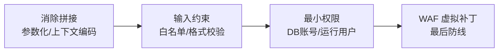

## 1. 本文定位

本模块的专项文档（044-SQLInjection、005-XSSAttack、007-CSRFAttack、011-SSRFAttack、
029-XXEAttack 等）逐类拆解了具体漏洞。本文从**更高视角**回答三个综合问题：

1. 这些漏洞背后共通的失败模式是什么？
2. 把多个漏洞串成攻击链时，防御者该在哪里布防？
3. API 与无状态认证（JWT）时代，漏洞形态发生了什么变化？

前置知识：HTTP 基础与 OWASP Top 10（见 028-OWASPTop10Detailed）。

## 2. 注入与脚本类漏洞的共性原理

SQL 注入、XSS、命令注入、XXE、模板注入……形态各异，失败模式只有一个：

```text
「数据」进入了「代码上下文」，且两者之间没有可靠边界。
```

| 漏洞     | 代码上下文         | 数据逃逸方式         | 边界手段           |
| :------- | :----------------- | :------------------- | :----------------- |
| SQL 注入 | SQL 语句           | 引号闭合、注释截断   | 参数化（预编译）   |
| XSS      | HTML/JS 文档       | 标签闭合、属性逃逸   | 上下文相关输出编码 |
| 命令注入 | shell 命令行       | `;` `\|` `` ` `` 等  | 参数数组、免 shell |
| XXE      | XML 文档           | 实体与 DTD           | 禁用 DTD           |
| 模板注入 | 模板引擎           | `{{ }}` 语法         | 沙箱/不渲染用户输入 |

由此推出通用防御顺序（每层独立有效）：



**检验理解的自测题**：为什么「过滤 `select` 关键字」防不住 SQL 注入，而参数化可以？
——因为过滤依赖枚举攻击语法（可被 `SeLeCt`、`selselectectect` 等绕过），
参数化让用户输入根本不进入 SQL 语法层（数据永远只是值）。

## 3. 越权：Web 攻击的主战场

注入类漏洞因框架默认防护（ORM 参数化、自动转义）逐年减少，而**越权**已是
实战报告中最常见的高危项。两类形态：

```text
水平越权：同级别用户之间互访资源 —— GET /api/orders/1002（把 1001 换成 1002）
垂直越权：低权限用户触达高权限功能 —— 普通用户直接 POST /admin/users/delete
```

### 3.1 为什么越权难防

- 扫描器基本测不出：需要理解「谁的资源」这一业务语义。
- 前端隐藏菜单 ≠ 后端鉴权：SPA 路由守卫只是 UI 层。
- 对象 ID 递增可枚举：`/api/invoice/1001..1050` 遍历即拖库。

### 3.2 系统性防御

```python
# Flask 示例：资源级鉴权中间件（每个数据访问点强制走这个入口）
from functools import wraps
from flask import abort, g

def require_ownership(model):
    def deco(fn):
        @wraps(fn)
        def wrapper(resource_id, *args, **kwargs):
            obj = model.query.get(resource_id)
            # 双重校验：存在性 + 归属（tenant 隔离一并处理）
            if obj is None or (obj.owner_id != g.user.id and not g.user.is_admin):
                abort(404)   # 返回 404 而非 403，不泄露资源存在性
            return fn(obj, *args, **kwargs)
        return wrapper
    return deco

@app.route("/api/orders/<int:oid>")
@require_ownership(Order)
def get_order(order):
    return order.to_dict()
```

配套手段：不可猜测的资源标识（UUID v4）、管理接口独立网段/独立认证、
自动化越权测试（双账号重放，见 028 第 2 节）。

## 4. JWT 与 API 时代的认证安全

### 4.1 无状态 Token 的攻防变化

Session-Cookie 时代的主要威胁是 CSRF 与会话固定；迁到 JWT 后威胁重心转移：

```text
获得的能力            付出的代价
  无状态横向扩展          无法即时吊销（除非引黑名单，又变有状态）
  跨服务传递身份          签名实现错误 = 全面失守（见下）
  自包含声明              载荷明文可读，不能放敏感数据
```

### 4.2 必须在代码层封死的三类错误

```python
# 错误 1：算法从 Token 头读取（攻击者可改为 none 或 RS256→HS256 混淆）
# payload = jwt.decode(token, key, algorithms=[jwt.get_unverified_header(token)["alg"]])

# 正确：算法白名单硬编码
claims = jwt.decode(token, public_key, algorithms=["RS256"],
                    audience="api.example.com",     # 错误 2 的解法：校验 aud
                    issuer="https://idp.example.com",  # 错误 3 的解法：校验 iss
                    options={"require": ["exp", "sub"]})
```

| 错误                | 后果                       | 修复                     |
| :------------------ | :------------------------- | :----------------------- |
| 算法可被 Token 控制 | none 绕过 / 公钥当 HMAC 密钥 | 固定算法白名单         |
| 不校验 aud/iss      | Token 被跨服务重放         | 逐项校验受众与签发者     |
| 长期有效 + 无吊销   | 泄露后长期可用             | 短有效期 + 刷新令牌轮换  |
| 密钥放载荷          | base64 解码即泄露          | 载荷只放标识与过期       |

密钥强度自检（HS256 弱密钥可离线爆破，hashcat -m 16500）与完整攻击手法
见 001 模块 JWT 章节与 032-IdentityAccessManagement。

## 5. API 攻防要点

API 与网页的威胁差异：接口天然可被脚本化调用、返回结构化数据、常缺少「页面级」防线。

```text
认证      ：机器对机器用客户端凭据流程（OAuth 2.0），绝不用用户密码换 token
授权      ：每个端点显式声明所需 scope/角色，拒绝默认放行（见 049-OAuth2OIDC）
输入      ：Schema 校验（JSON Schema/Pydantic）替代手工 if
限流      ：按 API Key + IP + 用户三维度；返回 429 与 Retry-After
数据收缩  ：响应字段按角色过滤，防止对象属性级泄露（序列化层控制）
审计      ：写入/导出类操作全量落日志，含主体、资源、结果
```

OWASP API Security Top 10 把「对象级授权失效（BOLA/IDOR）」「对象属性级授权失效」
列为前二，与上文越权一节互为印证；「无限资源消费」（不限流）与「业务逻辑滥用」
（如批量注册领券）则是扫描器盲区，需业务侧设计防线。

## 6. 完整攻击链分析

以下链路综合了本文各节，展示多漏洞如何组合（渗透测试报告的典型结构）：

```text
1. 信息收集：证书透明度日志发现测试子域 test-api.example.com（见 023-InformationGathering）
2. 入口     ：测试环境 Swagger 未鉴权暴露（A05 安全配置错误）
3. 越权     ：接口 /v1/users/{id} 未校验归属，遍历导出用户手机号（BOLA）
4. 凭证     ：导出数据中含内部 SSO 链接 + state 泄露的 OAuth 授权码（redirect_uri 校验缺失）
5. 横向     ：用泄露的开发账号登录 CI 系统，取得生产数据库只读凭据
6. 影响     ：拖取用户表（机密性破坏）；修改 promo 表加白名单（完整性破坏）
7. 攻击者视角走通后 → 防御映射：
   3 → 服务端归属校验    2 → 环境隔离与资产下线
   4 → redirect_uri 精确匹配 + state  5 → 凭据轮换与最小权限
```

防御启示：**单点防御都会被绕过，链路思维要求每一段路径上都有检测点**——
这正是纵深防御的工程含义。

## 7. 常见陷阱

| 陷阱                             | 事实                                                   |
| :------------------------------- | :----------------------------------------------------- |
| 依赖前端校验或 UI 隐藏           | 服务端才是唯一可信边界                                 |
| 「用了 ORM 就没有注入」          | 原生拼接片段（raw query）仍会打穿 ORM                  |
| 「HTTPS 了接口就安全」           | 传输加密与授权失败是正交问题                           |
| JWT 放 localStorage 就高枕无忧   | XSS 存在时 localStorage 可被读取，前端只存短时内存     |
| 只防「恶意用户」                 | 越权常来自正常用户的随手改 URL，业务语义防线才是关键   |

## 小结

- **初学者要点**：注入类漏洞的统一失败模式是「数据进代码上下文」，统一解法是
  「参数化/编码 + 输入白名单 + 最小权限」；越权是当前 Web 高危主战场，防御核心是
  服务端资源归属校验；JWT 安全取决于「固定算法 + 校验声明 + 短有效期」三件套。
- **进阶注意**：API 时代的风险重心从「注入」转向「授权与滥用」，OWASP API Top 10
  的 BOLA/属性级泄露应作为设计评审必查项；攻击链思维（入口→横向→影响）指导
  纵深防御布点；专项手法请回到各专项文档深入。
