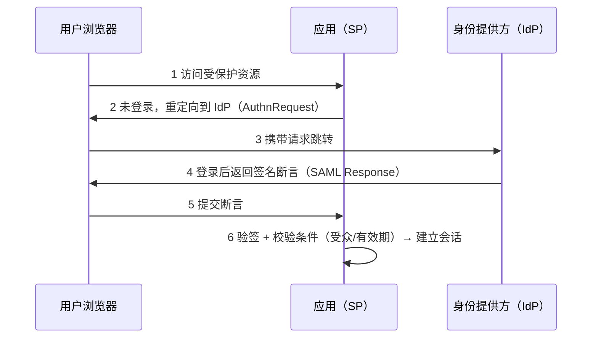

## 1. IAM 全景

身份与访问管理（Identity and Access Management, IAM）回答四个问题：

```text
认证（Authentication）你是谁？       —— 密码、MFA、证书
授权（Authorization）  你能做什么？   —— RBAC/ABAC 策略
审计（Accounting）     你做过了什么？ —— 日志与行为分析
生命周期（Governance） 账号怎么建/改/销？ —— 入职开通、转岗调整、离职回收
```

前两者常用「3A」概括，第四项是最常被忽视、也是审计事故高发区——离职半年仍能登录的
账号是攻防演练的经典发现。企业级 IAM 产品（Okta、Keycloak、Entra ID）与云 IAM
（AWS IAM 等）都在实现这套模型；本文聚焦协议层。

## 2. SSO 单点登录

单点登录的目标：用户在一处认证后，访问多个应用无需重复登录。三个主流协议：

| 协议 | 全称                                | 载体     | 典型场景           |
| :--- | :---------------------------------- | :------- | :----------------- |
| SAML | Security Assertion Markup Language  | XML      | 企业级 Web SSO     |
| CAS  | Central Authentication Service      | 票据     | 高校/老牌企业内网  |
| OIDC | OpenID Connect                      | JSON/JWT | 现代 Web 与移动端  |

### 2.1 SAML：企业 SSO 的老牌标准

SAML 2.0 用 XML 断言在 IdP（身份提供方）与 SP（服务提供方）之间传递认证结果：



安全要点（历史上 SAML 漏洞多出在这里）：

- 断言必须验签，且**校验签名作用域覆盖整段断言**（曾有 XXE 与包装签名绕过）。
- 严格校验 `Audience`（断言只给这个 SP 用）与 `NotBefore/NotOnOrAfter` 时间窗。
- 禁用断言中的 DTD（同样存在 XXE 风险，见 029-XXEAttack）。

### 2.2 CAS：简单直接的票据协议

CAS 流程是「一张票用一次」：应用重定向到 CAS 服务端登录，回跳时带一次性
Service Ticket（ST），应用拿 ST 回服务端验证后建立本地会话。实现简单、
调试直观，适合内网改造遗留系统，但生态与现代特性（API 场景、声明式授权）弱于 OIDC。

## 3. OAuth 2.0：授权框架

### 3.1 先分清两件事

- **OAuth 2.0** 是**授权**框架：让第三方应用在「不拿到用户密码」的前提下，
  获得访问用户资源的有限权限（例如「允许相册应用读取你网盘的照片」）。
- **认证**是 OIDC 在 OAuth 2.0 之上的扩展：登录后额外发一张 **ID Token**
  证明「这个人是谁」。

常见混淆：直接拿 access_token 当「登录成功」的凭证使用——它表达的是
「可以调用哪些 API」，不是「用户已认证且身份为 X」。

### 3.2 授权模式（Grant Types）

| 模式                        | 方向                                   |
| :-------------------------- | :------------------------------------- |
| 授权码 + PKCE（当前标准）   | 有后端的 Web/移动/SPA，一律用它        |
| 客户端凭据                  | 服务对服务（无用户参与）               |
| 刷新令牌                    | 换取新 access_token                    |
| 隐式（Implicit）            | **已废弃**：Token 经前端回调暴露       |
| 密码模式（ROPC）            | **已废弃**：应用接触明文密码           |

OAuth 2.1 草案正是把上表后两项移除、并把 PKCE 变为授权码流程强制项，收敛为
安全默认。客户端实现时按 2.1 的口径执行即可。

### 3.3 安全要点

```text
redirect_uri   ：精确匹配白名单，禁止通配与子路径宽松匹配（防授权码劫持）
state          ：随机值绑定会话，防 CSRF（回调校验）
PKCE           ：code_verifier 只存客户端，code_challenge 上送，公共客户端必选
Token 存储     ：浏览器端尽量不用 localStorage（XSS 可窃取）；HttpOnly Cookie 或内存 + 刷新
最小 scope     ：按需请求权限，审批页与实际能力一致
```

协议细节与命令行实测见 049-OAuth2OIDC。

## 4. OIDC 与 ID Token

OIDC 在授权码流程上增加 `scope=openid`，令牌响应中多出 **ID Token**（一个 JWT）：

```json
{
  "iss": "https://idp.example.com",        // 签发者
  "sub": "user-9f31",                       // 用户唯一标识
  "aud": "app-client-123",                  // 目标客户端
  "exp": 1780000000,                        // 过期时间
  "iat": 1779996400,                        // 签发时间
  "email": "alice@example.com",
  "nonce": "n-0S6_WzA2Mj"                   // 防重放，客户端生成并校验
}
```

资源侧校验清单：验签（用 JWKS 公钥）、`iss`/`aud`/`exp`/`nonce` 逐项核对。
用户详情通过 UserInfo 端点（携带 access_token）获取，而不是把更多声明塞进 ID Token。

## 5. JWT 安全

### 5.1 结构回顾

JWT = `Base64Url(Header).Base64Url(Payload).Signature`。前两段只是 Base64 编码，
**默认不加密**——任何拿到 Token 的人都能读出全部声明，所以载荷中严禁放敏感数据。

### 5.2 三大经典攻击

| 攻击           | 原理                                             | 防御                             |
| :------------- | :----------------------------------------------- | :------------------------------- |
| alg=none       | 把算法改成 none 并删掉签名，部分库「照单全收」   | 验签时强制指定算法白名单         |
| RS256→HS256    | 服务端用「公钥」当 HMAC 密钥验证，攻击者可用公钥自签 | 同上：固定算法，不读 Token 头 |
| 弱密钥爆破     | HS256 密钥是弱口令，可离线字典爆破               | 高熵随机密钥（256 位以上）       |

```python
# 错误：从 Token 头读算法再验证（攻击者可控）
# jwt.decode(token, key, algorithms=[jwt.get_unverified_header(token)["alg"]])

# 正确：算法白名单写死
import jwt
claims = jwt.decode(token, public_key, algorithms=["RS256"], audience="api.example.com")
```

### 5.3 使用准则

- 短有效期（access_token 5-30 分钟）+ 刷新令牌轮换；需要立即失效时配黑名单/短 TTL 网关校验。
- 声明最小化：`sub`、角色、过期即可，业务详情查询接口获取。
- 库与配置固定算法白名单、校验 `iss/aud/exp`，见 001 模块 JWT 章节的自检命令。

## 6. IAM 落地清单

```text
账号生命周期：入职自动开通、转岗自动调整、离职当日回收（与 HR 系统联动）
MFA         ：管理员与远程访问强制；优先 FIDO2/TOTP，短信作兜底
服务账号    ：专人负责、密钥定期轮换、禁止人工登录
权限模型    ：RBAC 为骨架，敏感资源叠加 ABAC（属性）与四眼原则
审计        ：登录/授权变更全量入 SIEM，定期做权限复核（Access Review）
```

## 7. 常见误区

| 误区                             | 事实                                             |
| :------------------------------- | :----------------------------------------------- |
| 「SSO 后内网应用就安全了」       | 会话劫持/设备失陷仍可复用会话，需叠加设备校验与短会话 |
| 「JWT 签了名就不会被篡改」       | 验签实现错误（算法混淆、不校验）等于没签         |
| 「Token 越长越安全」             | 长期有效的 access_token 反而扩大泄露影响窗口     |
| 「OIDC 的 access_token 能取用户信息」 | 取身份看 ID Token 或 UserInfo，不是 access_token |

## 小结

- **初学者要点**：IAM 四件事（认证/授权/审计/生命周期）。SSO 三协议按场景选型：
  企业存量用 SAML、新应用直接 OIDC、内网遗留系统可 CAS。OAuth 管「授权」，
  OIDC 管「认证」，两者别混用。
- **进阶注意**：授权码 + PKCE 是默认流程，隐式与密码模式已废弃（OAuth 2.1 口径）；
  JWT 的安全性取决于验签实现是否固定算法白名单，而非签名本身；账号生命周期与
  权限复核是审计最爱查的薄弱点，务必自动化。
